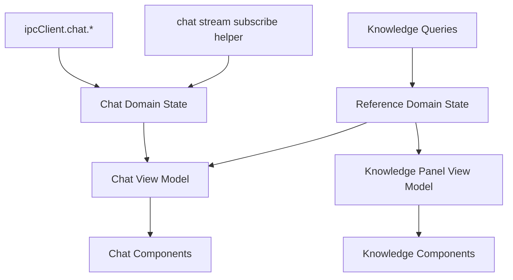
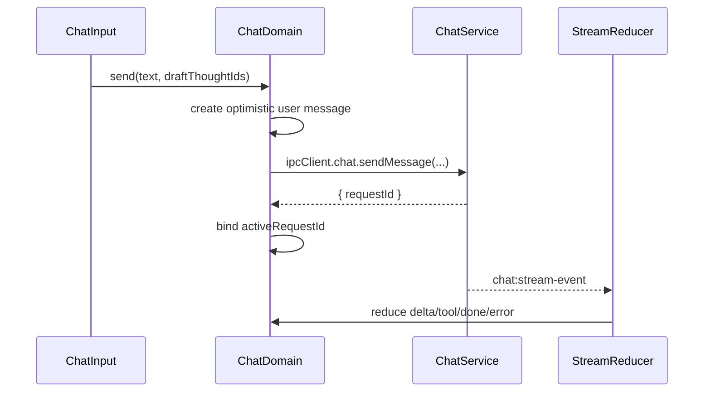
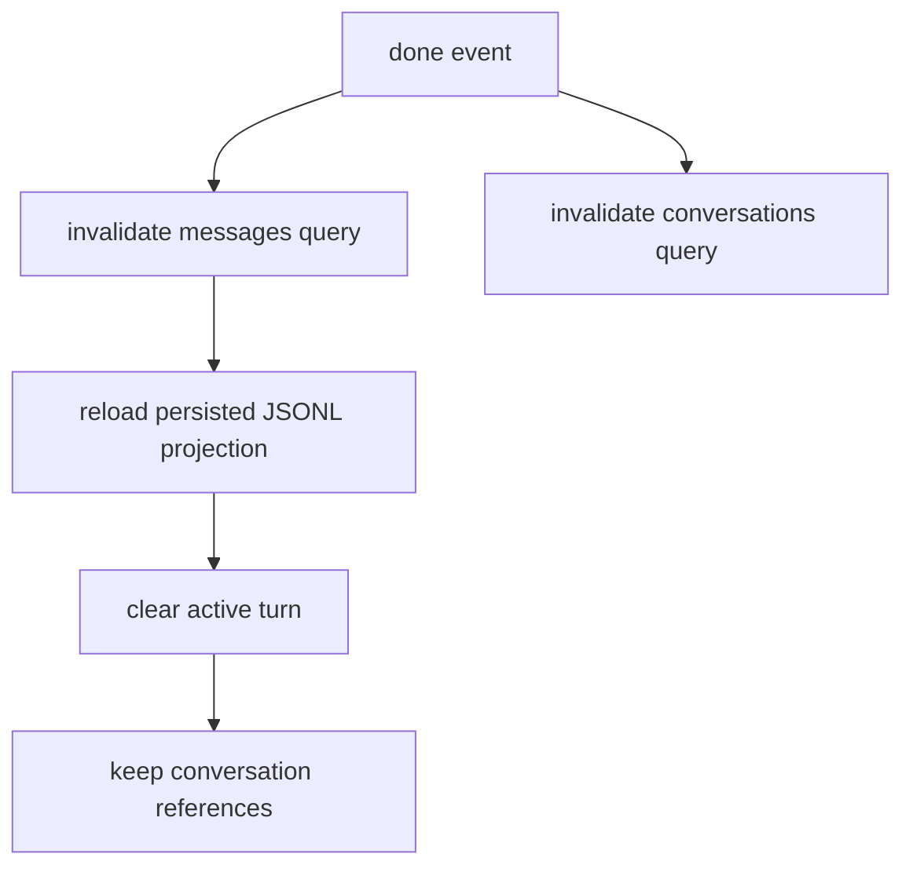

# Agent Chat 前端 State 与模块架构

## 设计目标

基于 [drafts/agent-chat-discovery.md](drafts/agent-chat-discovery.md)，Agent Chat 的前端重点不是“新增一个聊天页”，而是建立一套可复用的对话工作台状态模型。这个模型要同时支撑：

- 当前 MVP 的顶层 Agent/Chat workspace。
- 对话过程中的知识库浏览、搜索、引用和局部图谱查看。
- 未来从 Capture/Contemplate 带着 selected thought/subgraph 进入对话。
- 后端 `chat:stream-event` 的流式输出、tool 确认和会话持久化。

核心原则：**state 可以直接调用 `ipcClient.chat.`*；不要为了包装而引入 IPC 层。只有 `chat:stream-event` 这种需要订阅生命周期管理的事件流，才保留一个薄 helper。conversation/reference/tool 是 domain state，组件只消费 view model。**




## 模块划分

建议把 `apps/electron/src/renderer/src/modules/chat/` 分成三个核心层次，外加一个很薄的 stream 订阅 helper：

### 1. Stream 订阅 Helper

这不是正式的 transport 层，也不包装所有 IPC。RPC 类调用直接使用 `ipcClient.chat.*`；helper 只解决事件订阅的生命周期和 channel 字符串集中管理。

- `stream/on-chat-stream-event.ts`
  - 订阅 `window.ipcRenderer.on("chat:stream-event")`
  - 返回 unsubscribe 函数
  - 输出 `{ requestId, event }`
  - 不做 `requestId` 过滤
  - 不 reduce event
  - 不碰 conversation/reference/tool state

不需要 `chat-api.ts` 这类只转发调用的文件。下面这些调用应直接发生在 state/composable 中：

```ts
await ipcClient.chat.listConversations();
await ipcClient.chat.getMessages(conversationId);
await ipcClient.chat.sendMessage(input);
await ipcClient.chat.confirmToolCall(input);
await ipcClient.chat.cancelStream(input);
```

### 2. Domain State 层

负责业务状态和 reducer，是架构核心。

- `state/chat-session.ts`
  - 当前会话：`activeConversationId`
  - 当前请求：`activeRequestId`
  - 发送状态：`idle | sending | streaming | waiting_tool | error`
- `state/chat-history.ts`
  - Vue Query 管理 conversations/messages
  - 只存后端已确认的历史
  - 不直接存 streaming draft
- `state/chat-turn-reducer.ts`
  - 把 `ChatStreamEvent` reduce 成当前 turn 的临时状态
  - 负责 optimistic user message、assistant draft、tool calls、error/cancelled/done
- `state/chat-references.ts`
  - 当前输入草稿已选择的 `referenceThoughtIds`
  - 当前 conversation 已引用过的 thought 摘要
  - 对外暴露 `addReference`、`removeReference`、`clearDraftReferences`
- `state/knowledge-panel.ts`
  - 右侧面板模式：`browse | search | references | graph`
  - 面板内部选择态：selected category、selected thought、search query、graph focus

### 3. View Model 层

把 domain state 组合成组件可以直接渲染的数据，避免 UI 组件理解后端事件。

- `view-model/useConversationListVM.ts`
  - conversations + active state + create/rename/delete handlers
- `view-model/useChatThreadVM.ts`
  - 历史 messages + 当前 turn draft 合并成 `ThreadItem[]`
  - tool pending/running/result 统一转成 thread item
- `view-model/useMessageDraftVM.ts`
  - 输入文本、草稿引用、canSend、send/cancel
- `view-model/useKnowledgePanelVM.ts`
  - 面板模式、搜索结果、browse 数据、reference list、add/remove reference

### 4. View Components 层

组件保持薄，只负责布局和交互回调。

- `components/ConversationSidebar.tsx`
- `components/ChatThread.tsx`
- `components/ChatInput.tsx`
- `components/ToolApprovalCard.tsx`
- `components/KnowledgePanel.tsx`
- `components/panel/BrowsePanel.tsx`
- `components/panel/SearchPanel.tsx`
- `components/panel/ReferencesPanel.tsx`
- `components/panel/GraphPanel.tsx`

## State 设计

### Conversation State

Conversation 是持久化索引，来源于后端 SQLite conversation table。

```ts
type ConversationState = {
  activeConversationId: string | null;
  conversationsQuery: Query<ConversationDTO[]>;
  messagesQuery: Query<ChatMessageDTO[]>;
};
```

设计约束：

- Conversation list 和 messages 走 Vue Query，因为它们是后端确认过的事实。
- `getMessages(conversationId)` 是历史消息唯一来源，前端不长期缓存完整 transcript。
- `done` 后 invalidate `chat.conversations` 和 `chat.messages:{conversationId}`。

### Active Turn State

Active turn 是一次 `sendMessage` 到 `done/error/cancelled` 之间的临时状态。

```ts
type ActiveTurnState = {
  requestId: string | null;
  conversationId: string;
  status: "idle" | "sending" | "streaming" | "waiting_tool" | "error" | "cancelled";
  optimisticUserMessage: ChatMessageDTO | null;
  assistantDraft: {
    id: string;
    content: string;
  } | null;
  toolCalls: Record<string, ToolCallState>;
  errorMessage: string | null;
};
```

设计约束：

- streaming draft 不写进 Vue Query cache，避免把未确认消息混进历史事实。
- reducer 根据 `requestId` 过滤事件，只处理当前 active turn。
- 用户切换 conversation 时，如果当前 turn 还在跑，需要明确策略：MVP 可以先禁止切换或提示取消。

### Tool State

Tool 不是普通消息，也不是 modal 状态，而是 active turn 的一部分。

```ts
type ToolCallState = {
  toolCallId: string;
  toolName: string;
  input: unknown;
  result?: unknown;
  status: "pending" | "running" | "done" | "error";
  isError?: boolean;
};
```

事件映射：

- `tool_pending` → `pending`，UI 渲染确认卡。
- 用户确认 → 调 `confirmToolCall`，本地可先保持 pending，等待 `tool_running`。
- 用户拒绝 → 调 `rejectToolCall`，本地标记为 done 或 collapsed。
- `tool_running` → `running`。
- `tool_result` → `done/error`。

### Reference State

Reference 是 chat 和知识面板之间的核心共享状态。

```ts
type ReferenceState = {
  draftThoughtIds: string[];
  conversationThoughtIds: string[];
  thoughtSummaries: Record<string, ThoughtSummaryDTO>;
};
```

设计约束：

- `draftThoughtIds` 表示下一条消息要带给 agent 的上下文。
- `conversationThoughtIds` 表示当前对话过程中出现过的引用，用于右侧“引用清单”和局部图谱。
- 所有面板统一调用 `addReference(thoughtId)`，而不是各自拼 `SendMessageInput`。
- 未来 Capture/Contemplate 入口也只需要调用同一个 `addReference` 或初始化 reference state。

### Knowledge Panel State

Knowledge panel 是 chat workspace 内部的“知识浏览工作台”，但不拥有 chat 状态。

```ts
type KnowledgePanelState = {
  mode: "browse" | "search" | "references" | "graph";
  selectedCategoryId: string | null;
  selectedThoughtId: string | null;
  searchQuery: string;
  graphFocusThoughtIds: string[];
};
```

设计约束：

- browse/search/graph 都可以读知识库数据，但只有 reference API 能影响当前输入草稿。
- panel 内部选择某个 thought，不等于自动引用；必须有明确的 “@ 到对话” 动作。
- graph 的 focus 默认来自 `conversationThoughtIds`，后续可扩展为当前 selected subgraph。

## 数据流

### 发送消息




### 完成一轮




## 与 Vercel AI SDK Vue 的关系

不要在第一层架构里强绑定 `@ai-sdk/vue` 的 `Chat` 运行时。原因是当前后端已经定义了自己的 Electron IPC + event contract，而且 tool approval、referenceThoughtIds、knowledge panel 都是 Reflecta 特有语义。

更稳的做法：

- 内部 domain state 设计成接近 `UIMessage` 的 view model。
- 组件渲染消费 `ThreadItem[]`，未来如果要接 AI SDK transport，可以在 view-model 层适配。
- 当前 MVP 先使用 Reflecta 自己的 `ChatStreamEvent` reducer，避免为了 SDK 形状扭曲后端事件。

## 暂缓项

- 页面布局细节、视觉样式、路由名称不是本 plan 的重点，后续实现时再确定。
- Capture/Contemplate 的上下文入口先不做，但 reference state 必须为它预留初始化能力。
- Fork、edit-and-resend、regenerate 需要后端 API 配合，先不纳入 state 核心路径。
- 完整复用 Contemplate graph 组件暂缓，先定义 graph panel 的 state contract。

