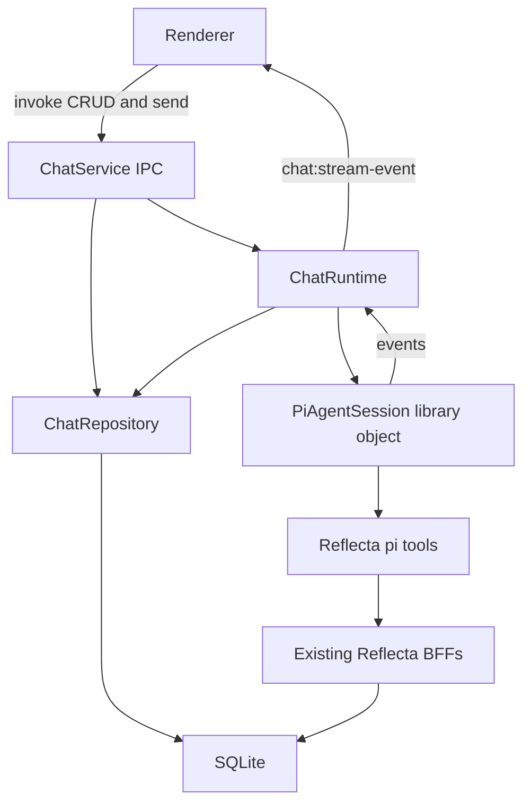
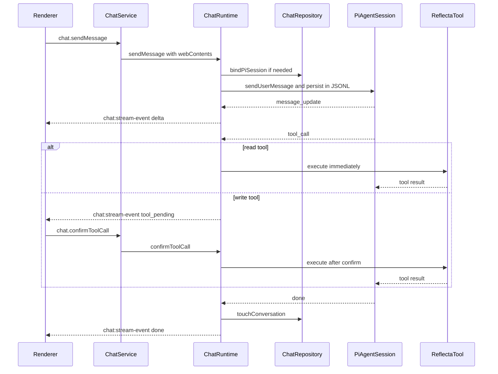
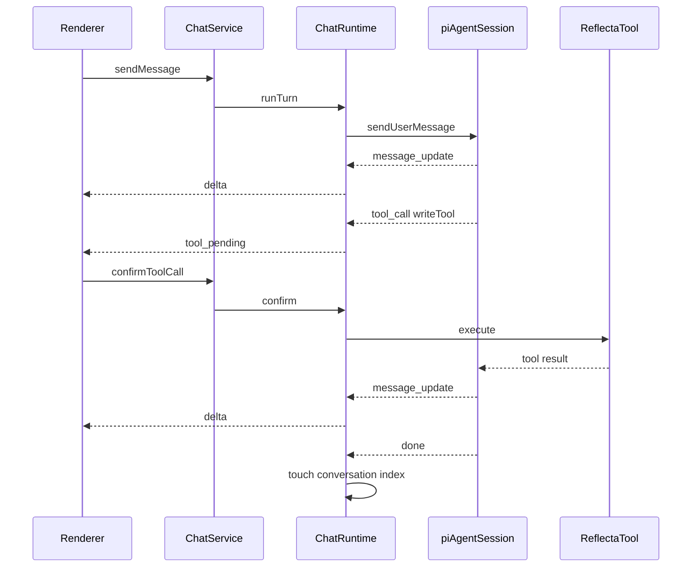

# 基于 pi-agent 的 Agent Chat 后端架构

## 核心判断

修正原草案的大分层：`chat` 不需要 CLI 能力，因此不必强行放进 `packages/server/src/domains/chat/` 做通用 domain + `bff-electron` / `bff-cli` 双套结构。更自然的边界是：

- `ChatService` 是 Electron IPC 门面，直接存在于 `apps/electron/src/main/services/`。
- `ChatRuntime` 是 Electron main 内部的应用服务，包装 pi-agent session、订阅事件、处理工具确认、取消和回合生命周期。
- `ChatRepository` 负责 Reflecta chat 索引表的 SQLite 持久化，主要保存 `conversation -> pi session` 映射、标题和更新时间；完整 message transcript 交给 pi-agent session JSONL。
- pi-agent runtime 负责运行态 session、stream event、tool loop、tool hooks、steering/follow-up。
- Reflecta tools 调用现有 `ThoughtElectronBff`、`ContextElectronBff`、`SearchElectronBff`、`CategoryElectronBff`，不改它们的业务逻辑。

`PiAgentAdapter` 这个名字容易误导，删掉这个概念。代码里只保留一个 `ChatRuntime`。它不是业务层，也不是 BFF；它是 Electron main 里的“正在跑的对话管理器”，负责把 pi-agent 的 session/event/tool API 接到 Reflecta 的 IPC、DB、工具确认上。

相关落点：

- [`drafts/agent-chat-backend-architecture.md`](drafts/agent-chat-backend-architecture.md)
- [`packages/server/src/db/schema.ts`](packages/server/src/db/schema.ts)
- [`packages/server/src/db/migration.ts`](packages/server/src/db/migration.ts)
- [`apps/electron/src/main/services/ChatService.ts`](apps/electron/src/main/services/ChatService.ts)
- [`apps/electron/src/main/services/chat/`](apps/electron/src/main/services/chat/)
- [`apps/electron/src/main/services/core.ts`](apps/electron/src/main/services/core.ts)
- [`apps/electron/src/main/services/index.ts`](apps/electron/src/main/services/index.ts)
- [`apps/electron/src/main/services/AiService.ts`](apps/electron/src/main/services/AiService.ts)

## 新分层



## 最终代码形态

```text
apps/electron/src/main/services/
  ChatService.ts
  chat/
    types.ts
    repository.ts
    runtime.ts
    tools.ts
    prompt.ts

packages/server/src/db/
  schema.ts
  migration/sql/003_add_conversations.sql
```

### `ChatService.ts`

Electron IPC 门面，只负责和 renderer 通信，不写 agent 逻辑。

大概长这样：

```typescript
export class ChatService extends IpcService {
  static readonly groupName = "chat";

  @IpcMethod()
  listConversations() {
    return chatRepository.listConversations();
  }

  @IpcMethod()
  async sendMessage(event, input) {
    return chatRuntime.sendMessage({
      ...input,
      webContents: event.sender,
    });
  }

  @IpcMethod()
  confirmToolCall(input) {
    return chatRuntime.confirmToolCall(input);
  }

  @IpcMethod()
  cancelStream(input) {
    return chatRuntime.cancel(input.requestId);
  }
}
```

### `chat/repository.ts`

数据库持久化层，只关心 Reflecta 的 conversation 索引，不保存完整 transcript，不知道 pi-agent event 细节，也不知道 IPC。

职责：

- `createConversation()`
- `listConversations()`
- `getConversation(conversationId)`
- `bindPiSession(conversationId, piSessionId, piSessionFile)`
- `touchConversation(conversationId)`
- `deleteConversation(...)`
- `renameConversation(...)`

它不是 transcript repository。读取消息历史时，`ChatRuntime` 通过 pi-agent session manager 读取 JSONL session，再转换成 renderer 需要的 `MessageDTO`。

### `chat/runtime.ts`

这是最容易混淆的文件。`ChatRuntime` 不是 pi-agent 本身，而是 Reflecta 自己写的“运行中对话协调器”。

它持有这些运行态 map：

```typescript
class ChatRuntime {
  private activeRuns = new Map<string, ActiveRun>();
  private sessionsByConversation = new Map<string, PiAgentSession>();
  private pendingTools = new Map<string, PendingToolApproval>();
}
```

它负责：

- 收到 `sendMessage` 后创建 `requestId`。
- 找到或创建这个 conversation 对应的 pi-agent session。
- 调用 `session.sendUserMessage(...)` 或等价 API。
- 订阅 pi-agent events，把 `message_update` 翻译成 `chat:stream-event`。
- 遇到写工具时推送 `tool_pending`，并记录 `pendingTools`。
- 收到 `confirmToolCall` 后让对应工具继续执行。
- 收到 `cancel` 后 abort 当前 run。
- 回合结束后，更新 `ChatRepository.touchConversation()`，完整消息已经由 pi-agent session 自己持久化。

所以 `ChatRuntime` 是 Reflecta 和 pi-agent 之间唯一真正的桥。它存在的原因是：pi-agent 不应该知道 Electron `webContents.send`、Reflecta SQLite、用户确认卡片、requestId、conversationId 这些产品层概念。

### pi-agent session 是什么

pi-agent session 不是我们要设计的新层，而是第三方库对象。它相当于“一个正在运行的 agent 对话实例”。

它负责：

- 保存本次 session 的 messages / state。
- 调 LLM。
- 执行 tool loop。
- 发出 streaming events。
- 支持 tool hooks / steering / follow-up / cancel。

代码里它大概只会作为 `ChatRuntime` 里的一个对象出现：

```typescript
const session = createPiAgentSession({
  systemPrompt,
  model,
  tools: createReflectaTools(...),
});

session.subscribe((event) => {
  this.handlePiEvent(requestId, event);
});
```

### `chat/tools.ts`

把 Reflecta 现有能力包装成 pi-agent tools。

- `search_knowledge_base` -> `searchService.search(...)`
- `get_thought_detail` -> `thoughtService.getThoughtById(...)`
- `get_graph_neighborhood` -> thought/category/connection 查询
- `propose_create_insight` -> 写工具，先 pending，确认后 `thoughtService.createThought(...)`
- `propose_update_thought` -> 写工具，确认后 `thoughtService.updateThought(...)`
- `propose_add_context` -> 写工具，确认后 `contextService.createContext(...)`
- `propose_create_connection` -> 写工具，确认后创建 connection

### `chat/prompt.ts`

只负责构建 system prompt 和 @ thought 上下文。

它会读取：

- 当前引用的 thought 正文。
- thought contexts。
- connections。
- categories。
- 最近对话历史摘要或截断后的消息。

它不直接调 LLM。

## 一次消息的完整路径



## 持久化策略

采用 “pi-agent session 是 transcript 事实源，Reflecta SQLite 是产品索引” 的方案。

- pi-agent session JSONL 保存完整消息历史、tool call、tool result、branch/fork 树结构。
- Reflecta SQLite 的 `conversations` 表只保存列表页需要的索引字段，以及 `pi_session_id` / `pi_session_file` 映射。
- Renderer 需要打开某个 conversation 时，`ChatRuntime` 根据 `pi_session_file` 让 pi-agent session manager 读取 JSONL，再转换成前端 `MessageDTO`。
- 如果之后需要全文搜索对话或极快列表预览，再加 projection/cache 表，但 cache 不是事实源。

## 落库逻辑

落库分两类：conversation 索引写 Reflecta SQLite；完整 transcript 写 pi-agent session JSONL。

### 1. 创建会话

`ChatService.createConversation()` 直接调用 `ChatRepository.createConversation()`，只写 Reflecta 的 `conversations` 表：

```typescript
await chatRepository.createConversation({
  id: conversationId,
  title: "新对话",
  piSessionId: null,
  piSessionFile: null,
  createdAt,
  updatedAt,
});
```

这一步不创建 pi-agent session。session 等第一次 `sendMessage` 时由 `ChatRuntime` 懒创建。

### 2. 第一次发送消息

`ChatRuntime.sendMessage()` 发现 conversation 还没有绑定 pi session 时：

```typescript
const piSession = await piSessionManager.newSession({
  // session 目录放在 Reflecta storage root 下，例如 agent-sessions/
});

await chatRepository.bindPiSession({
  conversationId,
  piSessionId: piSession.id,
  piSessionFile: piSession.file,
});
```

随后用户消息交给 pi-agent session。用户消息、assistant 消息、tool result 都由 pi-agent session 按自己的 JSONL 协议 append。

### 3. 流式输出过程中

assistant delta 不写 Reflecta DB，只通过 `chat:stream-event` 推给 renderer。pi-agent session 在 message 完成时按自己的协议持久化。

Reflecta 不逐 token 落库的原因：

- 写入频率高但价值低。
- pi-agent 已经有 transcript 协议。
- Reflecta DB 只需要支撑产品列表、映射和知识库业务数据。

### 4. 读工具执行

读工具结果先回到 pi-agent session，并由 pi-agent session 记录 tool result。Reflecta DB 不重复保存这份 transcript。

### 5. 写工具确认与执行

写工具有两种写入，要分开看：

- 业务数据写入：用户确认后立即执行，例如 `thoughtService.createThought(...)`、`contextService.createContext(...)`，这会写入原有 knowledge tables。
- 对话 transcript 写入：tool call / tool result 由 pi-agent session JSONL 记录，Reflecta DB 不再另存一份。

也就是说，确认工具后知识库数据马上变；“这次对话里发生了什么”由 pi-agent session 记录。

### 6. 回合结束

pi-agent done 后，`ChatRuntime` 只更新 conversation 索引：

```typescript
await chatRepository.touchConversation({
  conversationId,
  updatedAt,
  lastMessagePreview,
});
```

如果 conversation 还是默认标题，可以用第一条 user message 或后续摘要更新标题。标题属于产品索引，适合放在 Reflecta SQLite。

### 7. 取消和失败

MVP 建议先保持简单：

- 用户消息是否进入历史由 pi-agent session 的取消语义决定，不在 Reflecta DB 再做一套。
- cancel/error 事件推给 renderer。
- Reflecta 只更新必要的 conversation 状态，例如 `updated_at` 或 `last_error`，MVP 可以不加 `last_error`。

如果之后想在列表页显示“上次生成失败”，可以给 `conversations` 加 `last_error`，但不是 MVP 必需。

## 写工具确认

原草案的“生成器暂停-恢复”在 pi-agent 下改成 hook/steering 模型。

- 读工具直接执行，例如 `search_knowledge_base`、`get_thought_detail`、`get_graph_neighborhood`。
- 写工具在 `tool_call` hook 或 `beforeToolCall` 中拦截，向 renderer 推送 `tool_pending`。
- `confirmToolCall` 后，`ChatRuntime` 将用户确认注入对应 session，使该工具继续执行。
- `rejectToolCall` 后，向 session 注入拒绝结果，让模型基于“用户拒绝了该操作”继续生成。
- 如果 pi-agent 的 block hook 只能返回阻断结果而不能原地 await UI，适配层需要自己维护 `pendingToolCalls`，确认后通过 steering/follow-up 让 agent 重新走下一步。



## 文件职责调整

不建议新增完整的 `packages/server/src/domains/chat/`。建议放在 Electron main：

- `apps/electron/src/main/services/ChatService.ts`: IPC facade，decorator CRUD + raw stream IPC。
- `apps/electron/src/main/services/chat/types.ts`: Electron chat 后端类型，包含 DTO、StreamEvent、ToolApprovalState。
- `apps/electron/src/main/services/chat/repository.ts`: `ChatRepository`，负责 conversation 索引 CRUD、pi session 映射和标题/时间更新。
- `apps/electron/src/main/services/chat/runtime.ts`: `ChatRuntime`，负责 pi-agent session 生命周期、事件订阅、工具确认、取消和同步。
- `apps/electron/src/main/services/chat/tools.ts`: pi-agent tool definitions，包装现有 Reflecta BFF。
- `apps/electron/src/main/services/chat/prompt.ts`: system prompt 和 @ thought 上下文组装。

`@reflecta/server` 只需要承载共享 DB 定义：

- `packages/server/src/db/schema.ts`: 新增 `conversations` 表，保存 `pi_session_id` / `pi_session_file` 映射。
- `packages/server/src/db/migration.ts`: 继续加载 SQL migration。
- `packages/server/src/db/migration/sql/003_add_conversations.sql`: 新增 conversation 索引表。

## 需要重新定义的类型边界

后端对前端不要暴露 pi-agent 原始 event，也不建议让前端直接渲染 pi-agent JSONL。前端采用社区更大的 Vercel AI SDK UI 协议，并使用 Vue 官方包：

- 运行态：`@ai-sdk/vue` 的 `Chat` class。
- 前端消息模型：AI SDK `UIMessage` / `parts`。
- streaming 协议：后端把 pi-agent events 转成 AI SDK UI message stream parts。
- Electron 适配：实现一个自定义 chat transport，用 IPC 替代默认 `/api/chat` fetch。
- Vue 渲染：Reflecta 自己写 message bubble / tool card 组件，但消费标准 `UIMessage.parts`，不消费 pi-agent 私有 event。

这样前端绑定的是大生态的 chat SDK，而不是 pi-web-ui 或 pi-agent 内部 UI。

Reflecta 仍然需要定义一层稳定事件用于 Electron IPC，但这层应该尽量贴近 AI SDK UI message stream：

- `delta`: 当前 assistant 文本增量或快照。
- `tool_pending`: 写工具等待确认。
- `tool_running`: 用户确认后工具执行中。
- `tool_result`: 工具执行结果摘要。
- `done`: 本轮完成，pi-agent session 已持久化，conversation 索引已更新。
- `error`: 本轮失败。

renderer 收到这些 IPC event 后，由自定义 transport 写入 `useChat` 管理的 `UIMessage` 状态。

## 前端渲染方案

推荐主方案：Vercel AI SDK UI for Vue。

```text
pi-agent JSONL
  -> ChatRuntime 读取/运行 pi session
  -> 转换为 AI SDK UIMessage / UIMessage parts
  -> Electron IPC transport
  -> @ai-sdk/vue Chat
  -> Reflecta Vue ChatPanel 组件渲染
```

为什么不用 pi-web-ui：

- 社区选择少，未来维护风险更高。
- 它的 UI 假设和 Reflecta 的右侧知识库面板、@ thought、写工具确认卡不完全一致。
- 它会让前端更贴近 pi 生态，而我们只想在后端复用 pi-agent runtime/protocol。

为什么用 Vercel AI SDK：

- `@ai-sdk/vue` 的 `Chat` 已经处理 streaming message state、status、stop/regenerate、tool parts。
- `UIMessage.parts` 能表达 text、tool invocation、tool result、reasoning/data 等分段内容。
- 工具确认可以映射到 AI SDK 的 tool approval / tool output 模型。
- 后端不是 Nuxt/HTTP route 也没关系，AI SDK 是 transport 架构，可以用自定义 transport 接 Electron IPC。

Vue 侧代码形态大概是：

```vue
<script setup lang="ts">
import { Chat } from "@ai-sdk/vue";

const chat = new Chat({
  transport: new ElectronChatTransport({ conversationId }),
});
</script>

<template>
  <MessageList :messages="chat.messages" :status="chat.status">
    <template #message="{ message }">
      <template v-for="part in message.parts" :key="part.type">
        <AssistantMarkdown v-if="part.type === 'text'" :text="part.text" />
        <ReflectaToolCard v-else-if="part.type.startsWith('tool-')" :part="part" />
      </template>
    </template>
  </MessageList>
</template>
```

可选方案：assistant-ui。

Vue 生态里有 `assistant-ui-vue` 这类移植版，也能接 Vercel AI SDK runtime，提供 Thread/Composer/Tool UI。但它不是主流官方 Vue 基础设施，且仍然是 UI 框架，可能和 Reflecta 现有视觉、布局、右侧面板打架。MVP 不作为默认选择。

## 实施顺序

先做最小闭环：

1. 新增 `conversations` schema 和 migration，保存 pi session 映射和列表页索引字段。
2. 建 `ChatRuntime`，先只接一个无工具的流式对话，把 pi-agent event 转成 `chat:stream-event`。
3. 注册三个读工具，让 agent 能看 Reflecta 知识库。
4. 注册写工具，但先全部走 `tool_pending`，确认后再执行。
5. 打开历史 conversation 时，通过 `pi_session_file` 读取 pi-agent JSONL 并转换成前端消息。
6. 增加 cancel、error recovery、崩溃恢复和可选 message cache/projection。