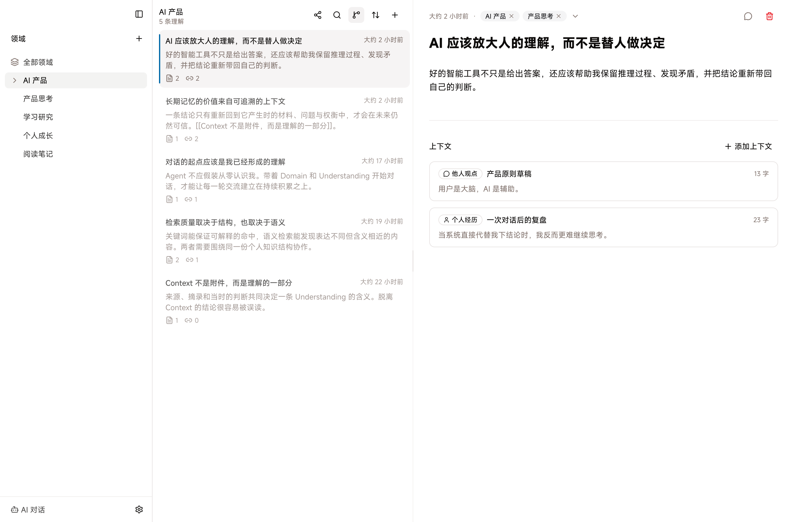
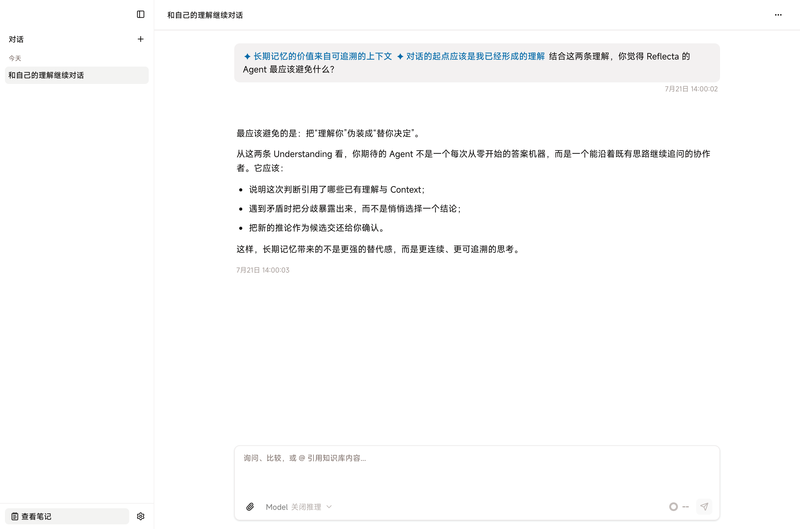

<p align="center">
  
</p>

<h1 align="center">Reflecta</h1>

<p align="center">
  把学习、实践和对话，沉淀成可追溯的个人理解。
</p>

Reflecta 是一个本地优先的桌面应用，面向持续学习、实践、复盘和使用 AI
进行深度对话的人。它关心的不是你收藏了多少信息，而是这些经历最终有没有变成你自己的理解。

> Reflecta 仍处于早期开发阶段。目前推荐开发者从源码运行，数据格式和交互可能继续演进。

## 为什么是 Reflecta

看完一本书、做完一个项目、经历一次失败或与 AI 深聊，并不会自动形成积累。真正值得留下的是你在这些经历之后形成的判断，以及这些判断产生、被验证和被修正的上下文。

Reflecta 用四个核心概念承载这件事：

- **Understanding**：你当前形成并愿意继续发展的个人理解。
- **Context**：这条理解形成、被支撑、应用、挑战或修正的具体上下文。
- **Connection**：你明确意识到的两条 Understanding 之间的关系。
- **Domain**：长期回看和发展一组 Understanding 的领域。

AI 可以帮助搜索、追问、比较和提出候选修改，但最终的理解和关系由用户确认。用户是大脑，AI 是辅助。

更完整的产品理念与边界见 [Reflecta Value Proposition](docs/references/product/value-proposition.md)。

## 界面预览

以下截图使用合成演示数据。

### 在 Domain 中沉淀和回看 Understanding



### 带着已有理解继续与 Agent 对话



## 目前包含什么

- 在 Domain 中创建、编辑和回看 Understanding。
- 为 Understanding 保留来自实践、书籍、视频、文章或 AI 对话的 Context。
- 通过 wiki link 建立 Understanding 之间的显式连接。
- 与能够读取本地 Understanding 和 Context 的 Agent 对话。
- 使用本地全文与语义检索找回相关理解。
- 通过 JSON CLI 脚本化访问本地数据。

核心内容保存在本机。使用远程 AI Provider 时，相应请求会发送到你配置的服务商。

## 从源码运行

### 环境要求

- macOS、Windows 或 Linux
- Node.js 22
- [Bun](https://bun.sh/)

```bash
git clone https://github.com/Floribunda1/reflecta.git
cd reflecta
bun install
bun run dev:gui
```

首次启动后，在应用设置中选择内容存储目录，并按需配置 AI Provider 和检索模型。

## 常用开发命令

```bash
# 启动桌面应用
bun run dev:gui

# 类型检查
bun run typecheck

# 单元测试
bun run test

# 代码检查
bun run lint

# Electron E2E
bun run test:e2e
```

构建当前平台的桌面安装包：

```bash
bun run package:electron
```

## CLI

`@reflecta/cli` 通过标准输出返回 JSON，适合脚本和 Agent 调用。修改数据的命令必须显式传入 `--yes`。

```bash
bun run --filter '@reflecta/cli' build
node apps/cli/dist/index.mjs list-actions
node apps/cli/dist/index.mjs search "feedback loop"
node apps/cli/dist/index.mjs understanding create --title "Inbox" --yes
```

完整用法见 [CLI 文档](apps/cli/README.md)。

## 数据与隐私

- Understanding、Context、Domain、会话和检索索引默认保存在本机内容目录。
- Reflecta 不要求把个人理解上传到一个由项目维护的云端知识库。
- 远程 AI Provider 会按照你的配置接收完成请求所需的内容；请同时阅读对应服务商的隐私政策。
- 在公开 issue 或 bug report 前，请检查日志、截图和复现数据中是否包含个人内容。

## 参与贡献

欢迎提交 issue 和 pull request。开始修改前，请先阅读 [AGENTS.md](AGENTS.md) 中的项目约定，并确保相关类型检查和测试通过。

## License

Reflecta 自有代码采用 [MIT License](LICENSE) 发布。第三方依赖和仓库中明确标注来源的内容遵循各自的许可证。
