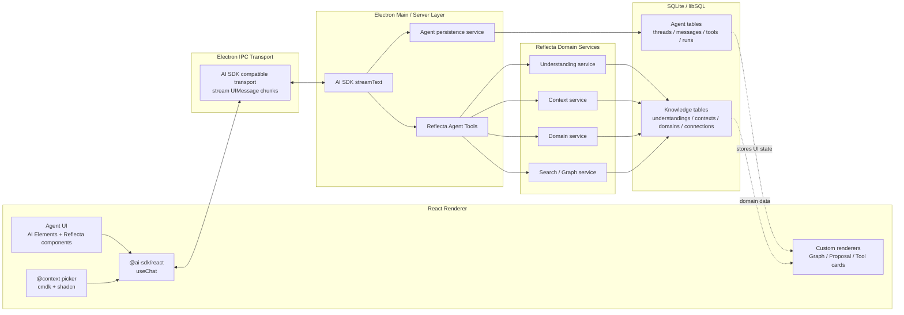
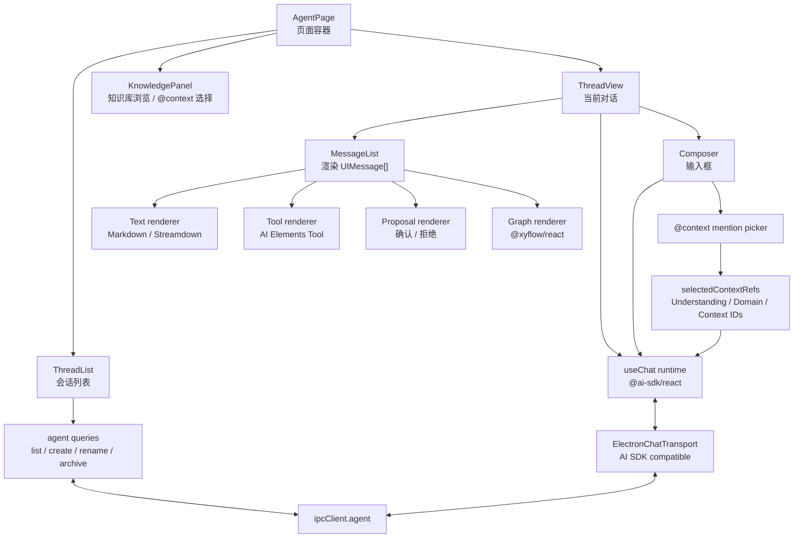
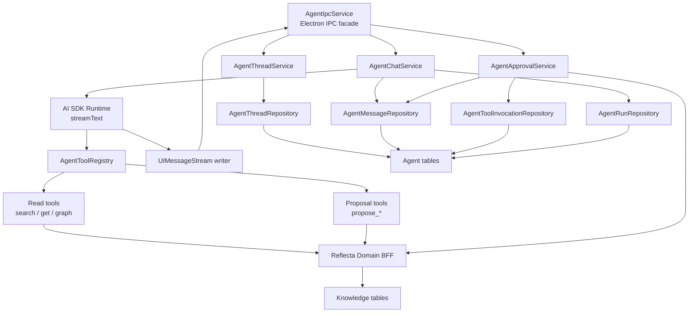
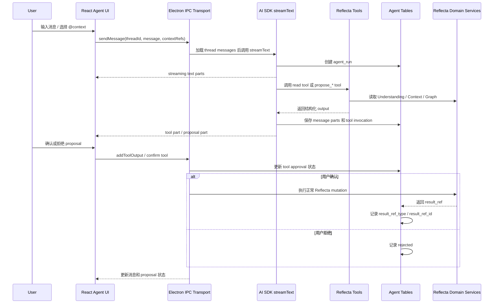

# Reflecta V2 Agent 技术选型

> 日期：2026-06-17
>
> 状态：Accepted
>
> 职责：确定 V2 Agent 的技术栈、前后端边界和 Agent 持久化表设计。本文不定义具体 UX 细节和实现任务拆分。

## 结论

V2 Agent 主链路采用：

- **Vercel AI SDK**：负责 chat runtime、streaming、tool calling、`UIMessage`、tool approval 生命周期。
- **AI Elements**：作为 AI UI 组件来源，按需引入 / copy 到项目内，保持 shadcn 风格。
- **Reflecta domain services**：作为知识库读写边界，Agent 不直接操作数据库。

新 Agent 主链路不使用 `pi-agent`。旧实现可以保留到迁移完成后再删除。

## 技术栈

| 层级             | 选择                                                                         | 说明                                                                         |
| ---------------- | ---------------------------------------------------------------------------- | ---------------------------------------------------------------------------- |
| Agent runtime    | `ai`                                                                         | 使用 `streamText`、tool calling、`UIMessage`、message parts、tool approval。 |
| React chat state | `@ai-sdk/react`                                                              | 使用 `useChat`。如果当前未安装，则只新增这个包。                             |
| Model provider   | `@ai-sdk/openai` first                                                       | 第一版只加实际会用的 provider。更多 provider 以后再加。                      |
| AI UI            | AI Elements                                                                  | 按需引入组件，遵循 shadcn / Tailwind 体系。                                  |
| Domain tools     | Reflecta services                                                            | Tool 调用 typed service，不碰底层表。                                        |
| Transport        | AI SDK transport over Electron IPC                                           | 保留一层薄 IPC adapter；暂不上 AG-UI。                                       |
| Persistence      | `agent_threads` / `agent_messages` / `agent_tool_invocations` / `agent_runs` | 不再使用 `pi-agent` session file。                                           |

## 前后端架构



## 前端运行架构

前端只负责用户交互、消息渲染、上下文选择和 tool approval。它不直接拼 prompt，不直接写知识库。



### 前端实体

| 实体                    | 职责                                                        | 持有的数据                                     | 交互对象                             |
| ----------------------- | ----------------------------------------------------------- | ---------------------------------------------- | ------------------------------------ |
| `AgentPage`             | Agent 页面容器，组合 thread 列表、对话区、知识面板。        | 当前 `threadId`。                              | Router、thread queries。             |
| `ThreadList`            | 展示 / 创建 / 重命名 / 归档 thread。                        | `agent_threads` 列表 DTO。                     | `ipcClient.agent`。                  |
| `ThreadView`            | 当前对话工作区。                                            | 当前 thread 的 `UIMessage[]`。                 | `useChat`。                          |
| `Composer`              | 用户输入消息。                                              | draft text、selected context refs。            | `useChat.sendMessage`。              |
| `ContextMentionPicker`  | `@context` 选择器。                                         | 被选中的 Understanding / Domain / Context ID。 | search / browse IPC。                |
| `MessageList`           | 按 `UIMessage.parts` 渲染消息。                             | `UIMessage[]`。                                | text/tool/proposal/graph renderers。 |
| `ToolRenderer`          | 展示 read tool 的运行状态和结果。                           | tool part。                                    | AI Elements Tool。                   |
| `ProposalRenderer`      | 展示 write proposal，提供确认 / 拒绝。                      | tool part + `agent_tool_invocations` 状态。    | `addToolOutput` / confirm IPC。      |
| `GraphRenderer`         | 渲染 tool 返回的 graph 数据。                               | graph tool output。                            | `@xyflow/react`。                    |
| `ElectronChatTransport` | 把 AI SDK chat 请求转成 Electron IPC，并接收 stream chunk。 | requestId、threadId。                          | Electron main。                      |

### 前端状态边界

| 状态                  | 所属位置                                            | 说明                                                        |
| --------------------- | --------------------------------------------------- | ----------------------------------------------------------- |
| 当前 thread ID        | React state / URL state                             | 页面切换用；不是知识库状态。                                |
| thread 列表           | React Query                                         | 来自 `agent_threads`。                                      |
| 当前消息              | `useChat`                                           | 运行时消息状态；完成后由后端持久化。                        |
| draft text            | React local state                                   | 用户还没发送的输入。                                        |
| selected context refs | React local state，发送时进入 message metadata/body | `@context` 的 source of truth 是对象 ID。                   |
| pending approval UI   | `UIMessage.parts` + `agent_tool_invocations`        | UI 从 message parts 渲染，状态查询可走 tool invocation 表。 |

## 后端运行架构

后端负责加载 thread、调用模型、执行 tools、持久化消息和 run 状态。知识库写入只能通过 Reflecta domain services。



### 后端实体

| 实体                            | 职责                                                      | 读写的表 / 服务                                      |
| ------------------------------- | --------------------------------------------------------- | ---------------------------------------------------- |
| `AgentIpcService`               | Electron IPC facade，只做协议适配。                       | 调用 service，不写业务逻辑。                         |
| `AgentThreadService`            | 创建、列出、重命名、归档 thread。                         | `agent_threads`。                                    |
| `AgentChatService`              | 处理发送消息、加载历史、启动 `streamText`、写入完成消息。 | `agent_messages`、`agent_runs`。                     |
| `AgentApprovalService`          | 处理 proposal 确认 / 拒绝。确认后调用 domain mutation。   | `agent_tool_invocations`、Reflecta domain services。 |
| `AgentToolRegistry`             | 定义可给模型调用的 tools。                                | read tools、proposal tools。                         |
| `ReadTools`                     | 查询知识库，不产生写入。                                  | search / understanding / context / graph services。  |
| `ProposalTools`                 | 生成结构化写入提案，不直接落知识库。                      | `agent_tool_invocations`、message parts。            |
| `AgentThreadRepository`         | thread CRUD。                                             | `agent_threads`。                                    |
| `AgentMessageRepository`        | message append / list。                                   | `agent_messages`。                                   |
| `AgentToolInvocationRepository` | tool invocation upsert / approval 状态更新。              | `agent_tool_invocations`。                           |
| `AgentRunRepository`            | run 创建、状态更新、错误记录。                            | `agent_runs`。                                       |
| `Reflecta Domain BFF`           | 现有 Understanding / Context / Domain / Graph 业务服务。  | knowledge tables。                                   |

### 后端数据流

#### 1. 打开 Agent 页面

```txt
React ThreadList
  -> ipcClient.agent.listThreads()
  -> AgentThreadService
  -> agent_threads
  -> 返回 thread 列表

React ThreadView(threadId)
  -> ipcClient.agent.listMessages(threadId)
  -> AgentChatService
  -> agent_messages ordered by seq
  -> 转成 UIMessage[]
```

#### 2. 发送消息

```txt
Composer submit
  -> useChat.sendMessage({ text }, { body: contextRefs })
  -> ElectronChatTransport
  -> AgentChatService.sendMessage(threadId, message, contextRefs)
  -> append user message to agent_messages
  -> create agent_run(status = streaming)
  -> load thread UIMessage[]
  -> validate / convert UIMessage to ModelMessage
  -> streamText({ model, messages, tools })
  -> stream UIMessage chunks back to renderer
  -> on finish: append assistant message, update run, update thread preview
```

#### 3. Read tool

```txt
streamText calls search_understandings / get_understanding / render_graph
  -> AgentToolRegistry
  -> Reflecta Domain BFF
  -> knowledge tables
  -> structured output
  -> tool part streamed to UI
  -> agent_tool_invocations stores input/output/status
```

#### 4. Write proposal

```txt
streamText calls propose_create_understanding
  -> ProposalTools validates input
  -> create / update agent_tool_invocations(approval_status = pending)
  -> returns structured proposal output
  -> UI renders ProposalRenderer
```

#### 5. 用户确认 proposal

```txt
ProposalRenderer confirm
  -> AgentApprovalService.confirm(tool_call_id)
  -> load agent_tool_invocation
  -> call Reflecta Domain BFF mutation
  -> write understandings / contexts / understanding_connections
  -> update agent_tool_invocations(approved, result_ref_type, result_ref_id)
  -> addToolOutput so AI SDK can continue if needed
```

#### 6. 用户拒绝 proposal

```txt
ProposalRenderer reject
  -> AgentApprovalService.reject(tool_call_id)
  -> update agent_tool_invocations(rejected)
  -> addToolOutput({ rejected: true })
```

## 请求与确认流程



## Agent 表设计

不重做 Reflecta 现有知识库表。继续保留：

- `understandings`
- `contexts`
- `domains`
- `understanding_connections`
- search / graph domain services

Agent 只在这些 domain services 之上工作，不引入第二套 knowledge model。

V2 Agent 新增四类表：

```txt
agent_threads
  id
  title
  status              -- active | archived
  created_at
  updated_at

agent_messages
  id
  thread_id
  seq                 -- thread 内单调递增顺序
  role
  parts_json          -- AI SDK UIMessage.parts
  attachments_json
  metadata_json       -- @context refs, model info, UI hints
  created_at

agent_tool_invocations
  id
  thread_id
  message_id
  tool_call_id
  tool_name
  state               -- input_streaming | input_available | approval_requested | output_available | output_error | output_denied
  input_json
  output_json
  error_text
  approval_status     -- not_required | pending | approved | rejected
  result_ref_type     -- nullable; understanding | context | connection
  result_ref_id       -- nullable
  created_at
  updated_at

agent_runs
  id
  thread_id
  status              -- streaming | waiting_for_approval | completed | failed | cancelled
  model
  started_at
  completed_at
  error_text
```

`agent_messages.parts_json` 是 UI source of truth，用来恢复 AI SDK 消息、tool parts、自定义 render parts。

`agent_tool_invocations` 是 tool parts 的可查询投影，用来支持：

- 查询待确认的 proposal。
- 在 chat bubble 之外展示 proposal 状态。
- 记录 approve / reject。
- 把确认后的结果链接到真实 Reflecta 对象。

第一版 `agent_threads` 不绑定 Understanding / Domain / Graph 等对象。Agent 先作为独立对话 thread 存在；如果后续要做“在 Understanding 详情内打开 Agent 面板”这类嵌入式场景，再补对象关联字段或独立关联表。

## 为什么不是一张 JSON messages 表

AI SDK 推荐持久化 `UIMessage`，因为它能完整恢复用户看到的聊天状态。这个方向是对的。

但 Reflecta 的 write tool 不是普通聊天装饰。它会产生需要用户确认的知识库变更：

- `propose_create_understanding`
- `propose_add_context`
- `propose_create_connection`
- 后续 graph / custom render tools

这些状态需要被查询、审批、拒绝、重试，并且需要链接到最终创建的 Understanding / Context / Connection。只存一坨 message JSON 会让这些操作变成反复扫描 JSON。

所以采用：

- message parts 保留完整 UI 状态；
- tool invocation 表保存可查询状态。

## 社区方案参考

成熟方案大致收敛到这些概念：

| 概念                       | 出现位置                                                     | 用途                                                                                     |
| -------------------------- | ------------------------------------------------------------ | ---------------------------------------------------------------------------------------- |
| Thread / chat / session    | AI SDK examples、Mastra memory、OpenAI Agents SDK、LangGraph | 用户可见的对话边界。                                                                     |
| Message history            | AI SDK、Vercel Chatbot、Mastra、OpenAI Agents SDK            | 恢复 UI，也作为模型上下文来源。                                                          |
| Message parts              | AI SDK、Vercel Chatbot                                       | 存 text、tool call、tool result、自定义 UI data、attachments。                           |
| Tool invocation / approval | AI SDK tool parts、LangGraph interrupts/checkpoints          | 追踪待确认动作，并在确认后恢复执行。                                                     |
| Run / stream               | Vercel Chatbot streams、OpenAI / LangGraph runs              | 追踪 streaming、取消、失败、重试、恢复。                                                 |
| Checkpoint                 | LangGraph                                                    | 用于 workflow replay、time travel、fault tolerance。V2 baseline 不需要。                 |
| Long-term memory store     | LangGraph stores、Mastra memory                              | 跨 thread 的长期 facts/preferences。Reflecta 现有 Understanding/Context 已覆盖主要需求。 |

## 产品能力覆盖

### 自定义渲染

自定义渲染基于 `UIMessage.parts`：

- text part -> markdown response。
- tool result part -> tool status card。
- `render_graph` tool result -> graph component。
- `propose_create_understanding` tool result -> proposal / confirmation component。

Graph 渲染优先复用项目现有 graph 技术栈。LLM 返回结构化数据，React 决定渲染组件。

### Tool Call / Confirmation

使用 AI SDK tool calling 和 approval lifecycle。

Reflecta 写操作保持用户确认：

- read tools 可以直接执行；
- write tools 只生成结构化 proposal；
- 用户确认后，通过正常 Reflecta mutation 写入 domain tables。

LLM 不直接写入个人知识库。

### `@context`

`@context` 是 Reflecta 产品能力，不是 SDK 内置语义。

实现方式：

- 用现有 `cmdk` / shadcn 模式做 mention picker；
- 用户选择 Understanding / Domain / Context；
- 前端发送对象 ID；
- 后端展开 ID 成 prompt context。

不要让模型解析原始 `@xxx` 文本作为 source of truth。

## 暂不采用

| 方案                        | 决策           | 原因                                                                     |
| --------------------------- | -------------- | ------------------------------------------------------------------------ |
| `pi-agent`                  | 不进入新主链路 | 和 AI SDK 的 runtime、tool loop、stream event、session 重叠。            |
| CopilotKit                  | 第一版不上     | 适合 app-wide copilot / shared state，但当前需求偏重。                   |
| AG-UI                       | 第一版不上     | 是协议层，等多个 agent backend / frontend 出现后再考虑。                 |
| assistant-ui                | 第一版不上     | 聊天壳完整，但 Reflecta 需要强领域面板和 proposal flow。                 |
| LangGraph / Mastra workflow | 第一版不上     | workflow engine 等长任务、分支、恢复需求出现后再加。                     |
| LangGraph checkpoint tables | 第一版不上     | 只有需要 replay / time travel / fault tolerance 时才值得。               |
| 独立 vector memory 表       | 第一版不上     | 先用 Understanding / Context / Search / `@context`，语义召回不足时再加。 |

## 依赖变化

只在缺失时新增：

```txt
@ai-sdk/react
@ai-sdk/openai
```

继续使用已有依赖：

```txt
ai
shadcn / tailwind
cmdk
@xyflow/react
```

`pi-agent` 相关依赖等旧 Agent 路径替换完成后再移除。

## 设计边界

- AI 只辅助，用户决定什么进入个人知识库。
- Tool output 必须是结构化数据，不让 UI scrape prose。
- Write proposal 必须可预览、可确认、可拒绝。
- Context reference 使用对象 ID，不依赖模型猜测字符串。
- Agent 表记录对话和 proposal 过程，不成为知识 source of truth。
- 只有出现真实 workflow 需求时，才引入 workflow engine / checkpoint。
- 只有出现多前端或多 Agent backend 时，才引入协议层。

## 参考

- Vercel AI SDK: https://ai-sdk.dev/docs/introduction
- AI SDK `useChat`: https://ai-sdk.dev/docs/reference/ai-sdk-ui/use-chat
- AI SDK message persistence: https://ai-sdk.dev/docs/ai-sdk-ui/chatbot-message-persistence
- AI SDK tool calling: https://ai-sdk.dev/docs/ai-sdk-core/tools-and-tool-calling
- AI SDK chatbot tool usage: https://ai-sdk.dev/docs/ai-sdk-ui/chatbot-tool-usage
- AI SDK OpenAI provider: https://ai-sdk.dev/providers/ai-sdk-providers/openai
- Vercel Chatbot schema: https://github.com/vercel/chatbot/blob/main/lib/db/schema.ts
- Vercel AI SDK persistence DB example: https://github.com/vercel-labs/ai-sdk-persistence-db
- LangGraph persistence: https://docs.langchain.com/oss/python/langgraph/persistence
- LangGraph checkpointers: https://docs.langchain.com/oss/python/langgraph/checkpointers
- Mastra memory overview: https://mastra.ai/docs/memory/overview
- Mastra message history: https://mastra.ai/docs/memory/message-history
- OpenAI Agents SDK sessions: https://openai.github.io/openai-agents-python/sessions/
- AI Elements: https://elements.ai-sdk.dev/
- AI Elements Confirmation: https://elements.ai-sdk.dev/components/confirmation
- AI Elements Tool: https://elements.ai-sdk.dev/components/tool
- AG-UI: https://docs.ag-ui.com/introduction
- CopilotKit: https://docs.copilotkit.ai/reference
