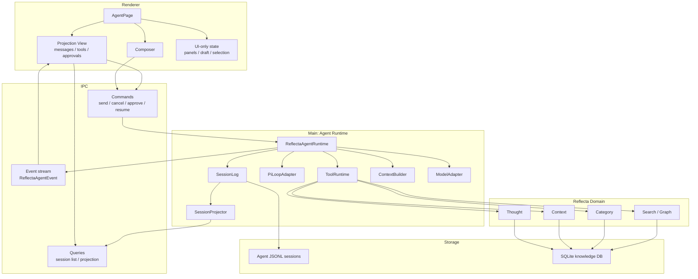
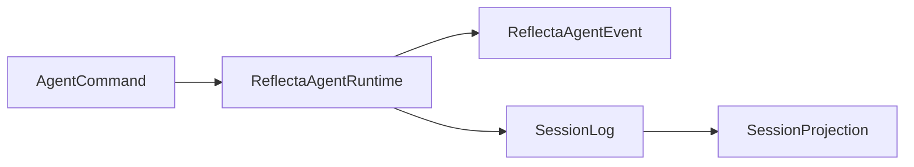

# Reflecta 1.1.0 Agent Tech Architecture

> 日期：2026-06-22
>
> 状态：Draft
>
> 主题：把 Agent runtime 从 AI SDK chat runtime 迁到 Pi Agent 方向，并重新定义 Reflecta 自己的技术架构。
>
> 这份文档只回答整体技术架构和心智模型，不定义任务拆分、工具细节、UI 细节。

## 1. 一句话心智模型

Reflecta Agent 是一个 **event-sourced runtime over Reflecta knowledge**。

```txt
User intent
  -> Reflecta AgentRuntime
  -> Pi loop executes model/tool steps
  -> Reflecta SessionLog records what happened
  -> Projector builds UI state
  -> Renderer displays and sends commands
```

核心原则：

```txt
Reflecta owns meaning.
Pi owns the loop.
SessionLog owns history.
Frontend owns presentation.
```

这四句话是 1.1.0 的架构判断。

## 2. 这次真正要换什么

v1.0.0 的核心问题不是某个 SDK bug，而是 ownership 放错了。

```txt
v1.0.0:
AI SDK UIMessage / useChat / tool part
  = runtime state
  = storage shape
  = frontend state
  = debug surface
```

1.1.0 要改成：

```txt
Reflecta SessionLog
  = runtime truth
  = storage truth
  = replay/debug truth

UI projection
  = derived view

Pi Agent
  = loop implementation detail
```

所以这不是“把 `streamText` 换成另一个函数”。这是把 Agent 的事实来源从 SDK message 移回 Reflecta 自己的 runtime。

## 3. 架构分层



## 4. State Ownership

这张表比模块图更重要。debug 时先看 owner。

| State                   | Owner                     | Not owner                                      |
| ----------------------- | ------------------------- | ---------------------------------------------- |
| Run lifecycle           | `ReflectaAgentRuntime`    | frontend, Pi, model SDK                        |
| Model/tool loop steps   | `PiLoopAdapter`           | frontend                                       |
| Canonical agent history | `SessionLog`              | SQLite message table, `UIMessage`, React state |
| UI-visible messages     | `SessionProjector` output | raw session log, SDK chunks                    |
| Composer draft          | Renderer local state      | backend                                        |
| Pending approval truth  | `SessionLog`              | button state, tool card state                  |
| Knowledge writes        | Reflecta domain modules   | Pi tools, frontend                             |
| Provider differences    | `ModelAdapter`            | runtime callers                                |

Rule:

```txt
If it must survive restart, explain a bug, or support replay, it belongs in SessionLog.
If it only affects the current screen, it belongs in Renderer state.
```

## 5. Backend Mental Model

Backend is one deep module with a small interface:

```txt
ReflectaAgentRuntime.handle(command) -> event stream
ReflectaAgentRuntime.read(sessionId) -> projection
```

Everything else is implementation.



### 5.1 ReflectaAgentRuntime

Owns:

- start / cancel / finish run
- append events in order
- call Pi loop
- route tool calls
- enforce approval policy
- convert internal failures into visible events

Does not own:

- UI layout
- React state
- Thought / Context persistence internals
- provider-specific quirks

### 5.2 SessionLog

Owns the canonical session timeline.

The log should read like an audit trail:

```txt
session.started
user.message.appended
run.started
model.request.built
tool.call.requested
tool.approval.requested
tool.approved
tool.completed
assistant.message.completed
run.completed
```

The exact event schema can evolve, but the semantic level should stay here: Reflecta events, not SDK events.

### 5.3 PiLoopAdapter

Pi is used at the loop seam.

Pi should own:

- step budget
- model -> tool -> model loop
- stop reason
- tool result continuation

Pi should not own:

- Reflecta session schema
- approval truth
- knowledge mutation semantics
- UI projection shape

This keeps Pi replaceable. If Pi changes, the blast radius is the adapter.

### 5.4 ToolRuntime

Tools are Reflecta capabilities exposed to the loop.

```txt
Pi asks to call a tool.
ToolRuntime decides whether it is read-only, approval-gated, or rejected.
Reflecta domain modules perform the actual knowledge read/write.
SessionLog records the decision and result.
```

That means tools are not “SDK callbacks”. They are domain operations with audit events.

## 6. Frontend Mental Model

Frontend no longer runs the Agent. It renders a projection and sends commands.

```txt
Renderer receives SessionProjection
Renderer displays turns/tools/approvals
Renderer sends AgentCommand
Renderer applies live events optimistically only as projection updates
```

Frontend modules:

| Module      | Responsibility                                                  |
| ----------- | --------------------------------------------------------------- |
| `session/`  | query session list/projection, open event stream, send commands |
| `composer/` | draft text, attachments, selected context refs                  |
| `messages/` | render projected turns                                          |
| `tools/`    | render tool activity and approval controls                      |
| `context/`  | choose and inspect Thought / Context / Category refs            |

Frontend must not:

- build model prompts
- infer canonical approval status from button state
- persist agent history
- know Pi types
- treat SDK message parts as truth

## 7. Main Flows

### Send Message

```txt
Composer
  -> message.send command
  -> ReflectaAgentRuntime
  -> SessionLog appends user.message.appended + run.started
  -> ContextBuilder builds model context
  -> PiLoopAdapter runs model/tool loop
  -> SessionLog appends events
  -> SessionProjector updates UI projection
```

### Approval

```txt
ToolRuntime emits tool.approval.requested
  -> UI renders approval
  -> user sends tool.approve / tool.reject
  -> ReflectaAgentRuntime records decision
  -> ToolRuntime continues or stops mutation
  -> SessionProjector updates approval card
```

### Resume

```txt
App opens session
  -> SessionLog reads JSONL
  -> SessionProjector rebuilds projection
  -> incomplete run is marked interrupted or resumed by runtime policy
```

Resume is a property of SessionLog + Runtime. It is not a frontend chat hook feature.

## 8. What We Reuse From Pi

Use:

- loop shape
- step budget
- model/tool continuation
- JSONL session inspiration
- resume/branch/compaction mental model
- skills mental model
- safe subset of builtin tools where useful

Do not adopt as canonical:

- Pi TUI
- Pi coding-agent session schema
- coding-agent file/shell world as Reflecta's product model

The architecture target is not “Reflecta becomes pi-coding-agent”. It is:

```txt
Reflecta runtime with Pi-style loop and inspectable sessions.
```

## 9. Architecture Checks

Before implementation, every design should pass these checks:

- Can I debug a failed run by reading the session log?
- Can I replay or rebuild UI projection without React state?
- Can I replace Pi without changing frontend modules?
- Can I replace model provider without changing SessionLog?
- Does a knowledge write go through Reflecta domain modules?
- Is each approval decision recorded as history, not just UI state?

If the answer is no, ownership is leaking.
