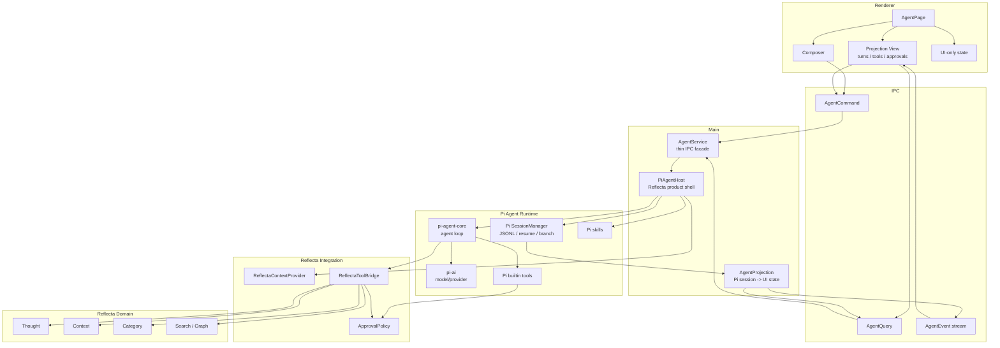
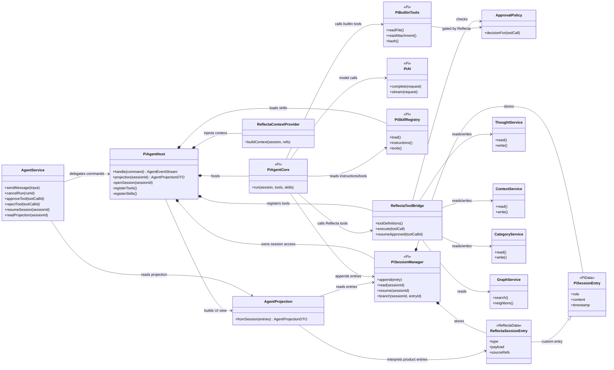
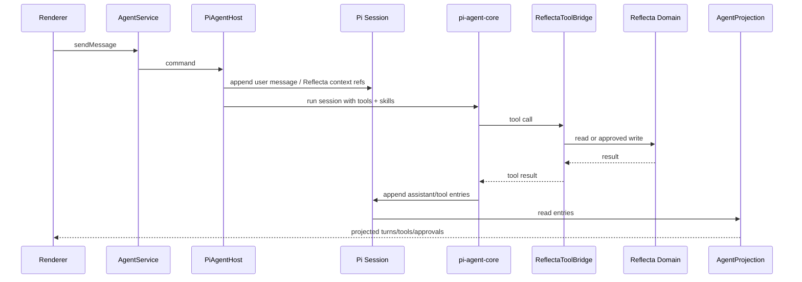

# Reflecta 1.1.0 Agent Tech Architecture

> 日期：2026-06-22
>
> 状态：Draft
>
> 主题：把 Agent runtime 从 AI SDK chat runtime 迁到 Pi Agent，并明确 Pi Agent 在 Reflecta 架构里的位置。
>
> 这份文档只讲整体技术架构和心智模型，不讲 implementation phases。

## 1. 一句话心智模型

Reflecta Agent 不是重新写一套 agent framework。它是：

```txt
Reflecta product shell around Pi Agent runtime.
```

Pi Agent 是运行内核。Reflecta 负责把这个内核运行在自己的产品语义里。

```txt
Renderer
  -> AgentService
  -> PiAgentHost
      -> Pi Agent Core
      -> Pi session / JSONL / resume
      -> Pi skills
      -> Pi builtin tools
      -> ReflectaToolBridge
  -> AgentProjection
  -> Renderer
```

核心原则：

```txt
Pi owns generic agent mechanics.
Reflecta owns product meaning.
Projection owns UI shape.
Domain modules own knowledge writes.
```

## 2. 这次真正要换什么

v1.0.0 的问题是 AI SDK chat runtime 变成了 Agent 的事实来源：

```txt
AI SDK UIMessage / useChat / tool parts
  = runtime state
  = storage shape
  = frontend state
  = debug surface
```

1.1.0 要改成：

```txt
Pi Agent session
  = agent runtime history
  = JSONL/debug/resume source

Reflecta custom session entries
  = product-specific meaning

AgentProjection
  = UI-facing derived state
```

关键变化：**不再创建一条和 Pi 平行的 Reflecta Agent framework**。Pi session 是主日志，Reflecta 在里面写自己的 domain entries，再投影给前端。

## 3. Top-Level Architecture



Read this diagram from the center:

```txt
PiAgentHost is the integration point.
Pi Agent Runtime does generic agent work.
Reflecta Integration gives Pi domain context and tools.
AgentProjection turns Pi session history into UI state.
```

## 4. Class Relationship UML

This is a conceptual class diagram. The names can become classes, modules, or files, but the dependency direction should stay the same.



Read the diagram this way:

- `PiAgentHost` is the only class that knows both Reflecta and Pi at runtime level.
- `PiAgentCore`, `PiSessionManager`, `PiAI`, `PiSkillRegistry`, and `PiBuiltinTools` are Pi-owned.
- `ReflectaToolBridge`, `ReflectaContextProvider`, `ApprovalPolicy`, and domain services are Reflecta-owned.
- `AgentProjection` is the only class that turns Pi session history into renderer-facing state.
- `ReflectaSessionEntry` extends the Pi session with product meaning instead of creating a second session store.

## 5. Module Split

The architecture has five important modules. Fewer modules, clearer ownership.

| Module               | Owns                                             | Does not own                                      |
| -------------------- | ------------------------------------------------ | ------------------------------------------------- |
| `AgentService`       | IPC commands/queries/events.                     | Agent loop, session semantics, domain writes.     |
| `PiAgentHost`        | Running Pi Agent inside Reflecta.                | React UI, Thought/Context implementation details. |
| Pi Agent Runtime     | Generic loop/session/skills/builtin mechanics.   | Reflecta product semantics.                       |
| `ReflectaToolBridge` | Reflecta tools, approval policy, domain adapter. | Generic model/tool loop.                          |
| `AgentProjection`    | UI-facing view of Pi session history.            | Runtime decisions, tool execution.                |

### 5.1 AgentService

`AgentService` is deliberately thin.

Input:

```txt
sendMessage
cancelRun
approveTool
rejectTool
resumeSession
listSessions
readProjection
```

Output:

```txt
AgentEvent stream
AgentProjection
```

It should feel like transport glue. If business rules appear here, they are in the wrong place.

### 5.2 PiAgentHost

`PiAgentHost` is the central Reflecta module.

It owns the act of running Pi Agent for Reflecta:

```txt
PiAgentHost
  -> opens/creates Pi session
  -> loads Pi skills
  -> builds initial Reflecta context
  -> registers Reflecta tools and approved Pi builtins
  -> starts pi-agent-core loop
  -> pauses/resumes for approvals
  -> asks AgentProjection for UI state
```

This is not a new agent framework. It is a host around Pi's framework.

Interface shape:

```txt
handle(command) -> AgentEvent stream
projection(sessionId) -> AgentProjection
```

Internally it delegates the hard generic parts to Pi:

- loop continuation
- model calls through `pi-ai`
- tool-call protocol
- JSONL session mechanics
- resume / branch mechanics
- skill loading model

### 5.3 Pi Agent Runtime

Pi Agent Runtime is where the generic agent behaviour lives.

Pi should own:

- model -> tool -> model loop
- step budget
- stop reasons
- tool result continuation
- session JSONL append/read mechanics
- resume and branch mechanics
- skills loading model
- builtin tool implementations where they are useful

Reflecta should not duplicate these.

The main technical question for 1.1.0 is not "how do we rewrite this loop?" It is:

```txt
How do we host Pi's loop without letting generic coding-agent semantics become Reflecta's product model?
```

### 5.4 ReflectaToolBridge

`ReflectaToolBridge` is how Pi sees Reflecta.

It exposes two kinds of tools to Pi:

| Tool kind               | Examples                                                 | Policy         |
| ----------------------- | -------------------------------------------------------- | -------------- |
| Reflecta read tools     | search thoughts, read context, inspect graph             | auto-run       |
| Reflecta mutation tools | create/update thought, attach context, create connection | approval-gated |

It can also expose a safe subset of Pi builtin tools:

| Builtin kind                | Use in Reflecta                 | Policy                                |
| --------------------------- | ------------------------------- | ------------------------------------- |
| file read / attachment read | useful for local knowledge work | auto-run or low-risk approval         |
| bash                        | useful for advanced workflows   | explicit approval                     |
| file write/edit             | not default for Reflecta 1.1.0  | off unless a future workflow needs it |

The bridge does not implement the agent loop. It only answers tool calls from Pi and writes Reflecta-specific session entries when product meaning matters.

### 5.5 AgentProjection

`AgentProjection` is a pure view builder.

Input:

```txt
Pi session JSONL entries
Reflecta custom entries inside that session
```

Output:

```txt
AgentProjection
  sessions/sidebar state
  turns
  visible assistant text
  tool activity
  pending approvals
  result refs
```

It must be possible to rebuild the entire UI from Pi session history plus Reflecta custom entries. React state and AI SDK messages are not required.

## 6. What Pi Agent Does Here

This section is the answer to "what is Pi Agent actually doing?"

| Pi part          | Responsibility in Reflecta                                                                                            |
| ---------------- | --------------------------------------------------------------------------------------------------------------------- |
| `pi-agent-core`  | Runs the iterative agent loop. It decides when to call model, when to call tools, when to continue, and when to stop. |
| `pi-ai`          | Provides the model/provider abstraction used by the Pi loop.                                                          |
| Pi session JSONL | Stores the agent history that supports debug, resume, branch, and replay.                                             |
| Pi skills        | Provides reusable instruction/tool bundles for agent behaviour.                                                       |
| Pi builtin tools | Supplies generic local tools where Reflecta wants them, under Reflecta policy.                                        |

So Pi Agent is not a tiny callback hidden behind Reflecta. Pi is the runtime kernel.

Reflecta adds:

- product-specific tools
- approval policy
- context injection from Thought / Context / Category
- projection into Electron UI
- domain writes through existing Reflecta modules

## 7. State Ownership

| State                    | Owner                                | Why                                                        |
| ------------------------ | ------------------------------------ | ---------------------------------------------------------- |
| Agent loop state         | Pi Agent Core                        | Generic agent mechanics should not be rewritten.           |
| Agent session history    | Pi session JSONL                     | Debug/resume/branch are Pi-shaped capabilities.            |
| Reflecta product meaning | Reflecta custom session entries      | Pi does not know Thought / Context / source refs.          |
| Approval truth           | Pi session + Reflecta custom entries | Approval must survive reload and resume.                   |
| UI-visible state         | AgentProjection                      | UI should see a stable product view, not raw Pi internals. |
| Knowledge writes         | Reflecta domain modules              | Existing domain modules own data integrity.                |
| Composer draft / panels  | Renderer                             | Screen-local state only.                                   |

Rule:

```txt
If it is generic agent mechanics, prefer Pi.
If it is Reflecta product meaning, keep it in Reflecta.
If it is only display shape, keep it in Projection/Renderer.
```

## 8. Main Flows

### 8.1 Send Message



### 8.2 Approval

```txt
Pi calls an approval-gated tool
  -> ReflectaToolBridge writes pending approval entry into Pi session
  -> PiAgentHost pauses or waits for decision
  -> AgentProjection renders pending approval
  -> user approves/rejects through AgentService
  -> PiAgentHost resumes the pending tool call
  -> ReflectaToolBridge performs or rejects the operation
  -> Pi session records the outcome
  -> AgentProjection updates UI
```

The approval card is not source of truth. The Pi session entry is.

### 8.3 Resume

```txt
App opens
  -> PiAgentHost reads Pi sessions
  -> AgentProjection rebuilds visible state
  -> unfinished runs are marked interrupted or resumed by PiAgentHost policy
```

The first target is not necessarily "continue a half-open stream". The architectural target is:

```txt
The whole Agent UI can be rebuilt from Pi session history.
```

## 9. Frontend Mental Model

Frontend no longer owns chat runtime.

```txt
Frontend sends commands.
Frontend reads projections.
Frontend renders approvals.
Frontend does not know Pi internals.
```

Frontend modules:

| Module      | Responsibility                                       |
| ----------- | ---------------------------------------------------- |
| `session/`  | query projection, subscribe to events, send commands |
| `composer/` | draft text, files, selected refs                     |
| `messages/` | render projected turns                               |
| `tools/`    | render projected tool activity and approvals         |
| `context/`  | choose and inspect Thought / Context / Category refs |

The renderer should never consume:

- raw Pi session entries
- provider SDK chunks
- AI SDK `UIMessage`
- Pi tool internals

It consumes only:

```txt
AgentProjection
AgentEvent stream
```

## 10. Why This Is Not Rewriting Pi

The architecture intentionally avoids rebuilding these Pi-owned things:

- agent loop
- provider abstraction
- tool continuation
- step budget
- session JSONL mechanics
- resume/branch model
- skills model
- useful builtin tools

Reflecta only builds the parts Pi cannot know:

- what a Thought is
- what a Context is
- what a sourceRef means
- which operations need approval
- how knowledge mutations go through Reflecta domain modules
- what the Electron UI should display

That is the seam:

```txt
Pi Agent = generic agent runtime.
Reflecta = product semantics and UI projection.
```

## 11. Architecture Review Checks

Use these questions to review future design changes:

- Is this generic agent behaviour? If yes, why is Pi not owning it?
- Is this Reflecta product meaning? If yes, where is the custom session entry?
- Can the UI rebuild from Pi session history?
- Does approval truth live in session history, not button state?
- Does a knowledge write go through Reflecta domain modules?
- Can the renderer stay ignorant of Pi internals?
- If Pi changes its internals, is the blast radius mostly `PiAgentHost` / `AgentProjection`?
