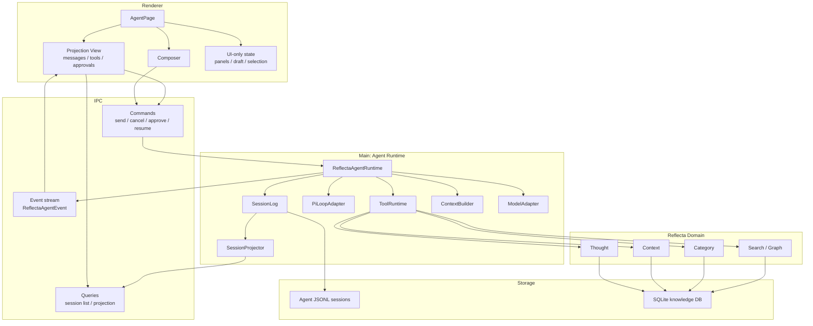
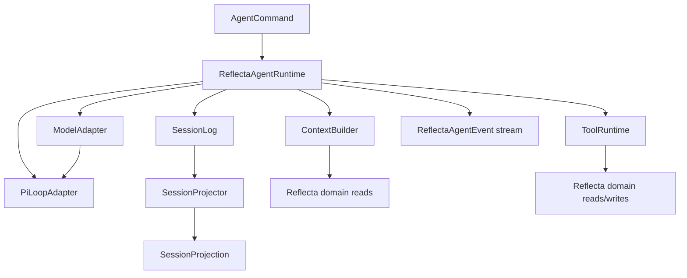
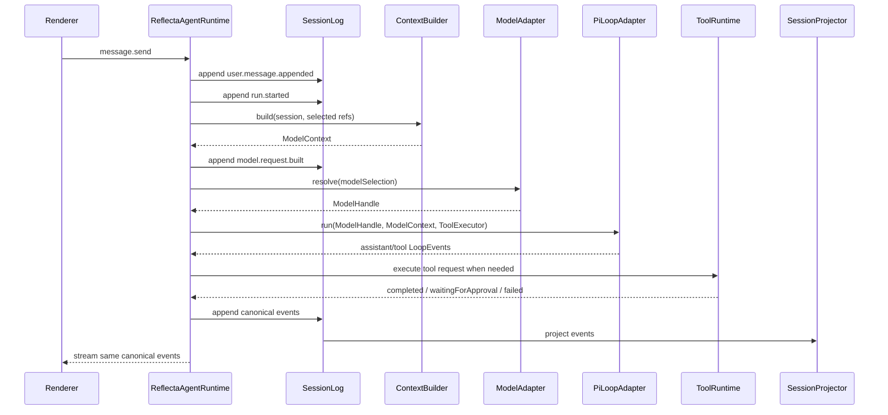
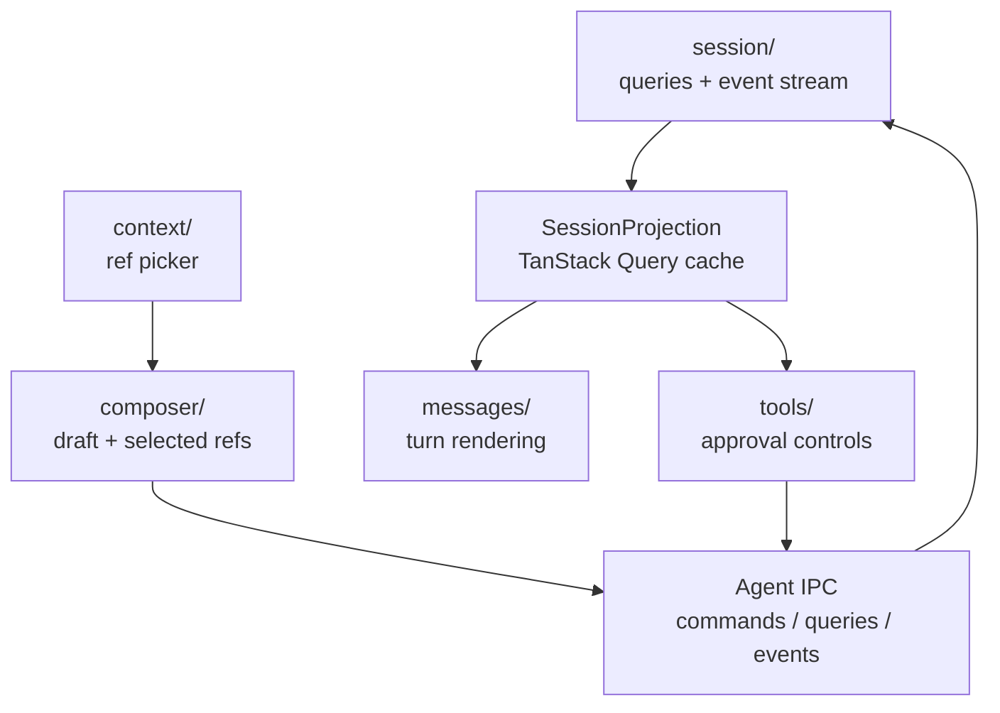

# Reflecta 1.1.0 Agent Tech Architecture

> 日期：2026-06-22
>
> 状态：Draft
>
> 主题：把 Agent runtime 从 AI SDK chat runtime 迁到 Pi Agent 方向，并重新定义 Reflecta 自己的技术架构。
>
> 这份文档只回答整体技术架构和心智模型，不定义任务拆分、工具细节、UI 细节。

## 1. 一句话心智模型

Reflecta Agent 是一个 **event-sourced runtime over Reflecta knowledge**。

```txt
User intent
  -> Reflecta AgentRuntime
  -> Pi loop executes model/tool steps
  -> Reflecta SessionLog records what happened
  -> Projector builds UI state
  -> Renderer displays and sends commands
```

核心原则：

```txt
Reflecta owns meaning.
Pi owns the loop.
SessionLog owns history.
Frontend owns presentation.
```

这四句话是 1.1.0 的架构判断。

## 2. 这次真正要换什么

v1.0.0 的核心问题不是某个 SDK bug，而是 ownership 放错了。

```txt
v1.0.0:
AI SDK UIMessage / useChat / tool part
  = runtime state
  = storage shape
  = frontend state
  = debug surface
```

1.1.0 要改成：

```txt
Reflecta SessionLog
  = runtime truth
  = storage truth
  = replay/debug truth

UI projection
  = derived view

Pi Agent
  = loop implementation detail
```

所以这不是“把 `streamText` 换成另一个函数”。这是把 Agent 的事实来源从 SDK message 移回 Reflecta 自己的 runtime。

## 3. 架构分层



## 4. State Ownership

这张表比模块图更重要。debug 时先看 owner。

| State                   | Owner                     | Not owner                                      |
| ----------------------- | ------------------------- | ---------------------------------------------- |
| Run lifecycle           | `ReflectaAgentRuntime`    | frontend, Pi, model SDK                        |
| Model/tool loop steps   | `PiLoopAdapter`           | frontend                                       |
| Canonical agent history | `SessionLog`              | SQLite message table, `UIMessage`, React state |
| UI-visible messages     | `SessionProjector` output | raw session log, SDK chunks                    |
| Composer draft          | Renderer local state      | backend                                        |
| Pending approval truth  | `SessionLog`              | button state, tool card state                  |
| Knowledge writes        | Reflecta domain modules   | Pi tools, frontend                             |
| Provider differences    | `ModelAdapter`            | runtime callers                                |

Rule:

```txt
If it must survive restart, explain a bug, or support replay, it belongs in SessionLog.
If it only affects the current screen, it belongs in Renderer state.
```

## 5. Runtime Internal Model

Backend is one deep module with a small interface:

```txt
ReflectaAgentRuntime.handle(command) -> event stream
ReflectaAgentRuntime.read(sessionId) -> projection
```

Everything else is implementation.



The important part is direction:

```txt
Commands enter Runtime.
Only Runtime appends canonical events.
Projector derives state from events.
PiLoop never talks to Renderer or SessionLog directly.
Tools never mutate knowledge without Runtime policy.
```

### 5.1 Module Roles

| Module                 | Role                                                            | Input                                                    | Output                                 |
| ---------------------- | --------------------------------------------------------------- | -------------------------------------------------------- | -------------------------------------- |
| `ReflectaAgentRuntime` | Orchestrates one command into ordered events.                   | `AgentCommand`, current session state                    | `ReflectaAgentEvent` stream            |
| `SessionLog`           | Stores canonical append-only history.                           | ordered events                                           | persisted JSONL, readable event stream |
| `SessionProjector`     | Turns events into UI/query state.                               | session events                                           | `SessionProjection`                    |
| `ContextBuilder`       | Builds model input from Reflecta knowledge and session history. | session events, selected refs, model limits              | model context                          |
| `ModelAdapter`         | Hides provider/model differences.                               | model selection, runtime config                          | model handle/request shape for Pi      |
| `PiLoopAdapter`        | Runs the model/tool continuation loop.                          | model context, model handle, tool executor, abort signal | loop events                            |
| `ToolRuntime`          | Describes and executes Reflecta tools after Runtime policy.     | tool request, Runtime decision                           | tool result or error                   |

### 5.2 ReflectaAgentRuntime

Owns:

- start / cancel / finish run
- append events in order
- call Pi loop
- route tool calls
- enforce approval policy
- convert internal failures into visible events

Does not own:

- UI layout
- React state
- Thought / Context persistence internals
- provider-specific quirks

Its implementation shape:

```txt
handle(command)
  -> load current projection from SessionLog
  -> validate command against projection
  -> append command-visible events
  -> call internal modules
  -> append internal result events
  -> yield the same events to IPC
```

The Runtime is intentionally the only place that sees all moving parts. That is what lets the other modules stay narrow.

### 5.3 SessionLog

Owns the canonical session timeline.

The log should read like an audit trail:

```txt
session.started
user.message.appended
run.started
model.request.built
tool.call.requested
tool.approval.requested
tool.approved
tool.completed
assistant.message.completed
run.completed
```

The exact event schema can evolve, but the semantic level should stay here: Reflecta events, not SDK events.

Interface:

```txt
append(sessionId, event) -> persisted event with id
read(sessionId) -> ordered events
readAfter(sessionId, eventId) -> ordered events
branch(sessionId, fromEventId) -> child session
```

Invariants:

- Events are append-only.
- Event order is canonical.
- Every persisted event has an id and timestamp.
- Rebuilding a projection from events must not require React state or SDK state.

### 5.4 SessionProjector

`SessionProjector` is a pure reducer over events.

```txt
events -> SessionProjection
```

It owns the translation from audit trail to UI state:

- sessions and titles
- turns and visible messages
- running / waiting / failed run state
- pending approvals
- tool activity cards

It must not call model providers, tools, or domain writes. If projection needs extra data for display, the event schema is missing information.

### 5.5 ContextBuilder

`ContextBuilder` answers one question:

```txt
Given this session and user intent, what should the model see?
```

Inputs:

- projected conversation history
- selected `Thought` / `Context` / `Category` refs
- Reflecta domain reads
- model context limits
- compaction summaries, if present

Output:

```txt
ModelContext
  system instructions
  conversation messages
  selected knowledge context
  available tools summary
  provenance metadata
```

It does not call the model and does not execute tools. Runtime records the built request as an event so debug can inspect the exact model input.

### 5.6 ModelAdapter

`ModelAdapter` hides provider differences from Runtime.

```txt
resolve(modelSelection) -> ModelHandle
```

It owns:

- provider config
- model id mapping
- reasoning/options compatibility
- `pi-ai` vs any fallback provider SDK details

Runtime should never branch on OpenAI vs OpenAI-compatible vs local model. That branching belongs here.

### 5.7 PiLoopAdapter

Pi is used at the loop seam.

Pi should own:

- step budget
- model -> tool -> model loop
- stop reason
- tool result continuation

Pi should not own:

- Reflecta session schema
- approval truth
- knowledge mutation semantics
- UI projection shape

This keeps Pi replaceable. If Pi changes, the blast radius is the adapter.

Interface shape:

```txt
run({
  model: ModelHandle,
  context: ModelContext,
  tools: ToolExecutor,
  signal: AbortSignal,
}) -> AsyncIterable<LoopEvent>
```

`LoopEvent` is not canonical history. Runtime translates it into `ReflectaAgentEvent` before persistence.

### 5.8 ToolRuntime

Tools are Reflecta capabilities exposed to the loop.

```txt
Pi asks to call a tool.
Runtime records the request.
Runtime decides whether it is read-only, approval-gated, or rejected.
ToolRuntime executes allowed operations.
Reflecta domain modules perform the actual knowledge read/write behind ToolRuntime.
SessionLog records the decision and result.
```

That means tools are not “SDK callbacks”. They are domain operations with audit events.

Tool handling has three possible outcomes:

| Outcome              | Meaning                                           | Runtime event result                                                |
| -------------------- | ------------------------------------------------- | ------------------------------------------------------------------- |
| `completed`          | Safe read or already-approved operation finished. | append tool completed event and return output to Pi loop            |
| `waitingForApproval` | Operation needs user decision.                    | append approval requested event and pause continuation              |
| `failed`             | Tool validation or execution failed.              | append failed event and return/raise error according to tool policy |

`ToolRuntime` may call Reflecta domain modules, but it does not own approval policy. Approval policy belongs to Runtime because it affects run lifecycle and session truth.

### 5.9 Runtime Flow: Send Message



Review point: every arrow that changes durable state goes through `SessionLog`. If a future design writes durable state elsewhere, it is probably leaking ownership.

### 5.10 Runtime Flow: Approval

```txt
tool.approve command
  -> Runtime loads projection
  -> Runtime verifies there is a matching pending approval
  -> Runtime appends tool.approved
  -> ToolRuntime performs the approved operation
  -> Runtime appends tool.completed or tool.failed
  -> PiLoopAdapter continues the paused loop if the run is resumable
  -> Runtime appends assistant/run completion events
```

The approval card is not the source of truth. It is a projection of the pending approval event.

## 6. Frontend Mental Model

Frontend no longer runs the Agent. It renders a projection and sends commands.

```txt
Renderer receives SessionProjection
Renderer displays turns/tools/approvals
Renderer sends AgentCommand
Renderer applies live events optimistically only as projection updates
```

Frontend modules:

| Module      | Responsibility                                                  |
| ----------- | --------------------------------------------------------------- |
| `session/`  | query session list/projection, open event stream, send commands |
| `composer/` | draft text, attachments, selected context refs                  |
| `messages/` | render projected turns                                          |
| `tools/`    | render tool activity and approval controls                      |
| `context/`  | choose and inspect Thought / Context / Category refs            |

Frontend must not:

- build model prompts
- infer canonical approval status from button state
- persist agent history
- know Pi types
- treat SDK message parts as truth

### 6.1 Frontend Dataflow



The renderer has only one Agent-facing state shape: `SessionProjection`.

```txt
SessionProjection
  sessions/sidebar state
  current turns
  running run status
  pending approvals
  tool activity views
```

If frontend live updates reduce raw events locally, they must use the same projection rules as `SessionProjector`. There should not be a separate React-only interpretation of Agent semantics.

### 6.2 IPC Contract

IPC is a transport seam, not a runtime module.

| IPC shape            | Direction           | Meaning                                             |
| -------------------- | ------------------- | --------------------------------------------------- |
| `AgentCommand`       | Renderer -> Runtime | User intent: send, cancel, approve, reject, resume. |
| `AgentQuery`         | Renderer -> Runtime | Read session list or a session projection.          |
| `ReflectaAgentEvent` | Runtime -> Renderer | Canonical event stream for the active run/session.  |
| `SessionProjection`  | Runtime -> Renderer | Derived state for initial load and cache refresh.   |

IPC must not transport Pi types or provider SDK chunks. If the renderer sees those, the Runtime seam is leaking.

### 6.3 Frontend Review Rule

Frontend review should ask:

- Does this code render `SessionProjection`, or is it interpreting raw runtime state?
- Does this command express user intent, or does it smuggle internal runtime state?
- Does approval UI read from projection, or from local button state?
- Can the page reload and rebuild from projection alone?

## 7. Resume And Rebuild

```txt
App opens session
  -> SessionLog reads JSONL
  -> SessionProjector rebuilds projection
  -> incomplete run is marked interrupted or resumed by runtime policy
```

Resume is a property of SessionLog + Runtime. It is not a frontend chat hook feature.

The first 1.1.0 target is not necessarily "resume a half-open model stream". The architectural requirement is stricter and simpler:

```txt
Every visible Agent state can be rebuilt from SessionLog.
```

Once that holds, continuing interrupted runs is a policy decision inside Runtime, not a data recovery problem.

## 8. What We Reuse From Pi

Use:

- loop shape
- step budget
- model/tool continuation
- JSONL session inspiration
- resume/branch/compaction mental model
- skills mental model
- safe subset of builtin tools where useful

Do not adopt as canonical:

- Pi TUI
- Pi coding-agent session schema
- coding-agent file/shell world as Reflecta's product model

The architecture target is not “Reflecta becomes pi-coding-agent”. It is:

```txt
Reflecta runtime with Pi-style loop and inspectable sessions.
```

## 9. Architecture Checks

Before implementation, every design should pass these checks:

- Can I debug a failed run by reading the session log?
- Can I replay or rebuild UI projection without React state?
- Can I replace Pi without changing frontend modules?
- Can I replace model provider without changing SessionLog?
- Does a knowledge write go through Reflecta domain modules?
- Is each approval decision recorded as history, not just UI state?

If the answer is no, ownership is leaking.
