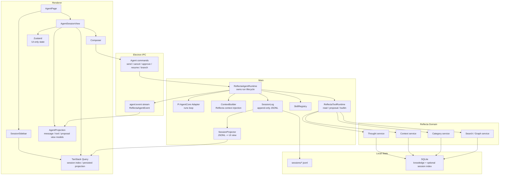
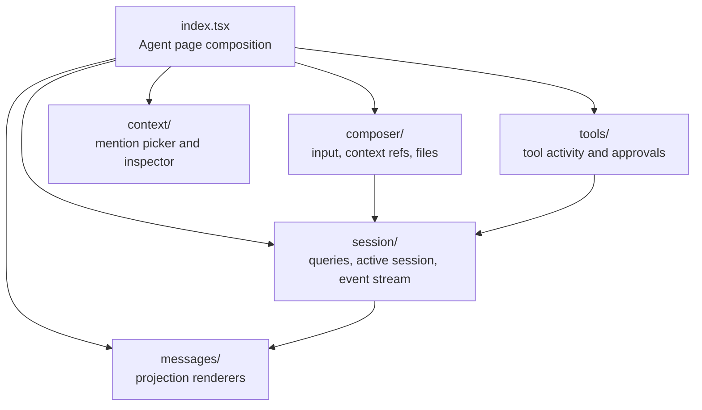

# Reflecta 1.1.0 Agent Pi Runtime Architecture

> 日期：2026-06-22
>
> 状态：Draft
>
> 主题：把当前由 Vercel AI SDK 主导的 Agent runtime 迁移到 Pi Agent 方向，并重新定义 Reflecta 自己的 Agent 架构。
>
> 上游文档：
>
> - `docs/iterations/v1.0.0/tech/agent-chat-system-plan.md`
> - `docs/references/technical/biz/agent/server.md`
> - `docs/references/technical/biz/agent/frontend.md`

## 1. 结论

1.1.0 的 Agent 主题不是继续修补当前 SDK runtime，而是把 Agent 主链路迁移到 Pi Agent 方向：

- **采用 Pi Agent loop**：优先评估 `pi-agent-core` 作为模型循环和 tool loop。
- **借用 Pi coding-agent 能力**：builtin tools、JSONL session、resume、skills、compaction、branch 作为架构参考或可抽取模块。
- **Reflecta 自己拥有 session/event schema**：`Thought`、`Context`、`Category`、`sourceRef`、proposal、approval 都必须是 Reflecta 事件，而不是 SDK message 的附属字段。
- **前端不再使用 SDK chat runtime 作为状态归属**：前端消费 Reflecta event projection，不再让 `useChat` / `UIMessage` 成为运行中的事实来源。

  1.1.0 结束后，目标心智模型是：

```txt
Reflecta owns Agent semantics.
Pi runs the loop.
Frontend renders projections.
Session log is inspectable and replayable.
```

## 2. 为什么要换

v1.0.0 的主链路把 AI SDK 放在了太高的位置：

```txt
AI SDK Chat / UIMessage / tool state
  -> runtime truth
  -> persistence shape
  -> frontend state
  -> debugging surface
```

这带来三个维护问题：

| 问题         | 现状                                                            | 1.1.0 目标                                          |
| ------------ | --------------------------------------------------------------- | --------------------------------------------------- |
| runtime 黑盒 | tool approval、message part、finish message 由 SDK 生命周期驱动 | Reflecta event log 记录每一步发生了什么             |
| 存储黑盒     | `UIMessage.parts` 是事实来源                                    | JSONL session/event 是事实来源，UI message 只是投影 |
| debug 困难   | 失败时要理解 SDK chunk / hook / callback                        | 失败时读 session log 即可 replay / resume / branch  |

这不是否定 SDK 的 provider 能力。问题是当前 seam 放错了：SDK 不应该拥有 Agent runtime 的 interface。

## 3. Pi 包分层

| Pi 层级           | 1.1.0 用法                | 说明                                                              |
| ----------------- | ------------------------- | ----------------------------------------------------------------- |
| `pi-ai`           | 可作为 model adapter 候选 | 和 Vercel AI SDK 的 provider 层同级。                             |
| `pi-agent-core`   | 优先评估直接采用          | 它是小 loop，适合放在 Reflecta runtime 内部。                     |
| `pi-coding-agent` | 不整体接管，但抽取能力    | builtin tools、JSONL、resume、skills、branch、compaction 值得用。 |
| Pi TUI            | 不采用                    | Reflecta 有自己的 Electron UI。                                   |

关键区别：

```txt
pi-agent-core = loop library
pi-coding-agent = coding-agent product shell
```

Reflecta 可以采用前者，借鉴或抽取后者，但不能让后者的 coding session schema 成为 Reflecta 的 canonical schema。

## 4. 目标模块图



## 5. 深模块和 seam

1.1.0 的外部 seam 只有三个：

| Module                 | Interface                    | Adapter                                           |
| ---------------------- | ---------------------------- | ------------------------------------------------- |
| `ReflectaAgentRuntime` | command in, event out        | Pi loop adapter is internal                       |
| `SessionLog`           | append, read, replay, branch | JSONL file adapter                                |
| `ModelAdapter`         | request, stream, cancel      | `pi-ai` first; Vercel AI SDK only if still needed |

其他东西不要暴露成公共 seam：

- `ContextBuilder` 是 runtime 内部实现。
- `ToolRuntime` 是 runtime 内部实现。
- `SkillRegistry` 是 runtime 内部实现。
- `SessionProjector` 是 frontend/backend 之间的 projection 层，不是 canonical state。

这样删除测试会很清楚：

- 删除 `ReflectaAgentRuntime`，runtime 复杂度会散回 IPC、tools、frontend。
- 删除 `SessionLog`，debug/replay/resume 会散回 DB、UI cache、SDK chunks。
- 删除 `ModelAdapter`，provider 差异会散回 runtime。

这三个模块值得存在。

## 6. SessionLog 是事实来源

1.1.0 的 canonical agent history 是 append-only session log。推荐主格式是 JSONL：

```txt
docs/debug example:
~/.reflecta/agent/sessions/<sessionId>.jsonl
```

每一行是一个 `ReflectaAgentEvent`。事件必须表达 Reflecta 语义，而不是 SDK 语义。

### 6.1 核心事件

```ts
type ReflectaAgentEvent =
  | { type: "session.started"; sessionId: string; version: 1; createdAt: string }
  | { type: "user.message.appended"; messageId: string; text: string; contextRefs: ContextRef[] }
  | { type: "run.started"; runId: string; messageId: string; model: string }
  | { type: "context.selected"; runId: string; refs: ContextRef[]; reason?: string }
  | { type: "model.request.built"; runId: string; request: unknown }
  | { type: "assistant.delta"; runId: string; text: string }
  | { type: "assistant.message.completed"; runId: string; messageId: string; text: string }
  | {
      type: "tool.call.requested";
      runId: string;
      toolCallId: string;
      toolName: string;
      input: unknown;
    }
  | {
      type: "tool.approval.requested";
      toolCallId: string;
      proposalType: ProposalType;
      proposal: unknown;
    }
  | { type: "tool.approved"; toolCallId: string; approvedBy: "user" }
  | { type: "tool.rejected"; toolCallId: string; rejectedBy: "user"; reason?: string }
  | { type: "tool.completed"; toolCallId: string; output: unknown }
  | { type: "tool.failed"; toolCallId: string; error: string }
  | { type: "knowledge.mutation.completed"; toolCallId: string; resultRef: ResultRef }
  | { type: "run.completed"; runId: string; stopReason: string; usage?: unknown }
  | { type: "run.cancelled"; runId: string; reason: "user" | "shutdown" }
  | { type: "compaction.summary.created"; sessionId: string; summary: string; fromEventId: string }
  | { type: "branch.created"; sessionId: string; parentSessionId: string; fromEventId: string };
```

### 6.2 不存什么

不要把这些作为 canonical state：

- AI SDK `UIMessage`
- SDK chunk
- React hook state
- Pi coding-agent 原生 message union

这些都可以作为 adapter 输入输出，但不是 Reflecta 的 session truth。

## 7. 后端架构

### 7.1 Runtime command interface

后端只暴露少量 command：

```ts
type AgentCommand =
  | { type: "message.send"; sessionId: string; text: string; contextRefs: ContextRef[] }
  | { type: "run.cancel"; sessionId: string; runId: string }
  | { type: "tool.approve"; sessionId: string; toolCallId: string }
  | { type: "tool.reject"; sessionId: string; toolCallId: string; reason?: string }
  | { type: "session.resume"; sessionId: string }
  | { type: "session.branch"; sessionId: string; fromEventId: string };
```

`ReflectaAgentRuntime` 对外只做两件事：

```txt
handle(command) -> AsyncIterable<ReflectaAgentEvent>
read(sessionId) -> SessionProjection
```

这让 runtime 的 interface 足够小，内部可以替换 Pi loop、model adapter、tool runner、storage writer。

### 7.2 Pi loop 位置

Pi loop 是 runtime 内部 adapter：

```txt
ReflectaAgentRuntime
  -> build model input from SessionLog + ContextBuilder
  -> PiAgentCoreAdapter.run(input, tools)
  -> translate Pi loop steps into ReflectaAgentEvent
  -> append events
  -> stream events to renderer
```

Pi 可以负责：

- step budget
- model call loop
- tool call detection
- tool result continuation
- stop reason

Reflecta 必须负责：

- context selection
- approval policy
- knowledge mutation
- event schema
- session replay
- user-facing projection

### 7.3 Tools

工具分三类：

| 类别                    | 来源                       | 策略                                              |
| ----------------------- | -------------------------- | ------------------------------------------------- |
| Reflecta read tools     | 现有 domain services       | 自动执行，输出结构化 JSON。                       |
| Reflecta proposal tools | 现有 domain services       | 先写 proposal event，用户批准后才 mutation。      |
| Pi builtin tools        | pi-coding-agent 可抽取能力 | 只开放安全子集，必须走 Reflecta approval policy。 |

1.1.0 可直接引入的 builtin tool：

- read local file
- read attachment
- bash with timeout and explicit approval

  1.1.0 不直接开放：

- unrestricted write/edit
- unrestricted shell
- self-modifying extension

### 7.4 Skills

Skills 进入 `SkillRegistry`，但不直接拥有 runtime。

```txt
SkillRegistry
  -> load skill metadata
  -> expose instructions / tools / hooks to runtime
  -> emit skill.loaded events
```

第一版只需要：

- load skill instructions
- expose skill-provided tool descriptions if needed
- record which skill affected a run

不需要做完整 plugin marketplace。

## 8. 前端架构

### 8.1 前端不再拥有 runtime

v1.0.0：

```txt
useChat owns visible messages and run status.
```

v1.1.0：

```txt
backend event stream owns run truth.
frontend renders event projection.
```

前端状态归属：

| 状态                           | 归属                                | 说明                                 |
| ------------------------------ | ----------------------------------- | ------------------------------------ |
| session list                   | TanStack Query                      | 来自 `SessionProjector`。            |
| current projection             | TanStack Query + live event reducer | 后端 projection + 当前流事件。       |
| composer draft                 | React local state                   | 未发送内容。                         |
| selected refs                  | React local state until submit      | 发送后进入 `user.message.appended`。 |
| panel / collapsed / active tab | Zustand                             | UI-only state。                      |
| approval state                 | SessionLog projection               | 不是前端自己推断。                   |

### 8.2 前端文件边界



放置规则：

- `session/` 负责 IPC command 和 event stream reducer。
- `messages/` 只渲染 `AgentTurnView`，不调用 IPC。
- `tools/` 渲染 tool/proposal/approval view，并发 command。
- `composer/` 不知道 Pi，也不拼 prompt。
- `context/` 只产生 typed `ContextRef`。

### 8.3 前端投影模型

UI 不渲染 raw event，也不渲染 SDK message。UI 渲染投影：

```ts
type AgentSessionProjection = {
  session: AgentSessionDTO;
  turns: AgentTurnView[];
  runningRun?: AgentRunView;
  pendingApprovals: AgentApprovalView[];
};
```

`AgentTurnView` 由 `SessionProjector` 或前端 reducer 从 events 得到：

```ts
type AgentTurnView =
  | { kind: "user"; messageId: string; text: string; contextRefs: ContextRef[] }
  | { kind: "assistant"; messageId: string; text: string; toolActivities: ToolActivityView[] }
  | { kind: "proposal"; toolCallId: string; proposalType: ProposalType; status: ApprovalStatus }
  | { kind: "run-status"; runId: string; status: "running" | "cancelled" | "failed" };
```

### 8.4 UI 技术选择

遵循现有前端规范：

- 页面和 controls 继续用 shadcn + Tailwind。
- 数据请求用 TanStack Query。
- UI-only state 用 Zustand。
- 严格 workflow 不放前端，approval/run workflow 在后端 runtime。
- 不再使用 `@ai-sdk/react` 的 `useChat` 作为核心状态机。

## 9. Resume / Branch / Debug

1.1.0 必须让这三件事变简单：

### Resume

```txt
session.resume
  -> read JSONL
  -> find last incomplete run
  -> mark interrupted or continue if resumable
  -> rebuild projection
```

第一版可以只支持启动后恢复 session view，不强行恢复半截模型流。

### Branch

```txt
session.branch(fromEventId)
  -> create child session header
  -> reference parent session + event id
  -> continue from projected state
```

第一版可以只在 debug / regenerate 时内部使用，不先做完整 UI。

### Debug

每次 run 都必须能回答：

- 发给模型的 exact request 是什么？
- 哪些 context 被选中？为什么？
- 哪个 tool 被请求？输入是什么？
- approval 是谁给的？什么时候给的？
- 写入了哪个 Thought / Context / Category？
- 失败点是哪一行 event？

如果读 JSONL 不能回答这些问题，事件 schema 就不合格。

## 10. 迁移切片

### Phase 1: 设计落地和 dependency spike

- 验证 `pi-agent-core` 是否能作为 loop adapter。
- 验证 `pi-ai` 是否能覆盖当前 provider 配置。
- 验证 pi-coding-agent 的 JSONL / skills / resume 代码是否适合抽取。
- 产出一个最小 `ReflectaAgentEvent` schema。

### Phase 2: SessionLog + Projection

- 新增 `SessionLog` module。
- 新增 `SessionProjector`。
- 让当前 runtime 先双写 Reflecta events 和旧 agent 表。
- 前端仍可用旧 UI，但 debug 已经能看 JSONL。

### Phase 3: Pi loop adapter

- 用 `pi-agent-core` 替换 `streamText` 主 loop。
- 旧 `ai`/`@ai-sdk/react` 只保留到 frontend/runtime 下线完成。
- 所有 tool call 都转成 Reflecta events。

### Phase 4: Frontend event runtime

- 移除 `useChat` / `Chat` registry 对运行状态的 ownership。
- `ElectronChatTransport` 改成 `AgentEventStream`。
- UI 渲染 `AgentSessionProjection`。

### Phase 5: Pi coding-agent capabilities

- 引入或复刻 JSONL resume。
- 引入 skills loader。
- 引入安全子集 builtin tools。
- 加 branch / compaction 的最小 UI 入口。

## 11. 验收标准

- 新 session 的 canonical history 是 JSONL event log。
- 关闭并重开 app 后，session 可以从 log 重建。
- 一次 tool approval 的 request、decision、result 都能在 log 中定位。
- 一个 run 失败后，可以从 log 看到 exact model request 和失败 tool。
- 前端不依赖 `UIMessage.parts` 判断 canonical approval 状态。
- `ReflectaAgentRuntime` 的外部 interface 不暴露 Pi 类型。
- Pi loop 可以替换，不需要改 frontend。
- Model adapter 可以替换，不需要改 SessionLog。

## 12. 不做

- 不整体接管 pi-coding-agent TUI。
- 不把 Pi 原生 coding session message schema 当 Reflecta canonical schema。
- 不开放无审批的文件写入 / shell mutation。
- 不在前端实现自己的 run 状态机。
- 不做多 agent 编排。
- 不做 plugin marketplace。
