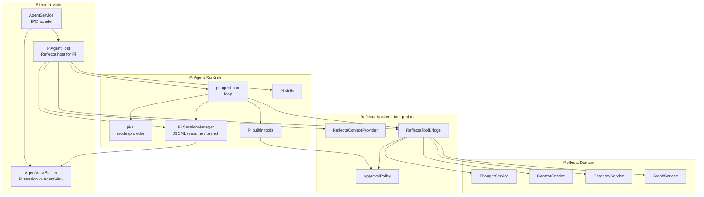
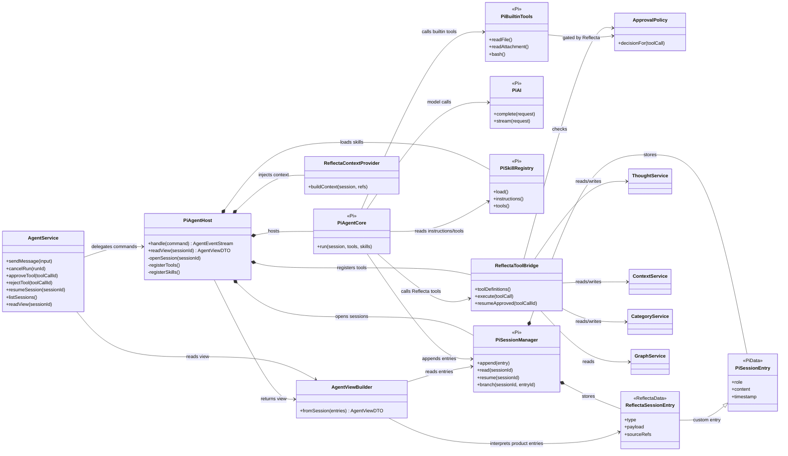
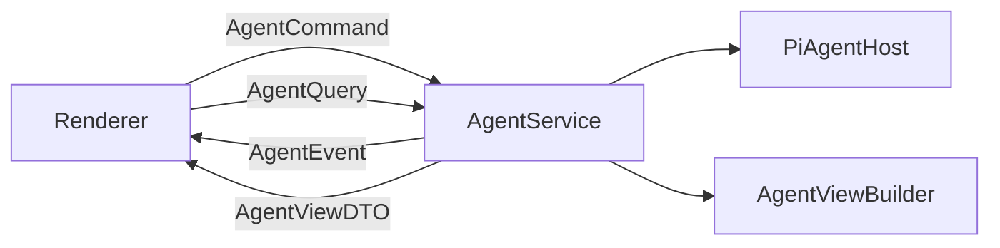
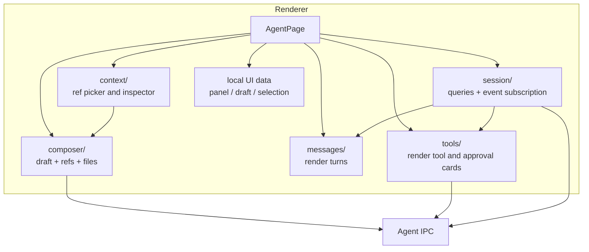
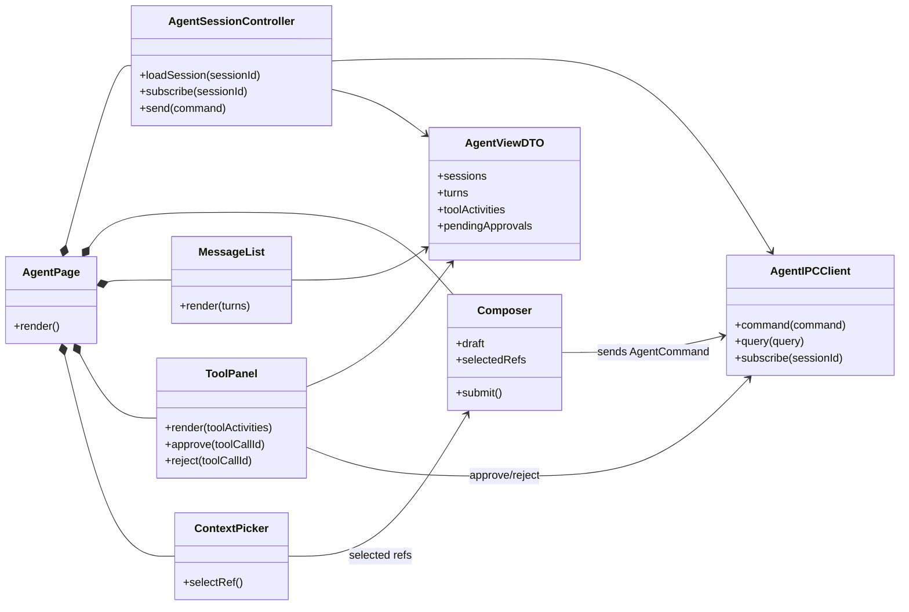
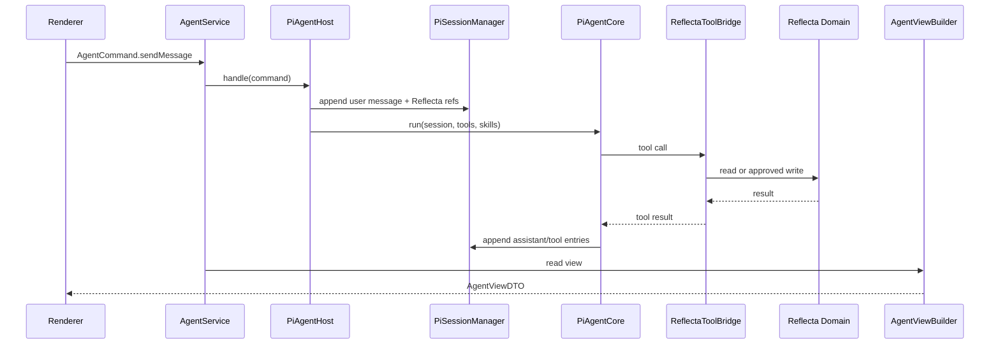

# Reflecta 1.1.0 Agent Tech Architecture

> 日期：2026-06-22
>
> 状态：Draft
>
> 主题：把 Agent runtime 从 AI SDK chat runtime 迁到 Pi Agent，并明确后端、IPC、前端各自负责什么。
>
> 这份文档只讲整体技术架构和心智模型，不讲 implementation phases。

## 1. 一句话心智模型

Reflecta Agent 是：

```txt
Reflecta product shell around Pi Agent runtime.
```

Pi Agent 是后端运行内核。Reflecta 不重写 agent framework，只把 Pi Agent 放进自己的产品语义里。

```txt
Renderer
  -> IPC commands
  -> AgentService
  -> PiAgentHost
      -> Pi Agent Runtime
      -> Reflecta integration
  -> AgentViewBuilder
  -> IPC view/events
  -> Renderer
```

核心原则：

```txt
Pi owns generic agent mechanics.
Reflecta owns product meaning.
Backend owns agent runtime.
Frontend owns presentation.
```

## 2. Backend Architecture

后端负责运行 Agent。前端不运行 Agent。



### 2.1 Backend Classes



### 2.2 What Each Backend Class Means

| Class                     | Meaning                                         | Why it exists                                                     |
| ------------------------- | ----------------------------------------------- | ----------------------------------------------------------------- |
| `AgentService`            | Thin Electron IPC facade.                       | Keeps IPC separate from runtime decisions.                        |
| `PiAgentHost`             | The class that runs Pi Agent inside Reflecta.   | One place knows both Pi runtime and Reflecta integration.         |
| `PiAgentCore`             | Pi-owned loop.                                  | We do not rewrite model/tool/model continuation.                  |
| `PiSessionManager`        | Pi-owned JSONL session/resume/branch.           | We use Pi's session model as agent history.                       |
| `ReflectaContextProvider` | Builds Reflecta context for a Pi run.           | Pi does not know Thought / Context / Category.                    |
| `ReflectaToolBridge`      | Exposes Reflecta tools to Pi.                   | Pi can call Reflecta domain actions through a controlled adapter. |
| `ApprovalPolicy`          | Decides which calls need user approval.         | Approval is a product rule, not a generic Pi rule.                |
| `AgentViewBuilder`        | Converts Pi session entries into renderer DTOs. | Frontend needs a product view, not raw Pi entries.                |

## 3. What AgentViewBuilder Is

`AgentViewBuilder` is the clearer name for what earlier drafts called `Projector`.

It is not a runtime. It does not call the model. It does not execute tools. It does not decide approval.

It is a pure converter:

```txt
Pi session JSONL entries
  + Reflecta custom entries
  -> AgentViewDTO
```

Example:

```txt
Pi assistant message entry
  -> assistant turn

Pi tool call entry
  -> tool activity row

Reflecta approval-requested entry
  -> approval card

Reflecta mutation-result entry
  -> result ref in the UI
```

Why this class exists:

- Pi session history is good for runtime/debug.
- Raw Pi session entries are not a frontend interface.
- The renderer needs stable UI DTOs: turns, tool cards, approval cards, result refs.
- If the app reloads, `AgentViewBuilder` can rebuild the same UI from session history.

So the rule is:

```txt
Pi session is the backend history.
AgentViewDTO is the frontend view.
AgentViewBuilder converts between them.
```

## 4. IPC Seam

IPC is the only seam between backend and frontend.



IPC shapes:

| Shape          | Direction           | Meaning                                             |
| -------------- | ------------------- | --------------------------------------------------- |
| `AgentCommand` | Renderer -> Backend | User intent: send, cancel, approve, reject, resume. |
| `AgentQuery`   | Renderer -> Backend | Read sessions or one session view.                  |
| `AgentEvent`   | Backend -> Renderer | Live event for the active session.                  |
| `AgentViewDTO` | Backend -> Renderer | Full view model for rendering.                      |

IPC must not expose:

- raw Pi session entries
- provider SDK chunks
- Pi internal tool objects
- AI SDK `UIMessage`

## 5. Frontend Architecture

前端负责展示和发命令。前端不负责 agent loop，也不直接理解 Pi session。



### 5.1 Frontend Classes / Modules



Frontend modules:

| Module      | Owns                                                                    | Does not own                        |
| ----------- | ----------------------------------------------------------------------- | ----------------------------------- |
| `session/`  | Fetching `AgentViewDTO`, subscribing to `AgentEvent`, sending commands. | Pi session parsing, tool execution. |
| `composer/` | Draft text, selected refs before submit, files before submit.           | Prompt building, model input.       |
| `messages/` | Rendering turns from `AgentViewDTO`.                                    | Runtime history.                    |
| `tools/`    | Rendering tool activity and approval controls.                          | Approval truth.                     |
| `context/`  | Picking Thought / Context / Category refs.                              | Expanding refs into model context.  |

The frontend consumes:

```txt
AgentViewDTO
AgentEvent
```

The frontend does not consume:

```txt
PiSessionEntry
ReflectaSessionEntry
UIMessage
provider stream chunks
```

## 6. Backend Data Vs Frontend Data

### Backend keeps

- Pi JSONL sessions.
- Pi run/session metadata.
- Reflecta custom session entries.
- Approval decisions.
- Tool results.
- Knowledge writes through domain modules.

### Frontend keeps

- Composer draft.
- Currently selected refs before submit.
- Panel open/closed data.
- Scroll and visual preferences.
- Cached `AgentViewDTO` from the backend.

Rule:

```txt
If it must survive app restart or explain a run, backend keeps it.
If it only affects the current screen, frontend keeps it.
```

## 7. Main Flows

### 7.1 Send Message



### 7.2 Approval

```txt
Pi calls an approval-gated tool
  -> ReflectaToolBridge appends a Reflecta approval entry into Pi session
  -> AgentViewBuilder turns that entry into an approval card
  -> frontend sends approve/reject command
  -> PiAgentHost resumes the pending tool call
  -> ReflectaToolBridge performs or rejects the operation
  -> Pi session records the outcome
  -> AgentViewBuilder returns the updated AgentViewDTO
```

The approval card is not the source of truth. The session entry is.

### 7.3 Resume

```txt
App opens
  -> PiAgentHost reads Pi sessions
  -> AgentViewBuilder rebuilds AgentViewDTO
  -> unfinished runs are marked interrupted or resumed by PiAgentHost policy
```

The first target is not necessarily "continue a half-open stream". The architectural target is:

```txt
The whole Agent UI can be rebuilt from Pi session history.
```

## 8. What Pi Agent Does Here

| Pi part          | Responsibility in Reflecta                                |
| ---------------- | --------------------------------------------------------- |
| `pi-agent-core`  | Runs the model/tool/model loop and stop conditions.       |
| `pi-ai`          | Provides model/provider abstraction for the loop.         |
| Pi session JSONL | Stores agent history for debug, resume, branch, replay.   |
| Pi skills        | Provides reusable instructions/tool bundles.              |
| Pi builtin tools | Supplies generic local tools where Reflecta enables them. |

Reflecta adds:

- Thought / Context / Category context.
- Reflecta tools.
- Approval policy.
- Domain writes.
- Frontend view DTOs.

## 9. Architecture Review Checks

- Does this belong to backend runtime or frontend presentation?
- Is this generic agent behaviour? If yes, why is Pi not owning it?
- Is this Reflecta product meaning? If yes, is it represented as a Reflecta custom session entry?
- Is the frontend reading `AgentViewDTO`, not raw Pi entries?
- Can the UI rebuild from Pi session history?
- Does approval truth live in session history, not button-local data?
- Does every knowledge write go through Reflecta domain modules?
- If Pi changes internally, is the blast radius mostly `PiAgentHost`, `ReflectaToolBridge`, or `AgentViewBuilder`?
