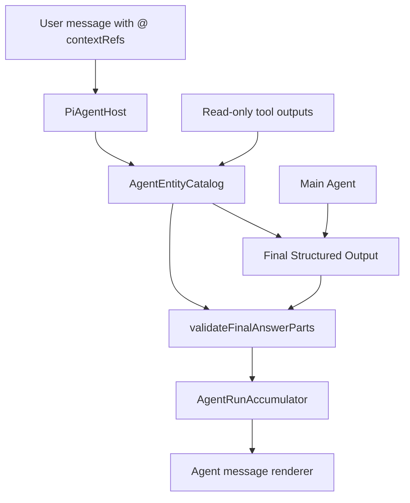

# Agent Inline Reference Module Mental Model

> 状态：Proposed
>
> 日期：2026-07-02
>
> 读者：接手 Agent inline reference 模块的工程师
>
> 目的：解释这个模块应该如何被理解，而不是教你按步骤操作。

## 一句话

Reflecta 的正文内联引用不是 markdown citation 系统，而是一个受校验的 message parts 协议：

```text
Agent 最终答案 = text part + entity_ref part
entity_ref 是否能点击 = 必须通过本轮 AgentEntityCatalog 校验
```

只要守住这条线，模块就会变得可控。只要绕开这条线，系统就会重新掉回 parser、短号、title matcher、二次改写这些坑里。

## 产品心智

Reflecta 的核心价值是让用户沉淀可追溯的个人理解。Agent 在正文里引用 Understanding、Context、Domain，不是为了做学术论文式 References，也不是为了在底部列资料来源，而是为了让一句回答能直接回到用户自己的知识对象。

所以 inline reference 的本质是：

```text
自然语言回答中的某个位置
  指向一个真实 Reflecta entity
  用户点击后能打开那个 entity
```

这里最重要的不是“看起来像引用”，而是“引用目标必须是真的”。标题、短号、`[1]`、`ref:nanoid` 都不是 Reflecta entity identity；只有真实 `entityId` 才是。

## 核心不变量

这个模块只保护一个不变量：

```text
所有最终可点击的 inline entity reference，
必须来自本轮 AgentEntityCatalog 中真实出现过的 entity。
```

这句话里有三个关键词：

- `最终`：运行中的 `assistant.text.delta` 可以只是草稿，不承担最终引用协议。
- `可点击`：普通文本里出现 `<entity_ref ...>`、`[1]`、标题，都不自动变成链接。
- `本轮`：entity 必须来自用户显式 @ 的对象，或本轮工具实际返回过的对象。

如果一个实现不能维护这个不变量，它就不属于这个模块的主路径。

## 三个平面

接手这个模块时，先把三件事分开。

### 1. Answer Text

Answer text 是自然语言。它可以解释、总结、追问、建议。

它不应该承载隐藏协议。不要让模型在普通字符串里手写 XML、JSON、YAML、`[[...]]`、`[1]` 或 `ref:`，然后再由 renderer 解析。

### 2. Citeable Entities

Citeable entities 是本轮可被做成链接的 Reflecta 对象集合。现在由 `AgentEntityCatalog` 表示。

它不是限制 Agent 只能思考什么，也不是知识库查询层。它只是告诉最终答案校验器：

```text
哪些 entity id 在这轮对话里有来源，可以安全渲染成可点击链接。
```

### 3. Rendered Links

Rendered links 是 UI 对 validated `entity_ref` 的投影。

renderer 不应该决定 identity。renderer 只应该拿到已经校验过的 `AgentTextPart[]`，把 `entity_ref` 渲染成对应 Understanding、Context、Domain 的链接。

## Module 地图

当前模块已经有很多正确零件，问题是它们的心智边界没有被写清楚。



概念和代码大致对应如下：

| 概念                 | 代码位置                                                                         | 应该承担的责任                                                 |
| -------------------- | -------------------------------------------------------------------------------- | -------------------------------------------------------------- |
| Shared protocol      | `apps/electron/src/preload/typings/agent.ts`                                     | 定义 `AgentTextPart`、`AgentEntityCatalogEntry` 和相关事件形状 |
| Catalog              | `apps/electron/src/main/services/agent/agent-entity-catalog.ts`                  | 收集本轮真实出现过的可引用 entity                              |
| Validator            | `apps/electron/src/main/services/agent/agent-text-parts.ts`                      | 校验 final parts 是否只引用 catalog 内 entity                  |
| Run coordinator      | `apps/electron/src/main/services/agent/pi-agent-host.ts`                         | 串起 Agent run、tool events、catalog updates 和 final answer   |
| Turn accumulator     | `apps/electron/src/main/services/agent/agent-run-accumulator.ts`                 | 把运行事件折叠成 assistant turn，保存 final parts              |
| Renderer             | `apps/electron/src/renderer/src/modules/chat/messages/agent-message-content.tsx` | 把 validated parts 渲染成正文和链接                            |
| Historical finalizer | Removed from the main path                                                       | 历史过渡方案，不应继续成为主路径中心                           |

### `AgentTextPart`

`AgentTextPart` 是这个模块的 public interface。

它只有两种 part：

```ts
type AgentTextPart =
  | { type: "text"; text: string }
  | {
      type: "entity_ref";
      entityType: "understanding" | "context" | "domain";
      entityId: string;
      fallbackText?: string;
    };
```

这就是最终答案的结构化形态。不是 markdown string 加后处理，也不是一段普通文本里嵌特殊 token。

### `AgentEntityCatalog`

`AgentEntityCatalog` 是本轮可引用 entity 集合。

它负责从两个入口收集 entity：

- 用户消息里的 `contextRefs`。
- read-only tool outputs 里真实返回过的 Understanding、Context、Domain id。

它不负责：

- 给 entity 分配 `U1` / `D1` / `R1`。
- 按标题扫描正文。
- 判断某句话该不该链接。
- 限制 Agent 的知识或推理范围。

Catalog 的正确理解是“provenance gate”：它只回答一个问题：

```text
这个 entity id 在本轮回答里有没有真实来源？
```

### Final Structured Output

Final Structured Output 是主 Agent 把最终答案提交给 Reflecta runtime 的 seam。它不是一个新模块，也不是一个必须单独存在的 channel。

目标形态是主 Agent 直接提交：

```ts
{
  parts: AgentTextPart[];
}
```

这个 seam 应该靠近 Agent 的最终出口，而不是放在 renderer，也不是放在另一个 LLM finalizer 后面。

原因很简单：插引用是“回答的一部分”。如果先让主 Agent 写完普通答案，再让第二个模型重写整篇答案补引用，第二个模型就变成另一个回答 Agent。它会引入延迟、改写语义，也会让责任边界失控。

### Streaming Rendering

结构化输出不能牺牲前端 streaming。

正确心智是：前端渲染的是同一个 assistant message block 的 streaming state。runtime 一边消费 LLM 的 structured output stream，一边把已经稳定的前缀变成 partial event：

```text
stable text parts + stable validated entity_ref parts + previewText
```

renderer 每次收到 partial，就更新同一个 message block：

- `text` part 立即显示。
- 完整且 catalog-valid 的 `entity_ref` 可以立即显示成链接。
- 未完成的当前文本只作为 plain preview 显示。
- 未完成或未校验的 `entity_ref` 不能提前变成链接。

完整 `{ parts }` 到达后，再做最终 schema validation 和 catalog validation。成功后，streaming block 变成 done；失败则 failed/retry。

如果某个实现只能等 LLM 全部结束后才拿到 `{ parts }`，它不满足这个模块的 streaming UX 要求。

### `validateFinalAnswerParts`

`validateFinalAnswerParts(parts, catalog)` 是硬门。

它检查每一个 `entity_ref`：

```text
`${entityType}:${entityId}` 必须存在于 catalog
```

校验通过，parts 才能被持久化为最终可点击答案。校验失败，不应该静默 fallback 成“看起来正常”的文本答案。

`fallbackText` 只是 label fallback，不是 identity fallback。它不能把一个不存在的 `entityId` 变成合法引用。

### `AgentRunAccumulator`

`AgentRunAccumulator` 把一轮运行中的事件折叠成 assistant turn。

它应该持久化 validated final parts，而不是持久化模型手写的隐藏协议。它可以保存运行中的 text delta，但最终 inline reference 的可信来源应该是 final answer parts。

### Renderer

renderer 的职责是低层且确定的：

```text
validated AgentTextPart[] -> 可见文本 + 可点击 entity link
```

它不应该做 parser，不应该做 title matching，也不应该在 catalog 之外猜 entity。renderer 看到普通 text part，就当普通文本渲染；看到 validated `entity_ref`，才渲染链接。

### Historical finalizer

二次 LLM finalizer 是历史过渡方案，不应该是目标架构中心。

它现在做的是：

```text
主 Agent 普通草稿
  -> 第二个 LLM 读取草稿、tool results、catalog
  -> 第二个 LLM 重写最终 AgentTextPart[]
```

这个模块可以短期保留用于兼容，但不要继续扩大它的职责。目标方向是把 structured final answer 移回主 Agent 的最终出口。

## 为什么不需要 `ReferenceRegistry`

`ReferenceRegistry` 看起来能提供一个中间层，例如 `R1 -> understanding:u_123`。但 Reflecta 这里不需要它。

原因不是“registry 一定错”，而是它解决的问题不属于当前主问题。

当前主问题是：

```text
最终可点击引用是否指向本轮真实 entity？
```

这个问题已经由 `AgentEntityCatalog + validateFinalAnswerParts` 解决。

再加一个 registry 会重新制造几类历史问题：

- display token 会进入对话历史。
- 模型可能把 `R1` / `U1` 当成真实工具参数。
- 跨轮历史里短号含义会变。
- 工程师需要维护“真实 id”和“展示 handle”的双重身份系统。

最干净的 interface 是直接使用真实 entity id：

```ts
{ type: "entity_ref", entityType: "understanding", entityId: "u_123" }
```

但“直接使用真实 id”不等于“不需要校验”。数据库里存在一个 id，只说明它存在；catalog 里出现过，才说明它在这轮回答里有来源，可以被做成 clickable claim。

## 和开源方案的关系

开源项目里更稳定的引用方案，核心不是让模型手写某种文本格式，而是把 source/reference 作为运行时结构化数据挂在 message 上。

- Dify、AnythingLLM、Khoj 这类 RAG/agent 系统，会在检索或工具执行阶段收集 source metadata，再挂到回答消息上。
- LlamaIndex、Open WebUI 常见的 `[1]` inline citation 更适合文档 citation，但它是文本协议，放到 Reflecta entity identity 上会重踩短号和 parser 问题。
- Vercel AI SDK、LangChain、provider-native citation 的方向是 structured annotations / source parts，而不是普通 markdown string。

Reflecta 应该吸收的是“引用目标来自 runtime sidecar metadata，并在最终消息结构里显式表达”，不是照搬 `[1]`。

## 失败语义

这个模块要稳定，失败语义必须硬。

- 没有 catalog，答案可以是纯文本。
- 有 catalog，但最终答案没有有效 structured parts，不能假装 inline references 成功。
- `entity_ref` 指向 catalog 之外的 id，是 final answer failure。
- schema 错，是 final answer failure。
- 普通文本里出现 `<entity_ref ...>`，仍然只是普通文本。
- renderer 找不到 catalog entry 时可以显示 fallback text 兼容旧数据，但新链路不应该依赖这个路径。

这套语义的重点是避免“看起来成功”。inline reference 最怕的是 UI 给用户一个可点对象，但这个对象不是 Agent 真正基于本轮上下文引用出来的。

## Seam 放在哪里

用模块设计语言说，这个模块的 seam 是：

```text
Final Structured Output + validateFinalAnswerParts
```

不是：

- prompt 里的格式要求。
- renderer 里的 parser。
- title matcher。
- 第二个 LLM finalizer。
- 一张额外的短号 registry。

`AgentTextPart[]` 和 `AgentEntityCatalogEntry[]` 是应该被稳定下来的 interface。catalog extraction、provider tool plumbing、UI link rendering 都是 implementation detail。

这个 seam 的 depth 来自：外部只看到很小的 interface，内部可以隐藏工具输出形状、streaming event、provider 能力差异和 UI 路由细节。

## 改代码时的 locality

以后改这个模块，先判断自己碰的是哪一层。

- 新增 entity 类型：改 shared type、catalog extraction、validator key、renderer link generation。
- 新增工具返回 shape：只改 `AgentEntityCatalog` 的 extraction，不改 renderer。
- 改 UI 展示：只改 renderer，不改 identity 规则。
- 改 Agent 输出协议：改 Final Structured Output 和 validator，不写正文 parser。
- 改历史兼容：可以在 normalization 层处理旧数据，但不要把兼容路径升级成新协议。

好的改动应该有 locality：一个需求应该落在它所属的层里，不应该同时把 prompt、parser、renderer、registry、finalizer 全部搅动。

## PR 红旗

看到下面这些改动，基本可以先停下来重审设计：

- 从 assistant text 里解析引用。
- 根据 title 自动匹配 entity。
- 引入 `U1`、`D1`、`R1`、`[1]` 作为 Reflecta entity identity。
- 让 renderer 决定一个文本片段对应哪个 entity。
- 把 `fallbackText` 当成合法引用依据。
- 让第二个 LLM 读取完整 tool results 并重写最终答案。
- 为了解决 inline reference，又新增一层 reference registry。
- schema 错或 id 错时静默降级成普通文本。

## 接手者应该记住的模型

这个模块不是“怎么让 AI 按格式写引用”，而是“怎么让 Reflecta runtime 只渲染经过验证的 entity reference”。

最终可控架构就是：

```text
真实 entity 来源由 AgentEntityCatalog 收集；
主 Agent 在最终出口提交 AgentTextPart[]；
validateFinalAnswerParts 做硬校验；
renderer 只渲染 validated entity_ref。
```

其他东西都只能是辅助，不能成为新的中心。
