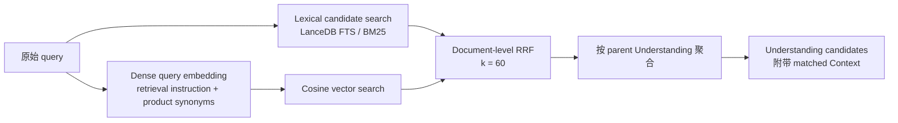

# v1.1.20 — Hybrid Retrieval

## 设计文档

- [Retrieval Index 同步逻辑](retrieval-index-sync.md)：保存后的异步增量更新、Retrieve 最终一致性、短生命周期模型和启动恢复设计。

## 目标

让 `retrieve_knowledge` 对 Agent 实际产生的关键词 query 稳定工作：Lexical 与 Dense 每次同时检索，最后使用 RRF 融合，不再因为 Lexical 命中数量动态关闭 Dense，也不再要求所有关键词同时出现在同一文档中。

这项改动服务于 Reflecta 的核心目标：Agent 在回应用户时，能够找回与当前问题有关的个人 Understanding 及其 Context，而不是只找回字面相同的资料。

## 社区基线

本轮实现采用与 Reflecta 最接近的社区方案：

- [Weaviate Hybrid Search](https://docs.weaviate.io/weaviate/search/hybrid) 使用一个 `query` 同时执行 BM25 与 vector search；BM25 默认是 OR，并允许控制至少命中多少 query token。
- [Qdrant Hybrid Search](https://qdrant.tech/documentation/search/text-search/hybrid-search/) 将同一个 query 转成 dense 与 sparse 表示，然后融合结果。
- [OpenSearch Hybrid Search Optimization](https://docs.opensearch.org/latest/search-plugins/search-relevance/optimize-hybrid-search/) 在 lexical 与 neural 两个查询分支中复用同一个搜索文本，并通过 relevance judgments 评估参数。
- [LanceDB Full-Text Search](https://docs.lancedb.com/search/full-text-search) 的 terms query 支持多个搜索词；显式的 AND/OR 应由检索器表达，不应在 BM25 之后手写全部 token 命中过滤。

因此本轮不要求 Agent 把关键词改写成完整自然语言。关键词、短语、精确标题和自然语言都继续使用同一个 `query` 接口。

## 最终检索流程



Lexical candidate search 与 query embedding 在同一时间启动。Dense 需要先完成 query embedding 才能执行 vector search，但不会再等待 Lexical 结果后才决定是否运行。

## Lexical 规则

当前索引使用 LanceDB `0.31.0` 的原生 ICU tokenizer，同时处理中文、英文和中英混合内容。Lexical query 语义为：

1. 使用 LanceDB `MatchQuery` 和 `Operator.Or` 执行 BM25 terms search。
2. 候选池 overfetch 为 `max(limit × 5, 20)`。
3. 保留 LanceDB 返回的 BM25 顺序，让候选结果直接参与 RRF。

BM25 后不再执行 `text.includes(term)`、完整 term gate、全表扫描或 SQLite fallback。中文分词、term frequency、document frequency 和排序全部由 ICU FTS/BM25 负责。

旧逻辑是：

```text
所有 query token 都必须出现在同一文档中
```

新逻辑是：

```text
完整 query term 之间使用 OR；命中越多、词越稀有，BM25 排名通常越高
```

Retrieve 只查询 LanceDB，不从 SQLite 临时补入尚未同步的内容。保存后的短暂索引延迟采用最终一致性处理。

## Dense 规则

Dense 保留 Qwen retrieval instruction，并保留经过质量基准证明有效的产品同义词扩展：

- `经验`、`经历`、`上下文` → `Context`
- `理解`、`认知` → `Understanding`

此前的正则使用字符集合，只要出现其中任意单个汉字就会误触发。本轮改为完整产品词匹配。除此之外不重写 Agent 的原始 query。

向量检索使用 cosine distance，并 overfetch `max(limit × 5, 20)` 个文档参与 RRF。

## 增量索引与本地模型生命周期

最终实现见 [Retrieval Index 同步逻辑](retrieval-index-sync.md)。旧的 marker、延时调度和 Retrieve 补偿链路已经移除；知识写入在 SQLite 提交后只把 affected Understanding ID 交给 single-flight coordinator，Electron 保存立即返回，CLI 在命令退出前 flush。

Retrieval index schema 已升级为 v4，并为稳定排序后的完整投影计算 SHA-256 `contentHash`。v4 使用 ICU FTS；旧 v3 n-gram 表不会被读取。启动时先比较 SQLite 投影与 LanceDB `{id, parentUnderstandingId, contentHash}` manifest：一致时不加载 embedding，不一致时只更新受影响的 Understanding，表或模型不兼容时完整 overwrite 重建。

增量更新只执行 `mergeInsert` 或 parent 范围删除。新 fragment 在 `optimize()` 前由 LanceDB 默认查询自动扫描；累计 20 次成功数据修改后，coordinator 在后台调用一次 `table.optimize()` 将新数据增量并入 FTS。`optimize()` 失败只记录维护 warning，不会把已经成功提交、仍然可查询的数据标记为同步失败。

本地 llama.cpp embedding 不在 Electron 主进程常驻。Dense query 和索引同步共用一个按需启动的 Electron Utility Process：

1. 有 embedding 请求时启动子进程并加载本地模型。
2. 子进程串行处理已经排队的 query 或索引批次，防止同时加载多份模型。
3. 队列清空后立即终止子进程，由操作系统回收模型和 native runtime 内存。

因此本地 Dense retrieval 仍会产生模型推理期间的瞬时内存峰值，但不会让约 600 MiB 的模型在 Reflecta 空闲期间长期占用内存。OpenAI-compatible provider 继续直接调用远程 API，不经过本地子进程。

## RRF

Lexical 与 Dense 分别产生有序文档列表。每个文档在每条列表中的贡献为：

```text
1 / (60 + rank + 1)
```

同一文档同时出现在两路时，两项相加，因此稳定出现在两路前列的文档会被提升。RRF 不直接混合 BM25 score 与 cosine distance，避免两种不同分数尺度互相污染。

RRF 在 RetrievalDocument 层完成，随后 Context hit 折叠回所属 Understanding。这样某条 Understanding 可以同时获得自身正文和多个 Context 的证据。

## Retrieval 质量验证

生产派生的观察记录、固定语料、benchmark 实现和结果属于本地私有评估资产，不在公开文档和追踪文件中保存。

## 代码位置

- `packages/server/src/domains/retrieval/lancedb-index.ts`：ICU FTS、并行两路检索、Lexical OR、Dense query、RRF 和增量 optimize。
- `packages/server/src/domains/search/core.ts`：`retrieve_knowledge` 强制 hybrid，不参与索引同步。
- `packages/server/src/domains/retrieval/retrieval.test.ts`：BM25 OR、RRF 和 Dense query 回归测试。
- `packages/server/src/domains/retrieval/retrieval-sync.test.ts`：显式索引构建与最终一致性基线。
- `packages/server/src/domains/retrieval/coordinator.ts`：保存后立即入队、single-flight、一次重试、启动对账和状态。
- `packages/server/src/domains/retrieval/sync.ts`：v4 索引重建、manifest 对账和按 Understanding 增量更新。
- `apps/electron/src/main/retrievalIndexCoordinator.ts`：Electron coordinator 单例。
- `apps/electron/src/main/retrievalEmbeddingRunner.ts`：短生命周期 Utility Process 队列。
- `apps/electron/src/main/retrieval-embedding-worker.ts`：子进程中的本地 llama.cpp embedding。
