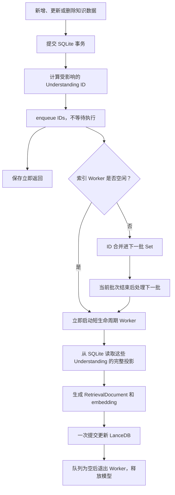
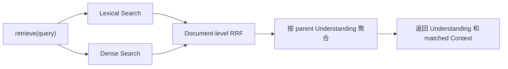

# Retrieval Index 同步逻辑

> 状态：已实现。本文记录取代 `.dirty` marker、延时调度和 Retrieve 补偿后的最终方案。

## 结论

SQLite 是知识数据的事实源，LanceDB 是可重建的检索投影。

一次产品写入只负责：

1. 提交 SQLite 事务。
2. 将受影响的 Understanding ID 提交给进程内索引队列。
3. 立即向调用方返回保存结果，不等待 embedding 或 LanceDB。

后台索引任务立即处理队列。它只更新受影响的 Understanding 聚合，任务结束后释放本地 embedding 模型。Retrieve 不检查索引任务、不等待索引任务，也不从 SQLite 补偿未同步数据；它始终直接查询 LanceDB，接受一个很短的最终一致性窗口。

## 设计原则

### 保存和索引解耦

“将 SQLite 数据同步到 LanceDB”描述的是数据关系，不代表保存调用需要同步等待索引完成。

```text
错误：SQLite commit → await embedding → await LanceDB → 保存返回

正确：SQLite commit → enqueue affected IDs → 保存返回
                                  └→ 后台更新 LanceDB
```

索引失败不能回滚或阻塞已经成功的产品写入。

### Understanding 是增量同步单位

一条检索文档并不只依赖一行数据。它可能包含：

- Understanding 的标题和正文；
- 属于该 Understanding 的 Context；
- 直接关联 Domain 的 ID 和名称；
- 检索投影版本和 embedding 模型版本。

因此增量同步不以单行 Context 或单个字段为单位，而是重新生成受影响 Understanding 的完整检索投影。这样可以在一次提交中同时处理文档新增、修改和删除。

### 只合并真实并发，不人为等待

当前产品不是按键级自动保存：Understanding 主要在失焦、快捷键保存或离开时写入，Context 通过显式保存写入，Domain 也是离散操作。因此不设置 2 秒 debounce 或 10 秒 max-wait。

队列只做 single-flight：

- Worker 空闲时，新任务立即启动。
- Worker 正在运行时，新 ID 放入一个 `Set`，作为下一批。
- 当前批次完成后，如果 `Set` 非空，立即处理下一批。
- 同一个 Understanding 在同一批中最多出现一次。

### Retrieve 接受短暂最终一致性

Retrieve 不承担索引一致性修复。刚保存的数据可能在极短时间内仍然以旧版本出现；后台任务完成后，后续 Retrieve 自然读到新版本。

不为这个低概率窗口引入：

- pending/running 状态检查；
- Retrieve `flush()`；
- 等待后台索引；
- SQLite lexical overlay；
- 新旧结果去重与融合。

## 更新同步流程



### 不同写入产生哪些 affected IDs

| 写入                                 | 需要同步的 Understanding             |
| ------------------------------------ | ------------------------------------ |
| 新增、更新、删除、恢复 Understanding | 当前 Understanding                   |
| 新增、更新、删除、恢复 Context       | Context 所属 Understanding           |
| Context 移动到另一个 Understanding   | 原 Understanding 和新 Understanding  |
| 修改 Understanding 的 Domain 关联    | 当前 Understanding                   |
| Domain 改名                          | 直接关联到该 Domain 的 Understanding |
| 删除 Domain                          | 删除前直接关联的 Understanding       |

Domain 创建、排序和仅修改父级不会入队。当前投影不包含 Domain 层级路径，这些操作不会改变任何 RetrievalDocument。

这里的 affected ID 只存在于进程内队列，不创建 `.dirty`、`.dirty-understandings` 或另一套持久任务状态。

### LanceDB 一次增量提交做什么

后台任务先完成整批文档的读取和 embedding，再修改 LanceDB。目标写入语义是：

```text
source = 本批 affected Understanding 的完整最新文档
target = LanceDB 中 parentUnderstandingId 属于本批的文档

相同 document ID：更新
只在 source：新增
只在 target：删除
```

应使用 LanceDB 的 merge/upsert 能力尽可能在一次版本提交中完成这三个动作。这样并发 Retrieve 只会读到提交前或提交后的版本，不需要观察中间状态。

稳定的 RetrievalDocument ID 负责识别同一文档。Understanding 主文档和 Context 文档都必须从实体 ID 确定性生成 ID，不能在每次同步时随机生成。

## Retrieve 流程



Retrieve 与索引队列之间没有依赖：

- 不读取队列状态；
- 不读取 dirty marker；
- 不触发增量同步或完整重建；
- 不等待正在运行的 Worker；
- 不查询 SQLite 生成临时候选。

索引更新期间，如果一次 Retrieve 已经拿到旧表版本，就使用旧版本完成本次 Dense、Lexical 和 RRF；之后的请求读取新提交版本。检索的两条通道应基于同一个 LanceDB 版本，避免 Dense 和 Lexical 分别看到不同提交。

## 本地模型生命周期

本地 embedding 模型不在 Electron 主进程常驻：

1. 队列从空变为非空时，启动 Utility Process。
2. 子进程加载一次模型并处理当前批次。
3. 处理期间到达的新 ID 合并到下一批；如果下一批已经形成，可以由同一个子进程继续处理。
4. 队列清空后立即退出子进程，释放模型和 native runtime 内存。

这避免长期占用约 600 MiB 内存，同时不会为真正重叠的一组更新反复加载模型。

## 数据同步与物理索引维护

增量数据提交后不再调用 `createIndex`。FTS 只在完整建表时创建，增量路径始终使用 `mergeInsert("id")`。

实现验证发现，当前 LanceDB 0.30 对 FTS indexed row 执行 matched update 或删除后，BM25 索引可能暂时没有最新文本；但每批执行 `table.optimize()` 又会在较大的 n-gram 索引上触发原生 inverted-index panic。因此正确性不依赖 optimize：Lexical 通道在 BM25 排序候选之外，从同一个 LanceDB 当前表补入至少命中一个完整 term 的最新行。Retrieve 仍然不读 SQLite、不等待 coordinator。

物理维护恢复为 LanceDB 文档建议的修改次数阈值：

```text
每次增量批次：merge/upsert/delete 文档

累计 20 次成功数据修改：table.optimize()

投影版本、向量维度或模型不兼容：完整 rebuild
```

计数只存在内存中，不承担恢复职责。维护发生在后台 coordinator 中，不阻塞产品保存。完整 rebuild 使用 overwrite 建新表并创建一次 FTS，不再额外 optimize。

## 异常与启动恢复

进程内队列只优化正常运行时的更新延迟，不承担崩溃恢复。SQLite 始终保留完整事实，LanceDB 可以重新生成。

启动时进行轻量一致性检查：

1. 检查 LanceDB 表、投影版本和 embedding 模型版本。
2. 比较 SQLite 当前投影与 LanceDB 中的稳定文档 ID、内容哈希。
3. 一致时不加载模型。
4. 不一致时只补齐新增、变化和删除的文档。
5. 表不存在或版本不兼容时执行完整 rebuild。

这条恢复路径处理 SQLite 提交后应用退出、后台 Worker 失败或上次索引中途终止，不需要持续轮询。运行中的单次任务失败可以保留在内存队列中重试一次；再次失败则暴露索引错误状态，等待下一次启动对账或用户手动重建，不影响产品数据。

## 已删除的旧逻辑

Phase 1 已独立删除并提交：

- `.dirty` 与 `.dirty-understandings` 文件；
- dirty listener 和 marker timestamp 竞争处理；
- 2 秒 debounce、10 秒 max-wait、30 秒恢复轮询；
- SearchCore 中的 dirty 判断；
- Retrieve 的 SQLite lexical fallback；
- 每批增量写入后的 FTS `createIndex`。

Phase 2 保留并重构：

- 按 Understanding 构建完整 `RetrievalDocument` 的 projection；
- 短生命周期 embedding Utility Process；
- 单次只运行一个索引任务的 single-flight 约束；
- LanceDB Hybrid Retrieval 和 RRF；
- 手动完整重建入口与索引状态展示。

## 验收标准

1. SQLite 保存耗时不包含模型加载、embedding 或 LanceDB 写入耗时。
2. 一次离散保存会立即触发后台增量更新，不依赖 idle 或定时轮询。
3. 同一 Understanding 的并发通知在一个待处理批次中只索引一次。
4. Worker 运行期间的新写入不会丢失，并在当前批次后继续处理。
5. Retrieve 无论索引是否正在更新，都只执行 LanceDB Hybrid Retrieval。
6. 更新提交前后的任一 LanceDB 版本均可独立完成 Dense、Lexical 和 RRF。
7. 更新完成后，新增、修改、移动和删除的 Context 都与 SQLite 一致。
8. Domain 改名或删除后，直接关联 Understanding 的检索投影得到更新。
9. 应用启动可以发现并修复上次未完成的索引更新。
10. 增量同步不会重新创建 FTS 或 vector index；连续更新后 Lexical 与 Dense 都能读到新文档。

## 实现位置

- `packages/server/src/domains/retrieval/coordinator.ts`：single-flight 队列、重试、状态、启动对账和手动重建边界。
- `packages/server/src/domains/retrieval/sync.ts`：SQLite 投影读取、v3 全量构建、按 Understanding 增量同步和 manifest 对账。
- `packages/server/src/domains/retrieval/lancedb-index.ts`：manifest、`mergeInsert`、parent 范围删除、overwrite 建表和物理维护。
- `packages/server/src/domains/{understanding,context,domain}/core.ts`：事务提交后的 affected ID 通知。
- `apps/electron/src/main/retrievalIndexCoordinator.ts`：Electron 单例和按需 embedding runner 接线。
- `apps/cli/src/services.ts`：CLI 共用 coordinator，并在进程返回前 flush。
