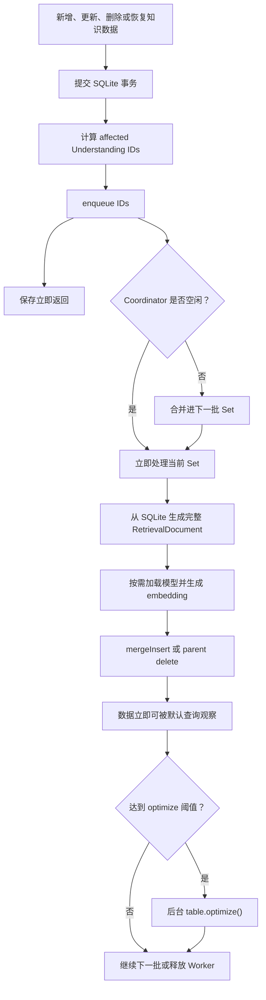
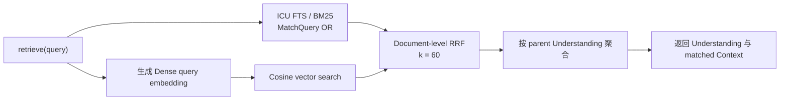

# Retrieval Index 最终同步方案

> 状态：已实现。
>
> 本文取代此前的 n-gram、完整 term 过滤、增量后重建 FTS 和 Retrieve 补偿方案。后续实现以本文为唯一依据，不保留旧方案的兼容分支。

## 结论

Reflecta 的检索采用社区通用的 Hybrid Retrieval：

```text
LanceDB ICU FTS / BM25 ─┐
                        ├─ Document-level RRF ─→ Understanding 聚合
Dense vector search ────┘
```

索引同步采用 LanceDB 官方的数据更新与索引维护模型：

```text
SQLite commit
    ↓
异步 enqueue affected Understanding IDs
    ↓
生成完整 RetrievalDocument + embedding
    ↓
LanceDB mergeInsert
    ↓
未索引 fragment 由查询自动扫描
    ↓
累计到官方建议阈值后 optimize，增量更新 FTS
```

最终方案固定为：

1. SQLite 是知识数据的事实源，LanceDB 是可重建的检索投影。
2. 升级到稳定版 `@lancedb/lancedb@0.31.0`，Lexical FTS 使用原生 ICU tokenizer。
3. 删除 n-gram tokenizer、`text.includes(term)` 二次过滤和应用层中文分词提案。
4. 保存只提交 SQLite 并异步入队，不等待 embedding、LanceDB 或 `optimize()`。
5. 增量同步只调用 `mergeInsert` 或 parent 范围删除，不重建 FTS。
6. 累计 20 次成功的数据修改后，在后台调用一次 `table.optimize()`。
7. Retrieve 始终直接执行 Lexical、Dense 和 RRF，不检查同步状态，不等待队列，不扫描 SQLite 或 LanceDB 全表补偿。
8. 启动时通过 manifest 对账恢复未完成的异步更新。

## 社区基线与版本事实

本方案直接采用 LanceDB 的公开能力，而不是在 BM25 外再实现一套匹配规则：

- [Hybrid Search](https://docs.lancedb.com/search/hybrid-search)：FTS/BM25 与 Dense Search 并行，并通过 RRF 融合。
- [Full-Text Search](https://docs.lancedb.com/search/full-text-search)：混合语言推荐 ICU tokenizer；中文也可以使用 Jieba tokenizer。
- [Keeping the index up to date](https://docs.lancedb.com/search/full-text-search#keeping-the-index-up-to-date)：数据修改后，查询会扫描尚未进入索引的 fragment；`optimize()` 将这些数据增量并入现有 FTS。
- [Reindexing](https://docs.lancedb.com/indexing/reindexing)：`optimize()` 负责 compaction、旧版本清理和 index update，而不是删除并完整重建索引。

版本验证结果：

| LanceDB Node 版本 | ICU FTS 运行结果                                                        |
| ----------------- | ----------------------------------------------------------------------- |
| `0.30.0`          | 失败：`unknown base tokenizer icu`                                      |
| `0.31.0`          | 成功：中文查询、`mergeInsert` 后的新文本和删除旧文本均可被 FTS 正确观察 |

`0.31.0` 的 JavaScript 运行时已经支持 ICU，但该版本的 TypeScript `FtsOptions.baseTokenizer` 联合类型尚未列出 `"icu"`。实现时将这个上游类型遗漏限制在一个 FTS config helper 中，并用真实建索引测试保护；不得把类型兼容处理扩散到检索或同步逻辑。上游类型补齐后直接删除该 helper 中的兼容断言。

## 明确删除的非标准逻辑

最终实现中以下逻辑必须为零：

- `baseTokenizer: "ngram"`、`ngramMinLength`、`ngramMaxLength` 和 `prefixOnly`；
- `lexicalTerms()`、`matchesAnyLexicalTerm()` 或任何 `text.includes(term)` 二次过滤；
- BM25 候选后的全表扫描、精确 term 补入或 SQLite fallback；
- 每次增量保存后的 `createIndex(..., { replace: true })`；
- 为修复 Lexical 可见性而执行的完整 FTS rebuild；
- Retrieve 中的 dirty/pending/indexing 检查、`flush()` 或等待；
- `.dirty`、`.dirty-understandings`、轮询 scheduler 和 marker listener；
- 应用层 `Intl.Segmenter` 预分词；
- 为旧同步 API、旧 marker 或旧 n-gram 表保留的兼容分支。

这些逻辑不是 Hybrid Retrieval 的必要组成部分。它们来自旧版本 LanceDB 的中文 tokenizer 限制或此前的补偿设计，在 `0.31.0 + ICU` 下不再成立。

## 索引结构

### RetrievalDocument

同步单位仍然是 affected Understanding 的完整投影。每条 RetrievalDocument 包含：

- 稳定 document ID；
- `parentUnderstandingId`；
- entity type 和 entity ID；
- `textForLexicalSearch`；
- `textForEmbedding`；
- Domain、medium、title 和时间等 metadata；
- 确定性的 `contentHash`；
- embedding vector。

`contentHash` 对稳定排序后的完整投影计算 SHA-256，用于启动对账。它判断“SQLite 当前投影与 LanceDB 当前行是否相同”，不承担任务状态或锁的职责。

### Index schema version

ICU FTS 与旧 n-gram FTS 不兼容。实现时将 Retrieval index schema version 升级到 v4，并使用新的 LanceDB table name。

v4 的含义同时覆盖：

- RetrievalDocument row schema；
- content projection 规则；
- embedding model 和维度；
- Lexical tokenizer 与 FTS 配置。

旧 v3 表不迁移、不读取，也不原地修改；首次启动直接后台构建 v4 表。这样不需要识别旧 FTS 的 tokenizer 配置，也不会误把 n-gram 表当成 ICU 表。

### FTS 配置

FTS 只在创建 v4 表时创建一次：

```text
baseTokenizer = icu
withPosition = false
```

当前检索不执行 phrase query，因此不保存 token position，减少索引大小和构建成本。Lexical query 使用 LanceDB 原生 `MatchQuery` 和 BM25 排序，不在结果返回后追加字符串判断。

## 保存与异步更新

### 写入边界

一次产品写入的同步路径只做：

```text
提交 SQLite 事务
    ↓
计算 affected Understanding IDs
    ↓
enqueue(ids)，同步返回且不得抛错
    ↓
向调用方返回保存成功
```

embedding、LanceDB 更新和 `optimize()` 全部在保存返回后运行。索引失败不得回滚已经成功的 SQLite 写入。

### affected Understanding IDs

| SQLite 写入                          | 入队的 Understanding                     |
| ------------------------------------ | ---------------------------------------- |
| 新增、更新、删除、恢复 Understanding | 当前 Understanding                       |
| 新增、更新、删除、恢复 Context       | Context 所属 Understanding               |
| Context 移动                         | 原 Understanding 和新 Understanding      |
| 修改 Understanding 的 Domain 关联    | 当前 Understanding                       |
| Domain 改名                          | 直接关联该 Domain 的 Understanding       |
| Domain 删除                          | 删除前直接关联该 Domain 的 Understanding |

Domain 创建、排序和仅修改父级不入队，因为当前 RetrievalDocument 不包含 Domain 层级路径。

### Coordinator

Coordinator 保持一个简单的 single-flight 队列：

- Worker 空闲时，`enqueue()` 立即启动后台处理，不 debounce、不轮询。
- Worker 运行时，新 ID 进入下一批 `Set`。
- 当前批完成后立即处理下一批。
- 同一个 Understanding 在同一批只处理一次。
- LanceDB 数据提交同一时间只允许一个。
- 单批数据同步失败立即重试一次；再次失败进入 `error`，等待下一次启动对账或手动 rebuild。
- `rebuild()` 与增量同步共用同一个串行边界。
- `flush()` 只供 CLI 退出和测试使用，Electron 保存不得调用。

Coordinator 不持久化 pending IDs。崩溃恢复由 SQLite 与 LanceDB manifest 对账负责，而不是增加第二套任务数据库或 dirty marker。

### 增量提交

一批 affected Understanding 的写入语义为：

```text
source = SQLite 当前生成的 affected Understanding 全部 RetrievalDocument
target = LanceDB 中 parentUnderstandingId 属于本批的行

相同 document ID       → update
只存在于 source         → insert
只存在于 target         → delete
```

实现使用一次 `mergeInsert("id")`：

- `whenMatchedUpdateAll()`；
- `whenNotMatchedInsertAll()`；
- `whenNotMatchedBySourceDelete({ where: parent predicate })`。

如果 affected Understanding 已被永久删除，source 为空，直接执行一次 parent predicate delete。

整批 RetrievalDocument 必须先完成读取和 embedding，再开始 LanceDB 写入。LanceDB 的版本化提交保证 Retrieve 观察到提交前或提交后的版本，不观察应用层的 delete/add 中间态。

## FTS 增量维护

### 数据可见性

`mergeInsert` 提交后，新行和更新行可能暂时位于尚未进入 FTS index 的 fragment。LanceDB 默认查询会把：

```text
现有 FTS index 结果 + unindexed fragment flat scan 结果
```

合并后返回，因此正确性不依赖立即 `optimize()`。Retrieve 不使用 `fastSearch()`，因为该模式会主动忽略未进入索引的最新数据。

本地运行验证必须覆盖 ICU FTS 下的以下行为：

1. insert 后新中文 term 立即可搜索；
2. update 后新 term 可搜索，旧 document version 不再出现；
3. delete 后旧 document 不再出现；
4. 上述行为在调用 `optimize()` 之前成立。

### optimize cadence

采用 LanceDB 官方建议的维护阈值：

```text
累计 20 次成功的数据修改，或累计约 100,000 行变化
    ↓
后台 table.optimize()
```

Reflecta 当前数据规模很小，实际会先达到 20 次操作阈值。计数只保存在内存中；进程重启后归零不会影响正确性，只会让 unindexed fragment 暂时多存在一段时间。

`optimize()` 是性能维护，不是数据同步提交：

- 不阻塞保存；
- 不阻塞 Retrieve；
- 不重新 embedding；
- 不完整重建 FTS；
- 失败时记录 warning 并保留待维护计数，后续后台维护重试；
- 失败不把已经成功提交的数据同步标记为失败，因为默认查询仍会扫描 unindexed fragment。

## 更新流程



## Retrieve 流程与同步边界



Lexical 与 Dense 同时启动。Lexical 使用原始 query，由 ICU 同时处理中文、英文和无空格文本；多个 query token 使用 OR，由 BM25 根据命中数量、term rarity 和文档长度排序。

Retrieve 不做：

- `text.includes(term)`；
- SQLite fallback；
- LanceDB 全表扫描补入；
- coordinator 状态读取；
- pending write 检查；
- `flush()`；
- FTS rebuild 或 `optimize()`；
- 对正在发生的索引更新进行特殊处理。

Retrieve 接受保存后到后台 `mergeInsert` 提交前的短暂最终一致性窗口。`mergeInsert` 提交后，不需要等待 `optimize()` 才能读到最新数据。

本次同步重构不修改 Dense query instruction、产品词汇扩展、RRF 参数、Understanding 聚合或 Context evidence 结构；这些属于检索质量设计，不属于索引同步。

## 本地 embedding 模型生命周期

本地模型继续使用短生命周期 Utility Process：

1. 第一个 embedding 请求到达时启动子进程并加载模型。
2. 子进程串行处理已经排队的 query 和索引批次，避免同时加载多份模型。
3. 索引运行期间到达的新 IDs 进入下一批，同一个子进程可以继续处理。
4. embedding 队列清空后退出子进程，释放模型和 native runtime 内存。

ICU FTS 不依赖 embedding 模型。纯 Lexical 查询、启动 manifest 一致以及 `optimize()` 均不得加载模型。

## 启动恢复

启动对账在后台执行，不阻塞窗口创建：

1. 检查 v4 table 是否存在。
2. table 不存在或 embedding model/维度不兼容时，完整 rebuild。
3. table 存在时读取 `{id, parentUnderstandingId, contentHash}` manifest。
4. 从 SQLite 生成当前 projection manifest，不生成 embedding。
5. ID 和 hash 完全一致时直接结束，不加载模型。
6. 存在新增、变化或删除时，换算 affected Understanding IDs，进入同一个增量队列。
7. 对账期间发生的新保存进入下一批 Set，由 single-flight 顺序覆盖。

完整 rebuild 的顺序为：

```text
生成全部 RetrievalDocument
    ↓
完成全部 embedding
    ↓
createTable(..., mode = overwrite)
    ↓
创建一次 ICU FTS
```

完整 rebuild 不在建表后额外调用 `optimize()`。

## 状态与错误语义

公开状态保持：

```text
not_ready | indexing | ready | error
```

- `indexing`：首次 rebuild、手动 rebuild 或数据同步正在运行。
- `ready`：LanceDB table 可查询；允许存在尚未 optimize 的 fragment。
- `error`：表不可用，或数据同步连续两次失败。
- `optimize()` 失败只记录维护 warning，不把可查询且数据已提交的索引改成 `error`。

设置页继续提供显式“重新构建索引”。手动 rebuild 等待完成并展示进度；普通保存永远不等待。

## 落地顺序

本轮按替换而非兼容叠加的方式落地：

1. 升级并锁定 `@lancedb/lancedb@0.31.0`，增加 ICU runtime smoke test 和增量可见性测试。
2. 删除全部 n-gram 参数、term 提取、`includes` 过滤和相关测试；仓库搜索确认旧 symbol 为零。
3. 将 index schema version 升级为 v4，创建 ICU FTS；不读取旧 v3 表。
4. 保留标准 `mergeInsert` 增量提交，删除任何增量后的 `createIndex` 或完整 FTS rebuild。
5. 将 `optimize()` 收敛为后台 best-effort 性能维护，不影响已成功的数据同步状态。
6. 运行同步一致性、Session 质量集、完整 retrieval benchmark 和 Electron/CLI 产品路径验证。
7. 更新 v1.1.20 README 中的 Lexical 规则和最终质量基准，保证文档与代码一致。

不得为了让旧测试继续通过而保留兼容别名、双 tokenizer、旧表读取、结果补偿或 feature flag。

## 验收标准

### Lexical 与 Hybrid Retrieval

1. FTS 配置只使用 ICU，不存在 n-gram 参数。
2. 中文、英文、中英混合、精确标题和空格分隔关键词 query 均由原生 BM25 返回候选。
3. BM25 后不存在完整 term `includes` 过滤。
4. Lexical 与 Dense 每次并行执行，并由 RRF 融合。
5. 16 条 production Session query 继续进入质量基准，hit、MRR 和 bad-hit gate 不退化。

### 增量同步

1. Electron 保存耗时不包含 embedding、LanceDB 写入或 `optimize()`。
2. Context 和 Understanding 的新增、更新、删除、恢复均只刷新 affected Understanding。
3. Context 移动同时刷新原、新 parent。
4. Domain 改名和删除刷新直接关联的 Understanding。
5. `mergeInsert` 后，ICU FTS 与 Dense 都能看到新文档，旧 document version 消失。
6. 增量同步不调用 `createIndex`，不完整重建 FTS。
7. `optimize()` 前后检索结果在数据可见性上保持一致。

### 恢复与产品路径

1. manifest 一致时，启动不调用 embedding。
2. hash 变化只同步相关 Understanding。
3. v3/缺失表触发 v4 完整 rebuild。
4. Retrieve 在 coordinator pending、running 或 optimizing 时仍直接查询 LanceDB。
5. CLI 写操作退出前 `flush()`，下一条 CLI search 可见；同步失败仅输出 warning，不否定 SQLite 写入成功。
6. 队列清空后本地 embedding Utility Process 退出，不常驻模型内存。

## 实现位置

- `packages/server/src/domains/retrieval/lancedb-index.ts`：ICU FTS config、manifest、`mergeInsert`、parent 删除、Lexical/Dense/RRF 和 `optimize()`。
- `packages/server/src/domains/retrieval/sync.ts`：v4 projection、完整 rebuild、affected Understanding 增量构建和 manifest 对账。
- `packages/server/src/domains/retrieval/coordinator.ts`：single-flight、一次重试、状态、`flush()`、`rebuild()` 和后台 optimize cadence。
- `packages/server/src/domains/{understanding,context,domain}/core.ts`：SQLite 提交后的 affected ID 通知。
- `apps/electron/src/main/retrievalIndexCoordinator.ts`：Electron coordinator 单例。
- `apps/electron/src/main/retrievalEmbeddingRunner.ts`：按需启动和释放本地 embedding Utility Process。
- `apps/cli/src/services.ts`：CLI 共用 coordinator，并在命令退出前 `flush()`。
