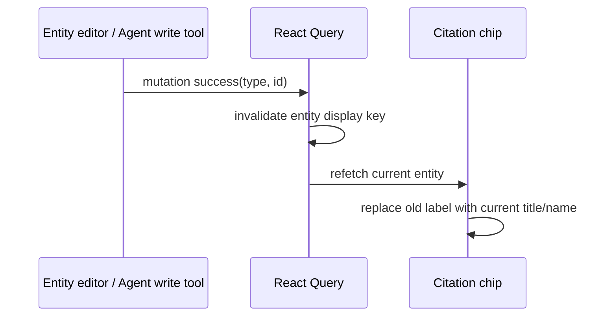

# Agent 直接实体 ID Citation 试验计划

> 版本：v1.1.22  
> 状态：DeepSeek 压测中身份可靠性通过；exact-once 尚有 1/220 轮失败  
> 分支：`codex/citation-short-id-protocol`  
> 范围：Agent prompt、正文引用协议、session persistence、chat renderer、title freshness、可靠性测试

## 1. 要验证的判断

当前 numbered citation 把一条正文引用拆成两部分：

```text
assistant text: "参考 [3]"
message citationSources: [3] -> { type, id, title }
```

这能避免模型复制长 ID，但也引入了编号生成、编号合并、答案级 source map、引用提取和 title 快照。title 更新后历史消息仍显示旧 title，就是因为 renderer 读取的是 message 上的旧快照。

v1.1.22 试验一个更直接的模型：

```text
assistant text: "参考 [[u:7N4kP2xQ9mL3cR8vT1aZb]]"
```

正文已经携带完整实体身份，renderer 直接用 `{type, id}` 读取实体当前状态，不再需要为新消息保存 citation mapping。

本轮只回答一个工程问题：

> 模型能否稳定复制短类型前缀和 21 位真实 ID，同时不把正文 marker 错传给工具？

只有可靠性测试通过，才考虑把它设为生产默认方案。

## 2. 协议决定

### 2.1 正文格式

```text
[[u:<id>]]  Understanding
[[c:<id>]]  Context
[[d:<id>]]  Domain
```

例如：

```text
这个判断可以回到 [[u:7N4kP2xQ9mL3cR8vT1aZb]] 继续查看。
```

协议只携带：

- 一个字符的实体类型；
- Reflecta 的完整 canonical entity ID。

协议不携带 title、编号、alias、source id 或 message id。

### 2.2 语法

```text
entity-ref = "[[" entity-type ":" entity-id "]]"
entity-type = "u" | "c" | "d"
entity-id = 1*(ALPHA | DIGIT | "_" | "-")
```

当前新实体 ID 是 21 位大小写字母和数字。Reflecta 已存在的 canonical ID 也可能包含 `_` 和 `-`，因此它们属于有效 ID 字符；parser 不接受空格、换行、title 或额外字段。

以下都不是有效引用：

```text
[[understanding:id]]
[[u:title#id]]
[[u: id]]
[[x:id]]
[[u:]]
[[S1]]
```

### 2.3 身份规则

- marker 里的 ID 就是真实实体 ID，不存在第二次映射。
- 不截短 ID，不生成 `S1`、`U1` 或随机 ref。
- Agent 最终正文使用完整 marker。
- 工具参数仍只接受裸 ID，例如 `7N4kP2xQ9mL3cR8vT1aZb`。
- 工具边界在试验阶段继续拒绝 `[[u:...]]`，用来真实测量模型是否混淆正文协议和工具身份。
- type 与工具参数类型不一致时直接失败，不做猜测或跨类型查询。

### 2.4 与旧 direct ID 实现的区别

这次不能只换一个更短的字符串，必须针对旧实现已经暴露的问题逐项验收：

| 历史问题                               | 本轮处理                                                     |
| -------------------------------------- | ------------------------------------------------------------ |
| `[[title#id]]` 的 title 与 ID 可能错配 | marker 不再携带 title                                        |
| renderer 曾只正确处理 Understanding    | grammar 和 resolver 对 `u/c/d` 使用同一 type table           |
| 模型把正文 marker 传给工具             | prompt 同时明确 citation 与裸 ID，并把工具污染设为 hard gate |
| session alias 形成第二套身份           | marker 内就是 canonical ID，不存在 registry                  |
| title snapshot 在历史消息里过期        | marker 不保存 title，renderer 只按 ID 读取当前实体           |
| parser 失败时 raw syntax 长期留在正文  | exact grammar、完成态 UI 检查和 malformed 降级测试           |
| 21 位 ID 是否容易被模型抄错没有数据    | 用 numbered baseline 和 direct marker 做固定矩阵 A/B         |

因此，本轮通过标准不是“代码能解析 `[[u:id]]`”，而是“旧问题在真实模型和完整用户路径上都没有重新出现”。

## 3. 保留与删除什么

### 3.1 AgentEntityCatalog 继续保留

`AgentEntityCatalog` 仍有一个明确职责：记录当前 thread 中用户显式选择或工具真实返回过的实体，让 host 知道哪些实体可以暴露给 Agent。

它不再负责生成 citation 编号，也不再是正文引用的 resolver。

```text
用户 @ / 工具结果
  -> AgentEntityCatalog：Agent 已见过哪些实体
  -> prompt：给 Agent 可复制的 marker 和工具用裸 ID
```

### 3.2 删除 citationSources contract

新协议的 `assistant.turn` 只需要保存正文：

```ts
type AssistantAnswer = {
  text: string;
};
```

runtime 删除 `AgentCitationSource` 以及 live/session/reduced message 上的 `citationSources` 字段。host 不再执行：

- `buildCitationSources`；
- `mergeCitationSources`；
- `extractCitedSources`；
- streaming delta 携带完整 source map；
- final answer 保存 sparse citation source map。

### 3.3 Runtime 只保留一条路径

Agent message runtime 和 renderer 只支持 direct ID marker：

- 不解析 `[n] + citationSources`；
- 不解析 Agent 历史消息里的 `[[title#id]]`、`[[ref:*]]` 或 `entity_ref`；
- 不保留旧协议 adapter、fallback source map 或双写；
- 旧 Agent 消息不保证 citation 可点击。

旧 Agent session 不在本轮范围内。知识编辑器等非 Agent 场景已有的 wiki link 能力不在本次删除范围内。

## 4. 引用从生成到显示的流程

这一节不是要建立一套新架构。现有的 `AgentEntityCatalog`、prompt、`assistant.turn` 和 Markdown renderer 都继续使用；真正新增的只有三处逻辑：

1. 后端把 `{type,id}` 格式化成 `[[u:id]]`；
2. 前端从 `[[u:id]]` 解析出 `{type,id}`；
3. 前端按 `{type,id}` 查询当前实体并显示 title。

完整流程是：

```text
AgentEntityCatalog 中已有实体
  -> Prompt 告诉 Agent citation marker 和工具用裸 ID
  -> Agent 在 Markdown 正文输出 [[u:id]]
  -> assistant.turn 原样保存 Markdown text
  -> 现有 Markdown 引用转换逻辑识别 [[u:id]]
  -> 前端按 type + id 查询当前实体
  -> 显示当前 title/name 的 citation chip
```

`AgentEntityCatalog` 只服务 prompt，不参与前端渲染；前端也不需要通过 catalog 或其他 source map 把 marker 映射回实体。

### 4.1 Prompt entity contract

每个可用实体都显式传递完整 `type`、裸 `id`、可复制的 `citation` 和辅助识别的 `title`：

```text
<reflecta_entities>
{"type":"understanding","id":"abc","citation":"[[u:abc]]","title":"反馈循环"}
</reflecta_entities>
```

host 负责固定映射，Agent 不自己转换：

```text
understanding -> u
context       -> c
domain        -> d
```

System prompt 只需明确：

- 最终正文原样复制 `citation`；
- 工具参数只传 `id`；
- `type` 以 record 为准，不从 title 或 tool name 推断；
- 只能使用 `<reflecta_entities>` 中的实体。

selected context 和工具新返回的实体使用同一 record 格式，host 按 `{type,id}` 去重。

### 4.2 后端原样保存正文

direct marker 原样保存在 Markdown text 中。它在 streaming、最终事件和历史恢复之间不做结构转换：

```text
assistant.text.delta -> accumulated text -> assistant.turn.text -> session replay
```

可以在试验日志里解析 final text 统计 marker，但统计结果不进入 session contract。

### 4.3 前端解析 ID 并读取当前实体

前端直接扩展现有 Markdown 引用转换逻辑：

```text
[[u:abc]]
  -> { type: "understanding", id: "abc" }
  -> understanding.getUnderstandingById("abc")
  -> 当前 title
  -> citation chip
```

不新建通用 token module 或 callback interface。格式化、解析和 title 查询分别留在已经承担这些职责的现有代码位置。

## 5. 前端 render 设计

### 5.1 两阶段渲染

第一阶段只做语法转换：

```text
[[u:id]] -> Reflecta internal entity href(type=u, id=id)
```

第二阶段由 internal href renderer：

1. 解析 `{type, id}`；
2. 读取实体当前数据；
3. 选择当前显示名；
4. 渲染现有 Reflecta entity chip；
5. 只有实体存在且当前类型支持详情时才允许点击。

renderer 不从正文邻近文本猜 title，也不从历史消息搜索同名实体。

### 5.2 title 从哪里取

显示名只取当前实体数据：

| 类型          | 当前显示名字段           | 读取接口                                 |
| ------------- | ------------------------ | ---------------------------------------- |
| Understanding | `UnderstandingDTO.title` | `understanding.getUnderstandingById(id)` |
| Context       | `ContextDTO.title`       | `context.getContextById(id)`             |
| Domain        | `Domain.name`            | `domain.getDomainById(id)`               |

试验版不新增 batch resolver。前端增加一个 `useEntityDisplay({type,id})`，内部复用现有三个 IPC 接口和 React Query：

- query key 以 `{type,id}` 为身份；
- 相同实体出现多次时由 React Query 合并并复用结果；
- history message mount 时读取当前数据；
- 窗口重新聚焦时允许 stale query refetch；
- Capture mutation 成功后 invalidate 对应实体 key；
- Agent 写工具确认完成后根据 `resultRefType/resultRefId` invalidate 对应实体 key。

只有实测发现一条 thread 中 unique entity query 数量或延迟不可接受，才增加：

```ts
resolveEntityDisplays(refs: EntityRef[]): Promise<EntityDisplay[]>;
```

本轮不为假设中的性能问题提前建立全局 entity map 或新 IPC BFF。

### 5.3 title 状态规则

| 状态                  | 显示                                      | 交互                                                         |
| --------------------- | ----------------------------------------- | ------------------------------------------------------------ |
| 已解析且有 title/name | 当前 title/name                           | Understanding、Context 保持现有详情入口；Domain 保持现有行为 |
| 已解析但 title 为空   | `未命名 Understanding` / `未命名 Context` | 保持可查看                                                   |
| 首次加载              | 类型名占位                                | 暂不点击                                                     |
| 实体不存在或已删除    | “引用不可用”                              | disabled                                                     |
| 读取失败              | “引用加载失败”                            | disabled，query 可重试                                       |

renderer 没有 message title fallback；查询到的当前实体是唯一显示来源。

### 5.4 标题更新路径



因此同一条历史消息不需要被修改。title 更新影响的是实体读取结果，不是 citation text。

### 5.5 Markdown 和 streaming

- complete valid marker 才升级为 internal link。
- inline code、fenced code、existing link、image 和 malformed marker 保持普通 Markdown。
- streaming 中尚未闭合的 `[[u:...` 暂时按普通文本显示；闭合后升级为 chip。
- 试验版不为这个短暂过程增加 stream buffer。如果测试确认 raw marker 闪烁明显，再只对未闭合尾部增加 display buffer，不改变持久化协议。

## 6. 测试方案

测试先从用户场景出发，再把稳定规则分配给 unit、host integration 和 E2E。不要把同一条点击流重复铺满所有层级。

### 6.1 Feature test cases

更新现有 Agent feature 文件，不新建平行 test-case 文档。至少覆盖这些用户场景：

1. 用户打开包含知识库引用的回复，看到实体当前标题并可查看详情。
2. 用户修改已经被历史回复引用的实体标题，回到原对话后看到新标题。
3. 用户重启应用后，历史回复仍显示当前标题并可以打开引用。
4. 被引用实体删除后，历史回复保持可读且引用显示为不可用，不打开错误详情。
5. 同一回复引用 Understanding、Context 和 Domain 时，各自显示正确类型和标题。

Feature 只描述用户可见行为，不写 `[[u:id]]`、React Query 或 session event。

### 6.2 协议 unit tests

后端 formatter 和前端 parser 的相邻 unit tests 使用同一组协议 case，覆盖：

- format/parse `u`、`c`、`d`；
- 完整保留大小写敏感 ID；
- 接受历史 `_`、`-` ID；
- 同一实体重复出现；
- 一段文本中混合三种类型；
- marker 位于句首、句中、标题、列表、强调附近；
- inline code 和 fenced code 不解析；
- existing Markdown link、image、escaped marker 不产生嵌套 link；
- 未闭合、空 ID、未知类型、空格、换行、带 title 的旧格式保持普通文本；
- 大量普通 `[`、`]` 文本不会被误判；
- 输入输出不改写 marker 之外的 Markdown。

这些测试验证“协议到产品模型的翻译”，不测试 regex 或 helper 调用次数。

### 6.3 Agent host tests

在 `agent-citations`、`pi-prompt` 和 `pi-agent-host` 相邻测试中验证：

- selected context 和 tool result 都生成 `{type,id,citation,title}` record，且 `understanding/context/domain` 正确对应 `u/c/d`；
- title 为 `null` 或包含特殊字符时，JSON block 仍保持有效结构；
- system prompt 明确区分最终正文复制 `citation` 与工具参数复制 `id`；
- 同一 `{type,id}` 多次出现只暴露一个引用身份；
- 新实体不影响旧实体 marker，因为 marker 本身不含顺序；
- streaming delta 不包含 citation source map；
- final `assistant.turn` 原样保存 marker text，event contract 中不存在 `citationSources`；
- Agent 输出 malformed/unknown marker 不导致 run 失败；
- write tool 的 ID schema 继续拒绝 `[1]`、`S1`、`ref:*`、`[[u:id]]`；
- 工具使用 marker、错误类型 ID 或不存在 ID 时失败可见，不写入错误实体。

### 6.4 Reducer 与 history tests

稳定事件转换覆盖：

- direct marker 能跨多段 text delta 拼接；
- final turn 覆盖 streaming draft 后 marker 保持不变；
- session replay 后 text 与 live state 一致；
- direct message 不依赖 message-level mapping 即可恢复；
- `[n]`、`[[title#id]]`、`[[ref:*]]` 和 `entity_ref` 不进入 direct citation resolver；
- 不再存在 `citationSources` 的 reducer 分支。

### 6.5 Renderer unit tests

通过用户可观察输出验证：

- direct marker 显示为当前实体 title，而不是 ID 或 raw marker；
- Understanding、Context、Domain 分别读取 `title/title/name`；
- title 为空时显示确定 fallback；
- query loading、missing、deleted、error 状态不会打开错误详情；
- title query 数据更新后 chip 显示新 title；
- `[n]` 等非 direct token 不生成 citation chip；
- inline/fenced code 中的 token 原样显示；
- malformed token 不生成 chip；
- Markdown 标题、列表、强调和普通链接在引用前后仍保持可读；
- Understanding 和 Context 点击后打开正确详情；Domain 保持现有交互。

不测试 DOM 层级、className、hook 调用次数或 React Query 内部实现。

### 6.6 Electron E2E

使用固定 seed 和 session fixture，覆盖四条主路径：

#### E2E A：当前标题与详情

1. seed 一个 Understanding 和包含其 direct citation 的历史回复；
2. 打开 thread；
3. 看到 seed title，不看到裸 ID；
4. 点击引用；
5. 详情面板打开同一个 Understanding。

#### E2E B：改名后刷新历史引用

1. 打开包含引用的历史回复并确认旧 title；
2. 通过真实 UI 修改实体 title；
3. 回到同一 thread；
4. 引用显示新 title，旧 title 不再作为当前 label；
5. 重启应用并再次打开 thread；
6. 仍显示新 title。

这条是本轮必须通过的核心回归。

#### E2E C：三类型与失效实体

1. 同一回复引用 seed Understanding、Context 和 Domain；
2. 三个 chip 显示对应当前名称和类型样式；
3. 删除其中一个实体；
4. 回到 thread 后该引用显示不可用，其余两个不受影响。

#### E2E D：流式与历史一致

1. fixture 按多个 delta 输出一个被拆开的 marker；
2. 完成后页面只显示实体 chip；
3. 切换 thread 再返回；
4. 重启后再返回；
5. 三个时点最终可见文本一致。

### 6.7 真实模型可靠性 A/B

确定性测试只能证明 parser 和系统行为正确，不能证明模型愿意稳定复制真实 ID。因此必须用同一组固定 seed、prompt 和模型，对 current numbered citation 与 direct ID marker 做 A/B。

场景矩阵：

| 场景族                       | 压力规模            | 要观察的风险                      |
| ---------------------------- | ------------------- | --------------------------------- |
| 大目录中的延迟引用           | 64 个实体、8 轮     | 长历史后漏引或选错远距离目标      |
| 近似 ID 与 citation 密集历史 | 36 个近似 ID、14 轮 | ID 串线、拼接或重复               |
| 同名跨类型实体               | 48 个实体、10 轮    | 相同 title 下 type 与 ID 错配     |
| 工具新增实体与 Markdown 噪声 | 48 个实体、12 轮    | 工具参数污染、伪 marker、后期召回 |

每个场景族重复 5 次，每种协议 20 个会话。一次完整 DeepSeek 压测共 40 个会话、440 轮模型交互；每种协议要求生成 1000 个目标 citation。

执行约束：

- 每次 run 使用新的 thread，避免上一轮协议和答案污染下一轮；
- 两种协议使用相同 seed、用户 prompt、model、reasoning level 和工具数据；
- baseline/direct 的执行顺序交错，避免某一组总在不同机器状态或 provider 时段运行；
- evaluator 只做 exact token parse、ID/type equality、tool argument 检查和 UI 状态检查，不使用另一个 LLM 判断；
- 原始 run 结果保存为结构化 JSON，汇总生成 Markdown 表，失败样本可以回到原始 prompt、tool call 和 final text；
- A/B 使用独立 test profile，不读取或改写用户生产 session。

每次 run 记录：

- prompt 中允许的 `{type,id}`；
- 每轮 final text 中 complete、malformed、unknown marker；
- marker 对应的预期实体；
- 每次 tool call 的真实 ID 参数；
- UI 完成态是否出现 raw protocol；
- 首 token、回答完成和 title resolve 时间。

通过门槛：

| 指标                                                 | Gate              |
| ---------------------------------------------------- | ----------------- |
| 已生成 marker 的 type + ID 绑定正确率                | 100%              |
| 工具参数中出现 `[[...]]`、`[n]` 或其他 display token | 0 次              |
| 已输出的 citation-like token 为合法 direct marker    | 100%              |
| 每轮要求引用的目标 coverage                          | 100%              |
| 只引用指定实体且各出现一次                           | 100%              |
| 长对话末轮重新引用                                   | 100%              |
| 最终 UI raw protocol 泄漏                            | 0 次              |
| 改名、重启后的 title freshness                       | 100%              |
| parser + render 额外本地耗时                         | p95 不高于 100 ms |

绑定错误或工具 ID 污染属于 hard failure；不能用提高语法有效率的平均值抵消。

ID/type 错配或工具参数污染属于架构 hard failure；单纯重复一个正确 citation 属于输出 multiplicity 问题，单独决定是否收紧 prompt，不据此增加 mapping、registry、修复器或二次 LLM。

## 7. 实施顺序

### Task 1：先记录 Feature 场景

按 test-case 规范更新现有 citation、history feature，先固定用户可见结果。

### Task 2：实现最小格式化与解析

先写失败的协议 unit tests，再在现有 prompt formatter 中生成 direct marker，并扩展现有 Markdown 引用转换逻辑解析 direct marker。旧格式不进入新 grammar，也不保留 adapter；不为这两个调用方建立通用 token module。

### Task 3：切换 Agent 生成路径

1. selected context 和 tool result 都序列化为 `{type,id,citation,title}` record；
2. host 统一生成 `u/c/d` citation，system prompt 说明各字段用途；
3. 删除 citation source 的生成、event 字段和 reducer 状态；
4. Agent runtime 不保留旧 citation 协议的读取分支。

### Task 4：接入 live entity display

1. direct marker 转 internal entity href；
2. `useEntityDisplay` 读取当前实体；
3. 收敛 loading、untitled、missing、error 状态；
4. 删除 Agent message renderer 的 numbered citation/source map 入口；
5. 在 Capture mutation 和 Agent write completion 后 invalidate 对应 query。

### Task 5：补 reducer、renderer 和 E2E

按第 6 节逐层验证，优先完成改名后的历史 citation E2E。

### Task 6：运行真实模型 A/B

使用独立 test profile 和固定 seed 跑 40 + 40 次最低矩阵，输出机器可检查的结果表，不凭几次手测作结论。

### Task 7：决定是否替换生产路径

- 全部 gate 通过：direct ID 成为唯一 Agent citation 路径。
- hard failure：恢复 numbered citation 生成路径，保留本分支报告，不合入 direct protocol。
- 只有 title freshness 或 renderer 问题：修复 deterministic implementation 后重跑相关测试，不需要重跑模型行为矩阵。

## 8. 预计代码落点

主要会涉及：

- `apps/electron/src/preload/typings/agent*.ts`：删除 citation source event/message 字段；
- `apps/electron/src/main/services/agent/agent-citations.ts`：把 catalog entries 格式化为显式的 `{type,id,citation,title}` records；
- `apps/electron/src/main/services/agent/pi-prompt.ts`：把 records 作为 JSON block 注入 prompt；
- `apps/electron/src/main/services/agent/pi-agent-host.ts`：移除 source numbering/merge/extract；
- `apps/electron/src/main/services/agent/agent-system-prompt.md`：最终正文与工具 ID 规则；
- `apps/electron/src/renderer/src/modules/chat/context/context-reference.ts`：direct token 到 internal href；
- `apps/electron/src/renderer/src/modules/chat/context/wiki-link.tsx`：live entity display；
- `apps/electron/src/renderer/src/modules/capture/queries.ts`：entity display query key 与 invalidation；
- `apps/electron/src/renderer/src/modules/chat/session/pi-thread-view.ts`：Agent write completion 后 invalidation；
- 相邻 unit tests、Agent feature 与 Electron E2E fixtures/specs。

文件位置是当前代码调查后的预期，不要求为了符合列表而制造新 module；实现时能在现有深 module 内完成的优先复用。

## 9. 明确不做

- 不缩短或迁移 canonical entity ID。
- 不创建全局 citation mapping、session alias registry 或 message source map。
- 不让 title 进入 direct marker。
- 不扫描普通正文 title 自动绑定实体。
- 不引入二次 LLM finalizer。
- 不在试验开始前新增 batch title resolver。
- 不趁本次改造 Domain 的导航或详情产品行为。
- 不设计或实现历史 session 迁移脚本；它是后续独立的一次性任务。

## 10. 验证命令

实现阶段至少运行：

```bash
rtk bun --cwd apps/electron vitest run src/main/services/agent
rtk bun --cwd apps/electron vitest run src/renderer/src/modules/chat
rtk bun run typecheck
rtk bun run fmt:check
rtk bun run test:e2e
```

真实模型 A/B 是独立 release gate，不能由 fixture E2E 代替。

## 11. 回滚

试验只在独立分支和 test profile 中进行，不写入生产 session。失败时：

1. 恢复 numbered citation prompt 和 host 生成路径；
2. 一并撤回 direct marker renderer；
3. 丢弃试验 profile 中产生的 session；
4. 不修改实体数据。

历史 session 处理不进入本计划。

## 12. 试验结果

- deterministic unit、typecheck、lint、format 全部通过；
- citation E2E 已覆盖当前标题、改名、删除、三类型、流式和重启恢复，全部通过；
- `deepseek/deepseek-v4-flash` 真实 A/B 共 40 个会话、440 轮；每种协议要求 1000 个目标 citation；
- direct 的目标 coverage、type + ID、长对话末轮引用和工具参数均为 100%；exact-once 为 99.5%，唯一失败是重复了一个正确 citation；
- numbered 的目标 coverage 为 96.4%，exact-once 为 94.5%，压力场景中出现编号串线；
- 完整 E2E 已执行；其中独立的后台对话恢复用例仍有超时，和 citation 数据流无关，不影响本试验判定。

详细数据见 [Citation 真实模型 A/B 报告](./evals/citation-reliability-report.md)。
