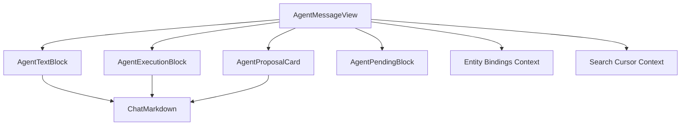

# v1.2.5 Agent Message Module Design

> 状态：Planned
>
> 对应主计划：[Module 5：Agent Message 组合与最终替换](./ui-package-storybook-migration-plan.md#10-module-5agent-message-组合与最终替换)
>
> 组织逻辑：本文采用**递进型主线**，按“当前 Message composition → 最小消息 View Model → component interface → Renderer Adapter → 最终替换与验收”展开。原因是该 Module 是前四个 Module 的组合 seam，必须在下游 interface 稳定后才能删除 `AgentMessageContent`；横向 block union 按 Text、Execution、Proposal 三类做 MECE 分类。

## 1. 结论

Agent Message Module 提供 Electron Renderer 和 Storybook 共用的 assistant message rendering seam：

```text
@reflecta/ui/chat
  AgentMessageView
  AgentMessageViewModel
  AgentMessageBlockView
  findChatTextRanges
```

它负责：

- 按原顺序组合 text、reasoning、tool activity、compaction 和 proposal；
- final answer Markdown/error；
- empty/running/stopped visual；
- message 内 entity bindings；
- assistant Markdown 搜索标记；
- proposal decision event 上抛。

它不负责：

- MessageList；
- user message、composer JSON、attachments；
- timestamp；
- copy/edit/regenerate/fork；
- Thread Find Box 和 DOM scroll；
- Agent reducer；
- React Query/IPC；
- approval mutation。

## 2. 当前组件处理清单

### 2.1 迁移到 `packages/ui`

| 当前实现或分支                       | 目标                                   |
| ------------------------------------ | -------------------------------------- |
| `AgentMessageContent`                | `AgentMessageView`                     |
| text block JSX                       | `AgentTextBlock` internal component    |
| final answer error JSX               | text block failed visual               |
| block dispatcher                     | `AgentMessageView` internal switch     |
| stopped visual                       | message status visual                  |
| empty `...` visual                   | message empty visual                   |
| no-block running placeholder         | 复用 Module 3 `AgentPendingBlock`      |
| assistant Markdown search attributes | package-internal search render context |

### 2.2 留在 Electron

| 当前实现或职责                          | 原因                                      |
| --------------------------------------- | ----------------------------------------- |
| `MessageList`                           | Thread orchestration                      |
| `MessageRow`                            | role、timestamp、actions、highlighted row |
| `UserMessageContent`                    | Composer/App contract                     |
| `MessageAttachment`                     | v1.2.5 不迁移 user message                |
| `MentionChip` for user message          | Composer/App entity                       |
| clipboard + toast                       | App/browser side effect                   |
| edit/regenerate/fork callbacks          | Thread workflow                           |
| `buildAgentTurnView` raw parsing        | Electron Adapter                          |
| `shouldShowPendingAssistantPlaceholder` | Thread state                              |
| `activateChatFindMarker`/DOM navigation | Thread Find workflow                      |

### 2.3 删除或收缩

| 当前 interface                             | 目标                                        |
| ------------------------------------------ | ------------------------------------------- |
| `message: AgentReducedMessage`             | `message: AgentMessageViewModel`            |
| `entityCatalog: AgentEntityCatalogEntry[]` | `entityBindings?: ChatEntityBindings`       |
| `turn: AgentTurnView`                      | blocks 直接属于 message View Model          |
| `isBusy + isLastAssistant`                 | 单一 message `status`                       |
| `stopped?: boolean`                        | message `status: "stopped"`                 |
| `findState.nextMatchIndex`                 | `search?: { query }`，cursor 内部维护       |
| `onApproveTool(ApproveToolInput)`          | `onProposalDecision(AgentProposalDecision)` |
| block key `${message.id}-${kind}-${index}` | Adapter 提供稳定 block id                   |

## 3. Public View Model

### 3.1 Text block

```ts
export type AgentTextBlockView = {
  kind: "text";
  id: string;
  markdown: string;
  status: "streaming" | "done" | "failed";
  error?: string;
};
```

规则：

- `failed` 显示“最终答案生成失败：{error}”，不同时渲染 Markdown；
- `error` 缺失时显示“未知错误”；
- streaming/done 使用相同 Markdown visual，流式差异由内容本身体现；
- 空且非 failed 的 text block 应在 Adapter 中移除；
- 相邻 text block 的合并继续由 Electron Adapter 完成。

### 3.2 Message block

```ts
export type AgentMessageBlockView =
  | AgentTextBlockView
  | AgentExecutionBlockView
  | {
      kind: "proposal";
      proposal: AgentProposalView;
    };
```

Execution union 来自 Module 3：

- reasoning；
- tool-activity；
- context-compaction；
- pending 只用于独立/外部 composition，正常 message pending 由 message status 生成。

Proposal union 来自 Module 4。

### 3.3 Message

```ts
export type AgentMessageViewModel = {
  id: string;
  status: "idle" | "running" | "stopped";
  blocks: readonly AgentMessageBlockView[];
};
```

状态行为：

| 状态/Blocks         | UI                                      |
| ------------------- | --------------------------------------- |
| running + empty     | `AgentPendingBlock`                     |
| running + non-empty | 只渲染已有 blocks，不额外追加“正在思考” |
| idle + empty        | `...`                                   |
| idle + non-empty    | 正常 blocks                             |
| stopped + empty     | `...` + “已停止”                        |
| stopped + non-empty | blocks + “已停止”                       |

`status` 不表达 session 全局状态，只表达这一条 assistant message 的当前 visual。

## 4. Component Interface

### 4.1 Props

```ts
export type AgentMessageSearch = {
  query: string;
};

export type AgentMessageViewProps = {
  message: AgentMessageViewModel;
  entityBindings?: ChatEntityBindings;
  search?: AgentMessageSearch;
  onProposalDecision?: (decision: AgentProposalDecision) => void;
  expandToolDetails?: boolean;
};

export function AgentMessageView(props: AgentMessageViewProps): React.ReactNode;
```

规则：

- `message.id` 同时作为 search scope id；
- 空白 query 等同没有 search；
- `expandToolDetails` 只影响 Tool Activity 初始状态，不强制控制用户后续开关；
- `entityBindings` 通过 package-internal context 供所有 Markdown 使用；
- proposal callback 原样转发 Module 4 decision；
- component 不接受 `className`，外部布局属于 MessageRow；
- component 不接受 children 或 custom block renderer，防止生产/Storybook出现不同渲染路径。

### 4.2 Search range helper

```ts
export type ChatTextRange = {
  start: number;
  end: number;
};

export function findChatTextRanges(text: string, query: string): ChatTextRange[];
```

这个纯 helper 从 Electron `session/chat-find.ts` 移入 `@reflecta/ui/chat`，原因：

- Markdown renderer 和 user-message Renderer 都需要相同匹配语义；
- Thread view 也用它预估 message match；
- 它没有 App 或平台依赖。

稳定行为：

- trim query；
- locale lowercase case-insensitive；
- non-overlapping；
- 返回原字符串 offset；
- 空 query 返回空数组。

DOM marker enumeration、active marker 设置和 scroll 仍留在 Electron Thread Find workflow。

## 5. 内部 Composition



内部 context 只解决同一个深 Module implementation 的依赖传递，不通过 public Provider export。

### 5.1 Block identity

Adapter 必须生成稳定 id：

```text
text              -> source block identity 或稳定 sequence key
reasoning         -> source reasoning group identity
tool activity     -> toolCallId/group identity
compaction        -> compaction id
proposal          -> proposal id
```

禁止使用 array index 作为唯一 key。流式追加 text 时 block id 不变，避免折叠和 highlight DOM 被重建。

### 5.2 Search cursor

每次 render 一个 message：

```ts
const cursor = {
  scopeId: message.id,
  query: search?.query.trim() ?? "",
  nextMatchIndex: 0,
};
```

只有 package internal Markdown/text renderer 能修改 `nextMatchIndex`。它按实际 DOM 顺序编号，并输出当前约定的数据属性：

```text
data-chat-find-match="true"
data-chat-find-message-id="{message.id}"
data-chat-find-match-index="{index}"
```

Electron Thread Find 继续通过这些稳定属性定位、激活和滚动。

## 6. Electron Adapter

### 6.1 Pure Adapter

```ts
export function buildAgentMessageView(
  message: AgentReducedMessage,
  options: {
    running: boolean;
    stopped: boolean;
  },
): AgentMessageViewModel;
```

该函数留在 Electron，并完成：

- raw blocks 保序；
- adjacent text/reasoning 归并；
- tool payload -> execution view；
- approval payload -> proposal draft/view 的纯部分；
- UI block id；
- message status。

它不能发起 query。

### 6.2 Connected Adapter

```ts
function useAgentMessagePresentation(
  message: AgentReducedMessage,
  options: {
    running: boolean;
    stopped: boolean;
    entityCatalog: readonly AgentEntityCatalogEntry[];
    onInspectContextRef?: (reference: AppContextRef) => void;
    onApproveTool(input: ApproveToolInput): void;
  },
): {
  view: AgentMessageViewModel;
  entityBindings: ChatEntityBindings;
  onProposalDecision(decision: AgentProposalDecision): void;
};
```

该 hook 留在 Electron，并完成：

- 收集 message Markdown entity refs；
- 批量 query display data；
- Proposal entity/Domain label；
- UI entity ref -> App inspect ref；
- Proposal id -> raw approval identity；
- `AgentProposalDecision` -> `ApproveToolInput`。

建议文件：

```text
apps/electron/src/renderer/src/modules/chat/adapters/
├── agent-message-view.ts
├── use-agent-message-presentation.ts
└── proposal-view.ts
```

纯映射与 connected hook 分开，避免单元测试为了验证 block mapping 启动 React Query。

## 7. Renderer 调用形态

目标 `MessageRow` assistant 分支：

```tsx
const presentation = useAgentMessagePresentation(message, {
  running: isBusy && isLastAssistant,
  stopped,
  entityCatalog,
  onInspectContextRef,
  onApproveTool,
});

<AgentMessageView
  message={presentation.view}
  entityBindings={presentation.entityBindings}
  search={findQuery ? { query: findQuery } : undefined}
  onProposalDecision={presentation.onProposalDecision}
/>;
```

实际 hook 不能只在 assistant role 条件分支调用；可以在独立 `AssistantMessageContainer` 中使用，保持 hooks 规则。

目标结构：

```text
MessageRow
  user      -> 现有 UserMessageContent
  assistant -> AssistantMessageContainer
                 -> useAgentMessagePresentation
                 -> AgentMessageView
```

`AssistantMessageContainer` 是有真实 I/O/Adapter 职责的 Module，不是无意义 pass-through。

## 8. Storybook 状态矩阵

### 8.1 单一 block

- text done；
- text streaming；
- text failed；
- reasoning；
- tool activity；
- compaction；
- proposal。

### 8.2 典型序列

- reasoning → text；
- reasoning → read tool → text；
- multi tool → text；
- text → proposal pending；
- proposal completed → result → text；
- tool failed → recovery text；
- compaction → reasoning → text；
- interleaved text/tool/text。

### 8.3 Message state

- running empty；
- running with partial text；
- idle empty；
- stopped empty；
- stopped with partial content；
- final answer failed。

### 8.4 Context

- entity ready/loading/unavailable/error；
- search query with multiple Markdown nodes；
- narrow/normal/wide；
- light/dark；
- all tool details expanded；
- long conversation content。

## 9. 测试重新归属

### 9.1 `packages/ui`

- block order rendering；
- text failed visual；
- empty/running/stopped matrix；
- proposal decision forwarding；
- entity bindings context；
- search marker DOM order；
- `findChatTextRanges`；
- stable component behavior across rerender。

### 9.2 Electron

- raw block -> View Model；
- busy/last/stopped -> message status；
- proposal id -> approval input；
- entity catalog/query -> presentation；
- MessageRow actions；
- Thread Find navigation；
- MessageList compaction placement；
- pending assistant placement。

原 `message-list.test.tsx` 按上述职责拆开。UI tests 不再构造完整 Agent session，也不 mock `ipcClient`。

## 10. Renderer 替换与删除

替换：

- `MessageRow` assistant branch 使用 `AssistantMessageContainer`；
- `AgentMessageContent` 使用 `AgentMessageView`；
- `findChatTextRanges` import 改到 `@reflecta/ui/chat`；
- 外部 compaction receipt 通过 Module 3 View Model 渲染。

删除：

- `agent-message-content.tsx` 中已迁移的全部 UI implementation；
- `ApproveToolInput` 的 UI package依赖；
- `ChatFindRenderState` public/mutable interface；
- assistant branch 的 raw `AgentReducedMessage` 传递；
- 旧 UI tests 与 IPC mocks。

可以保留：

- 一个有实际查询与 action mapping 的 `AssistantMessageContainer`；
- App-side `agent-turn-view.ts`，在完成重命名后作为纯 Adapter；
- `message-list.tsx` 和 user message UI。

## 11. Module 出口

- Storybook 直接以 `AgentMessageViewModel` 展示完整 Agent Tool/Markdown 状态；
- `AgentMessageView` 不依赖 App type、Query Client 或 IPC；
- Renderer 不再把 `AgentReducedMessage` 传进 UI package；
- assistant block identity 在流式更新中稳定；
- search query 是唯一 public search input，mutable cursor 被隐藏；
- Proposal decision callback 不泄漏 approval action contract；
- `AgentMessageContent` 原 1000+ 行混合实现被删除或收缩为真正的 Adapter；
- MessageList、user message 与 Thread workflow 仍清晰归 Electron 所有。
