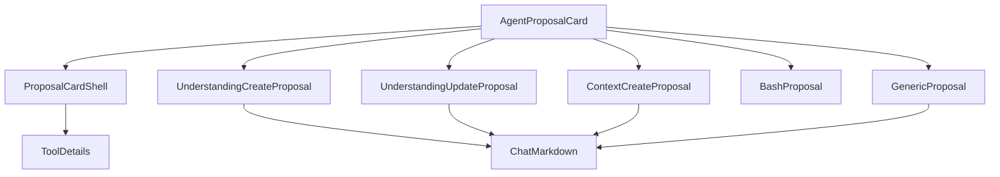

# v1.2.5 Agent Proposal Module Design

> 状态：Planned
>
> 对应主计划：[Module 4：Agent 写操作 Proposal](./ui-package-storybook-migration-plan.md#9-module-4agent-写操作-proposal)
>
> 组织逻辑：本文采用**递进型主线**，按“现有 Proposal 分支 → I/O 与展示拆分 → Proposal View Model → decision interface → Renderer Adapter 与验收”展开。原因是当前 Proposal component 依据字段 key 发起查询，interface 设计必须先消除隐藏 I/O；横向按 Understanding Create、Understanding Update、Context Create、Bash、Generic 五类互斥展示做 MECE 分类。

## 1. 结论

Agent Proposal Module 负责所有需要用户确认、展示执行状态或展示写入结果的 Agent 操作卡片。

公开 interface：

```text
@reflecta/ui/chat
  AgentProposalCard
  AgentProposalView
  AgentProposalDecision
```

UI component 只接收 display-ready Proposal View Model。Understanding title、Context title、Domain path、field label 和 status note 全部由 Electron Adapter 在进入 UI 前准备完成。

UI 不接收：

- `AgentReducedMessage`；
- React Query 或 query key；
- raw tool payload/output；
- `messageId`、`toolCallId`、`approvalId` 的业务语义；
- model selection、reasoning level；
- Domain tree；
- IPC client。

## 2. 当前组件清单

### 2.1 迁移组件

| 当前实现                          | 新实现                         | 可见性           |
| --------------------------------- | ------------------------------ | ---------------- |
| `CandidateShell`                  | `ProposalCardShell`            | package internal |
| `CandidateUnderstandingCard`      | `UnderstandingCreateProposal`  | package internal |
| `UpdateUnderstandingDiffCard`     | `UnderstandingUpdateProposal`  | package internal |
| `CandidateContextCard`            | `ContextCreateProposal`        | package internal |
| `BashProposalCard`                | `BashProposal`                 | package internal |
| `GenericProposalCard`             | `GenericProposal`              | package internal |
| `GenericProposalValue`            | `ProposalFieldValue`           | package internal |
| `ToolCard`                        | `AgentProposalCard` dispatcher | public           |
| `statusLabel`                     | lifecycle-to-label mapping     | package internal |
| `shouldCollapseProposalByDefault` | default open policy            | package internal |
| `formatDurationMs`                | Bash duration formatter        | package internal |
| result detail visual              | 复用 Module 3 `ToolDetails`    | package internal |

### 2.2 留在 Electron

| 当前实现或职责                               | 原因                         |
| -------------------------------------------- | ---------------------------- |
| `useUnderstandingDisplay`                    | React Query + IPC            |
| `useContextDisplay`                          | React Query + IPC            |
| `useCaptureDomains`、`getDomainPath`         | App domain tree              |
| `UnderstandingReference`、`ContextReference` | 改为 Adapter 中的 label 投影 |
| `DomainPathText`、`DomainIdsText`            | 改为 Adapter 中的 path 投影  |
| approval mutation                            | App workflow                 |
| query invalidation                           | App state                    |
| toast                                        | App feedback                 |
| `proposalViewFor` 的 raw payload parsing     | App/Agent tool contract      |
| `proposalTypeFor`、proposal data parser      | App/Agent tool contract      |

### 2.3 删除的展示模式

| 当前模式                                           | 替代方案                                     |
| -------------------------------------------------- | -------------------------------------------- |
| `GenericProposalValue` 根据 `fieldKey` 判断 entity | Adapter 直接生成 field label + display value |
| UI 收到 `domainIds` 后查询 Domain tree             | Adapter 提供 `domainPaths: string[]`         |
| UI 收到 `understandingId/contextId` 后查询 title   | Adapter 提供 `targetLabel`                   |
| `status + state + preview` 三组重叠字段            | 单一 `lifecycle`                             |
| UI 根据 resultRef 拼接 note                        | Adapter 提供最终 `note`                      |
| `ApproveToolInput` 穿过 UI package                 | UI 只发出 `AgentProposalDecision`            |

## 3. Proposal Lifecycle

```ts
export type AgentProposalLifecycle =
  | "preview"
  | "pending"
  | "running"
  | "completed"
  | "rejected"
  | "failed";
```

映射：

| App display state / preview | UI lifecycle |
| --------------------------- | ------------ |
| `preview=true`              | `preview`    |
| `pending_approval`          | `pending`    |
| `running`                   | `running`    |
| `completed`                 | `completed`  |
| `rejected`                  | `rejected`   |
| `failed`                    | `failed`     |

UI 统一 badge：

| Lifecycle | Badge    |
| --------- | -------- |
| preview   | 运行中   |
| pending   | 待确认   |
| running   | 已响应   |
| completed | 完成     |
| rejected  | 已拒绝   |
| failed    | 执行失败 |

`failed` 优先于 approval 已确认状态，不能显示“已确认”作为终态。

## 4. Public View Model

### 4.1 Base

```ts
export type AgentProposalBaseView = {
  id: string;
  title: string;
  lifecycle: AgentProposalLifecycle;
  note?: string;
  error?: string;
  result?: AgentToolDetailsView;
  decisionEnabled?: boolean;
};
```

字段规则：

- `id` 是 UI opaque identity；推荐 Adapter 使用 approvalId，不要求 UI 理解；
- `note` 是 display-ready 文本，例如“已写入 Understanding · xxx”；
- `error` 只在 `failed` 时展示；
- `result` 复用 Module 3 的 detail View Model；
- `decisionEnabled` 只有 `pending` 时有意义；
- completed/rejected 默认折叠，其他状态默认展开。

### 4.2 Understanding Create

```ts
export type UnderstandingCreateProposalView = AgentProposalBaseView & {
  kind: "understanding-create";
  content: {
    heading?: string;
    body: string;
    domainPaths?: readonly string[];
  };
};
```

映射：

```text
payload.title     -> heading
payload.body      -> body
payload.domainIds -> Electron resolve -> domainPaths
```

`domainPaths` 为空时不显示 Domain row；不把“未归入 Domain”当成虚假路径。

### 4.3 Understanding Update

```ts
export type UnderstandingUpdateProposalView = AgentProposalBaseView & {
  kind: "understanding-update";
  content: {
    targetLabel: string;
    beforeBody: string;
    afterBody: string;
    domainPaths?: readonly string[];
    reason?: string;
  };
};
```

`targetLabel` 必须由 Electron query/catalog 解析；查不到时使用稳定 fallback，例如原 id，不在 UI 发请求。

`domainPaths`：

- `undefined`：Proposal 没有修改 Domain；
- `[]`：明确改为不属于任何 Domain；
- 非空：展示完整 path。

这三个状态不能合并。

### 4.4 Context Create

```ts
export type ContextCreateProposalView = AgentProposalBaseView & {
  kind: "context-create";
  content: {
    understandingLabel: string;
    contextLabel: string;
    body: string;
  };
};
```

`contextLabel` 是 title 或 medium 的 display text；medium 到“实践/视频/书籍/文章/观点/AI 对话/其他”的映射留在 Electron Adapter，因为它来自 App domain。

### 4.5 Bash

```ts
export type BashProposalView = AgentProposalBaseView & {
  kind: "bash";
  content: {
    command: string;
    cwd?: string;
    timeoutMs?: number;
  };
};
```

UI 只做通用 duration format：

- 整秒：`N 秒`；
- 其他正数：`N ms`；
- 非有限值、0、负数：不显示。

command 为空时显示“未提供命令”。UI 不执行 shell，不判断命令危险级别。

### 4.6 Generic

```ts
export type AgentProposalFieldView = {
  id: string;
  label: string;
  value: { format: "text"; value: string } | { format: "markdown"; value: string };
};

export type GenericProposalView = AgentProposalBaseView & {
  kind: "generic";
  content: {
    fields: readonly AgentProposalFieldView[];
  };
};
```

Electron Adapter 负责：

```text
domainId / parentId / domainIds -> label="Domain/上级 Domain" + resolved path
understandingId                 -> label="Understanding" + resolved title
contextId                       -> label="Context" + resolved title
body / content                  -> markdown
其他 key                        -> stable display label + text
```

UI 不再看到 raw key，也不维护 `proposalEntryLabel`。

### 4.7 Union

```ts
export type AgentProposalView =
  | UnderstandingCreateProposalView
  | UnderstandingUpdateProposalView
  | ContextCreateProposalView
  | BashProposalView
  | GenericProposalView;
```

`understanding_delete`、`domain_create/update/delete`、`context_update/delete` 在 v1.2.5 继续映射为 `generic`；只有出现不同的稳定视觉结构时才新增 union member。

## 5. Decision Interface

```ts
export type AgentProposalDecision = {
  proposalId: string;
  decision: "approve" | "reject";
};

export type AgentProposalCardProps = {
  proposal: AgentProposalView;
  onDecision?: (decision: AgentProposalDecision) => void;
  entityBindings?: ChatEntityBindings;
};

export function AgentProposalCard(props: AgentProposalCardProps): React.ReactNode;
```

行为：

- 只有 `lifecycle === "pending"` 显示确认/拒绝；
- `decisionEnabled !== true` 时两个按钮 disabled；
- `onDecision` 缺失时按钮 disabled，Story 可以展示但不会产生副作用；
- callback 只发出 UI proposal id 和 decision；
- UI 不拼装 `ApproveToolInput`；
- 防止 double click 的 busy/optimistic 状态由 Electron lifecycle 更新驱动，不在 component 内假装已批准。

Electron Adapter 收到 decision 后：

```text
proposalId
  -> 找到对应 raw approval block
  -> messageId + toolCallId + approvalId
  -> 调用现有 approveTool/rejectTool action
```

## 6. Internal Component 结构



`ProposalCardShell` 内部拥有：

- header/title；
- lifecycle badge；
- note；
- collapsible state；
- result；
- failed error；
- decision buttons。

各类型 component 只负责 body layout，不重复 lifecycle 逻辑。

## 7. Status Note 归属

UI 不接收 resultRefType/resultRefId。Electron Adapter生成 note：

```text
completed + result ref -> 已写入 {type} · {id}
approved/running       -> 已确认
rejected bash          -> 已拒绝，命令未执行
rejected knowledge     -> 已拒绝，未写入知识库
failed                 -> 无 note，只显示 error
其他                   -> undefined
```

这样 `@reflecta/ui` 不需要理解数据库 result ref contract，但仍拥有 note 的布局。

## 8. Electron Adapter

建议分为两步：

```ts
function buildProposalDraft(block: AgentApprovalBlock): AppProposalDraft;

function useProposalView(draft: AppProposalDraft): AgentProposalView;
```

第一步保持纯函数，解析 raw payload、lifecycle、result details。

第二步使用 React Query/Domain tree 补齐：

- target label；
- Context label；
- Domain path；
- generic field display value。

若一个 message 有多个 Proposal，使用批量 query input 去重，不让每张卡片重复请求同一 entity。

Adapter 必须为 loading/error/missing 提供稳定 display fallback。Proposal card 不展示 entity loading spinner，避免历史消息不断改变布局；query 完成后允许 title 更新。

## 9. Storybook 状态矩阵

### 9.1 Lifecycle

每种 Proposal 至少覆盖：

- preview；
- pending enabled；
- pending disabled；
- running；
- completed with/without result；
- rejected；
- failed with error。

### 9.2 Content

Understanding Create：

- title/body/domain paths；
- no title；
- no domain；
- long Markdown。

Understanding Update：

- body change；
- Domain unchanged；
- Domain cleared；
- multiple Domain paths；
- long Before/After；
- reason。

Context Create：

- title medium；
- resolved Understanding title；
- Markdown body。

Bash：

- command only；
- cwd；
- integer-second timeout；
- millisecond timeout；
- no command；
- long command/output。

Generic：

- text fields；
- Markdown field；
- resolved Domain/Understanding/Context display；
- empty fields；
- long key/value。

### 9.3 Interaction

- default open policy；
- manual expand/collapse；
- confirm callback；
- reject callback；
- disabled decision；
- result detail full output；
- entity open in Markdown；
- keyboard focus；
- light/dark、narrow width。

## 10. 测试重新归属

| 当前测试行为                             | 新归属                             |
| ---------------------------------------- | ---------------------------------- |
| raw approval block -> Proposal type/data | Electron Adapter test              |
| preview/display state -> lifecycle       | Electron Adapter test              |
| generic field display resolution         | Electron Adapter test              |
| entity/Domain query result -> label/path | Electron Adapter test              |
| lifecycle badge/note/error visual        | `packages/ui` component test/Story |
| completed/rejected default collapse      | `packages/ui` interaction test     |
| approve/reject callback                  | `packages/ui` interaction test     |
| approved execution failure 显示 failed   | Adapter + UI component tests       |
| long Bash output preview/full            | Module 3 detail interaction test   |

UI tests 不再包 `QueryClientProvider`，也不 mock `ipcClient`。

## 11. Renderer 替换清单

- 删除 `useUnderstandingDisplay`；
- 删除 `useContextDisplay`；
- 删除 `UnderstandingReference`；
- 删除 `ContextReference`；
- 删除 `DomainPathText`；
- 删除 `DomainIdsText`；
- 删除 `GenericProposalValue` 的 key-based query 分支；
- 删除 Renderer Candidate components；
- 新建 App-side proposal Adapter；
- `AgentMessageContent` proposal branch 改用 `AgentProposalCard`；
- `ApproveToolInput` 只留在 Electron action layer；
- 把 Proposal 视觉测试迁入 `packages/ui`。

## 12. Module 出口

- `AgentProposalCard` 在 Storybook 中不需要 Query Client 或 IPC；
- Proposal View Model 只有一组 lifecycle；
- UI 不根据 raw field key 查询或格式化 App entity；
- decision callback 不泄漏 Electron action 参数；
- Candidate Shell 和各类型卡片只有 package internal implementation；
- App 数据查询集中在 Electron Adapter；
- Module 5 可以把 Proposal union 直接放入 `AgentMessageBlockView`。
