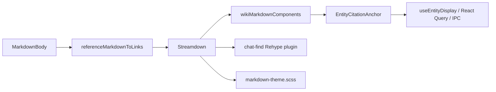

# v1.2.5 Chat Markdown Module Design

> 状态：Planned
>
> 对应主计划：[Module 2：Chat Markdown](./ui-package-storybook-migration-plan.md#7-module-2chat-markdown)
>
> 组织逻辑：本文采用**递进型主线**，按“现有渲染链 → ownership 拆分 → Markdown interface → Electron Adapter → 状态验收”展开。原因是当前 Markdown component 隐藏了 React Query、Agent type 和搜索游标依赖，必须先拆清数据来源再确定 props；横向能力按 Markdown 内容、实体引用、搜索高亮三类做 MECE 划分。

## 1. 结论

Chat Markdown Module 对外提供一个主组件 `ChatMarkdown` 和两个纯文本协议 helper：

```text
@reflecta/ui/chat
  ChatMarkdown
  collectChatEntityReferences
  replaceChatEntityReferences
```

Module 内部负责：

- Streamdown 配置；
- Chat Markdown theme；
- `[[u:id]]`、`[[c:id]]`、`[[d:id]]` 直接引用的识别与渲染；
- 历史 `#reflecta-wiki/*` 链接的兼容显示；
- entity chip 的视觉与可访问交互；
- Agent Message 内部使用的 Markdown 搜索高亮；
- 默认链接安全转换。

Module 不负责：

- React Query；
- entity title 的读取、刷新和错误恢复；
- 打开 Understanding/Context inspector；
- Thread Find Box、当前结果导航和滚动；
- Markdown 导出时的 IPC 写文件；
- Milkdown Editor/Preview。

## 2. 当前渲染链与问题



当前问题：

- `MarkdownBody` 是私有函数，但同时被 assistant text、reasoning、tool detail 和 proposal 使用；
- `EntityCitationAnchor` 在 UI 内部发起 App query；
- `wikiMarkdownComponents` 接收 `AgentEntityCatalogEntry[]`，实际没有使用；
- search state 暴露可变的 `nextMatchIndex`，调用方必须理解内部遍历顺序；
- parsing、rendering、query、navigation 分散在 4 个文件；
- Markdown export 直接调用同一套引用 regex helper，说明引用 codec 已有第二个真实消费者。

## 3. 现有资产处理清单

### 3.1 迁移到 `packages/ui`

| 现有资产                           | 目标实现                       | 可见性               |
| ---------------------------------- | ------------------------------ | -------------------- |
| `MarkdownBody`                     | `ChatMarkdown`                 | public               |
| `WikiLinkChip`                     | `EntityMention`                | package internal     |
| `EntityCitationAnchor`             | `EntityReferenceAnchor`        | package internal     |
| `WikiAnchor`                       | `ChatMarkdownAnchor`           | package internal     |
| `wikiMarkdownComponents`           | Streamdown components factory  | package internal     |
| `wikiUrlTransform`                 | URL transform                  | package internal     |
| `referenceMarkdownToLinks`         | direct citation preprocessing  | package internal     |
| `transformEntityCitationMarkdown`  | `replaceChatEntityReferences`  | public pure helper   |
| `parseEntityCitationHref`          | entity href parser             | package internal     |
| `parseWikiHref`                    | legacy href parser             | package internal     |
| `chatFindMarkdownLabelStartIndex`  | Markdown search implementation | package internal     |
| Rehype highlight transformation    | Markdown search implementation | package internal     |
| `markdown-theme.scss` 全部 partial | Chat Markdown styles           | package internal CSS |
| chat-find marker CSS               | Chat search styles             | shared UI styles     |

### 3.2 留在 Electron

| 现有资产                                | 原因                                          |
| --------------------------------------- | --------------------------------------------- |
| `useEntityDisplay`、`getEntityDisplay`  | App 数据读取与缓存                            |
| `onInspectContextRef` 的真实处理        | 打开业务 inspector                            |
| Thread Find Box 和 active result state  | Thread workflow                               |
| `exportThreadMarkdown` 的查询与文件写入 | App query + IPC                               |
| Composer mention node 解析              | Composer/App contract                         |
| `contextKey`、`parseContextKey`         | Agent/App entity identity                     |
| Milkdown Editor、Readonly Preview       | v1.2.5 明确不迁移                             |
| `medium-zoom` 与其 overlay style        | 只服务 Milkdown Preview，不属于 Chat Markdown |

### 3.3 删除或收缩

| 现有资产                                         | 决策                                                        |
| ------------------------------------------------ | ----------------------------------------------------------- |
| `wikiMarkdownToLinks`                            | 当前无 production caller；确认无历史迁移调用后删除          |
| `wikiHref`                                       | 不公开；仅在内部兼容 fixture 需要时保留                     |
| `wikiMarkdownComponents` 的 `entityCatalog` 参数 | 删除，当前 implementation 没有使用                          |
| `messageContextMentionClass`                     | 由统一 `EntityMention` visual 取代，App 不再拼 class string |
| public AST/plugin helpers                        | 不公开，防止调用方自行组合出不同 Markdown 行为              |

## 4. Public Types

### 4.1 Entity reference

```ts
export type ChatEntityType = "understanding" | "context" | "domain";

export type ChatEntityReference = {
  type: ChatEntityType;
  id: string;
  labelHint?: string;
};
```

`labelHint` 只来自已经持久化的历史 wiki link。它不是可信 entity title，Electron resolver 返回的数据优先。

### 4.2 Entity presentation

```ts
export type ChatEntityPresentation =
  | {
      state: "ready";
      label: string;
      canOpen: boolean;
    }
  | {
      state: "loading" | "unavailable" | "error";
      label: string;
    };

export type ResolveChatEntity = (
  reference: ChatEntityReference,
) => ChatEntityPresentation | undefined;

export type ChatEntityBindings = {
  resolveEntity?: ResolveChatEntity;
  onEntityOpen?: (reference: ChatEntityReference) => void;
};
```

这里的 resolver 必须：

- 同步；
- 纯读取；
- 不在调用期间发起请求；
- 对同一个 reference 在一次 render 中返回稳定结果。

`undefined` 表示调用方没有提供 display data。Module 使用 `labelHint`，否则回退为 `type:id`，并禁用点击。

### 4.3 Component props

```ts
export type ChatMarkdownProps = ChatEntityBindings & {
  value: string;
  tone?: "default" | "muted";
  className?: string;
};

export function ChatMarkdown(props: ChatMarkdownProps): React.ReactNode;
```

Props 规则：

- `value` 是唯一内容输入，不接受预构建 HAST/React children；
- `tone` 控制整体语义颜色；调用方不再用 `[&_*]:!text-*` 覆盖后代；
- `className` 只用于外层布局，不作为改变 Markdown 内部设计的正式 interface；
- `onEntityOpen` 只会在 resolver 返回 `state: "ready"` 且 `canOpen: true` 时触发；
- 普通 HTTP(S) 链接继续按 Streamdown 默认安全规则渲染；
- component 不接受 `rehypePlugins`、`components` 或 `urlTransform`。

## 5. Public Codec Helpers

### 5.1 收集直接引用

```ts
export function collectChatEntityReferences(markdown: string): ChatEntityReference[];
```

行为：

- 识别 `[[u:id]]`、`[[c:id]]`、`[[d:id]]`；
- 忽略 fenced code、inline code、escaped marker 和已有 Markdown link label；
- 保留首次出现顺序；
- 按 `type + id` 去重；
- 不识别任意 title 文本；
- 不把 legacy wiki title link 当成新的直接引用查询。

Electron Adapter 使用该 helper 生成 `useQueries` 输入，Thread Export 使用它批量读取 display title。

### 5.2 替换直接引用

```ts
export function replaceChatEntityReferences(
  markdown: string,
  replace: (reference: ChatEntityReference, source: string) => string,
): string;
```

行为与 `collectChatEntityReferences` 使用同一个 parser，不能维护两套 regex。UI preprocessing 和 Markdown export 都通过该 helper。

不公开 href prefix、href parser 或内部 marker-to-link 细节。

## 6. 内部 Rendering Interface

### 6.1 Entity visual

内部 `EntityMention` 接受：

```ts
type EntityMentionProps = {
  reference: ChatEntityReference;
  presentation: ChatEntityPresentation;
  onOpen?: (reference: ChatEntityReference) => void;
};
```

视觉规则保持当前行为：

- Understanding：`✦` + sky；
- Context：`↳` + emerald；
- Domain：`#` + violet；
- interactive 时渲染 button；
- loading/unavailable/error/non-inspectable 时渲染 span；
- focus ring、hover 和 inline baseline 行为不变。

不把 icon、className 或 HTML element choice 暴露给 App。

### 6.2 Search highlight

Standalone `ChatMarkdown` 不公开 search props。Agent Message Module 使用 package-internal renderer 和 search context：

```ts
type ChatSearchRenderContext = {
  scopeId: string;
  query: string;
  nextMatchIndex: number;
};
```

这个 mutable cursor 只存在 package implementation 内，不出现在 public props。Module 5 对外只暴露：

```ts
type AgentMessageSearch = {
  query: string;
};
```

`AgentMessageView` 使用自己的 `message.id` 作为 `scopeId` 并初始化 cursor。这样调用方不再负责 Markdown AST 的 match 顺序。

### 6.3 Tone

```text
default
  正文使用 --foreground，链接和强调使用当前 primary 规则

muted
  Reasoning / Tool detail 使用 --muted-foreground
  仍保留 code、link、error 和 entity 的必要语义差异
```

不允许 muted tone 通过 `!important` 抹掉所有语义颜色。

## 7. Electron Adapter

### 7.1 Entity 查询

生产 Adapter 流程：


建议 Adapter interface：

```ts
function useChatEntityBindings(
  markdownValues: readonly string[],
  onInspect?: (reference: ChatEntityReference) => void,
): ChatEntityBindings;
```

返回值复用本模块已经定义的公开 `ChatEntityBindings`。该 hook 留在 Electron；它可以批量收集一个 message 所有 Markdown block 的 refs，避免每个 anchor 独立建立 query hook。

状态映射：

```text
query pending  -> { state: "loading", label: type label }
query success  -> { state: "ready", label, canOpen }
missing entity -> { state: "unavailable", label: "引用不可用" }
query error    -> { state: "error", label: "引用加载失败" }
```

当前只有 Understanding 和 Context 能打开 inspector；Domain 返回 `canOpen: false`，除非产品另行提供 Domain inspect action。

### 7.2 Thread Export

`exportThreadMarkdown` 改用：

```ts
const references = messages.flatMap((message) => collectChatEntityReferences(message.text));

const exported = replaceChatEntityReferences(message.text, (reference, source) => {
  return labels.get(entityKey(reference)) ?? source;
});
```

查询和 IPC 写文件仍留在 Electron。

## 8. Storybook 状态矩阵

### 8.1 Markdown 内容

- paragraph 与软/硬换行；
- h1-h6；
- strong、em、strike、link；
- ordered、unordered、nested、task list；
- blockquote、nested blockquote、divider；
- inline code、fenced code、语言标签、超长行；
- table、窄 viewport 横向处理；
- KaTeX；
- Mermaid；
- streaming 中未闭合 emphasis、code fence、table；
- 空字符串、纯空白和超长中文。

### 8.2 Entity 引用

- Understanding、Context、Domain；
- ready interactive；
- ready non-interactive；
- loading；
- unavailable；
- error；
- labelHint fallback；
- malformed、escaped、inline code、fenced code；
- 普通 Markdown link 与 entity ref 混合；
- entity title 变更后的 resolver rerender。

### 8.3 Visual

- `tone=default`；
- `tone=muted`；
- light/dark；
- 320px、640px、conversation width；
- 长 title、长 id、长 URL；
- keyboard focus。

## 9. 测试与替换

原测试重新归属：

| 当前测试                                  | 新位置                               |
| ----------------------------------------- | ------------------------------------ |
| direct citation parser tests              | `packages/ui` codec unit test        |
| malformed/code/escaped marker tests       | `packages/ui` codec unit test        |
| entity loading/missing/error render tests | `packages/ui` component test + Story |
| Markdown around citation tests            | `packages/ui` component test         |
| current title refresh                     | Electron Adapter test                |
| active assistant Markdown search          | Module 5 message test                |
| Thread Export replacement                 | Electron export test                 |

替换完成后删除：

- Renderer `MarkdownBody`；
- Renderer `wiki-link.tsx`；
- 已迁移的 reference codec；
- Renderer chat Markdown theme；
- UI component test 中的 IPC mock。

## 10. Module 出口

- Storybook 渲染 Chat Markdown 不需要 Query Client；
- `ChatMarkdown` public interface 不出现 Agent、IPC、AST 或 plugin 类型；
- entity reference codec 只有一份 implementation；
- Thread Export 与 UI 使用同一个 marker parser；
- Markdown theme 只有 `packages/ui` 一份；
- search mutable cursor 不再泄漏给 Renderer；
- Milkdown 和 medium-zoom 仍留在 Electron；
- Module 3 可以直接复用 `ChatMarkdown tone="muted"` 渲染 reasoning 和 tool detail。
