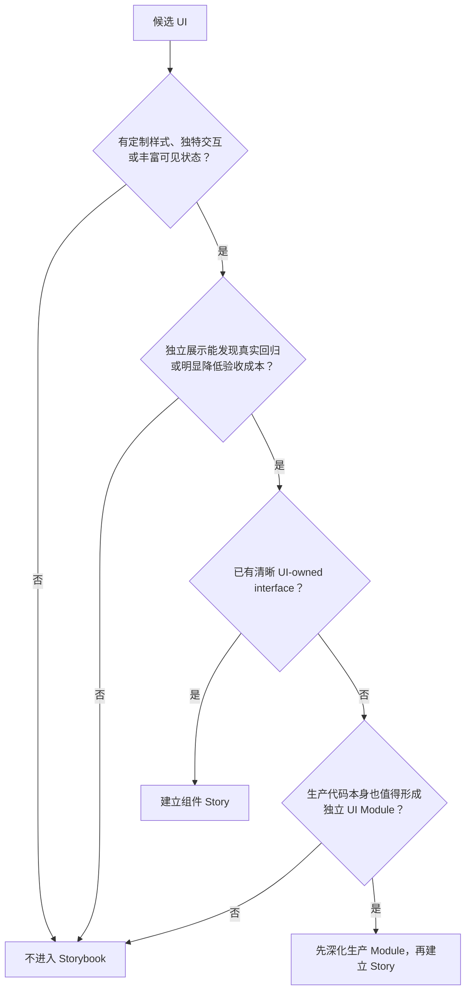
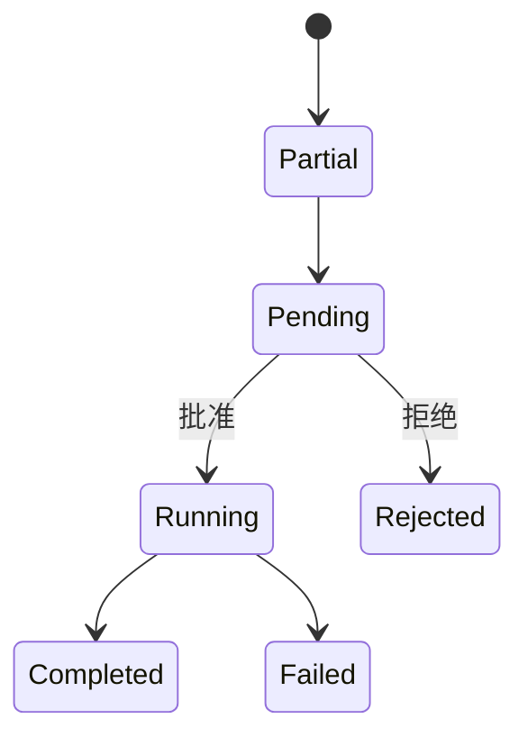

# v1.2.5 Storybook 组件验收设计计划

> 状态：Planned
>
> 日期：2026-07-28
>
> 上位计划：[UI Package 与 Storybook 迁移计划](./ui-package-storybook-migration-plan.md)
>
> 组织逻辑：本文采用“**准入门槛 → 区域白名单 → 状态矩阵 → 实施顺序**”的优先级/结构型混合主线。先回答“什么值得进入 Storybook”，再按 Capture、Agent、Knowledge Wander 三个区域列出高价值 UI Module，随后定义单组件与组合 Story 的验收方式，最后落到迁移和测试。这样组织是为了让 Storybook 保持小而有效：目录结构仍符合产品中的使用上下文，但收录与否只由组件的视觉和交互验收价值决定，不由页面、业务名或 React 文件数量决定。

## 1. 核心结论

Reflecta Storybook 是一套**经过筛选的高价值组件验收面**，不是组件清单，也不是页面或业务流程的缩小版。

一个组件进入 Storybook，必须同时满足：

1. 至少具备一种独特性：定制样式、独特交互或丰富且重要的可见状态；
2. 独立展示确实能发现回归、降低人工验收成本。

因此：

- shadcn primitives 不单独展示；
- 由标准 primitives 直接组合出的普通表单、列表和详情不展示；
- Settings、`DomainForm`、`UnderstandingList`、`UnderstandingDetail`、Context preview/detail 当前不进入 Storybook；
- Storybook 不反向推动所有 Renderer 组件迁入 `packages/ui`；
- 只有当生产代码本身需要形成清晰 UI Module 时，才迁移组件并补 Story；
- 多个组件必须放在一起才能判断视觉关系时，增加少量组合 Story，但不复制页面逻辑。

一句话原则：

> Storybook 只收录值得反复看、值得单独操作、也值得长期防回归的项目独有 UI。

## 2. 高 ROI 准入门槛

### 2.1 两道硬门槛

候选组件必须依次通过两道门槛。

#### 门槛 A：组件是否存在项目独有的验收对象

至少满足一项：

- **定制样式**：视觉语言明显超出标准 primitive 的直接组合；
- **独特交互**：存在树操作、编辑器行为、流式更新、图谱操作、审批等项目特有交互；
- **丰富状态**：存在 loading、streaming、running、completed、rejected、failed 等重要且视觉不同的状态；
- **高风险边界**：长文本、大量项目、深层级、宽内容或异步增量更新容易破坏布局。

#### 门槛 B：独立 Story 是否有实际收益

至少满足一项：

- 不启动 Electron 即可复现难造状态；
- 人工横向比较能比页面验收更快发现问题；
- 组件被多处使用，一次验收可保护多个入口；
- 组合到真实密度后会出现单测无法回答的视觉问题；
- 交互状态可在 Story 内稳定重放。

若只通过门槛 A、没有通过门槛 B，则优先由现有页面、组件测试或 E2E 覆盖。

### 2.2 决策流程



Storybook 不是制造 seam 的理由。只有删除 Storybook 后仍然成立的生产架构收益，才值得为组件重新设计 interface。

### 2.3 删除测试

每个 Story 都要能回答一个明确问题：

> 如果删除这个 Story，我们会失去哪个具体的视觉或交互判断？

回答不出来就删除。以下理由不成立：

- “这个目录下有这个组件”；
- “它是一个业务概念”；
- “它已经被拆成 React component”；
- “以后可能有更多状态”；
- “其他组件都有 Story”。

## 3. 四种收录方式

不是所有需要观察的 UI 都必须成为独立 Story。

| 方式             | 适用条件                                     | 例子                                   |
| ---------------- | -------------------------------------------- | -------------------------------------- |
| 独立组件 Story   | 自身通过两道准入门槛                         | Markdown Editor、Domain Tree、Composer |
| 语义 Fixture     | 共用 renderer，但业务类型会改变内容结构      | 每一种 Tool、每一种 Proposal           |
| 仅进入组合 Story | 自身较浅，但与核心组件一起出现时影响整体观感 | 普通容器、标准操作栏、简单状态说明     |
| 不进入 Storybook | 标准组合、低状态、低回归收益                 | Settings、DomainForm、详情与普通列表   |

“语义 Fixture”不等于新的 public component。不同 Tool 可以共享同一个 visual renderer，同时各保留一个成功态 Story，确认类型到文案、图标和详情结构的映射。

“仅进入组合 Story”也不是为低价值组件补一个隐形目录。它只作为高价值组件的视觉上下文出现。

## 4. 目标导航

```text
Capture
├── 基本组件
│   ├── Markdown Editor
│   ├── Domain Tree
│   ├── Domain Tree Select
│   └── Understanding Row
└── 组合场景样式
    └── 知识整理核心组合

Agent
├── 基本组件
│   ├── Composer
│   ├── Message
│   ├── Markdown
│   ├── Execution
│   │   ├── Reasoning
│   │   ├── Pending
│   │   ├── Context Compaction
│   │   └── Tools
│   └── Proposal
└── 组合场景样式
    ├── 典型任务
    ├── 确认任务
    └── 高密度与异常

Knowledge Wander
└── 基本组件
    └── Knowledge Graph
```

约束：

- 一级按使用上下文定位，不把 Storybook 耦合成产品流程；
- “基本组件”只展示通过准入门槛的项目组件；
- 状态和边界归入组件自身，不建立全局状态实验室；
- 没有高价值组件就不建立区域，禁止空目录；
- 当前不建立“基础与共享”和“Settings”区域；
- Light/Dark、viewport 等横切维度由全局 toolbar 覆盖；
- 以后出现真正跨区域、项目独有的深 Module，再决定是否增加“基础与共享”。

## 5. 统一 Story 设计规则

### 5.1 Story 数量

每个组件只从以下四类中选择有意义的 Story：

1. 一个 Default；
2. 视觉明显不同的状态；
3. 一个代表性交互；
4. 一个或少数几个最危险边界。

禁止建立“状态 × Tool 类型 × 主题 × 宽度 × 数据量”的笛卡尔积。主题和 viewport 优先使用 toolbar；只有它们会改变组件结构时才单列 Story。

### 5.2 中文化

必须中文化：

- 区域、组件和 Story 展示名称；
- fixture 中的用户可见内容；
- 交互按钮、Controls label 和验收说明；
- Reflecta 自己控制的 empty、error 和 placeholder。

保留原文：

- `Understanding`、`Context`、`Domain` 等正式产品术语；
- Tool、Provider、Model 名称；
- 路径、命令、代码和协议字段；
- Story 源码 identifier。

Storybook Manager chrome 只使用官方支持的 locale；没有稳定官方能力时不 fork、不 patch。

### 5.3 Fixture

- 使用 UI-owned type，不直接传 raw DTO、Agent event 或 IPC response；
- 使用接近真实产品的中文内容，不使用 `Lorem ipsum`；
- fixture 默认与 Story 相邻；
- 只有两个以上 Story 复用时才抽共享 fixture；
- Tool 与 Proposal 使用各自真实语义数据，不共用万能 `details`；
- 不建立全局 mock framework。

### 5.4 Interactive Story

- 首选 Story 内部 `useState`；
- callback 只驱动组件自身的可见状态；
- approve/reject 不执行真实 mutation；
- suggestion、upload、search 使用内存 Adapter；
- 不引入 Router、Electron bridge、React Query、production store 或假 backend；
- 三个以上 Story 确实复用同一逻辑后，才提取 story-only helper。

### 5.5 Streaming 兼容规则

Agent streaming Story 必须模拟同一个组件实例随时间增量更新，而不是用 remount 冒充更新：

- Tool root ID 稳定；
- Tool item ID 稳定；
- Message/Proposal ID 稳定；
- 展开、滚动和选择状态在下一帧保留；
- partial payload 允许字段暂缺；
- unknown/future Tool 安全降级；
- Story 结束后可以回到初始帧重复播放。

这组规则同时用于确认 `packages/ui` interface 没有依赖只在 Renderer 中存在的事件顺序或对象 identity。

## 6. Capture 区域

Capture 只保留四个有明显样式或交互价值的 UI Module。

### 6.1 Markdown Editor

`MarkdownEditor`、`MarkdownPreview` 和 `SimpleMarkdownPreview` 作为同一个 Markdown UI Module 验收，不在导航中拆成三个同权组件。

核心 interface：

| 输入/输出                 | 约束                                             |
| ------------------------- | ------------------------------------------------ |
| `value` / `onChange`      | controlled；外部更新可同步                       |
| `readOnly`                | 同一主题下切换编辑与预览                         |
| suggestion port           | 只返回 display-ready suggestion                  |
| upload port               | 只暴露上传进度、结果和错误                       |
| Wiki Link callback        | 输出 entity identity，不导航                     |
| height/placeholder 配置   | 只保留真实调用方需要的选项                       |
| Preview/SimplePreview API | 接收 Markdown 与显示选项，不读取 Capture runtime |

Story：

- 完整文档；
- 空白与 readonly；
- Wiki Link suggestion：loading、empty、results、error、keyboard；
- 图片/视频上传：进行中、成功、失败；
- 文档切换与 controlled update；
- 超长文档、代码、表格和窄容器。

完整文档至少覆盖：

- h1-h6、段落、软/硬换行；
- strong、emphasis、strike、link、inline code；
- 有序、无序、嵌套和 task list；
- blockquote、divider；
- fenced code 与语言标签；
- table；
- image、video；
- Wiki Link。

不为每一种 Markdown 语法单建 Story；用一份完整文档和少量高风险边界覆盖。

### 6.2 Domain Tree

保留原因：树层级、选中态、拖拽和菜单是项目独有交互，深层级和长名称又有明显布局风险。

期望 interface：

| 输入/输出        | 约束                                      |
| ---------------- | ----------------------------------------- |
| `nodes`          | UI-owned tree node，不含 query 状态       |
| `selectedId`     | controlled selection                      |
| `expandedIds`    | controlled 或明确的内部状态               |
| `onSelect`       | 只返回 Domain identity                    |
| `onMove`         | 返回 source、target 和 position           |
| action callbacks | create/rename/delete，不直接调用 mutation |

Story：

- 正常层级与选中；
- 折叠、展开和拖拽；
- empty；
- 深树、多根和长名称；
- context menu；
- 窄容器。

### 6.3 Domain Tree Select

保留原因：它不是普通 Select，而是带树层级、路径、选择模式、排除项和异步状态的项目交互。

期望 interface：

| 输入/输出            | 约束                          |
| -------------------- | ----------------------------- |
| `nodes`              | display-ready tree            |
| `value` / `onChange` | controlled selection          |
| `mode`               | 只保留真实存在的单选/多选语义 |
| `excludedIds`        | 控制不可选项，不内置业务判断  |
| `loading`/`error`    | 由 Adapter 提供可见状态       |
| `disabled`           | 标准不可操作状态              |

Story：

- 无选择与已选路径；
- 展开和键盘操作；
- loading、empty、error；
- 深层级、长路径和大量候选；
- excluded/disabled；
- 窄容器。

只有生产代码也受益于这条 UI-owned seam 时才迁移；不为 Storybook 保留旧 query/compat interface。

### 6.4 Understanding Row

保留原因：它承载 Understanding 的项目视觉、选中反馈、内容摘要和操作入口；单行密度直接影响 Capture 的可读性。

期望 interface：

| 输入/输出  | 约束                                        |
| ---------- | ------------------------------------------- |
| `item`     | title、preview、metadata、display state     |
| `selected` | 由列表/页面控制                             |
| `onSelect` | 返回 Understanding identity                 |
| `onAction` | 返回语义 action，不直接执行删除或打开 Modal |

Story：

- 默认与 selected；
- 有/无 metadata；
- 长标题与长 preview；
- context menu；
- disabled action；
- 窄容器。

### 6.5 Capture 组合：知识整理核心组合

组合：

- `DomainTree`；
- 多个 `UnderstandingRow`；
- `MarkdownEditor` 或 Preview。

只回答单个组件无法回答的问题：

- 左侧层级、列表密度和正文焦点是否清楚；
- selected state 是否跨组件保持一致；
- 长 Domain、长标题和长正文同时出现时是否互相挤压；
- 编辑态是否过度抢占导航层级。

组合使用简单容器和本地状态，不引入 `UnderstandingList`、Detail 页面、query、autosave 或 navigation。

## 7. Agent 区域

Agent 是状态最丰富的区域，但仍按 UI Module 而不是产品旅程组织。

### 7.1 Composer

保留原因：输入、entity、attachment、model、reasoning、context usage 和 running 控制形成独特交互。

Story：

- empty 与 editing；
- initial entity；
- entity suggestion：loading、empty、results、error；
- attachment：adding、multiple、failed；
- running + stop；
- compacting；
- model/reasoning selector；
- context usage 低/高；
- 长输入、大量选项和窄容器。

Story 使用内存 search/upload Adapter，不访问 Electron。

### 7.2 Message

保留原因：同一行需要协调 User/Assistant 内容、attachment、状态、操作和 streaming identity。

Story：

- User：text、entity、attachment 及其组合；
- Assistant：pending、streaming、done、stopped、failed；
- highlighted/search；
- actions enabled/disabled；
- 长内容和窄容器；
- streaming identity。

### 7.3 Markdown

`ChatMarkdown` 与 Capture Editor 分开验收：它面向流式只读消息，包含 Mermaid、KaTeX 和 entity reference，风险不同。

只建立三组主 Story。

#### 完整语法

- h1-h6、段落、软/硬换行；
- strong、emphasis、strike、link；
- 有序、无序、嵌套和 task list；
- blockquote、nested blockquote、divider；
- inline code、fenced code、语言标签；
- table、image；
- KaTeX、Mermaid、entity reference；
- 长中文和中英混排。

#### 流式不完整语法

同一实例逐帧覆盖：

- 未闭合 emphasis、inline code 和 fenced code；
- 未完成 table、link 和 entity reference；
- Mermaid、KaTeX 中间帧；
- 最终闭合状态。

#### 边界

- empty/whitespace；
- 超长代码行、宽表格、长 URL 和长 entity label；
- muted tone；
- 窄容器。

### 7.4 Execution

`Reasoning`、`Pending`、`Context Compaction` 和 `Tools` 是 `AgentExecutionBlock` 的可见变体，不提升成四个 public component。

共同状态：

- running/streaming；
- completed；
- failed；
- empty/partial details；
- collapsed/expanded；
- 长内容和窄容器。

变体重点：

| 变体               | 重点                                      |
| ------------------ | ----------------------------------------- |
| Reasoning          | 空流、Markdown 增量、完成态、长 reasoning |
| Pending            | 默认/自定义 label、等待层级               |
| Context Compaction | before/after tokens、缺失估算、长 summary |
| Tools              | 类型语义、lifecycle、展开内容和危险边界   |

### 7.5 Tool 的二维覆盖

Tool 覆盖拆成两个正交维度，避免“每种 Tool × 每种状态”的笛卡尔积。

#### 类型维度：每种 Tool 一个成功态语义 Fixture

- Read、Edit、Write、Safe Bash；
- Domain List、Domain Inspect；
- Understanding List、Understanding Get；
- Context List、Context Get；
- Attachment Read、Retrieve Knowledge、Graph；
- Web Search、Fetch Content、Get Search Content、Legacy Search；
- Unknown Tool。

它验证：

- Tool 名称映射；
- 图标和摘要；
- details 数据结构；
- 属于哪个 visual family；
- unknown/future type 的安全降级。

#### Visual family 维度：集中验收 lifecycle 与边界

以实际 renderer family 为准，每个 family 只补它真正拥有的风险：

| Family         | 代表风险                                   |
| -------------- | ------------------------------------------ |
| 文件读写       | 长路径、长 diff、空输出、失败              |
| 命令执行       | 超长 command/cwd、长 output、running、失败 |
| 列表与实体摘要 | empty、many、长 label、缺失 entity         |
| 内容读取       | 长正文、截断、unsupported、读取失败        |
| 搜索与来源     | many sources、长 URL、部分失败             |
| Graph          | empty、many nodes/edges、长标题            |
| Fallback       | partial/unknown payload、安全字段展示      |

例如 Safe Bash 的长命令只在“命令执行” family 覆盖一次，不复制到每个 Tool。

### 7.6 Proposal

保留原因：Proposal 有明显的项目视觉、审批交互和不可逆操作风险。

每种 Proposal 保留一个成功语义 Fixture：

- Understanding Create/Update/Delete；
- Domain Create/Update/Delete；
- Context Create/Update/Delete；
- dangerous Bash；
- Unknown fallback。

生命周期按 visual family 集中覆盖：



还需覆盖长内容、窄容器和 unknown fallback。Interactive Story 只切换 `AgentProposalView`，不执行真实 mutation。

### 7.7 Agent 组合场景

只保留三个组合 Story。

#### 典型任务

组合 User Message、Assistant pending、Reasoning、两到三个不同 family 的 Tool、Final Markdown 和 Composer。

验收：

- 正常任务的信息顺序和层级；
- streaming 时布局是否稳定；
- Tool 是否压过最终回答；
- Composer 与消息区是否有清楚边界。

#### 确认任务

组合 partial Proposal、pending、approve/reject、completed/rejected 和后续 Assistant Message。

验收：

- 操作是否明确；
- 确认、拒绝和完成态是否容易区分；
- 状态切换时组件衔接是否自然。

#### 高密度与异常

组合多个 Tool、expanded details、超长 command/output、Tool failed、Assistant stopped/failed、部分 Markdown 和恢复可用的 Composer。

验收：

- 多个 Tool 叠加后的密度；
- 异常是否清楚但不过度抢占注意力；
- 展开项是否破坏消息节奏；
- 长内容和窄容器是否撑破布局。

三个组合都只使用 `packages/ui` 的真实组件、View Model 和本地状态；不复制 ChatPage、Agent reducer 或业务 workflow。

## 8. Knowledge Wander 区域

### 8.1 Knowledge Graph

这是该区域当前唯一通过准入门槛的组件：图布局、节点/边关系、选择反馈、缩放和大量数据都具有明显的项目视觉与交互风险。

期望 interface：

| 输入/输出       | 约束                                          |
| --------------- | --------------------------------------------- |
| `data`          | UI-owned nodes/edges                          |
| `selection`     | controlled selected/hovered identity          |
| `onSelect`      | 返回 node identity                            |
| viewport action | zoom、fit、resize，不读取 route/query         |
| display state   | empty/loading/error 仅在 Graph 自身可见时保留 |

Story：

- small/normal graph；
- empty 和 single node；
- selected、hovered 和 neighbor states；
- disconnected；
- many nodes/edges；
- 长标题；
- resize、zoom 和 fit；
- 窄容器。

Graph controls 作为 `KnowledgeGraph` 的内部交互一起验收，不单独建立 Story。选中后的普通详情不建立 Story，也不为了凑组合场景复制 Knowledge Wander 页面。

## 9. 明确排除项

### 9.1 当前不进入 Storybook

| 排除项                                        | 理由                                         | 由什么覆盖                      |
| --------------------------------------------- | -------------------------------------------- | ------------------------------- |
| shadcn Button/Input/Select/Dialog 等          | 第三方 primitive，没有 Reflecta 独有验收对象 | shadcn 自身 + 实际组件使用      |
| Foundation gallery                            | 容易退化成 primitive 陈列，验收问题不明确    | 全局 theme + 各高价值 Story     |
| ModalProvider/DrawerProvider                  | 当前主要是标准 Overlay 编排，独立视觉收益低  | component/integration test      |
| Settings 各 section                           | 主要是标准表单组合和配置 wiring              | 页面验收 + integration/E2E      |
| DomainForm                                    | 标准 Input/TreeSelect/Button 组合，状态少    | component test + E2E            |
| UnderstandingList                             | 容器与数据编排为主，视觉由 Row 承担          | UnderstandingRow + Capture 组合 |
| UnderstandingDetail                           | 标题、正文和操作编排为主，没有独立深交互     | Editor/Preview + E2E            |
| Context preview/detail                        | 标准摘要/详情展示，独立验收收益低            | 所属页面 + E2E                  |
| Graph selection 普通详情                      | 标准详情区域，Graph 本身才是高风险组件       | KnowledgeGraph + 页面验收       |
| App Shell、完整页面、route/store/query wiring | 不是组件视觉验收对象                         | integration/E2E                 |

### 9.2 重新进入的条件

排除不是永久禁令。只有出现以下变化时才重新评估：

- 形成明显的项目视觉语言；
- 新增多个重要且难以在页面稳定复现的状态；
- 出现独特交互；
- 被多个入口复用；
- 真实回归证明独立 Story 能显著降低成本。

不能因为组件被迁入 `packages/ui` 就自动补 Story。

## 10. 当前覆盖与迁移

### 10.1 现有 Story 处理

| 当前 Story                          | 处理                                                |
| ----------------------------------- | --------------------------------------------------- |
| `foundation.stories.tsx`            | 删除；不保留 primitive gallery                      |
| `markdown-editor.stories.tsx`       | 迁到 `Capture/基本组件/Markdown Editor`，补完整矩阵 |
| `chat-composer.stories.tsx`         | 迁到 `Agent/基本组件/Composer`，中文化并补交互/边界 |
| `chat-markdown.stories.tsx`         | 重写为完整语法、流式不完整语法、边界三组            |
| `agent-execution-block.stories.tsx` | 保留类型 fixture，按 visual family 去重状态和边界   |
| `agent-proposal-card.stories.tsx`   | 保留类型 fixture，集中 lifecycle                    |
| `chat-message-row.stories.tsx`      | 补 User/Assistant 组合、长内容和 streaming identity |
| `ActiveTools`                       | 删除，由“高密度与异常”组合 Story 替代               |
| 重复 `StreamingLifecycle`           | 合并到所属 Module，保留一个稳定 identity 的交互实现 |

### 10.2 Production seam 优先级

| Module              | 结论                                                 |
| ------------------- | ---------------------------------------------------- |
| Editor/Chat Modules | 已在 `packages/ui`，直接完善 Story                   |
| Domain Tree         | 高价值；生产 interface 清理后迁移                    |
| Domain Tree Select  | 高价值；只保留 UI-owned tree/select interface 后迁移 |
| Understanding Row   | 高价值；拆掉 store/mutation/Modal ownership 后迁移   |
| Knowledge Graph     | 高价值；拆 data/selection/runtime boundary 后迁移    |
| 其他排除项          | 不为 Storybook 迁移；只有生产架构收益出现时再评估    |

理想 Module 是“小 interface 承载大量行为”。如果为了 Storybook 暴露大量 query、compat flag、runtime object 或 callback 细节，说明 seam 仍然太浅，应先调整生产设计或放弃独立 Story。

## 11. 分阶段实施

### Phase 1：删减与中文化

- 删除 Foundation gallery；
- 按 Capture、Agent、Knowledge Wander 配置固定排序；
- 将现有 Story 改为中文展示名和中文 fixture；
- 删除重复、低价值和笛卡尔积 Story；
- 不创建 Settings 或空目录。

出口：

- 每个保留 Story 都能回答删除测试；
- Storybook build 通过。

### Phase 2：Markdown 与现有核心组件

- 完善 Capture Markdown Editor/Preview；
- 完善 Agent Composer、Message、ChatMarkdown；
- 覆盖完整 Markdown 语法、流式不完整语法和危险边界。

出口：

- Markdown 矩阵无缺项；
- interactive Story 可重复操作；
- 不依赖 Electron runtime。

### Phase 3：Agent lifecycle

- 为每种 Tool 和 Proposal 保留一个成功态语义 fixture；
- 按 visual family 补 lifecycle 和边界；
- 验证 streaming 的稳定 identity；
- 删除类型 × 状态的重复 Story。

出口：

- 每种 Tool/Proposal 的语义可定位；
- running、completed、rejected、failed 等关键状态可交互切换；
- 长命令、大量项目和长内容可稳定展示。

### Phase 4：组合场景

- 实现 Capture“知识整理核心组合”；
- 实现 Agent“典型任务、确认任务、高密度与异常”；
- 只复用真实 `packages/ui` 组件和 UI-owned fixture。

出口：

- 能验收多组件叠加后的密度、节奏和层级；
- 不存在页面副本、Router、query、store 或假 backend。

### Phase 5：后续高价值 Module

按生产需求逐个推进：

1. Domain Tree；
2. Domain Tree Select；
3. Understanding Row；
4. Knowledge Graph。

每个 Module 顺序固定为：

1. 确认 production ownership；
2. 设计深而小的 UI-owned interface；
3. 迁入 `packages/ui`；
4. Renderer 通过 Adapter 使用；
5. 建立基本组件 Story；
6. 只有存在组合问题时才加入组合 Story。

不批量迁移排除项。

### Phase 6：全量验证

- format；
- lint；
- typecheck；
- UI unit/component tests；
- Storybook build；
- 全 workspace tests/build；
- 完整 Electron E2E；
- 按 Angular Commit Convention 提交。

## 12. 测试职责

| 层级              | 负责验证                                               |
| ----------------- | ------------------------------------------------------ |
| Storybook         | 高价值组件的视觉、状态、交互、边界和少量组合效果       |
| UI unit/component | callback、parser、DOM identity、本地状态保留、安全降级 |
| Electron tests    | DTO/event → View Model、query/store/reducer、Adapter   |
| E2E               | 页面 wiring、真实业务流程、IPC、持久化和跨区域行为     |

不编写“检查 Story 文件是否包含某段 Markdown”之类的测试。Markdown parser、streaming identity 或 callback 有真实行为风险时，写最小且可运行的组件/单元测试；视觉覆盖由 Storybook 人工验收。

## 13. 最终验收清单

### 范围与 ROI

- [ ] Storybook 只包含 Capture、Agent、Knowledge Wander 的高价值组件；
- [ ] Settings、DomainForm、普通 List/Detail、Context preview/detail 没有独立 Story；
- [ ] 没有 shadcn gallery、Foundation gallery、页面 Story 或空目录；
- [ ] 每个 Story 都通过两道准入门槛和删除测试；
- [ ] 未因 Storybook 单独制造 production seam。

### 基本组件

- [ ] Markdown Editor/Preview 作为一个 Module 验收，语法与边界完整；
- [ ] Agent Markdown 覆盖完整语法、流式不完整语法和边界；
- [ ] Tool/Proposal 使用“类型语义 fixture + visual family 状态”二维覆盖；
- [ ] streaming 使用稳定 identity，不依赖 remount；
- [ ] Domain Tree、Domain Tree Select、Understanding Row、Knowledge Graph 只在清晰 UI seam 完成后加入。

### 组合场景

- [ ] Capture 只有一个知识整理核心组合；
- [ ] Agent 只有典型任务、确认任务、高密度与异常三个组合；
- [ ] 组合 Story 能回答单组件无法回答的密度、节奏或层级问题；
- [ ] 组合只使用真实组件和本地展示状态；
- [ ] 不引入 Router、IPC、query、production store 或业务 workflow。

### 中文与工程验证

- [ ] 导航、Story 名称、fixture、Controls 和说明为中文；
- [ ] 正式产品术语、Tool、代码和命令保留原文；
- [ ] format、lint、typecheck 通过；
- [ ] UI unit/component tests 通过；
- [ ] Storybook build 通过；
- [ ] 全 workspace tests/build 通过；
- [ ] 完整 Electron E2E 通过；
- [ ] 全部变更按 Angular Commit Convention 提交。
