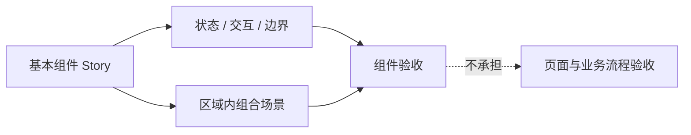
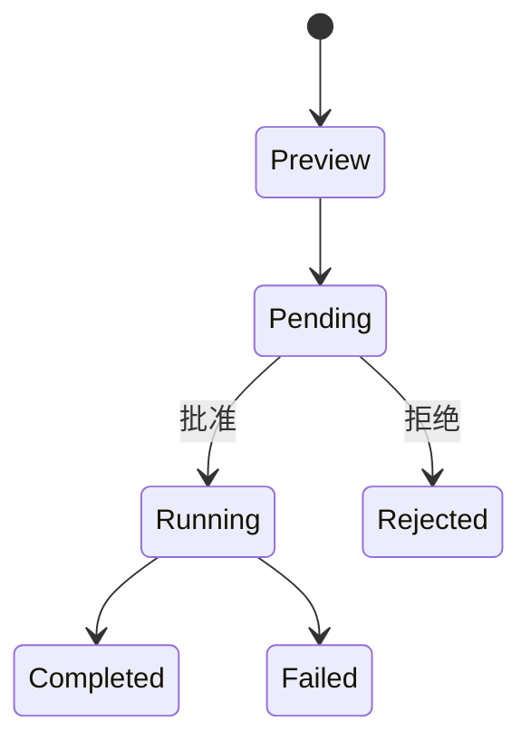

# v1.2.5 Storybook 组件验收设计计划

> 状态：Planned
>
> 日期：2026-07-28
>
> 上位计划：[UI Package 与 Storybook 迁移计划](./ui-package-storybook-migration-plan.md)
>
> 组织逻辑：本文采用**空间/结构型主线**，先定义 Storybook 的组件验收边界和统一 Story 规则，再按“基础与共享、Capture、Agent、Knowledge Wander、Settings”五个 UI 区域平行展开，最后给出迁移顺序和验收标准。区域之间按组件的主要使用上下文做 MECE 划分；每个区域内部统一按“基本组件 → 组合场景样式”递进，基本组件再覆盖自身有意义的状态、交互和边界。这样既保留组件库式 Storybook 的可定位性，又能在必要时把多个组件放在一起观察真实密度和层级，而不把 Storybook 变成页面、业务流程或 E2E 的替代品。

## 1. 核心结论

Reflecta Storybook 的验收对象是组件，不是页面，也不是产品流程。

它使用两种互补的 Story：

1. **基本组件 Story**：独立验收一个项目组件的状态、样式、交互和边界；
2. **组合场景 Story**：把同一区域的多个真实组件放在一起，验收它们同时出现时的密度、节奏、层级和布局。

组合场景可以模拟页面中的正常使用片段，例如一轮典型 Agent 任务，但它只提供视觉上下文，不验证 route、query、IPC、store、数据库或业务 workflow。



一句话完成定义：

> 一级按 UI 区域找到组件，区域内先独立验收组件，再用少量组合 Story 观察这些组件一起出现时的整体效果。

## 2. Storybook 边界

### 2.1 Storybook 负责什么

- Reflecta 独有组件的视觉语言；
- 组件的 default、variant 和有业务意义的状态；
- loading、streaming、running、completed、rejected、failed 等可见变化；
- hover、focus、expand、select、approve、reject 等组件交互；
- 长内容、大量项目、空数据、异常数据和窄宽度；
- Light/Dark；
- 同一区域组件组合后的视觉密度和信息层级；
- 组件 interface 是否可以脱离 Electron runtime 独立驱动。

### 2.2 Storybook 不负责什么

- route 跳转；
- Electron IPC；
- React Query cache；
- session、store、reducer 和 autosave；
- 数据库读写；
- Agent 或 Tool protocol 是否正确；
- 用户是否完成一条产品旅程；
- 完整页面与真实 App wiring；
- 用 Storybook 复制 E2E。

这些能力分别由 Electron Adapter tests、integration tests 和 E2E 负责。

### 2.3 组合场景不是页面 Story

组合场景允许出现：

- 多条 Message Row；
- Message Row 与 Composer；
- Domain Tree 与 Understanding List；
- Understanding Row 与 Editor/Preview；
- Knowledge Graph 与选中信息；
- Settings 导航与一个设置区域。

组合场景不允许为了“像页面”而引入：

- Router；
- connected query hook；
- Electron bridge；
- production store；
- 真实数据持久化；
- 复制一份只在 Storybook 使用的 Page implementation。

组合 Story 直接使用 UI-owned props、View Model 和本地 callback。它模拟的是组件摆在一起的视觉状态，不是业务流程执行器。

## 3. 组件与 Story 的粒度

### 3.1 什么值得有独立 Story

满足任一条件即可：

- 编码 Reflecta 独有的视觉或交互语义；
- 存在多个需要人工比较的可见状态；
- 内容长度或数量变化容易破坏布局；
- 在区域组合中承担明确的信息层级；
- 虽然是 package internal，但有独立视觉形状需要验收；
- 同一 visual renderer 服务多个业务类型，需要分别验证语义 fixture。

典型例子：

- `UnderstandingRow`；
- `DomainTree`；
- `MarkdownEditor`；
- `ChatComposer`；
- `ChatMessageRow`；
- `AgentExecutionBlock`；
- `AgentProposalCard`；
- `KnowledgeGraph`。

### 3.2 什么不单独展示

- 未修改的 shadcn primitives；
- 只有一次调用、没有独立视觉规则的薄 wrapper；
- 只转发 className 或 callback 的组件；
- 纯 query、store、Adapter、codec；
- Tool-specific renderer 中没有独立视觉差异的内部一行函数；
- 为覆盖目录而制造的假组件。

因此不建立 Button、Input、Select、Dialog、Card 等 shadcn 全量画廊。它们只在 Reflecta 组件中自然出现。

### 3.3 “基础与共享”的收录标准

`基础与共享` 不是 shadcn catalog，只收录：

- Reflecta 自己定义的 theme/token 组合效果；
- Reflecta 封装并规定了行为的 Modal/Drawer；
- 跨区域复用的项目级 entity visual；
- 具有项目语义的 empty/error/feedback pattern；
- 其他至少被两个区域复用、且自身值得独立验收的组件。

如果一个组件只属于 Capture 或 Agent，即使底层使用通用 primitive，也放回对应区域。

### 3.4 不做 Story 笛卡尔积

每个组件不需要为“状态 × 主题 × 宽度 × 数据量”生成全部组合。

Story 选择遵循：

- 一个 Default；
- 每个视觉明显不同的状态；
- 一个代表性交互 Story；
- 一个或少数几个最危险边界；
- Light/Dark 和 viewport 尽量使用全局 toolbar；
- 只有主题或宽度会改变组件结构时才建立独立 Story。

## 4. 目标导航

```text
基础与共享
└── 基本组件
    ├── Reflecta 视觉基线
    ├── 确认弹窗
    ├── 共享抽屉
    └── Entity Visual

Capture
├── 基本组件
│   ├── Understanding Row
│   ├── Understanding List
│   ├── Understanding Detail
│   ├── Markdown Editor
│   ├── Markdown Preview
│   ├── Domain Tree
│   ├── Domain Form
│   ├── Domain Tree Select
│   └── Context Visual
└── 组合场景样式
    ├── Domain Tree 与 Understanding List
    ├── Understanding List 与 Detail
    └── Understanding 编辑与 Context

Agent
├── 基本组件
│   ├── Composer
│   ├── Message
│   ├── Markdown
│   ├── Reasoning
│   ├── Tools
│   ├── Proposal
│   ├── Context Compaction
│   └── Thread Visual
└── 组合场景样式
    ├── 一个典型的 Agent 任务过程
    ├── 多个 Tool 连续执行
    ├── Reasoning、Tool 与最终回复
    ├── Proposal 确认与拒绝
    └── 失败、停止与长内容

Knowledge Wander
├── 基本组件
│   ├── Knowledge Graph
│   └── Graph Selection Visual
└── 组合场景样式
    ├── 图谱浏览
    └── 节点选中与关联信息

Settings
├── 基本组件
│   ├── AI Provider / Model
│   ├── Retrieval Status
│   ├── Storage
│   └── Trash
└── 组合场景样式
    ├── AI 设置区域
    └── Retrieval 生命周期
```

规则：

- 一级始终是 UI 区域；
- 二级始终是“基本组件”或“组合场景样式”；
- 状态和边界归到对应组件，不建立全局“状态实验室”或“边界实验室”；
- Storybook 通过 `storySort` 固定区域顺序；
- 不建立空目录：某区域尚无 UI-owned component 时，等 seam 完成后再出现。

当前不单列 App Shell：`AppLayout`、`AppChromeMenu` 和 route wiring 主要是页面编排或薄 wrapper，没有足够独立的项目组件语义。以后若形成可由 props 驱动、值得独立验收的 Shell visual，再按相同标准决定归入“基础与共享”或建立新区域。

## 5. 统一 Story 结构

### 5.1 基本组件 Story 模板

每个核心组件先回答四个问题：

| 维度 | 问题                                             | 常见 Story                     |
| ---- | ------------------------------------------------ | ------------------------------ |
| 默认 | 正常内容下组件是什么样                           | Default                        |
| 状态 | 哪些状态会显著改变视觉或可操作性                 | Loading、Selected、Failed      |
| 交互 | 用户操作时能否判断 feedback、focus 和 affordance | Interactive、Expanded、Editing |
| 边界 | 什么内容最可能撑破布局或暴露降级问题             | Long、Many、Empty、Unavailable |

Story title 使用中文区域路径，例如：

```ts
title: "Agent/基本组件/Tools/Read";
```

Story name 使用中文，例如：

```ts
export const 执行中 = {};
export const 执行失败 = {};
export const 超长路径 = {};
```

源码 identifier 如需保持英文，可以通过 `name` 提供中文显示名。

### 5.2 组合场景 Story 模板

组合场景必须声明：

- 要放在一起观察哪些组件；
- 为什么单独看不能判断；
- 采用什么宽度和内容密度；
- 重点验收哪些视觉关系；
- 哪些业务能力明确不在本 Story 验收。

组合场景默认使用正常宽度和真实中文 fixture。只有目标就是压力验收时才使用极端数据。

### 5.3 Fixture 规则

- 使用 UI-owned type；
- 不使用 raw DTO、Agent event 或 IPC response；
- 中文内容保持真实，不使用 `Lorem ipsum`；
- 同一组件的状态 Story 复用同一组 fixture builder；
- Tool 和 Proposal 使用符合自身语义的数据，不共享一个假的通用 details；
- fixture 只在两个以上 Story 复用时才抽文件；
- fixture 与 Story 相邻，不建立大型全局 mock framework。

### 5.4 Interactive 规则

- 首选 Story 内部 `useState`；
- callback 只改变展示所需的本地状态；
- streaming 使用稳定 ID 的 View Model 快照；
- approve/reject 只模拟组件 lifecycle，不执行真实 mutation；
- 至少三个 Story 复用同一切帧逻辑后，才提取小型 story-only helper；
- 不引入状态机依赖和假 backend。

## 6. 基础与共享区域

### 6.1 Reflecta 视觉基线

保留一个精简 Story，集中展示：

- 背景、前景、muted、border、primary、destructive 等语义 token；
- 主要文字层级；
- 常用圆角、阴影和间距；
- Light/Dark；
- 一组 Reflecta 真实组件片段。

它不是 shadcn showcase，不列出所有 primitive、variant 和 size。

### 6.2 确认弹窗

验收 `ModalProvider` 所定义的项目行为：

- 普通确认；
- destructive 确认；
- 自定义标题、说明和按钮；
- 超长内容；
- keyboard focus 与取消；
- callback 触发。

不单独展示底层 `Dialog`。

### 6.3 共享抽屉

验收 `DrawerProvider`：

- 默认抽屉；
- 长内容；
- 不同标题；
- close callback；
- 抽屉内出现表单或详情内容时的 spacing。

不单独展示底层 `Sheet`。

### 6.4 Entity Visual

当 Understanding、Context、Domain 的视觉在至少两个区域复用时，集中验收：

- 三种 entity type；
- ready、loading、unavailable、error；
- interactive / non-interactive；
- 超长 label；
- icon、颜色和 focus。

如果只是 Agent Markdown 内部实现，则暂时留在 Agent，不为了“共享”提前抽象。

## 7. Capture 区域

Capture 的 Story 只验收知识沉淀相关组件，不运行 Capture store、query 和 autosave。

### 7.1 当前可直接验收

`packages/ui/editor` 已具备：

- `MarkdownEditor`；
- `MarkdownPreview`；
- `SimpleMarkdownPreview`；
- Wiki Link suggestion；
- upload port；
- Markdown theme。

这些组件在 Storybook 导航中归入 `Capture/基本组件`，因为当前主要使用上下文是 Understanding 的编写与回看。

### 7.2 Markdown Editor

基本 Story：

- 空白与 placeholder；
- 完整中文文档；
- controlled value 更新；
- readonly；
- auto height / max height；
- document switch；
- suggestion loading / empty / results / error；
- keyboard select / cancel；
- image/video upload success / failure；
- 长文档、长代码和长表格；
- Light/Dark。

完整文档覆盖：

- heading；
- paragraph 与软/硬换行；
- strong、em、strike、link、inline code；
- ordered、unordered、nested、task list；
- blockquote、divider；
- fenced code 与语言标签；
- table；
- image、video；
- Wiki Link。

不为每一种 Markdown 语法创建独立 Story；使用一个完整文档加少量高风险 Story。

### 7.3 Markdown Preview

基本 Story：

- 完整文档；
- empty；
- Wiki Link click；
- image zoom enabled / disabled；
- long code / table；
- Light/Dark。

`SimpleMarkdownPreview`：

- one line；
- multi-line clamp；
- Markdown syntax removal；
- Wiki Link label；
- image/link alt；
- 超长中文。

### 7.4 Understanding Row

在建立 UI-owned View Model 和 callback seam 后迁入 Storybook。

基本 Story：

- 默认；
- selected；
- 空 body；
- 有多个 Context / Connection；
- 没有 Context / Connection；
- 超长 title；
- 超长 preview；
- context menu；
- disabled action；
- narrow width。

Story 不调用 Capture store、query、delete mutation 或 Modal hook；这些由 Renderer Adapter 转成 props/callback。

### 7.5 Understanding List

只在列表本身形成有意义的 UI Module 后建立 Story：

- loading；
- empty；
- populated；
- selected item；
- many items；
- long items；
- sort/filter header visual；
- narrow width。

如果 `UnderstandingList` 仍主要是 query/store orchestration，则先拆 `UnderstandingListView`，不把 connected component 原样接进 Storybook。

### 7.6 Understanding Detail 与 Context

候选基本组件：

- Understanding title/body visual；
- editing / readonly；
- saving indicator / error visual；
- Context preview；
- Context detail；
- empty Context；
- many Contexts；
- long Context；
- Context drawer content。

不在 Storybook 中实现 draft autosave、delete、IPC 和 navigation。

### 7.7 Domain Tree 与 Domain Form

`DomainTree` Story：

- collapsed / expanded；
- selected；
- nested；
- empty；
- many roots / deep tree；
- long names；
- drag preview / reorder interaction；
- context menu；
- narrow width。

`Domain Form` Story：

- create / edit；
- root / child；
- validation；
- duplicate name error；
- long name。

`DomainTreeSelect` Story：

- no selection；
- selected path；
- expanded tree；
- many/deep domains；
- search result；
- unavailable selection。

这些组件必须先去掉 Capture query、store、toast 和 Modal ownership，再进入 `packages/ui`。

### 7.8 Capture 组合场景样式

#### Domain Tree 与 Understanding List

组合：

- Domain Tree；
- list header；
- Understanding List；
- selected state。

验收：

- 左右层级和选中态是否清楚；
- 长 Domain、长 Understanding 是否互相挤压；
- 列表较多时整体密度；
- 320px/窄布局不要求模拟真实响应式页面，只验收组件容器内表现。

不验收 Domain query、filter 请求和 selection store。

#### Understanding List 与 Detail

组合：

- 多个 Understanding Row；
- selected row；
- Understanding Detail；
- Markdown Preview / Editor。

验收：

- list 与 detail 的视觉主次；
- selected row 是否足够明显；
- detail 编辑态是否压过导航；
- 长内容滚动边界。

#### Understanding 编辑与 Context

组合：

- Markdown Editor；
- Context previews；
- Context drawer content；
- saving/error visual。

验收 Editor 与 Context 同时出现时的内容层级，不执行真实保存。

## 8. Agent 区域

Agent 目前拥有最完整的 UI-owned component seam，因此是 v1.2.5 首批重点补齐的区域，但它只是 Storybook 的一个区域。

### 8.1 Composer

基本 Story：

- empty；
- initial entity；
- editing；
- running + stop；
- compacting；
- model/reasoning selector；
- Context usage 低/高；
- attachment adding / failed；
- multiple attachments；
- entity suggestion loading / empty / results / error；
- long input；
- many model options；
- narrow width。

Interactive Story 使用内存 search/upload Adapter，不访问 Electron。

### 8.2 Message

`ChatMessageRow` Story：

- User text；
- User entity mentions；
- User image/file attachments；
- User text + entities + attachments；
- Assistant text；
- pending；
- streaming；
- done；
- stopped；
- failed；
- highlighted/search；
- actions enabled / disabled；
- long text；
- narrow width。

### 8.3 Markdown

`ChatMarkdown` 使用三个主要 Story。

#### 完整语法

覆盖：

- h1-h6；
- paragraph 与软/硬换行；
- strong、em、strike、link；
- ordered、unordered、nested、task list；
- blockquote、nested blockquote、divider；
- inline code、fenced code、语言标签；
- table；
- KaTeX；
- Mermaid；
- entity reference；
- image；
- 长中文与中英混排。

#### 流式不完整语法

使用稳定组件实例逐帧覆盖：

- 未闭合 emphasis；
- 未闭合 inline/fenced code；
- 未完成 table；
- 未完成 link；
- 未完成 entity reference；
- Mermaid/KaTeX 中间帧；
- 最终闭合状态。

#### 边界

- empty / whitespace；
- long code line；
- wide table；
- long URL；
- long entity label；
- 320px；
- muted tone；
- Light/Dark。

### 8.4 Reasoning 与 Pending

`AgentExecutionBlock` 中分别验收：

- reasoning streaming empty；
- reasoning streaming with Markdown；
- reasoning done；
- long reasoning；
- entity reference；
- pending default/custom label。

Reasoning 只是 execution block 的一种 visual，不为 Story 单独公开 production component。

### 8.5 Tools

每个 active Tool 必须有独立 Story/fixture：

- Read；
- Edit；
- Write；
- Safe Bash；
- Domain List；
- Domain Inspect；
- Understanding List；
- Understanding Get；
- Context List；
- Context Get；
- Attachment Read；
- Retrieve Knowledge；
- Graph；
- Web Search；
- Fetch Content；
- Get Search Content；
- Legacy Search；
- Unknown Tool。

独立 Story 不代表独立 public component。视觉结构相同的 Tool 复用同一个 internal renderer。

每个 visual family 至少覆盖：

- normal completed；
- running；
- failed；
- no details；
- single / multiple items；
- details 与 error 同时存在；
- preview / full；
- long；
- many；
- narrow width；
- collapsed / expanded。

Tool-specific 高风险案例：

| Tool family              | 必须重点覆盖                                |
| ------------------------ | ------------------------------------------- |
| Read/Edit/Write          | 长路径、长 diff、空输出、失败               |
| Safe Bash                | 超长 command、cwd、terminal output、失败    |
| Domain/Understanding     | 长 label、很多 rows、空结果、缺失 entity    |
| Context/Attachment       | 长正文、binary/unsupported、截断、读取失败  |
| Retrieve Knowledge       | 很多结果、长 Markdown preview、部分结果失败 |
| Graph                    | 很多 nodes/edges、空图、长标题              |
| Web Search/Fetch Content | 很多来源、长 URL、长摘要、单个来源失败      |
| Unknown                  | 安全字段展示，不暴露 raw payload            |

streaming/rerender Story 必须保持 Tool root、item 和展开状态的稳定 identity。

### 8.6 Proposal

每种 Proposal 类型有独立 Story：

- Understanding Create / Update / Delete；
- Domain Create / Update / Delete；
- Context Create / Update / Delete；
- dangerous Bash；
- Unknown fallback。

每个 visual family 至少覆盖：

- partial preview；
- later preview；
- pending；
- running；
- completed；
- rejected；
- failed；
- long content；
- narrow width。

Interactive Story：



它只切换 `AgentProposalView`，不执行真实 Tool mutation。

### 8.7 Context Compaction

基本 Story：

- tokens before / after；
- missing estimate；
- long multiline summary；
- narrow width；
- Light/Dark。

### 8.8 Thread Visual

`ThreadSidebar`、Thread row、Thread action menu、Context Inspector 等只有在拆出 UI-owned View 后才进入 Storybook。

候选 Story：

- thread default / active / running / failed；
- many threads；
- long title；
- date groups；
- collapsed/narrow；
- Context Inspector ready/loading/unavailable/error；
- long entity content。

Thread query、rename/delete mutation、active session store 和 inspector navigation 留在 Electron。

### 8.9 Agent 组合场景样式

#### 一个典型的 Agent 任务过程

组合：

- User Message；
- Assistant pending；
- Reasoning；
- 两到三个 Tool；
- Final Markdown；
- Composer。

通过手动“下一状态”切换 running → completed。验收目标是：

- 组件顺序和层级；
- streaming 时布局稳定；
- Tool 不压过最终回答；
- Composer 与消息区的视觉关系。

不验证 Agent 是否做出正确决策。

#### 多个 Tool 连续执行

组合多个不同 visual family：

- completed；
- 当前 running；
- failed；
- expanded item；
- long output。

验收折叠密度、状态可识别性和展开后的页面节奏。

#### Reasoning、Tool 与最终回复

同一 Assistant Message 内组合：

- reasoning；
- Tool；
- Markdown；
- entity references。

重点比较间距、字体层级和 muted/primary content 的平衡。

#### Proposal 确认与拒绝

组合：

- partial Proposal；
- pending Proposal；
- approve/reject；
- completed/rejected；
- 后续 Assistant text。

只观察状态切换和组件衔接。

#### 失败、停止与长内容

组合：

- Tool failed；
- Assistant stopped / failed；
- 已生成的部分 Markdown；
- Composer 恢复可用；
- 超长 command/error。

验收异常状态是否清楚但不过度抢占注意力。

## 9. Knowledge Wander 区域

Knowledge Wander 目前仍在 Electron，先拆 `KnowledgeGraph` 的 UI-owned data/callback seam，再进入 Storybook。

### 9.1 Knowledge Graph

基本 Story：

- small graph；
- normal graph；
- empty；
- single node；
- selected node；
- hovered node；
- selected neighbor / hovered neighbor；
- disconnected nodes；
- many nodes / edges；
- long node title；
- Light/Dark；
- resize；
- zoom/fit controls。

Story 使用静态 `KnowledgeGraphData`，不查询 Understanding。

Graph controls 默认作为 `KnowledgeGraph` internal visual，不单独建立 Story。只有形成跨图表复用的项目交互模式后再提升。

### 9.2 Graph Selection Visual

如果节点选中后的信息区拆成独立 UI component，覆盖：

- no selection；
- selected Understanding；
- long title/body；
- missing entity；
- narrow width。

### 9.3 Knowledge Wander 组合场景样式

#### 图谱浏览

组合 Graph、controls 和范围选择 visual，观察正常尺寸下的层级和遮挡，不模拟 route。

#### 节点选中与关联信息

组合 selected graph state 与 selection visual，观察图与内容之间的主次和空间分配。

## 10. Settings 区域

Settings connected sections 当前直接读取和修改配置。进入 Storybook 前需要拆成 display-ready props、draft value 和 callback。

### 10.1 AI Provider / Model

候选基本 Story：

- no provider；
- configured provider；
- enabled/disabled model；
- selected chat/title model；
- validation error；
- authentication status；
- many models；
- long model/provider names；
- narrow width。

不请求真实 Provider，不保存 API key。

### 10.2 Retrieval Status

候选基本 Story：

- disabled；
- local model missing/downloading/ready/failed；
- download progress；
- index idle/building/ready/failed；
- rebuild confirmation；
- long error；
- narrow width。

### 10.3 Storage

候选基本 Story：

- default path；
- custom path；
- unavailable path；
- long path；
- action disabled/running/failed。

### 10.4 Trash

候选基本 Story：

- empty；
- populated；
- selected items；
- restore running/failed；
- permanent delete confirmation；
- many items。

### 10.5 Settings 组合场景样式

#### AI 设置区域

组合 Provider、Model、reasoning 和 validation visual，观察长表单的分组、节奏和错误位置。

#### Retrieval 生命周期

组合 embedding download、progress、index status 和 action buttons，使用本地状态切换观察多个状态同时出现时的层级。

不复制完整 SettingsDialog workflow。

## 11. 当前覆盖与后续 seam

信息架构覆盖整个产品，但实现只展示已经形成独立 UI component seam 的内容，不创建空 Story 或 connected fake。

| 区域             | v1.2.5 已具备 UI seam                                         | 后续需要拆分                                            |
| ---------------- | ------------------------------------------------------------- | ------------------------------------------------------- |
| 基础与共享       | theme、ModalProvider、DrawerProvider、部分 entity visual      | 只在出现真实复用后增加                                  |
| Capture          | MarkdownEditor、MarkdownPreview、SimpleMarkdownPreview        | Row、List、Detail、Context、Domain Tree/Form/Select     |
| Agent            | Composer、Markdown、Execution、Proposal、Message Row          | Thread visual、Context Inspector 等                     |
| Knowledge Wander | graph data 基本可 props 驱动，但 implementation 仍在 Renderer | package ownership、theme/runtime boundary、selection UI |
| Settings         | 无独立 UI-owned section                                       | AI、Retrieval、Storage、Trash 的 View/Adapter seam      |

约束：

- Storybook 区域结构是长期稳定的；
- v1.2.5 先完成现有 `packages/ui` 组件的 Story；
- 后续组件迁移时进入对应区域，不新增另一套分类；
- Storybook 不是促使所有 Renderer 文件立刻迁移的理由；
- 每次迁移仍需经过 ownership review 和 interface design。

## 12. 现有 Story 的重组

| 当前 Story                          | 新位置                                        | 处理方式                                                |
| ----------------------------------- | --------------------------------------------- | ------------------------------------------------------- |
| `foundation.stories.tsx`            | `基础与共享/Reflecta 视觉基线`                | 删除 shadcn gallery 倾向，只保留项目语义和 Overlay 入口 |
| `markdown-editor.stories.tsx`       | `Capture/基本组件/Markdown Editor`            | 补完整内容、suggestion、upload、preview 和边界          |
| `chat-composer.stories.tsx`         | `Agent/基本组件/Composer`                     | 中文化，补交互和边界                                    |
| `chat-markdown.stories.tsx`         | `Agent/基本组件/Markdown`                     | 重写为完整语法、流式不完整语法、边界三组                |
| `agent-execution-block.stories.tsx` | `Agent/基本组件/Reasoning、Tools、Compaction` | 按组件语义拆 Story，保留 Tool 类型 fixture              |
| `agent-proposal-card.stories.tsx`   | `Agent/基本组件/Proposal`                     | 补完整 lifecycle、拒绝、失败和长内容                    |
| `chat-message-row.stories.tsx`      | `Agent/基本组件/Message`                      | 补 User/Assistant 组合内容与宽度                        |
| `ActiveTools`                       | `Agent/组合场景样式/多个 Tool 连续执行`       | 用真实 Tool fixture 和消息上下文替换                    |
| 各自 `StreamingLifecycle`           | 对应基本组件下                                | 保留组件局部 lifecycle，不上升为全局状态实验室          |

新增组合 Story 文件可放在：

```text
packages/ui/src/chat/compositions/
├── typical-agent-task.stories.tsx
├── tool-stack.stories.tsx
└── proposal-flow.stories.tsx
```

Capture、Knowledge Wander、Settings 在组件迁入 package 后使用相同目录策略。独立组件 Story 继续与 component colocate。

## 13. 中文化规则

必须中文化：

- Storybook 区域、基本组件、组合场景的导航名称；
- Story 展示名称；
- fixture 中的用户可见内容；
- 交互控制按钮；
- Controls label/description；
- Story Docs 和验收说明；
- Reflecta 自己控制的 empty/error/placeholder。

保留原文：

- `Understanding`、`Context`、`Domain` 等正式产品术语；
- Tool 名称；
- 文件名、路径、命令、代码和 API field；
- 第三方库、Provider 和 Model 名称。

Storybook 第三方 Manager chrome 只使用官方支持的 locale；没有稳定官方配置时不 fork、不 patch。

## 14. 测试职责

| 层级              | 负责验证                                                |
| ----------------- | ------------------------------------------------------- |
| Storybook         | 组件视觉、状态、交互、边界，以及区域内组合效果          |
| UI unit/component | callback、parser、DOM identity、本地状态保留、安全降级  |
| Electron tests    | DTO/event → UI View Model、query/store/reducer、Adapter |
| E2E               | 页面 wiring、真实业务流程、IPC、持久化和跨区域行为      |

Storybook 不通过检查 Markdown 文件或静态 fixture 文案来测试“覆盖完成”。有行为风险的 interface 留 runnable component test；人工视觉矩阵由 Storybook 走查。

## 15. 分阶段实施

### Phase 1：区域导航与基础粒度

工作：

- 配置 `storySort`；
- 将现有 Story 归入基础与共享、Capture、Agent；
- 为 Knowledge Wander、Settings 预留排序规则，但不创建空目录；
- 区域内使用“基本组件 / 组合场景样式”；
- 中文化现有 Story；
- 精简 Foundation Story，不展示 shadcn 全量组件。

出口：

- 导航只按区域和组件粒度组织；
- 不存在全局状态/边界实验室；
- 不存在产品旅程或页面 Story；
- Storybook build 通过。

### Phase 2：Capture 当前组件

工作：

- 重写 Markdown Editor Story；
- 补 Markdown Preview / Simple Preview；
- 覆盖完整文档、suggestion、upload、readonly 和边界；
- 不迁移 connected Capture screen。

出口：

- 第 7.2、7.3 节无缺项；
- Editor 可交互；
- Light/Dark 和窄宽度通过；
- package tests 通过。

### Phase 3：Agent 基本组件

工作：

- 补 Composer、Message、Markdown；
- 补 Reasoning、Pending、Compaction；
- 为每种 active Tool 建立真实语义 fixture；
- 补 Tool 状态、交互和边界；
- 补 Proposal 类型和完整 lifecycle。

出口：

- 第 8.1 至 8.7 节无缺项；
- 每种 Tool/Proposal 可单独定位；
- streaming 保持稳定 identity；
- 不依赖 Electron runtime。

### Phase 4：Agent 组合场景

工作：

- 一个典型的 Agent 任务过程；
- 多个 Tool 连续执行；
- Reasoning、Tool 与最终回复；
- Proposal 确认与拒绝；
- 失败、停止与长内容。

出口：

- 组合只使用真实 `packages/ui` 组件；
- 不复制 ChatPage、AgentThreadPanel 或业务 reducer；
- 能观察正常密度和极端密度；
- 组件局部交互仍然可用。

### Phase 5：后续区域组件

按独立 Module 推进：

1. Capture Knowledge Components；
2. Knowledge Wander；
3. Settings。

每个 Module 必须先完成：

- ownership review；
- UI-owned View Model；
- callback seam；
- package component；
- 基本组件 Story；
- 必要的组合场景 Story；
- Renderer replacement。

不为了填满 Storybook 目录同时迁移所有区域。

### Phase 6：全局收口

工作：

- 检查每个 Story 是否有明确组件验收对象；
- 删除重复、薄弱和假语义 Story；
- 检查中文化；
- 运行 format、lint、typecheck、UI tests；
- 构建 Storybook；
- 运行全 workspace tests/build；
- 运行完整 Electron E2E；
- 更新计划状态并提交。

## 16. 最终验收清单

### 总体边界

- [ ] Storybook 一级目录按 UI 区域组织；
- [ ] 每个区域按“基本组件 / 组合场景样式”组织；
- [ ] 不存在页面 Story、产品旅程 Story 或 connected workflow；
- [ ] 组合 Story 只提供组件视觉上下文；
- [ ] 不展示未修改的 shadcn 全量组件。

### 基本组件

- [ ] 每个 Story 都对应一个明确的 Reflecta 组件或 visual family；
- [ ] 状态、交互和边界放在对应组件下；
- [ ] 不建立状态 × 主题 × 宽度的笛卡尔积；
- [ ] internal component 只有在存在独立视觉语义时才建 Story；
- [ ] Tool/Proposal 类型完整，但不因此增加无意义 public component。

### 组合场景

- [ ] Capture、Agent 等组合分别留在所属区域；
- [ ] 组合复用真实 component 和 fixture；
- [ ] 不引入 Router、IPC、query、production store；
- [ ] Agent 至少覆盖典型任务、多 Tool、Proposal 和异常组合；
- [ ] 组合场景能观察信息层级、密度、节奏和布局。

### 区域覆盖

- [ ] 基础与共享只展示 Reflecta 独有内容；
- [ ] Capture Editor/Preview 矩阵完整；
- [ ] Agent Composer/Message/Markdown 矩阵完整；
- [ ] 每种 active Tool 有真实语义 Story；
- [ ] 每种 Proposal 有类型和 lifecycle Story；
- [ ] Knowledge Wander、Settings 只在 UI seam 完成后进入 Storybook。

### 中文与工程验证

- [ ] 导航、Story 名称、fixture、Controls 和说明为中文；
- [ ] 正式产品术语、Tool、代码和命令保留原文；
- [ ] Storybook 不依赖 Electron runtime；
- [ ] Story-only helper 不进入 public exports；
- [ ] format、lint、typecheck 通过；
- [ ] UI unit/component tests 通过；
- [ ] Storybook build 通过；
- [ ] 全 workspace tests/build 通过；
- [ ] 完整 Electron E2E 通过；
- [ ] 全部变更按 Angular Commit Convention 提交。
