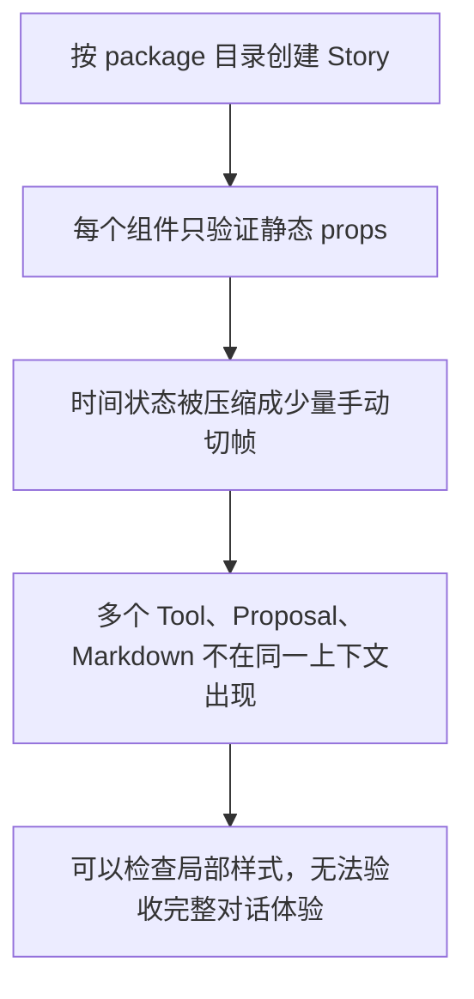
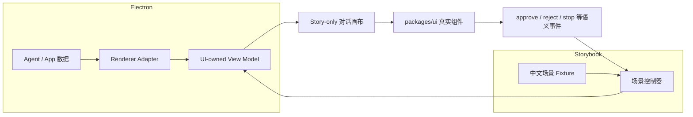
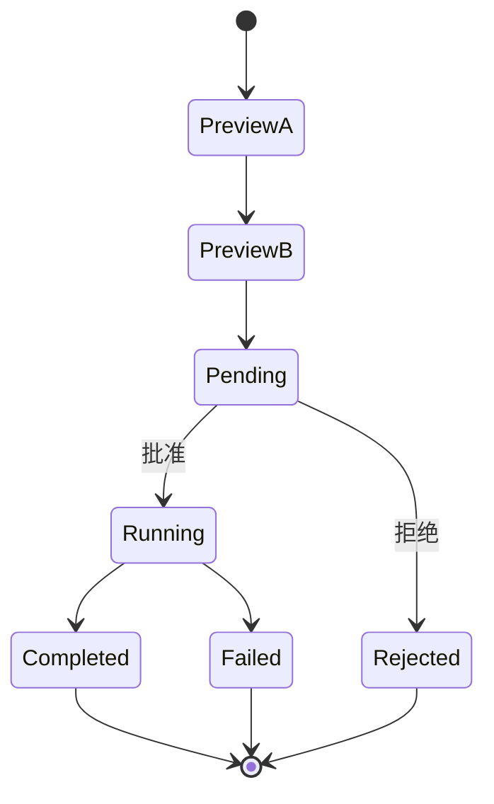

# v1.2.5 Storybook 验收体系设计计划

> 状态：Planned
>
> 日期：2026-07-28
>
> 上位计划：[UI Package 与 Storybook 迁移计划](./ui-package-storybook-migration-plan.md)
>
> 组织逻辑：本文采用**递进型主线**，按“现状问题 → 设计目标 → 信息架构 → 场景与能力矩阵 → 实现边界 → 分阶段落地 → 验收标准”展开。原因是当前问题并非缺少若干孤立 Story，而是 Storybook 的验收模型仍以组件为中心；必须先重新定义它要回答的问题，再设计目录、场景和实现方式。信息架构内部按“完整体验、内容能力、时间状态、边界压力、组件诊断”五种互斥的验收目的做 MECE 划分；场景、Markdown、生命周期和边界章节再分别按用户任务、语义类型、状态机和压力来源组织。

## 1. 核心结论

Storybook 的定位从“`packages/ui` 组件陈列柜”调整为：

> Reflecta 的 UI 验收实验室：优先验收真实对话中的组合体验，再下钻内容能力、时间状态、边界压力和单个组件。

这意味着 Storybook 的默认入口不再是 `ChatMessageRow`、`AgentExecutionBlock` 等组件名称，而是一轮完整对话。单组件 Story 仍然保留，但降级为开发者定位问题时使用的参考索引。

本计划不改变以下既有架构：

- `packages/ui` 继续拥有视觉规则、交互规则和 UI-owned View Model；
- Electron Renderer 继续拥有 route、query、IPC、session 和 screen workflow；
- Storybook 继续位于 `packages/ui`，不新建 App 或 package；
- Storybook 不引用 Electron runtime，也不模拟真实 Pi runtime；
- 各 Module Design 继续定义组件接口，本计划只统一 Storybook 的信息架构、fixture 和验收方式。

如果本文与既有 Module Design 的 Storybook Matrix 在目录或组织方式上冲突，以本文为准；组件 ownership 和 public interface 仍以各 Module Design 为准。

## 2. 现状与根因

### 2.1 当前实现

现有 Storybook 已覆盖七类入口：

| 当前入口                 | 已有能力                                  | 主要缺口                                      |
| ------------------------ | ----------------------------------------- | --------------------------------------------- |
| `Foundation/Reflecta UI` | token、基础组件、Modal、Drawer            | 英文内容；不是主要产品验收入口                |
| `Editor/Markdown Editor` | rich、empty、readonly、preview            | Markdown 语法和编辑器交互覆盖不足             |
| `Chat/Composer`          | empty、editing、running、compacting       | 缺少完整会话上下文和复杂候选/附件场景         |
| `Chat/Markdown`          | entity state、muted、单一 streaming 内容  | 标准语法、复杂组合、残缺流式语法和窄宽度不足  |
| `Chat/Agent Execution`   | 单 Tool、running、failed、简单 lifecycle  | Tool 共享通用 fixture，缺少真实详情和组合密度 |
| `Chat/Agent Proposal`    | Proposal 类型、单向 lifecycle             | 缺少批准、拒绝、失败分支和与对话的衔接        |
| `Chat/Message Row`       | user、assistant、pending、stopped、failed | 只有单行消息，没有完整 Message List 和多 Tool |

现有实现证明了组件可以脱离 Electron 独立运行，但尚未证明这些组件组合成真实产品体验后仍然成立。

### 2.2 根因



根因不是 Story 数量太少，而是分类标准错了：

- 当前导航按“实现是什么”分类，而用户验收关心“使用时发生什么”；
- 当前 Story 把状态当作静态枚举，而 Agent UI 的核心是状态随时间变化；
- 当前 Tool Story 验证类型是否能渲染，却没有验证多个 Tool 叠加后的节奏与密度；
- 当前 Markdown 只展示少量常见语法，没有覆盖 Reflecta 真正容易出问题的组合、流式残缺和窄宽度；
- 当前中英文混用，增加了验收时的认知噪音。

因此，继续在现有目录下追加更多单组件 Story，只会让内容更散，不能解决核心问题。

## 3. 设计目标与完成定义

### 3.1 设计目标

Storybook 需要依次回答五个问题：

1. **完整体验**：一轮真实对话组合起来是否自然？
2. **内容能力**：Markdown、Editor 和实体引用是否完整表达内容？
3. **时间状态**：streaming、确认、拒绝、失败和停止是否按正确顺序呈现？
4. **边界压力**：内容很长、数量很多、空间很窄或数据不完整时是否仍可用？
5. **组件诊断**：发现问题后，能否快速定位到具体组件或 Tool 类型？

这五个问题构成 Storybook 的一级信息架构，顺序不可颠倒：先判断产品体验，再定位能力和状态问题，最后才下钻组件。

### 3.2 完成定义

完成后必须满足：

- 打开 Storybook 后可以直接进入一轮完整的中文 Agent 对话；
- 至少四个核心对话场景覆盖多 Tool、Proposal、失败/停止和 Context compaction；
- 核心场景可以手动逐步、自动播放、批准、拒绝、失败、停止和重置；
- Chat Markdown 覆盖完整语法、复杂组合、流式残缺语法和极端宽度；
- Markdown Editor 覆盖编辑、只读、suggestion、上传和 Preview；
- 每种 active Tool 和 Proposal 类型仍有独立参考 Story；
- 长命令、大量结果、窄宽度、partial/unknown/failed 等边界有集中验收入口；
- Story 标题、名称、场景、控制项和说明全部中文化；
- streaming 更新使用稳定 ID，不因切帧丢失展开、focus 等本地 UI 状态；
- Storybook build、UI tests、Electron tests 和完整 E2E 全部通过。

### 3.3 非目标

本次不做：

- 不复制完整 Electron App、线程侧栏、路由和 Settings；
- 不创建可运行的假 Agent backend；
- 不在 Storybook 中重放 Pi 原始协议事件；
- 不为了 Storybook 新增 public `Conversation` 组件；
- 不给每一种 Markdown 语法建立一个独立 Story；
- 不引入新的状态机或 fixture framework；
- 不在本轮建立截图基线、云端视觉回归服务或 Design Review 平台；
- 不 fork 或 patch Storybook 自身的第三方界面来实现中文化。

## 4. 目标信息架构

### 4.1 一级目录

```text
00 验收入口
10 对话场景
20 内容渲染
30 状态实验室
40 边界与压力
90 组件参考
```

| 一级目录      | 唯一验收目的               | 主要使用者       |
| ------------- | -------------------------- | ---------------- |
| 00 验收入口   | 告诉验收者先看什么         | 产品、设计、开发 |
| 10 对话场景   | 判断真实组合体验是否成立   | 产品、设计、开发 |
| 20 内容渲染   | 判断内容语义和排版是否完整 | 设计、开发       |
| 30 状态实验室 | 判断时间变化和分支是否正确 | 设计、开发、测试 |
| 40 边界与压力 | 判断极端条件下是否仍可用   | 设计、开发、测试 |
| 90 组件参考   | 定位单组件和单 Tool 问题   | 开发             |

一级目录按验收路径排序，不按源码目录排序。使用数字前缀固定认知顺序，并通过 Storybook `storySort` 固定展示顺序。

### 4.2 二级目录

```text
00 验收入口
└── 使用说明

10 对话场景
├── 多工具检索并回答
├── 沉淀 Understanding
├── 失败、中止与恢复
└── 长对话与上下文压缩

20 内容渲染
├── 对话 Markdown
├── 流式 Markdown
├── 实体引用
└── Markdown Editor

30 状态实验室
├── Assistant 回复
├── Reasoning
├── 普通 Tool
├── Proposal
└── Composer 与压缩

40 边界与压力
├── 超长内容
├── 大量项目
├── 窄宽度
└── 不完整与异常数据

90 组件参考
├── Message Row
├── Composer
├── Tool 类型
├── Proposal 类型
├── Editor
└── 基础组件
```

同一 Story 只能有一个主要验收目的。例如，长 Bash 命令属于“边界与压力”，不会因为它也是 Proposal 就复制到状态实验室；Proposal 组件参考只保留正常长度的类型样例。

### 4.3 验收入口

`00 验收入口/使用说明` 提供：

- Storybook 的定位与测试边界；
- 四个核心对话场景的直接入口；
- 推荐验收顺序；
- Light/Dark 和 viewport 的使用说明；
- “发现问题后去哪里定位”的目录指引。

首页不建立状态仪表盘，也不重复列出所有 Story。

## 5. Story 数据与运行架构

### 5.1 生产与 Storybook 使用同一 UI seam



Storybook 从 View Model seam 接入，而不是伪造 Electron IPC 或 Pi 事件。这样 Storybook 验证的是 UI package 的真实 interface，不会复制生产 Adapter。

### 5.2 Story-only 对话画布

新增 package internal 的 Story 支撑代码：

```text
packages/ui/src/storybook/
├── conversation-canvas.tsx
├── scenario-player.tsx
└── fixtures/
    ├── conversations.ts
    ├── markdown.ts
    ├── tools.ts
    └── proposals.ts
```

这些文件：

- 只供 `.stories.tsx` 使用；
- 不通过 `@reflecta/ui` exports 导出；
- 不承担生产 workflow；
- 不持有 raw Agent/tool payload；
- 复用 `ChatMessageRow`、`ChatComposer`、`AgentExecutionBlock` 和 `AgentProposalCard`。

`ConversationCanvas` 只组合完整对话区域：

- 多条 Message Row；
- 当前 Assistant streaming row；
- Composer；
- 可选的场景控制栏。

它不实现线程列表、导航、IPC、toast、clipboard 或文件持久化。

### 5.3 最小场景模型

使用数据驱动的 View Model 快照，不引入状态机依赖：

```ts
type StoryScenarioFrame = {
  id: string;
  label: string;
  rows: readonly ChatMessageRowView[];
  composer: {
    status: ChatComposerStatus;
    canStop: boolean;
  };
  actions?: readonly {
    id: string;
    label: string;
    nextFrameId: string;
  }[];
  defaultNextFrameId?: string;
};

type StoryScenario = {
  id: string;
  title: string;
  initialFrameId: string;
  frames: readonly StoryScenarioFrame[];
};
```

约束：

- 同一个 message、block、tool、proposal 在所有 frame 中保持稳定 ID；
- frame 只描述当前可见快照，不模拟 reducer 或网络时序；
- `actions` 只表达 Story 中需要人工选择的批准、拒绝、失败、停止和重试；
- 自动播放只沿 `defaultNextFrameId` 前进，遇到人工决策时暂停；
- 每个场景必须支持上一步、下一步、自动播放/暂停和重置；
- 场景特有逻辑优先直接写在 Story 中，只有重复后才进入共享 player。

### 5.4 本地 UI 状态

场景切帧时必须保留：

- Tool/Proposal 的展开状态；
- Tool detail 的 full/preview 状态；
- keyboard focus；
- Message Row 的稳定 DOM identity；
- 已触发决策后的按钮禁用状态。

这些行为由稳定 key 和组件测试保障，不能通过每一帧重新挂载整个画布来伪造。

## 6. 核心对话场景

### 6.1 多工具检索并回答

目标：验收多个只读 Tool 连续出现时的节奏、密度和最终 Markdown 的衔接。

场景帧：

1. 用户提出一个需要内部知识和外部信息的问题；
2. Assistant pending；
3. Reasoning streaming；
4. Retrieve Knowledge running；
5. Retrieve Knowledge completed，展示多条结果；
6. Web Search running；
7. Web Search completed，展示来源列表；
8. Fetch Content running；
9. Fetch Content completed；
10. Assistant Markdown streaming；
11. Assistant done。

验收点：

- Tool 顺序清楚，但不压过最终回答；
- running → completed 不产生布局跳动；
- 多个 Tool 折叠后的垂直密度可接受；
- 展开其中一个 Tool 后，其他 Tool 和最终回答仍可阅读；
- 最终 Markdown 中的引用、列表、表格和代码不受前置 Tool 影响；
- Light/Dark 和标准对话宽度均成立。

### 6.2 沉淀 Understanding

目标：验收“用户是大脑，AI 是辅助”的确认流程，确保 Proposal 只是候选，用户决定后才执行。

场景帧：

1. 用户要求把对话中的理解沉淀下来；
2. Agent 读取相关 Understanding 和 Context；
3. Proposal partial preview A；
4. Proposal later preview B；
5. final pending；
6. 等待用户批准或拒绝。

批准分支：

7. running；
8. completed；
9. Assistant 说明已完成的操作。

拒绝分支：

7. rejected；
8. Assistant 接受决定并给出可继续讨论的建议。

验收点：

- partial preview 不出现无意义空字段；
- preview → pending 保持同一 Proposal identity；
- 只有 pending 显示可操作按钮；
- 点击一次后立即禁用重复决策；
- approved、rejected 不会被后续旧快照降级；
- Proposal 结束后，最终回复能自然收束，而不是视觉上悬空。

### 6.3 失败、中止与恢复

目标：验收非理想路径，而不是只展示成功状态。

包含两个可重置分支：

- Tool running → failed → Assistant failed → 用户重试 → 新回复完成；
- Assistant streaming → 用户停止 → stopped → 用户继续发送下一条消息。

验收点：

- 失败信息清楚但不过度抢占注意力；
- stopped 与 failed 的视觉语义不同；
- 已经输出的内容在停止后保留；
- 用户可以继续输入，而不是停留在不可操作状态；
- 新一轮消息与失败/停止的上一轮有清楚边界。

### 6.4 长对话与上下文压缩

目标：验收多轮历史、Context compaction 和继续对话时的整体密度。

场景帧：

1. 展示多轮用户与 Assistant 消息；
2. Composer 显示高 Context usage；
3. compacting；
4. Context compaction completed；
5. 用户继续提问；
6. Assistant 正常回复。

验收点：

- 压缩块是过程说明，不被误认为普通 Tool；
- token 数据完整和不完整时均不展示虚假数字；
- 长摘要换行稳定；
- 压缩完成后 Composer 恢复可用；
- 历史 Tool 与新回复之间仍有清楚层次。

## 7. 内容渲染矩阵

### 7.1 对话 Markdown：完整排版文档

建立一个完整但结构清晰的中文文档，覆盖：

| 语义类别 | 必须覆盖的内容                                            |
| -------- | --------------------------------------------------------- |
| 结构     | h1-h6、段落、软换行、硬换行、分割线                       |
| 行内     | strong、em、strike、inline code、普通 link、长 URL        |
| 列表     | ordered、unordered、nested、task list、长列表项           |
| 引用     | blockquote、nested blockquote、引用内列表和代码           |
| 代码     | fenced code、语言标签、无语言标签、超长行、多行输出       |
| 表格     | 常规表格、长单元格、多列、窄 viewport 横向处理            |
| 富内容   | image、KaTeX、Mermaid                                     |
| Reflecta | Understanding、Context、Domain 引用，与普通 Markdown 混排 |
| 空内容   | 空字符串、纯空白                                          |
| 文本     | 超长中文、英文与中文混排、标点和 emoji                    |

这一个 Story 验收整体 typography 和垂直节奏，不为每种语法建立独立导航项。

### 7.2 流式 Markdown

使用可逐帧播放的同一段回复覆盖：

- 未闭合 strong/em；
- 未闭合 inline code；
- 未闭合 fenced code；
- 表格 header 尚未完成；
- link label/href 尚未完成；
- entity reference 尚未完成；
- Mermaid/KaTeX 尚未闭合；
- 最终语法闭合后的稳定渲染。

验收点：

- 中间帧不抛错、不清空、不闪烁；
- 旧内容不会因为新 token 到达而重新挂载；
- 最终完成后不残留 loading 或错误结构；
- streaming 和 done 的字体、间距不会突然变化。

### 7.3 实体引用

集中覆盖：

- Understanding、Context、Domain；
- ready interactive；
- ready non-interactive；
- loading；
- unavailable；
- error；
- labelHint fallback；
- title 更新后的 rerender；
- malformed、escaped、inline code、fenced code；
- 普通 Markdown link 与 entity reference 混合；
- 超长 label 和超长 ID。

### 7.4 Markdown Editor

分成四个 Story：

1. **完整编辑文档**：heading、list、table、code、link、image、video、Wiki Link；
2. **Suggestion 与上传**：loading、empty、results、error、keyboard select/cancel、上传成功/失败；
3. **只读与预览**：MarkdownPreview、image zoom、Wiki Link click、空文档；
4. **Simple Preview**：单行、多行 clamp、语法移除、Wiki Link label、image/link alt。

Editor 与 Chat Markdown 不强求相同 implementation；只分别验收各自明确的内容语义。

## 8. 状态实验室

状态实验室只回答“时间和分支是否正确”，使用正常长度的内容，不混入压力测试。

### 8.1 Assistant 回复

```text
pending
  -> streaming
  -> done
  -> stopped
  -> failed
```

Story 需要支持：

- 空 pending；
- 首个 text delta；
- 多个 text delta；
- mixed block sequence；
- stop；
- failure；
- final turn replacement。

### 8.2 Reasoning

覆盖：

- streaming empty；
- streaming with Markdown；
- done；
- reasoning 后接 Tool；
- reasoning 后直接接最终回答。

### 8.3 普通 Tool

覆盖：

```text
running -> completed
running -> failed
```

并验证：

- single/multiple items；
- partial success + group failure；
- details 与 error 同时存在；
- streaming 更新时手动展开状态保留。

至少选择 Read、Safe Bash、Retrieve Knowledge、Web Search 演示 running → completed；选择一个 visual family 演示 running → failed。

### 8.4 Proposal

覆盖完整状态图：



验收：

- partial preview 可安全显示；
- pending 才出现批准/拒绝；
- decision 后按钮不可重复操作；
- completed、rejected、failed 都是稳定终态；
- collapse state 在 preview 更新中保留。

### 8.5 Composer 与压缩

覆盖：

- idle；
- editing；
- running + stop；
- compacting；
- attachment adding/error；
- entity suggestion loading/empty/results/error；
- model/reasoning option 切换；
- Context usage 低、中、高。

## 9. 边界与压力矩阵

边界按压力来源分成四类，同一案例只进入一个主要分类。

### 9.1 超长内容

- 超长 Bash command；
- 超长 cwd、filename、path、URL；
- 单行超长代码和终端输出；
- 超长 Tool summary；
- 超长 Proposal before/after/reason；
- 超长中文 Markdown；
- 超长 entity label。

验收：

- 单行 summary 正确 truncate；
- 需要保真的 command/code 使用横向滚动或换行策略；
- 不撑破对话宽度；
- copy、expand、approve/reject 仍然可操作。

### 9.2 大量项目

- Tool Activity 30 个 items；
- retrieve/search 30 条 rows；
- entity suggestion 50 个候选；
- model/reasoning 下拉包含大量项目；
- 用户消息包含多个 entity 和 attachment；
- 一轮 Assistant 回复包含大量连续 Tool。

验收：

- 列表仍可扫描；
- 容器滚动边界清楚；
- 关键操作不会被挤出可视区域；
- 折叠后的页面高度仍可接受；
- 不为测试数据量引入生产分页逻辑。

### 9.3 窄宽度

所有核心视觉至少在以下宽度验收：

- 320px；
- 640px；
- 标准 conversation width；
- 宽屏。

重点检查：

- Tool summary、状态和 Chevron 是否互相挤压；
- Proposal 操作按钮是否换行；
- table、code、command 是否正确处理横向空间；
- entity、attachment 和 Composer toolbar 是否溢出；
- focus ring 是否被容器裁剪。

### 9.4 不完整与异常数据

- Tool 无 details；
- Tool meta only / rows only；
- partial successful details + item error；
- Proposal partial preview 缺少字段；
- unknown Tool / unknown Proposal；
- entity label 缺失、loading、unavailable、error；
- Context compaction 缺少 token estimate；
- 空 result、空 Markdown、纯空白；
- 超长 error message；
- image/file preview 不可用。

验收原则：安全降级、保留可理解语义，不显示伪造信息，也不暴露 raw DTO 或协议字段。

## 10. 组件参考矩阵

### 10.1 每种 active Tool

保留独立 Story：

- Read；
- Edit；
- Write；
- Safe Bash；
- Domain List；
- Domain Inspect；
- Understanding List；
- Understanding Get；
- Context List；
- Context Get；
- Attachment Read；
- Retrieve Knowledge；
- Graph；
- Web Search；
- Fetch Content；
- Get Search Content；
- Legacy Search；
- Unknown Tool。

每个 Story 使用符合该 Tool 语义的 fixture，不再全部复用同一个通用 details。视觉结构相同的 Tool 仍复用生产 internal renderer，不为 Story 创建额外 public component。

### 10.2 每种 Proposal

保留独立 Story：

- Understanding Create / Update / Delete；
- Domain Create / Update / Delete；
- Context Create / Update / Delete；
- dangerous Bash；
- Unknown fallback。

类型参考只展示正常 pending 内容；生命周期和超长内容分别进入状态实验室、边界与压力。

### 10.3 其他组件

- User / Assistant Message Row；
- Chat Composer；
- Chat Markdown；
- Markdown Editor / Preview / Simple Preview；
- token、Button、Input、Modal、Drawer 等 Foundation。

组件参考默认使用正常、短小、稳定的中文 fixture。

## 11. 中文化规则

### 11.1 必须中文化

- Storybook 一级、二级目录；
- Story export 的展示名称；
- 场景标题、说明和验收提示；
- fixture 中的用户问题和 Assistant 回复；
- 控制栏、按钮、状态辅助文案；
- Controls 的 label 和 description；
- Story Docs 的描述；
- 可由 Reflecta 控制的错误、空状态和 placeholder。

### 11.2 保留原文

- `Understanding`、`Context`、`Domain` 等正式产品术语；
- Tool 名称；
- 文件名、路径、命令、代码和 API field；
- 第三方库和模型名称。

### 11.3 Storybook 自身界面

优先使用 Storybook 官方配置支持的 locale；如果当前版本没有稳定的官方能力，则保留第三方 Manager chrome 原文，不 fork、不注入脆弱补丁。Reflecta 自己控制的导航和内容仍必须全部中文化。

## 12. 现有 Story 的迁移

| 当前 Story 文件                     | 目标归属                                        | 处理方式                         |
| ----------------------------------- | ----------------------------------------------- | -------------------------------- |
| `foundation.stories.tsx`            | `90 组件参考/基础组件`                          | 中文化并保留                     |
| `markdown-editor.stories.tsx`       | `20 内容渲染/Markdown Editor`、`90 组件参考`    | 拆分能力 Story 与组件参考        |
| `chat-composer.stories.tsx`         | `30 状态实验室/Composer`、`90 组件参考`         | 中文化，补交互状态               |
| `chat-markdown.stories.tsx`         | `20 内容渲染`                                   | 用完整内容矩阵重写               |
| `agent-execution-block.stories.tsx` | `30 状态实验室`、`40 边界与压力`、`90 组件参考` | 拆分状态、压力、类型参考         |
| `agent-proposal-card.stories.tsx`   | `30 状态实验室`、`40 边界与压力`、`90 组件参考` | 补批准/拒绝/失败分支             |
| `chat-message-row.stories.tsx`      | `10 对话场景`、`30 状态实验室`、`90 组件参考`   | 单行 Story 保留，组合 Story 上移 |

具体删除：

- 删除不能表达真实语义的通用 Tool details fixture；
- 删除 `ActiveTools` 这种脱离对话、单纯垂直堆叠所有 Tool 的 Story；
- 删除被统一状态实验室完整覆盖的重复单向切帧 Story；
- 不删除每个 active Tool 和 Proposal 类型的独立参考 Story。

## 13. 测试职责

| 层级               | 负责验证                                                | 不负责验证                   |
| ------------------ | ------------------------------------------------------- | ---------------------------- |
| Storybook 手工验收 | 组合体验、视觉节奏、状态变化、边界可用性、Light/Dark    | reducer、IPC、数据库         |
| UI unit/component  | parser、callback、DOM identity、collapse 保留、安全降级 | 完整 Electron workflow       |
| Electron tests     | raw payload → View Model、session/reducer、Adapter      | 纯视觉细节                   |
| E2E                | 真实 App 中发送、streaming、批准/拒绝、停止和恢复       | 每种 Markdown 语法的视觉矩阵 |

本轮优先使用现有 Vitest 和 Story 内部 `useState`/fixture，不新增 Storybook test addon。只有当手工状态矩阵稳定、并且确实需要自动浏览器交互断言时，再单独评估。

## 14. 分阶段实施

### Phase 1：导航与中文基线

工作：

- 配置 `storySort`；
- 建立六个一级目录；
- 将现有 Story title/name/fixture 中文化；
- 新增 `00 验收入口/使用说明`；
- 将现有 Story 移到目标目录，但暂不补全部内容。

出口：

- Storybook 导航完全按新信息架构展示；
- Reflecta 可控内容全部中文；
- 原 Story 功能没有丢失；
- Storybook build 通过。

### Phase 2：场景支撑层

工作：

- 实现 `ConversationCanvas`；
- 实现最小 `ScenarioPlayer`；
- 建立共享中文 fixture；
- 验证稳定 ID、逐帧更新、自动播放和人工分支；
- 补充 collapse/DOM identity component tests。

出口：

- 一个 smoke 场景可逐帧运行；
- approve/reject 分支可操作；
- 切帧不重挂载同一 Message/Tool/Proposal；
- Story 支撑代码没有进入 public exports。

### Phase 3：完整对话场景

依次实现：

1. 多工具检索并回答；
2. 沉淀 Understanding；
3. 失败、中止与恢复；
4. 长对话与上下文压缩。

出口：

- 四个场景均可逐步、自动播放和重置；
- 人工决策场景支持批准与拒绝；
- standard width、Light/Dark 下通过人工验收；
- 相关 UI tests 通过。

### Phase 4：内容渲染

工作：

- 重写 Chat Markdown 完整排版 fixture；
- 实现流式残缺语法序列；
- 补齐实体引用状态；
- 补齐 Markdown Editor、Preview、Simple Preview；
- 增加 320px、table、code、Mermaid、KaTeX 验收。

出口：

- 第 7 章矩阵无缺项；
- streaming 中间帧无异常；
- Editor 与 Preview 交互可用；
- 相关 package tests 通过。

### Phase 5：状态与边界

工作：

- 实现 Assistant、Reasoning、Tool、Proposal、Composer 状态实验室；
- 实现长度、数量、宽度、不完整数据四类压力场景；
- 为每种 active Tool 和 Proposal 建立真实语义 fixture；
- 删除被新体系替代的重复 Story。

出口：

- 第 8、9、10 章矩阵无缺项；
- Tool/Proposal 状态分支完整；
- 320px 和大量项目场景可用；
- Storybook 中不再存在通用假 Tool details。

### Phase 6：全局验收与收口

工作：

- 按“入口 → 场景 → 内容 → 状态 → 边界 → 组件”完整走查；
- 检查所有 Story 名称、说明和 fixture 的语言；
- 运行 format、lint、typecheck、UI tests；
- 构建 Storybook；
- 运行所有 workspace tests、build 和完整 Electron E2E；
- 删除死 fixture、旧 Story 和无用 dependency；
- 更新本计划状态。

出口：

- 第 15 章完成清单全部通过；
- 没有孤立、重复或只有实现意义的 Story；
- 全量测试通过后提交。

## 15. 最终验收清单

### 信息架构

- [ ] 默认入口是验收说明和完整对话，而不是组件目录；
- [ ] 六个一级目录按固定顺序展示；
- [ ] 每个 Story 只有一个明确的主要验收目的；
- [ ] 单组件 Story 全部位于 `90 组件参考`。

### 完整场景

- [ ] 多工具检索并回答；
- [ ] 沉淀 Understanding，包含批准和拒绝；
- [ ] 失败、中止与恢复；
- [ ] 长对话与上下文压缩；
- [ ] 场景支持逐步、自动播放、暂停和重置；
- [ ] 相同 block 在 streaming frame 中保持稳定 identity。

### 内容能力

- [ ] Chat Markdown 完整语法；
- [ ] streaming 残缺语法；
- [ ] 实体引用全部状态；
- [ ] Markdown Editor、Preview 和 Simple Preview；
- [ ] Light/Dark、320px、conversation width；
- [ ] 长表格、长代码、Mermaid、KaTeX。

### 状态与边界

- [ ] Assistant pending/streaming/done/stopped/failed；
- [ ] Tool running/completed/failed；
- [ ] Proposal preview/pending/running/completed/rejected/failed；
- [ ] Composer idle/editing/running/compacting；
- [ ] 超长内容、大量项目、窄宽度、不完整数据；
- [ ] 每种 active Tool 和 Proposal 类型有真实语义参考 Story。

### 中文化

- [ ] 导航、Story 名称、fixture、按钮、Controls 和说明为中文；
- [ ] 产品正式术语、代码和 Tool 名称保留原文；
- [ ] 不通过 patch 第三方 Storybook 界面实现中文化。

### 工程验证

- [ ] Storybook 不引用 Electron runtime；
- [ ] Story 支撑代码不进入 public exports；
- [ ] format、lint、typecheck 通过；
- [ ] UI unit/component tests 通过；
- [ ] Storybook build 通过；
- [ ] 全 workspace tests/build 通过；
- [ ] 完整 Electron E2E 通过；
- [ ] 全部变更按 Angular Commit Convention 提交。
