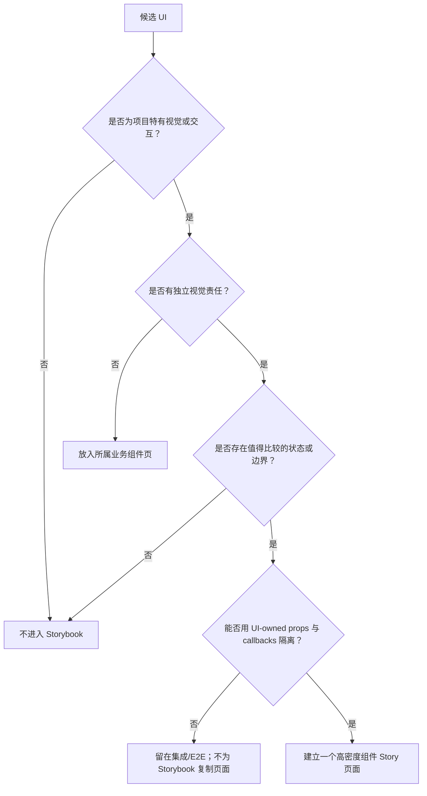

# Storybook 组件验收设计方案

> 状态：Implemented，已按本方案完成并通过非 E2E 全量验证
>
> 日期：2026-07-29
>
> 范围：`packages/ui` 与 Renderer 中可形成 UI-owned seam 的项目特有组件
>
> 本文替代本文件此前的 Storybook 组织方案

## 0. 组织逻辑

本文采用“结论先行 → 准入规则 → 全量审计 → 单组件 Case 矩阵 → 组合场景 → 实施与验收”的结构。

原因是这次需要先纠正 Storybook 的验收单元，再决定导航中有哪些组件，最后才能讨论每个页面放哪些 Case。若从现有 Story 文件或代码目录出发，很容易再次把代码模块、内部实现、产品页面和组件验收混为一谈。

设计遵循一个减法原则：

> Storybook 不展示“项目里有什么 React 组件”，只展示“哪些项目特有 UI 契约值得被人反复比较和验收”。

## 1. 核心结论

### 1.1 Storybook 的验收单元是组件，不是代码模块

之前把 `MarkdownEditor`、`MarkdownPreview` 和 `SimpleMarkdownPreview` 合并成一个 Markdown Module，是本轮设计中的根本错误。

三者虽然共享 Milkdown 或 Markdown 处理逻辑，但承担不同的视觉责任，也被生产代码独立消费：

| 组件                    | 独立责任                                   | 结论            |
| ----------------------- | ------------------------------------------ | --------------- |
| `MarkdownEditor`        | 可编辑正文、上传、Wiki Link、受控状态      | 独立 Story 页面 |
| `MarkdownPreview`       | 完整只读渲染、Wiki Link 打开、图片缩放     | 独立 Story 页面 |
| `SimpleMarkdownPreview` | 列表与摘要场景的降噪、行数限制和文本截断   | 独立 Story 页面 |
| `ChatMarkdown`          | Agent 消息中的流式 Markdown 与扩展语法渲染 | 独立 Story 页面 |

代码是否放在同一目录、是否共享依赖、是否属于同一产品区域，都不能替代独立视觉契约的判断。

### 1.2 一个业务组件只保留一个高信息密度页面

每个入选组件在 Storybook 导航中只占一个页面。页面内部用标题和 Divider 分成多个 Section，并排展示正常、异常、生命周期、交互和边界状态。

不再把 Default、Loading、Error、Long Content 等状态拆成大量侧栏 Story。侧栏负责选择组件，页面负责看完整状态空间。

### 1.3 最终保留 13 个组件页和 2 个组合页

#### Capture

1. Markdown Editor
2. Markdown Preview
3. Markdown 摘要预览
4. Domain Tree
5. Domain Tree Select
6. Understanding Row
7. 组合场景 / 知识整理核心组合

#### Agent

1. Composer
2. Markdown
3. Message
4. Tool
5. Thread Sidebar
6. Message Jump Nav
7. 组合场景 / Agent 任务过程

#### Knowledge Wander

1. Knowledge Graph

其中 13 个具名组件是独立验收页，两个“组合场景”只用于验收组件叠加后的密度、节奏和层级，不复制完整产品页面。

### 1.4 明确不进入 Storybook 的内容

- shadcn 基础组件及其简单组合；
- Settings、DomainForm、普通 List/Detail、Context preview/detail；
- 页面、路由、IPC、query、store、持久化和完整业务工作流；
- 纯 parser、adapter、selector、formatter、tree transform；
- 已被父级业务组件完整覆盖的内部渲染器；
- 仅因“已经 export”或“实现较复杂”而想加入的组件。

## 2. 准入规则

### 2.1 四项价值判断

组件至少满足以下前三项中的两项，并且通过第四项，才值得拥有独立 Story 页面：

1. **项目特有视觉**：不是 shadcn 默认样式或普通表单布局；
2. **项目特有交互**：存在拖拽、流式更新、富文本、图谱、复杂选择或渐进展开等交互；
3. **丰富状态或高风险边界**：状态变化会显著影响布局、层级或用户判断；
4. **可形成小而清晰的 UI interface**：无需带入 Router、IPC、query、store 或整页 runtime。

第四项是必要条件。一个 UI 很特别，但只能通过复制产品页面才能展示，说明当前还不是合格的独立组件 seam。

### 2.2 删除测试

对每个候选组件问三个问题：

1. 删除它的 Story 后，是否会失去一种重要的视觉或交互验收能力？
2. 这些风险是否已被另一个组件页完整覆盖？
3. 它是否只是标准组件的业务排列，真正风险属于 E2E？

若第一题为“否”，或第二、三题任一为“是”，则不建立独立 Story。

### 2.3 判断流程



## 3. 全量组件审计

### 3.1 独立组件页

| 区域             | 组件                    | 入选理由                                                          | 当前情况                    |
| ---------------- | ----------------------- | ----------------------------------------------------------------- | --------------------------- |
| Capture          | `MarkdownEditor`        | 富文本编辑、上传、Wiki Link、只读和受控更新均有独特交互           | 已有 Story，需重构 Case     |
| Capture          | `MarkdownPreview`       | 完整只读正文、图片缩放和 Wiki Link 是独立视觉契约                 | 漏项，需新增独立 Story      |
| Capture          | `SimpleMarkdownPreview` | 摘要降噪、行数限制和截断直接影响列表/详情可读性                   | 漏项，需新增独立 Story      |
| Capture          | `DomainTree`            | 层级、选择、hover、菜单、拖拽和窄宽度均为高风险交互               | 已有 Story，需补状态关系    |
| Capture          | `DomainTreeSelect`      | 单/多选、路径、异步状态、排除节点和候选规模形成独立选择契约       | 已有 Story，需提高信息密度  |
| Capture          | `UnderstandingRow`      | 项目特有行样式、选中/hover、Markdown 摘要、菜单和截断值得集中比较 | 已有 Story，需补截断矩阵    |
| Agent            | `ChatComposer`          | Entity、附件、模型、上下文、运行状态和提交恢复形成复杂输入契约    | 已有 Story，需重构 Case     |
| Agent            | `ChatMarkdown`          | Streamdown、流式不完整语法、Mermaid、数学公式和 Entity 渲染风险高 | 已有 Story，需重构 Case     |
| Agent            | `ChatMessageRow`        | 用户/Assistant、生命周期、操作、搜索高亮和附件共同决定消息呈现    | 已有 Story，需重构 Case     |
| Agent            | `Tool`                  | Tool/Proposal 是同一用户心智；类型多、生命周期丰富、需真实交互    | 已有 Story，需按生产语义改  |
| Agent            | `ThreadSidebar`         | 分组、选中、运行、标题生成、菜单、滚动和长标题形成独特导航交互    | Renderer 中，需先拆 UI seam |
| Agent            | `ChatJumpNav`           | 收起标记、hover/focus 展开、当前项和长列表滚动是项目特有交互      | Renderer 内部，需先抽组件   |
| Knowledge Wander | `KnowledgeGraph`        | 图布局、选择、邻接关系、缩放、尺寸变化和大数据量具有明显视觉风险  | 已有 Story，需重构 Case     |

### 3.2 放在所属业务组件页，不单独占导航

| 内部实现                     | 所属页面        | 原因                                                   |
| ---------------------------- | --------------- | ------------------------------------------------------ |
| `ChatContextPicker`          | Composer        | 只服务 Composer 的 Entity 联想生命周期                 |
| Wiki Link suggestion         | Markdown Editor | 只服务编辑器中的 Wiki Link 输入交互                    |
| `AgentMessageView`           | Message         | 是 Assistant 消息内部渲染层，没有独立生产使用心智      |
| `AgentExecutionBlock`        | Message / Tool  | 既承载消息 block，也承载 Tool activity；风险由两页覆盖 |
| `AgentPendingBlock`          | Message         | 等待态内部实现，单独信息量过低                         |
| `AgentProposalCard`          | Tool            | 用户把它理解为需要确认的 Tool，不应另建 Proposal 导航  |
| `ToolDetails`                | Tool            | Tool 卡片内部详情渲染器                                |
| Chat search highlight        | Message         | 只在消息搜索语境中成立                                 |
| Knowledge Graph 内部控制元素 | Knowledge Graph | 不存在脱离图谱的独立使用价值                           |

“没有独立导航”不等于“不验收”。它们的状态必须出现在所属页面的 Section 中。

### 3.3 不进入 Storybook

| 候选内容                                                      | 结论 | 理由                                                                          |
| ------------------------------------------------------------- | ---- | ----------------------------------------------------------------------------- |
| `UnderstandingList`                                           | 排除 | 搜索、排序、虚拟列表主要是页面数据和工作流；`UnderstandingRow` 已覆盖视觉核心 |
| `UnderstandingDetail`                                         | 排除 | 标准布局与编辑器组合，独立视觉风险主要属于 Editor/Preview                     |
| `ContextPreviewDrawerContent`、Context preview/detail         | 排除 | 标准组件组合，状态有限，ROI 低                                                |
| Settings sections/dialog                                      | 排除 | 标准表单、Tab 和 Dialog 组合                                                  |
| `CreateDomainModal` / DomainForm                              | 排除 | 标准表单组合，业务验证更适合 unit/E2E                                         |
| `ThreadFindBox`                                               | 排除 | 风险集中在 DOM 搜索、IME 和页面协调，Story 无法替代集成测试                   |
| `AgentThreadHeader`、`ThreadActionMenuItems`                  | 排除 | 普通输入/菜单组合；通过 Message、Sidebar 和 E2E 足够                          |
| `MessageList`                                                 | 排除 | 负责滚动、observer 和消息编排；视觉由 Message 与组合页覆盖                    |
| `AgentThreadPanel`、Agent 页面                                | 排除 | 产品页面与 runtime 容器，不是组件验收单元                                     |
| `ContextualAgentDock`、`ContextInspector`                     | 排除 | Router/query/store 与产品流程耦合；不为 Storybook 复制 runtime                |
| Capture 页面、Knowledge Wander workspace                      | 排除 | 页面布局与业务 wiring；图谱本身已有独立组件页                                 |
| Drawer/Modal/Theme Provider、AppLayout、AppChrome             | 排除 | UI 基础设施或应用外壳                                                         |
| shadcn `components/*`                                         | 排除 | 上游基础组件，不维护项目内 gallery                                            |
| `getMarkdownPreviewText`、tree utils、graph state、adapter 等 | 排除 | 纯逻辑由 unit test 验证                                                       |

## 4. 单个组件页的统一结构

### 4.1 页面骨架

每个组件页采用相同的低噪音结构：

```text
组件名称
一句话说明本页要验收的视觉契约

Section 标题
必要时的一句说明
并排或纵向的组件实例

──────────────── Divider ────────────────

下一个 Section
```

约束：

- Section 之间只用标题与 Divider 分隔；
- 不给 Showcase、Section、Case 层层套卡片；
- 只有组件本身是卡片时才出现卡片边框；
- 同一 Section 内用短标签标识对比项；
- 能并排比较的状态不要求用户频繁点击或切换；
- 交互 Case 直接可操作，并提供局部“重置”；
- Controls 只用于探索，不是完成验收的必经路径。

### 4.2 Section 不是固定模板

设计 Case 时从以下五类视觉契约中选择，不要求每个组件机械覆盖全部分类：

1. 基线：最常见生产内容；
2. 变体：会改变语义或视觉结构的 props；
3. 生命周期与交互：组件自己拥有的状态变化；
4. 内容与几何边界：长、空、多、窄、深、溢出；
5. 最小组合语境：孤立时确实无法判断的相邻组件关系。

不要创建 `Normal / Loading / Error / Edge Case` 的空泛模板。每个 Section 名称应直接表达要判断的具体问题。

### 4.3 Fixture 规则

- 使用生产组件、生产 View Model 和生产 adapter；
- Tool fixture 参考生产数据的字段、长度、嵌套和内容密度；
- fixture 内容必须脱敏，使用语义和长度相似但事实完全虚构的数据；
- 禁止为 Story 自造一套 Tool type 或渲染器；
- 图片等资源使用稳定本地 fixture，避免远程随机资源导致验收漂移；
- 时间、随机数、网络和自动播放都必须可重复；
- streaming 自动推进且保持相同 React identity，不用“下一帧”按钮模拟。

## 5. Capture 组件 Case 设计

### 5.1 Markdown Editor

验收目标：编辑器的编辑能力、插件交互、受控状态和复杂内容布局。

| Section          | 展示内容                                                             |
| ---------------- | -------------------------------------------------------------------- |
| 基础编辑         | 标题、段落、强调、列表、引用、表格、代码块、Wiki Link 的典型生产正文 |
| 空白与尺寸       | placeholder；固定高度；`height="auto"`；最大高度与内部滚动           |
| 只读模式         | 同一份文档的 read-only 状态；用于验收编辑器只读能力，不替代 Preview  |
| Wiki Link 联想   | loading、empty、ready、error；键盘移动/确认、鼠标选择、长标题        |
| 图片与视频上传   | 成功、失败、粘贴、拖放、多文件、长文件名                             |
| 受控更新         | 外部替换 value、切换 `documentId`、编辑后父级回写，不丢本地 identity |
| 复杂内容与窄容器 | 长代码、宽表格、长链接、深层列表、大文档、窄宽度                     |

不做：

- 不把所有 Markdown 语法堆成一张超长截图；
- 不在该页承担 `MarkdownPreview` 或 `SimpleMarkdownPreview` 的验收；
- 不模拟产品保存、query 或持久化。

### 5.2 Markdown Preview

验收目标：完整 Markdown 文档作为只读内容时的排版、链接和媒体行为。

| Section          | 展示内容                                                     |
| ---------------- | ------------------------------------------------------------ |
| 完整正文         | 标题层级、文字样式、列表、引用、表格、代码、分隔线、混合嵌套 |
| Wiki Link        | 可打开、未提供 handler、长标题；点击后在页面内显示捕获结果   |
| 图片             | 开启/关闭 zoom；单图、多图、横图、竖图；使用稳定本地图片     |
| 空与最小正文     | 空字符串、仅空白、单段、单个 Wiki Link                       |
| 复杂内容与窄容器 | 宽表格、长代码、长 URL、大图和窄宽度下的 overflow            |

该页与 Editor 使用相同代表性 fixture 便于比较，但只验收只读呈现，不加入编辑工具栏或上传交互。

### 5.3 Markdown 摘要预览

对应组件：`SimpleMarkdownPreview`。

验收目标：Markdown 被压缩为列表/摘要文本后，信息是否可读且不会破坏布局。

| Section          | 展示内容                                                                  |
| ---------------- | ------------------------------------------------------------------------- |
| Markdown 降噪    | 普通文本、标题、强调、列表、引用、链接、图片、代码和 Wiki Link 的摘要结果 |
| 行数限制         | 同一内容并排展示不限行、1 行、2 行、3 行                                  |
| 生产宽度         | `UnderstandingRow` 宽度、详情摘要宽度、弹性容器宽度                       |
| 空内容与异常文本 | 空、仅空白、仅标记、连续超长字符串、多段中英文、Emoji                     |
| 截断组合         | 长标题语义、长链接文本、多段正文与窄容器，确认文字不越界且尾部处理一致    |

精确的 Markdown 符号移除和文本转换属于 `getMarkdownPreviewText` 的 unit test；Storybook 只判断最终排版与可读性。

### 5.4 Domain Tree

验收目标：树的层级、选择、hover、拖拽和菜单在复杂内容下仍保持正确关系。

| Section           | 展示内容                                                           |
| ----------------- | ------------------------------------------------------------------ |
| 层级与选择        | 全部领域、顶级节点、深层节点的选中态；展开与折叠可直接操作         |
| 选择与 hover 关系 | 子节点选中时 hover 父节点、兄弟节点和选中节点，防止祖先 hover 丢失 |
| 节点操作          | 可聊天/不可聊天；新增、重命名、删除等实际菜单项和 disabled 状态    |
| 拖拽排序          | 同层排序、不可放置目标、拖拽 overlay；覆盖鼠标与键盘入口           |
| 空状态            | 无领域和自定义 empty text；异步状态不属于该组件，不在此伪造        |
| 几何边界          | 深层级、多个顶级节点、超长名称、窄容器、固定高度滚动               |

### 5.5 Domain Tree Select

验收目标：领域选择在模式、路径、候选状态和极端尺寸下保持清晰。

| Section        | 展示内容                                              |
| -------------- | ----------------------------------------------------- |
| 选择模式       | 单选与多选并排；默认值、选择、删除和清空              |
| 展示方式       | 默认/inline、显示完整路径/只显示名称、fluid/固定宽度  |
| 键盘与鼠标     | 打开、搜索、方向键、确认、移除 tag、关闭              |
| 排除与禁用     | excluded node、disabled、不可选父节点或真实支持的限制 |
| 候选生命周期   | loading、empty、error、ready                          |
| 候选与容器边界 | 深路径、长名称、大量候选、多个已选项、窄容器          |

### 5.6 Understanding Row

验收目标：列表行在选择、操作、内容差异和约束宽度下维持稳定的信息层级。

| Section        | 展示内容                                                           |
| -------------- | ------------------------------------------------------------------ |
| 基础与选择     | default、hover、focus、selected；并排比较而非依赖鼠标记忆          |
| 内容密度       | 有/无摘要；关联和字数为 0/非 0；短/长更新时间                      |
| 行操作         | 菜单可用、部分禁用、右键入口、聊天入口存在/不存在                  |
| 标题与摘要截断 | 长标题、长更新时间、长 Markdown 摘要、连续英文、窄容器             |
| 组合边界       | selected + long content、hover ancestor layout、菜单打开时的行状态 |

## 6. Agent 组件 Case 设计

### 6.1 Composer

验收目标：输入、Entity、附件、模型和运行状态在同一个输入区域中不会互相挤压或失去反馈。

| Section      | 展示内容                                                          |
| ------------ | ----------------------------------------------------------------- |
| 基础输入     | 空白、已输入、多行输入、初始 Entity                               |
| 编辑历史消息 | 进入编辑、修改、取消；原内容和 Entity 正确恢复                    |
| Entity 联想  | loading、ready、empty、error；键盘选择；长名称与大量候选          |
| 附件         | 图片、普通文件、混合多文件、删除、上传失败、超限、长文件名        |
| 运行状态     | idle、running、compacting；提交、停止、禁用和状态反馈             |
| 模型与上下文 | 模型、reasoning、context usage 的典型和临界值；长模型名、大量选项 |
| 提交失败恢复 | 提交后失败时恢复 draft、附件和 Entity，不使用 alert               |
| 几何边界     | 超长输入、8 个附件、长模型名、高 context usage、窄容器            |

### 6.2 Markdown

对应组件：`ChatMarkdown`。

验收目标：Agent 输出中的完整语法、扩展语法和流式半成品都能稳定呈现。

用户提供的 Markdown 全语法文档作为 fixture 来源，但不作为一个 6900px 高的单体 Case。它应按以下验收问题拆分：

| Section            | 展示内容                                                                  |
| ------------------ | ------------------------------------------------------------------------- |
| 标题与行内样式     | H1-H6、粗体、斜体、删除线、行内代码、转义、链接                           |
| 列表与引用         | 有序/无序/任务列表、深层嵌套、Blockquote 与综合嵌套                       |
| 代码与表格         | JS/Python/CSS/JSON/Bash、多种表格对齐、宽表格                             |
| 媒体与扩展语法     | 图片、HTML、details、mark/kbd/sup/sub、脚注、定义列表                     |
| 数学公式与 Mermaid | 行内/块级公式、矩阵、流程图；成功和安全降级                               |
| Reflecta Entity    | Understanding/Context/Domain 的 ready、loading、unavailable、error 和点击 |
| 自动 Streaming     | 自动追加字符，覆盖未闭合强调、代码块、表格、链接、公式、Mermaid、Entity   |
| 空与几何边界       | 空/空白、长 URL、长代码、宽表格、长 Entity 名称、窄容器                   |

Streaming 必须：

- 自动播放并循环或可重置；
- 更新同一个组件实例和同一个 message/block identity；
- 能观察 running 到 completed，而不是逐帧按钮；
- 不因 remount 掩盖生产中的增量渲染问题。

### 6.3 Message

对应组件：`ChatMessageRow`。

验收目标：一条消息从内容、生命周期到操作的完整视觉契约。

| Section        | 展示内容                                                        |
| -------------- | --------------------------------------------------------------- |
| 用户消息       | 纯文本、Entity、图片、文件、混合附件、空内容 fallback           |
| Assistant 消息 | 文字、reasoning、Tool、Proposal、compaction 的代表性 block 组合 |
| 生命周期       | pending、streaming、done、stopped、failed 并排或自动演进        |
| 消息操作       | hover/focus 后的 copy、edit、fork、regenerate；enabled/disabled |
| 搜索命中       | 单处、多处、跨 Markdown 节点、当前命中与普通命中                |
| 稳定 Streaming | 同一 message id 下自动增长文字和 block，不通过 remount          |
| 内容与容器边界 | 超长文本、长文件名、多附件、长 Tool 摘要、窄容器                |

Message 页只需要少量 Tool 代表项来判断消息节奏；Tool 类型与状态全集留在 Tool 页，避免重复。

### 6.4 Tool

验收目标：用生产 Tool/Proposal 数据结构和生产渲染路径，一页看完整个 Tool 体系。

Tool 页不是“每个 Tool 一个侧栏 Story”，也不是自造抽象 Tool 卡片。页面以用户看到的 Tool 为一个业务组件，内部复用：

- `AgentExecutionBlock` 的 Tool activity 渲染；
- `AgentProposalCard` 的确认与审批渲染；
- `ToolDetails` 的详情渲染；
- Renderer 的生产 DTO/event → View Model adapter。

#### Section A：生产类型图谱

以 completed 为主，一页列出当前生产支持的 Tool 语义：

- `read`、`edit`、`write`、`bash`；
- `domain_list`、`domain_inspect`；
- `understanding_list`、`understanding_get`；
- `context_list`、`context_get`；
- `attachment_read`、`retrieve_knowledge`、`graph`；
- `web_search`、`fetch_content`、`get_search_content`；
- 生产仍支持的 legacy/unknown fallback。

每个 fixture 模拟生产字段、嵌套、字数和信息密度，但人物、路径、命令、URL 和内容全部虚构并脱敏。

#### Section B：生命周期

不做“每种类型 × 每种状态”的笛卡尔积。按视觉 family 选择代表项：

| Visual family    | 状态                                                             |
| ---------------- | ---------------------------------------------------------------- |
| 普通执行 Tool    | running、completed、failed                                       |
| 结果列表 Tool    | running、completed、empty、failed                                |
| 长文本/代码 Tool | streaming、completed、truncated、failed                          |
| Proposal Tool    | preview、pending、approved、running、completed、rejected、failed |

#### Section C：自动 Streaming

- 用真实 adapter 持续追加同一个 Tool 的 partial result；
- 保持 tool call id、message id 和 block identity 不变；
- 展示 collapsed/expanded 在更新期间是否稳定；
- 自动从 running 进入 completed，并提供重置。

#### Section D：确认与拒绝

覆盖生产支持的 Proposal：

- Understanding create/update/delete；
- Domain create/update/delete；
- Context create/update/delete；
- 危险 Bash；
- unknown fallback。

确认和拒绝直接改变页面内的真实 lifecycle，不弹 `alert`，不只记录 Storybook action。每组可独立重置。

#### Section E：异常与边界

- partial、unknown、空 details、缺失可选字段；
- 超长命令、cwd、stdout/stderr；
- 超长 Markdown、长 URL、多条搜索结果、大量下拉项目；
- 折叠与展开；
- 正常宽度和窄容器；
- renderer 不认识的未来 Tool 安全降级。

### 6.5 Thread Sidebar

验收目标：对话导航中的分组、当前态、运行反馈、操作和滚动。

进入 Storybook 前先把 Renderer runtime 拆出。UI 组件只接收 summary view 和 callbacks；导出、压缩、IPC、toast、Router、App chrome 留在 Renderer adapter。

| Section        | 展示内容                                                      |
| -------------- | ------------------------------------------------------------- |
| 分组与当前对话 | 今天、最近、更早等真实分组；active thread                     |
| 并发状态       | active、running、title generating 出现在相同或不同 thread     |
| 对话操作       | context menu；忙碌时 disabled；生成标题、归档、删除等可用状态 |
| 加载与空状态   | loading、empty；如错误由父级拥有则不伪造组件错误态            |
| 长度与滚动     | 长标题、大量对话、窄宽度、固定高度滚动                        |

不在 Story 中展示窗口拖拽、IPC 导出或真实删除确认流程。

### 6.6 Message Jump Nav

对应 Renderer 内部的 `ChatJumpNav`。

验收目标：长对话中的消息标记在折叠、展开和滚动状态下仍可识别和操作。

进入 Storybook 前将其抽成 UI-owned 组件，仅保留：

```ts
type ChatJumpNavProps = {
  items: Array<{ messageId: string; label: string }>;
  activeMessageId: string | null;
  onJump: (messageId: string) => void;
};
```

| Section        | 展示内容                                           |
| -------------- | -------------------------------------------------- |
| 出现阈值       | 少于阈值时隐藏；达到阈值后显示折叠 marker rail     |
| 展开交互       | hover 与 keyboard focus 展开，离开后收起           |
| 当前消息与跳转 | active marker、点击/键盘跳转、页面内显示最后点击项 |
| 长列表与长标题 | 大量消息、长 label、短 viewport、内部滚动          |
| 响应式边界     | 支持显示的最小宽度、窄高度、reduced motion         |

消息 observer、DOM scroll 和 active message 计算留在 Renderer，Story 只验收导航组件本身。

## 7. Knowledge Wander 组件 Case 设计

### 7.1 Knowledge Graph

验收目标：知识节点的关系、选择和画布行为在数据规模与尺寸变化下保持可读。

| Section    | 展示内容                                     |
| ---------- | -------------------------------------------- |
| 基础图谱   | 小型真实密度图，支持点击、拖动、缩放和 fit   |
| 选择与关系 | selected、hover、邻接节点/边、取消选择       |
| 数据拓扑   | empty、single、disconnected、多簇、环        |
| 大规模图谱 | 大量节点和边，观察标签、密度、性能和交互反馈 |
| 内容与主题 | 长标题、中英文、深浅主题                     |
| 容器变化   | 宽、窄、矮容器和 resize 后重新布局           |

图数据转换由 unit test 验证；Story 直接消费 `KnowledgeGraphData`，不带 query、store 或 Understanding Detail。

## 8. 组合场景

组合页只回答单组件页无法回答的问题：

- 多个组件相邻时信息密度是否失衡；
- streaming 时页面节奏和视觉焦点是否合理；
- selection、hover、展开层级是否互相冲突；
- 长内容同时出现时是否破坏主次关系。

如果一个 Section 只能证明“这些组件可以 render”，应删除它。

### 8.1 Capture / 知识整理核心组合

保留一个页面，最多两个 Section：

1. **典型知识整理**：Domain Tree + Understanding Row 列表 + Markdown Editor/Preview 的最小工作区；
2. **高密度边界**：深层 Domain、长标题、长摘要、复杂正文和窄列同时出现。

该页不带 Router、query、store、真实保存、Detail 页面副本或 Agent Dock。

### 8.2 Agent / Agent 任务过程

保留一个页面，三个 Section：

1. **典型任务**：用户请求 → Assistant streaming → 多个不同 Tool → 最终 Markdown；
2. **确认任务**：Proposal 出现 → 用户确认/拒绝 → running → completed/rejected；
3. **高密度与异常**：长命令、大量结果、失败 Tool、长 Markdown、窄容器连续出现。

要求：

- 自动 streaming；
- 复用 `ChatMessageRow`、`ChatMarkdown`、Tool 和 Composer；
- 复用生产 View Model/adapter；
- fixture 参考脱敏后的生产数据形状；
- 不复制 `AgentThreadPanel`，不连接 IPC、query 或 backend。

## 9. Storybook 导航

```text
Capture
├── Markdown Editor
├── Markdown Preview
├── Markdown 摘要预览
├── Domain Tree
├── Domain Tree Select
├── Understanding Row
└── 组合场景
    └── 知识整理核心组合

Agent
├── Composer
├── Markdown
├── Message
├── Tool
├── Thread Sidebar
├── Message Jump Nav
└── 组合场景
    └── Agent 任务过程

Knowledge Wander
└── Knowledge Graph
```

导航、Section、Case 标签、fixture 和操作反馈使用中文；产品正式术语、Tool 名称、代码、命令和数据字段保留原文。

## 10. 实施顺序

### Phase 1：修正验收单元

1. 从 Editor Story 中拆出 `MarkdownPreview`；
2. 新增 `SimpleMarkdownPreview` 独立 Story；
3. 将所有组件页统一为“一个页面 + 多个 Section + Divider”；
4. 删除状态级 Story、重复 Showcase chrome 和低信息密度 Case。

### Phase 2：重构现有高价值 Story

按本文 Case 矩阵重构：

1. Markdown Editor / Preview / 摘要预览；
2. Domain Tree / Select / Understanding Row；
3. Composer / Markdown / Message / Tool；
4. Knowledge Graph。

Tool 优先修复生产类型、真实 adapter、自动 streaming 和交互式确认，不在 Story 层新增另一套组件模型。

### Phase 3：补两个缺失的 Agent 组件

1. 将 `ThreadSidebar` 的纯 UI 与 Renderer actions/runtime 分离；
2. 将 `ChatJumpNav` 以最小 props 抽入 `packages/ui`；
3. Renderer 通过 callbacks 和 adapter 继续使用；
4. 建立对应组件 Story。

只有 production seam 本身也因此更清晰时才迁移；不为了 Storybook 搬运 IPC、toast、App chrome 或页面逻辑。

### Phase 4：重建组合页

1. Capture 只保留“典型知识整理 / 高密度边界”；
2. Agent 只保留“典型任务 / 确认任务 / 高密度与异常”；
3. 删除与组件页重复的类型/状态陈列。

### Phase 5：验证

- format；
- lint；
- typecheck；
- 与行为风险对应的 UI unit/component tests；
- Storybook build；
- 全 workspace tests/build；
- 按项目要求决定是否运行 Electron E2E；
- Angular Commit Convention 提交。

## 11. 测试职责

| 层级              | 负责验证                                                            |
| ----------------- | ------------------------------------------------------------------- |
| Storybook         | 项目特有组件的视觉、可操作状态、内容/几何边界和少量组合密度         |
| UI unit/component | parser、callback、keyboard、stable identity、本地状态恢复和安全降级 |
| Renderer tests    | DTO/event → View Model、adapter、selector、query/store/reducer      |
| E2E               | 页面 wiring、IPC、持久化、跨区域流程和真实产品行为                  |

不编写“检查 Story 文件是否含某段 Markdown”或“fixture 数量等于某个常量”之类的测试。测试应保护业务行为，不保护文档字面内容。

## 12. 完成定义

### 组件范围

- [x] 导航只保留本文 13 个独立组件页和 2 个组合页；
- [x] `MarkdownPreview` 与 `SimpleMarkdownPreview` 拥有独立 Story；
- [x] 内部实现放在所属业务组件页，不占独立导航；
- [x] Settings、普通 Form/List/Detail、Context preview/detail、页面和 shadcn gallery 未进入；
- [x] `ThreadSidebar` 与 `ChatJumpNav` 只有在形成清晰 UI-owned seam 后加入。

### Case 质量

- [x] 每个组件只有一个高信息密度页面；
- [x] 每个 Section 有明确验收问题，而非空泛状态分类；
- [x] Section 只用标题和 Divider 组织，没有多层 Showcase 卡片；
- [x] 正常、异常、生命周期和边界按组件真实风险取舍；
- [x] 用户无需频繁切换侧栏即可比较核心状态；
- [x] 所有 interactive Case 可重复操作和局部重置。

### Agent 与数据

- [x] Tool 使用生产类型、生产组件与生产 adapter；
- [x] Tool fixture 的字段、长度和密度接近生产数据且已完全脱敏；
- [x] Tool/Message/Markdown streaming 自动推进并保持稳定 identity；
- [x] 确认、拒绝、失败等操作直接反映在组件 lifecycle 中，不使用 `alert`；
- [x] Agent 组合页已覆盖典型任务、确认任务、高密度与异常。

### Markdown 与边界

- [x] 用户提供的 Markdown 语法集合按验收主题拆分覆盖；
- [x] Editor、完整 Preview、摘要 Preview 和 Chat Markdown 的职责没有混合；
- [x] 长代码、宽表格、长链接、深层列表、图片、公式、Mermaid、Entity 和窄容器均可定位；
- [x] `UnderstandingRow`、Domain Tree 与 Select 的截断、选择和 hover 回归均有可视 Case。

### 自检

- [x] 结论先行，且每个结论都有准入规则或审计结果支撑；
- [x] 同层分类互斥：独立页、所属页覆盖、排除项；
- [x] 区分了组件 Story、组合 Story、unit test 和 E2E 的职责；
- [x] 删除了“代码模块等于验收单元”的错误假设；
- [x] 没有以完整页面或基础组件 gallery 扩大范围；
- [x] 优先复用生产类型、组件和 adapter，没有设计第二套 Storybook 模型。
