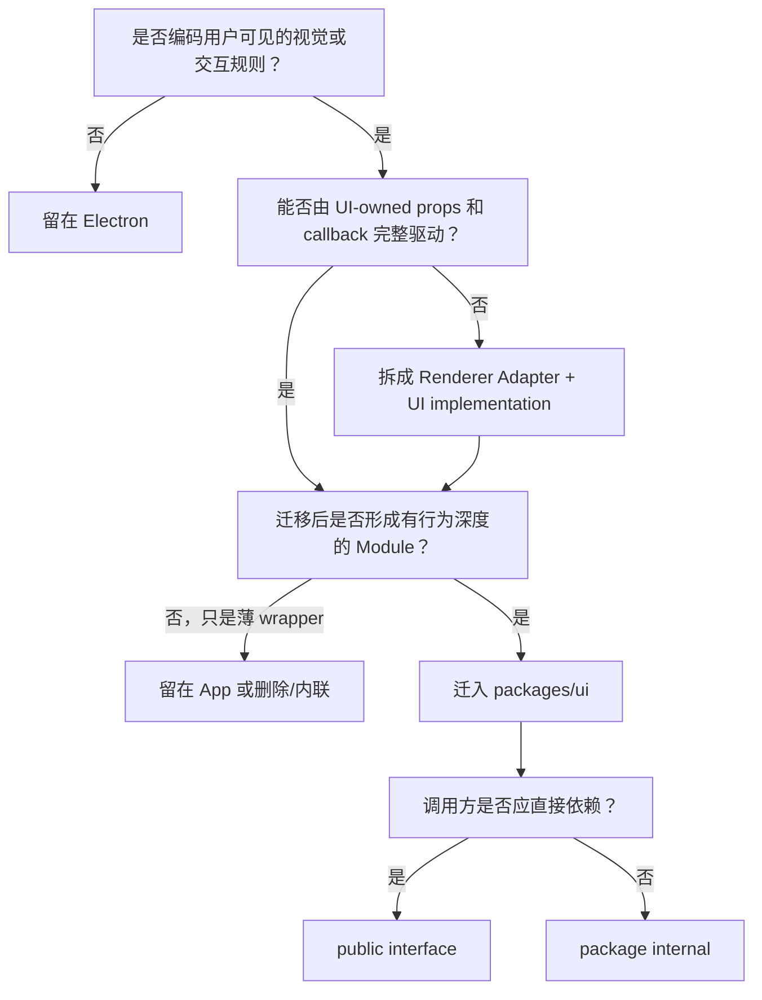

# v1.2.5 UI Component Ownership Review

> 状态：Reviewed
>
> 对应主计划：[UI Package & Storybook Migration Plan](./ui-package-storybook-migration-plan.md)
>
> 组织逻辑：本文采用**递进型主线**，按“判断规则 → 全量候选审查 → v1.2.5 范围 → 后续候选 → 验收约束”展开。原因是本轮要回答的核心不是文件怎么搬，而是每项 UI 为什么迁移、为什么公开、为什么只作为内部 implementation；各候选在同一章节内按 Foundation、Editor、Chat、App Screen 做 MECE 分类。

## 1. Review 结论

v1.2.5 的 `packages/ui` 迁移范围从原来的五个 Module 调整为七个：

1. UI Foundation；
2. Markdown Editor；
3. Chat Composer；
4. Chat Markdown；
5. Agent Execution；
6. Agent Proposal；
7. Chat Message。

本轮新增的关键决策：

- Milkdown Editor、Readonly Preview、Simple Preview 和 theme 迁入 `packages/ui`；
- Chat Composer、Context Picker、附件 visual 和 Context Usage visual 迁入 `packages/ui`；
- user message 的纯展示和 message row chrome 迁入 `packages/ui`；
- 每个 Agent Tool 都必须有独立 Story/fixture，但只有视觉结构不同的 Tool 才拥有独立 internal renderer；
- 所有已知写操作 Tool 都拥有明确的 Proposal View Model kind，不再用 `generic` 吞掉已知类型；
- shadcn 文件不手工迁移：删除旧目录、迁移 `components.json`、在新 package 重新生成；
- route、query、IPC、store 和 screen workflow 继续留在 Electron。

## 2. 三个互不等价的决策

“抽组件”必须拆成三个问题：

| 决策             | 问题                                               | 可能结果                  |
| ---------------- | -------------------------------------------------- | ------------------------- |
| Ownership        | implementation 是否属于 `packages/ui`？            | 迁入 / 留在 Electron / 删 |
| Public Interface | Renderer 是否需要直接使用它？                      | public / package internal |
| Visual Shape     | 是否存在独立视觉语法，值得单独 renderer 和 Story？ | 独立 / 复用现有 visual    |

一个 implementation 可以迁入 package，但不成为 public interface；一个 Tool 也可以拥有独立 Story，却复用同一个 renderer。

## 3. Ownership 判断树



判断标准：

- “可由 props 驱动”不等于“必须迁移”；薄 wrapper 不值得建立稳定 interface；
- query/IPC 存在时优先拆 Adapter，不因此把整段 UI 留在 Electron；
- Tool protocol 不同不代表 visual shape 不同；
- Storybook 是 interface 的验证消费者，但不能成为制造假抽象的理由；
- 未使用 implementation 删除，不搬到新 package。

## 4. Foundation 与共享 UI 审查

| 当前资产                                    | v1.2.5 决策                     | Public | 原因                                                                   |
| ------------------------------------------- | ------------------------------- | ------ | ---------------------------------------------------------------------- |
| `components/ui/*.tsx` 56 个 shadcn 文件     | 删除旧目录，在 package 重新生成 | 是     | CLI-owned source，不手工搬运、不修改                                   |
| `components.json`                           | 从 Electron 迁到 package        | 否     | shadcn 安装位置和依赖 ownership 随 package 迁移                        |
| `style.css` 中 token/base styles            | 迁移                            | 是     | Electron 和 Storybook 必须使用同一视觉基线                             |
| `ThemeProvider`                             | 迁移                            | 是     | 纯 UI runtime，App 和 Storybook 都需要                                 |
| `cn`                                        | 由 shadcn 在 package 生成       | 是     | 不复制旧实现                                                           |
| `useIsMobile`                               | 由 Sidebar dependency 自动生成  | 是     | CLI-owned hook；不从 Renderer 手工迁移                                 |
| `ModalProvider` / `useModal`                | 迁移                            | 是     | 已有多调用方，隐藏 Dialog state 和 confirm 行为                        |
| `DrawerContextProvider` / `useSharedDrawer` | 迁移                            | 是     | 已有多调用方，隐藏 Sheet 生命周期和 close callback                     |
| `SidebarToggleButton`                       | 暂留 Electron                   | 否     | 是 App chrome 的薄 Button wrapper，没有足够独立行为                    |
| `FooterButton`                              | 删除并改用 shadcn composition   | 否     | 只是两个 Button 的浅封装，且命名/props 不形成稳定设计规则              |
| `DomainTreeSelect`                          | 后续拆分                        | 待定   | visual 值得迁移，但当前无条件调用 Capture query；属于 Knowledge Module |
| `badge-colors.ts`                           | 删除                            | 否     | 无 production caller                                                   |

Foundation 详细方案见 [UI Foundation Module Design](./ui-foundation-module-design.md)。

## 5. Markdown Editor 审查

| 当前资产                                    | v1.2.5 决策        | Public | 原因                                                |
| ------------------------------------------- | ------------------ | ------ | --------------------------------------------------- |
| `MarkdownEditor`                            | 迁移               | 是     | 深 UI Module，已有多个生产消费者                    |
| `MarkdownPreview`                           | 迁移               | 是     | Readonly Milkdown + image zoom 是独立可验收 visual  |
| `SimpleMarkdownPreview`                     | 迁移               | 是     | Understanding list/detail 已有多个消费者            |
| Milkdown builder、extensions、suggestion UI | 迁移               | 否     | Editor implementation 细节                          |
| Milkdown theme                              | 迁移               | 否     | 必须与 Editor 同 ownership                          |
| Wiki Link codec helpers                     | 迁移               | 是     | Editor、Preview 和 App 保存逻辑共享                 |
| Markdown normalize/equality helpers         | 迁移               | 是     | Capture store 和 Editor 都使用                      |
| `ipcClient.asset.saveAsset`                 | 留在 Electron      | 否     | asset persistence Adapter                           |
| Understanding suggestion query              | 留在 Electron      | 否     | App query Adapter                                   |
| `medium-zoom`                               | 随 Editor 迁移依赖 | 否     | 直接服务 `MarkdownPreview`，不再错误地归到 Electron |

详细方案见 [Markdown Editor Module Design](./markdown-editor-module-design.md)。

## 6. Chat Composer 与 Context Input 审查

| 当前资产                       | v1.2.5 决策   | Public | 原因                                                  |
| ------------------------------ | ------------- | ------ | ----------------------------------------------------- |
| `ChatComposer`                 | 迁移          | 是     | 深 UI Module，包含 TipTap、键盘、附件和 selector 交互 |
| `ContextPicker`                | 迁移          | 否     | Composer 内部交互，可独立 Story 但无第二个生产调用方  |
| `ContextUsageMeter`            | 迁移          | 否     | Composer 内部 visual                                  |
| `AttachmentPreview`            | 迁移          | 否     | Composer 内部 visual                                  |
| composer JSON codec            | 迁移          | 是     | 编辑、重发和 submit round-trip 的 interface           |
| context mention render helpers | 迁移          | 否     | TipTap/Picker 共同 implementation                     |
| `useContextMentionLookup`      | 留在 Electron | 否     | React Query/IPC Adapter                               |
| `AgentFileAttachment` 转换     | 留在 Electron | 否     | Agent protocol Adapter                                |
| messages → context usage 计算  | 留在 Electron | 否     | 输入是 App message/session type                       |
| model config → display option  | 留在 Electron | 否     | 输入是 main-process config type                       |

详细方案见 [Chat Composer Module Design](./chat-composer-module-design.md)。

## 7. Chat Rendering 与 Agent Tool 审查

### 7.1 Chat Markdown

迁移：

- `MarkdownBody` → `ChatMarkdown`；
- entity reference visual；
- Streamdown 配置和 Chat Markdown theme；
- search highlight rendering；
- direct reference codec。

留在 Electron：

- entity query；
- inspector navigation；
- Thread Find workflow；
- thread export IPC。

详细方案见 [Chat Markdown Module Design](./chat-markdown-module-design.md)。

### 7.2 Agent Execution

迁移：

- Reasoning；
- Tool Activity shell；
- Tool detail rows/content；
- Context Compaction；
- Pending placeholder。

留在 Electron：

- raw tool payload 解析；
- tool name → visual family mapping；
- output truncation与安全 projection；
- event/reducer state。

每个 active Tool 都有 Story；相同 visual family 复用 renderer。详细方案见 [Agent Execution Module Design](./agent-execution-module-design.md)。

### 7.3 Agent Proposal

迁移：

- Proposal shell；
- Understanding create/update/delete；
- Domain create/update/delete；
- Context create/update/delete；
- dangerous Bash；
- unknown fallback；
- lifecycle/status visual。

留在 Electron：

- preview payload hydration；
- entity/path 查询；
- approval mutation；
- raw payload parsing。

所有已知 Tool 都拥有明确 View Model kind 和 Story。详细方案见 [Agent Proposal Module Design](./agent-proposal-module-design.md)。

### 7.4 Chat Message

迁移：

- assistant block composition；
- user message content；
- attachment/mention visual；
- message row chrome；
- copy/edit/regenerate/fork 按钮 visual；
- timestamp/highlight/stopped/error visual。

留在 Electron：

- `MessageList` 的排序、compaction 插入和 pending 判断；
- clipboard/toast；
- edit/regenerate/fork workflow；
- raw Agent message mapping；
- Thread Find navigation。

详细方案见 [Agent Message Module Design](./agent-message-module-design.md)。

## 8. 明确留在 Electron 的 Screen/Workflow

以下资产本轮不拆。它们的主要职责是 route、query、store 或多 Module orchestration：

| 范围      | 保留资产                                                                       |
| --------- | ------------------------------------------------------------------------------ |
| App Shell | `AppLayout`、`AppChromeMenu`、route wiring                                     |
| Chat      | `AgentThreadPanel`、`ThreadSidebar`、`ContextualAgentDock`、`ContextInspector` |
| Capture   | Capture route、query hooks、store、draft autosave                              |
| Settings  | `SettingsDialogContent` 和各 connected section                                 |
| Workflow  | modal content creation、navigation、toast、clipboard、IPC mutation             |

“留在 Electron”表示当前 implementation 仍以 workflow 为主，不表示其中所有 visual 永久不可迁移。

## 9. 后续独立迁移候选

这些资产符合 UI ownership，但不应塞进 v1.2.5 Chat/Editor 迁移：

| 后续 Module      | 候选 visual                                            | 需要先解决的 seam                      |
| ---------------- | ------------------------------------------------------ | -------------------------------------- |
| Knowledge Tree   | `DomainTreeSelect`、`DomainTree`、Create Domain form   | Domain View Model、DnD callbacks       |
| Knowledge List   | `UnderstandingRow`、list empty/loading/filter visual   | list item View Model、row actions      |
| Knowledge Detail | Understanding/Context read/edit visual                 | draft/save/delete Adapter              |
| Knowledge Graph  | `KnowledgeGraph`、graph controls、empty/loading visual | graph View Model 与 selection callback |
| Settings         | AI/Retrieval/Storage/Trash form visual                 | settings draft 和 mutation Adapter     |

这些候选应各自形成新 Module Design，不在当前 package migration 中顺手抽零散子组件。

## 10. Tool Story 与 Component 的关系

```text
每个 Tool protocol
  -> 一个 Adapter mapping
  -> 一个独立 Story/fixture
  -> 选择一个 visual family
  -> 只有 visual family 不同时才新增 internal renderer
```

因此：

- `domain_list`、`understanding_list` 和 `context_list` 都有独立 Story，但可以复用 Record List visual；
- `read`、`edit`、safe `bash` 有独立 Story，但可以复用 Tool Details shell；
- 九种 mutation Proposal 都有独立 kind 和 Story；
- delete Proposal 可以共享 Delete visual renderer；
- Renderer 只调用 `AgentExecutionBlock` 或 `AgentProposalCard`，不手工 dispatch internal component。

## 11. Review 出口

- 所有现有 UI 候选都有“迁移 / 留下 / 删除 / 后续”的明确结论；
- ownership、public interface 和 visual shape 不再混为一谈；
- v1.2.5 不再遗漏 Milkdown、Composer 和 user message visual；
- 每个 active Agent Tool 都有验收入口；
- stream preview 和普通 running Tool 都通过稳定 View Model identity 更新；
- shadcn source 只由 CLI 生成，不从 Electron 复制。
