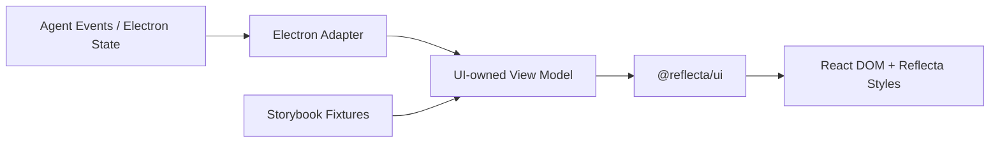

# v1.2.5 `@reflecta/ui` 与 Storybook 迁移计划

> 日期：2026-07-28
>
> 状态：Planned
>
> 组织逻辑：本文采用**递进型主线**，按“现状与约束 → 目标架构 → 模块划分 → 逐模块迁移 → 整体验收”展开。原因是本计划不只是罗列待办，而是要先确定正确的 package seam，再按依赖顺序迁移；调换一级章节会导致执行者在不了解依赖方向时提前搬代码。模块划分在横向上使用 MECE：设计基础、Markdown、Agent 执行过程、Agent 写操作候选、Agent 消息组合互不重叠，并共同覆盖 v1.2.5 的 UI 提取范围。

## 1. 目标与完成定义

v1.2.5 建立平台无关的 `@reflecta/ui` Module，把 Reflecta 的设计基础和 Agent 对话展示从 Electron Renderer 中提取出来，并使用 Storybook 作为该 Module 的视觉状态目录与人工验收入口。

完成后形成单向依赖：



完成定义：

- 新增 workspace package `packages/ui`，package name 为 `@reflecta/ui`；
- Storybook 位于 `packages/ui/.storybook`，能够独立启动并生成静态产物；
- Reflecta 设计 tokens、基础样式、Theme Provider、`cn` 和现有 shadcn primitives 归 `@reflecta/ui` 所有；
- Chat Markdown、Agent Tool Activity、Agent Proposal 和 Agent Message View 归 `@reflecta/ui` 所有；
- `packages/ui` 不依赖 Electron、IPC、Renderer alias、React Query 数据请求或 App 私有类型；
- Electron 负责把 Agent session、查询结果和用户操作转换成 UI View Model 与回调；
- Electron Renderer 使用 `@reflecta/ui` 替换原实现，不长期保留两份组件或兼容 re-export；
- Storybook 覆盖 Agent Tool、Markdown 和 Proposal 的主要视觉状态；
- Electron 原有行为、交互和产品语义不因迁移发生变化。

## 2. 当前状态与提取约束

### 2.1 当前状态

- `apps/electron/src/renderer/src/components/ui` 有 56 个 shadcn primitive 文件；
- 85 个 Renderer 文件直接依赖 `@renderer/components/ui`、Theme Provider 或 `@renderer/lib/utils`；
- `agent-message-content.tsx` 同时承担 Markdown、Tool Activity、Reasoning、Proposal、实体查询和 IPC，共 1052 行；
- `agent-turn-view.ts` 负责把 Agent blocks 翻译成展示状态，共 1231 行；
- Chat Markdown 样式、wiki link 和搜索高亮分散在 `messages`、`context`、`styles` 三个目录；
- 仓库还没有 Storybook，也没有平台无关的 UI package。

### 2.2 必须保持的架构约束

依赖方向固定为：

```text
apps/electron -> packages/ui
```

禁止：

```text
packages/ui -> apps/electron
packages/ui -> @renderer/*
packages/ui -> @shared/*
packages/ui -> ipcClient
packages/ui -> Electron preload globals
```

`@reflecta/ui` 可以依赖：

- React / React DOM；
- shadcn 当前使用的 Radix/Base UI 依赖；
- Tailwind CSS、`class-variance-authority`、`clsx`、`tailwind-merge`；
- `lucide-react`、`streamdown`、Markdown 渲染相关依赖；
- 与展示直接相关、且不访问产品数据的浏览器能力。

Electron 保留：

- IPC 和 preload typings；
- React Query 请求与缓存；
- Agent reducer、session、tool payload 解释；
- Router、窗口、拖拽区域和 App Shell；
- 数据 mutation、toast 业务反馈、编辑、重试、fork 等 workflow；
- 从 App 类型到 UI View Model 的 Adapter。

### 2.3 迁移原则

- 先建立 package seam，再迁移实现；
- 每个模块都完成“确认组件 → 重设 interface → 实现 → 替换 Renderer”的闭环；
- Renderer 和 Storybook 通过同一个 interface 使用组件；
- Storybook 不 mock 整个 Electron，不让 UI story 理解 IPC contract；
- UI View Model 必须包含渲染所需的 label、状态和格式，不允许组件为了补数据主动查询 App；
- shadcn primitive 只做归属迁移和 package-local import 调整，不改实现、样式或行为；
- 每个模块替换完成后立即删除旧实现；测试是替换，不是叠加；
- 本轮只迁移已经存在且有明确消费者的 UI，不创建假想的通用 Design System。

## 3. 目标结构与公开 Interface

### 3.1 目录结构

```text
packages/ui/
├── .storybook/
│   ├── main.ts
│   └── preview.tsx
├── src/
│   ├── styles/
│   │   ├── index.css
│   │   └── markdown-theme/
│   ├── primitives/
│   ├── chat/
│   │   ├── markdown/
│   │   ├── execution/
│   │   ├── proposal/
│   │   └── message/
│   ├── theme-provider.tsx
│   └── utils.ts
├── components.json
├── package.json
└── tsconfig.json

apps/electron/src/renderer/src/
├── modules/chat/
│   ├── adapters/
│   │   └── agent-message-adapter.tsx
│   ├── messages/
│   │   ├── agent-turn-view.ts
│   │   └── message-list.tsx
│   └── ...
└── style.css
```

最终目录名可在实施时按现有命名微调，但 ownership 和依赖方向不得改变。

### 3.2 Package 公开面

使用明确 subpath export，避免一个无限增长的 root barrel：

```text
@reflecta/ui/styles.css
@reflecta/ui/primitives
@reflecta/ui/theme
@reflecta/ui/chat
```

`@reflecta/ui/chat` 的稳定 interface 只公开语义化入口与对应 View Model：

- `ChatMarkdown`
- `AgentExecutionBlock`
- `AgentProposalCard`
- `AgentMessageView`

以下内容保持 package internal：

- Tool detail rows；
- Candidate shell；
- Markdown AST/plugin 细节；
- 单个 proposal 类型的内部卡片；
- Story fixtures；
- Storybook decorators；
- 仅用于实现组合的辅助函数。

### 3.3 View Model seam

`packages/ui` 定义展示所需的类型，Electron Adapter 从现有 `AgentReducedMessage`、`AgentTurnView`、entity catalog 和查询结果生成它们。

UI View Model 遵守：

- 只表达用户可见状态，不暴露 Pi、IPC 或数据库 DTO；
- 使用稳定 discriminated union 表达 text、reasoning、tool activity、proposal、compaction；
- Proposal 中使用已经解析完成的 entity label 和 Domain path；
- callback 参数使用 UI action，例如 approve、reject、inspect entity，不暴露 query client 或 service；
- Markdown entity ref 使用 UI-owned type，Electron Adapter 负责从 Agent catalog 投影；
- 缺少 display data 时显式使用稳定 fallback，不在组件内部发起请求。

`agent-turn-view.ts` 继续留在 Electron：它解释 Agent tool payload 和 session state，是 App Adapter，而不是 UI implementation。它返回的 UI 类型改由 `@reflecta/ui/chat` 提供。

## 4. 所有模块共用的迁移闭环

每个模块必须依次完成下面四步，不跨步并行保留两套实现。

### 4.1 确认要独立的组件

- 列出当前组件、样式、类型、helper 和全部调用方；
- 分类依赖为纯 UI、App 数据、平台能力；
- 只迁移纯 UI；App 数据和平台能力留在 Electron Adapter；
- 对未使用代码执行删除，不搬入新 package；
- 在任务记录中写明“迁移 / 留在 Electron / 删除”的清单。

### 4.2 重新设计 Interface 和调整逻辑

- 从使用方需要的最小信息反推 props；
- 把数据读取改为 display-ready View Model；
- 把业务副作用改为语义化 callback；
- 不为 Storybook增加生产 interface；Story 和 Renderer 使用同一个 interface；
- 用 deletion test 检查 Module 深度：删除该 Module 后，复杂度应重新散回多个调用方，而不是直接消失；
- 在开始实现前记录旧 interface 到新 interface 的映射。

### 4.3 实现组件与 Story

- 迁移或实现组件；
- 为状态分支建立 typed stories；
- stories 使用 UI View Model fixture，不构造 Electron events；
- 保持迁移前视觉和交互，不在同一任务顺带 redesign；
- 非平凡格式化或状态逻辑保留一个最小自动化检查。

### 4.4 替换 Renderer 原逻辑

- Electron Adapter 生成 View Model 并绑定 callback；
- 替换全部生产调用方；
- 删除旧组件、旧样式和无用 helper；
- 不保留临时 re-export 或双写 CSS；
- 执行 package、Renderer 和 production build 验证后再进入下一个模块。

## 5. Task 0：建立 Package 与 Storybook 技术闸门

该任务只建立运行环境，不迁移业务 UI。

- [ ] 新建 `packages/ui/package.json`、`tsconfig.json` 和 package exports；
- [ ] 参考现有 `@reflecta/server`，由 Vite 直接消费 TypeScript source，不新增独立 library bundler；
- [ ] React 和 React DOM 使用 peer dependency；实际使用的 UI library 由 `@reflecta/ui` 声明；
- [ ] CSS/SCSS 明确标为 side effect，避免 production tree-shaking 丢失样式；
- [ ] 新建 `packages/ui/components.json`，让后续 shadcn 操作以 UI package 为根；
- [ ] 新建 `packages/ui/.storybook/main.ts` 和 `preview.tsx`；
- [ ] Storybook 使用 React + Vite，复用 Tailwind v4 和 UI package alias；
- [ ] `preview.tsx` 加载真实 UI styles 和 Theme Provider；
- [ ] 只建立必要的 viewport、light/dark 和内容宽度 decorator；
- [ ] 增加 root 与 package 的 `storybook`、`storybook:build` scripts；
- [ ] 建立一个临时技术闸门 story，验证 Tailwind class、CSS variables、字体、dark mode 和 HMR；
- [ ] 技术闸门通过后删除临时 story，由 Module 1 的正式 story 替代。

闸门：

- `bun run --cwd packages/ui storybook:build` 成功；
- Storybook 启动不加载 Electron main/preload plugin；
- production Renderer 能导入一个最小 UI export；
- package 中不存在 `@renderer`、`@shared`、`ipcClient` 或 Electron import。

## 6. Module 1：设计基础与 shadcn Primitives

该模块先迁移所有后续模块共同依赖的设计基础。

### 6.1 确认组件

- [ ] 扫描 56 个现有 shadcn primitive 及其内部 import graph；
- [ ] 扫描 Theme Provider、`cn` 和 semantic style helper 的实际调用方；
- [ ] 将现有 `style.css` 分类为：
  - UI design tokens、字体、base layer、通用 scrollbar；
  - Electron App Shell、窗口拖拽、`#root` 尺寸和 Renderer-only 规则；
  - Markdown 与 chat-find 规则，留给 Module 2；
- [ ] 未被任何调用方使用的 helper 不迁移；
- [ ] 确认 Electron 直接使用的 UI dependencies，决定 dependency ownership。

迁移：

- `components/ui/*` 全部作为一个内部依赖图迁移；
- `components/theme-provider.tsx`；
- `lib/utils.ts` 中的 `cn`；
- Reflecta design tokens 和通用基础样式。

留在 Electron：

- App Shell 尺寸；
- Electron drag/no-drag；
- Renderer root 与透明窗口规则；
- 只服务 Electron workflow 的 hooks 和业务组件。

### 6.2 重新设计 Interface

- [ ] primitives 通过 `@reflecta/ui/primitives` 导出；
- [ ] Theme Provider 通过 `@reflecta/ui/theme` 导出；
- [ ] `cn` 只作为 package internal helper；只有确认外部调用方确实需要时才公开；
- [ ] package 内 primitive 使用 package-local import，不使用 App alias；
- [ ] 保持 shadcn 现有 props、样式和行为不变；
- [ ] Electron `style.css` 改为加载 `@reflecta/ui/styles.css` 后追加 App-only 样式。

### 6.3 实现组件

- [ ] 迁移 primitives、Theme Provider、utils 和 styles；
- [ ] 更新 package dependencies；
- [ ] 更新 `components.json` alias；
- [ ] 建立 Foundation stories：颜色、排版、Button、Badge、Form controls、Overlay；
- [ ] 在 stories 中验证 light/dark、focus、disabled 和 destructive 状态；
- [ ] 不对现有 shadcn 组件进行视觉定制。

### 6.4 替换 Renderer

- [ ] 批量替换 85 个 Renderer 文件中的 primitive、Theme Provider 和 utils import；
- [ ] 删除 `apps/electron/src/renderer/src/components/ui` 的旧文件；
- [ ] 删除已迁移的 Theme Provider、utils 和 CSS token；
- [ ] 确认 Renderer 没有继续从旧 alias 读取 primitives；
- [ ] 运行 Renderer tests、web typecheck 和 production build。

模块出口：

- Renderer 和 Storybook 使用同一份 tokens、Theme Provider 和 primitives；
- Electron 中不存在第二份 shadcn primitive；
- UI package 尚不包含 Markdown 或 Agent 业务展示。

## 7. Module 2：Chat Markdown

该模块把 Markdown parsing、实体链接展示和视觉样式收拢成一个深 Module。

### 7.1 确认组件

- [ ] 检查 `MarkdownBody` 的全部调用场景；
- [ ] 检查 `markdown-theme.scss` 及所有 partial；
- [ ] 检查 `wiki-link.tsx`、`context-reference.ts` 和 `chat-find-highlight.tsx`；
- [ ] 区分 Markdown 语法/展示逻辑与 Electron entity inspection workflow；
- [ ] 确认 Streamdown、KaTeX、Mermaid 和链接处理的真实能力范围。

迁移候选：

- `MarkdownBody`，重命名为 `ChatMarkdown`；
- Chat Markdown theme；
- Markdown 内部 entity link renderer；
- Markdown 搜索高亮的纯展示部分；
- URL transform 和纯解析 helper。

留在 Electron：

- 打开 Understanding、Context、Domain 的 inspector；
- Agent catalog 到 UI entity reference 的投影；
- 搜索框、当前命中项和滚动定位 orchestration；
- 与导出、查询缓存或 IPC 有关的逻辑。

### 7.2 重新设计 Interface

- [ ] `ChatMarkdown` 接受 Markdown value、UI entity catalog、inspect callback 和可选 search state；
- [ ] 使用 `tone` 等语义化 variant 表达默认/弱化文本，不依赖调用方覆盖所有后代颜色；
- [ ] UI entity 类型由 `@reflecta/ui/chat` 定义，不引用 `AgentContextRef`；
- [ ] entity link 缺少 label 时使用稳定 fallback；
- [ ] custom Markdown 转换规则集中在 Module 内部，不让调用方组合 plugin；
- [ ] 不公开 Streamdown plugin、AST node 或 wiki URL 内部格式。

### 7.3 实现组件

- [ ] 实现 `ChatMarkdown` 与内部 Markdown helpers；
- [ ] 迁移 Markdown theme，确保 Storybook 和 Renderer 只加载一份；
- [ ] 建立 Markdown stories：
  - headings、paragraph、inline emphasis；
  - ordered/unordered/task list；
  - blockquote、divider；
  - inline code、code block、超长行；
  - table；
  - link、entity ref；
  - KaTeX、Mermaid；
  - streaming 中的不完整 Markdown；
  - 长内容、窄宽度、light/dark；
- [ ] 对纯解析和 reference fallback 保留最小单元测试。

### 7.4 替换 Renderer

- [ ] 替换 assistant text、reasoning 和 tool detail 中的 Markdown 渲染；
- [ ] Electron Adapter 把 Agent entity catalog 转换成 UI entity catalog；
- [ ] 绑定现有 entity inspector callback 和 chat find state；
- [ ] 删除旧 `MarkdownBody`、旧 theme 和已迁移 helper；
- [ ] 验证引用点击、搜索高亮、代码、表格和流式输出。

模块出口：

- `ChatMarkdown` 可以在没有 Electron 环境的 Storybook 中完整渲染；
- Renderer 不再组合 Markdown plugins 或直接加载旧 chat theme；
- 产品中的 Chat Markdown 与 Storybook 使用同一 implementation。

## 8. Module 3：Agent 执行过程展示

该模块覆盖不要求用户确认的 assistant 过程状态，与写操作 Proposal 分开。

### 8.1 确认组件

- [ ] 检查 `ToolActivityGroup`、Tool detail rows、Reasoning、Context Compaction、Running Placeholder；
- [ ] 列出 running、done、failed、empty、multi-item 和 long-output 状态；
- [ ] 确认哪些字段来自 `agent-turn-view.ts`，哪些字段仍在 React 中推导；
- [ ] 将 tool payload parsing 与纯展示格式化分开。

迁移：

- Tool activity 容器和明细；
- Reasoning block；
- Context compaction receipt；
- Running response placeholder；
- 展示层 status variant 和纯格式化。

留在 Electron：

- 原始 tool block 分组；
- tool-specific payload 解析；
- session running/stopped 判断；
- Agent event 到 execution View Model 的转换。

### 8.2 重新设计 Interface

- [ ] 定义 UI-owned execution block union；
- [ ] UI 只接收 summary、status、rows、meta、error 和 format；
- [ ] Markdown detail 直接复用 `ChatMarkdown`；
- [ ] 展开/收起属于组件内部 UI state；
- [ ] 初始展开状态通过明确 prop 控制；
- [ ] tool name 可以保留为调试 metadata，但不能驱动组件内业务查询。

### 8.3 实现组件

- [ ] 实现 `AgentExecutionBlock` 及 package-internal 子组件；
- [ ] 建立 stories：
  - reasoning running/done；
  - single/multiple tool；
  - running/done/failed；
  - empty details；
  - text/pre/Markdown details；
  - 截断与展开完整输出；
  - context compaction；
  - running/stopped placeholder；
- [ ] 用 interaction 检查折叠、展开和长内容滚动。

### 8.4 替换 Renderer

- [ ] `agent-turn-view.ts` 返回 UI-owned execution types；
- [ ] 替换原 Tool Activity、Reasoning、Compaction 和 Placeholder 分支；
- [ ] 删除 Renderer 中对应 JSX、status style 和纯格式化 helper；
- [ ] 保留并调整 `agent-turn-view.test.ts`，通过公开 View Model 验证转换；
- [ ] 验证现有 Tool Activity UI 行为不变。

模块出口：

- Tool Activity 的每个状态可在 Storybook 独立验收；
- Electron 只负责产生 execution View Model；
- execution component 不知道任何 Agent service 或 IPC。

## 9. Module 4：Agent 写操作 Proposal

该模块覆盖需要用户确认或展示写入结果的 Agent Tool UI。

### 9.1 确认组件

- [ ] 检查 Candidate Shell；
- [ ] 检查 Understanding create/update、Context create、Bash 和 Generic proposal；
- [ ] 列出 pending、approved、rejected、running、completed、denied、failed；
- [ ] 找出组件内的 Understanding、Context 和 Domain 查询；
- [ ] 检查批准/拒绝 callback 和 result detail 的复用关系。

迁移：

- Proposal shell；
- Understanding、Context、Bash、Generic proposal cards；
- Before/After diff layout；
- status label、status note 和 result details 展示；
- 批准/拒绝按钮及卡片内部折叠状态。

留在 Electron：

- React Query；
- IPC entity lookup；
- Domain tree/path 计算；
- approval mutation 和真实执行；
- error toast 与 query invalidation。

### 9.2 重新设计 Interface

- [ ] 定义 UI-owned proposal discriminated union；
- [ ] Proposal View Model 包含已经解析的 Understanding label、Context label 和 Domain path；
- [ ] 使用单一语义化 decision callback，不暴露 `approvalId` 以外的 App 内部状态；
- [ ] approval、execution 和 result 状态在 View Model 中明确区分；
- [ ] Generic proposal 的字段在 Adapter 中转换成 display rows，组件不根据 key 发起查询；
- [ ] result details 复用 Module 3 的 detail implementation；
- [ ] Markdown body 复用 Module 2。

### 9.3 实现组件

- [ ] 实现 `AgentProposalCard` 与内部 proposal cards；
- [ ] 建立每种 proposal 的状态 stories；
- [ ] 覆盖确认、拒绝、完成、拒绝执行、执行失败；
- [ ] 覆盖空标题、长正文、长 path、Before/After 和 Markdown body；
- [ ] 用 interaction 检查折叠、展开、confirm 和 reject callback。

### 9.4 替换 Renderer

- [ ] 新建或调整 Electron proposal Adapter，负责 query 和 display data；
- [ ] 替换 `agent-message-content.tsx` 中全部 proposal 分支；
- [ ] 删除 `useUnderstandingDisplay`、`useContextDisplay`、`DomainPathText` 等组件内查询；
- [ ] 删除 Renderer 中旧 Candidate cards 与 status helpers；
- [ ] 验证 approval payload、pending disable 和执行结果展示。

模块出口：

- Storybook 不需要 Query Client 或 IPC 即可展示全部 Proposal；
- Proposal component 只产生 decision action，不执行 App mutation；
- Renderer 中所有 entity display 请求集中在 Adapter。

## 10. Module 5：Agent Message 组合与最终替换

最后一个模块将前四个模块组合成 Electron 和 Storybook 共用的消息渲染 interface。

### 10.1 确认组件

- [ ] 检查 `AgentMessageContent` 剩余 text、stopped、empty 和 block sequencing 逻辑；
- [ ] 检查 `MessageRow` 对 assistant content 的调用方式；
- [ ] 确认 message id、busy、last assistant、stopped、find state 和 callback 的必要性；
- [ ] 识别只用于 list orchestration 的 clipboard、edit、regenerate、fork、timestamp 和 toast。

迁移：

- Assistant message block composition；
- text/error/empty/stopped visual；
- execution 和 proposal block sequencing；
- UI-owned `AgentMessageViewModel`；
- `AgentMessageView`。

留在 Electron：

- Message list virtualization/layout orchestration；
- User message edit、copy、regenerate 和 fork workflow；
- timestamp 和 session state；
- View Model Adapter；
- Context inspector orchestration。

### 10.2 重新设计 Interface

- [ ] `AgentMessageView` 接受一个完整 View Model、inspect callback 和 decision callback；
- [ ] running/stopped/empty 由显式 message state 表达；
- [ ] block key/identity 由 View Model 提供，不在 UI 猜测业务 id；
- [ ] Renderer 不再把整个 `AgentReducedMessage` 直接传入 UI package；
- [ ] Storybook fixtures 只创建 `AgentMessageViewModel`；
- [ ] package internal block components 不额外公开。

### 10.3 实现组件

- [ ] 实现 `AgentMessageView`；
- [ ] 建立组合 stories：
  - 纯 Markdown answer；
  - reasoning → tool → answer；
  - 多 tool → proposal → result → answer；
  - running、stopped、failed、empty；
  - 长对话内容和窄宽度；
  - light/dark；
- [ ] 复用前述模块 stories，不重复 fixture implementation；
- [ ] 确认 public exports 只包含稳定入口与 View Model。

### 10.4 替换 Renderer

- [ ] `message-list.tsx` 通过 Electron Adapter 构造 `AgentMessageViewModel`；
- [ ] 使用 `AgentMessageView` 替换原 `AgentMessageContent`；
- [ ] 删除旧 `agent-message-content.tsx` 或将其缩减为有实际 I/O 职责的 Adapter；
- [ ] 删除不再使用的 App 私有 UI types、styles 和 helpers；
- [ ] 检查 production bundle 中没有重复的旧/new UI implementation；
- [ ] 跑通 Agent message renderer 的现有测试与 Electron smoke test。

模块出口：

- Renderer 和 Storybook 通过同一个 `AgentMessageView` seam；
- `packages/ui` 是完整的 Agent assistant message 视觉上下文；
- Electron 只保留数据、workflow 和平台 Adapter。

## 11. v1.2.5 明确不迁移

以下内容仍然属于 Electron App，不在本轮为了“目录统一”强行迁移：

- Router 与 App Shell；
- Chat Composer 和输入 workflow；
- Thread Sidebar、Thread Actions、消息列表 orchestration；
- Capture 页面及其查询、编辑和布局；
- Settings、Storage、Trash；
- Electron-specific hooks；
- Milkdown 编辑器；
- G6 图谱；
- 业务 Modal、Drawer 和 Domain workflow。

未来只有出现第二个真实 UI consumer，或某个 UI 已经能以 display-ready View Model 独立运行时，才按同样闭环迁移。

本轮也不做：

- UI redesign；
- Chromatic 或其他 SaaS；
- 全仓 screenshot baseline；
- 为每个 shadcn primitive 编写 exhaustive story；
- Electron IPC mock framework；
- 第二套 Design Token 系统；
- package library bundler；
- 与迁移无关的组件抽象。

## 12. 验证策略

实施者在新增或修改测试前，先阅读：

- `docs/references/technical/architecture/unit-test-principles.md`；
- 涉及 feature 文件时，再阅读 `docs/references/technical/architecture/test-case-principles.md`。

### 12.1 每个模块的自动验证

- `@reflecta/ui` typecheck；
- `@reflecta/ui` 定向 unit/interaction tests；
- Storybook static build；
- Electron Renderer unit tests；
- Electron web typecheck；
- `git diff --check`；
- dependency scan，确认 `packages/ui` 没有禁止 import。

### 12.2 最终自动验证

- 全仓 typecheck；
- 全仓 lint；
- 全仓 format check；
- 全仓 tests；
- Electron production build；
- Storybook production build；
- 现有 Electron E2E；
- 检查 Renderer 中不存在旧 primitive 和 Agent Message UI 副本。

### 12.3 手动视觉验收

按 Storybook 分组逐项检查：

1. Foundation：light/dark、字体、颜色、focus、disabled；
2. Markdown：常用语法、实体引用、代码、表格、Mermaid、流式文本；
3. Execution：running/done/failed、单/多 Tool、长输出；
4. Proposal：全部类型和 approval/execution 状态；
5. Message：典型 block sequence、窄宽度和长内容；
6. Electron：相同状态与 Storybook 一致，点击、折叠、确认、拒绝正常。

视觉验收发现设计问题时单独记录后续 UI 调整，不在迁移 commit 中同时修改基线。

## 13. 出口标准

- `packages/ui` 有清楚的 ownership、公开 interface 和 README；
- package dependency graph 不包含 Electron/App 私有实现；
- Storybook 可独立开发与静态构建；
- UI tokens、primitives、Chat Markdown 和 Agent assistant message 只有一份 production implementation；
- Electron 所有调用方已切换到 `@reflecta/ui`；
- Agent Tool 与 Markdown 主要状态可以在 Storybook 中直接验收；
- UI View Model 足以完整渲染，不需要 Storybook mock IPC；
- App 行为、数据写入和 Agent session contract 没有因 UI 迁移改变；
- 自动验证和手动 smoke test 全部通过；
- 每个模块都有独立 Angular Convention commit。

## 14. 提交边界

1. `docs(ui): plan ui package and storybook migration`
2. `build(ui): add ui package and storybook`
3. `refactor(ui): move design foundations`
4. `refactor(ui): extract chat markdown`
5. `refactor(ui): extract agent execution blocks`
6. `refactor(ui): extract agent proposal cards`
7. `refactor(chat): adopt agent message view`
8. `test(ui): verify storybook and renderer migration`

每个提交都必须是可验证的阶段性成果。若某个模块无法在一个提交内安全完成，可以按“interface 与 Adapter → implementation 与替换 → tests”拆分，但不能提交长期双实现状态。
