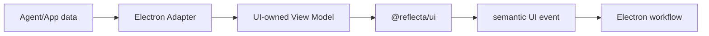
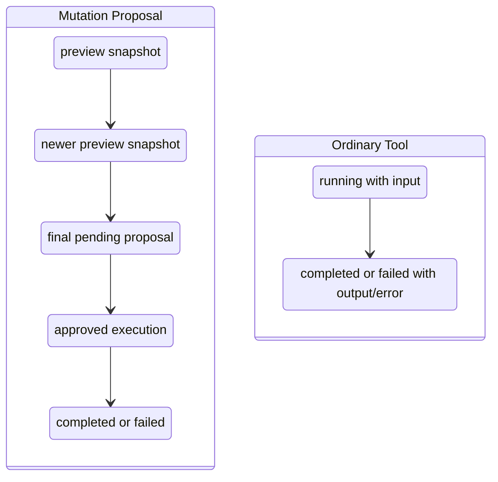

# v1.2.5 `@reflecta/ui` 与 Storybook 迁移计划

> 状态：Planned
>
> 组织逻辑：本文采用**递进型主线**，按“Ownership 判断 → 目标结构 → 技术闸门 → Module 迁移 → stream 兼容 → 全局验收”展开。原因是本次不是简单搬文件，而是先建立 Renderer Adapter 与 UI Module 的 seam，再按依赖顺序完成 replace；每个 Module 内统一执行“确认组件 → 设计 interface → 实现 Story → 替换 Renderer”四步。

## 1. 目标与完成定义

v1.2.5 建立独立 workspace package `@reflecta/ui`，用 Storybook 验收 Reflecta 的 UI design、Markdown Editor、Chat Composer、Markdown rendering 和 Agent Tool。

完成后：

- `packages/ui` 是 shadcn 配置、组件、design tokens 和 product UI 的 ownership；
- Electron Renderer 只保留 route、query、IPC、store 和 workflow Adapter；
- UI Module 只接收 UI-owned props/View Model 和语义 callback；
- 每个 active Agent Tool 都有独立 Story/fixture；
- stream preview 和 running Tool 在迁移后保持稳定增量更新；
- Renderer 中旧 implementation 在对应 Module 替换完成后删除；
- Storybook 不依赖 Electron runtime。

本计划不要求 v1.2.5 把所有 Capture、Settings 和 route screen 搬进 package。完整候选审查见 [UI Component Ownership Review](./ui-component-ownership-review.md)。

## 2. Ownership Mental Model



### 2.1 迁入 package

同时满足：

- 编码用户可见 visual 或交互规则；
- 可由 props/callback 完整驱动，或可通过 Adapter 达成；
- 迁移后形成有行为深度的 Module；
- 值得通过稳定 interface 和 Story 验收。

### 2.2 留在 Electron

主要职责属于：

- IPC、React Query、cache；
- raw Agent/tool payload 解析；
- route、navigation、DOM scroll；
- session/thread/capture/settings workflow；
- toast、clipboard、file persistence；
- screen composition。

### 2.3 Public 与 internal

- Renderer 直接调用的 Module 入口 public；
- Tool-specific renderer、detail row、plugin 和 fixture package internal；
- 每种 Tool 有独立 Story，不代表每种 Tool 有 public component；
- 已知视觉结构相同的 Tool 复用 internal renderer；
- 未使用的旧 implementation 删除。

## 3. 目标 Workspace

```text
packages/ui/
├── .storybook/
├── src/
│   ├── components/            # shadcn CLI-owned
│   ├── hooks/                 # shadcn CLI-owned hooks
│   ├── lib/
│   │   └── utils.ts
│   ├── styles/
│   │   └── globals.css
│   ├── overlays/
│   ├── editor/
│   ├── chat/
│   │   ├── composer/
│   │   ├── markdown/
│   │   ├── execution/
│   │   ├── proposal/
│   │   └── message/
│   └── theme-provider.tsx
├── components.json
├── package.json
└── tsconfig.json
```

Electron：

```text
apps/electron/src/renderer/src/modules/chat/
├── adapters/
│   ├── chat-composer-adapter.tsx
│   ├── chat-entity-adapter.ts
│   └── agent-message-adapter.tsx
├── session/
├── screens/
└── ...
```

目录名可在实施中按现有结构微调；ownership 和依赖方向不可反转。

## 4. Package Interface

```text
@reflecta/ui/globals.css
@reflecta/ui/components/*
@reflecta/ui/lib/*
@reflecta/ui/hooks/*
@reflecta/ui/theme
@reflecta/ui/overlays
@reflecta/ui/editor
@reflecta/ui/chat
```

不提供无限增长的 root barrel。

`@reflecta/ui/editor`：

- `MarkdownEditor`；
- `MarkdownPreview`；
- `SimpleMarkdownPreview`；
- suggestion/upload ports；
- Markdown/Wiki Link codec helpers。

`@reflecta/ui/chat`：

- `ChatComposer`；
- `ChatMarkdown`；
- `AgentExecutionBlock`；
- `AgentProposalCard`；
- `AgentMessageView`；
- `ChatMessageRow`；
- 对应 UI-owned types 和必要 pure helpers。

保持 internal：

- Tool detail renderer；
- Proposal subtype renderer；
- Milkdown/TipTap plugin；
- Story fixture；
- Storybook decorator；
- status badge、row、candidate shell。

## 5. Module Design 索引

1. [UI Foundation Module Design](./ui-foundation-module-design.md)
2. [Markdown Editor Module Design](./markdown-editor-module-design.md)
3. [Chat Composer Module Design](./chat-composer-module-design.md)
4. [Chat Markdown Module Design](./chat-markdown-module-design.md)
5. [Agent Execution Module Design](./agent-execution-module-design.md)
6. [Agent Proposal Module Design](./agent-proposal-module-design.md)
7. [Agent Message Module Design](./agent-message-module-design.md)

主计划定义顺序、共同闸门和完成标准；Module Design 定义具体 component、View Model、Adapter 和 Story。

## 6. 所有 Module 的迁移闭环

每个 Module 按同一闭环完成，不长期保留两套 implementation。

### 6.1 确认组件

- 列出 current implementation、style、helper、test 和调用方；
- 分成 UI implementation、App Adapter、删除项；
- 标记 public、package internal；
- 对 Tool 同时标记 protocol、visual family、Story。

### 6.2 设计 Interface

- 从 visual 所需的最小信息反推 props；
- raw App model 由 Renderer 转成 display-ready View Model；
- I/O 通过明确 port/callback 注入；
- callback 使用 approve、reject、open、submit 等 UI 语义；
- streaming state 使用 immutable snapshot 和稳定 identity；
- 不公开第三方 editor instance、query client 或 IPC。

### 6.3 实现与 Story

- implementation、styles 和 stories 同 Module 放置；
- Story 使用纯 fixture/in-memory Adapter；
- 覆盖 loading、empty、running、streaming、completed、failed、dark/light；
- Tool 必须逐 type 验收；
- interface 行为由 package tests 验证。

### 6.4 替换 Renderer

- 创建 production Adapter；
- 调用方一次性切到 package interface；
- 迁移/替换原测试；
- 删除旧 implementation 和无用 import；
- typecheck、targeted tests、Storybook build 通过后完成该 Module。

## 7. Task 0：Package 与 Storybook 技术闸门

### 7.1 工作项

- 创建 `packages/ui/package.json`；
- 创建 package-local `#...` imports 和 exports；
- 创建 TypeScript config；
- 配置 Storybook Vite/React；
- Storybook preview 加载 globals.css、Theme 和必要 Overlay Provider；
- Electron 添加 `@reflecta/ui: workspace:*`；
- 根脚本增加 UI typecheck/test/storybook build；
- 确认 workspace build 不把 Storybook dev dependency打进 Electron bundle。

### 7.2 闸门

- UI package 可独立 typecheck；
- empty Storybook 可 build；
- Electron 可 import 一个 UI package smoke export；
- light/dark token 在 Storybook 生效；
- package 不引用 `@renderer`、`@main`、`@shared`。

## 8. Module 1：UI Foundation 与 shadcn 重建

详细设计：[UI Foundation Module Design](./ui-foundation-module-design.md)。

### 8.1 确认组件

- 当前 56 个 shadcn name 作为安装 manifest；
- Theme Provider；
- globals/tokens；
- Modal/Drawer Providers；
- `SidebarToggleButton` 留 App；
- `FooterButton` 删除；
- unused `badge-colors` 删除。

### 8.2 设计 Interface

- public path 使用 `@reflecta/ui/components/*`；
- package internal 使用 `#components/*`；
- `components.json` ownership 移到 package；
- Overlay Provider 通过 `@reflecta/ui/overlays` 导出。

### 8.3 实现

- 创建 package config；
- shadcn dry-run；
- 删除 Electron `components/ui`；
- CLI 重新安装相同 56 components；
- 不复制、不修改旧 shadcn source；
- 迁移 Theme/tokens/Overlay。

### 8.4 替换 Renderer

- 全量替换 shadcn、utils、theme、overlay imports；
- 删除 Electron `components.json`；
- Electron `style.css` 只保留 App-only style。

### 8.5 闸门

- CLI 安装 name set 与当前 56 项相同；
- generated source 无手工 diff；
- Renderer 不存在旧 component import；
- Storybook 与 Electron theme 一致。

## 9. Module 2：Markdown Editor

详细设计：[Markdown Editor Module Design](./markdown-editor-module-design.md)。

### 9.1 确认组件

- Milkdown Editor；
- Readonly Preview；
- Simple Preview；
- Wiki Link extension/suggestion；
- Markdown normalize/codec；
- Editor theme 与 medium-zoom。

### 9.2 设计 Interface

- controlled `value` + `documentId`；
- asset upload port 返回最终 URL；
- suggestion source 返回 display-ready item；
- Wiki Link open callback；
- low-level Milkdown type internal。

### 9.3 实现

- Editor implementation 和 theme 迁入；
- IPC upload/query 改为注入 Adapter；
- `initialContent/content` 收敛为单一输入；
- Story 覆盖 editor/preview/suggestion/upload。

### 9.4 替换 Renderer

- Understanding Detail/List 和 Capture store 改用 package export；
- Renderer 提供 asset/suggestion Adapter；
- 删除旧 Markdown Editor 目录。

## 10. Module 3：Chat Composer

详细设计：[Chat Composer Module Design](./chat-composer-module-design.md)。

### 10.1 确认组件

- Chat Composer；
- Context Picker；
- mention visual；
- attachment preview；
- context usage meter；
- model/reasoning selector。

### 10.2 设计 Interface

- UI-owned composer document/value；
- async entity search port；
- attachment Adapter；
- display-ready model/reasoning/usage；
- submit/stop/edit semantic callback。

### 10.3 实现

- TipTap 和 visual 迁入；
- query/Agent DTO mapping 留在 Renderer；
- Story 覆盖 draft、mention、attachment、status。

### 10.4 替换 Renderer

- `AgentThreadPanel` 使用 connected Composer Adapter；
- 删除旧 Composer/Picker implementation；
- submit mapping 保持 Agent command contract。

## 11. Module 4：Chat Markdown

详细设计：[Chat Markdown Module Design](./chat-markdown-module-design.md)。

### 11.1 确认组件

- Streamdown rendering；
- entity reference visual；
- Chat Markdown theme；
- direct citation codec；
- find highlight；
- Milkdown 不再归入本 Module。

### 11.2 设计 Interface

- `ChatMarkdown` 只接收 value、tone、search、entity bindings；
- entity query 在 Renderer，resolver 同步返回 display state；
- export codec 为 pure helper。

### 11.3 实现与替换

- package 内实现一致 Markdown visual；
- Renderer 批量查询 entity 并创建 bindings；
- thread export 使用 package codec；
- 删除旧 Markdown body/wiki component/style。

## 12. Module 5：Agent Execution

详细设计：[Agent Execution Module Design](./agent-execution-module-design.md)。

### 12.1 确认组件

- Reasoning；
- Tool Activity；
- Tool Details；
- Context Compaction；
- Pending。

### 12.2 设计 Interface

- UI 不识别 raw tool name/payload；
- Adapter 为每个 active Tool 生成 display-ready View Model；
- visual family相同的 Tool 复用 renderer；
- `id` 在 `running → done/failed` 中稳定。

### 12.3 实现与替换

- 实现一个 public `AgentExecutionBlock`；
- 为 16 个普通 active Tool 和 unknown/legacy 建立 Story；
- Renderer 保留 tool parsing；
- 旧 Tool JSX 删除。

## 13. Module 6：Agent Proposal

详细设计：[Agent Proposal Module Design](./agent-proposal-module-design.md)。

### 13.1 确认组件

- 九种 mutation Proposal；
- dangerous Bash Proposal；
- unknown fallback；
- shared shell/result detail。

### 13.2 设计 Interface

- 每个已知 Tool 一个明确 View Model kind；
- visual family 可共享 internal renderer；
- lifecycle：preview/pending/running/completed/rejected/failed；
- `id` 在全部 preview/final frame 中稳定；
- preview fields 可缺失且不能显示 decision。

### 13.3 实现与替换

- public `AgentProposalCard` dispatch；
- 每种 Proposal Tool 独立 Story；
- Renderer 解析/hydrate raw payload；
- UI 只发 `approve/reject` decision。

## 14. Module 7：Chat Message

详细设计：[Agent Message Module Design](./agent-message-module-design.md)。

### 14.1 确认组件

- assistant block composition；
- user message content；
- attachment/mention visual；
- message row visual/actions；
- search/stopped/error visual。

### 14.2 设计 Interface

- public message View Model；
- semantic row callbacks；
- stable block identity；
- streaming update 不依赖 array index；
- `MessageList` workflow 留在 Renderer。

### 14.3 实现与替换

- Agent/User message 与 row chrome 迁入；
- Renderer Adapter 生成 UI message；
- list 保留排序、compaction、pending 和 workflow；
- 删除旧 message JSX。

## 15. Agent Stream Compatibility Gate

### 15.1 两种更新协议



### 15.2 硬约束

- proposal 使用稳定 `approvalId`，普通 Tool 使用稳定 `toolCallId`；
- React key 不能包含 lifecycle、status 或 array index；
- proposal preview 是完整 snapshot 替换，不是字段 delta merge；
- preview payload 允许缺字段，renderer 必须显示稳定 fallback；
- final pending snapshot 可由 hydrate 后数据替换 preview；
- decision 只在 final `pending` 可用；
- 普通 running Tool 无 output 时只能展示 input meta；
- final `assistant.turn` 替换 live state 时不得使 completed/rejected 状态倒退；
- 手动折叠状态不能因 frame update remount 丢失。

### 15.3 必须保留的回归序列

- mutation：partial preview A → preview B → final pending；
- mutation：pending → approved/running → completed；
- mutation：pending → rejected；
- mutation：running → failed；
- dangerous Bash：pending → running → completed/failed；
- safe Bash：running → completed/failed；
- ordinary Tool：running → completed；
- ordinary Tool：running → failed；
- restored final turn 覆盖 live frame；
- unknown/legacy Tool fallback。

现有 reducer/turn/message tests 是迁移基线；package tests 与 Adapter tests 建立后替换旧 JSX tests。

### 15.4 现状验证基线

2026-07-28 Review 已验证：

- Renderer `agent-reducer`、`agent-turn-view`、`message-list`：68 tests passed；
- main-process `streams approval tool previews before persisting the executable proposal`：隔离运行通过；
- 实际 event source 会发送多个同 `approvalId/toolCallId` 的完整 preview snapshot，随后发送无 `preview` 的 final approval；
- reducer 按 `approvalId/toolCallId` upsert，而不是 append 新卡片；
- 普通 Tool 使用 `tool.started → tool.completed/tool.failed`。

main-process 整文件在默认 5 秒 timeout 下有 10 个既有 async timeout；隔离的 preview 用例 559ms 通过。该测试运行稳定性不表示 UI 协议不兼容，但在最终全局闸门前需要单独处理，不能通过放宽 UI assertion 掩盖。

## 16. Active Tool 验收范围

普通 Activity：

```text
read
edit
write
bash (safe)
domain_list
domain_inspect
understanding_list
understanding_get
context_list
context_get
attachment_read
retrieve_knowledge
graph
web_search
fetch_content
get_search_content
```

Mutation Proposal：

```text
understanding_create
understanding_update
understanding_delete
domain_create
domain_update
domain_delete
context_create
context_update
context_delete
```

特殊：

- dangerous `bash` → Proposal；-历史/未知 Tool → generic Activity/Proposal fallback。

每项至少有一个 Story；stream-capable 项必须有 sequence Story。

## 17. 验证与提交节奏

每个 Module：

1. UI package typecheck；
2. package tests；
3. Storybook build；
4. Electron renderer typecheck；
5. targeted Renderer tests；
6. 删除旧 implementation；
7. Angular Commit Convention commit。

建议 commit：

```text
build(ui): scaffold ui package and storybook
refactor(ui): regenerate shadcn components in ui package
refactor(ui): move markdown editor to ui package
refactor(ui): move chat composer to ui package
refactor(ui): move chat markdown to ui package
refactor(ui): move agent execution views to ui package
refactor(ui): move agent proposal views to ui package
refactor(ui): move chat message views to ui package
```

## 18. 全局完成标准

- `packages/ui` workspace、exports 和 Storybook build 稳定；
- Electron 不存在旧 shadcn source/config；
- shadcn 56-item manifest 由 CLI 在 package 重建；
- generated shadcn source 未手工修改；
- Milkdown、Composer、Markdown、Agent Tool、Message visual 均可独立验收；
- package 不依赖 Electron alias、IPC、React Query 或 raw Agent DTO；
- 每个 active Tool 有 Story/fixture；
- stream sequence 回归通过；
- Renderer 只通过 Adapter 调用 UI interface；-旧 implementation 与重复 tests 已删除；-根级 typecheck/test/build 通过。
