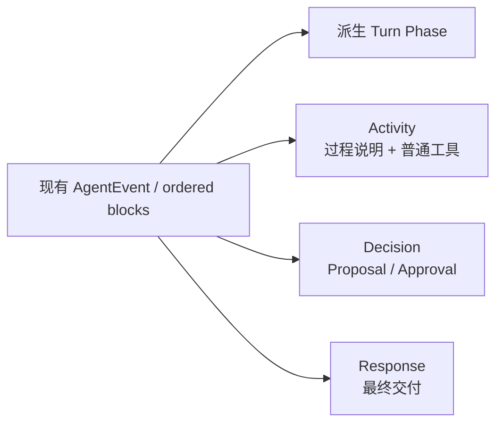
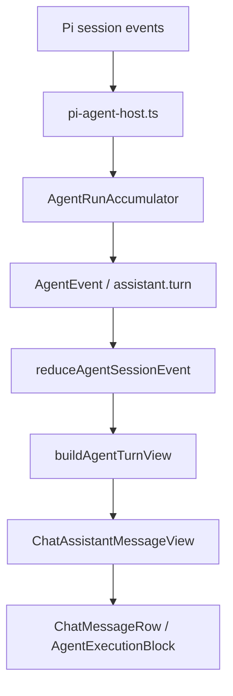
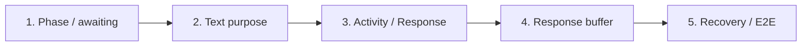

# Reflecta Agent Chat 体验改造实施计划

> 状态：Ready for Implementation  
> 关联调研：[Craft Agents 的 Agent Chat 体验机制与核心心智](./craft-agents-agent-chat-experience-research.md)  
> 目标版本：v1.2.6  
> 原则：复用当前事件协议、纯 reducer、ordered blocks、tool summary、proposal 与 `@reflecta/ui` 模块边界，只补用户可感知 Turn 所缺少的语义。

## 本文的组织逻辑

本文采用“**目标体验 → UX 契约 → UI 规格 → 数据与组件改动 → 纵向实施切片 → 验证与风险**”的结构。

原因是这次改造横跨 Provider event、持久态、renderer view model 和 UI。如果先按文件列任务，容易得到一批局部正确、整体仍有静默间隙的改动。本文先固定用户在每个阶段应该理解什么，再让数据、组件和测试共同服务这份契约；实施阶段则按可独立验收的纵向切片推进，避免一次性重写 Agent Chat。

---

## 结论先行

本次不新建一套 Agent 对话架构，而是在现有实现上增加一层“用户可感知的 Turn”：



最终需要交付四个能力：

1. **连续 Phase**  
   Turn 运行期间始终显示 pending、tool-active、awaiting、responding 或 needs-user，不再在工具完成后静默。

2. **明确的文本用途**  
   Provider message 结束时，根据 stop reason 标记该 text block 是 `intermediate` 还是 `response`；历史数据使用兼容推断。

3. **Activity / Response 分层**  
   现有 reasoning、intermediate text 和普通 tool summary 聚合为一个可折叠 Activity；proposal 保持高优先级；最终回答独立为 Response。

4. **稳定的首段交付**  
   Response 的首批碎片短暂缓冲，达到中文最小可读单位后再展示；事件照常实时归约和持久化。

这四项已经足以补齐核心体验差距。以下能力明确不进入本版本：

- 中途 steer 与消息队列；
- background task 和多会话任务中心；
- elapsed timer；
- 轮换式趣味状态文案；
- raw chain-of-thought；
- 新状态管理依赖或新基础组件体系。

---

## 1. 范围与成功标准

### 1.1 本版本解决的问题

当前 Reflecta 已能正确展示 ordered text / reasoning / tool / proposal block，但仍有四类用户问题：

- 工具结束后，Agent 仍在工作，界面却可能没有任何进行提示；
- “正在思考 / 思考过程”对 Provider reasoning 的真实性作了过强承诺；
- 多个工具各自占据一块，缺少一次 Turn 的工作摘要；
- 中间文本与最终回答没有稳定的协议语义，最终回答首段也会以碎片开场。

### 1.2 成功标准

完成后，以下陈述必须同时成立：

- 从用户发送请求到 Turn 终止，界面不存在责任不明的静默阶段。
- 用户能区分“Agent 正在工作”“工具正在执行”“需要我决定”“最终回答正在生成”“Turn 已完成”。
- 同一 Turn 的普通过程默认收敛为一个 Activity 区域。
- 最终 Response 是完成后的主要阅读对象。
- proposal 等待确认时，不再用通用 processing 暗示 Agent 仍持有球权。
- 实时、刷新恢复和历史记录使用相同的 Activity / Response 语义。
- 旧历史记录无需数据库迁移即可继续显示。
- 不改变“用户拥有个人理解”的产品边界。

### 1.3 非目标

- 不改变 Agent 的 prompt、工具能力或知识工作流。
- 不重做消息列表、侧边栏、composer 或 proposal card。
- 不增加新的 autonomous write 权限。
- 不把所有中间事件展示出来。
- 不追求与 Craft Agents 的视觉一致。
- 不为未来可能出现的多 Provider 提前设计通用插件层。

---

## 2. 当前基线与改造边界

### 2.1 现有链路



本次沿着这条链路演进，不建立旁路：

- `pi-agent-host.ts` 继续是 Provider 语义边界；
- `AgentRunAccumulator` 继续构造持久化 ordered blocks；
- `reduceAgentSessionEvent` 继续是 renderer 的纯归约入口；
- `agent-turn-view.ts` 继续负责应用数据到 UI view model 的翻译；
- `@reflecta/ui/chat` 继续只接收产品化 view model，不读取 Electron 协议；
- `message-list.tsx` 继续负责滚动和消息列表编排。

### 2.2 需要保留的现有能力

- tool 的语义化 title、summary、details 与错误信息；
- proposal 的确认、拒绝、执行结果和实体跳转；
- context compaction receipt；
- stop、retry 和 failed / stopped 状态；
- `requestAnimationFrame` 事件批处理；
- 用户向上滚动后停止强制跟随；
- Agent 工作时 composer 可编辑、发送位置切换为 stop；
- 历史事件和实时事件共用 reducer。

### 2.3 可以删除或替换的旧逻辑

- `shouldShowPendingAssistantPlaceholder` 不再承担“整个运行态是否可见”的责任，只保留“assistant message 尚未出现前”的首个 pending fallback。
- 顶层逐个渲染 reasoning 和普通 tool block 的方式，由一个 Turn 级 Activity group 取代。
- “正在思考 / 思考过程”改为低承诺的过程术语。
- UI 不再仅依赖 `message.status === "streaming"` 判断应该展示何种进度。

---

## 3. UX 设计：一次 Turn 应该如何推进

### 3.1 Turn 的开始与结束

**开始条件**

- 用户消息被当前 session 接收；
- 对应 run 进入 `running`；
- 即使尚无 assistant delta，也立即进入 `pending`。

**结束条件**

- `run.completed`：进入 `complete`；
- `run.failed`：进入 `failed`；
- `run.cancelled`：进入 `stopped`；
- 有 pending proposal 时，即使 run 的 transport 状态不活跃，用户感知 phase 仍优先为 `needs-user`。

### 3.2 User-facing Phase

在 `@reflecta/ui` 中新增：

```ts
export type AgentTurnPhase =
  | "pending"
  | "tool-active"
  | "awaiting"
  | "responding"
  | "needs-user"
  | "complete"
  | "failed"
  | "stopped";
```

这是一种 UI view type，不是新增持久状态，也不需要状态机依赖。

### 3.3 Phase 派生优先级

`agent-turn-view.ts` 根据 run status 和 ordered blocks 纯派生 phase。优先级固定为：

1. `stopped` / `failed`；
2. 存在 pending proposal → `needs-user`；
3. run 已不再运行 → `complete`；
4. trailing response 正在流式生成 → `responding`；
5. 至少一个普通 tool 正在运行 → `tool-active`；
6. 已有完成的普通 tool，run 仍在运行 → `awaiting`；
7. 其他运行中情况 → `pending`。

伪代码：

```ts
function deriveAgentTurnPhase(input: AgentTurnPhaseInput): AgentTurnPhase {
  if (input.stopped) return "stopped";
  if (input.failed) return "failed";
  if (input.hasPendingProposal) return "needs-user";
  if (!input.running) return "complete";
  if (input.hasStreamingResponse) return "responding";
  if (input.hasRunningTool) return "tool-active";
  if (input.hasSettledTool) return "awaiting";
  return "pending";
}
```

优先级表达的是球权，而不是事件时间：

- pending proposal 压过 run 的普通进行态；
- terminal state 压过旧 block 残留的 running 标记；
- 只有 run 仍在运行时，completed tool 才意味着 `awaiting`。

### 3.4 每个 Phase 的行为契约

| Phase         | 球权         | 状态文案              | Activity       | Response             | Composer              |
| ------------- | ------------ | --------------------- | -------------- | -------------------- | --------------------- |
| `pending`     | Agent        | 正在梳理              | 可暂缺         | 不显示               | 可编辑，主操作为停止  |
| `tool-active` | Agent / 工具 | 使用 `{tool summary}` | 当前动作可见   | 不显示或保留已有部分 | 可编辑，主操作为停止  |
| `awaiting`    | Agent        | 正在整理结果          | 保留已完成摘要 | 尚未开始             | 可编辑，主操作为停止  |
| `responding`  | Agent        | 正在组织回答          | 默认收敛       | 缓冲后流式显示       | 可编辑，主操作为停止  |
| `needs-user`  | 用户         | 需要你确认            | 收敛且不转圈   | 保留已有内容         | proposal actions 为主 |
| `complete`    | 用户         | 不显示持续状态        | 默认折叠       | 主要内容             | 正常发送              |
| `failed`      | 用户         | 回复失败              | 保留失败证据   | 保留未完成内容       | 重试 / 正常发送       |
| `stopped`     | 用户         | 已停止                | 保留已有证据   | 保留部分内容         | 正常发送              |

### 3.5 文本用途

持久化 text block 增加可选字段：

```ts
type AgentTextPurpose = "intermediate" | "response";

type AgentReducedTextBlock = {
  kind: "text";
  text: string;
  purpose?: AgentTextPurpose;
  state?: "streaming" | "done" | "failed";
  error?: string;
  createdAt: string;
};
```

语义：

- `intermediate`：面向用户的过程说明，进入 Activity；
- `response`：本次 Turn 的最终交付，进入 Response；
- `undefined`：旧数据或尚未收到 Provider message completion 的实时片段。

不要把 reasoning block 改名为 text，也不要把 raw reasoning 当成 response。

### 3.6 实时未知文本的处理

在收到当前 Provider message 的 stop reason 前，trailing text 的 purpose 尚不确定。

处理规则：

1. 暂时视为“候选 Response”；
2. 进入首段缓冲；
3. 若随后完成为 `response`，按缓冲规则释放；
4. 若完成为 `intermediate` 或紧接 tool start，则移入 Activity；
5. 旧实时事件缺少 completion 时，仍用“后续出现 tool 则为 intermediate，Turn 完成时最后一段为 response”的兼容规则。

短缓冲降低了 intermediate text 在 Response 和 Activity 之间跳动的概率，但不需要为了完全消除这种可能而等到整轮完成后再展示正文。

### 3.7 历史兼容推断

旧 `assistant.turn` 没有 `purpose`。读取时使用以下规则，不回写旧记录：

- text block 后面存在普通 tool 或 approval → `intermediate`；
- completed Turn 的最后一个有效 text block → `response`；
- 其余 text block → `intermediate`；
- 没有 text 的 completed Turn 允许只有 Activity / proposal，不伪造 Response。

显式 `purpose` 永远优先于推断。

### 3.8 Activity 聚合规则

一个 user-perceived Turn 最多显示一个普通 Activity group，内容包含：

- reasoning block；
- `purpose === "intermediate"` 的 text；
- 普通 tool activity；
- 运行中的 pending 说明。

不进入 Activity 的内容：

- proposal / approval；
- final response；
- context compaction receipt。

Activity 内部保持原始 block 顺序。Turn 顶层按语义固定为：

```text
Activity（如果存在）
Context receipts（如果存在）
Decisions / Proposals（按创建顺序）
Response（如果存在）
Terminal status（如果失败或停止）
```

这是有意从“严格事件时间线”切换为“工作证据—用户决策—最终交付”。底层时间顺序仍保留在 Activity item 与 proposal 数据中。

### 3.9 Activity 摘要

摘要优先使用现有 `summarizeToolGroup` 的语义，不重新实现工具名称映射：

| 状态                        | 摘要规则                                      |
| --------------------------- | --------------------------------------------- |
| 有 pending proposal         | Activity 不显示进行动画；焦点在 proposal      |
| 有 running tool             | 使用最后一个 running tool 的现有 summary      |
| 所有工具完成                | `完成了 {N} 个步骤`，单步时保留该工具 summary |
| 存在失败                    | `{N} 个步骤中有 {M} 个失败`                   |
| 只有 reasoning / commentary | `查看过程说明`                                |
| 还没有 activity             | 不渲染空 Activity group                       |

首版不加入动态趣味文案，也不显示 elapsed time。

### 3.10 Proposal 与 Reflecta 的权限边界

当 proposal 为 pending：

- phase 为 `needs-user`；
- proposal card 保持当前主要视觉和交互；
- Activity header 停止 spinner；
- composer 不需要被新的全屏控件替换；
- 用户确认或拒绝后，现有 proposal 状态继续记录决定；
- 确认后 run 若恢复，phase 再从事实派生。

Agent 仍不得自动确认：

- Understanding create / update / delete；
- Connection 或 Domain 意义结构变更；
- 任何把候选解释写成用户个人理解的动作。

### 3.11 Stop、失败与部分内容

- stop / failed 后保留 Activity、proposal 和已出现的 Response。
- terminal phase 负责清除所有 spinner。
- 部分 Response 不加“最终答案”承诺，可在 terminal status 中说明“回答未完成”。
- retry 产生新 Turn，不原地复活已失败 Turn。
- 页面刷新后，由持久化 blocks 与 run status 重建同样结果。

### 3.12 Composer 与滚动

本版本维持当前 composer 规则：

- busy 时仍可编辑；
- 不允许提交新消息；
- 主操作切换为 stop；
- terminal 或 needs-user 完成决策后恢复正常发送。

滚动规则维持当前 sticky behavior：

- 用户接近底部时跟随新增内容；
- 用户向上阅读时不抢滚动位置；
- Activity 收起、Response 释放时不强制把用户拉到底部；
- 不加入 queued bubble。

---

## 4. UI 设计规格

本节严格按照 Page Goal、Template、Organisms + Details、Token Review、Atoms、Non-decisions 的顺序记录 UI 决策。

### 4.1 Page Goal

Agent 对话页需要让用户在任何时刻看懂这一轮工作由谁推进、进行到哪里，以及哪部分是最终交付。完成后界面应把过程收敛为可追溯证据，把 Response 留作主要阅读对象，同时保持 Reflecta 安静、克制的视觉气质。

### 4.2 Template

页面整体结构、侧栏和 composer 保持现状；只替换 assistant message 内部 template。

```text
Assistant Turn
├── Phase indicator（仅非 complete 或 terminal 时）
├── Activity group（可选）
├── Context compaction receipts（可选）
├── Proposal cards（可选）
├── Response（可选）
└── Terminal notice（failed / stopped 时）
```

目标布局与 class：

| 区域                | HTML / 组件                        | 固定 class                                                                                                                                                                         |
| ------------------- | ---------------------------------- | ---------------------------------------------------------------------------------------------------------------------------------------------------------------------------------- |
| Assistant Turn 容器 | 现有 `AgentMessageContent` wrapper | `w-full min-w-0 space-y-3`                                                                                                                                                         |
| Phase indicator     | `div[role="status"]`               | `flex min-h-6 items-center gap-2 px-1 text-xs text-muted-foreground`                                                                                                               |
| Activity 容器       | 现有 shadcn `Collapsible`          | `w-full min-w-0 rounded-lg border border-border/80 bg-muted/20 text-sm`                                                                                                            |
| Activity header     | `CollapsibleTrigger`               | `group flex min-h-9 w-full items-center gap-2 rounded-lg px-3 py-2 text-left text-muted-foreground outline-none hover:bg-muted/45 focus-visible:ring-2 focus-visible:ring-ring/50` |
| Activity details    | `CollapsibleContent`               | `border-t border-border/70 px-3 py-2`                                                                                                                                              |
| Activity item list  | `div`                              | `grid gap-2`                                                                                                                                                                       |
| Response 容器       | `section`                          | `w-full min-w-0 px-1`                                                                                                                                                              |
| Response status     | `div[role="status"]`               | `mb-2 flex items-center gap-2 text-xs text-muted-foreground`                                                                                                                       |
| Terminal notice     | `div`                              | `max-w-full rounded-md border border-border px-3 py-2 text-xs text-muted-foreground`                                                                                               |
| Failed notice       | `div`                              | `rounded-md border border-destructive/25 bg-destructive/5 px-3 py-2 text-sm text-destructive`                                                                                      |

布局规则：

- Activity、proposal 与 Response 都占满 assistant 内容列，不新加气泡外壳。
- Activity 运行中默认保持折叠，但 header 始终显示当前动作。
- Activity 完成后默认折叠。
- 详情超过约 15 个 item 时使用 `max-h-80 overflow-y-auto overscroll-contain`，避免无限撑高 Turn。
- Response 不加背景卡片，延续当前 `ChatMarkdown` 的正文阅读感。
- 不改变用户消息气泡、对话最大宽度和列表间距。

### 4.3 Organisms + Details

#### `AgentMessageView`（复用）

职责：

- 根据 `message.phase` 编排 phase、Activity、proposal、Response 和 terminal notice；
- 不自行读取 run store；
- 不推导 tool 语义；
- 不持久化 response buffer 状态。

变化：

- wrapper 增加 `space-y-3`；
- 使用 `AgentTurnPhaseIndicator`；
- 接收新的 `activity-group` 与 `response` block；
- 移除顶层逐个 reasoning / tool 的默认渲染路径。

#### `AgentActivityGroup`（新增 UI 组合，不新增基础组件）

实现位置：

- 优先放入现有 `packages/ui/src/chat/execution/agent-execution-block.tsx`；
- 只有文件体量明显影响可读性时再拆出 `agent-activity-group.tsx`。

职责：

- 使用现有 shadcn `Collapsible`；
- header 呈现 summary、步骤数、失败状态和 Chevron；
- details 复用现有 `AgentExecutionBlock` 与 `ToolDetails`；
- intermediate commentary 使用 `ChatMarkdown tone="muted"`；
- running 状态只在 header 放一个现有 `Spinner`；
- needs-user / complete / failed / stopped 不显示 spinner。

展开行为：

- 默认折叠；
- 用户手动展开后，流式更新不得强制收起；
- 新 item 加入时不自动展开；
- 无详情时 trigger 不显示 Chevron；
- 键盘操作与 focus ring 沿用 shadcn Collapsible。

#### `AgentTurnPhaseIndicator`（新增轻量内部组件）

职责：

- 只把 phase 映射为文案和可选 spinner；
- 文案映射为纯函数；
- `role="status"` 与 `aria-live="polite"`；
- `complete` 返回 `null`；
- `needs-user` 不显示 spinner，避免错误暗示 Agent 仍在推进。

首版文案：

| Phase                           | 文案             |
| ------------------------------- | ---------------- |
| `pending`                       | 正在梳理         |
| `tool-active`                   | 使用工具处理中   |
| `awaiting`                      | 正在整理结果     |
| `responding` 且 Response 未释放 | 正在组织回答     |
| `responding` 且 Response 已显示 | 回答生成中       |
| `needs-user`                    | 需要你确认后继续 |
| `failed`                        | 回复失败         |
| `stopped`                       | 已停止           |
| `complete`                      | 不显示           |

当 tool summary 可用时，Activity header 显示具体动作；phase indicator 不重复完整 summary。

#### `AgentResponseBlock`（新增内部渲染分支）

职责：

- 使用现有 `ChatMarkdown`；
- 管理“是否达到展示条件”的短暂本地状态；
- 缓冲期间只显示“正在组织回答”；
- 释放后按现有 streaming markdown 方式更新；
- failed / stopped 保留已显示内容；
- response ID 改变时重置缓冲。

不新增卡片背景，不新增“Response”英文标题。内容本身是层级中心，状态文案只在 streaming 时出现。

#### `AgentProposalCard`（复用）

不重做视觉。只确保：

- pending proposal 对应 `needs-user`；
- Activity spinner 停止；
- proposal 出现在 Response 之前；
- 已决 proposal 继续保留可追溯状态。

#### `AgentPendingBlock`（缩小职责）

只用于两种情况：

- 用户消息已发出，assistant message 还未创建；
- UI view 明确给出 pending block。

默认文案从“正在思考”改为“正在梳理”。

### 4.4 Token Review

本次只使用现有设计 token：

| 用途     | Token / class                                                   | 理由                                  |
| -------- | --------------------------------------------------------------- | ------------------------------------- |
| 过程背景 | `bg-muted/20`、hover `bg-muted/45`                              | Activity 是次级信息                   |
| 普通边框 | `border-border/80`、分隔 `border-border/70`                     | 建立边界但不形成重卡片                |
| 次级文字 | `text-muted-foreground`                                         | 过程不抢 Response                     |
| 正文     | `text-foreground` / `ChatMarkdown` 默认 tone                    | Response 是主要内容                   |
| 失败     | `text-destructive`、`border-destructive/25`、`bg-destructive/5` | 复用现有错误语义                      |
| 焦点     | `focus-visible:ring-ring/50`                                    | 与当前可交互元素一致                  |
| 密度     | `gap-2`、`px-3 py-2`、`space-y-3`                               | 与现有 message / execution block 接近 |
| 圆角     | `rounded-lg` / `rounded-md`                                     | 复用现有层级，不创造新 radius         |

检查结论：

- 无硬编码颜色；
- 无新全局 token；
- 无暗色模式特判；
- 无需要修改 shadcn 源码的样式；
- spinner 应继承文本颜色；
- reduced motion 沿用现有 Spinner / Tailwind 全局策略，新增过渡不超过 opacity 和 Chevron rotation。

### 4.5 Atoms

| Atom                | 来源                                 | 用法                                       | 是否新增 |
| ------------------- | ------------------------------------ | ------------------------------------------ | -------- |
| `Spinner`           | `packages/ui/src/components/spinner` | pending、tool-active、awaiting、responding | 否       |
| `Collapsible`       | shadcn existing                      | Activity 展开 / 收起                       | 否       |
| `ChevronDown`       | `lucide-react` existing              | Activity 展开提示                          | 否       |
| `ChatMarkdown`      | `@reflecta/ui/chat/markdown`         | commentary 与 Response                     | 否       |
| `Button`            | shadcn existing                      | proposal、retry、message actions           | 否       |
| `ToolDetails`       | existing execution module            | tool 详细输入 / 输出                       | 否       |
| `AgentProposalCard` | existing proposal module             | needs-user 决策                            | 否       |
| `cn`                | existing utility                     | phase / status 条件 class                  | 否       |

不新增 Badge、Timeline、ProgressBar、Skeleton 或新的 spinner 变体。

### 4.6 Non-decisions

以下内容在本计划中明确不改：

1. 不改变 Agent 页的 sidebar、header、消息列宽度和 composer 布局。
2. 不重做用户消息气泡或消息 action bar。
3. 不修改 shadcn 组件源码，也不建立新的基础组件层。
4. 不改变 proposal card 的字段、确认流程和视觉主结构。
5. 不重新设计每个 tool 的 `ToolDetails`；只在外层聚合。
6. 不增加时间线连线、节点图、脉冲光效或渐变背景。
7. 不加入 Craft 风格的状态轮播文案和 elapsed timer。
8. 不加入多会话后台状态、未读徽标、child task 或 queued message。
9. 不调整全局颜色、字体、圆角和 motion token。

---

## 5. 数据协议与状态归约设计

### 5.1 最小协议增量

新增一个 live event：

```ts
export type AgentAssistantTextCompleted = AgentEventBase & {
  type: "assistant.text.completed";
  runId: string;
  messageId: string;
  purpose: "intermediate" | "response";
};
```

不新增 `segmentId`。当前 Pi 事件在单 session subscription 中有序到达，`message_end` 可以收口当前尾部 text block；为单一 Provider 提前增加 segment identity 没有当前收益。

如果未来出现真正并发的 assistant text segment，再为协议增加稳定 segment ID，而不是现在预埋。

### 5.2 Provider 映射

在 `pi-agent-host.ts` 的 `message_end` 分支：

1. 提取 assistant message text、metadata、error 和 `stopReason`；
2. 如果没有收到 `text_delta` 但 message 含文本，先补发一个 `assistant.text.delta`；
3. 若当前 message 有文本，随后发出 `assistant.text.completed`；
4. `stopReason === "toolUse"` → `intermediate`；
5. 正常 `stop` / `end_turn` → `response`；
6. 未识别 stop reason 时不猜成 intermediate，记录为 `response` 仅限整个 prompt 已返回；否则保持 `purpose` 未定义并由兼容规则处理。

stop reason 的具体枚举必须以当前 Pi SDK 类型为准，不能把 Craft 的字符串直接复制进实现。

### 5.3 Accumulator

`AgentRunAccumulator.append` 增加 `assistant.text.completed` 分支：

- 找到最后一个 text block；
- 只更新其 `purpose`；
- 不复制 text；
- 没有 text block 时安全忽略；
- 后续 tool event 自然创建新的 block 边界。

`appendFinalAnswer` 继续只把最后 text block 标为 `done`，并确保其 `purpose` 为 `response`。它不再依赖把整轮 `piDraftText` 当成一个 final answer block。

需要同时校正 `piDraftText` 的职责：

- 它可以继续用于“是否收到任何 assistant text”的空响应判断；
- 不能再把所有 intermediate text 拼接后当作最终答案语义；
- `assistant.turn.text` 如需兼容旧消费者，应只取 response text；若当前没有消费者依赖全量拼接，则在同一切片中改正并用测试锁定。

这一步是协议改造中风险最高的点，必须先通过调用方搜索确认 `assistant.turn.text` 的真实用途。

### 5.4 Renderer reducer

`reduceAgentSessionEvent` 增加 `assistant.text.completed`：

- 在对应 assistant message 中定位最后一个 text block；
- 更新 `purpose`；
- 保持纯函数；
- 重复 completion 事件幂等；
- 没有 text block 时不创建空 block。

`assistant.turn` 仍然是持久态权威快照。实时 completion 与最终 turn 合并后应得到相同 blocks。

### 5.5 UI view model

在 `packages/ui/src/chat/message/types.ts` 中调整为：

```ts
export type AgentResponseView = {
  id: string;
  markdown: string;
  status: "buffering" | "streaming" | "done" | "failed";
  error?: string;
};

export type AgentActivityItemView =
  | AgentExecutionBlockView
  | {
      kind: "commentary";
      id: string;
      markdown: string;
      status: "streaming" | "done";
    };

export type AgentActivityGroupView = {
  id: string;
  status: "running" | "done" | "failed";
  summary: string;
  items: readonly AgentActivityItemView[];
};

export type AgentMessageBlockView =
  | { kind: "activity-group"; activity: AgentActivityGroupView }
  | { kind: "context-compaction"; compaction: AgentContextCompactionView }
  | { kind: "proposal"; proposal: AgentProposalView }
  | { kind: "response"; response: AgentResponseView };

export type ChatAssistantMessageView = {
  kind: "assistant";
  id: string;
  phase: AgentTurnPhase;
  blocks: readonly AgentMessageBlockView[];
  error?: string;
};
```

可以保留现有 `status` 一个兼容周期，但新 UI 不再从它推导展示阶段。若所有调用方能在同一切片内迁移，则直接删除，避免 phase 与 status 长期重复。

### 5.6 `buildAgentTurnView`

转换顺序：

1. 按显式 purpose 或兼容规则分类 text；
2. 收集 reasoning、intermediate text、普通 tool；
3. 复用现有 tool summary 生成 activity item；
4. 汇总 Activity status 与 summary；
5. 保留 context compaction；
6. 保留 proposal；
7. 将 response text 合并成一个 Response view；
8. 派生 phase；
9. 输出 UI blocks。

不要在 UI package 里重新解释 `toolName`、approval state 或 Provider stop reason。

### 5.7 Phase 与展示状态的单一来源

| 信息                    | 来源                                                 |
| ----------------------- | ---------------------------------------------------- |
| run 是否仍在执行        | `AgentSessionState.status` / `activeRunId`           |
| tool 是否运行           | reduced tool block state                             |
| 是否等待用户            | approval block `displayState === "pending_approval"` |
| text 用途               | text block `purpose` + legacy fallback               |
| Response 是否 streaming | trailing response block state + run running          |
| Turn phase              | `deriveAgentTurnPhase`                               |
| Response 是否已释放     | UI 本地 buffer state                                 |

只有最后一项是短暂组件状态；其余均由现有数据或纯函数得到。

---

## 6. Response 首段缓冲

### 6.1 规则

首版固定为：

```ts
const RESPONSE_BUFFER_MIN_MS = 400;
const RESPONSE_BUFFER_MAX_MS = 1_200;
const RESPONSE_BUFFER_MIN_CHARS = 24;
```

满足以下任一条件即可释放：

- 已经过 `MIN_MS`，且 trim 后至少 24 个 Unicode code point；
- 已经过 `MIN_MS`，且出现换行、中文句末标点或明显 Markdown 结构边界；
- 已经过 `MAX_MS`，且存在任意非空内容；
- Response 已完成；
- Response 失败或 Turn 被停止，且已有内容。

如果没有内容，即使超过 `MAX_MS` 也不展示空 Response。

### 6.2 中文判断

使用标准 JavaScript 能力，不引入分词依赖：

- 字符计数：`Array.from(text.trim()).length`；
- 结构边界：换行、`。！？；：`，以及行首 `#`、`- `、数字列表；
- 不使用英文 whitespace word count。

这不是语言质量算法，只是避免以几个碎字符开场的 UI 阈值。

### 6.3 实现边界

- buffer 只控制可见性，不延迟 reducer、持久化或搜索索引；
- 使用 response ID 作为 reset key；
- 计时器在 unmount / ID 变化时清理；
- complete 立即释放，不人为拖慢已经完成的短回答；
- 纯规则提取为小函数并做稳定规则测试；
- 不引入动画库。

---

## 7. 分阶段实施

每个阶段都是可独立验证的纵向切片。不要先把所有类型改完、最后才接 UI。

### Slice 1：补齐 Turn Phase 与 `awaiting`

**目标**

在不改协议的前提下，先消除工具完成后的静默。

**修改**

- `packages/ui/src/chat/message/types.ts`
  - 增加 `AgentTurnPhase`；
  - `ChatAssistantMessageView` 增加 `phase`。
- `apps/electron/src/renderer/src/modules/chat/messages/agent-turn-view.ts`
  - 新增 `deriveAgentTurnPhase`；
  - 根据现有 run、tool、approval、text 事实赋值。
- `packages/ui/src/chat/execution/agent-execution-block.tsx`
  - `AgentPendingBlock` 默认文案改为“正在梳理”；
  - 增加轻量 phase indicator。
- `packages/ui/src/chat/message/chat-message-row.tsx`
  - 在 assistant message 内持续渲染非 complete phase。
- `apps/electron/src/renderer/src/modules/chat/messages/message-list.tsx`
  - 保留 assistant 尚未出现前的 pending fallback；
  - 不再让它承担 tool 后 waiting。

**验证**

- 无 block → pending；
- running tool → tool-active；
- completed tool + run active → awaiting；
- pending proposal → needs-user；
- run complete / failed / stopped → 对应终态；
- 同一帧内不同时显示两个互相冲突的 spinner。

**建议提交**

```text
feat(agent): derive visible turn phases
```

### Slice 2：在 Provider 边界分类文本用途

**目标**

让 intermediate / response 成为明确事实，而不是长期依赖 UI 猜测。

**修改**

- `apps/electron/src/preload/typings/agent.ts`
  - 增加 `AgentTextPurpose`；
  - 增加 `AgentAssistantTextCompleted`；
  - text block 增加可选 `purpose`；
  - 更新 live event validator。
- `apps/electron/src/main/services/agent/pi-agent-host.ts`
  - 在 `message_end` 根据 Pi stop reason 发 completion；
  - 处理没有 delta 但 message 含文本的 fallback；
  - 校正 `piDraftText` 与 final answer 的职责。
- `apps/electron/src/main/services/agent/agent-run-accumulator.ts`
  - completion 更新最后 text block；
  - final answer 明确为 response。
- `apps/electron/src/preload/typings/agent.ts` reducer
  - 幂等归约 completion。

**验证**

- text → toolUse：text 为 intermediate；
- text → end turn：text 为 response；
- 无 streaming delta 的 message_end 仍产生完整 text block；
- 多轮 text / tool / text 各自分类正确；
- 最终 `assistant.turn` 与实时 reducer 状态一致；
- 旧 `assistant.turn` 无 purpose 时仍可读取。

**建议提交**

```text
feat(agent): classify assistant text purpose
```

### Slice 3：聚合 Activity，分离 Response

**目标**

把当前正确但偏日志化的 ordered blocks 转成“工作证据 + 最终交付”。

**修改**

- `packages/ui/src/chat/message/types.ts`
  - 增加 Activity group、commentary、Response view；
  - 迁移 message block union。
- `apps/electron/src/renderer/src/modules/chat/messages/agent-turn-view.ts`
  - 实现历史 purpose fallback；
  - 聚合一个 Activity group；
  - 保留 proposal / compaction；
  - 输出 Response。
- `packages/ui/src/chat/execution/agent-execution-block.tsx`
  - 增加 `AgentActivityGroup`；
  - 复用 reasoning、tool details。
- `packages/ui/src/chat/message/chat-message-row.tsx`
  - 按新 block 语义渲染；
  - reasoning 文案改为“过程说明 / 正在梳理”。
- 现有 stories
  - 增加多工具、失败、proposal、final response 组合状态。

**验证**

- 多个 tool 默认只出现一个 Activity surface；
- 展开后步骤顺序与原始 blocks 一致；
- tool details 未丢失；
- proposal 不进入 Activity；
- Response 始终位于工作证据之后；
- completed Turn 默认把视觉焦点留给 Response；
- 无 Response 的 Turn 不显示占位正文。

**建议提交**

```text
feat(ui): separate agent activity from response
```

### Slice 4：加入首段 Response 缓冲

**目标**

避免最终回答以一两个字符或未闭合 Markdown 开场。

**修改**

- 在 message module 中增加最小 pure release rule；
- `AgentResponseBlock` 管理本地 timer；
- buffering 时 phase 文案为“正在组织回答”；
- release 后为“回答生成中”；
- complete / failed / stopped 立即收口。

**验证**

- 400ms 前不因短碎片出现 Response；
- 达到中文字符或结构边界后释放；
- 1200ms 有内容时兜底释放；
- complete 立即释放；
- response ID 变化后不会沿用上一个 timer；
- unmount 无遗留 timer update。

**建议提交**

```text
feat(ui): stabilize streaming response reveal
```

### Slice 5：收口 Proposal、终态、历史与滚动

**目标**

验证整条生命周期，而不是只验证 happy path。

**修改**

- needs-user 时停止 Activity spinner；
- failed / stopped 保留部分 Activity 和 Response；
- 历史 view 使用同一分类；
- 检查 sticky scroll 在 Activity collapse / Response reveal 时的行为；
- 更新 feature、E2E 和 Storybook sequence。

**验证**

- pending proposal 清楚要求用户决定；
- 拒绝后不残留 running；
- stop 后不残留 pending / awaiting；
- reload 后 phase 与完成前后状态一致；
- 用户向上滚动时 Response reveal 不抢位置。

**建议提交**

```text
test(agent): cover visible turn lifecycle
```

---

## 8. 测试计划

### 8.1 Feature / E2E 先定义用户契约

在修改 E2E 前，先更新现有 feature，不创建重复功能文件。

推荐在 `apps/electron/e2e/agent/features/start-conversation.feature` 追加：

```gherkin
@P0 @progress @AG-START-010
场景: Agent 完成工具步骤后继续显示正在处理
  假如用户已经进入 Agent 页面
  而且 Agent 会先完成一个工具步骤再生成回复
  当用户发送一条需要使用工具的消息
  那么用户应该看到 Agent 正在执行工作步骤
  当该工作步骤已经完成而回复正文尚未出现
  那么对话区仍应说明 Agent 正在处理
  而且用户不应看到需要自己操作的错误提示
  当 Agent 完成回复
  那么工作过程应该收拢为可查看的记录
  而且最终应该出现一条 Agent 回复正文
```

在 proposal feature 增加或补强：

```gherkin
场景: Agent 等待确认时用户知道下一步由自己决定
  假如 Agent 已经提出一个需要确认的候选变更
  当候选变更等待用户处理
  那么页面应该提示需要用户确认后继续
  而且页面不应继续暗示 Agent 正在自动处理该变更
```

E2E 使用现有 deterministic event injection，不依赖真实模型输出，不断言具体 AI 文本。

### 8.2 稳定规则单元测试

#### `agent-turn-view.test.ts`

表驱动覆盖：

- phase 的完整优先级；
- 并行 tool 中任一 running 即 tool-active；
- tools 全 settled + running run 即 awaiting；
- pending proposal 压过 tool / responding；
- terminal 压过残留 running tool；
- legacy purpose 推断；
- Activity item 顺序；
- Response 合并。

#### `agent-run-accumulator.test.ts`

覆盖：

- text completion 标记最后一个 text；
- intermediate text 后 tool 再 response；
- 重复 completion 幂等；
- completion 无 text 安全忽略；
- assistant turn 持久化 purpose；
- final text 不包含 intermediate commentary 的语义错误。

#### `agent-reducer.test.ts`

覆盖：

- live completion 更新对应 assistant message；
- 最终 assistant.turn 替换后与实时状态一致；
- failed / cancelled 收口；
- 旧记录无 purpose。

#### Response buffer rule

只测试纯规则：

- 时间、字符数、标点、换行、complete、empty 的组合；
- 不测试 timer 实现细节、DOM class 或 hook 内部调用。

### 8.3 UI 与 Storybook

更新现有：

- `packages/ui/src/chat/message/chat-message-row.stories.tsx`
- `packages/ui/src/chat/compositions/agent-compositions.stories.tsx`
- `packages/ui/src/chat/message/chat-message-row.test.tsx`
- `packages/ui/src/chat/execution/agent-execution-block.test.tsx`

必须覆盖的视觉状态：

- pending，无 activity；
- 单工具 running；
- 多工具完成后的 awaiting；
- 过程说明 + 多工具的折叠 / 展开；
- pending proposal；
- buffering response；
- streaming response；
- complete response；
- tool failed 但 Turn 继续；
- failed / stopped 且有部分 Response；
- 15 个以上 activity item 的有限高度。

UI test 只断言用户可见角色、文案、可展开性和内容保留，不锁定 Tailwind class。

### 8.4 建议命令

每个切片至少运行：

```bash
bun run --cwd packages/ui typecheck
bun run --cwd packages/ui test
bun run --cwd apps/electron typecheck
bun run --cwd apps/electron test:main
bun run --cwd apps/electron test:renderer
```

UI 结构完成后再运行：

```bash
bun run --cwd packages/ui build-storybook
```

完整收口：

```bash
bun run typecheck
bun run test
bun run fmt:check
```

---

## 9. 文件级改动清单

| 文件                                                                           | 计划改动                                   | 目的                    |
| ------------------------------------------------------------------------------ | ------------------------------------------ | ----------------------- |
| `apps/electron/src/preload/typings/agent.ts`                                   | text purpose、completion event、reducer    | 建立协议事实            |
| `apps/electron/src/main/services/agent/pi-agent-host.ts`                       | 从 message_end / stop reason 发 completion | 在 Provider 边界分类    |
| `apps/electron/src/main/services/agent/agent-run-accumulator.ts`               | 持久化 purpose、校正 final text            | 保证历史一致            |
| `apps/electron/src/main/services/agent/agent-run-accumulator.test.ts`          | 分类与持久化规则                           | 锁定主进程行为          |
| `apps/electron/src/renderer/src/modules/chat/session/agent-reducer.test.ts`    | live / durable 一致性                      | 锁定 reducer            |
| `apps/electron/src/renderer/src/modules/chat/messages/agent-turn-view.ts`      | phase、兼容推断、Activity / Response view  | 用户语义翻译中心        |
| `apps/electron/src/renderer/src/modules/chat/messages/agent-turn-view.test.ts` | phase 与聚合矩阵                           | 锁定稳定规则            |
| `apps/electron/src/renderer/src/modules/chat/session/thread-view.ts`           | 缩小 pending helper 职责                   | 避免双重状态            |
| `apps/electron/src/renderer/src/modules/chat/session/thread-view.test.ts`      | 首个 pending fallback                      | 保持无 assistant 场景   |
| `apps/electron/src/renderer/src/modules/chat/messages/message-list.tsx`        | 接入新 assistant phase                     | 连续展示                |
| `packages/ui/src/chat/message/types.ts`                                        | phase、Activity、Response view types       | 纯 UI 契约              |
| `packages/ui/src/chat/execution/types.ts`                                      | 必要时补 activity item type                | 保持 execution 模块内聚 |
| `packages/ui/src/chat/execution/agent-execution-block.tsx`                     | Activity group、过程术语、phase indicator  | UI 表达                 |
| `packages/ui/src/chat/message/chat-message-row.tsx`                            | 新 block 渲染、Response buffer             | Turn 主渲染             |
| `packages/ui/src/chat/message/chat-message-row.test.tsx`                       | 可见行为                                   | UI 回归                 |
| `packages/ui/src/chat/execution/agent-execution-block.test.tsx`                | Activity 展开与状态                        | UI 回归                 |
| `packages/ui/src/chat/message/chat-message-row.stories.tsx`                    | 原子状态故事                               | 视觉验收                |
| `packages/ui/src/chat/compositions/agent-compositions.stories.tsx`             | 生命周期组合                               | 序列验收                |
| `apps/electron/e2e/agent/features/start-conversation.feature`                  | 连续进展场景                               | 用户契约                |
| 对应 E2E spec                                                                  | deterministic lifecycle                    | 端到端保障              |

没有必要修改：

- 数据库 schema；
- repository 层；
- Agent tool definitions；
- prompt；
- composer；
- shadcn base components；
- 全局 theme。

---

## 10. 风险与处理

### 10.1 Pi stop reason 枚举与 Craft 不同

**风险**

直接复制 `"toolUse"` / `"stop"` 字符串会造成分类错误。

**处理**

- 先读取当前安装版本的 Pi 类型；
- 用一个小的 exhaustive mapping function；
- 未知值走保守 fallback；
- 以 Provider event fixture 测试，不凭记忆实现。

### 10.2 `piDraftText` 当前混合了 intermediate 与 final

**风险**

当前变量累加整轮所有 text delta，若继续作为 final answer 语义来源，会把过程说明并入 Response。

**处理**

- 在 Slice 2 前搜索 `assistant.turn.text` 和 `piDraftText` 全部调用方；
- 将最终 Response 以最后一个 `purpose === "response"` block 为准；
- 保留旧字段只做兼容，不让 UI 再依赖；
- 用 text → tool → text 用例锁定。

### 10.3 Activity 聚合破坏原始顺序

**风险**

把所有 activity 收进一个区域，会改变它们与 proposal 的顶层交错方式。

**处理**

- Activity 内严格保序；
- proposal 自身保留时间和已决状态；
- pending proposal 始终置于 Response 前并成为焦点；
- tool 原始详情不删除；
- 若真实场景需要多个交替决策，再升级为按 decision 分段的 Activity，不在首版提前实现。

### 10.4 Response 候选文本被后续 reclassify

**风险**

在 stop reason 到达前，未知 trailing text 可能短暂被当成 Response。

**处理**

- 使用 400ms 最短缓冲；
- message completion 到达后立即按 purpose 稳定分类；
- tool start 立即归入 Activity；
- 不为完全消除理论跳动而牺牲整个 final response 的流式可见性。

### 10.5 历史记录没有 purpose

**风险**

旧 Turn 无法精确知道某段 text 的原始 stop reason。

**处理**

- 使用后续 tool / 最后有效 text 的确定性规则；
- 不做数据库迁移；
- 不把推断结果回写；
- 显式 purpose 覆盖推断。

### 10.6 needs-user 与 run status 不同步

**风险**

Provider 等待 approval 时，transport 可能仍显示 running；或历史中 run 已完成但 proposal 仍 pending。

**处理**

- `hasPendingProposal` 的 phase 优先级高于普通 running / complete；
- UI 以决策事实表达球权；
- approval resolved 后再重新派生。

### 10.7 过多 Activity item

**风险**

长回合展开后挤压整个对话。

**处理**

- 默认折叠；
- 超过约 15 项限制为 `max-h-80`；
- 不做虚拟列表，除非真实数据证明性能有问题。

---

## 11. 验收清单

### UX

- [ ] 用户发送后立即看到 Agent 接住任务。
- [ ] tool running 时显示具体工作状态。
- [ ] tool completed 到下一动作之间显示“正在整理结果”。
- [ ] pending proposal 明确提示用户确认，不显示普通 processing。
- [ ] final response 与过程信息视觉分离。
- [ ] stop / failed 后没有残留 spinner。
- [ ] reload 后生命周期叙事一致。
- [ ] Agent 没有绕过用户确认写入个人理解。

### UI

- [ ] 同一 Turn 最多一个普通 Activity group。
- [ ] Activity 默认收敛，详情可追溯。
- [ ] 过程文案不再使用“思考过程”。
- [ ] complete 后 Response 成为主视觉。
- [ ] 首段短碎片不会立即出现。
- [ ] 状态不用颜色或动画单独表达。
- [ ] 键盘可展开 Activity，focus ring 可见。
- [ ] 长 Activity 列表有高度上限。
- [ ] 用户向上滚动时不会被强制拉回底部。

### 工程

- [ ] phase 为纯派生，不新增持久状态。
- [ ] text purpose 在 Provider message completion 边界确定。
- [ ] live reducer 与 durable assistant turn 结果一致。
- [ ] 旧数据无迁移可显示。
- [ ] 未新增依赖。
- [ ] 未修改 shadcn 源码。
- [ ] unit test 只覆盖稳定规则。
- [ ] feature / E2E 使用用户语言和 deterministic event。
- [ ] typecheck、unit、renderer、main、Storybook build 全部通过。

---

## 12. 实施顺序与完成定义

推荐严格按以下顺序：



原因：

- Slice 1 最小且立刻消除最大体验断层；
- Slice 2 先建立数据事实，Slice 3 才能稳定重组 UI；
- Slice 4 只处理展示稳定性，不污染语义模型；
- Slice 5 最后用历史、异常和用户路径收口。

本版本的完成定义不是“组件已做完”，而是：

> 对任意一轮 Agent 工作，用户都能持续判断谁拥有下一步行动权；过程被安静地收纳为可追溯 Activity；最终 Response 稳定交付；涉及个人理解的决定仍明确属于用户。

---

## 结构化写作自检

- [x] 开头声明组织逻辑与原因，并给出结论先行的实施摘要。
- [x] UX、UI、协议、实现和测试各自成层，职责不混杂。
- [x] UI 章节按 Page Goal、Template、Organisms + Details、Token Review、Atoms、Non-decisions 固定顺序展开。
- [x] 每个实施切片都有目标、修改、验证和提交边界。
- [x] 关键风险给出触发原因和对应处理。
- [x] 遵循奥卡姆剃刀：复用现有链路，无新依赖、无并行状态系统、无未来型脚手架。
