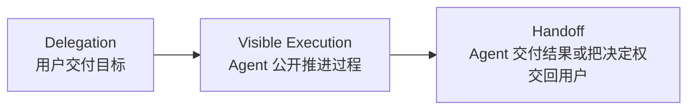
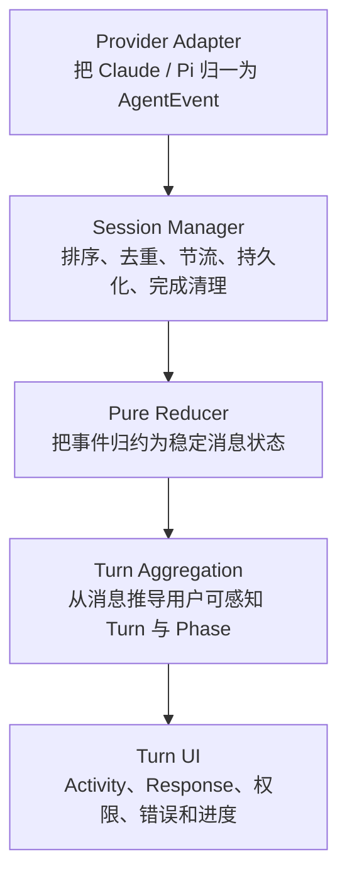
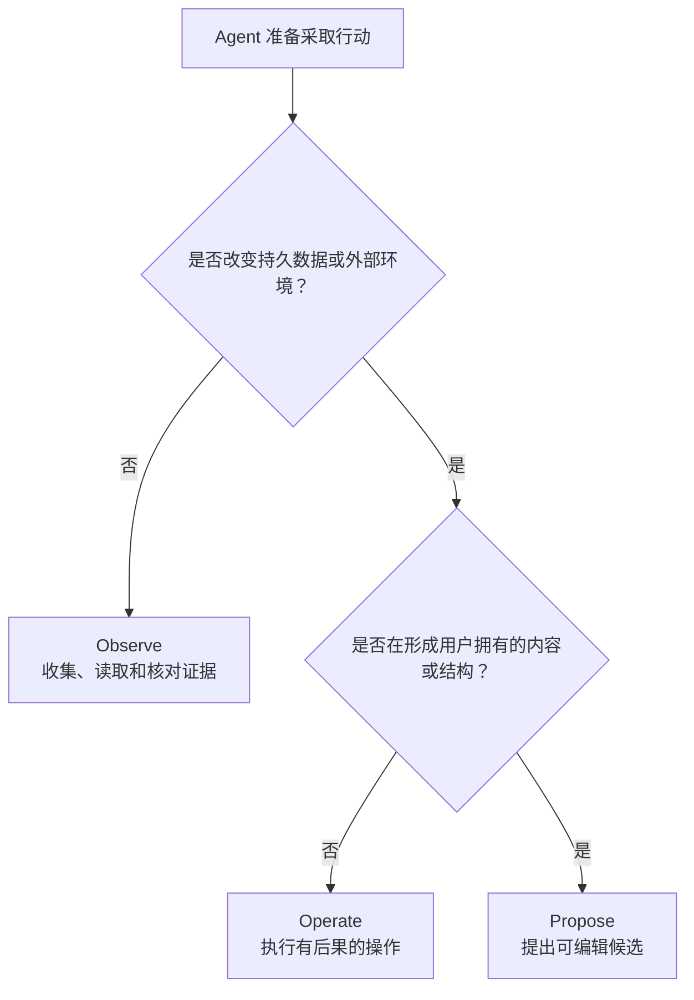
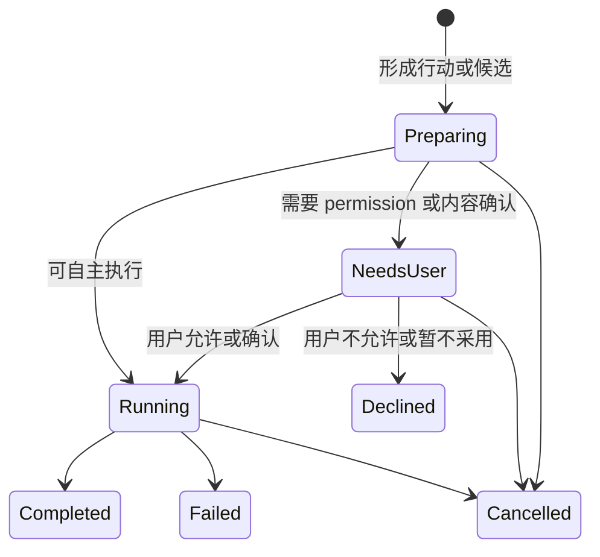
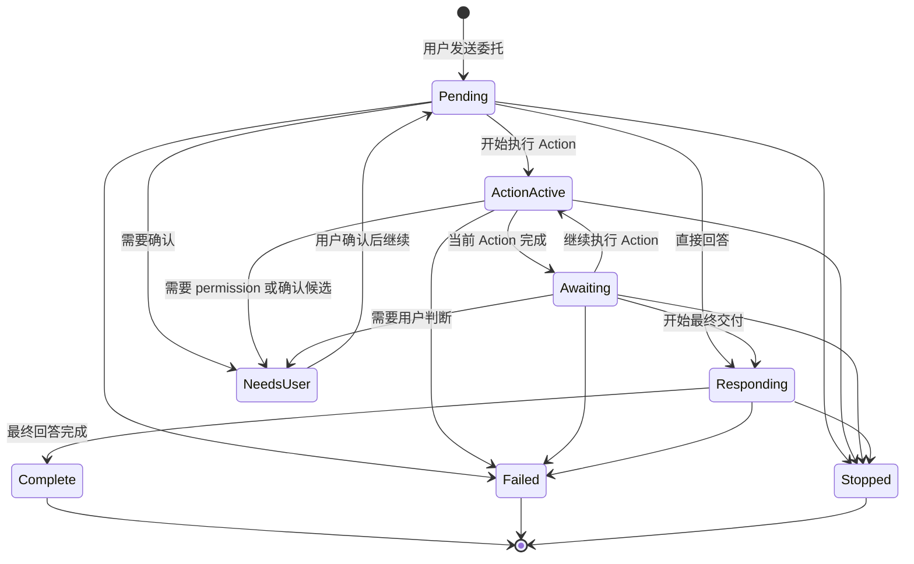

# Craft Agents 的 Agent Chat 体验机制与核心心智

> 状态：Research Complete  
> 调研对象：[craft-ai-agents/craft-agents-oss](https://github.com/craft-ai-agents/craft-agents-oss)  
> 固定版本：[`a60ebc1`](https://github.com/craft-ai-agents/craft-agents-oss/tree/a60ebc1a5a7cb0a6af7a77d5eed0512c5fc07658)  
> 面向范围：Reflecta Agent 对话的 UX 原则、UI 表达与后续实现决策

## 本文的组织逻辑

本文采用“**核心心智 → UX 机制 → UI 表达 → 底层保障 → Reflecta 取舍**”的递进结构。

原因是 Agent Chat 的体验问题不能从 spinner、tool card 或动画单点出发。用户首先需要形成稳定的协作心智；UX 再定义一次委托如何连续推进、谁拥有下一步行动权、异常如何恢复；UI 只是把这些关系表达出来；最后才是事件协议、状态归约和测试如何保证承诺不会被流式事件破坏。这样的顺序可以避免把 Craft Agents 的视觉样式误当成它真正有效的原因。

---

## 结论先行

Craft Agents 最值得借鉴的不是某一个 tool call 组件，也不是“thinking”动画，而是一套完整的 Agent 工作回合模型：

> **用户发出的不是一条等待回复的消息，而是一次工作委托；界面需要持续呈现这次委托正在如何被接住、推进、等待、交还。**

它把一次用户可感知的 Agent 回合组织为三个阶段：



这套体验成立，依赖三个不变量：

1. **一次用户请求，在感知上始终是一段连续的 Agent Turn。**  
   SDK 可能经历多轮 assistant、tool、assistant 循环，但这些内部边界不能把用户的委托切碎。

2. **只要回合没有结束，界面就必须明确谁正在负责下一步。**  
   Agent 在调用工具、整理结果、等待授权，或用户需要作决定，都不能出现“什么也没发生”的责任真空。

3. **Provider 和流式事件的复杂性不能泄漏成用户理解成本。**  
   重复事件、乱序结果、中间文本、SDK turn、tool payload 是实现事实，不是产品结构。

因此：

- Tool Call 只是实现事件；用户真正操作和理解的单位应该是 **Agent Action**。它既要留下可审计的工作证据，也要说明动作的意图、对象、影响、结果和当前球权。
- Thinking 的产品含义是“Agent 仍在承担工作、当前正在做什么”，不是展示隐藏的思维链。
- Loading 的产品含义是“解释时间花在哪里、下一步由谁推进”，不是一个通用转圈。
- Final Response 的产品含义是“一次委托的交付”，不是活动日志末尾的另一条 assistant message。

对 Reflecta 来说，这套心智还必须增加一条产品边界：

> **Reflecta Agent 是 thinking partner 与 bounded executor，不是替用户形成个人理解的 autonomous worker。**

Agent 可以检索、比较、澄清、追问、提出候选方案；但涉及 Understanding、Connection 和知识库意义结构的变更，必须由用户理解、选择、编辑并确认。

---

## 1. Agent Chat 交互体验的核心心智

### 1.1 从“消息交换”切换到“委托—执行—交付”

传统 Chat 的默认模型是：

```text
用户消息 → 等待 → assistant 消息
```

这个模型默认响应是一次性的，等待过程没有产品意义。但 Agent 的一次响应可能包含：

- 判断接下来需要做什么；
- 调用一个或多个工具；
- 并行或串行等待外部系统；
- 根据结果调整路径；
- 请求用户授权或补充信息；
- 整理证据；
- 生成最终答复；
- 失败、中止或恢复。

如果仍把这些内容表现成平铺的 message 列表，用户会被迫自己重建任务状态：

- 这几个 tool call 是不是同一件事？
- 工具已经完成，Agent 为什么还没有回复？
- 现在是卡住了，还是在整理答案？
- 我可以继续输入吗？
- 这是最终结论，还是过程中的一句话？
- Agent 是在等待我，还是我应该继续等待它？

Craft Agents 解决这些问题的方式，是把“消息”降为底层事件，把“用户可感知的工作回合”提升为首要交互单位。

### 1.2 核心交互单位是 User-perceived Turn

Craft 的 [`turn-utils.ts`](https://github.com/craft-ai-agents/craft-agents-oss/blob/a60ebc1a5a7cb0a6af7a77d5eed0512c5fc07658/packages/ui/src/components/chat/turn-utils.ts) 明确不按 SDK 的 `turnId` 划分视觉回合，而是把：

> 一条用户消息之后、下一条用户消息之前，直到最终 assistant response 的所有活动，聚合成同一个用户可感知回合。

也就是说，下面这串实现事件：

```text
user
assistant commentary
tool start
tool result
assistant commentary
tool start
tool result
assistant final
```

在用户眼里不是八条消息，而是：

```text
用户的一次委托
└── Agent 的一次工作回合
    ├── Activity：过程说明与 Agent Actions
    ├── Decision / Candidate：需要用户接球的行动
    └── Response：最终交付
```

这个转换很关键。它让 UI 围绕“这件事做到哪里了”组织，而不是围绕“协议先后吐出了什么”组织。

### 1.3 “球权”比“消息角色”更重要

Agent Chat 的每一时刻，都应该能回答一个问题：

> **现在谁拥有下一步行动权？**

可以把它理解为协作中的“球权”：

| 当前状态                       | 球权             | 用户应该理解什么                         |
| ------------------------------ | ---------------- | ---------------------------------------- |
| 用户编辑输入                   | 用户             | 任务尚未交付                             |
| 请求已发送、Agent 尚未产生动作 | Agent            | Agent 已接住任务，正在决定下一步         |
| 工具执行中                     | Agent / 外部系统 | Agent 正在推进，有明确工作对象           |
| 工具完成、最终回复尚未开始     | Agent            | Agent 正在读取结果、决定下一步或组织交付 |
| 请求授权或确认                 | 用户             | Agent 已暂停，必须由用户决定             |
| 最终回复流式生成               | Agent            | 正在形成交付，内容尚未稳定               |
| 完成                           | 用户             | Agent 已交还控制权，可检查、追问或继续   |
| 失败 / 中止                    | 用户             | 当前推进已停止，需要重试、调整或结束     |

Craft 的强项不在于每种状态都有复杂 UI，而在于它尽量不让球权变得模糊。

### 1.4 Agent Chat 的体验承诺

一个可靠的 Agent Chat，实际向用户做出了四层承诺：

1. **接收承诺**：你的委托已经被系统可靠接住。
2. **过程承诺**：在完成之前，我会告诉你工作仍在推进、等待什么或需要你做什么。
3. **权限承诺**：涉及敏感或不可逆动作时，不会用“正在处理”掩盖等待授权。
4. **交付承诺**：过程材料和最终结果会被明确区分，最终结果可以稳定阅读和追溯。

Loading、thinking、tool call 都不是独立功能，它们共同服务于这四层承诺。

---

## 2. UX 与 UI 应该如何分工

用户提出的两块可以明确这样划分：

### 2.1 UX 决定“交互关系”

UX 负责定义：

- 一次 Agent Turn 从哪里开始、在哪里结束；
- 当前是谁在行动；
- 什么算进展、等待、阻塞、完成；
- 中间过程与最终答复是什么关系；
- 每个 Agent Action 会造成什么后果、谁拥有最终判断权；
- 用户何时可以停止、重试、补充、确认；
- 权限和失败如何恢复；
- 页面刷新或事件乱序后，用户看到的状态是否仍可信。

UX 的交付物不是某个组件，而是一套用户可理解的状态与行为契约。

### 2.2 UI 决定“如何让关系一眼可见”

UI 负责表达：

- Turn 的视觉边界；
- Activity 与 Response 的层级；
- 当前 phase 的文案、图标和轻量动效；
- Action、Outcome、Decision、Candidate 与 Receipt 如何渐进展开；
- 最终响应何时出现、如何保持阅读稳定；
- 授权、失败、中止如何获得足够但不过度的视觉权重。

UI 的评价标准不是“看起来像 Agent”，而是：

- 用户是否能在一眼内判断当前状态；
- 默认界面是否安静；
- 需要核实时能否追溯；
- 动态内容是否会造成跳动或误读；
- 过程信息是否抢走最终结果的阅读焦点。

### 2.3 UX—UI 对照

| UX 问题                | Craft 的 UI 表达                                 |
| ---------------------- | ------------------------------------------------ |
| 一次请求是否保持连续   | 一个 Turn Card 承载整次工作                      |
| Agent 是否还在负责     | Turn phase + 持续可见的进度提示                  |
| Agent 采取了什么行动   | 一个可折叠 Activity 区域中的语义化 tool activity |
| 工具结束后为何还没回答 | `awaiting` 状态填补无工具、无文本的间隙          |
| 哪部分是最终结果       | 独立的 Response 区域                             |
| 是否需要用户决定       | 内联 permission / credential form 替代普通等待态 |
| 过程太多怎么办         | 默认摘要，详情按需展开；长列表限制高度           |
| 用户滚动阅读时怎么办   | 只在接近底部时自动跟随                           |
| Agent 工作时能否干预   | stop；输入区仍可编辑；支持排队或 steer           |
| 出错后怎么办           | 结构化错误、重试和明确终止状态                   |

---

## 3. Craft Agents 如何构造一次可靠的 Agent Turn

Craft 的体验不是由单个 React 组件“模拟”出来的，而是由五层共同保证：



### 3.1 Provider Adapter：先抹平模型差异

Craft 没有让 UI 直接理解 Claude Agent SDK 或 Pi SDK 的原始事件。

[`base-event-adapter.ts`](https://github.com/craft-ai-agents/craft-agents-oss/blob/a60ebc1a5a7cb0a6af7a77d5eed0512c5fc07658/packages/shared/src/agent/backend/base-event-adapter.ts)、[`claude/event-adapter.ts`](https://github.com/craft-ai-agents/craft-agents-oss/blob/a60ebc1a5a7cb0a6af7a77d5eed0512c5fc07658/packages/shared/src/agent/backend/claude/event-adapter.ts) 和 [`pi/event-adapter.ts`](https://github.com/craft-ai-agents/craft-agents-oss/blob/a60ebc1a5a7cb0a6af7a77d5eed0512c5fc07658/packages/shared/src/agent/backend/pi/event-adapter.ts) 先把不同 Provider 的事件归一为统一的 [`AgentEvent`](https://github.com/craft-ai-agents/craft-agents-oss/blob/a60ebc1a5a7cb0a6af7a77d5eed0512c5fc07658/packages/core/src/types/message.ts)。

特别重要的是，它在 Provider 边界就判断 assistant 文本的用途：

- 如果这段文本之后进入 `tool_use`，则 `text_complete.isIntermediate = true`；
- 如果 stop reason 表示正常结束，则它是最终文本。

这避免了 UI 仅凭“最后一段文本”猜测它到底是过程说明还是最终交付。

Craft 的 UI 事件中也没有把原始 hidden chain-of-thought 当作一种需要展示的内容。它公开的是可面向用户的 text、status、tool、permission、error、plan 等事件，而不是把模型内部推理逐字直播。

### 3.2 Session Manager：把流式不确定性变成有序事实

[`SessionManager.ts`](https://github.com/craft-ai-agents/craft-agents-oss/blob/a60ebc1a5a7cb0a6af7a77d5eed0512c5fc07658/packages/server-core/src/sessions/SessionManager.ts) 是体验可靠性的核心边界。

它承担的职责包括：

- 消息先持久化并同步 flush，再向发送端确认接收；
- 为事件补充权威 ID 与时间戳；
- 对 `tool_start` 去重；
- 容忍先收到 `tool_result`、没有收到对应 start 的情况；
- 在 `text_complete` 前先 flush 尚未发出的 delta；
- 把高频文本 delta 批处理到约每秒 20 次 UI 更新；
- 对持久化的超大 tool result 做长度上限保护；
- 统一处理结束、错误、中止、未读状态和 queued message replay；
- Provider 支持时，允许处理中继续 steer；否则将消息排队并按 FIFO 重放。

这层设计表达了一个重要原则：

> **流式事件是可能重复、延迟、乱序和中断的传输材料；UI 状态必须由一个负责排序与收口的边界生成。**

如果没有这一层，再漂亮的 loading 和 tool UI 也会在重试、刷新、并发或异常时失去可信度。

### 3.3 Pure Reducer：状态变化可重放、可测试

Renderer 侧的 [`event-processor/processor.ts`](https://github.com/craft-ai-agents/craft-agents-oss/blob/a60ebc1a5a7cb0a6af7a77d5eed0512c5fc07658/apps/electron/src/renderer/event-processor/processor.ts) 和对应 handlers 使用纯归约方式消费事件。

这意味着：

- 输入是旧状态与一个事件；
- 输出是新状态；
- 不把网络请求、计时器或 DOM 副作用混进归约逻辑；
- 相同事件序列可以重放；
- 重复事件、权威 message ID 替换、complete / error / interruption 的 fail-safe 可以单独测试。

纯 reducer 不只是工程洁癖。它直接决定历史恢复后能否重建与实时阶段一致的界面。

### 3.4 Turn Aggregation：从协议消息恢复用户意图

事件归约得到的仍然是 message。Craft 再通过 `turn-utils.ts` 做一层面向用户的语义聚合：

- 用户消息开启一个新 Turn；
- 其后的 tools、intermediate commentary 和 status 进入 Activity；
- 最终 assistant response 独立出来；
- 隐藏消息被过滤；
- 时间顺序被稳定化；
- child tasks 可以聚合；
- phase 由现有事实推导，而不是额外存一份易过期的状态。

这层是 Craft 从“事件日志”变成“Agent 工作界面”的关键。

### 3.5 Turn UI：把一次工作压缩成可扫描的结构

[`TurnCard.tsx`](https://github.com/craft-ai-agents/craft-agents-oss/blob/a60ebc1a5a7cb0a6af7a77d5eed0512c5fc07658/packages/ui/src/components/chat/TurnCard.tsx) 以一个 Turn 为单位呈现：

- Activity：过程说明、工具调用、状态、错误；
- Response：最终回答；
- 计划、授权等需要独立决策的内容；
- 当前工作阶段。

即使一个 Turn 内有上百个步骤，默认视图也先给一个摘要，而不是把所有事件直接展开。详情仍然可以检查，但不会占据对话主视图。

---

## 4. Tool 是实现事实，Agent Action 才是交互单位

Craft 证明了 tool event 不应该以技术日志的形式直接暴露给用户。但从 Reflecta 的价值主张继续往下推，只把 tool call 改写成一行语义摘要仍然不够。

真正稳定的第一性原理是：

> **用户不关心 Agent 调用了哪个函数，而关心 Agent 为完成委托采取了什么行动、行动会造成什么后果，以及自己是否需要作决定。**

因此，本节先记录 Craft 已经解决了什么，再给出 Reflecta 应该进一步采用的 Agent Action 心智。后者是基于 Craft 机制和 Reflecta 产品边界得到的设计推论，不是对 Craft 当前 UI 的逐字复述。

### 4.1 为什么 Tool Call 不是正确的产品抽象

`tool.started`、`tool.completed`、函数名、参数和返回值都属于执行协议。它们能帮助程序恢复状态，却不能直接回答用户的问题：

1. Agent 为什么要做这一步？
2. 它正在对什么对象做什么？
3. 这是只读观察，还是会改变数据或外部环境？
4. Agent 可以自行继续，还是必须由用户批准或确认？
5. 完成之后得到了什么有用结果？
6. 失败后 Turn 会继续，还是已经停止？

如果 UI 仍以“调用名称 + 运行状态 + JSON 详情”为中心，即使样式更漂亮，用户仍然在阅读一份开发者日志。

### 4.2 Craft 已经完成的关键转换

Craft 把 tool call 转成语义化 activity row：

- 用人类可理解的动作名称替代底层事件名；
- 用路径、资源名或目标对象形成摘要；
- 用 pending / executing / completed / error / backgrounded 表达状态；
- 默认只展示摘要；
- 将输入、输出、diff 或完整细节放入按需展开的 overlay；
- 把同一 Turn 的多个 activity 聚合到一个区域；
- 步骤很多时限制区域高度，避免挤压最终响应。

这个转换解决了“技术事件如何变成可扫描工作证据”。但 Reflecta 还有一层更强的约束：有些动作只是在读取证据，有些会改变系统，有些则试图把内容沉淀成用户的个人理解。三者不能只靠同一种 tool row 加一个 approval badge 区分。

### 4.3 Action 由三个用户相关变量决定

一个 action 应该根据三个维度设计，而不是根据 `toolName` 设计。

#### 后果：行动是否改变世界

- 只读取、检索、比较已有信息；
- 改变 Reflecta 数据、文件、命令或外部系统；
- 删除或覆盖已有内容，形成不可逆或高成本后果。

#### 所有权：谁有权作最终判断

- Agent 可以在委托范围内自行完成；
- 用户只需要授予一次操作权限；
- 用户必须判断候选内容是否准确表达自己的理解。

#### 注意力：现在是否需要用户接球

- Agent 正在自主推进，用户只需知道进度；
- Action 正等待用户决定，Turn 已暂停；
- Action 已完成、拒绝或失败，只需作为可追溯 receipt 保留。

后果、所有权和注意力共同决定 UI。`readonly`、`approval` 只是底层策略结果，不足以直接决定用户界面。

### 4.4 Reflecta 的三种 Action Mode

按照“是否改变状态”和“谁拥有最终判断权”两步判断，可以得到三个互斥的用户模式：



| Action Mode | 用户心智                                     | Reflecta 示例                                                                                    | 默认权限                          | 主要 UI                       |
| ----------- | -------------------------------------------- | ------------------------------------------------------------------------------------------------ | --------------------------------- | ----------------------------- |
| `observe`   | Agent 正在收集完成任务所需的证据             | `domain_list`、`understanding_get`、`context_get`、`retrieve_knowledge`、`graph`、附件与网页读取 | 委托范围内自动执行                | Activity Row                  |
| `operate`   | Agent 将改变系统或外部环境                   | Bash、文件写入、删除 Understanding / Context / Domain                                            | 根据风险策略自动或请求 permission | Activity Row 或 Decision Card |
| `propose`   | Agent 提出一个用户可以采用、修改或放弃的候选 | 创建 / 更新 Understanding、Context、Domain，未来的 Connection                                    | 永远不能自动成为用户的个人沉淀    | Candidate Card                |

这里有两个重要结论：

- `operate` 不等于一定 approval。低风险操作可以自动执行，高风险或越界操作才需要 permission。
- `propose` 不等于高风险工具。即使技术上容易回滚，只要它试图表达或组织用户的个人理解，就必须让用户参与内容判断。

删除动作属于 `operate`，因为它要求用户判断后果，而不是判断一段候选内容是否表达自己。创建或更新知识对象属于 `propose`，因为用户应该能在确认前修改候选。

### 4.5 每个 Action 的共同语法

无论 mode 如何，用户层的 Action 都应尽量回答同一组问题：

| 字段      | 回答的问题         | 示例                                            |
| --------- | ------------------ | ----------------------------------------------- |
| Intent    | 为什么现在做这一步 | 为了核对这条观点是否已有相关理解                |
| Verb      | Agent 做了什么     | 检索、读取、比较、创建、更新、删除、执行        |
| Target    | 对什么对象         | 「Agent Chat 核心心智」、3 个 Context、某条命令 |
| Impact    | 会发生什么变化     | 只读；新增 Context；覆盖正文；删除 4 条关联内容 |
| Lifecycle | 进行到哪里         | 运行中、需要你决定、保存中、完成、放弃、失败    |
| Outcome   | 得到了什么         | 找到 12 条，采用 3 条；已创建；没有匹配结果     |
| Details   | 如何核验           | 查询参数、来源、diff、命令、原始结果、错误      |

不是每个 Action 都要把七项同时铺开。默认视图只显示完成当前判断所需的信息：

- Agent 自主推进时：Verb + Target + Lifecycle；
- Action 完成后：Verb + Outcome；
- 等待 permission 时：Intent + Impact + 预览 + 决策；
- 等待确认候选时：候选内容 + 依据 + 可编辑范围 + 决策；
- 出错时：失败点 + 影响 + 是否继续。

这是一套信息优先级，不是一张字段齐全的表单。

### 4.6 Action 的渐进披露

Action 信息仍然遵循三层结构，但层级名称需要从 Tool 提升为 Action：

| 层级                 | 默认状态       | 内容                                           |
| -------------------- | -------------- | ---------------------------------------------- |
| Turn Activity 摘要   | 始终可见       | 当前行动，或“完成了 N 个步骤”                  |
| Action Row / Receipt | 折叠或有限展开 | 动作、对象、状态和结果摘要                     |
| Action Details       | 用户主动打开   | 依据、影响、diff、输入、输出、错误与技术元数据 |

这套层级同时满足两类需求：

- 大多数时候，用户只需要知道 Agent 没有失联、当前在做什么、得到了什么；
- 出现错误、敏感操作或需要验证时，用户可以追到底层证据。

### 4.7 Action 生命周期必须区分“执行失败”和“用户不采用”

统一的用户生命周期可以表达为：



其中：

- `Declined` 是正常决策结果，不是错误；
- `Failed` 表示已经尝试执行，但没有得到预期结果；
- `Cancelled` 表示整个 Turn 或行动被终止；
- `NeedsUser` 表示球权已经在用户手里，不能继续显示普通 loading；
- `Preparing` 只在候选内容尚未形成完整可判断单元时使用。

### 4.8 四种视觉形态承担不同注意力

Action 不是永远固定成一张卡片。同一个 Action 应随球权和生命周期改变视觉权重。

#### Activity Row：Agent 正在自主推进

适用于：

- `observe`；
- 无需审批的 `operate`；
- 尚未要求用户介入的运行中 Action。

它位于 Turn 的 Activity 中，默认紧凑：

```text
✓ 检索相关理解    找到 12 条，采用 3 条
✓ 读取两个 Context 已获得所需材料
```

#### Decision Card：用户授予操作权限

适用于需要 permission 的 `operate`。它必须在默认视图中完整回答：

- 将执行什么；
- 为什么需要；
- 影响范围；
- 是否可逆；
- 命令、diff 或变更预览；
- 允许与不允许的明确后果。

用户批准后，卡片保持前景状态直到执行完成；完成后收敛为 receipt。

#### Candidate Card：用户判断和编辑候选内容

适用于 `propose`。它不只是把“确认 / 拒绝”按钮放在工具详情下，而要支持：

- 阅读候选内容；
- 查看形成依据与目标位置；
- 在确认前修改候选；
- 确认采用；
- 暂不沉淀。

对于 Understanding，按钮语义应该是“编辑”“暂不沉淀”“确认是我的理解”，而不是抽象的“批准 / 拒绝”。

#### Receipt：决策或执行结束后的审计记录

Action 一旦完成、被拒绝或失败，就不应永久以重卡片占据对话主视图。它回到 Activity，成为紧凑 receipt：

```text
✓ 已创建 Understanding「Agent Chat 的核心心智」
— 暂未沉淀候选 Context
! 执行命令失败
```

Receipt 仍可展开查看原候选、用户最终确认的版本、影响范围和执行结果。

### 4.9 Readonly Action 也必须重新设计

只读不代表只需显示“执行成功”。它最重要的是说明获取了什么证据：

- “检索知识完成”不如“找到 12 条相关理解，采用 3 条”；
- “读取 Context 完成”不如“读取了 2 个相关 Context”；
- “搜索网页完成”不如“查看了 5 个来源，其中 2 个用于回答”；
- 没有结果应该明确显示“没有找到匹配内容”，而不是一个绿色完成状态。

因此 readonly redesign 的重点不是增加卡片，而是把 `output` 转成对当前委托有意义的 Outcome。

### 4.10 Approval 不能把两种用户判断混成一个按钮

Permission 和 authorship 是两类不同决定：

| 决定               | 用户在判断什么                 | 合适的动作文案             |
| ------------------ | ------------------------------ | -------------------------- |
| Permission         | 是否允许 Agent 产生某个后果    | 允许执行 / 不允许          |
| Candidate adoption | 候选内容是否准确表达并值得沉淀 | 编辑 / 暂不沉淀 / 确认采用 |

如果两者都使用“确认 / 拒绝”，用户无法分辨自己是在批准技术动作，还是在承认某段内容属于自己的理解。

### 4.11 Agent Action 的体验底线

- 不用裸 JSON 充当默认界面。
- 不把每个 tool event 都升级成和最终回答同等重量的消息。
- 不用 tool name 决定视觉，而用后果、所有权和当前注意力决定。
- readonly action 必须显示有意义的 outcome，而不只是“完成”。
- permission 必须展示影响与预览。
- personal knowledge candidate 必须允许用户修改后确认。
- 用户拒绝或暂不采用不是错误。
- pending decision 必须停止普通 loading，明确球权在用户。
- action 完成后收敛成 receipt，不能让历史对话堆满重卡片。
- 技术细节可以隐藏，但不能不可追溯。

---

## 5. Thinking：展示责任与进展，不展示“脑内直播”

### 5.1 用户真正需要的不是思维链

用户看到“Thinking”时，通常在确认四件事：

- 系统是否已收到请求；
- Agent 是否仍在工作；
- 当前在推进哪一类事情；
- 是否需要自己介入。

这是一种协作状态需求，不等于需要知道模型的隐式推理步骤。

公开原始 chain-of-thought 还会带来额外问题：

- 内容可能是试探性的，容易被误认为结论；
- 逐 token 变化造成强烈视觉噪声；
- 表述可能与最终行为不一致；
- 用户难以区分“模型自言自语”和“面向我的说明”；
- 不同 Provider 是否提供 reasoning、提供何种 reasoning 并不稳定。

### 5.2 Craft 的实际做法

Craft 的统一 UI 事件以面向用户的 intermediate text、status、tool activity 为主，没有依赖一个通用的 `reasoning_delta` 来构造体验。

因此它的“thinking”更接近：

- 尚未决定下一动作时的 pending；
- 工具完成后、下一动作开始前的 awaiting；
- Agent 主动公开的一句过程说明；
- final response 已有碎片但尚不足以稳定展示时的 preparing response。

这些内容都在回答“Agent 现在承担什么”，而不是声称“这就是模型完整、真实的思考过程”。

### 5.3 对 Reflecta 的术语建议

Reflecta 当前把 Pi 的 `thinking_delta` 标为“思考过程”。这个表述过强，因为它暗示：

- 内容完整；
- 内容忠实反映内部推理；
- 用户应该把它当成可靠解释。

更稳妥的产品语义是：

- 区域名称：**过程说明**；
- 进行态：**正在梳理**、**正在检查相关内容**；
- 工具后间隙：**正在整理结果**；
- 不承诺这是完整思维链；
- 默认折叠，不抢占最终答复。

如果 Provider 明确给出 reasoning，Reflecta 仍应把它视为低承诺的过程材料，而不是个人理解或最终结论。

---

## 6. Loading：不是动画类型，而是时间解释

### 6.1 一个通用 spinner 为什么不够

“正在加载”只说明页面没结束，却没有说明：

- 请求是否已经被接收；
- Agent 还是外部工具在工作；
- 是否正在等待授权；
- 是否正在生成最终结果；
- 是否发生了停滞。

Agent 回合越长，这种模糊越会被理解为不可靠。

### 6.2 Craft 区分的等待语义

Craft 在不同上下文使用不同等待表达：

| 上下文             | 用户心智                   | 表达重点                 |
| ------------------ | -------------------------- | ------------------------ |
| 加载历史           | 正在读取已有记录           | 内容尚未进入当前会话     |
| Turn pending       | Agent 已接住请求           | 正在决定或准备下一步     |
| Tool active        | 具体工作正在执行           | 工具、对象和执行状态     |
| Awaiting           | 上一步完成，Agent 仍负责   | 正在读取结果、决定下一步 |
| Preparing response | 已开始形成回答但首段不稳定 | 即将交付，不展示碎片     |
| Response streaming | 最终回答正在生成           | 内容已可阅读但未完成     |
| Background task    | 工作转入后台               | 可离开当前会话，仍可追踪 |
| Permission request | 不能继续，等待用户         | 用户拥有下一步行动权     |

其中最有价值的是 `awaiting`。

### 6.3 `awaiting` 是最容易被漏掉的状态

典型事件序列是：

```text
tool completed
    ↓
Agent 读取返回值、决定是否继续调用工具、组织下一步
    ↓
下一段文本或下一个 tool start
```

中间这段时间既没有 running tool，也没有新的文本 delta。如果 UI 只根据“有没有工具在运行”或“有没有 assistant message”显示 loading，就会突然安静。

Craft 的 [`TurnPhase`](https://github.com/craft-ai-agents/craft-agents-oss/blob/a60ebc1a5a7cb0a6af7a77d5eed0512c5fc07658/packages/ui/src/components/chat/turn-utils.ts) 特意定义 `awaiting` 来覆盖这个间隙。它不是一个后台协议状态，而是从“Turn 仍在运行、所有已知工具都完成、尚未开始最终响应”推导出的用户感知状态。

这是 Craft 保证连续性的关键细节之一。

### 6.4 首段响应缓冲

Craft 没有在 final response 收到第一个 token 时立刻渲染正文。

`TurnCard.tsx` 使用一个短暂缓冲窗口：

- 最短约 500ms；
- 最长约 2500ms；
- 中间根据英文单词数量、句法结构等条件决定是否释放；
- 缓冲期间显示“Preparing response”。

目的不是让系统显得更慢，而是避免：

- 只出现一两个词；
- Markdown 结构尚未闭合；
- Activity 区刚收起，Response 又立即抖动；
- 用户把一个短碎片误认为完整答复。

这个机制值得借鉴，但 Craft 的英文单词阈值不能直接搬到中文。中文需要基于字符数、标点、换行或结构边界重新定义。

### 6.5 Loading 的 UI 原则

Craft 的 [`LoadingIndicator.tsx`](https://github.com/craft-ai-agents/craft-agents-oss/blob/a60ebc1a5a7cb0a6af7a77d5eed0512c5fc07658/packages/ui/src/components/ui/LoadingIndicator.tsx) 本身只是一个轻量的 3×3 CSS 动画，并提供 `role="status"` 等可访问性语义。

重要的不是动画有多特别，而是：

- 动画只强化状态，不独自承载状态；
- 文案说明当前阶段；
- 动效局部、克制；
- 状态变化不会造成整块内容闪烁；
- 已完成内容保持稳定；
- elapsed time 只在确实有帮助的场景出现。

---

## 7. Final Response：一次委托的交付界面

### 7.1 Response 必须从 Activity 中脱离

如果过程文本、工具结果和最终回答都按时间顺序平铺，最终交付会被淹没。用户需要从日志里寻找“所以结论是什么”。

Craft 把 final response 作为 Turn 中独立、稳定的阅读区域：

```text
Activity（默认收敛）
  查找并处理了 5 个步骤

Response（主要阅读对象）
  这是基于上述工作的最终回答……
```

Activity 证明工作如何完成，Response 承担交付。两者相关，但视觉责任不同。

### 7.2 Response 的稳定性

一个好的 Response 区域需要：

- 首段达到最小可读单位后再出现；
- 出现后位置稳定；
- streaming 与 complete 有轻微但清晰的状态差异；
- 完成后不保留抢眼动画；
- 错误或中止时保留已经生成的内容，同时说明它不完整；
- 历史恢复后与实时完成状态一致。

### 7.3 Turn 完成后，视觉焦点要交回内容

Agent 工作中，状态比内容更重要；Agent 完成后，内容比状态更重要。

因此 UI 权重应随 phase 改变：

- 执行中：Activity header 和当前动作可见；
- 等待用户：授权或候选决策成为焦点；
- 已完成：Activity 收敛，Response 成为主角；
- 失败：失败点与恢复动作成为焦点。

这就是“球权”在视觉层面的体现。

---

## 8. 控制、权限与恢复如何补全体验闭环

### 8.1 Stop 是必要的用户控制

长回合必须允许停止。停止后的要求不是只终止请求，还包括：

- 明确标记当前 Turn 已停止；
- 不再显示“正在处理”；
- 保留已经获得的过程和部分响应；
- 恢复输入能力；
- 给用户继续、修改或重试的入口。

### 8.2 输入框在工作中仍有价值

Craft 在 Agent 工作时仍允许用户编辑输入：

- 发送按钮切换成 stop；
- Provider 支持时，新消息可 steer 当前执行；
- 否则进入可见队列；
- optimistic queued bubble 维持最短展示时间，避免一闪而过。

这是一项高级能力，不是所有 Agent Chat 的首要条件。它的前提是产品确实需要长时、多任务协作，而且底层能明确处理 steer、queue、cancel 的顺序。

Reflecta 当前“可以继续编辑，但 busy 时不能发送；发送按钮改为停止”已经覆盖最基本的控制需求。没有真实用户需求前，不需要复制完整的中途排队系统。

### 8.3 Permission 与 Candidate 都是球权切换，但不是同一种判断

Craft 把权限设计为 Explore / Ask to Edit / Auto 等明确模式，并用结构化内联请求呈现：

- Agent 想做什么；
- 为什么需要做；
- 具体命令或动作预览；
- 用户允许、拒绝或调整的动作。

请求权限时，普通 composer 会被决策表单替代或让位。这告诉用户：Agent 没有卡住，而是已经把球交给你。

这与 Reflecta 的候选 proposal / confirm 机制高度相关，但不能直接等同：

- 对 Bash、删除或外部副作用，用户是在授予 permission；
- 对 Understanding、Context、Domain 与未来 Connection 的创建或更新，用户是在判断并共同编辑候选；
- 两者都会进入 `needs-user`，但需要不同的说明、动作文案和可编辑能力。

一旦等待用户决定，就必须优先表现为“需要你决定”，不能继续显示成 Agent 正在思考。对于候选内容，只有“确认 / 拒绝”仍不够；如果用户拥有最终意义，UI 就必须给用户修改后确认的路径。

### 8.4 错误必须说明回合是否结束

错误至少需要区分：

- 某个工具失败，但 Agent 会改用其他方法继续；
- 权限被拒绝，Agent 可以调整；
- Provider 或会话失败，Turn 已终止；
- 用户主动停止；
- 页面刷新后发现未完成回合。

错误卡片的样式不是重点；重点是错误之后谁拥有下一步，以及已有成果是否保留。

---

## 9. Craft 如何通过工程机制保证体验，而不是“尽量表现”

### 9.1 状态不变量

Craft 的实现可以归纳出以下状态不变量：

| 不变量                            | 工程保障                                                        |
| --------------------------------- | --------------------------------------------------------------- |
| 同一请求只形成一个用户可感知 Turn | `turn-utils` 按用户消息边界聚合，不信任 SDK turn                |
| 文本用途可判定                    | Provider adapter 在 stop reason 已知时标记 intermediate / final |
| 不丢最后一段 delta                | `text_complete` 前 flush                                        |
| 不因重复 tool start 产生重复行    | SessionManager 和 reducer 去重                                  |
| 乱序 result 仍可显示              | reducer 容忍缺少 start                                          |
| 回合结束后不残留 running 状态     | complete / error / interrupted 统一 fail-safe                   |
| 历史恢复与实时状态一致            | 持久事件 + pure reducer 可重放                                  |
| 高频流不拖垮 UI                   | delta 批处理                                                    |
| 工具结束后的静默不被误认为完成    | phase 派生出 `awaiting`                                         |
| final response 不以碎 token 开场  | 首段缓冲                                                        |

### 9.2 Phase 应该派生，不应该到处手动设置

Craft 的 phase 是根据当前 Turn 的事实计算的：

- 是否有运行中的工具；
- 是否还在处理；
- 是否已经出现 final response；
- final response 是否仍在 streaming；
- 是否已完成。

这比在多个事件 handler 里手动写：

```text
status = tool-running
status = thinking
status = response
```

更可靠。手动状态很容易在错误、刷新、乱序或兼容旧数据时漏掉复位。

### 9.3 测试围绕生命周期，而不是围绕样式

Craft 的测试重点包括：

- 无工具的普通回答；
- tool active → awaiting → streaming → complete；
- 并行工具；
- 工具失败；
- intermediate commentary；
- 没有 final response 的结束；
- reload、race、interrupt；
- authoritative message ID 同步；
- turn grouping 的边界。

相关测试：

- [`turn-phase.test.ts`](https://github.com/craft-ai-agents/craft-agents-oss/blob/a60ebc1a5a7cb0a6af7a77d5eed0512c5fc07658/packages/ui/src/components/chat/__tests__/turn-phase.test.ts)
- [`turn-lifecycle.test.ts`](https://github.com/craft-ai-agents/craft-agents-oss/blob/a60ebc1a5a7cb0a6af7a77d5eed0512c5fc07658/packages/ui/src/components/chat/__tests__/turn-lifecycle.test.ts)
- [`turn-utils-grouping.test.ts`](https://github.com/craft-ai-agents/craft-agents-oss/blob/a60ebc1a5a7cb0a6af7a77d5eed0512c5fc07658/packages/ui/src/components/chat/__tests__/turn-utils-grouping.test.ts)

这些测试验证的是用户是否会看到连续、正确的回合，而不是 spinner 使用了什么 class。

---

## 10. Reflecta 当前已经具备什么

这次调研不能沿用 v1.0.0 时期的旧差距判断。当前 Reflecta 已经具备多项重要基础：

### 10.1 事件与状态基础

- Pi Agent Host 已将 text、reasoning、tool、approval 等事件映射为应用协议。
- `reduceAgentSessionEvent` 以纯函数归约事件。
- `agent-run-accumulator` 保留一次 Turn 内 block 的顺序并生成持久态。
- renderer 使用 `requestAnimationFrame` 合并实时事件，避免每个 delta 直接触发渲染。
- message / run / tool 具备稳定 ID 关联。

### 10.2 已有 UX 能力

- 工具调用已经有语义化摘要与详情，不再只是裸 JSON。
- reasoning、tool、proposal、text、context compaction 已形成有序 block。
- proposal 已支持预览、确认、拒绝和持久化结果，建立了“知识写入必须经过用户”的基础边界。
- 支持 stop、retry、sticky scroll、context meter。
- Agent 工作时输入框仍可编辑，发送位置切换为停止。
- UI package、Electron adapter 和 Storybook 已有清晰的模块边界。

这些能力应该复用，不需要另建一套 Agent Chat。

---

## 11. Reflecta 真正需要补齐的 UX 差距

### 11.1 缺少用户可感知的 Turn Phase

当前状态主要是 assistant message 的 `streaming / done / stopped / failed`，还不能表达：

- Agent 尚未开始动作；
- 工具正在执行；
- 工具已完成、Agent 正在整理；
- 最终响应正在生成；
- 正在等待用户确认。

结果是底层事件正确，但用户仍需要自己解释状态。

### 11.2 工具完成后存在静默间隙

当前 pending placeholder 的条件近似为：

```text
run is busy && 最后一条消息不是 assistant
```

一旦 tool block 已经创建了 assistant message，placeholder 就消失。工具完成到下一段文本之间，界面可能没有任何活动提示。

这正是 Craft 用 `awaiting` 解决的“责任真空”。

### 11.3 reasoning 的承诺过强

当前 UI 使用“正在思考 / 思考过程”，把 Provider 的 `thinking_delta` 直接提升为产品概念。它需要降级为“过程说明”，避免让用户把模型过程材料当成完整、可信的内部解释。

### 11.4 Tool 与 Proposal 仍是两套事件 UI，缺少统一 Agent Action

当前普通 tool 进入 `ToolActivityBlock`，知识写入和危险 Bash 进入 `AgentProposalCard`。两边都已有产品化摘要，但分类依据仍是底层事件类型：

- 普通 tool 主要表达“调用了什么、是否完成”；
- approval 主要表达“候选内容是什么、确认还是拒绝”；
- 同一个动作从 pending approval 到 running、completed 后，仍长期保持 proposal card 形态；
- UI 没有一套共同语法表达 Intent、Target、Impact、Outcome 和当前球权。

因此需要先建立统一的 Agent Action view model，再根据 mode 和 lifecycle 选择 Activity Row、Decision Card、Candidate Card 或 Receipt。Activity Group 是容器，不能替代 Action 本身的 redesign。

### 11.5 Readonly Tool 已有摘要，但 Outcome 仍不够任务化

当前 `agent-turn-view.ts` 已对 `domain_list`、`understanding_get`、`retrieve_knowledge`、`graph`、附件、网页和文件读取等工具提供中文名称与详情，这是可靠基础。

仍需继续从“工具完成”走向“行动得到了什么”：

- 查询命中数、读取对象数、空结果；
- 哪些结果被用于当前回答；
- 是否发现冲突、缺口或证据不足；
- 失败是否被 Agent 恢复。

并非所有 output 都能自动推导“采用了几条”，不能虚构使用情况。首版只展示由 tool output 可以确定的事实；“采用了哪些证据”需要 Provider 或 Agent 明确提供 attribution 后再展示。

### 11.6 Permission 与 Personal Knowledge Candidate 被同一个 Approval 心智混合

当前 `AgentProposalCard` 同时承载：

- 危险 Bash permission；
- Understanding / Context / Domain 的创建、更新和删除。

这些事件都需要用户接球，但判断问题并不相同：

- Bash 在问“是否允许这个后果”；
- Understanding create / update 在问“这是否准确表达我的理解”；
- Context create / update 在问“这段材料是否应该以这种方式成为我的上下文”；
- Domain create / update 在问“这是否是我认可的组织方式”；
- delete 在问“是否接受这个不可逆或高成本后果”。

UI 必须将 permission、candidate adoption 和 destructive confirmation 分开表达，不能只换标题后继续共用“确认 / 拒绝”。

### 11.7 Candidate 缺少“修改后确认”

当前 proposal decision 只有 `approve | reject`，协议命令也只有 `tool.approve` 与 `tool.reject`。

这意味着当候选 Understanding “大致正确但不是我的表达”时，用户只能：

- 原样接受；
- 完全拒绝；
- 拒绝后重新发一轮消息。

这不符合“AI 辅助形成理解、用户拥有最终表达”的价值主张。`propose` action 必须允许用户在卡片内修改候选，并将修改后的 payload 作为最终确认版本提交。编辑不是附加便利，而是 personal knowledge ownership 的必要交互。

### 11.8 已决 Proposal 仍然长期占据重卡片

当前 completed / rejected proposal 默认折叠，但仍保留完整 card shell。长对话中多次确认会积累大量同等重量的卡片。

更合理的状态变化是：

- `needs-user` 与确认后的 `running` 保持前景 card；
- `completed`、`declined`、`failed` 收敛为 Activity receipt；
- receipt 可展开查看候选、用户最终版本和执行结果。

### 11.9 缺少明确的 intermediate / final 文本语义

当前有序 text block 保留了顺序，但协议没有稳定表达某段 assistant text 是：

- 工具前的过程说明；
- 还是最终交付。

只靠 UI 猜“最后一段就是 final”在历史兼容时可用，但不应该成为长期协议。

### 11.10 Final Response 首段会立即暴露碎片

当前 final text 一有 delta 就开始渲染。短碎片、Markdown 未闭合和 Activity 到 Response 的快速切换会造成抖动。

需要一个很短、适配中文的展示缓冲，但不能延迟事件持久化，也不需要复制 Craft 的英文单词算法。

### 11.11 Proposal 等待态需要压过普通 processing

当候选方案等待用户确认时，球权已经在用户手里。此时若继续突出通用“Agent 正在处理”，会误导用户继续等待。

用户决策态必须拥有更高的 phase 优先级。

---

## 12. Reflecta 应该借鉴什么、不应该照搬什么

### 12.1 直接借鉴

- 以 user-perceived Turn 为体验单位。
- Activity 与 Response 分层。
- 从事实派生 Turn phase。
- 明确定义 tool completed 后的 `awaiting`。
- intermediate / final 在 Provider 边界分类。
- action 摘要默认简洁，详情可追溯。
- permission / proposal 表达为用户决策态，并在用户决定后收敛为 receipt。
- final response 首段做轻量缓冲。
- 自动滚动尊重用户当前阅读位置。
- 围绕生命周期、乱序、恢复和中止测试。

### 12.2 只借原则，不复制实现

- Craft 的 `TurnCard.tsx` 和 `ChatDisplay.tsx` 体量很大，Reflecta 不应复制其单体结构。
- Craft 的通用 tool / permission 表达不足以覆盖 Reflecta 对个人理解所有权的要求；需要在其原则上增加 Candidate 与可编辑确认。
- Craft 的英文单词与句法阈值不适合中文。
- 轮换式趣味状态文案不一定符合 Reflecta 安静、反思型的语气。
- elapsed timer 只有在真实等待足够长、能降低焦虑时才值得加入。
- background tasks、multi-session unread、child task 等能力应由实际场景驱动。

### 12.3 明确不照搬

- 不展示或声称展示完整思维链。
- 不让 Agent 自动写入用户的个人理解或推断关系。
- 不让 action activity 成为对话主体。
- 不把 readonly、permission 和 personal knowledge candidate 粗暴做成同一种 tool card。
- 不为状态模型引入新的依赖或一套并行 store。
- 不在没有需求证据时加入中途 steer、消息队列和后台任务系统。
- 不把编码 Agent 的 terminal、diff、command 权重直接迁移到 Reflecta。

---

## 13. Reflecta 的目标心智

综合 Craft 的机制和 Reflecta 的价值主张，目标心智应该是：

> **用户把一个探索、检索、比较或整理任务交给 Agent；Agent 通过可理解、可追溯的 Actions 安静推进；遇到系统后果时请求权限，遇到个人理解时提交可编辑候选；最后交付一个可继续理解和行动的结果。**

可以进一步压缩为六条产品原则：

1. **Turn 是委托，不是消息集合。**
2. **Tool 是协议事件，Action 才是用户单位。**
3. **过程可见，但不喧宾夺主。**
4. **状态说明责任，不虚构思维。**
5. **Permission 由用户授权，个人意义由用户编辑并确认。**
6. **实时、历史和异常状态必须讲同一个故事。**

目标 Turn 的视觉和责任结构是：

```text
Agent Turn
├── Activity
│   └── Agent Actions：自主推进的过程与已决 receipt
├── Decision / Candidate
│   └── 当前需要用户授予权限或确认内容的 Action
└── Response
    └── Agent 对整次委托的最终交付
```

### 13.1 目标生命周期



这张图是 UX 契约，不要求把每个状态持久化。实现上应优先根据 run、block、tool 和 proposal 的现有事实纯派生。

---

## 14. 用于后续设计评审的检查表

### UX 检查

- 一次用户委托是否始终形成一个连续 Turn？
- 任何非终态时，用户能否判断 Agent、外部工具还是自己拥有下一步行动权？
- tool completed 到下一动作之间是否仍有明确反馈？
- 用户能否区分过程说明、工作证据和最终交付？
- 每个 Action 是否说明了动作、对象、后果与有意义的结果？
- readonly Action 是否表达 Outcome，而不只是“执行完成”？
- permission 与 personal knowledge candidate 是否被表达成不同的用户判断？
- personal knowledge candidate 是否允许修改后确认？
- 已决 Action 是否收敛为 receipt？
- stop、failed、retry、reload 后的状态是否自洽？
- Agent 是否越过用户对个人理解和知识关系的所有权？

### UI 检查

- Activity 是否默认收敛且可追溯？
- pending Decision / Candidate 是否从 Activity 中升格为当前焦点？
- Action 结束后是否回到紧凑 Activity receipt？
- Response 是否是完成后的主视觉？
- phase 是否同时有文本语义，而不只靠颜色和动画？
- 动画是否局部、克制并支持 reduced motion？
- final response 首段是否达到最小可读单位再出现？
- 用户向上滚动时，流式更新是否会抢走位置？
- 历史态是否与实时态使用同一套组件和语义？

### 工程检查

- Provider 差异是否在 adapter 边界消化？
- intermediate / final 是否有明确协议语义？
- phase 是否由现有事实纯派生？
- tool / approval / proposal 是否统一映射到 Agent Action view，而没有强迫底层协议合并？
- 修改后确认的候选 payload 是否在主进程信任边界重新校验？
- 重复、乱序、错误和中止是否有统一收口？
- 流式高频事件是否批处理？
- 测试是否覆盖生命周期，而不是只验证 DOM 和 class？

---

## 15. 最终判断

Craft Agents 的 Agent 对话体验之所以可靠，不是因为它展示了更多过程，而是因为它把过程重新组织成了用户能够信任的工作关系：

- 底层允许复杂、流式、乱序；
- 中层把这些事实归约成连续 Turn；
- UX 始终说明球权与责任；
- UI 用 Agent Action 表达意图、后果和结果，用 Activity 收纳自主过程与 receipts，用 Decision / Candidate 承担用户接球，用 Response 承担最终交付；
- 权限、失败和恢复都延续同一套心智。

Reflecta 已经拥有 ordered blocks、语义化 tool view、proposal、纯 reducer、事件 batching、stop/retry 和 sticky scroll 等扎实基础。下一步不是重写聊天系统，而是在这些事实之上补两层用户语义：

1. **Turn 层**：phase、awaiting、Activity / Decision / Response 分层、诚实的过程术语与稳定首段交付；
2. **Action 层**：Observe / Operate / Propose、Outcome、Impact、Permission / Candidate 分流、修改后确认与已决 Receipt。

这会让 Reflecta 从“能正确显示 Agent 事件”，前进到“用户能持续理解自己与 Agent 正在如何协作”。

---

## 结构化写作自检

- [x] 结论先行，并在开头声明组织逻辑与原因。
- [x] 主线保持为“心智—UX—UI—工程保障—Reflecta 取舍”。
- [x] 同层内容按职责拆分，避免混淆 UX、UI 与协议实现。
- [x] 关键结论均给出源码机制或 Reflecta 现状作为支撑。
- [x] 明确记录适用边界、不可照搬项与价值主张约束。
- [x] 明确区分 Craft 的源码事实与基于 Reflecta 第一性原理得到的 Agent Action 设计推论。
- [x] 未将新增复杂能力包装成当前必需项。
