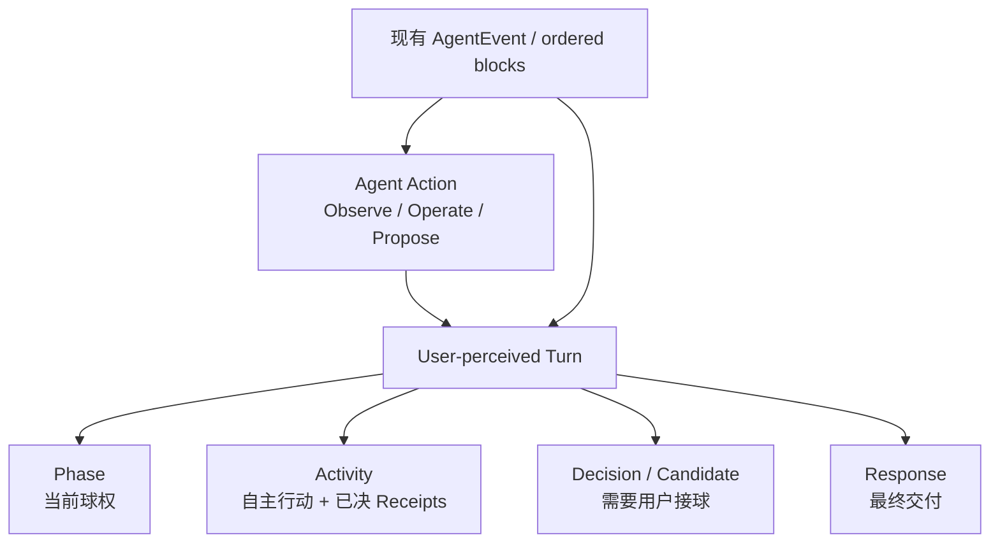
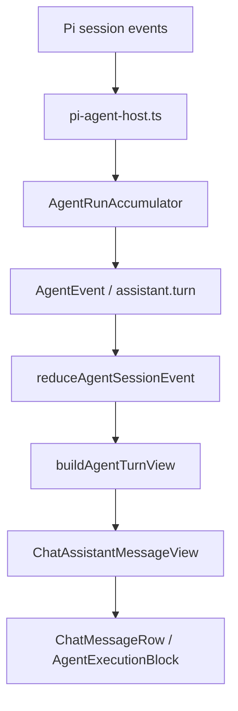
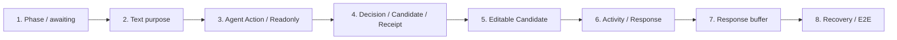

# Reflecta Agent Chat 体验改造实施计划

> 状态：Ready for Implementation  
> 关联调研：[Craft Agents 的 Agent Chat 体验机制与核心心智](./craft-agents-agent-chat-experience-research.md)  
> 目标版本：v1.3.0  
> 原则：保留当前事件流、纯 reducer、ordered blocks 与 `@reflecta/ui` 模块边界，在其上建立用户可感知的 Turn 和 Agent Action；不让底层 tool / approval 事件直接决定交互。

## 本文的组织逻辑

本文采用“**目标体验 → UX 契约 → UI 规格 → 数据与组件改动 → 纵向实施切片 → 验证与风险**”的结构。

原因是这次改造同时横跨两个产品层级：Turn 负责连续性和球权，Action 负责动作、后果、结果与用户所有权；底层又涉及 Provider event、持久态、renderer view model 和 UI。如果先按文件列任务，容易得到一批局部正确、整体仍像事件日志的改动。本文先固定 Turn 和 Action 的 UX 契约，再让 UI、数据、组件和测试共同服务这份契约；实施阶段按可独立验收的纵向切片推进，避免一次性重写 Agent Chat。

---

## 结论先行

本次不新建一套 Agent 对话架构，而是在现有实现上增加两层用户语义：



最终需要交付六个能力：

1. **连续 Phase**  
   Turn 运行期间始终显示 pending、action-active、awaiting、responding 或 needs-user，不再在工具完成后静默。

2. **明确的文本用途**  
   Provider message 结束时，根据 stop reason 标记该 text block 是 `intermediate` 还是 `response`；历史数据使用兼容推断。

3. **统一的 Agent Action**  
   将普通 tool、permission 和 personal knowledge proposal 映射为 Observe / Operate / Propose，统一表达动作、对象、影响、生命周期和结果。

4. **Activity / Decision / Response 分层**  
   reasoning、intermediate text、自主 Action 和已决 Receipt 进入 Activity；pending permission 升格为 Decision；personal knowledge proposal 升格为可编辑 Candidate；最终回答独立为 Response。

5. **用户拥有最终内容**  
   Understanding、Context、Domain 与未来 Connection 的 create / update 候选允许用户修改后确认；delete 和危险操作按影响明确请求 permission。

6. **稳定的首段交付**  
   Response 的首批碎片短暂缓冲，达到中文最小可读单位后再展示；事件照常实时归约和持久化。

以下能力明确不进入本版本：

- 中途 steer 与消息队列；
- background task 和多会话任务中心；
- elapsed timer；
- 轮换式趣味状态文案；
- raw chain-of-thought；
- 新状态管理依赖或新基础组件体系。

---

## 1. 范围与成功标准

### 1.1 本版本解决的问题

当前 Reflecta 已能正确展示 ordered text / reasoning / tool / proposal block，但仍有七类用户问题：

- 工具结束后，Agent 仍在工作，界面却可能没有任何进行提示；
- “正在思考 / 思考过程”对 Provider reasoning 的真实性作了过强承诺；
- 普通 tool 和 approval 被呈现成两套事件 UI，缺少统一的行动、后果、结果和球权语义；
- readonly tool 多数仍以“做了什么”为主，没有稳定表达“得到了什么”；
- permission 与 personal knowledge candidate 共用“确认 / 拒绝”，候选内容不能修改后确认；
- 已决 proposal 仍长期占据重卡片，多个工具也缺少一次 Turn 的工作摘要；
- 中间文本与最终回答没有稳定的协议语义，最终回答首段也会以碎片开场。

### 1.2 成功标准

完成后，以下陈述必须同时成立：

- 从用户发送请求到 Turn 终止，界面不存在责任不明的静默阶段。
- 用户能区分“Agent 正在工作”“Action 正在执行”“需要我授予权限”“需要我判断候选内容”“最终回答正在生成”“Turn 已完成”。
- readonly Action 展示可由输出证明的 Outcome，而不只是“执行完成”。
- permission 清楚展示动作后果，personal knowledge candidate 支持修改后确认。
- 同一 Turn 的自主过程和已决 actions 默认收敛为一个 Activity 区域。
- pending Decision / Candidate 成为当前焦点，处理完成后收敛为 Receipt。
- 最终 Response 是完成后的主要阅读对象。
- Decision / Candidate 等待处理时，不再用通用 processing 暗示 Agent 仍持有球权。
- 实时、刷新恢复和历史记录使用相同的 Activity / Response 语义。
- 旧历史记录无需数据库迁移即可继续显示。
- “用户拥有个人理解”从权限边界落实为可编辑的内容确认。

### 1.3 非目标

- 不增加新的 Agent tool 或 prompt 能力；只扩展现有候选确认与展示链路。
- 不重做消息列表、侧边栏或 composer。
- 不增加新的 autonomous write 权限。
- 不把所有中间事件展示出来。
- 不追求与 Craft Agents 的视觉一致。
- 不为未来可能出现的多 Provider 提前设计通用插件层。

---

## 2. 当前基线与改造边界

### 2.1 现有链路



本次沿着这条链路演进，不建立旁路：

- `pi-agent-host.ts` 继续是 Provider 语义边界；
- `AgentRunAccumulator` 继续构造持久化 ordered blocks；
- `reduceAgentSessionEvent` 继续是 renderer 的纯归约入口；
- `agent-turn-view.ts` 继续负责应用数据到 UI view model 的翻译；
- `@reflecta/ui/chat` 继续只接收产品化 view model，不读取 Electron 协议；
- `message-list.tsx` 继续负责滚动和消息列表编排。

### 2.2 需要保留的现有能力

- tool 的语义化 title、summary、details 与错误信息；
- proposal 的确认、拒绝、执行结果和实体跳转；
- context compaction receipt；
- stop、retry 和 failed / stopped 状态；
- `requestAnimationFrame` 事件批处理；
- 用户向上滚动后停止强制跟随；
- Agent 工作时 composer 可编辑、发送位置切换为 stop；
- 历史事件和实时事件共用 reducer。

### 2.3 可以删除或替换的旧逻辑

- `shouldShowPendingAssistantPlaceholder` 不再承担“整个运行态是否可见”的责任，只保留“assistant message 尚未出现前”的首个 pending fallback。
- 顶层逐个渲染 reasoning 和普通 tool block 的方式，由一个 Turn 级 Activity group 取代。
- `ToolActivityView` 与 `AgentProposalView` 不再直接成为 Turn 顶层产品模型，统一通过 `AgentActionView` 表达。
- completed / rejected proposal 不再永久保持重卡片，改为 Activity receipt。
- knowledge candidate 的 `approve | reject` 二选一升级为“编辑后确认 / 暂不沉淀”。
- “正在思考 / 思考过程”改为低承诺的过程术语。
- UI 不再仅依赖 `message.status === "streaming"` 判断应该展示何种进度。

---

## 3. UX 设计：一次 Turn 应该如何推进

### 3.1 Turn 的开始与结束

**开始条件**

- 用户消息被当前 session 接收；
- 对应 run 进入 `running`；
- 即使尚无 assistant delta，也立即进入 `pending`。

**结束条件**

- `run.completed`：进入 `complete`；
- `run.failed`：进入 `failed`；
- `run.cancelled`：进入 `stopped`；
- 有 pending Decision / Candidate 时，即使 run 的 transport 状态不活跃，用户感知 phase 仍优先为 `needs-user`。

### 3.2 User-facing Phase

在 `@reflecta/ui` 中新增：

```ts
export type AgentTurnPhase =
  | "pending"
  | "action-active"
  | "awaiting"
  | "responding"
  | "needs-user"
  | "complete"
  | "failed"
  | "stopped";
```

这是一种 UI view type，不是新增持久状态，也不需要状态机依赖。

### 3.3 Phase 派生优先级

`agent-turn-view.ts` 根据 run status 和 ordered blocks 纯派生 phase。优先级固定为：

1. 存在仍可操作的 Decision / Candidate → `needs-user`；
2. `stopped` / `failed`；
3. run 已不再运行 → `complete`；
4. trailing response 正在流式生成 → `responding`；
5. 至少一个 Action 正在运行 → `action-active`；
6. 已有 settled Action，run 仍在运行 → `awaiting`；
7. 其他运行中情况 → `pending`。

伪代码：

```ts
function deriveAgentTurnPhase(input: AgentTurnPhaseInput): AgentTurnPhase {
  if (input.hasActionableBlockingAction) return "needs-user";
  if (input.stopped) return "stopped";
  if (input.failed) return "failed";
  if (!input.running) return "complete";
  if (input.hasStreamingResponse) return "responding";
  if (input.hasRunningAction) return "action-active";
  if (input.hasSettledAction) return "awaiting";
  return "pending";
}
```

优先级表达的是球权，而不是事件时间：

- 仍可操作的 Decision / Candidate 压过 transport 的普通或历史终态；
- stop / cancel 必须先把所有 pending Actions 标记为 cancelled，不得留下可点击的旧卡片；
- terminal state 压过旧 block 残留的 running 标记；
- 只有 run 仍在运行时，settled Action 才意味着 `awaiting`。

### 3.4 每个 Phase 的行为契约

| Phase           | 球权             | 状态文案                   | Activity         | Decision / Candidate | Response             | Composer             |
| --------------- | ---------------- | -------------------------- | ---------------- | -------------------- | -------------------- | -------------------- |
| `pending`       | Agent            | 正在梳理                   | 可暂缺           | 不显示               | 不显示               | 可编辑，主操作为停止 |
| `action-active` | Agent / 外部系统 | 使用当前 Action 的语义摘要 | 当前 Action 可见 | 仅保留已存在卡片     | 不显示或保留已有部分 | 可编辑，主操作为停止 |
| `awaiting`      | Agent            | 正在整理结果               | 保留已完成摘要   | 不显示               | 尚未开始             | 可编辑，主操作为停止 |
| `responding`    | Agent            | 正在组织回答               | 默认收敛         | 不显示               | 缓冲后流式显示       | 可编辑，主操作为停止 |
| `needs-user`    | 用户             | 根据决策类型提示           | 收敛且不转圈     | 当前焦点             | 保留已有内容         | 卡片 actions 为主    |
| `complete`      | 用户             | 不显示持续状态             | 默认折叠         | 已决内容成为 receipt | 主要内容             | 正常发送             |
| `failed`        | 用户             | 回复失败                   | 保留失败证据     | 保留待处理或失败信息 | 保留未完成内容       | 重试 / 正常发送      |
| `stopped`       | 用户             | 已停止                     | 保留已有证据     | 不再可操作           | 保留部分内容         | 正常发送             |

### 3.5 文本用途

持久化 text block 增加可选字段：

```ts
type AgentTextPurpose = "intermediate" | "response";

type AgentReducedTextBlock = {
  kind: "text";
  text: string;
  purpose?: AgentTextPurpose;
  state?: "streaming" | "done" | "failed";
  error?: string;
  createdAt: string;
};
```

语义：

- `intermediate`：面向用户的过程说明，进入 Activity；
- `response`：本次 Turn 的最终交付，进入 Response；
- `undefined`：旧数据或尚未收到 Provider message completion 的实时片段。

不要把 reasoning block 改名为 text，也不要把 raw reasoning 当成 response。

### 3.6 实时未知文本的处理

在收到当前 Provider message 的 stop reason 前，trailing text 的 purpose 尚不确定。

处理规则：

1. 暂时视为“候选 Response”；
2. 进入首段缓冲；
3. 若随后完成为 `response`，按缓冲规则释放；
4. 若完成为 `intermediate` 或紧接 tool start，则移入 Activity；
5. 旧实时事件缺少 completion 时，仍用“后续出现 tool 则为 intermediate，Turn 完成时最后一段为 response”的兼容规则。

短缓冲降低了 intermediate text 在 Response 和 Activity 之间跳动的概率，但不需要为了完全消除这种可能而等到整轮完成后再展示正文。

### 3.7 历史兼容推断

旧 `assistant.turn` 没有 `purpose`。读取时使用以下规则，不回写旧记录：

- text block 后面存在普通 tool 或 approval → `intermediate`；
- completed Turn 的最后一个有效 text block → `response`；
- 其余 text block → `intermediate`；
- 没有 text 的 completed Turn 允许只有 Activity / proposal，不伪造 Response。

显式 `purpose` 永远优先于推断。

### 3.8 统一 Agent Action 模型

底层继续保留 tool 与 approval block，renderer 将它们翻译为统一的用户 view：

```ts
export type AgentActionMode = "observe" | "operate" | "propose";

export type AgentActionLifecycle =
  | "preparing"
  | "running"
  | "needs-user"
  | "completed"
  | "declined"
  | "failed"
  | "cancelled";
```

Mode 根据用户后果和所有权分类：

| Mode      | 判断规则                           | 当前工具示例                                                                                                                              | 用户表达                                                      |
| --------- | ---------------------------------- | ----------------------------------------------------------------------------------------------------------------------------------------- | ------------------------------------------------------------- |
| `observe` | 不改变持久数据或外部环境           | `domain_list`、`domain_inspect`、`understanding_list/get`、`context_list/get`、`retrieve_knowledge`、`graph`、`attachment_read`、网页读取 | Activity Row                                                  |
| `operate` | 改变系统、文件、外部环境或执行删除 | Bash、`edit`、`write`、Understanding / Context / Domain delete                                                                            | 自动执行时为 Activity Row；等待 permission 时为 Decision Card |
| `propose` | 创建或更新用户拥有的内容与组织结构 | Understanding / Context / Domain create / update；未来 Connection create / update                                                         | Candidate Card                                                |

Mode 与是否需要 approval 不相等：

- `observe` 在当前委托范围内自动执行；
- `operate` 是否 approval 由现有危险性和权限策略决定；
- `propose` 即使技术上低风险，也必须由用户检查内容；
- delete 是后果判断，因此属于 `operate`，使用 destructive Decision，不伪装成候选内容。

首版用 `actionPresentationFor(toolName)` 的显式映射完成分类，不新增注册中心、factory 或 plugin abstraction。未知普通 tool 保守映射为 `operate`；未知 approval 映射为 permission Decision，不能自动视为 personal knowledge candidate。

### 3.9 Action 的共同语义契约

`AgentActionView` 面向用户表达：

```ts
export type AgentActionView = {
  id: string;
  mode: AgentActionMode;
  lifecycle: AgentActionLifecycle;
  label: string;
  target?: string;
  intent?: string;
  impact?: {
    summary: string;
    tone: "neutral" | "caution" | "destructive";
  };
  outcome?: string;
  details?: AgentToolActivityDetailsView;
  decision?: AgentActionDecisionView;
};
```

字段规则：

- `label` 是动词和对象的可扫描组合，不是原始 tool name；
- `target` 只保留用户能辨认的名称、路径、查询或数量；
- `intent` 只在 action 的目的不明显或需要用户决定时显示；
- `impact` 只表达可由 payload 与领域规则确定的后果；
- `outcome` 只表达可由 output 证明的结果，禁止推断“使用了 3 条”这类协议没有提供的事实；
- `details` 复用现有 tool detail view；
- `decision` 只在需要用户接球时存在。

这个类型是 UI view model，不替换 AgentEvent，也不持久化一份重复 Action 状态。

### 3.10 Readonly Action 的 Outcome 规则

`observe` redesign 的重点是从“调用完成”升级为“获得了什么”。

首版按当前 output 可证明的事实映射：

| Action                        | Running                | Completed Outcome                                 | Empty Outcome                |
| ----------------------------- | ---------------------- | ------------------------------------------------- | ---------------------------- |
| Domain list                   | 正在查看 Domain        | 查看了 `{N}` 个 Domain                            | 还没有 Domain                |
| Understanding list / retrieve | 正在检索相关理解       | 找到 `{N}` 条 Understanding                       | 没有找到匹配的 Understanding |
| Understanding get             | 正在读取 `{title}`     | 已读取 `{title}`                                  | 找不到这条 Understanding     |
| Context list                  | 正在查看相关 Context   | 读取了 `{N}` 个 Context                           | 还没有相关 Context           |
| Attachment read               | 正在读取 `{filename}`  | 已读取 `{filename}`                               | 附件没有可读取内容           |
| Graph                         | 正在查看理解之间的关联 | 查看了 `{nodeCount}` 个理解、`{edgeCount}` 条关联 | 暂未发现关联                 |
| Web search                    | 正在搜索 `{query}`     | 找到 `{N}` 个结果                                 | 没有找到匹配结果             |

如果 output schema 无法稳定给出数量或对象名称，回退到现有确定性摘要，例如“已读取附件”，不能通过解析任意文本猜测。

“哪些结果最终被 Response 使用”当前没有可靠 attribution 数据，本版本不显示。需要时应由 Provider 明确产生 evidence reference，而不是由 UI 猜测。

### 3.11 Decision：用户授予操作权限

Decision 适用于等待 permission 的 `operate`，包括危险 Bash 与 destructive delete。

卡片必须回答：

- Agent 将做什么；
- 为什么当前委托需要它；
- 目标与影响范围；
- 是否可逆；
- 命令、diff 或领域变更预览；
- 允许和不允许分别会发生什么。

动作文案按语义生成：

| 类型               | Primary  | Secondary |
| ------------------ | -------- | --------- |
| 危险 Bash          | 允许执行 | 不允许    |
| 删除 Understanding | 确认删除 | 取消删除  |
| 删除 Domain        | 确认删除 | 取消删除  |
| 未知 permission    | 允许操作 | 不允许    |

用户不允许是 `declined`，不是 `failed`。Decision 在 `needs-user` 和批准后的 `running` 期间保持前景卡片；进入 terminal lifecycle 后转成 Receipt。

### 3.12 Candidate：用户编辑并确认个人沉淀

Candidate 适用于 `propose`：

- Understanding create / update；
- Context create / update；
- Domain create / update；
- 未来 Connection create / update。

候选卡片必须支持：

1. 阅读候选内容和目标位置；
2. 查看 Agent 给出的 reason 或可追溯依据；
3. 编辑允许修改的结构化字段；
4. 暂不沉淀；
5. 将最终编辑版本确认写入。

动作文案：

| Candidate     | Primary          | Secondary | Edit |
| ------------- | ---------------- | --------- | ---- |
| Understanding | 确认是我的理解   | 暂不沉淀  | 编辑 |
| Context       | 确认添加 Context | 暂不添加  | 编辑 |
| Domain        | 确认创建 / 更新  | 暂不修改  | 编辑 |

`delete` 不使用 Candidate，因为用户在判断删除后果，不是在修改一份候选内容。

### 3.13 修改后确认的数据契约

不增加一个新的“revise”生命周期。编辑只改变当前 Candidate 的本地 draft；用户点击 Primary action 时，一次性提交最终 payload：

```ts
type AgentActionDecision =
  | {
      actionId: string;
      decision: "approve";
      payloadOverride?: Record<string, unknown>;
    }
  | {
      actionId: string;
      decision: "decline";
    };
```

对应 Electron command：

```ts
{
  type: "tool.approve";
  sessionId: string;
  approvalId: string;
  payloadOverride?: Record<string, unknown>;
}
```

UI adapter 将 `decline` 映射到现有 `tool.reject` command；底层兼容字段可以继续使用 `rejected`，用户层统一称为 `declined` 或动作特定的“暂不沉淀 / 不允许 / 取消删除”。

安全要求：

- renderer 只提交用户实际编辑后的完整 payload；
- main process 根据 approval 中保存的 `toolName` 使用现有工具 schema 重新校验；
- ID、类型、必填字段和不可编辑字段必须在信任边界检查；
- 校验失败时保持 `needs-user` 并把字段错误返回 Candidate，不得执行旧 payload；
- 原始候选和用户最终 payload 都进入 durable approval block，历史中可追溯；
- UI 不允许覆盖 `toolName`、`approvalId` 或隐藏的权限字段。

首版只为 create / update knowledge candidates 提供结构化编辑器。Bash 与 delete 不提供任意 payload 编辑，以免把 permission 变成未经重新评估的另一项操作。

### 3.14 Action 从前景到 Receipt

同一个 Action 根据生命周期改变视觉位置：

```text
preparing / needs-user / approved-running
└── Decision 或 Candidate（Turn 前景）

completed / declined / failed / cancelled
└── Activity Receipt（默认收敛）
```

规则：

- 用户点击确认后，卡片保持前景并显示“正在保存 / 正在执行”，直到收到 terminal execution event；
- `completed` 后显示最终实体或执行 outcome；
- `declined` 使用中性文案，例如“暂未沉淀候选 Understanding”，不使用错误红色；
- `failed` 明确显示“已确认，但执行失败”及原因；
- Receipt 可展开查看原候选、最终 payload、影响和执行结果；
- pending card 不能和对应 receipt 同时出现。

### 3.15 Activity 聚合规则

一个 user-perceived Turn 最多显示一个 Activity group，内容包含：

- reasoning block；
- `purpose === "intermediate"` 的 text；
- 自主运行中的 Action；
- completed / declined / failed / cancelled Action Receipt；
- 运行中的 pending 说明。

不进入 Activity 的内容：

- `needs-user` 或已批准但尚未完成的 Decision / Candidate；
- final response；
- context compaction receipt。

Activity 内部保持原始 block 顺序。Turn 顶层按语义固定为：

```text
Phase（非 complete 时）
Activity（如果存在）
Context receipts（如果存在）
Pending Decisions / Candidates（按创建顺序）
Response（如果存在）
Terminal status（失败或停止时）
```

这是有意从“严格事件时间线”切换为“自主工作—用户接球—最终交付”。底层时间顺序、原始候选和执行结果仍可从 Action details 追溯。

### 3.16 Activity 摘要

摘要复用当前 tool semantic mapping，但由 Action view 生成：

| 状态                            | 摘要规则                                    |
| ------------------------------- | ------------------------------------------- |
| 有 pending Decision / Candidate | Activity 不显示进行动画；焦点在前景卡片     |
| 有 running Action               | 使用最后一个 running Action 的 label        |
| 所有 Actions settled            | `完成了 {N} 个步骤`，单步时优先显示 outcome |
| 存在 failed Action              | `{N} 个步骤中有 {M} 个失败`                 |
| 只有 reasoning / commentary     | `查看过程说明`                              |
| 还没有 activity                 | 不渲染空 Activity group                     |

首版不加入动态趣味文案，也不显示 elapsed time。

### 3.17 Stop、失败与部分内容

- stop / failed 后保留 Activity、Decision / Candidate 和已出现的 Response。
- terminal phase 负责清除所有 spinner。
- 部分 Response 不加“最终答案”承诺，可在 terminal status 中说明“回答未完成”。
- retry 产生新 Turn，不原地复活已失败 Turn。
- 页面刷新后，由持久化 blocks 与 run status 重建同样结果。

### 3.18 Composer 与滚动

本版本维持当前 composer 规则：

- busy 时仍可编辑；
- 不允许提交新消息；
- 主操作切换为 stop；
- terminal 或 needs-user 完成决策后恢复正常发送。

滚动规则维持当前 sticky behavior：

- 用户接近底部时跟随新增内容；
- 用户向上阅读时不抢滚动位置；
- Activity 收起、Response 释放时不强制把用户拉到底部；
- 不加入 queued bubble。

---

## 4. UI 设计规格

本节严格按照 Page Goal、Template、Organisms + Details、Token Review、Atoms、Non-decisions 的顺序记录 UI 决策。

### 4.1 Page Goal

桌面端高频使用 Reflecta Agent 的用户，需要在长短不同的工作回合中持续看懂谁在推进、Action 的后果，以及哪部分是最终交付。需要用户接球时，permission 与 personal knowledge candidate 成为明确焦点；完成后收敛为 Receipt，把 Response 留作主要阅读对象。

### 4.2 Template

页面整体结构、侧栏和 composer 保持现状；本次只替换 assistant message 内部 template。

```text
AgentThreadPanel
└── ScrollContent
    └── MessageList
        └── Assistant Turn
            ├── Phase indicator（仅非 complete 时）
            ├── Activity group（自主 Actions + 已决 Receipts）
            ├── Context compaction receipts（可选）
            ├── Blocking Action Stack（一个主要焦点，其余紧凑排队）
            │   ├── Decision Card（permission）
            │   └── Candidate Card（personal knowledge）
            ├── Response（可选）
            └── Terminal notice（failed / stopped 时）
```

容器约束：

- `ScrollContent` 保持 `h-full min-h-0 overflow-y-auto px-6 py-6`，本版本只面向现有桌面布局。
- `MessageList` 保持 `mx-auto flex w-full max-w-4xl flex-col gap-5`。
- `Assistant Turn` 使用 `w-full min-w-0 space-y-3`。

排列逻辑：Phase 先说明当前球权；Activity 提供已发生工作的低权重证据；Blocking Action 在 Response 之前接住必须完成的用户决定；Response 最后承担交付。Context receipt 保持现有锚点，不因 Action 重组丢失历史位置。

目标布局与 class：

| 区域                    | HTML / 组件                        | 固定 class                                                                                                                                                                         |
| ----------------------- | ---------------------------------- | ---------------------------------------------------------------------------------------------------------------------------------------------------------------------------------- |
| Assistant Turn 容器     | 现有 `AgentMessageContent` wrapper | `w-full min-w-0 space-y-3`                                                                                                                                                         |
| Phase indicator         | `div[role="status"]`               | `flex min-h-6 items-center gap-2 px-1 text-xs text-muted-foreground`                                                                                                               |
| Activity 容器           | shadcn `Collapsible`               | `w-full min-w-0 rounded-lg border border-border/80 bg-muted/20 text-sm`                                                                                                            |
| Activity header         | `CollapsibleTrigger`               | `group flex min-h-9 w-full items-center gap-2 rounded-lg px-3 py-2 text-left text-muted-foreground outline-none hover:bg-muted/45 focus-visible:ring-2 focus-visible:ring-ring/50` |
| Activity details        | `CollapsibleContent`               | `border-t border-border/70 px-3 py-2`                                                                                                                                              |
| Action / Receipt list   | `div`                              | `grid gap-1`                                                                                                                                                                       |
| Action Row              | `div` 或 detail trigger            | `grid min-w-0 grid-cols-[auto_minmax(0,1fr)_auto] items-start gap-x-2 rounded-md px-2 py-1.5 text-sm`                                                                              |
| Blocking Action Stack   | `section`                          | `grid gap-2`                                                                                                                                                                       |
| Decision / Candidate    | `section`                          | `w-full min-w-0 rounded-lg border border-border bg-card p-4 text-sm shadow-sm`                                                                                                     |
| Blocking Action header  | `header`                           | `flex items-start justify-between gap-3`                                                                                                                                           |
| Impact / Evidence panel | `div`                              | `rounded-md bg-muted/35 px-3 py-2 text-sm`                                                                                                                                         |
| Candidate field grid    | `div`                              | `grid gap-3`                                                                                                                                                                       |
| Blocking Action footer  | `footer`                           | `mt-4 flex flex-wrap items-center justify-end gap-2 border-t border-border/70 pt-3`                                                                                                |
| Response 容器           | `section`                          | `w-full min-w-0 px-1`                                                                                                                                                              |
| Response status         | `div[role="status"]`               | `mb-2 flex items-center gap-2 text-xs text-muted-foreground`                                                                                                                       |
| Terminal notice         | `div`                              | `max-w-full rounded-md border border-border px-3 py-2 text-xs text-muted-foreground`                                                                                               |
| Failed notice           | `div`                              | `rounded-md border border-destructive/25 bg-destructive/5 px-3 py-2 text-sm text-destructive`                                                                                      |

布局规则：

- Activity、Blocking Action Stack 与 Response 都占满 assistant 内容列，不新增嵌套对话气泡。
- Activity 运行中默认折叠，但 header 始终显示当前 Action。
- Activity 完成后默认折叠。
- Activity 展开后，Action Rows 不再各自套完整卡片。
- 详情超过 15 个 item 时使用 `max-h-80 overflow-y-auto overscroll-contain`，避免无限撑高 Turn。
- `needs-user` 时最早的未决 Action 默认完整展开、不可通过折叠隐藏 primary action。
- 同时存在多个未决 Action 时，其余 Action 以可扫描 header 排队；用户选择后切换主要焦点，不同时铺开多张重卡片。
- Decision / Candidate 执行完成后从前景移除，在 Activity 中出现 Receipt；二者不能同时存在。
- Candidate 在 pending 状态直接显示可编辑字段，不再先点一次“编辑”进入另一层 modal。
- Response 不加背景卡片，延续当前 `ChatMarkdown` 的正文阅读感。
- 不改变用户消息气泡、对话最大宽度和列表间距。

### 4.3 Organisms

### AgentTurn

- 容器 token：
  - Surface：透明，不新增聊天气泡背景。
  - Spacing：`space-y-3`；继承 MessageList 的 `gap-5`。
  - Border / Radius / Shadow：Turn 本身无 border、radius、shadow。

```text
section
├── AgentTurnPhaseIndicator
├── AgentActivityGroup
├── ContextCompactionReceipt
├── AgentBlockingActionStack
├── AgentResponseBlock
└── TerminalNotice
```

职责：

- 根据 `message.phase` 编排 phase、Activity、Blocking Action Stack、Response 和 terminal notice；
- 不自行读取 run store；
- 不推导 tool / approval 语义；
- 不持久化 response buffer 状态。

变化：

- wrapper 增加 `space-y-3`；
- 使用 `AgentTurnPhaseIndicator`；
- 接收新的 `activity-group`、`blocking-actions` 与 `response` block；
- 将现有 `onProposalDecision` 收敛为 `onActionDecision`，另增加可返回保存结果的 `onCandidateDraftChange`；
- 移除顶层逐个 reasoning / tool / proposal 的默认渲染路径。

- 状态规则：
  - `needs-user`：Activity 停止 spinner，Blocking Action Stack 成为唯一主要交互。
  - `complete`：Phase indicator 隐藏，Activity 默认折叠，Response 保持正文权重。
  - `failed / stopped`：保留已有内容并显示 terminal notice，不清空部分 Response。
- 约束：不读取 Electron store，不在 UI package 解释 toolName 或 approval payload。

#### Detail: AgentActivityGroup

实现位置：

- 优先放入现有 `packages/ui/src/chat/execution/agent-execution-block.tsx`；
- 只有文件体量明显影响可读性时再拆出 `agent-activity-group.tsx`。

职责：

- 使用现有 shadcn `Collapsible`；
- header 呈现 summary、步骤数、失败状态和 Chevron；
- details 渲染 `AgentActionRow`、`AgentActionReceipt` 与 commentary；
- intermediate commentary 使用 `ChatMarkdown tone="muted"`；
- running 状态只在 header 放一个现有 `Spinner`；
- needs-user / complete / failed / stopped 不显示 spinner。

展开行为：

- 默认折叠；
- 用户手动展开后，流式更新不得强制收起；
- 新 item 加入时不自动展开；
- 无详情时 trigger 不显示 Chevron；
- 键盘操作与 focus ring 沿用 shadcn Collapsible。

#### Detail: AgentActionRow

职责：

- 呈现 action lifecycle icon、label / target 和 outcome；
- running 时使用现在时动词和 spinner；
- completed 时优先显示 outcome，不重复“完成” badge；
- declined 使用中性图标和文案；
- failed 使用 destructive 语义，但不自动断言整个 Turn 失败；
- 有 details 时整行可以展开，复用现有 `ToolDetails`；
- 无 details 时不是 button，不制造无效交互。

默认结构：

```text
[状态] [动作与目标]
       [Outcome / Impact 摘要]          [展开]
```

#### Detail: AgentActionReceipt

不创建独立基础组件，只通过 `AgentActionRow` 的 lifecycle 和 details 表达：

- completed；
- declined；
- failed；
- cancelled。

Receipt 展开内容包括：

- 原始候选；
- 用户最终确认版本；
- permission impact；
- 执行输出或失败原因。

#### Detail: AgentBlockingActionStack

职责：

- 按 createdAt 和稳定 ID 排列所有 `needs-user` / approved-running Actions；
- 默认展开最早的 `needs-user` Action；
- 其他 Action 只显示 label、target 与 lifecycle header；
- 用户可以切换主要焦点，但 primary actions 只出现在当前展开卡片；
- 当前 Action terminal 后自动将焦点交给下一条未决 Action；
- approved-running Action 保留可见状态，但不阻止用户处理下一条独立 permission / Candidate；
- 列表为空时不渲染容器。

它只是 Turn 内的组合组件，不新增全局 approval queue 或独立 store。

#### Detail: AgentDecisionCard

适用于 permission：

- 标题使用具体行动，例如“允许执行这条命令？”；
- 默认显示 intent、target、impact 与预览；
- destructive impact 使用现有 destructive token；
- footer 使用动作特定按钮，不出现泛化“确认 / 拒绝”；
- 用户允许后保持卡片并进入 running；
- terminal 后由 view model 转成 Receipt。

首版不提供通用 payload 编辑器。需要调整操作时，用户先选择“不允许 / 取消”，再通过正常对话提出修改。

#### Detail: AgentCandidateCard

复用现有候选内容 renderer 和实体 label 解析，但重写外层状态与 footer。

职责：

- pending 时完整展示结构化可编辑字段；
- 保留 before / after 对比；
- 显示 reason、目标 Domain / Understanding / Context；
- 编辑时以 approval block 的 `draftPayload` 为初值，并对变更做短 debounce 后持久化；
- 只有用户确认时才把 draft 作为最终执行 payload，草稿保存绝不触发写入工具；
- 校验错误落在字段附近，卡片保持可操作；
- 确认后锁定字段、显示“正在保存”；
- completed / declined / failed 后不再渲染本卡片，而由 Receipt 表达。

事件接口保持显式：

```ts
onCandidateDraftChange({
  actionId,
  draftPayload,
  revision,
}): Promise<void>;

onActionDecision({
  actionId,
  decision: "approve",
  payloadOverride,
} | {
  actionId,
  decision: "decline",
}): void;
```

各 candidate editor：

| Candidate            | 可编辑字段                               | 只读上下文                      |
| -------------------- | ---------------------------------------- | ------------------------------- |
| Understanding create | title、body、domainIds                   | Agent reason / evidence（如有） |
| Understanding update | after.title、after.body、after.domainIds | target、before 内容             |
| Context create       | medium、title、content、understandingId  | 目标 Understanding 当前 label   |
| Context update       | medium、title、content、understandingId  | 原 Context 与目标               |
| Domain create        | name、parentId                           | 当前 Domain path                |
| Domain update        | name、parentId                           | 原 path                         |

字段必须使用现有 Input、Textarea、Select / Combobox 组合；Domain / Understanding 选择通过现有 entity catalog 提供 option，不直接复用具有 composer 语义的 `context-picker`。没有现成组合时，在 chat module 内组合 shadcn primitives，不修改其源码。

Candidate 按钮：

- Understanding：`确认是我的理解` / `暂不沉淀`；
- Context：`确认添加 Context` / `暂不添加`；
- Domain：`确认创建` 或 `确认更新` / `暂不修改`。

#### Detail: AgentProposalCard migration

现有组件不能继续同时承担危险 Bash 和 personal knowledge candidate：

- Bash / delete 迁移到 `AgentDecisionCard`；
- create / update 迁移到 `AgentCandidateCard`；
- terminal proposal 迁移到 Activity Receipt；
- 所有调用方迁移完成后删除旧外层；
- 现有内容 subviews、diff、`ToolDetails` 和测试 fixture 尽量复用。

#### Detail: 焦点与可访问性

- 新 Decision / Candidate 出现时用 `aria-live="polite"` 宣告“需要你处理”，但不强制抢走当前焦点。
- 每张卡片有可关联的 heading、description 与 impact；表单字段都有可见 label 和内联 error。
- destructive 不能只靠红色表达，必须同时写明删除对象和影响。
- 用户提交后，按钮进入 disabled + busy，防止重复决策。
- Action terminal 并移入 Receipt 后，若还有待处理 Action，将焦点移到下一张卡片标题；否则移到 Activity header 或下一处稳定可交互元素，不能让焦点落到被卸载节点。
- Activity Row 有 details 时使用真正的 `CollapsibleTrigger`；无 details 时不伪装成 button。
- icon 均为辅助信息，lifecycle 和 outcome 必须有可读文本。

#### Detail: AgentTurnPhaseIndicator

职责：

- 只把 phase 映射为文案和可选 spinner；
- 文案映射为纯函数；
- `role="status"` 与 `aria-live="polite"`；
- `complete` 返回 `null`；
- `needs-user` 不显示 spinner，避免错误暗示 Agent 仍在推进。

首版文案：

| Phase                           | 文案                       |
| ------------------------------- | -------------------------- |
| `pending`                       | 正在梳理                   |
| `action-active`                 | 使用当前 Action 的语义摘要 |
| `awaiting`                      | 正在整理结果               |
| `responding` 且 Response 未释放 | 正在组织回答               |
| `responding` 且 Response 已显示 | 回答生成中                 |
| `needs-user` + permission       | 需要你允许后继续           |
| `needs-user` + candidate        | 需要你确认候选内容         |
| `failed`                        | 回复失败                   |
| `stopped`                       | 已停止                     |
| `complete`                      | 不显示                     |

当 Action label 可用时，Activity header 显示具体动作；phase indicator 不重复完整 summary。

#### Detail: AgentResponseBlock

职责：

- 使用现有 `ChatMarkdown`；
- 管理“是否达到展示条件”的短暂本地状态；
- 缓冲期间只显示“正在组织回答”；
- 释放后按现有 streaming markdown 方式更新；
- failed / stopped 保留已显示内容；
- response ID 改变时重置缓冲。

不新增卡片背景，不新增“Response”英文标题。内容本身是层级中心，状态文案只在 streaming 时出现。

#### Detail: AgentPendingBlock

只用于两种情况：

- 用户消息已发出，assistant message 还未创建；
- UI view 明确给出 pending block。

默认文案从“正在思考”改为“正在梳理”。

### 4.4 Token Review

#### Surface Hierarchy

- 统一规则：Response 保持透明正文；Activity 使用 `bg-muted/20` 和 `border-border/80`；Blocking Action 使用 `bg-card border-border shadow-sm`。
- 禁止：给整个 Turn 添加气泡背景，或让 Activity 与 Blocking Action 使用相同视觉权重。

#### Typography

- 统一规则：Response 使用 `ChatMarkdown` 默认正文；过程与状态使用 `text-sm` / `text-xs text-muted-foreground`；失败和 destructive 后果使用 `text-destructive`。
- 禁止：用字号或全大写制造新的标题层级；declined 不使用 destructive 文本颜色。

#### Spacing Rhythm

- 统一规则：Turn 使用 `space-y-3`，紧凑列表使用 `gap-1` / `gap-2`，字段组使用 `gap-3`，完整 Blocking Action 使用 `p-4`。
- 禁止：加入不在 `gap-1/2/3`、`px-3 py-2`、`p-4` 节奏内的任意间距。

#### Interaction State

- 统一规则：可交互元素使用 `focus-visible:ring-2 focus-visible:ring-ring/50`；spinner 继承当前文本颜色；只允许 Chevron rotation 和 opacity 过渡。
- 禁止：用颜色作为唯一状态信号、在 `needs-user` 显示持续 spinner，或引入脉冲与循环文案动画。

#### Component Variants

- 统一规则：普通操作用 `Button` default / outline，次要取消用 ghost / outline，破坏性确认只用现有 destructive variant；容器只用 `rounded-md` / `rounded-lg`。
- 禁止：修改 shadcn 源码、创建新的全局 variant，或为单个 Action 发明专属视觉组件。

#### Hard-coded Values

- 统一规则：颜色、圆角、阴影和焦点全部使用现有语义 token；详情高度上限固定为 `max-h-80`。
- 禁止：硬编码颜色、暗色模式特判、新全局 token 或任意像素值。

### 4.5 Atoms

| Component                               | Variant / config                                           | Usage                                                |
| --------------------------------------- | ---------------------------------------------------------- | ---------------------------------------------------- |
| `Spinner`                               | `size="sm"`，继承文字颜色                                  | pending、action-active、awaiting、responding、保存中 |
| `Collapsible`                           | 默认；trigger 带 focus ring                                | Activity 与有详情的 Action Row                       |
| `ChevronDown`                           | `size-4`，展开时 `rotate-180`                              | details 展开提示                                     |
| `CircleCheck` / `Ban` / `TriangleAlert` | `size-4`，分别使用 muted / muted / destructive 语义色      | completed、declined、failed                          |
| `ChatMarkdown`                          | 默认 tone 用于 Response；`tone="muted"` 用于过程说明       | commentary、候选预览与 Response                      |
| `Button`                                | primary=`default`；secondary=`outline`；删除=`destructive` | Decision / Candidate actions                         |
| `Input` / `Textarea`                    | 默认尺寸；错误时使用现有 `aria-invalid`                    | Candidate 文本字段                                   |
| `Select` / `Combobox`                   | 默认尺寸；选项来自现有 entity catalog                      | medium、Domain、Understanding 选择                   |
| `ToolDetails`                           | 现有 renderer；外层限制 `max-h-80 overflow-y-auto`         | Action 技术详情                                      |
| `cn`                                    | 仅组合 mode / lifecycle 对应的现有 token                   | 条件 class                                           |

不新增 Timeline、ProgressBar、Skeleton、动画库或新的 spinner 变体。只有现有 Select / Combobox 无法满足字段语义时，才在 chat module 内做最小组合。

### 4.6 Non-decisions

以下内容在本计划中明确不改：

- ❌ **重排 Agent 页整体布局** → sidebar、header、消息列宽度和 composer 不在本次范围。
- ❌ **重做用户消息气泡或 action bar** → 本次只调整 assistant Turn。
- ❌ **修改 shadcn 源码或新增基础组件层** → 现有 primitives 已覆盖需求。
- ❌ **改变底层 tool 能力、prompt 或权限政策** → 只改变用户模型与候选确认 payload。
- ❌ **把所有 Action 做成重卡片或独立组件** → 只有需要接球的 Action 占据前景。
- ❌ **重写 ToolDetails renderer** → 保留技术详情，只重做摘要、Outcome、Decision、Candidate 和 Receipt。
- ❌ **为 Bash / delete 提供任意 payload 编辑器** → 避免绕过原操作的风险判断。
- ❌ **推断检索结果被最终回答采用** → 当前协议没有可靠 attribution。
- ❌ **建立通用表单草稿系统** → 只持久化 pending Candidate 的作用域内 draft。
- ❌ **加入时间线、节点图、脉冲、渐变或轮播文案** → 它们不提升球权和后果的可读性。
- ❌ **加入 elapsed timer** → 当前阶段和 Action Outcome 已足够表达推进。
- ❌ **加入多会话后台状态、未读、child task 或 queued message** → 属于另一套任务管理范围。
- ❌ **调整全局颜色、字体、圆角和 motion token** → 本次复用现有视觉系统。

---

## 5. 数据协议与状态归约设计

### 5.1 协议增量

文本用途新增一个 live event：

```ts
export type AgentAssistantTextCompleted = AgentEventBase & {
  type: "assistant.text.completed";
  runId: string;
  messageId: string;
  purpose: "intermediate" | "response";
};
```

不新增 `segmentId`。当前 Pi 事件在单 session subscription 中有序到达，`message_end` 可以收口当前尾部 text block；为单一 Provider 提前增加 segment identity 没有当前收益。

如果未来出现真正并发的 assistant text segment，再为协议增加稳定 segment ID，而不是现在预埋。

Candidate 编辑增加一个 command 和一个 durable session event：

```ts
export type AgentProposalDraftUpdateCommand = {
  type: "tool.proposal.draft.update";
  sessionId: string;
  approvalId: string;
  draftPayload: Record<string, unknown>;
  revision: number;
};

export type AgentApprovalDraftUpdated = AgentEventBase & {
  type: "approval.draft.updated";
  runId: string;
  messageId: string;
  approvalId: string;
  toolCallId: string;
  draftPayload: Record<string, unknown>;
  revision: number;
};
```

`tool.approve` 增加可选最终 payload：

```ts
{
  type: "tool.approve";
  sessionId: string;
  approvalId: string;
  payloadOverride?: Record<string, unknown>;
}
```

`AgentApprovalResolved` 增加 `resolvedPayload?: unknown`，用于记录最终实际执行的版本。approval block 保留三份语义：

- `payload`：Agent 最初提出的候选；
- `draftPayload`：用户尚未确认的最新草稿；
- `resolvedPayload`：用户确认后真正执行的版本。

不把 Candidate draft 混进普通 composer draft，也不新增通用 form store。

### 5.2 Provider 映射

在 `pi-agent-host.ts` 的 `message_end` 分支：

1. 提取 assistant message text、metadata、error 和 `stopReason`；
2. 如果没有收到 `text_delta` 但 message 含文本，先补发一个 `assistant.text.delta`；
3. 若当前 message 有文本，随后发出 `assistant.text.completed`；
4. `stopReason === "toolUse"` → `intermediate`；
5. 正常 `stop` / `end_turn` → `response`；
6. 未识别 stop reason 时不猜成 intermediate，记录为 `response` 仅限整个 prompt 已返回；否则保持 `purpose` 未定义并由兼容规则处理。

stop reason 的具体枚举必须以当前 Pi SDK 类型为准，不能把 Craft 的字符串直接复制进实现。

### 5.3 Candidate draft 与确认路径

renderer 编辑 Candidate 时：

1. 以 `draftPayload ?? payload` 初始化表单；
2. 字段变化后 800ms debounce，携带单调递增 revision 发送 `tool.proposal.draft.update`；
3. main process 根据 approvalId 找到原始 toolName；
4. 只允许该 tool schema 中用户可编辑字段，拒绝未知键和身份字段；
5. 写入 `approval.draft.updated` session event；
6. reducer 以 approvalId 定位 block，只接受更新的 revision；
7. 页面切换或重启后从 durable event 恢复。

用户确认时：

1. renderer flush 尚未持久化的 draft；
2. 发送 `tool.approve` 与 `payloadOverride`；
3. main process 使用当前 `pi-write-tools.ts` 的 TypeBox schema做完整校验；
4. 校验通过后，pending approval resolver 用最终 payload 执行；
5. 发出带 `resolvedPayload` 的 `approval.resolved`；
6. 后续 tool execution event 继续使用现有状态链路。

用户暂不采用时：

- 发送现有 `tool.reject`；
- draft 可作为 receipt 详情保留；
- 不执行任何 write tool；
- lifecycle 进入 `declined`。

草稿保存失败时，Candidate 内联显示“草稿尚未保存”，但不丢弃本地值；确认按钮在 draft flush 或最终 payload 校验完成前禁用。这里不能用 optimistic success 掩盖未持久化的用户内容。

### 5.4 Accumulator

`AgentRunAccumulator.append` 增加 `assistant.text.completed` 分支：

- 找到最后一个 text block；
- 只更新其 `purpose`；
- 不复制 text；
- 没有 text block 时安全忽略；
- 后续 tool event 自然创建新的 block 边界。

`appendFinalAnswer` 继续只把最后 text block 标为 `done`，并确保其 `purpose` 为 `response`。它不再依赖把整轮 `piDraftText` 当成一个 final answer block。

需要同时校正 `piDraftText` 的职责：

- 它可以继续用于“是否收到任何 assistant text”的空响应判断；
- 不能再把所有 intermediate text 拼接后当作最终答案语义；
- `assistant.turn.text` 如需兼容旧消费者，应只取 response text；若当前没有消费者依赖全量拼接，则在同一切片中改正并用测试锁定。

这一步是协议改造中风险最高的点，必须先通过调用方搜索确认 `assistant.turn.text` 的真实用途。

approval accumulator 同时处理：

- `approval.draft.updated`：只更新目标 approval block 的 `draftPayload`；
- `approval.resolved`：记录 `approved` 与 `resolvedPayload`；
- tool execution：继续更新 running / completed / failed；
- duplicate draft / resolved event：按 event ID 和 approvalId 保持幂等。

### 5.5 Renderer reducer

`reduceAgentSessionEvent` 增加 `assistant.text.completed`：

- 在对应 assistant message 中定位最后一个 text block；
- 更新 `purpose`；
- 保持纯函数；
- 重复 completion 事件幂等；
- 没有 text block 时不创建空 block。

`assistant.turn` 仍然是持久态权威快照。实时 completion 与最终 turn 合并后应得到相同 blocks。

reducer 同样归约 `approval.draft.updated` 与 `resolvedPayload`，确保实时、切换对话和历史恢复看到相同 Candidate / Receipt。

### 5.6 UI view model

在 `packages/ui/src/chat/message/types.ts` 中调整为：

```ts
export type AgentResponseView = {
  id: string;
  markdown: string;
  status: "buffering" | "streaming" | "done" | "failed";
  error?: string;
};

export type AgentActivityItemView =
  | { kind: "action"; action: AgentActionView }
  | {
      kind: "commentary";
      id: string;
      markdown: string;
      status: "streaming" | "done";
    };

export type AgentActivityGroupView = {
  id: string;
  status: "running" | "done" | "failed";
  summary: string;
  items: readonly AgentActivityItemView[];
};

export type AgentActionDecisionView =
  | {
      kind: "permission";
      approveLabel: string;
      declineLabel: string;
      preview?: AgentToolActivityDetailsView;
    }
  | {
      kind: "candidate";
      approveLabel: string;
      declineLabel: string;
      candidate: AgentCandidateEditorView;
    };

export type AgentMessageBlockView =
  | { kind: "activity-group"; activity: AgentActivityGroupView }
  | { kind: "context-compaction"; compaction: AgentContextCompactionView }
  | { kind: "blocking-actions"; actions: readonly AgentActionView[] }
  | { kind: "response"; response: AgentResponseView };

export type ChatAssistantMessageView = {
  kind: "assistant";
  id: string;
  phase: AgentTurnPhase;
  blocks: readonly AgentMessageBlockView[];
  error?: string;
};
```

可以保留现有 `status` 一个兼容周期，但新 UI 不再从它推导展示阶段。若所有调用方能在同一切片内迁移，则直接删除，避免 phase 与 status 长期重复。

现有 `AgentProposalView` 的领域内容类型可以作为 `AgentCandidateEditorView` 的输入继续复用，但不再直接决定外层卡片和 lifecycle。

### 5.7 `buildAgentTurnView`

转换顺序：

1. 按显式 purpose 或兼容规则分类 text；
2. 将普通 tool block 与 approval block 映射为 `AgentActionView`；
3. 根据 toolName 显式决定 mode、label、target、impact 与 outcome mapper；
4. 将 running autonomous action 与 terminal receipt 收进 Activity；
5. 将 `needs-user` / approved-running actions 输出为一个 `blocking-actions` block；
6. 汇总 Activity status 与 summary；
7. 保留 context compaction；
8. 将 response text 合并成一个 Response view；
9. 派生 phase；
10. 输出 UI blocks。

不要在 UI package 里重新解释 `toolName`、approval state 或 Provider stop reason。

### 5.8 Action presentation 的显式映射

在 `agent-turn-view.ts` 现有 `toolTitle`、`toolDoneSummary`、`proposalTypeFor` 基础上建立一个纯函数：

```ts
function actionPresentationFor(block: AgentToolBlock | AgentApprovalBlock): AgentActionPresentation;
```

它负责：

- mode；
- running label；
- target；
- impact；
- completed / empty outcome；
- decision kind 与按钮文案；
- candidate editor kind。

不创建 class hierarchy，也不要求每个 tool 注册一个对象。首版沿用当前显式 `if` / `switch` 映射，提取共享的小型计数与实体 label helper。

### 5.9 Phase 与展示状态的单一来源

| 信息                                    | 来源                                                 |
| --------------------------------------- | ---------------------------------------------------- |
| run 是否仍在执行                        | `AgentSessionState.status` / `activeRunId`           |
| Action mode / copy / outcome            | `actionPresentationFor` + block input / output       |
| Action 是否运行                         | tool / approval execution state                      |
| 是否等待用户                            | approval block `displayState === "pending_approval"` |
| Candidate 当前草稿                      | approval block `draftPayload ?? payload`             |
| Action 最终执行版本                     | approval block `resolvedPayload ?? payload`          |
| text 用途                               | text block `purpose` + legacy fallback               |
| Response 是否 streaming                 | trailing response block state + run running          |
| Turn phase                              | `deriveAgentTurnPhase`                               |
| Response 是否已释放                     | UI 本地 buffer state                                 |
| Candidate draft 请求是否 saving / error | Candidate 组件的当前 command 状态                    |

只有 Response 是否释放和当前 draft command 状态是短暂组件状态。Candidate 内容不能只放在 React local state；成功保存的 draft 通过 scoped durable event 归约到 approval block。

---

## 6. Response 首段缓冲

### 6.1 规则

首版固定为：

```ts
const RESPONSE_BUFFER_MIN_MS = 400;
const RESPONSE_BUFFER_MAX_MS = 1_200;
const RESPONSE_BUFFER_MIN_CHARS = 24;
```

满足以下任一条件即可释放：

- 已经过 `MIN_MS`，且 trim 后至少 24 个 Unicode code point；
- 已经过 `MIN_MS`，且出现换行、中文句末标点或明显 Markdown 结构边界；
- 已经过 `MAX_MS`，且存在任意非空内容；
- Response 已完成；
- Response 失败或 Turn 被停止，且已有内容。

如果没有内容，即使超过 `MAX_MS` 也不展示空 Response。

### 6.2 中文判断

使用标准 JavaScript 能力，不引入分词依赖：

- 字符计数：`Array.from(text.trim()).length`；
- 结构边界：换行、`。！？；：`，以及行首 `#`、`- `、数字列表；
- 不使用英文 whitespace word count。

这不是语言质量算法，只是避免以几个碎字符开场的 UI 阈值。

### 6.3 实现边界

- buffer 只控制可见性，不延迟 reducer、持久化或搜索索引；
- 使用 response ID 作为 reset key；
- 计时器在 unmount / ID 变化时清理；
- complete 立即释放，不人为拖慢已经完成的短回答；
- 纯规则提取为小函数并做稳定规则测试；
- 不引入动画库。

---

## 7. 分阶段实施

每个阶段都是可独立验证的纵向切片。不要先把所有类型改完、最后才接 UI。

### Slice 1：补齐 Turn Phase 与 `awaiting`

**目标**

在不改协议的前提下，先消除工具完成后的静默。

**修改**

- `packages/ui/src/chat/message/types.ts`
  - 增加 `AgentTurnPhase`；
  - `ChatAssistantMessageView` 增加 `phase`。
- `apps/electron/src/renderer/src/modules/chat/messages/agent-turn-view.ts`
  - 新增 `deriveAgentTurnPhase`；
  - 根据现有 run、tool、approval、text 事实赋值。
- `packages/ui/src/chat/execution/agent-execution-block.tsx`
  - `AgentPendingBlock` 默认文案改为“正在梳理”；
  - 增加轻量 phase indicator。
- `packages/ui/src/chat/message/chat-message-row.tsx`
  - 在 assistant message 内持续渲染非 complete phase。
- `apps/electron/src/renderer/src/modules/chat/messages/message-list.tsx`
  - 保留 assistant 尚未出现前的 pending fallback；
  - 不再让它承担 tool 后 waiting。

**验证**

- 无 block → pending；
- running Action → action-active；
- settled Action + run active → awaiting；
- pending Decision / Candidate → needs-user；
- run complete / failed / stopped → 对应终态；
- 同一帧内不同时显示两个互相冲突的 spinner。

**建议提交**

```text
feat(agent): derive visible turn phases
```

### Slice 2：在 Provider 边界分类文本用途

**目标**

让 intermediate / response 成为明确事实，而不是长期依赖 UI 猜测。

**修改**

- `apps/electron/src/preload/typings/agent.ts`
  - 增加 `AgentTextPurpose`；
  - 增加 `AgentAssistantTextCompleted`；
  - text block 增加可选 `purpose`；
  - 更新 live event validator。
- `apps/electron/src/main/services/agent/pi-agent-host.ts`
  - 在 `message_end` 根据 Pi stop reason 发 completion；
  - 处理没有 delta 但 message 含文本的 fallback；
  - 校正 `piDraftText` 与 final answer 的职责。
- `apps/electron/src/main/services/agent/agent-run-accumulator.ts`
  - completion 更新最后 text block；
  - final answer 明确为 response。
- `apps/electron/src/preload/typings/agent.ts` reducer
  - 幂等归约 completion。

**验证**

- text → toolUse：text 为 intermediate；
- text → end turn：text 为 response；
- 无 streaming delta 的 message_end 仍产生完整 text block；
- 多轮 text / tool / text 各自分类正确；
- 最终 `assistant.turn` 与实时 reducer 状态一致；
- 旧 `assistant.turn` 无 purpose 时仍可读取。

**建议提交**

```text
feat(agent): classify assistant text purpose
```

### Slice 3：建立 Agent Action，并重做 Readonly

**目标**

让 ordinary tool 不再直接决定用户 UI，并让 readonly action 表达可证明的 outcome。

**修改**

- `packages/ui/src/chat/execution/types.ts`
  - 增加 `AgentActionMode`、`AgentActionLifecycle`、`AgentActionView`。
- `apps/electron/src/renderer/src/modules/chat/messages/agent-turn-view.ts`
  - 增加 `actionPresentationFor`；
  - 将普通 tool block 映射为 observe / operate Action；
  - 在现有 output helper 上增加确定性 outcome。
- `packages/ui/src/chat/execution/agent-execution-block.tsx`
  - 增加 `AgentActionRow`；
  - terminal lifecycle 使用同一个 Row 的 receipt variant；
  - details 继续复用 `ToolDetails`。
- stories
  - 覆盖 running、completed、empty、failed observe actions。

**验证**

- UI 不显示底层 toolName；
- Domain / Understanding / Context / Graph / attachment / web 的已知结果有明确 outcome；
- 空结果与失败明确区分；
- 没有稳定 output schema 时使用保守摘要；
- 不声称哪些结果被 Response 采用；
- 普通 Bash / file write 被分类为 operate，而不是 observe。

**建议提交**

```text
feat(agent): present tools as user actions
```

### Slice 4：分离 Decision、Candidate 与 Receipt

**目标**

让 permission 与 personal knowledge candidate 成为两种不同判断，并让已决 action 从重卡片收敛。

**修改**

- `agent-turn-view.ts`
  - 将 approval block 映射为 operate / propose Action；
  - create / update 与 delete 使用不同 mode；
  - 生成 impact、decision kind 和动作特定按钮文案；
  - terminal approval 输出 receipt。
- `packages/ui/src/chat/proposal/agent-proposal-card.tsx`
  - 拆出可复用内容 subviews；
  - 增加 `AgentDecisionCard`；
  - 增加 `AgentCandidateCard`；
  - 所有调用方迁移后删除或降级旧外层。
- `chat-message-row.tsx`
  - pending / approved-running Action 以前景 block 渲染；
  - terminal Action 只在 Activity / execution surface 渲染一次。

**验证**

- Bash permission 使用“允许执行 / 不允许”；
- destructive delete 显示明确对象与后果；
- Understanding 候选使用“确认是我的理解 / 暂不沉淀”；
- declined 不显示为 error；
- approved-running 卡片不会提前收敛；
- completed / declined / failed 只显示一条可展开 receipt；
- permission 与 Candidate 不会同时使用泛化“确认 / 拒绝”。

**建议提交**

```text
feat(ui): distinguish action decisions and candidates
```

### Slice 5：支持 Candidate 修改后确认

**目标**

把“用户拥有个人理解”从口号落实为真实编辑权，并保证草稿不因切换对话或重启丢失。

**修改**

- `apps/electron/src/preload/typings/agent.ts`
  - approval block 增加 `draftPayload`、`resolvedPayload`；
  - 增加 `tool.proposal.draft.update` command；
  - 增加 `approval.draft.updated` event；
  - `tool.approve` 增加 `payloadOverride`。
- `apps/electron/src/main/services/agent/pi-write-tools.ts`
  - 暴露 scoped payload validation；
  - draft 校验允许中间态但拒绝未知 / 身份字段；
  - approve 执行前做完整 schema 校验。
- `pi-agent-host.ts`
  - 保存 draft event；
  - pending resolver 接受最终 payload；
  - resolved event 记录实际执行版本。
- `agent-run-accumulator.ts` 与 renderer reducer
  - 按 approvalId 幂等归约 draft / resolved payload。
- `AgentCandidateCard`
  - 使用结构化字段；
  - 800ms debounce 保存；
  - 确认前 flush；
  - 保存或校验错误内联显示。

**验证**

- Understanding / Context / Domain create / update 可以修改后确认；
- toolName、approvalId 和不可编辑字段无法从 renderer 覆盖；
- draft 不触发 write tool；
- 切换对话与 app reload 后恢复最新 draft；
- draft 保存失败不丢本地内容，也不能误显示已保存；
- approve 使用 `resolvedPayload` 执行并留档；
- invalid final payload 不执行写操作；
- reject 保留原候选与 draft receipt。

**建议提交**

```text
feat(agent): confirm edited knowledge candidates
```

### Slice 6：聚合 Activity，分离 Response

**目标**

把 ordered blocks 和 Agent Actions 组织为“自主工作 + 用户决策 + 最终交付”。

**修改**

- `packages/ui/src/chat/message/types.ts`
  - 增加 Activity group、blocking action、commentary、Response view；
  - 迁移 message block union。
- `apps/electron/src/renderer/src/modules/chat/messages/agent-turn-view.ts`
  - 实现历史 purpose fallback；
  - 聚合一个 Activity group；
  - running autonomous Action 与 terminal Receipt 进入 Activity；
  - pending Decision / Candidate 保持前景；
  - 保留 compaction；
  - 输出 Response。
- `packages/ui/src/chat/execution/agent-execution-block.tsx`
  - 增加 `AgentActivityGroup`；
  - 复用 commentary、Action Row 和 details。
- `packages/ui/src/chat/message/chat-message-row.tsx`
  - 按新 block 语义渲染；
  - reasoning 文案改为“过程说明 / 正在梳理”。
- 现有 stories
  - 增加多 Action、失败、Decision、Candidate、Receipt、final response 组合状态。

**验证**

- 多个 autonomous Action 默认只出现一个 Activity surface；
- 展开后步骤顺序与原始 blocks 一致；
- Action details 未丢失；
- pending Decision / Candidate 不进入 Activity；
- terminal Decision / Candidate 只以 Receipt 进入 Activity；
- Response 始终位于工作证据之后；
- completed Turn 默认把视觉焦点留给 Response；
- 无 Response 的 Turn 不显示占位正文。

**建议提交**

```text
feat(ui): separate agent activity from response
```

### Slice 7：加入首段 Response 缓冲

**目标**

避免最终回答以一两个字符或未闭合 Markdown 开场。

**修改**

- 在 message module 中增加最小 pure release rule；
- `AgentResponseBlock` 管理本地 timer；
- buffering 时 phase 文案为“正在组织回答”；
- release 后为“回答生成中”；
- complete / failed / stopped 立即收口。

**验证**

- 400ms 前不因短碎片出现 Response；
- 达到中文字符或结构边界后释放；
- 1200ms 有内容时兜底释放；
- complete 立即释放；
- response ID 变化后不会沿用上一个 timer；
- unmount 无遗留 timer update。

**建议提交**

```text
feat(ui): stabilize streaming response reveal
```

### Slice 8：收口 Action、终态、历史与滚动

**目标**

验证整条生命周期，而不是只验证 happy path。

**修改**

- needs-user 时停止 Activity spinner；
- Decision / Candidate 的前景到 Receipt 转换不重复、不丢详情；
- failed / stopped 保留部分 Activity 和 Response；
- 历史 view 使用同一分类；
- 检查 sticky scroll 在 Activity collapse / Response reveal 时的行为；
- 更新 feature、E2E 和 Storybook sequence。

**验证**

- pending permission 与 candidate 使用不同提示；
- declined 后不残留 running，也不显示为失败；
- approved action 执行失败保留“已允许但执行失败”的因果；
- stop 后不残留 pending / awaiting；
- reload 后 phase 与完成前后状态一致；
- reload 后 pending Candidate 保留 draft，terminal Action 保持 Receipt；
- 用户向上滚动时 Response reveal 不抢位置。

**建议提交**

```text
test(agent): cover visible turn lifecycle
```

---

## 8. 测试计划

### 8.1 Feature / E2E 先定义用户契约

在修改 E2E 前，先更新现有 feature，不创建重复功能文件。

推荐在 `apps/electron/e2e/agent/features/start-conversation.feature` 追加：

```gherkin
@P0 @progress @AG-START-010
场景: Agent 完成工具步骤后继续显示正在处理
  假如用户已经进入 Agent 页面
  而且 Agent 会先完成一个工具步骤再生成回复
  当用户发送一条需要使用工具的消息
  那么用户应该看到 Agent 正在执行工作步骤
  当该工作步骤已经完成而回复正文尚未出现
  那么对话区仍应说明 Agent 正在处理
  而且用户不应看到需要自己操作的错误提示
  当 Agent 完成回复
  那么工作过程应该收拢为可查看的记录
  而且最终应该出现一条 Agent 回复正文
```

同时修改现有过时场景：

- `AG-RESULT-001`：不再要求所有 block 严格按事件顺序平铺，改为 Activity → 当前 Decision / Candidate → Response；
- `AG-RESULT-002`：不再要求五种 lifecycle 都保持提案卡片，pending / running 为前景卡片，terminal 为 Receipt；
- `AG-RESULT-003`：把“思考过程和工具活动”改为“过程说明和工作步骤”；
- `AG-RESULT-005`：completed Bash 从“提案卡片”改为可展开的 Action Receipt；
- `AG-PROPOSAL-001` 至 `009`：保留原业务结果，但按 Candidate、Decision、Receipt 的用户语义重写断言。

在 `proposal-handling.feature` 增加：

```gherkin
@P0 @proposal @AG-PROPOSAL-010
场景: 用户修改候选 Understanding 后确认自己的版本
  假如 Agent 已经提出一个待确认的候选 Understanding
  当用户修改候选标题和正文
  而且用户确认这是自己的理解
  那么 Reflecta 应该写入用户修改后的标题和正文
  而且工作记录应该说明这条 Understanding 已经创建

@P1 @proposal @recovery @AG-PROPOSAL-011
场景: 用户重新打开对话后继续编辑未确认的候选
  假如用户已经修改一个待确认候选但尚未确认
  当用户离开该对话
  而且用户重启应用后重新打开该对话
  那么候选中应该保留用户之前的修改
  而且用户仍然可以继续修改、确认或暂不沉淀

@P0 @proposal @tool @AG-PROPOSAL-012
场景: 用户知道危险操作是在请求权限
  假如 Agent 已经请求执行一条危险命令
  当用户查看该请求
  那么页面应该说明命令、原因和可能影响
  而且用户应该看到允许执行和不允许两种操作
  而且页面不应把该请求称为候选理解
```

在 `structured-results.feature` 增加：

```gherkin
@P0 @tool @AG-RESULT-012
场景: 用户从只读工作步骤中看到获得了什么
  假如 Agent 已经检索出三条相关 Understanding
  当用户查看本轮工作过程
  那么该工作步骤应该说明找到了三条 Understanding
  而且用户可以展开查看检索条件和结果详情

@P1 @proposal @AG-RESULT-013
场景: 已经处理的候选收拢为工作记录
  假如用户已经确认或暂不采用一个候选 Understanding
  当用户重新打开该对话
  那么该候选不应继续显示为等待操作的卡片
  而且工作过程中应该保留对应的处理结果
```

E2E 使用现有 deterministic event injection，不依赖真实模型输出，不断言具体 AI 文本。

### 8.2 稳定规则单元测试

#### `agent-turn-view.test.ts`

表驱动覆盖：

- phase 的完整优先级；
- 并行 Action 中任一 running 即 action-active；
- Actions 全 settled + running run 即 awaiting；
- pending Decision / Candidate 压过 action-active / responding；
- terminal 压过残留 running action；
- toolName 到 observe / operate / propose 的完整映射；
- readonly output 到 outcome / empty outcome 的确定性映射；
- permission、candidate、destructive decision 的文案与 impact；
- terminal approval 转成 receipt，pending approval 保持 blocking action；
- legacy purpose 推断；
- Activity item 顺序；
- Response 合并。

#### `agent-run-accumulator.test.ts`

覆盖：

- text completion 标记最后一个 text；
- intermediate text 后 tool 再 response；
- 重复 completion 幂等；
- completion 无 text 安全忽略；
- assistant turn 持久化 purpose；
- final text 不包含 intermediate commentary 的语义错误。
- draft update 只修改目标 approval；
- resolved payload 与原始 payload 同时保留；
- duplicate draft / resolved event 幂等。

#### `agent-reducer.test.ts`

覆盖：

- live completion 更新对应 assistant message；
- 最终 assistant.turn 替换后与实时状态一致；
- failed / cancelled 收口；
- 旧记录无 purpose。
- draft event 重放后恢复最新 candidate；
- live / durable approval payload 一致；
- declined 与 failed 状态不混淆。

#### `pi-write-tools.test.ts` / `pi-agent-host.test.ts`

覆盖：

- draft 只接受 candidate tool 的可编辑字段；
- renderer 不能改写 toolName、approvalId 与隐藏字段；
- approve 前对完整 override payload 重新校验；
- invalid payload 不调用 write service；
- valid override 成为实际执行参数与 resolved payload；
- draft save 不执行工具；
- reject 不执行工具。

#### Response buffer rule

只测试纯规则：

- 时间、字符数、标点、换行、complete、empty 的组合；
- 不测试 timer 实现细节、DOM class 或 hook 内部调用。

### 8.3 UI 与 Storybook

更新现有：

- `packages/ui/src/chat/message/chat-message-row.stories.tsx`
- `packages/ui/src/chat/compositions/agent-compositions.stories.tsx`
- `packages/ui/src/chat/message/chat-message-row.test.tsx`
- `packages/ui/src/chat/execution/agent-execution-block.test.tsx`

必须覆盖的视觉状态：

- pending，无 activity；
- 单个 Observe Action running / completed / empty / failed；
- 多 Action 完成后的 awaiting；
- 过程说明 + 多 Action 的折叠 / 展开；
- dangerous permission Decision；
- destructive delete Decision；
- editable Understanding / Context / Domain Candidate；
- Candidate draft saving / saved / error；
- approved-running Decision / Candidate；
- completed / declined / failed Receipt；
- 多个 Blocking Actions 的单焦点切换与 terminal 后 focus handoff；
- buffering response；
- streaming response；
- complete response；
- Action failed 但 Turn 继续；
- failed / stopped 且有部分 Response；
- 15 个以上 activity item 的有限高度。

UI test 只断言用户可见角色、文案、可展开性和内容保留，不锁定 Tailwind class。

### 8.4 建议命令

每个切片至少运行：

```bash
bun run --cwd packages/ui typecheck
bun run --cwd packages/ui test
bun run --cwd apps/electron typecheck
bun run --cwd apps/electron test:main
bun run --cwd apps/electron test:renderer
```

UI 结构完成后再运行：

```bash
bun run --cwd packages/ui build-storybook
```

完整收口：

```bash
bun run typecheck
bun run test
bun run fmt:check
```

---

## 9. 文件级改动清单

| 文件                                                                            | 计划改动                                                               | 目的                  |
| ------------------------------------------------------------------------------- | ---------------------------------------------------------------------- | --------------------- |
| `apps/electron/src/preload/typings/agent.ts`                                    | text purpose、draft / resolved payload、commands、events、reducer      | 建立协议事实          |
| `apps/electron/src/main/services/agent/pi-agent-host.ts`                        | text completion、draft command、override approval                      | Provider 与执行边界   |
| `apps/electron/src/main/services/agent/pi-write-tools.ts`                       | scoped draft / final payload validation                                | 保护写入信任边界      |
| `apps/electron/src/main/services/agent/pi-session-log.ts`                       | 读取新增 durable draft / resolved 字段                                 | 历史恢复              |
| `apps/electron/src/main/services/agent/agent-run-accumulator.ts`                | purpose、draft、resolved payload、final text                           | 权威 Turn 快照        |
| 对应 main tests                                                                 | 文本分类、validation、override 执行、幂等                              | 锁定主进程规则        |
| `apps/electron/src/renderer/src/modules/chat/session/agent-reducer.test.ts`     | live / durable text 与 approval 一致性                                 | 锁定 reducer          |
| `apps/electron/src/renderer/src/modules/chat/adapters/chat-message-adapter.tsx` | draft update、approve override、decline dispatch                       | 连接 UI 与 command    |
| `apps/electron/src/renderer/src/modules/chat/messages/agent-turn-view.ts`       | phase、Action mapping、Outcome、Activity / Blocking Actions / Response | 用户语义翻译中心      |
| `apps/electron/src/renderer/src/modules/chat/messages/agent-turn-view.test.ts`  | phase、mode、outcome、impact、receipt、聚合矩阵                        | 锁定稳定规则          |
| `apps/electron/src/renderer/src/modules/chat/session/thread-view.ts`            | 缩小 pending helper 职责                                               | 避免双重状态          |
| `apps/electron/src/renderer/src/modules/chat/session/thread-view.test.ts`       | 首个 pending fallback                                                  | 保持无 assistant 场景 |
| `apps/electron/src/renderer/src/modules/chat/messages/message-list.tsx`         | 接入 phase、blocking action callback                                   | 连续展示与用户决策    |
| `packages/ui/src/chat/message/types.ts`                                         | phase、Activity、Blocking Actions、Response                            | 纯 UI 契约            |
| `packages/ui/src/chat/execution/types.ts`                                       | AgentAction view types                                                 | 统一 Action 语言      |
| `packages/ui/src/chat/execution/agent-execution-block.tsx`                      | Activity、ActionRow / Receipt、过程术语、phase                         | 自主过程与审计记录    |
| `packages/ui/src/chat/proposal/types.ts`                                        | decision payload、candidate editor view                                | 可编辑确认契约        |
| `packages/ui/src/chat/proposal/agent-decision-card.tsx`                         | permission / destructive UI                                            | 后果授权              |
| `packages/ui/src/chat/proposal/agent-candidate-card.tsx`                        | editable candidate、draft status                                       | 用户内容所有权        |
| `packages/ui/src/chat/proposal/agent-proposal-card.tsx`                         | 拆出并复用领域内容；迁移后删除旧外层                                   | 避免双重系统          |
| `packages/ui/src/chat/message/chat-message-row.tsx`                             | 新 block 编排、Response buffer                                         | Turn 主渲染           |
| 对应 UI tests / stories                                                         | Action、Decision、Candidate、Receipt、Turn 序列                        | 交互与视觉回归        |
| `apps/electron/e2e/agent/features/start-conversation.feature`                   | 连续进展场景                                                           | Turn 契约             |
| `apps/electron/e2e/agent/features/structured-results.feature`                   | Action / Receipt 语义                                                  | 结果理解              |
| `apps/electron/e2e/agent/features/proposal-handling.feature`                    | permission、编辑后确认、草稿恢复                                       | 用户决策              |
| 对应 E2E spec                                                                   | deterministic lifecycle 与 draft fixtures                              | 端到端保障            |

没有必要修改：

- 数据库 schema；
- repository 层；
- Agent tool 集合与 prompt snippets；
- composer；
- shadcn base components；
- 全局 theme。

---

## 10. 风险与处理

### 10.1 Pi stop reason 枚举与 Craft 不同

**风险**

直接复制 `"toolUse"` / `"stop"` 字符串会造成分类错误。

**处理**

- 先读取当前安装版本的 Pi 类型；
- 用一个小的 exhaustive mapping function；
- 未知值走保守 fallback；
- 以 Provider event fixture 测试，不凭记忆实现。

### 10.2 `piDraftText` 当前混合了 intermediate 与 final

**风险**

当前变量累加整轮所有 text delta，若继续作为 final answer 语义来源，会把过程说明并入 Response。

**处理**

- 在 Slice 2 前搜索 `assistant.turn.text` 和 `piDraftText` 全部调用方；
- 将最终 Response 以最后一个 `purpose === "response"` block 为准；
- 保留旧字段只做兼容，不让 UI 再依赖；
- 用 text → tool → text 用例锁定。

### 10.3 Action Mode 被错误分类

**风险**

未知或新增 tool 被错误当成 readonly，可能隐藏真实副作用。

**处理**

- 已知 tool 使用显式映射和穷尽测试；
- 未知普通 tool 保守映射为 `operate`；
- 未知 approval 映射为 permission Decision；
- renderer 分类不改变 main process 的真实权限政策；
- 新增 tool 的 code review checklist 必须补 action presentation case。

### 10.4 Readonly Outcome 过度推断

**风险**

UI 从任意 output 文本猜测命中数、采用情况或证据价值，会把推断伪装成事实。

**处理**

- outcome mapper 只读取稳定 schema 字段；
- 无稳定 schema 时使用保守的动作完成摘要；
- 空结果单独处理；
- 本版本不显示“采用了 N 条”；
- 将来需要 attribution 时由协议明确提供 evidence reference。

### 10.5 Renderer 修改 Candidate Payload 的信任风险

**风险**

renderer 不是信任边界。用户编辑后的 payload 可能带入未知字段、错误 ID，或尝试改变 approval 对应的工具。

**处理**

- toolName 和 approvalId 只从 main 保存的 pending approval 获取；
- draft save 只允许白名单字段；
- approve 前使用当前 TypeBox schema 完整校验；
- 不允许 override delete / Bash payload；
- 校验失败不执行 write service；
- 原始、draft、resolved payload 分开保存。

### 10.6 Candidate Draft 保存频率与顺序

**风险**

频繁输入可能产生大量 draft event；慢响应也可能让旧 draft 覆盖新 draft。

**处理**

- renderer 800ms debounce；
- draft update 带单调递增 revision；
- main 只接受大于当前 revision 的更新；
- confirm 先 flush 最新 revision；
- reducer 以 revision 做 last-write-wins；
- 如果真实日志体量成为问题，再在 session persistence 层压缩相同 approvalId 的 draft event。

### 10.7 Activity 聚合改变顶层时间顺序

**风险**

把 autonomous actions 与 terminal receipts 收进一个 Activity，会改变它们与 Decision / Candidate 的顶层交错方式。

**处理**

- Activity 内严格保序；
- Blocking Action Stack 保留创建时间、原候选和最终结果；
- pending / approved-running Actions 始终位于 Response 前，最早的 needs-user Action 成为主要焦点；
- terminal 后只改变视觉层级，不删除原始信息；
- 同时出现多个 blocking actions 时以稳定顺序排队，不同时展开所有重卡片。

### 10.8 前景卡片转 Receipt 造成跳动

**风险**

Action 完成后从 Turn 前景移入 Activity，可能引起布局位移或滚动位置变化。

**处理**

- 用户允许后卡片保持到 execution terminal，不提前消失；
- keyed action 保持同一 identity；
- 只使用短 opacity / height transition，并尊重 reduced motion；
- sticky scroll 只在用户接近底部时跟随；
- 用户向上阅读时不强制滚动。

### 10.9 Response 候选文本被后续 reclassify

**风险**

在 stop reason 到达前，未知 trailing text 可能短暂被当成 Response。

**处理**

- 使用 400ms 最短缓冲；
- message completion 到达后立即按 purpose 稳定分类；
- tool start 立即归入 Activity；
- 不为完全消除理论跳动而牺牲整个 final response 的流式可见性。

### 10.10 历史记录没有 purpose 或 Action 新语义

**风险**

旧 Turn 没有 text purpose、draftPayload 或 resolvedPayload，也没有 Agent Action view。

**处理**

- text 使用后续 tool / 最后有效 text 的确定性规则；
- ordinary tool 根据现有 input / output 重新映射 Action；
- approval 使用 `payload` 作为 original 与 resolved fallback；
- completed / rejected 旧 proposal 映射为 Receipt；
- 不做数据库迁移，不把推断结果回写；
- 显式新字段始终覆盖推断。

### 10.11 needs-user 与 run status 不同步

**风险**

Provider 等待 approval 时，transport 可能仍显示 running；或历史中 run 已完成但 Candidate 仍 pending。

**处理**

- `hasActionableBlockingAction` 的 phase 优先级高于普通 running / complete；
- UI 以决策事实表达球权；
- approval resolved 后重新派生；
- stop / cancel 先将 pending Actions 收口为 cancelled；
- app restart 后若执行上下文无法恢复，仍允许 decline；approve 必须先证明当前 host 能安全恢复执行。

### 10.12 过多 Activity item

**风险**

长回合展开后挤压整个对话。

**处理**

- 默认折叠；
- 超过 15 项限制为 `max-h-80`；
- 不做虚拟列表，除非真实数据证明性能有问题。

---

## 11. 验收清单

### UX

- [ ] 用户发送后立即看到 Agent 接住任务。
- [ ] Action running 时显示具体动作和对象。
- [ ] settled Action 到下一动作之间显示“正在整理结果”。
- [ ] readonly Action 显示可证明的 outcome 和空结果。
- [ ] permission 明确说明后果，并使用允许 / 不允许语义。
- [ ] personal knowledge Candidate 可编辑、确认或暂不沉淀。
- [ ] destructive delete 不伪装成 Candidate。
- [ ] pending Decision / Candidate 不显示普通 processing。
- [ ] 用户确认后的最终 payload 与实际写入一致。
- [ ] declined 被表达为正常决定，不是错误。
- [ ] terminal Action 收敛为可追溯 Receipt。
- [ ] final response 与过程信息视觉分离。
- [ ] stop / failed 后没有残留 spinner。
- [ ] reload 后生命周期叙事一致。
- [ ] reload 后未确认 Candidate 保留用户草稿。
- [ ] Agent 没有绕过用户编辑与确认写入个人理解。

### UI

- [ ] 同一 Turn 最多一个普通 Activity group。
- [ ] Activity 默认收敛，详情可追溯。
- [ ] Action Row 不显示原始 toolName 或裸 JSON。
- [ ] pending Decision / Candidate 是当前前景，完成后只显示 Receipt。
- [ ] Candidate 字段和动作文案与对象类型匹配。
- [ ] declined 不使用 destructive 颜色。
- [ ] 过程文案不再使用“思考过程”。
- [ ] complete 后 Response 成为主视觉。
- [ ] 首段短碎片不会立即出现。
- [ ] 状态不用颜色或动画单独表达。
- [ ] 键盘可展开 Activity，focus ring 可见。
- [ ] Blocking Action 出现时不会抢焦点，处理完成后焦点不会丢失。
- [ ] 长 Activity 列表有高度上限。
- [ ] 用户向上滚动时不会被强制拉回底部。

### 工程

- [ ] phase 为纯派生，不新增持久状态。
- [ ] Action mode / lifecycle / copy / outcome 为纯 view translation，不替换底层事件协议。
- [ ] text purpose 在 Provider message completion 边界确定。
- [ ] Candidate draft 只允许 schema 白名单字段并带 revision。
- [ ] approve override 在 main process 完整校验后才执行。
- [ ] original、draft 与 resolved payload 都可追溯。
- [ ] draft 保存不会触发 write tool。
- [ ] live reducer 与 durable assistant turn 结果一致。
- [ ] 旧数据无迁移可显示。
- [ ] 未新增依赖。
- [ ] 未修改 shadcn 源码。
- [ ] unit test 只覆盖稳定规则。
- [ ] feature / E2E 使用用户语言和 deterministic event。
- [ ] typecheck、unit、renderer、main、Storybook build 全部通过。

---

## 12. 实施顺序与完成定义

推荐严格按以下顺序：



原因：

- Slice 1 最小且立刻消除最大体验断层；
- Slice 2 先建立 text 数据事实；
- Slice 3 把 ordinary tool 升级成 Action，并先让 readonly outcome 变得有意义；
- Slice 4 建立不同球权对应的 Decision、Candidate 和 Receipt；
- Slice 5 再打通可编辑候选的信任边界与 durable draft；
- Slice 6 在 Action 语义稳定后重组整个 Turn；
- Slice 7 只处理 Response 展示稳定性，不污染语义模型；
- Slice 8 最后用历史、异常和用户路径收口。

本版本的完成定义不是“组件已做完”，而是：

> 对任意一轮 Agent 工作，用户都能持续判断谁拥有下一步行动权；每个 Action 都说明动作、后果与结果；permission 由用户授权，personal knowledge candidate 由用户编辑并确认；已决行动收敛为可追溯 Receipt；最终 Response 稳定交付。

---

## 结构化写作自检

- [x] 开头声明组织逻辑与原因，并给出结论先行的实施摘要。
- [x] UX、UI、协议、实现和测试各自成层，职责不混杂。
- [x] UI 章节按 Page Goal、Template、Organisms + Details、Token Review、Atoms、Non-decisions 固定顺序展开。
- [x] 每个实施切片都有目标、修改、验证和提交边界。
- [x] 关键风险给出触发原因和对应处理。
- [x] Readonly、permission、candidate、destructive 与 terminal receipt 使用同一 Action 心智，但没有被强迫使用同一种 UI。
- [x] 遵循奥卡姆剃刀：复用现有链路，无新依赖、无并行状态系统、无未来型脚手架。
