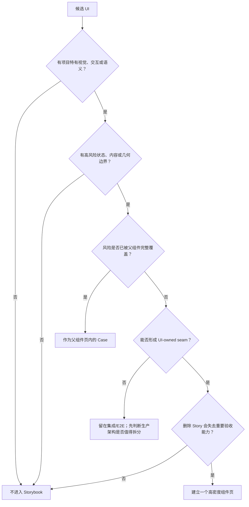
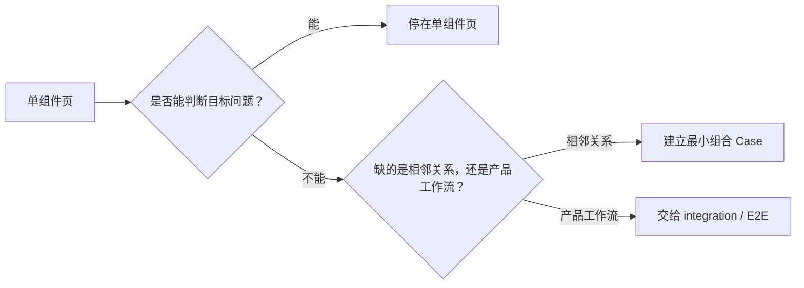
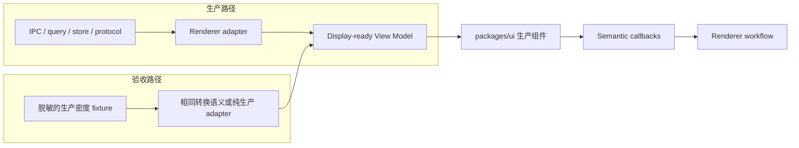
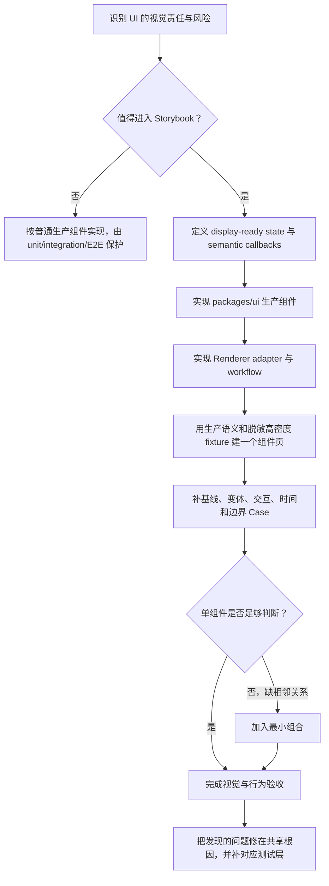

# Storybook 组件契约验收 Pattern

> 状态：Retrospective
>
> 日期：2026-07-29
>
> 范围：Reflecta 的 Storybook 定位、组件准入、Case 设计及其对 UI 架构与开发流程的影响
>
> 相关实施方案：[Storybook 组件验收设计方案](./storybook-acceptance-design-plan.md)

## 0. 组织逻辑

本文采用“心智纠偏 → 质量定位 → 组件准入 → Case 设计 → 组合验收 → 架构影响 → 开发流程 → 原则内核”的递进结构。

原因是 Storybook 的组件清单和 Case 形式都不是孤立决定：先要说清它在质量体系中负责什么，才能判断哪些组件值得进入；Case 对组件接口施加的约束，又会反过来改变生产代码的边界和编写顺序。本文各章内部以“做什么、排除什么、为什么”组织，避免把代码归属、Storybook 准入和测试分层混成同一个问题。

全文结论可以压缩成一句话：

> Storybook 不是组件目录、产品 Demo 或页面测试替身，而是项目特有 UI 的组件契约验收工作台：它用生产组件、生产语义和可重复的高密度 Case，同时比较组件的重要状态、交互与边界；只有单组件无法判断相邻关系时，才加入最小组合场景。

## 1. 这个心智是如何收敛的

最终 Pattern 不是从一开始就完整存在，而是在几次错误方向中逐步收敛。保留这些反例很重要，因为它们说明了规则要解决的真实问题。

| 曾采用或接近采用的心智             | 暴露的问题                                                                               | 最终修正                                           |
| ---------------------------------- | ---------------------------------------------------------------------------------------- | -------------------------------------------------- |
| Storybook 是 Agent UI 验收实验室   | 导航、场景和目标都围绕 Agent，忽略 Capture 与 Knowledge Wander；Storybook 被产品旅程绑架 | Storybook 面向整个产品，但验收单元仍是组件         |
| 按产品页面或完整任务过程组织       | 页面 runtime、Router、query、store 和 IPC 被复制进 Story，变成第二套应用                 | 只保留组件和最小组合，不复制页面工作流             |
| `packages/ui` 里的组件都应展示     | Settings、DomainForm、普通 List/Detail 等标准组合数量多、状态少、维护收益低              | 代码归属与 Storybook 准入分开判断                  |
| 按源码模块合并验收                 | Editor、完整 Preview、摘要 Preview 虽共享 Markdown 技术，却有不同视觉责任                | 以独立视觉契约，而不是目录或依赖，决定 Story 页面  |
| 每个状态或 Tool 类型一个 Story     | 信息密度低，需要频繁切换侧栏，难以同时比较差异                                           | 一个业务组件一个高密度页面，状态在页面内分 Section |
| 每个 Tool 独立成组件心智           | 用户看到的是统一 Tool 体系；不同 Tool 之间的密度和一致性无法比较                         | 所有生产 Tool 语义进入一个 Tool 页面               |
| 为 Story 自造 Tool type 和交互     | Story 与生产渲染漂移；确认弹 `alert`，不能验收真实生命周期                               | 使用生产 DTO/View Model/adapter 和真实组件回调语义 |
| 用“下一帧”按钮模拟 streaming       | 规避了时间、增量更新和 React identity 问题，无法重现生产风险                             | 自动推进同一个实例，并可重置、循环或完成           |
| Showcase、Section、Case 层层套卡片 | 组件之外的装饰比组件本身更抢眼，页面显得脏乱                                             | 页面标题、Section 标题、必要说明与 Divider 足够    |
| Tool 使用两栏高密度布局            | 单卡内容复杂时视线不断左右跳转，详情难以纵向阅读                                         | Tool 默认单栏；网格只用于适合直接并排比较的短 Case |

这些修正指向同一个判断：

> Storybook 的价值不来自“展示得多”，而来自“把值得反复判断的 UI 差异放在同一视野中”。

## 2. Storybook 在质量体系中的位置

### 2.1 它验收的是组件契约

这里的“组件契约”不只是 TypeScript props。它至少包含四部分：

1. **视觉语义**：哪些内容更重要，状态、层级和强调如何表达；
2. **内容几何**：组件面对长、空、多、深、窄等内容时如何保持布局；
3. **交互反馈**：hover、focus、selection、展开、审批和编辑如何变化；
4. **时间行为**：loading、streaming、running、completed、failed 等生命周期如何连续演进。

TypeScript 能证明调用方式合法，却不能证明父节点 hover 在子节点选中后仍然清晰，也不能证明长标题、时间和摘要会在同一行正确收缩。Storybook 正好承担这类需要人直接观察和操作的判断。

### 2.2 它属于整个产品，但不耦合产品工作流

Reflecta 的产品概念包括 Understanding、Context、Domain、Capture、Agent 和 Knowledge Wander。Storybook 应使用这些真实产品语义和接近生产的信息密度，才能暴露有意义的 UI 问题；但它不需要复制“用户如何完成一次完整任务”。

因此：

- 导航可按 Capture、Agent、Knowledge Wander 分区，帮助定位组件；
- fixture 可使用 Domain 路径、Understanding 摘要、Agent Tool 等产品语言；
- Story 不连接真实知识库、会话、持久化、Router 或 IPC；
- 组合场景只恢复组件的相邻关系，不恢复完整产品页面。

这使 Storybook 与[产品价值主张](../../references/product/value-proposition.md)保持语义一致，同时避免成为第二套产品实现。

### 2.3 它不能替代其他测试层

| 质量层                    | 主要问题                           | 典型例子                                                |
| ------------------------- | ---------------------------------- | ------------------------------------------------------- |
| Storybook                 | 视觉、交互、状态与边界是否可接受   | 长命令是否溢出；审批状态是否连贯；Markdown 排版是否清楚 |
| UI unit/component test    | 可确定的组件行为是否正确           | 点击回调参数、键盘选择、状态恢复、稳定 identity         |
| 纯逻辑 unit test          | parser、selector、adapter 是否正确 | Markdown 摘要转换、DTO → View Model、tree transform     |
| Renderer integration test | UI 与应用运行时的连接是否正确      | IPC 结果映射、store/query 状态进入组件、错误处理        |
| E2E                       | 真实用户工作流是否贯通             | 创建、保存、审批、持久化、刷新恢复和跨页面协作          |

由此可以排除两种常见误用：

- 不写检查 Markdown fixture 文本字面量的 unit test；它既没有业务行为，也不能保护渲染质量；
- 不因为 Story 中能够点击“确认”，就认为真实审批、IPC 和持久化已被验证。

## 3. 什么组件应该进入 Storybook

### 3.1 先分开三个不同问题

组件讨论中最容易混淆的是以下三个决策：

| 决策           | 要回答的问题                                          | 不能据此推出                          |
| -------------- | ----------------------------------------------------- | ------------------------------------- |
| 代码归属       | 视觉与交互规则应由 `packages/ui` 还是 Renderer 拥有？ | 属于 `packages/ui` 不代表必须有 Story |
| 公共接口       | 是否值得成为其他模块稳定依赖的 UI seam？              | 被 export 不代表有人需要人工验收      |
| Storybook 准入 | 删除这个 Story 是否会失去高价值的 UI 判断能力？       | 实现复杂不代表视觉风险高              |

`DomainForm` 可以合理地属于 UI 层，却仍不值得拥有独立 Story：它主要由标准表单组件组成，视觉状态少，真正风险是业务验证与提交流程。相反，`SimpleMarkdownPreview` 实现不大，但行数限制、降噪和截断直接影响多个生产场景，值得独立验收。

### 3.2 准入条件

一个组件应同时满足以下条件：

1. **存在项目特有契约**：有明显定制样式、独特交互或产品语义，不是 shadcn 的普通展示；
2. **存在可观察的风险面**：状态、内容或容器变化可能破坏层级、布局或用户判断；
3. **拥有独立视觉责任**：风险不能被父级业务组件完整覆盖；
4. **可以形成 UI-owned seam**：通过 display-ready state 和 semantic callbacks 工作，不依赖整页 runtime；
5. **维护收益大于 Story 成本**：以后确实会反复比较、回归或扩展这些 Case。

前三项决定“有没有验收价值”，第四项决定“是否已经是可验收的组件”，第五项负责最终的 ROI 删除测试。



### 3.3 当前组件清单是规则的结果，不是规则本身

当前 v1.3.0 保留 13 个组件页：

| 区域             | 组件页             | 主要契约                                   |
| ---------------- | ------------------ | ------------------------------------------ |
| Capture          | Markdown Editor    | 富文本编辑、上传、Wiki Link、受控更新      |
| Capture          | Markdown Preview   | 完整只读 Markdown、链接与媒体              |
| Capture          | Markdown 摘要预览  | 降噪、行数限制和截断                       |
| Capture          | Domain Tree        | 层级、选择、hover、菜单、拖拽和窄宽度      |
| Capture          | Domain Tree Select | 单/多选、路径、候选生命周期和大量选项      |
| Capture          | Understanding Row  | 行状态、摘要密度、操作和截断               |
| Agent            | Composer           | 输入、Entity、附件、模型、上下文与运行状态 |
| Agent            | Markdown           | Agent Markdown、扩展语法和半成品 streaming |
| Agent            | Message            | 消息角色、block 组合、生命周期和操作       |
| Agent            | Tool               | 全部生产 Tool 语义、执行与审批生命周期     |
| Agent            | Thread Sidebar     | 分组、当前态、并发状态、菜单和滚动         |
| Agent            | Message Jump Nav   | 折叠、展开、当前标记、跳转和长列表         |
| Knowledge Wander | Knowledge Graph    | 图布局、关系、选择、缩放和规模边界         |

另外只有两个组合页：Capture 的知识整理核心组合，以及 Agent 的任务过程组合。

这份清单不应演变成永久白名单。未来组件仍按准入条件判断；已有组件如果不再提供独立判断价值，也应删除 Story。

### 3.4 明确不进入的类型

以下内容通常不进入：

- shadcn 基础组件 gallery；
- Settings、DomainForm、普通 List/Detail、Context preview/detail 等标准组件排列；
- 页面、路由、应用外壳和完整产品工作流；
- parser、adapter、selector、formatter、tree transform 等纯逻辑；
- 已被所属业务组件完整覆盖的内部 renderer；
- 仅因为“代码很多”“已经 export”或“以后也许会用”而产生的候选项。

例外不是不允许，但必须指出它新增了哪一种无法在现有页面中完成的重要判断。

## 4. 一个组件的 Storybook Case 应如何设计

### 4.1 一个组件，一个高信息密度页面

侧栏负责选择“验收哪个组件”，页面负责回答“这个组件在重要情况下长什么样、如何变化”。

因此，Default、Loading、Error、Long Content 不再机械拆成多个侧栏项。一个业务组件只保留一个页面，内部按具体判断问题分 Section，例如：

- `选择与 hover 关系`
- `标题与摘要截断`
- `确认与拒绝`
- `未闭合 Markdown 的自动 Streaming`

Section 名称应描述要判断的问题，而不是套用抽象状态模板。

页面结构保持克制：

```text
组件名称
一句话说明验收目标

Section 标题
必要说明
组件实例

──────────────── Divider ────────────────

下一个 Section
```

不为 Storybook 自己层层创建 Showcase Card。只有生产组件本身是卡片时，页面里才出现卡片。

### 4.2 Case 来自契约维度，不来自 props 穷举

一个组件页从以下五类中选择必要内容，不要求机械凑齐：

1. **基线**：最常见且足够真实的生产内容；
2. **语义变体**：会改变信息结构或用户判断的 props；
3. **生命周期与交互**：组件自己拥有的状态变化；
4. **内容与几何边界**：空、长、多、深、窄、溢出和降级；
5. **最小组合语境**：孤立时无法判断的相邻关系。

可以把设计公式记为：

> 组件 Case = 代表性基线 + 有意义的语义变体 + 自有生命周期 + 高风险边界 + 必要的最小语境。

这不是笛卡尔积。`size × variant × state × content × width` 全排列会制造大量重复，反而掩盖真正差异。每个 Case 都应能回答一个可说出口的验收问题。

### 4.3 选择正确的观察方式

不同问题需要不同 Case 机制：

| 要观察的东西                  | 合适方式                 | 原因                               |
| ----------------------------- | ------------------------ | ---------------------------------- |
| 多个稳定状态的差异            | 同 Section 同时展示      | 避免依赖记忆和频繁切换             |
| 组件自己拥有的交互            | 页面内直接操作并局部重置 | 验收真实反馈，而不是静态截图       |
| streaming、running 等时间行为 | 自动推进同一个实例       | 暴露增量更新、节奏与 identity 问题 |
| 多组件相邻后的层级和密度      | 最小组合场景             | 单组件无法回答，但无需复制页面     |
| 大量复杂内容                  | 单栏纵向展示             | 保持阅读流，避免两栏来回扫描       |
| 少量短状态的直接比较          | 适度并排或网格           | 同屏比较确实提高判断效率           |

Controls 可以用于探索，但不应是完成基础验收的必经路径。关键状态应直接出现在页面中。

### 4.4 Fixture 必须真实，但数据必须是假的

Story 数据的目标不是复制生产事实，而是复制生产数据的**形状、密度和变化方式**。

fixture 应满足：

- 使用生产组件和生产支持的 Tool/Message/Domain 等类型；
- 字段、嵌套、字数、列表规模和长短分布接近生产；
- 人名、路径、命令、URL、知识内容和业务事实全部虚构；
- 使用稳定本地资源，避免随机远程图片、网络和当前时间造成漂移；
- 为每个交互组提供局部 reset，避免 Case 互相污染；
- 需要 DTO → View Model 时复用生产转换语义，不另造 Story-only model；
- 同一 streaming 对象保持稳定的 message id、tool call id、block key 和 React identity。

生产数据只能作为**结构参考**。把真实内容拷入 Story，即使仓库私有，也会把验收工具变成新的敏感数据副本。

### 4.5 三个代表性设计

#### Markdown：按组件责任分页面，按语法族分 Section

`MarkdownEditor`、`MarkdownPreview`、`SimpleMarkdownPreview` 和 Agent 的 `ChatMarkdown` 共享 Markdown 技术，却必须分别验收，因为它们的使用语境和视觉责任不同。

在单个 Markdown 页面内部，也不把一份全语法文档堆成超长截图。应按标题与行内样式、列表与引用、代码与表格、媒体与扩展语法、数学与 Mermaid、Reflecta Entity、Streaming 边界等语法族分 Section。这样既覆盖完整，又能定位问题。

#### Tool：类型全集与状态族分开

Tool 页面同时列出所有生产 Tool 语义，但不做“每个 Tool 类型 × 每种状态”的全排列：

- 类型图谱用 completed 为主，判断不同语义的一致性和信息密度；
- 生命周期按普通执行、结果列表、长文本/代码、Proposal 等视觉 family 选择代表项；
- streaming 自动推进；
- 确认与拒绝直接改变页面内生命周期，不弹 `alert`；
- 长命令、长 cwd、长输出、大量搜索结果和 unknown fallback 单独进入边界 Section。

用户心智中的验收单元是一个 Tool 体系，因此它只占一个侧栏页面。

#### Domain Tree 与 Understanding Row：把真实视觉事故固化为契约

以下问题都来自实际验收，而不是抽象想象：

- 子节点选中后，父节点 hover 状态丢失；
- 超长 Domain 名称突破容器；
- UnderstandingRow 的标题、时间或摘要不能在弹性布局中正确收缩。

这类问题一旦出现，应在对应组件页补充能够稳定重现的 Case，并在生产组件的共享根因处修复。Story 保护的是“这种视觉关系以后仍可被观察”，不是某张截图或某段 fixture 字面量。

## 5. 组合场景的边界

### 5.1 组合页只回答单组件无法回答的问题

组合场景可以验收：

- 相邻组件的信息密度是否失衡；
- 主次层级与视觉节奏是否合理；
- selection、hover、展开和 streaming 是否互相干扰；
- 多种长内容同时出现时，布局是否仍然稳定；
- 组件在接近真实宽度下是否还能表达自己的契约。

如果一个组合 Case 只能证明“这些组件可以 render”，它没有独立价值，应删除。

### 5.2 组合不是页面副本

组合场景允许：

- 真实 `packages/ui` 组件；
- 本地状态；
- display-ready View Model；
- 纯生产 adapter；
- 语义 callback 和页面内反馈。

组合场景不允许：

- Router、query、store、IPC 或真实后端；
- toast、持久化和真实删除/审批流程；
- 为 Story 复制 Renderer 页面；
- 为串起 Demo 新造一套产品状态机。



当前 Capture 组合恢复 Domain Tree、Understanding Row 与 Editor/Preview 的核心相邻关系；Agent 组合恢复 Message、Tool、Composer 在典型任务、审批和高密度失败中的节奏。Agent 典型场景使用接近生产内容区的宽度，避免因 Story 容器过窄制造不存在的结论。

## 6. Storybook 如何改变生产代码的编写逻辑

### 6.1 从“页面里能工作”转向“组件契约可独立驱动”

没有 Storybook 时，UI 很容易直接读取 Router、query、store、IPC 返回值和页面上下文。它在页面里能工作，却无法在不复制 runtime 的情况下独立展示。

Storybook 引入了第二个真实消费者：



这要求组件接口更明确：

- UI 接收已准备好展示的状态，不理解 IPC 或 persistence；
- UI 发出 `onApprove`、`onJump`、`onSelect` 等语义事件，不执行应用工作流；
- Renderer 负责 protocol、query、store、toast、clipboard、持久化和页面协调；
- Story 通过同一 UI seam 驱动组件，而不是复制组件内部逻辑。

### 6.2 Storybook 是 seam 检查器，不是抽象制造机

“组件很难写 Story”是架构信号，但不能直接推出“为了 Storybook 拆组件”。

正确判断是：

1. 如果抽出 display-ready state 与 semantic callbacks 也能让生产边界更清楚，就提取 UI seam；
2. 如果风险本质是 DOM observer、Router、IPC 或完整工作流，就留在 Renderer 与集成/E2E；
3. 不建立只有 Story 使用的 interface、adapter 或第二套状态模型。

`ThreadSidebar` 和 `ChatJumpNav` 值得提取，是因为它们拥有独立视觉契约，提取后 Renderer 也更专注于运行时协调。`ThreadFindBox` 不值得为了 Story 拆分，因为它的主要风险在 DOM 搜索、IME 和页面滚动协作。

### 6.3 Streaming 迫使 identity 与状态机变得显式

手动“下一帧”或每帧 remount 的 Story 会掩盖生产问题。自动 streaming 要求代码明确：

- 哪个 ID 定义同一个 message、block 或 tool call；
- partial result 如何合并；
- 展开状态是否在更新中保留；
- running 如何进入 completed、failed 或 stopped；
- React key 是否稳定。

这不只是 Story 实现细节。它会直接改善生产中的流式渲染模型，使状态连续性不再依赖偶然的组件生命周期。

### 6.4 `packages/ui` 的角色因此更清楚

`packages/ui` 不是“所有 React 文件的仓库”，而是项目特有视觉与交互规则的所有者。它可以包含没有 Story 的低风险组件，也可以通过 Story 暴露高风险公共契约。

Renderer 则保留应用能力和协调逻辑。Storybook 的出现，使这条边界从文档主张变成可运行的压力测试：如果一个 UI 只有带上整个应用才能展示，边界要么尚未形成，要么它本来就不该是独立 Story。

## 7. 开发流程发生了什么变化

### 7.1 以前的隐式顺序

常见旧顺序是：

1. 在页面里实现功能；
2. UI 直接接入 runtime 数据；
3. 完成后再看是否能抽组件；
4. 为 Story 临时编一份简单数据；
5. 把 Default、Loading、Error 分散到多个 Story；
6. 视觉边界主要靠偶然发现。

结果是 Story 容易比生产简单，组件接口被页面上下文定义，视觉事故难以稳定复现。

### 7.2 现在的建议顺序



这不意味着先写一套 Story 再“移植”到生产。Story 与 Renderer 应共同消费同一个生产组件接口，Story 只是更早、更系统地迫使接口可独立驱动。

### 7.3 新需求和缺陷的维护规则

#### 新增业务组件

先回答准入条件。低风险标准组合直接实现，不为保持目录“完整”而建 Story。

#### 新增 Tool 类型

优先在现有 Tool 页的类型图谱中增加一个生产语义 fixture。只有它引入新的视觉 family 或生命周期，才新增对应 Section；不新增侧栏 Story。

#### 新增状态

如果状态会改变视觉结构、交互或用户判断，把它加入现有组件页；如果只是内部实现分支且最终呈现相同，用 unit test 保护。

#### 修复视觉缺陷

先在所属组件页形成最小、稳定、可重复的 Case，再修共享组件根因。若问题只存在于页面 wiring，则进入 integration/E2E，而不是扩大 Story 范围。

#### 删除或合并 Story

定期做删除测试：删除后是否真的失去重要判断？若没有，合并回所属组件页或删除。Story 数量不是资产，受保护的契约才是。

## 8. 可进一步提炼的原则内核

后续若要把本文压缩为项目级 principle，可以使用以下候选表述：

### Storybook as UI Contract Workbench

> 对项目特有且高风险的 UI，先形成由 display-ready state 与 semantic callbacks 驱动的生产组件，再在一个高信息密度 Story 页面中，用生产渲染路径、脱敏但等密度的数据和可重复的状态、交互、时间及边界 Case 验收其组件契约；单组件不足时才加入最小组合。不要为基础组件、标准业务排列、完整页面工作流或 Storybook 自身另造模型。

它可以拆成六条可执行规则：

1. **按视觉责任准入，不按目录准入。**
2. **一个业务组件一个高密度页面，不把状态散落到侧栏。**
3. **同生产组件、同生产语义、假数据真密度。**
4. **静态状态同屏比较，真实交互直接操作，时间状态自动演进。**
5. **组合只恢复必要的相邻关系，不复制产品工作流。**
6. **让 Storybook 检验架构 seam，但不为 Storybook 制造抽象。**

这六条共同保护一个更根本的目标：

> 让 UI 契约可以脱离应用 runtime 被看见、比较和操作，同时仍然只存在一套生产实现。

## 9. Structured Writing 自检

- [x] **纵向主线**：从错误心智收敛到定位、准入、Case、组合、架构、流程和原则，后一章以前一章为前提。
- [x] **顺序测试**：若先讨论组件清单或 Case，而未先定义质量定位，读者无法理解取舍；当前顺序不可随意交换。
- [x] **电梯测试**：开头一句话已说明 Storybook 是什么、如何验收以及不是什么。
- [x] **追问测试**：每条核心结论均继续回答了“为什么”和“如何执行”。
- [x] **一句话测试**：每章标题下的首段都能概括该章要解决的问题。
- [x] **横向 MECE**：代码归属、公共接口、Story 准入分开；基线、变体、交互、边界、组合按契约维度分类；Storybook、unit、integration、E2E 按质量责任分类。
- [x] **层级测试**：表格和列表中的同层项目保持相同抽象层级。
- [x] **论证闭环**：结论均配有原因、反例或实际组件案例，不只给规则。
- [x] **过渡测试**：各章末尾自然引出下一层决策，未依赖孤立结论。
- [x] **深度测试**：正文标题层级控制在四级以内。
- [x] **标题可预测性**：仅阅读目录即可推断全文从定位到实践再到原则的完整内容。
