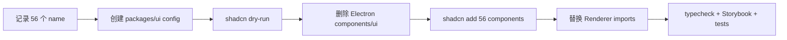

# v1.3.0 UI Foundation Module Design

> 状态：Planned
>
> 对应主计划：[Module 1：UI Foundation 与 shadcn 重建](./ui-package-storybook-migration-plan.md)
>
> 组织逻辑：本文采用**时序型主线**，按“记录当前安装集 → 创建 package 配置 → 删除旧 source → CLI 重建 → 替换消费方 → 验收”展开。原因是 shadcn source 由 CLI ownership 管理，正确动作不是逐文件迁移，而是在新 workspace 以同一配置重新生成；组件清单按当前 56 个 registry item 做穷尽校验。

## 1. 结论

Foundation 不手工迁移 `apps/electron/src/renderer/src/components/ui`。

实施方式：

1. 记录当前 56 个 shadcn component name；
2. 创建 `packages/ui`、package-local imports 和 `components.json`；
3. 删除 Electron 下全部 shadcn component source；
4. 在 `packages/ui` 通过 shadcn CLI 重新安装同一清单；
5. 迁移 design tokens、Theme Provider 和 Overlay Providers；
6. 把 Renderer import 改到 `@reflecta/ui`。

生成后的公开路径遵循 shadcn monorepo 结构：

```tsx
import { Button } from "@reflecta/ui/components/button";
import { Dialog, DialogContent } from "@reflecta/ui/components/dialog";
import { ThemeProvider } from "@reflecta/ui/theme";
import { ModalProvider } from "@reflecta/ui/overlays";
import { cn } from "@reflecta/ui/lib/utils";
import "@reflecta/ui/globals.css";
```

不再使用 `@reflecta/ui/primitives/*` 命名；`components/*` 与 shadcn 的 monorepo convention 对齐。

## 2. CLI Ownership 规则

- `packages/ui/src/components/*.tsx` 是 shadcn CLI-owned source；
- 不从旧目录复制任何 component；
- 不对生成后的 shadcn component 做手工修改；
- 自定义 product UI 放在 `src/chat`、`src/editor`、`src/overlays` 等目录；
- 新增 shadcn component 统一在 `packages/ui` 运行 CLI；
- 不使用 `shadcn add --all`，避免把当前没有消费者的新 registry item 引入项目；
- CLI 生成结果与当前调用方不兼容时，调整调用方；不把旧 component implementation 搬回来。

## 3. 当前 56 个 Component 安装集

以下清单只作为重新安装 manifest，不作为 source migration list。

### 3.1 Form 与 direct action

```text
button
button-group
toggle
toggle-group
checkbox
radio-group
switch
slider
input
textarea
input-group
input-otp
native-select
select
combobox
calendar
form
field
label
```

共 19 个。

### 3.2 Overlay、navigation 与 disclosure

```text
accordion
collapsible
dialog
alert-dialog
drawer
sheet
popover
hover-card
tooltip
dropdown-menu
context-menu
menubar
navigation-menu
command
```

共 14 个。

### 3.3 Content、feedback 与 layout

```text
aspect-ratio
card
item
empty
alert
badge
avatar
breadcrumb
kbd
progress
skeleton
spinner
separator
scroll-area
table
tabs
pagination
carousel
chart
resizable
sidebar
sonner
direction
```

共 23 个。

总数：`19 + 14 + 23 = 56`。

重新安装前后必须以 name set 比较，不以文件行数或 Git rename 判断。

## 4. Package 配置

### 4.1 `packages/ui/package.json`

使用 package-local `#...` imports 管理生成文件内部引用：

```json
{
  "name": "@reflecta/ui",
  "private": true,
  "type": "module",
  "imports": {
    "#components/*": "./src/components/*.tsx",
    "#lib/*": "./src/lib/*.ts",
    "#hooks/*": "./src/hooks/*.ts"
  },
  "exports": {
    "./globals.css": "./src/styles/globals.css",
    "./components/*": "./src/components/*.tsx",
    "./lib/*": "./src/lib/*.ts",
    "./hooks/*": "./src/hooks/*.ts",
    "./theme": "./src/theme-provider.tsx",
    "./overlays": "./src/overlays/index.ts",
    "./editor": "./src/editor/index.ts",
    "./chat": "./src/chat/index.ts"
  }
}
```

最终 dependency version 由 workspace lockfile 和 shadcn CLI 生成结果决定，不在设计文档复制 Electron 的 dependency block。

React/React DOM 使用 workspace 一致版本；Storybook-related dependency 为 package dev dependency。

### 4.2 `packages/ui/components.json`

保留当前 visual preset，改变安装 ownership：

```json
{
  "$schema": "https://ui.shadcn.com/schema.json",
  "style": "base-vega",
  "rsc": false,
  "tsx": true,
  "tailwind": {
    "config": "",
    "css": "src/styles/globals.css",
    "baseColor": "taupe",
    "cssVariables": true,
    "prefix": ""
  },
  "aliases": {
    "components": "#components",
    "ui": "#components",
    "lib": "#lib",
    "hooks": "#hooks",
    "utils": "#lib/utils"
  },
  "iconLibrary": "lucide",
  "rtl": false,
  "menuColor": "default",
  "menuAccent": "subtle",
  "registries": {}
}
```

`apps/electron/components.json` 删除；shadcn 命令从 repo root 通过 `--cwd packages/ui` 执行。

### 4.3 TypeScript

UI package tsconfig 必须启用：

```json
{
  "compilerOptions": {
    "moduleResolution": "bundler",
    "resolvePackageJsonImports": true,
    "jsx": "react-jsx"
  }
}
```

package 内部使用 `#components/button`；Electron 只使用 `@reflecta/ui/components/button`。

## 5. 重建命令

先 dry-run：

```bash
bun x shadcn add accordion alert-dialog alert aspect-ratio avatar badge breadcrumb button-group button calendar card carousel chart checkbox collapsible combobox command context-menu dialog direction drawer dropdown-menu empty field form hover-card input-group input-otp input item kbd label menubar native-select navigation-menu pagination popover progress radio-group resizable scroll-area select separator sheet sidebar skeleton slider sonner spinner switch table tabs textarea toggle-group toggle tooltip --cwd packages/ui --dry-run
```

确认 target 全部位于 `packages/ui` 后执行：

```bash
bun x shadcn add accordion alert-dialog alert aspect-ratio avatar badge breadcrumb button-group button calendar card carousel chart checkbox collapsible combobox command context-menu dialog direction drawer dropdown-menu empty field form hover-card input-group input-otp input item kbd label menubar native-select navigation-menu pagination popover progress radio-group resizable scroll-area select separator sheet sidebar skeleton slider sonner spinner switch table tabs textarea toggle-group toggle tooltip --cwd packages/ui --yes
```

顺序不影响结果；清单必须保持 56 个 unique name。

不使用 `--overwrite`：目标目录应为空，任何冲突都表示清理或配置步骤有误。

## 6. 删除与生成顺序



删除目标：

```text
apps/electron/src/renderer/src/components/ui/
apps/electron/components.json
```

删除是明确的 replace 操作；不是先保留两套 component 再逐步切换。

## 7. 非 shadcn Foundation

### 7.1 Theme Provider

```ts
export type ThemeProviderProps = React.ComponentProps<typeof NextThemesProvider>;

export function ThemeProvider(props: ThemeProviderProps): React.ReactNode;
```

迁移现有 Theme Provider implementation，不改变 theme contract。Storybook preview 和 Electron root 使用同一 Provider。

### 7.2 Overlay Providers

```ts
export type ModalOptions = {
  title?: string;
  className?: string;
  widthClassName?: string;
};

export type ConfirmOptions = {
  title?: string;
  message: React.ReactNode;
  acceptLabel?: string;
  rejectLabel?: string;
  danger?: boolean;
  onAccept: () => void | Promise<void>;
};

export function ModalProvider(props: { children: React.ReactNode }): React.ReactNode;
export function useModal(): {
  openModal(content: React.ReactNode, options?: ModalOptions): void;
  closeModal(): void;
  confirm(options: ConfirmOptions): void;
};
```

```ts
export type DrawerOptions = {
  header?: React.ReactNode;
  title?: React.ReactNode;
  className?: string;
  widthClassName?: string;
  onClose?: () => void;
};

export function DrawerProvider(props: { children: React.ReactNode }): React.ReactNode;
export function useDrawer(): {
  openDrawer(options: DrawerOptions, content: React.ReactNode): void;
  closeDrawer(): void;
};
```

命名统一：

- `DrawerContextProvider` → `DrawerProvider`；
- `useSharedDrawer` → `useDrawer`。

它们已有真实 state/lifecycle 行为，迁移后不是 shadcn wrapper，也不放进 CLI-owned component 目录。

### 7.3 不迁移的薄 wrapper

- `SidebarToggleButton` 暂留 Electron；
- `FooterButton` 删除，调用方直接组合 `DialogFooter` 与 `Button`。

## 8. Style Ownership

迁入 `@reflecta/ui/globals.css`：

- Tailwind v4 import；
- shadcn CSS variables；
- light/dark semantic tokens；
- font、background、foreground 基线；
- reusable animation/utilities；
- Chat/Editor Module 的 package-owned style imports。

留在 Electron：

- `.app-window`；
- Electron drag/no-drag；
- route/screen shell sizing；
- platform-specific scrollbar/window chrome；
- 只服务 App layout 的 selector。

Electron `style.css` 最终：

```css
@import "@reflecta/ui/globals.css";

/* Electron/App-only styles */
```

## 9. Renderer Import 替换

```text
@renderer/components/ui/button
  -> @reflecta/ui/components/button

@renderer/components/ui/*
  -> @reflecta/ui/components/*

@renderer/lib/utils
  -> @reflecta/ui/lib/utils

@renderer/components/theme-provider
  -> @reflecta/ui/theme

@renderer/modules/shared/hooks/use-modal
  -> @reflecta/ui/overlays

@renderer/modules/shared/hooks/use-drawer
  -> @reflecta/ui/overlays
```

`apps/electron` 增加：

```json
{
  "dependencies": {
    "@reflecta/ui": "workspace:*"
  }
}
```

## 10. Storybook 验收

不为 56 个 component 机械复制官方 documentation。Story 只覆盖：

- Reflecta token/theme；
- light/dark；
- project 实际使用的 variants；
- Overlay Provider 的 open/close/confirm；
- Drawer close callback；
- Sidebar、Dialog、Dropdown、Form 等高频组合 smoke；
- CLI regeneration 后的 import/build smoke。

shadcn component 自身行为由 upstream 保证；项目只验证配置、theme 和消费兼容性。

## 11. Module 出口

- Electron 不再存在 `components/ui`；
- `components.json` 的唯一 ownership 在 `packages/ui`；
- 56 个 name set 完整重建；
- generated source 没有手工修改；
- Electron、Storybook 共用 tokens、Theme 和 Overlay Providers；
- UI package 内部 import 使用 `#...`，workspace consumer 使用 package exports；
- typecheck、Storybook build 和 Renderer tests 通过。
