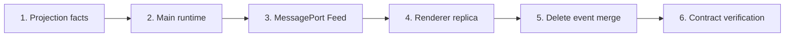

# v1.3.11 Agent Session Projection Feed 执行计划

本文按“锁定事实模型 → 建立 Main 权威 Projection → 建立有序 Feed → 切换 Renderer → 删除旧链路 → 验收”的依赖顺序组织，因为后一阶段只有在前一阶段的不变量成立后才有意义。每个阶段内部按代码、测试、删除项和完成证据横向展开，保证迁移不是只增加新路径而遗留旧状态所有权。

> 日期：2026-08-02
>
> 状态：Ready for Implementation
>
> 架构依据：[Agent Session Projection 与实时 Feed 架构](../../references/technical/biz/agent/session-projection.md)

## 结论先行

本次不继续扩展 `mergeAgentEvents`。实现完成后，Electron Main 独占 Session records 与 runtime changes 的组合权，通过单一 MessagePort watch 发送权威 `AgentSessionProjection`；Renderer 只保存最后一帧 Projection，再交给 Turn Renderer 派生 UI。



完成后必须删除旧 snapshot + event 双通道，而不是用 feature flag 长期保留两套实现。

## 1. 范围与完成标准

### 1.1 必须完成

- Main 维护每个 Session 的唯一 `AgentSessionProjection` 与内存 revision；
- durable records 与 live changes 都通过同一个 Main projector 更新 Projection；
- watch 的第一帧和后续帧通过同一个 FIFO MessagePort 发送；
- Renderer 使用 Session replica / `useSyncExternalStore`，不再使用 Session events Query；
- 编辑历史消息时完整重建活动 branch Projection；
- completion、failure、stop 后重开的 Projection 与最后一帧 live 状态一致；
- 停止运行时持久化用户已看见的 partial Assistant snapshot；
- 线程列表、标题生成、导出等读取方不再依赖 Renderer event reducer；
- 删除 `mergeAgentEvents`、Renderer event reducer 使用和运行状态镜像；
- 旧 Session 文件无需迁移即可读取。

### 1.2 明确不做

- 不改变 Pi Provider、工具、Citation 或 RAG 协议；
- 不持久化 token delta；
- 不设计跨应用重启的 cursor、ack、replay log 或断点续传；
- 不增加状态管理或流式传输依赖；
- 不重做 Turn Renderer 的 Activity / Decision / Receipt / Response 视觉规则；
- 不优化 MessagePort payload 为 delta，除非完成实现后有测量证据。

### 1.3 完成证据

以下证据必须同时存在：

1. Interface tests 能控制首帧发送边界，并证明其间到达的 live change 不丢失、不重复；
2. Renderer test 证明 focus/re-render 不触发 Session refetch；
3. branch test 证明旧 messages、Catalog 和 compactions 整体消失；
4. stop/failure/completion test 证明重开结果与最后 live Projection 等价；
5. 搜索结果证明 Renderer 不再导入 `AgentEvent`、`reduceAgentSessionEvent` 或 `readSessionEvents`；
6. Electron main/renderer tests、typecheck、lint、format 和 `git diff --check` 通过。

## 2. Task 1：建立 Projection 事实模型

### 2.1 共享类型

在共享 Agent typings 中明确区分：

- `AgentSessionEvent` / `AgentLiveEvent`：Main 内部事实与变化；
- `AgentMessageProjection`：Renderer 可见的有序消息事实；
- `AgentSessionProjection`：Renderer 可见的完整 Session 状态；
- `AgentSessionFeedFrame` / `AgentSessionFeedError`：交付协议。

保留旧 Session record schema。`assistant.turn` 继续作为 legacy Assistant snapshot 读取，但不把它解释成领域里的完整 Agent Turn。

### 2.2 单一 projector

把现有纯 reducer 收敛为 Main 使用的 projector：

```text
initial projection + Agent event/change
→ next projection
```

`AgentRunAccumulator` 不再维护独立的 tool / approval / text 状态机。它若暂时保留为 active Assistant snapshot facade，必须复用同一个 projector，并在后续切片删除或缩小到无业务归约的 snapshot helper。

### 2.3 测试

- 现有 durable fixtures 投影结果不变；
- text、reasoning、tool、approval、compaction 的 live 与 durable snapshot 等价；
- edited `user.message` 的 message 截断行为保持；
- Projection 不使用 timestamp 决定覆盖或 branch。

### 2.4 完成条件

- Main 和 Renderer 不再各有一套 tool/approval display-state 归约；
- legacy records 可生成完整 Projection；
- projector tests 通过。

## 3. Task 2：建立 Main-side AgentSessionRuntime

### 3.1 Runtime 状态

新增 per-session state owner，保存：

- 当前 `AgentSessionProjection`；
- 单调递增的内存 revision；
- 唯一初始化 Promise；
- subscribers；
- active attempt snapshot。

Runtime 的初始化只从 `AgentSessionLog.readEvents()` 或当前 `SessionManager.getBranch()` 读取一次。运行开始前和 watch 注册前都必须经过同一初始化入口。

### 3.2 写入顺序

所有现有 `appendAndEmit` / `emitLive` 路径改为：

```text
durable change: append log → project change → publish state
live change: project change → publish state
```

高频 text/reasoning publish 可以按 animation-frame 等价时间片合并，但 Projection 必须立即更新，批处理只延迟通知，不延迟事实归约。

### 3.3 Branch replacement

编辑历史消息打开新 leaf 后，Runtime 从 `eventsFromManager(manager)` 完整替换 Projection，再开始新 Attempt。不能只向旧 Projection append `user.message`，否则旧 Catalog 或 compaction 会泄漏。

### 3.4 Terminal commit

completion、failure、stop 都先从 active attempt 冻结 Assistant snapshot，再 append terminal record，最后发布 terminal Projection。stop 需要保留 partial text、tool 和 receipt；重复 stop 必须幂等。

### 3.5 完成条件

- `PiAgentHost` 不直接向 `webContents` 发送 Agent events；
- active run 不再绑定发起命令的单个 Renderer；
- Main tests 覆盖 branch 与三种 terminal 路径。

## 4. Task 3：建立 MessagePort Feed 与 Adapters

### 4.1 Main watch handler

新增专用 IPC channel 接收 `{ sessionId }` 与 transferred `MessagePortMain`。Main 完成 Session 初始化后，在无 await 的同步区间内注册 subscriber 并发送首份 Projection；后续 revision 复用同一个 port。

Port 关闭时注销 subscriber。日志不可读、Session 不存在和 Projection 失败使用结构化 Feed error，不返回空 Session。

### 4.2 Preload / Electron Adapter

Preload 暴露窄 API：

```ts
watchAgentSession(
  sessionId: string,
  receive: (frame: AgentSessionFeedFrame) => void,
  signal: AbortSignal,
): void;
```

Adapter 创建原生 `MessageChannel`，把一个 port 传给 Main，另一个 port 留给 Renderer。Adapter 验证 frame、忽略非递增 revision，并在 abort 时关闭 port。

### 4.3 In-memory Adapter 与契约测试

In-memory Adapter 不 mock Electron globals，只实现同一 watch Interface。Production 与 In-memory Adapter 共用以下契约：

- 首帧必为完整 state；
- state revision 单调递增；
- abort 后不再 receive；
- transport error 与 run failure 不混淆；
- 重复/旧 frame 不导致第二次状态变化。

### 4.4 完成条件

- snapshot 与 live update 不再通过 invoke + global event 两条 channel；
- 首帧竞态 test 使用受控 barrier 稳定复现并通过；
- 不新增依赖。

## 5. Task 4：切换 Renderer Session Replica

### 5.1 Replica

新增 `agent-session-replica.ts`：

- 每个被观察 Session 只保存最后一帧；
- 提供 `getSnapshot` / `subscribe`；
- 第一个 subscriber 建立 watch，最后一个 subscriber 关闭 watch；
- 使用 `useSyncExternalStore` 接入 React；
- reconnect 从完整快照开始，不 replay events。

### 5.2 Thread view

`usePiAgentThreadView` 重命名为 runtime-neutral 的 `useAgentThreadView`，并只从 Replica 读取 Projection。滚动、虚拟列表、编辑状态与 UI actions 继续属于该 hook；传输归约全部移除。

删除：

- Session events `useQuery`；
- `eventIdsRef`；
- `liveEventsRef`；
- `pendingEventsRef`；
- semantic `requestAnimationFrame` event queue；
- `mergeAgentEvents`；
- focus refetch / `reloadMessages` 的 event replay 语义。

### 5.3 UI 状态边界

删除 Zustand 中由 Projection 可推导的 `runningThreadIds` 和 stopped message 镜像。保留 Session 选择、focus request、Inspector、编辑和滚动等真正 UI state。

Entity display invalidation 不依赖 Feed 的 exactly-once 观察。若当前知识写入 Module 已经负责 Query invalidation，则删除 event side effect；否则在命令成功或知识写入通知边界补齐。

### 5.4 其他读取方

- Thread sidebar 预览从 Main summary/projection read model 获取；
- 标题生成复用 Main projector；
- Markdown export 接收 Renderer 已呈现的 Markdown 或从 Main Projection 构造，但不重新读取 raw events；
- Query cache 删除时不再清理 `sessionEvents` key。

### 5.5 完成条件

- Renderer 搜索不到 raw Agent event subscription；
- 窗口 focus 不产生 Session 数据请求；
- Turn Renderer 测试保持通过；
- 切换 Session 不停止后台运行。

## 6. Task 5：删除旧协议与补丁链

删除以下公开或 dead code：

- `ChatService.readSessionEvents`；
- `AGENT_EVENT_CHANNEL` 与 `webContents.send("agent:event")`；
- `mergeAgentEvents` 及 timestamp / latest-run / event-ID 规则；
- `chatQueryKeys.sessionEvents` 与对应 cache cleanup；
- Renderer 对 `isAgentEvent`、`reduceAgentSessionEvent` 的导入；
- 只服务旧双通道的测试和 mocks；
- `AgentRunAccumulator` 中与 projector 重复的归约逻辑；
- 共享类型中仅为 Renderer 暴露 raw event 所需的出口。

删除后运行 dead-code 搜索，不能保留“以后可能回退”的备用路径。

## 7. Task 6：验证与回归

### 7.1 定向测试

```bash
bun run --cwd apps/electron test:main
bun run --cwd apps/electron test:renderer
bun run --cwd apps/electron typecheck
```

### 7.2 Repo gates

```bash
bun run typecheck
bun run test
bun run lint
bun run fmt:check
git diff --check
```

### 7.3 手工回归

使用开发应用验证：

1. 发送长回复，在生成期间切到其他应用再回来，回复只出现一次；
2. 生成期间切换到其他 Session，再切回来，内容连续且不停止；
3. 编辑旧用户消息，废弃 branch 的回答和 Citation Catalog 不出现；
4. 生成一部分后停止，切换 Session 再回来仍能看到 partial Response；
5. approval、tool failure 和 context compaction 的显示与刷新恢复一致。

## 8. 提交边界

1. `docs(agent): define session projection feed architecture`
2. `docs(agent): plan session projection feed migration`
3. `refactor(agent): centralize session projection in main`
4. `refactor(chat): consume agent session projection feed`
5. `refactor(agent): remove renderer event reconciliation`
6. `test(agent): verify session feed lifecycle`
7. `docs(agent): record session feed completion`

阶段性 commit 只用于保持可审查性；最终分支不能停留在双协议状态。

## 9. 执行状态

- [ ] Task 1：建立 Projection 事实模型
- [ ] Task 2：建立 Main-side AgentSessionRuntime
- [ ] Task 3：建立 MessagePort Feed 与 Adapters
- [ ] Task 4：切换 Renderer Session Replica
- [ ] Task 5：删除旧协议与补丁链
- [ ] Task 6：验证与回归

## 结构化写作自检

- [x] 一级目录按实现依赖顺序排列，调换后会破坏执行前提。
- [x] 开头给出目标状态和唯一主线，不从文件清单倒推架构。
- [x] 每个 Task 都包含目标、实现、测试和完成条件。
- [x] Projection、Feed、Replica 与 Turn Renderer 的状态所有权互斥。
- [x] 自动化证据、搜索证据和手工回归共同覆盖完成定义。
- [x] 遵循奥卡姆剃刀：使用原生 MessagePort，无新依赖、无 cursor、无 replay、无长期双协议。
