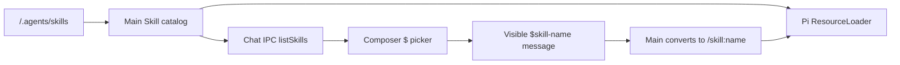

# v1.3.15 `.agents/skills` 与 `$` 选择器执行计划

本文按“固定 Skill 来源 → 建立唯一目录 → 接通 runtime 调用 → 增加 `$` 入口 → 用产品行为验收”的依赖顺序组织。后一阶段都依赖前一阶段对 Skill 身份和调用语义的确定；如果先做弹层，Renderer 就会拥有一份可能与 Agent runtime 不一致的 Skill 列表。

> 日期：2026-08-04
>
> 状态：Planned

## 结论先行

v1.3.15 直接读取 Reflecta 内容目录中的 `.agents/skills`，复用 Pi 已有的 `SKILL.md` 解析与 `/skill:name` 展开能力。Composer 只增加一个轻量 `$` 选择入口：用户在消息开头输入 `$`，选择一个 Skill 后得到普通文本 `$skill-name `；发送时 Main 将已存在的 Skill 调用转换为 Pi 原生 `/skill:skill-name`，用户消息仍保存和显示 `$skill-name`。



不建立第二套 Skill 协议，不复制 `SKILL.md` 内容进消息，不新增依赖，也不增加 Skill 管理页面。

## 1. 产品合同与范围

### 1.1 用户可以依赖的行为

- 用户在 Composer 一条消息的开头输入 `$` 后，看见当前可用 Skill 的名称和 description；
- 用户继续输入时，选项按名称和 description 过滤；
- 用户可以用方向键、Enter、Tab、Escape 和鼠标完成选择或关闭；
- 选择后，Composer 插入可继续编辑的普通文本 `$skill-name `；
- 用户发送后，消息记录和历史回看仍显示 `$skill-name`，不会暴露内部 `/skill:` 语法；
- Agent 收到对应 Skill 的完整指令，并把 `$skill-name` 后的文本作为本轮任务；
- 原有 `@` 知识引用、附件、模型选择、编辑消息和发送失败恢复行为保持不变。

### 1.2 路径合同

第一版只有一个外部 Skill 来源：

```text
<contentStorageRoot>/.agents/skills/<skill-directory>/SKILL.md
```

`contentStorageRoot` 已经是 `PiAgentHost` 的工作目录，因此 `.agents/skills` 是 Reflecta Agent 的项目级 Skill 目录。目录不存在时返回空目录，不创建示例 Skill，也不把它当成错误。

继续保留当前两个 Reflecta 内置 Skill：

- `reflecta-understanding`；
- `reflecta-context`。

它们仍由 runtime 自动使用，不进入 `$` 选项。`$` 只列出 `.agents/skills` 中的 Skill，避免把产品内部认知规则变成需要用户理解的命令。

### 1.3 明确不做

- 不增加审核、白名单、安装、删除、启停或管理页面；
- 不读取 `~/.agents/skills`、`.pi/skills`、Skill package 或仓库祖先目录；
- 不把本仓库的工程 Skill 自动复制进用户内容目录或安装包；
- 不监听文件变化；重新打开 Composer 或重启应用后重新读取即可；
- 不支持一条消息调用多个 Skill；
- 不在消息中间触发 `$`，只允许它作为第一个非空白 token；
- 不把 Skill 做成新的 Tiptap node、chip 或持久化数据类型；
- 不新增通用 command framework、插件系统或 feature flag；
- 不改变 Pi 的自动 Skill invocation 规则和 Reflecta system prompt。

## 2. Task 1：建立唯一 Skill Catalog

### 2.1 Catalog 职责

在 Electron Main 的 Agent 模块中增加一个小型 Skill catalog，隐藏以下实现细节：

- `.agents/skills` 的绝对路径；
- Pi `loadSkillsFromDir` 的调用；
- `SKILL.md` frontmatter 校验结果；
- 名称冲突与稳定排序；
- runtime 需要的文件路径和 Renderer 需要的安全摘要。

Catalog 对调用方只提供两种结果：

```ts
type AgentSkillSummary = {
  name: string;
  description: string;
};

listAgentSkills(): AgentSkillSummary[];
agentSkillPaths(): string[];
```

如果实现中两个结果可以从一次加载自然得到，保留一个内部加载函数即可，不为接口形式建立 class、repository 或 adapter。

### 2.2 发现规则

- 直接使用 `@earendil-works/pi-coding-agent` 已导出的 `loadSkillsFromDir`；
- 遵循 Pi 对 `SKILL.md`、name、description 和递归目录的现有规则；
- 不自行编写 YAML/frontmatter parser；
- 同名时沿用 Pi 的 first-wins 结果，并记录 diagnostics；
- Renderer 只收到 name 和 description，不收到本地绝对路径或 Skill 正文；
- 列表按 name 做稳定排序，避免文件系统顺序导致弹层跳动。

### 2.3 Runtime 接入

保持 `noSkills: true`，把 Catalog 返回的 `.agents/skills` 路径与现有 builtin Skill 路径一起传给 `additionalSkillPaths`。这样只打开本次明确要求的目录，不顺带启用 Pi 的其他默认资源来源。

路径顺序必须让 Reflecta builtin Skill 先注册；若 `.agents/skills` 出现同名 `reflecta-understanding` 或 `reflecta-context`，现有内置版本继续生效。

### 2.4 完成条件

- Main test 能从临时 `<contentStorageRoot>/.agents/skills` 发现合法 Skill；
- 缺少 description 的 Skill 不进入目录，diagnostic 可观察；
- 目录不存在时返回空数组；
- 同名时结果稳定，Reflecta builtin 不被覆盖；
- Runtime system prompt 中同时存在 builtin Skill 和 `.agents/skills` 的可自动调用 Skill。

## 3. Task 2：通过现有 Chat IPC 暴露目录

### 3.1 Main Interface

在 `PiAgentHost` 提供只读 `listSkills()`，在现有 `ChatService` 增加对应 IPC method。返回 `AgentSkillSummary[]`，不创建独立 Electron service。

Renderer 在 Composer 建立时读取一次目录。第一版不加 query cache、轮询或文件 watcher；Skill 数量小，重新进入对话时重新读取已经足够。

### 3.2 错误边界

- 单个无效 Skill 由 Pi diagnostics 跳过，不阻断其他 Skill；
- 整个目录读取失败时，IPC 返回可理解的错误，由 Composer 显示“无法读取 Skill”；
- 空目录显示“没有可用 Skill”，用户仍可继续普通输入；
- diagnostic 写入现有 Agent 日志，不增加 diagnostics 页面。

### 3.3 完成条件

- `ChatService.listSkills()` 与 runtime 使用同一个 Catalog；
- Renderer 不读取文件系统，也不解析 frontmatter；
- IPC 返回值不泄露绝对路径和正文；
- Main/Renderer 类型检查通过。

## 4. Task 3：在 Composer 增加 `$` 选择入口

### 4.1 复用现有 Tiptap Suggestion

当前 Composer 已使用 Tiptap Mention 实现 `@`。使用同一 extension 的多 suggestion 支持，再增加 `$` trigger；不引入新的 autocomplete library。

`$` suggestion 只在第一个非空白 token 生效。这样选择结果可以无歧义地映射到 Pi 一轮只能展开一个 `/skill:name` 的现有语义，也不会把货币符号或正文中的 `$` 误解释为调用。

### 4.2 选项和插入结果

弹层每项显示：

- 第一行：`$skill-name`；
- 第二行：frontmatter description。

选择时使用 Tiptap range 直接插入普通文本：

```text
$skill-name 
```

不增加 Skill mention node，因此：

- `ChatComposerDocument` schema 不变；
- 草稿、消息编辑和历史数据无需迁移；
- `getChatComposerText` 与 `getChatComposerEntities` 不需要理解 Skill；
- 用户可以像普通文本一样删除或修改 Skill 名称。

### 4.3 与现有交互共存

- `@` 与 `$` 分别维护自己的 active suggestion，Enter 只提交当前打开的弹层；
- IME composing 期间不选择、不发送；
- Escape 优先关闭弹层，再执行退出消息编辑；
- Busy 状态继续允许用户整理下一轮草稿，但不能绕过现有发送规则；
- Skill 搜索只做小写名称和 description 的本地包含匹配，不增加 fuzzy-search 依赖。

### 4.4 Storybook 判断

不为 Skill picker 新建独立 Showcase。它是现有 `ChatComposer` 的一个输入状态，复用标准 Command 弹层，没有独立视觉责任。

在现有 ChatComposer Showcase 中增加一个最小 Case，用于人工确认 `$` 选项的名称、description、长文本和键盘高亮；确定性行为由 component test 负责。

### 4.5 完成条件

- `$` 在消息开头打开 Skill 选项并可过滤；
- Enter、Tab、Escape、方向键和鼠标行为稳定；
- 选择后插入普通文本而不是 mention node；
- `@` 引用行为和消息 Enter 发送行为不回归；
- 长名称和 description 在 Composer 宽度内正确截断。

## 5. Task 4：把 `$skill-name` 映射到 Pi 原生调用

### 5.1 可见消息与执行 Prompt 分离

`user.message` 继续持久化用户输入的 `$skill-name`。只在调用 `session.prompt()` 前生成执行文本：

```text
$skill-name 用户任务
→ /skill:skill-name 用户任务
→ Pi 展开 SKILL.md body，并追加“用户任务”
```

转换函数必须同时满足：

- 只识别第一个非空白 token；
- 名称必须存在于本轮 ResourceLoader 的 Skill 列表；
- 未知 `$name` 保持普通文本，不改写为 `/skill:`；
- 消息中间和代码内容中的 `$name` 不转换；
- `$skill-name` 后没有参数时仍可显式调用 Skill。

### 5.2 继续复用 Pi

转换后由 Pi 现有 `_expandSkillCommand` 读取 `SKILL.md`、去除 frontmatter、建立 `<skill>` block 并解析相对路径。Reflecta 不复制这段逻辑，也不把完整 Skill 内容提前放进 system prompt。

### 5.3 完成条件

- 已存在 Skill 的前缀调用被 Pi 展开；
- 用户消息 Projection 和导出仍显示 `$skill-name`；
- 未知和非前缀 `$` 保持原文；
- Skill 后的 `@` Context 与附件 metadata 继续进入同一最终 Prompt；
- 单元测试直接验证传给 Pi 的执行文本，不依赖模型生成固定回答。

## 6. Task 5：产品验收与回归

### 6.1 Feature 合同

在现有“组织 Agent 请求”的 Feature 中增加两个 Scenario，而不是按组件新建 Feature：

1. **Happy path：用户通过 `$` 选择 Skill 并发送任务**
   - Given：测试内容目录存在一个有 name 和 description 的 Skill；
   - When：用户输入 `$`、筛选、选择并补充任务后发送；
   - Then：用户消息显示 `$skill-name`，Agent 回复完成，Composer 恢复可用。
2. **Expected error behavior：Skill 目录无法读取**
   - Given：测试 fixture 让 Skill 目录读取失败；
   - When：用户输入 `$`；
   - Then：用户看到可理解的读取失败状态，并能继续普通输入。

如果实现阶段决定“读取失败只记录日志，不构成用户可见产品状态”，删除第二个 Scenario，并只保留 Main regression test；不能让 Feature 与产品行为不一致。

### 6.2 自动化分层

| 层级 | 保护内容 |
|---|---|
| Main unit | 目录发现、invalid frontmatter、冲突顺序、`$` 转换、Pi 展开输入 |
| UI component | 过滤、键盘、Escape、IME、文本插入、`@` 共存 |
| Renderer integration | Chat IPC 结果映射到 Composer props 和错误状态 |
| Acceptance E2E | 用户从 `$` 选择到发送、可见消息和回复完成的完整入口 |

E2E 不断言 AI 必须输出某段语义文本。Skill 是否真正展开由 Main 的确定性测试证明，E2E 只验收用户能够使用并继续对话。

### 6.3 定向验证

```bash
bun run --cwd apps/electron test:main
bun run --cwd apps/electron test:renderer
bun run --cwd apps/electron feature:check
bun run --cwd apps/electron test:e2e:acceptance
bun run --cwd apps/electron typecheck
```

### 6.4 Repo gates

```bash
bun run typecheck
bun run test
bun run lint
bun run fmt:check
git diff --check
```

## 7. 实现顺序与提交边界

1. `docs(agent): plan agents skills and dollar picker`
2. `feat(agent): load project agent skills`
3. `feat(chat): list and invoke agent skills`
4. `feat(chat): add dollar skill picker`
5. `test(agent): verify explicit skill invocation`

实现顺序不能先于目录合同创建 UI fixture。每个提交都应保持 `@` 引用和普通消息发送可用；不保留临时 `/skill:` UI 或第二套 Skill parser。

## 8. 执行清单

- [ ] Task 1：建立唯一 Skill Catalog
- [ ] Task 2：通过现有 Chat IPC 暴露目录
- [ ] Task 3：在 Composer 增加 `$` 选择入口
- [ ] Task 4：把 `$skill-name` 映射到 Pi 原生调用
- [ ] Task 5：完成 Feature、自动化与回归

## 9. 结构化写作自检

- [x] 一级目录沿 Skill 从文件系统进入 runtime、进入 UI、再回到 runtime 执行的真实生命周期展开；调换后会失去实现前提。
- [x] Catalog 是唯一 Skill 事实来源，Main runtime 与 Renderer 选项不会各自扫描或解析。
- [x] 产品行为、实现机制和测试证据分别归入对应阶段，没有按文件清单组织计划。
- [x] `.agents/skills` 路径、builtin Skill、用户可见 `$` 与内部 `/skill:` 的职责互不重叠。
- [x] 明确区分材料支持的现状、v1.3.15 的选择和不在本次范围内的后续能力。
- [x] 遵循奥卡姆剃刀：复用 Pi parser、Pi expansion、Tiptap Suggestion 和现有 Chat IPC；无新依赖、无新 schema、无管理页、无热更新。
