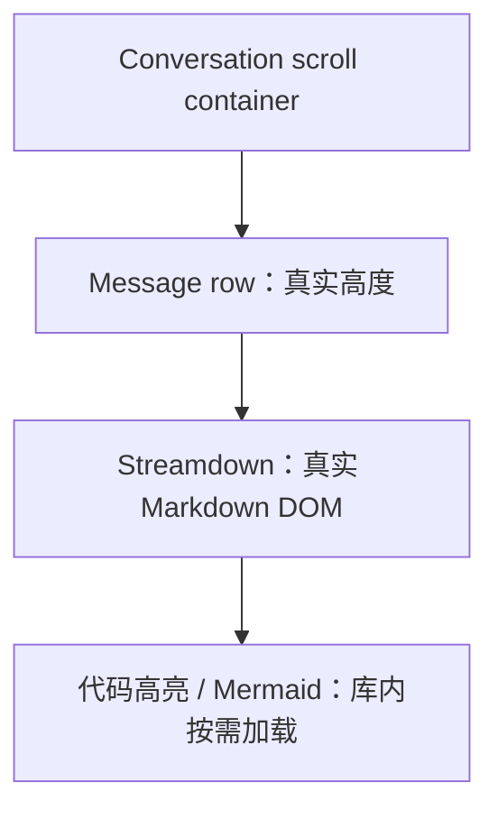

# v1.3.4 — Chat Markdown Renderer Evaluation

> 日期：2026-07-31
>
> 状态：Accepted / Implemented
>
> 决策：ChatMarkdown 使用 `streamdown@2.5.0`
>
> 原始数据：[chat-markdown-benchmark.raw.json](./chat-markdown-benchmark.raw.json)

## 组织逻辑

本文采用**优先级主线**，严格按“功能必须正常且至少有社区成熟方案 → 性能 → 体验”逐级裁决。之所以不用总分制，是因为 Markdown 内容不可见、滚动跳到错误 Turn 等功能失败不能被更快的帧时间抵消。每一级内部再按官方承诺、社区缺陷与 Reflecta 实测三类证据交叉验证，最后把胜出结论收敛成 ChatMarkdown 的实现约束。

## 1. 结论

Reflecta v1.3.4 的 ChatMarkdown 应从 `markstream-react@0.0.55` 切回 `streamdown@2.5.0`。

决定性原因不是 Streamdown 在所有跑分中更快，而是：

1. Streamdown 在三组压力场景中都完整渲染内容，没有可见空白。
2. Markstream React 在 100 turns × 400 blocks 时出现最多 118/240 个可见空白帧，单条 5000 blocks 时出现 228/240 个可见空白帧。
3. Markstream 官方只承诺 Vue 3 稳定；React 和高度估计 API 被明确标为 experimental。
4. Markstream 已有的稳定布局、外层虚拟滚动协调修复都只修改 Vue 实现，没有进入 React 包。
5. Streamdown 是原生 React 库；静态历史消息、流式消息、自定义组件和插件都有官方用法。它的已知流式缺陷在 Reflecta 场景中有明确配置规避。

Streamdown 的边界也必须如实记录：它不虚拟整篇 Markdown，100 turns × 400 blocks 时会产生约 11.5 万 DOM，滚动帧 p95 为 53.4ms。这个极端场景会卡，但内容仍然存在；按本次裁决顺序，它优于“滚动很快但大量帧只显示 spacer”。

## 2. 问题边界

### 2.1 Reflecta 自己的高度优化已移除

原消息行同时使用：

```css
content-visibility: auto;
contain-intrinsic-size: auto 180px;
```

这会让离屏长消息先按 180px 参与布局，进入视口后再恢复真实高度。它与 Markdown 库内部的懒渲染或虚拟占位叠加后，浏览器会反复修正 `scrollHeight`。

v1.3.4 先删除该配置，再比较两个库。最终实现不再由 Reflecta 猜测消息高度。

### 2.2 本次不引入第二套消息虚拟列表

本次目标是选择 ChatMarkdown 渲染器，不是在缺少证据时自行实现 turn 级虚拟列表。新增外层虚拟列表会重新引入消息高度缓存、恢复锚点、搜索定位和 JumpNav 协调问题，使比较失去干净基线。

最终布局只有：



## 3. 比较对象与版本

| 项目           | Streamdown                | Markstream React          |
| -------------- | ------------------------- | ------------------------- |
| 被测版本       | `2.5.0`                   | `0.0.55`                  |
| npm 稳定标签   | `latest=2.5.0`            | `latest=0.0.55`           |
| 框架定位       | React 原生                | Markstream Vue 的跨框架包 |
| 官方稳定承诺   | 正式发布                  | React 被列为 experimental |
| 已完成内容模式 | 官方 `mode="static"`      | `final=true`              |
| 长文档策略     | 全量 DOM，block/memo 优化 | 单篇 node 虚拟窗口        |

版本依据：[Streamdown npm](https://www.npmjs.com/package/streamdown)、[Markstream React npm](https://www.npmjs.com/package/markstream-react)。

## 4. 功能可靠性

### 4.1 Streamdown

Streamdown 官方定位就是 React AI 流式 Markdown 渲染器，覆盖未闭合 Markdown、GFM、KaTeX、Mermaid、Shiki、安全链接与 memoized rendering。[官方仓库](https://github.com/vercel/streamdown)

Reflecta 所需能力都有公开接口：

| Reflecta 能力  | 社区方案                                                      |
| -------------- | ------------------------------------------------------------- |
| 已完成历史消息 | 使用官方 `mode="static"`，跳过流式 block 拆分和未闭合语法处理 |
| 活跃流式消息   | 默认 streaming 模式，传入 `animated` 和 `isAnimating`         |
| 实体引用       | `components.a` 自定义 React component + `urlTransform`        |
| 搜索高亮       | `rehypePlugins`                                               |
| 数学公式       | `@streamdown/math`                                            |
| Mermaid        | diagram plugin 或自定义 Mermaid plugin                        |
| 安全链接       | `defaultUrlTransform`                                         |
| 代码块         | 官方 code shell 和异步高亮                                    |

官方明确说明 static mode 会把完整内容作为一个单元渲染，省略流式 block parsing，并保留自定义 components 与插件。[Static Mode 文档](https://streamdown.ai/docs/usage#static-mode)

自定义 React components 是公开能力，代码块在高亮完成前先显示可读纯文本，以减少异步高亮造成的布局变化。[Components 文档](https://streamdown.ai/docs/components)、[Code Blocks 文档](https://streamdown.ai/docs/code-blocks)

#### 已知缺陷与处理

| 缺陷                                                                               | 状态                                                           | Reflecta 处理                                                                                              |
| ---------------------------------------------------------------------------------- | -------------------------------------------------------------- | ---------------------------------------------------------------------------------------------------------- |
| streaming block 更新与宿主 auto-scroll 集成不当，出现 scrollbar jumping            | [#339](https://github.com/vercel/streamdown/issues/339) 已关闭 | 历史消息使用 `mode="static"`；当前活动回复使用 `animated` 直接更新，底部跟随仍由 Reflecta 管理并做回归验证 |
| 代码块 fallback 替换导致 CLS                                                       | [#391](https://github.com/vercel/streamdown/issues/391)        | [#392](https://github.com/vercel/streamdown/pull/392) 已合并，fallback 保持可读且占位更稳定                |
| streaming 且未传 `animated` 时，`useTransition` 更新可能被高频 sibling update 饿死 | [#550](https://github.com/vercel/streamdown/issues/550) 仍开放 | 活跃回复始终传 `animated`；issue 明确说明该分支直接更新且可规避冻结                                        |
| 大量解析与高亮成本                                                                 | [#237](https://github.com/vercel/streamdown/pull/237) 已合并   | 使用当前 2.5.0；历史消息走 static mode                                                                     |

这些问题没有被忽略，但都存在已经合并的修复或与 Reflecta 状态能一一对应的配置方案。

### 4.2 Markstream React

Markstream 的长期方向比 Streamdown 更完整：它设计了 node 虚拟窗口、逻辑总高度、外层 virtualizer adapter 和 thread restore state。问题是当前成熟实现属于 Vue，不属于 Reflecta 使用的 React 包。

官方发布边界明确写明：

- Vue 3 `MarkdownRender` 和 host virtual-scroll coordination 属于稳定能力；
- React、Angular、Svelte、Next 属于 experimental；
- height-estimation APIs 也属于 experimental。

依据：[Markstream 1.0 Release Readiness](https://markstream.simonhe.me/guide/release-1-0)。

官方文档要求外层虚拟列表读取 `metrics.totalHeight`，不能读取当前 renderer DOM 高度；还要求保存 thread state、measurement key 和 height cache。[外层虚拟滚动协调文档](https://markstream.simonhe.me/guide/performance#coordinating-with-an-outer-virtualizer)

但本地检查 `markstream-react@0.0.55` 和 `0.0.56-beta.0` 的公开类型后，React 包只有 `maxLiveNodes` 和 `liveNodeBuffer`，没有文档中的：

- `MarkstreamVirtualTimeline`
- `useMarkstreamVirtualAdapter`
- `virtualScroll`
- `metrics.totalHeight`
- `heightCache`

上游变更也证明能力没有进入 React：

| 上游变更                                                      | 作用                                                         | React 文件                               |
| ------------------------------------------------------------- | ------------------------------------------------------------ | ---------------------------------------- |
| [#467](https://github.com/Simon-He95/markstream-vue/pull/467) | 增加 virtual scroll coordination                             | 0                                        |
| [#543](https://github.com/Simon-He95/markstream-vue/pull/543) | final 内容关闭根节点 intrinsic placeholder，修复离屏高度变化 | 0；只修改 `NodeRenderer.vue` 和 Vue test |
| [#551](https://github.com/Simon-He95/markstream-vue/pull/551) | 优化 parser 和 timeline restore                              | 0                                        |

因此，当前 React 包没有社区成熟方案来解决本次可见空白。把 `maxLiveNodes` 设为 `0` 可以关闭 spacer，但会同时关闭它相对 Streamdown 的核心长文档策略，不能算成熟的虚拟化解决方案。

### 4.3 功能可靠性裁决

Streamdown 胜出。

Markstream 的完整设计值得继续观察，但“Vue 已解决”不等于“React 可生产使用”。本次不能把未来可能移植的能力当成当前功能。

## 5. Benchmark

### 5.1 方法

benchmark 使用真实 Chromium 生产构建，不使用 Vite dev server 或 React development mode。

共同条件：

- viewport：1280 × 900；
- 对话区域宽度：760px；
- 不使用 Reflecta `content-visibility`、intrinsic height 或 turn virtualizer；
- 每个 assistant turn 是独立 Markdown renderer；
- 每 50 blocks 一个 TypeScript code fence；
- 每 25 blocks 一个 table；
- 其余包含 heading、list、blockquote、inline code 和长段落；
- 每组运行 3 次，表格取中位数；
- 每次向下和向上各采样 120 个 animation frames；
- “空白帧”定义：viewport 中心落在 Markstream `.node-spacer` 或滚动容器裸露区域；
- heap 使用 Chromium `performance.memory.usedJSHeapSize`；
- Streamdown 使用 `mode="static"` 和生产实现相同的官方 `@streamdown/code` 插件；
- Markstream 使用 `final=true` 和包默认虚拟参数。

决策完成后已删除一次性 benchmark harness；本节与原始数据仅作为当时裁决的历史记录。

### 5.2 场景

| 场景                | Turn 数 | 每个 assistant turn 的 blocks | 目的                         |
| ------------------- | ------: | ----------------------------: | ---------------------------- |
| sustained-long      |     100 |                           120 | 长期重度聊天，每条回复都很长 |
| year-long-extreme   |     100 |                           400 | 模拟只在一个对话里持续一年   |
| single-pathological |       1 |                          5000 | 单条 Markdown 极限           |

### 5.3 结果

| 场景      | 库         | 打开中位数 |     DOM | JS Heap | Scroll frame p95 | 空白帧 / 240 | 高度变化 | 锚点漂移 |
| --------- | ---------- | ---------: | ------: | ------: | ---------------: | -----------: | -------: | -------: |
| 100 × 120 | Streamdown |     1591ms |  35,514 |  51 MiB |           16.2ms |            0 | 12,526px |      0px |
| 100 × 120 | Markstream |      873ms |  48,956 |  99 MiB |           14.3ms |            0 | 65,915px |      0px |
| 100 × 400 | Streamdown |     4807ms | 115,114 | 129 MiB |           53.4ms |            0 |  9,900px |    101px |
| 100 × 400 | Markstream |     5291ms | 142,412 | 776 MiB |            6.3ms |          118 |      0px |      0px |
| 1 × 5000  | Streamdown |      918ms |  14,347 |  26 MiB |           10.8ms |            0 |  9,698px |      0px |
| 1 × 5000  | Markstream |      678ms |   1,432 |  79 MiB |           10.2ms |          228 |      0px |      0px |

原始逐轮数据保存在 [chat-markdown-benchmark.raw.json](./chat-markdown-benchmark.raw.json)。

### 5.4 解释

#### 100 × 120

单条 120 blocks 没有超过 Markstream 默认 320 node 虚拟阈值，因此 Markstream 没有 spacer。它打开更快，但 DOM、heap 和滚动时高度变化都高于 Streamdown。

这说明 Markstream React 不是在所有长对话场景中都自动获得更小 DOM；虚拟化发生在每一条 Markdown 内部，而不是整个 conversation。

#### 100 × 400

每条回复都超过 Markstream 阈值，因此 100 条消息各自保留一个内部 live window。结果是：

- Markstream DOM 比 Streamdown 多约 2.7 万；
- heap 约为 Streamdown 的 6 倍；
- 240 个滚动位置中有 118 个位置中心是 spacer；
- 6.3ms p95 不能解释为内容滚动更快，因为大量帧没有渲染真实内容。

Streamdown 的 53.4ms p95 和 101px anchor drift 是明确性能/体验缺陷，但它没有丢失内容。

#### 1 × 5000

这是 Markstream node virtualization 理论上最占优势的场景。它确实把 DOM 降到 1,432，打开也更快；但 228/240 帧是可见 spacer，用户快速滚动时几乎始终看不到目标内容。

该结果证明当前 React 实现用功能正确性换取了漂亮的 DOM 与帧数据，不能进入生产聊天。

## 6. 按优先级裁决

### 6.1 功能必须正常

| 判断                              | Streamdown                          | Markstream React                     |
| --------------------------------- | ----------------------------------- | ------------------------------------ |
| 长历史内容始终可见                | 通过                                | 失败                                 |
| React 生产承诺                    | 正式 React 项目                     | 官方 experimental                    |
| 已知关键 bug 有成熟方案           | 有修复或明确配置规避                | 关键修复在 Vue，React 无公开协调 API |
| Reflecta 搜索/实体/安全链接可接入 | 公开 components/rehype/urlTransform | 可接入，但搜索需预解析 nodes         |

胜者：Streamdown。

裁决在此已经结束。后面的性能和体验用于记录边界，不会反转功能结论。

### 6.2 性能

Streamdown 在 100 × 120 的产品重度场景中保持约一帧 p95、51 MiB heap，表现可接受。

在 100 × 400 的极端场景中，Streamdown 的全量 DOM 明显卡顿。Markstream 也没有形成有效优势：打开更慢、DOM 更多、heap 高得多，并通过显示 spacer 获得低帧时间。

胜者：Streamdown，但带有“100 × 400 不满足流畅目标”的明确上限。

### 6.3 体验

Streamdown 的极端场景可能出现异步代码块导致的高度变化和短时卡顿；Markstream 则出现大面积空白。对于用户回看一年对话、搜索和 JumpNav，内容连续可见比快速滚过空白更重要。

胜者：Streamdown。

## 7. v1.3.4 实现约束

### 7.1 ChatMarkdown

- 已完成消息：`mode="static"`。
- 活跃流式消息：`mode="streaming"`，始终传 `animated` 和 `isAnimating`。
- 实体引用继续由 `components.a` 和安全 `urlTransform` 处理。
- 搜索高亮继续使用现有 rehype plugin。
- 数学公式使用 `@streamdown/math`。
- Mermaid 复用 Reflecta 现有 `renderMermaid`，不新增第二套 renderer。
- 保留 Streamdown 官方样式入口，再由 `markdown-theme.scss` 做 Reflecta 视觉覆盖。

### 7.2 布局

- 不恢复消息行 `content-visibility`。
- 不添加固定消息高度、平均高度缓存或手写 spacer。
- 不同时启用 turn virtualization 和 Markdown block virtualization。
- JumpNav 继续以业务 Turn 为导航对象，不读取 Markdown block 数量。

### 7.3 删除

- 删除 `markstream-react` 和仅为其接入引入的依赖。
- 删除 `_markstream.scss`。
- 恢复并校准 `_streamdown.scss`。
- 删除 Markstream AST 搜索预解析路径，恢复统一 rehype 搜索路径。

## 8. 后续触发条件

本次不自行实现虚拟列表。只有同时满足以下条件时，才重新评估：

1. 真实用户数据证明 100 × 120 已经达不到交互目标，而不是仅有合成 benchmark；
2. Markstream React 将 `virtualScroll`、逻辑总高度、稳定 final layout 和 restore state 提升为公开稳定 API；
3. 或社区出现能同时覆盖动态消息高度、搜索定位、JumpNav 和流式增长的成熟 React conversation virtualizer。

重新评估时仍使用本报告的红/绿空白断言，不能只比较 DOM 和帧时间。

## 9. 实现验证

最终实现已经按本报告约束完成：

- `ChatMarkdown` 已切换到 Streamdown，代码、数学公式、Mermaid、表格控制、实体引用、安全链接和搜索高亮均接回；
- 活跃回复在真实 Storybook 自动流式故事中从第 1 帧更新到后续帧，没有出现内容冻结；
- Storybook DOM 中 9 个 Markdown 根节点、6 种实体状态和 2 个 Mermaid block 均存在，Markstream node/spacer 为 0；
- Markdown 根节点没有横向溢出，长代码和宽表格由各自容器承接；
- Chromium 控制台没有应用 error；仅有 Storybook 11 预告和仓库现有 Vue feature-flag warning；
- 单条 5000 blocks 的 Streamdown 空白断言通过：0/240 空白帧；
- UI 与 Electron typecheck、Electron 生产构建和 Storybook build 通过；
- UI 66 个单元测试、Electron main 146 个测试、Electron renderer 158 个测试全部通过。
