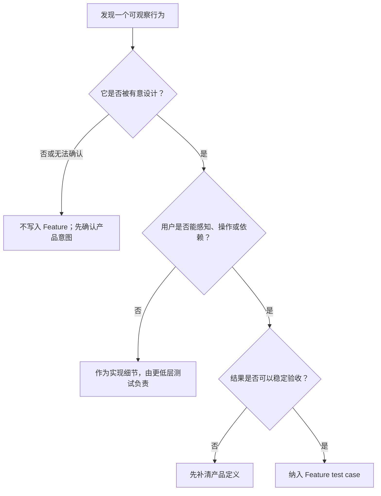
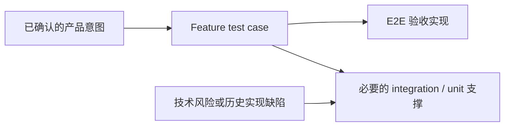

# v1.3.5 — Product Feature Test Design

> 日期：2026-07-31
>
> 状态：Proposed
>
> 核心判断：所有 intentionally designed features 都应该被 Feature test case 覆盖；不是有意设计的实现细节不进入 Feature。

## 组织逻辑

本文采用“定义 → 边界 → 覆盖 → 写法 → 维护”的递进结构。先确定什么才是产品 Feature，再用统一标准区分 Feature 与实现细节；随后定义每个 Feature 应覆盖的成功和错误行为，最后把原则落到 Gherkin 写法与产品变更流程。这样可以先解决“该不该测”，再解决“测什么”和“怎么写”，避免从现有代码或自动化实现反推产品功能。

## 1. 核心心智

Feature test case 是产品功能的可执行说明。

这里的 Feature 不是代码目录、React 组件、页面元素或测试文件，而是产品**有意提供并承诺给用户的能力或行为**。Feature 文件应该如实回答：

- 用户现在可以用产品完成什么；
- 产品完成操作后承诺什么结果；
- 产品在可预期的失败条件下承诺如何表现。

因此，Feature test case 的完整性标准是：

> 当前产品中每一项 intentionally designed feature，都至少有 happy path；产品有意设计的 expected error behavior，也必须全部被覆盖。

反过来，代码中偶然存在、没有被确认为产品契约的行为，即使可以被自动化观察，也不因此成为 Feature。

## 2. 什么是 intentionally designed feature

一项行为同时满足以下三个条件，才应视为 intentionally designed feature：

1. **有明确产品意图**：它来自已接受的产品文档、iteration 决策、交互设计，或由产品负责人明确确认为产品能力。
2. **用户可以感知或依赖**：用户能够操作它、看到它的结果，或依靠它维持自己的工作状态。
3. **结果可以验收**：不同测试者按照同样的前置条件和步骤，能够一致判断产品是否兑现了承诺。

判断流程如下：



### 2.1 UI 行为也可以是 Feature

不能用“这是 UI”作为删除 test case 的理由。只要 UI 行为是有意设计的产品能力，它就是 Feature。

典型正例：

- 用户展开或收起一组信息，以控制当前阅读范围；
- 用户调整面板尺寸，以改变自己的工作空间；
- 用户拖动 Domain，以调整长期领域的顺序或层级；
- 用户修改 Understanding，并在重新打开后继续看到修改结果。

这些行为都具有明确的用户目的和可观察结果。

### 2.2 页面元素本身不是 Feature

控件只是完成 Feature 的入口，不能把控件状态冒充产品功能。

典型反例：

```gherkin
场景: 保存按钮可以点击
  假如页面存在保存按钮
  那么保存按钮应该可以点击
```

这个场景没有表达用户要完成的事情，也没有验证点击后产品承诺的结果。

应该改为：

```gherkin
场景: 用户修改 Understanding
  假如用户正在查看一条已有 Understanding
  当用户修改标题并保存
  那么页面应该显示修改后的标题
  而且用户重新打开这条 Understanding 后仍应看到修改后的标题
```

按钮是否可点击只是完成该路径的必要条件，不是 test case 的目标。

## 3. Feature 的覆盖范围

每项产品 Feature 的场景只分为两类：happy path 和 expected error behavior。`recovery`、`isolation`、`context` 等词可以作为辅助标签，但不再作为与这两类并列的覆盖要求。

### 3.1 Happy path

Happy path 证明用户能够完成产品有意支持的目标。

同一项 Feature 可能需要多个 happy path，但只有当用户入口、关键状态或产品结果确实不同，才拆成多个场景。不要为了穷举控件组合而制造场景。

例如“修改实体”可以包含：

- 修改 Understanding 的内容并保存；
- 修改 Understanding 所属的 Domain；
- 重新进入后仍然看到已保存的修改。

如果这些结果属于同一个连续用户目标，可以放在一个场景；如果入口、前置状态或验收结果彼此独立，再拆开。

### 3.2 Expected error behavior

Expected error behavior 是产品**有意设计过处理方式**的失败路径，而不是任意技术故障。

典型场景：

- 用户提交无效输入后看到明确说明，原有数据没有被破坏；
- 用户删除不存在的对象后收到可理解的结果；
- Agent 回复失败后，输入区恢复可用并允许用户重试；
- 模型下载失败后，用户看到失败状态并可以重新下载。

只有“系统可能报错”还不够。Feature 必须说明产品准备如何帮助用户理解错误并继续操作。

### 3.3 “全部覆盖”不等于组合穷举

覆盖所有 intentionally designed features，是按**产品承诺**穷尽，不是按输入参数、浏览器事件或内部状态排列组合。

一项 Feature 的最小覆盖矩阵是：

| 覆盖项                  | 必须回答的问题                           |
| ----------------------- | ---------------------------------------- |
| Happy path              | 用户能否完成这项功能并得到正确结果？     |
| Expected error behavior | 每一种有意设计的失败处理是否兑现？       |
| 持久状态                | 如果产品承诺保存，重新进入后是否仍正确？ |
| 跨对象状态              | 如果产品承诺隔离，切换对象后是否仍正确？ |

后两项只有在产品明确承诺时才需要；它们分别归入对应功能的 happy path 或 expected error behavior，不额外创造测试分类。

## 4. 不属于 Feature test case 的内容

以下内容本身不进入 Feature：

- DOM 层级、CSS class、React state、事件类型；
- 像素位置、内部测量值、渲染帧数；
- 流式 delta 如何合并、缓存如何更新、数据库事务如何执行；
- 某个函数是否被调用、某个组件是否挂载；
- 控件单独“存在”“可点击”“被禁用”，但没有对应用户目标；
- 当前实现偶然表现出来、尚未被确认的交互；
- 历史 bug 的症状复刻。

视觉样式也不能自动算作 Feature。颜色、间距和 hover 效果通常由视觉验收、截图测试或组件测试负责；但如果视觉状态承载明确产品语义，例如危险操作、不可用状态或当前选中对象，则 Feature 应验证用户能理解的状态，而不是指定 CSS 值。

历史 bug 应先回到产品承诺：

- 如果 bug 破坏了已有 Feature，就加强该 Feature 对应的自动化测试；
- 如果 bug 暴露出此前遗漏的 intentionally designed behavior，就补充 Feature；
- 如果 bug 只涉及内部实现，不新增 Feature test case。

## 5. Feature 文件如何组织

### 5.1 Feature 表达一组连贯的产品能力

Feature 文件优先按用户能力或场景族命名，例如：

- `manage-understandings.feature`
- `organize-domains.feature`
- `start-conversation.feature`
- `handle-agent-errors.feature`

不要按组件名、服务名或自动化测试层级命名。

### 5.2 Scenario 表达一项产品承诺

每个 Scenario 只保留：

```text
稳定 ID
用户目标
前置产品状态
用户操作
用户可观察结果
```

Gherkin 对应关系：

```text
Feature  = 一组相关的 intentionally designed features
Scenario = 一个可以独立验收的产品承诺
Given    = 用户开始操作前的产品状态
When     = 用户为了完成目标而采取的操作
Then     = 产品向用户兑现的结果
```

Scenario 标题应直接描述用户目标或结果。不要写成“测试某组件”“检查按钮”“回归某 bug”。

### 5.3 只写用户能执行和观察的内容

推荐：

```gherkin
场景: 用户收起 Agent 活动后专注阅读最终回复
  假如当前 Agent 回复同时包含活动记录和最终回复
  当用户收起 Agent 活动
  那么活动记录应该隐藏
  而且最终回复应该仍然可见
  当用户再次展开 Agent 活动
  那么原有活动记录应该重新显示
```

不推荐：

```gherkin
场景: 折叠组件切换状态
  当用户点击 ChevronDown 图标
  那么 data-state 应该从 open 变成 closed
```

两者可能覆盖同一段代码，但只有前者描述了产品有意提供给用户的能力。

## 6. Feature 与自动化测试的关系

产品定义在前，自动化实现方式在后：



Feature test case 不应该为了给现有 E2E、unit 或 integration test 找理由而创建。正确顺序是先确认产品能力，再选择最合适的自动化层级。

E2E 负责证明用户从真实入口能够完成 Feature 场景。Unit 和 integration test 可以更细地覆盖状态组合、边界条件与历史技术回归，但这些技术测试不应反向污染 Feature 的产品语言。

## 7. 产品变更时如何维护 Feature

Feature 文件必须跟随当前产品事实，而不是永久保存历史行为。

### 7.1 新增功能

在实现前：

1. 确认产品意图和验收结果；
2. 补充 happy path；
3. 列出所有已经设计的 expected error behavior；
4. 再决定 E2E、integration 和 unit 的分工。

### 7.2 修改功能

先修改 Feature，使其表达新的产品承诺，再调整自动化实现。不要同时保留互相矛盾的新旧场景。

### 7.3 删除功能

功能被明确移除后，对应 Feature Scenario 和由它派生的 E2E 应一起删除。不能因为代码曾经存在，就继续把旧行为当成当前产品契约。

例如 Bash 长输出折叠功能已经被移除，它就不再属于产品 Feature，也不应保留“长输出可以展开”的 Feature test case。

### 7.4 修复 bug

先判断 bug 违反了哪项产品承诺：

- 已有 Feature 足以表达正确行为：只修实现并加强对应自动化；
- 产品承诺存在但 Feature 遗漏：补充 Feature；
- 没有明确产品意图：先做产品决策，不能从 bug 症状直接创造 Feature。

## 8. Review 清单

Review 每个 Feature Scenario 时逐项确认：

1. 能否指出它对应的明确产品意图？
2. 场景目标是否是用户要完成的事情，而不是控件或代码状态？
3. 结果是否由用户感知、操作或依赖？
4. Given 是否只描述必要的产品前置状态？
5. When 是否描述用户操作，而不是内部事件？
6. Then 是否描述正确结果，而不是“没有出现历史 bug”？
7. 具体测试数据是否来自 seed、fixture 或已绑定变量？
8. AI 输出是否只验证可控的产品状态？
9. Happy path 是否覆盖了这项功能的主要承诺？
10. 所有 intentionally designed expected error behaviors 是否已经覆盖？
11. 是否存在仅为参数组合、DOM、样式或内部状态新增的场景？
12. 产品已经移除的功能是否同步删除了场景？

只要第 1—3 项有一项无法回答，这个 Scenario 就不应直接进入 Feature 文件，应先回到产品定义。

## 9. v1.3.5 落地目标

v1.3.5 按本设计完成两件事：

1. 把“覆盖所有 intentionally designed features，以及其 happy path 和 expected error behavior”写入长期 test case 原则；
2. 以当前产品意图为依据重新审查现有 Feature，补齐遗漏的产品能力，删除实现细节和已经移除的功能。

这次审查不以减少或增加测试数量为目标。唯一判断标准是：Feature 文件能否如实、完整地描述当前产品有意提供的功能。
