# Generative UI / A2UI 技术实现调研：Canvas Draft Inline Widget

> 调研日期：2026-08-24  
> 调研对象：Understanding Canvas v2.0.0 的 U1 Inline Widget、U5 draft-preview、PRD M8-5  
> 交付性质：技术实现调研与架构建议，不包含代码修改  
> 事实来源：本仓库现行代码与架构规范，以及各方案的官方文档、协议与官方源码  
> 说明：目录名沿用 a2ui，但本文会严格区分广义 Generative UI、Tool UI 和 A2UI 协议；目录名不代表已经决定采用 Google A2UI。

## 1. 要回答的问题

本调研针对以下产品目标给出可实施的技术判断：

1. Agent 在消息内输出 Canvas 结构提案；
2. Chat 将它渲染为只读小画布，而不是 JSON 或代码块；
3. 同一个内联块覆盖生成中、等待审批、执行中、完成、拒绝和失败；
4. 用户可以应用、修改或拒绝；
5. 首个类型是 canvas-draft，但机制未来可以承载其他已知富组件；
6. 非法 payload 或未知 widget 必须降级，不得破坏整条消息；
7. 实时显示、历史重开和审批后恢复必须一致；
8. 不让模型输出或执行任意 React、HTML、JavaScript；
9. 不破坏现有 Agent Session Projection、审批机制和 CanvasDocument 保存路径。

输入文档中的既定表述是：

- UI/UX U1：消息 part / 工具结果携带 widgetType + 结构化 payload，按 widget 注册表路由；
- UI/UX U5 与 PRD M8-5：canvas draft 在消息内联渲染，用户诊断后应用 / 修改 / 拒绝；
- Server §6.2：payload 是 CanvasDocument，提案 = 展示 = 应用同构，校验失败降级为通用工具活动块；
- Session Projection 现行规范：Main 只输出有序事实，Turn Renderer 派生卡片与视觉意义，Main 不输出 React props、卡片布局或展示文案。

这几条方向大体兼容，但“widgetType 是否应该成为持久事实”“CanvasDocument 是否真的是模型可直接生成的完整契约”“展示 tool 是否需要单独存在”仍有技术冲突，本文会逐项展开。

## 2. 结论先行

### 2.1 这不是开放式 A2UI，而是 Controlled Tool UI

Canvas Draft 的组件类型、数据领域和交互都已经预先确定：

- 模型选择的是 canvas_create 或 canvas_update；
- 模型提供的是结构化工具参数；
- 应用选择的是预置的 CanvasReadOnlyView；
- 用户动作进入既有审批通道；
- 模型不需要组合 Card、Row、Button、Text 等任意组件树。

因此最准确的社区分类是 **Controlled Tool UI / Tool Call Rendering**，不是“模型自由拼装界面”的声明式 A2UI，也不是模型生成 HTML 的开放式 UI。

Vercel AI SDK、assistant-ui 和 CopilotKit 的成熟共同做法都是：保留可序列化的 tool call part，以 tool name / typed part 路由到一个已知 React renderer；renderer 同时收到参数、结果、稳定 toolCallId 和生命周期。Vercel 将其直接定义为“把 tool call 的结果连接到 React component”；CopilotKit 称为 controlled generative UI；assistant-ui 则明确区分 Tool UI、Data UI 和模型组合组件树的 Generative UI。

参考：

- [Vercel AI SDK：Generative User Interfaces](https://ai-sdk.dev/docs/ai-sdk-ui/generative-user-interfaces)
- [CopilotKit：Tool Call Rendering](https://docs.copilotkit.ai/agent-spec/generative-ui/tool-rendering)
- [assistant-ui：Tool UI](https://www.assistant-ui.com/docs/tools/tool-ui)
- [assistant-ui：Generative UI 模式分类](https://www.assistant-ui.com/docs/tools/generative-ui)

### 2.2 v1 不应引入新的 Generative UI 框架依赖

Reflecta 已经拥有这些框架会提供的核心设施：

- ordered message blocks；
- toolCallId；
- 工具参数流式预览；
- durable approval request；
- approve / reject 命令；
- tool execution result；
- Turn Renderer；
- 通用 proposal / activity fallback；
- CanvasReadOnlyView；
- Effect Schema 运行时契约。

引入 AI SDK UI、assistant-ui、CopilotKit 或 AG-UI，不是“增加一个 renderer”，而是同时引入或替换聊天 runtime、message part、tool lifecycle、approval runtime 或 agent-to-frontend transport。对当前 Electron + Pi + Effect-native 架构而言，收益小于适配成本。

推荐做法是 **借鉴它们的协议形状和状态机，不采用它们的 runtime**。

### 2.3 canvas-draft 应附着在 canvas_create / canvas_update 的审批块上

当前 M8-5 的真正数据源不是工具执行结果，而是写工具的待审批参数：

- canvas_update 的目标文档位于 input.document；
- canvas_create 的草稿位于 input.initial；
- 审批完成后的 output 只有 resultRefType / resultRefId / resultRefTitle；
- 用户必须在工具执行前看到提案，才能决定是否应用。

所以 canvas-draft 是 **approval-state Tool UI**，不是完成后的 result widget。

v1 不需要增加独立 canvas_preview、show_widget 或 display_canvas 工具。单独展示工具会：

1. 增加一次模型 tool call；
2. 重复发送同一份 Canvas 数据；
3. 产生“预览的是 A、真正审批保存的是 B”的漂移风险；
4. 让一个用户决策被拆成两个无原子关系的 tool call；
5. 给重开恢复增加额外关联键。

现有 canvas_create / canvas_update 已经是正确的语义锚点；内联预览只是这两个 approval block 的专用呈现。

### 2.4 widgetType 不应在 v1 作为新的 Main 持久事实重复 toolName

Session Projection 的现行规范要求 Main 输出“发生了什么”，Turn Renderer 输出“用户如何理解”。canvas_update 是事实，canvas-draft 是呈现。

社区里的 Controlled Tool UI 也普遍以 tool name 路由：

- AI SDK 使用 tool-{toolName} 的 typed part；
- assistant-ui 的 render-only tool key 必须匹配后端 tool name；
- CopilotKit 的 renderer 通过 name 匹配工具，并由通配 renderer 兜底。

因此 v1 最小且符合现行架构的路径是：

```text
approval block.toolName = canvas_create / canvas_update
        ↓ Turn Renderer
derive widgetType = canvas-draft
        ↓ UI view
render Canvas Draft
```

可以在 Renderer 的 view type 中保留 widgetType，用于类型收窄与渲染分发；但不必把它复制进 Main 的 durable message facts 或工具 output。

只有出现以下需求时，wire-level widgetType 才成为真实的新协议字段：

- widget 可以独立于 tool call 出现；
- 同一个 tool call 需要产生多个不同 widget；
- 后端而非模型决定额外插入一个 Data UI part；
- 第三方工具需要携带宿主未知的 UI resource；
- tool name 与展示语义之间存在运行时可配置的多对多关系。

这些条件在 Canvas Draft v1 都不存在。

### 2.5 当前最大的前置风险不是注册表，而是 Canvas 草稿契约没有闭合

当前工具提示要求 Agent 不写坐标，但 CanvasDocument 的元素要求：

- canvasId；
- x / y；
- width / height；
- zIndex；
- createdAt / updatedAt。

边还要求 canvasId、createdAt、router、connector、attrs 等完整持久化字段。canvas_create 审批前又尚未获得真实 canvasId。工具 schema 目前只验证 elements / edges 是数组，内部元素使用 Type.Unknown；执行时再强制转换为 CanvasDocument。

因此“模型输出 = CanvasDocument = 直接预览 = 直接保存”目前只在 TypeScript 文字层面成立，运行时并不成立。必须先定义一个确定性的规范化边界：

```text
model-facing Canvas Draft Intent
        ↓ decode + validate
        ↓ generate IDs + preserve existing IDs
        ↓ auto-layout / preserve existing layout
        ↓ fill rendering defaults
Normalized CanvasDocument
        ↓ persist in durable approval payload
        ├─ preview
        └─ apply exactly the same normalized document
```

“提案 = 展示 = 应用”应该定义为 **规范化后的文档三者一致**，而不是要求模型生成数据库 / X6 所需的全部机械字段。

### 2.6 “修改”应优先复用 reject-with-feedback，而不是新增第三种审批协议

当前共享决策只有：

- approve；
- reject，可带 reason。

AI SDK 和 assistant-ui 的服务器审批门同样以 allow / deny 为基本语义；复杂的人机输入通常是独立 human-in-the-loop 流程，而不是把 approval 强行扩成任意编辑器。

对 v1 最小且语义完整的定义是：

- 应用：approve，执行已冻结的 normalized document；
- 拒绝：reject，无需继续修改；
- 修改：收集用户修改意见，然后以 reject(reason) 提交；Agent 自动续跑并生成新的 canvas_create / canvas_update 提案。

这样“修改”是 UI 文案与交互路径，不是第三种 durable decision。若未来希望用户直接在 draft 内编辑节点，那是“可编辑提案工作台”，需要独立的草稿状态、变更合并和重新审批语义，不应塞入 v1 Inline Widget。

## 3. 术语与方案分层

社区对 Generative UI 的命名并不统一。为了避免选错方案，本文采用以下分层。

| 层级                             | 谁决定 UI 形态                      | 传输内容                                  | 典型实现                                                           | Canvas Draft 适配度                             |
| -------------------------------- | ----------------------------------- | ----------------------------------------- | ------------------------------------------------------------------ | ----------------------------------------------- |
| Controlled Tool UI               | 应用预先绑定；模型只选工具          | tool name + args + result + lifecycle     | AI SDK ToolUIPart、assistant-ui Tool UI、CopilotKit Tool Rendering | **最高**                                        |
| Backend Data UI                  | 后端 / orchestrator 决定插入已知 UI | named data part + payload                 | AI SDK DataUIPart、assistant-ui Data UI                            | 中；适合非 tool 驱动的后端附加卡片              |
| Declarative Generative UI        | 模型从可信 catalog 组合 UI 树       | component tree + data model + actions     | Google A2UI、assistant-ui present / GenerativeUI primitive         | 低；当前没有动态布局需求                        |
| Sandboxed App UI                 | 第三方服务提供完整 UI 应用          | UI resource + tool data + bridge messages | MCP Apps                                                           | 低；适合跨信任边界第三方 UI                     |
| Open-ended generated code        | 模型生成 HTML / JS / React          | executable code 或 HTML                   | 产品内部 show_widget 类能力                                        | 不采用                                          |
| Server-rendered component stream | 服务端直接流 React component        | RSC stream                                | AI SDK RSC streamUI                                                | 不适配 Electron / Vite，且官方仍标 experimental |

“注册表”在这些层级里的含义也不同：

- Tool UI 注册表：tool/widget 的语义类型 → 预置业务组件；
- A2UI catalog：Text / Row / Card 等低层组件词汇 → 原生组件；
- MCP Apps registry：tool metadata → ui:// HTML resource；
- open-ended code：通常没有可信组件边界，风险最高。

Canvas Draft 需要的是第一种，不需要建设后三种基础设施。

## 4. 社区方案深度调研

### 4.1 Vercel AI SDK UI

#### 4.1.1 核心消息模型

AI SDK 的 UIMessage 把消息定义为有序 parts。Assistant part 可以包含 text、reasoning、file、source、data 和 tool 等判别联合。ToolUIPart 的 type 从工具名派生，保持 toolCallId，并用显式 state 表达参数流、审批和结果。

官方源码与示例体现的状态包括：

- input-streaming：参数仍在流式生成；
- input-available：参数完整，可执行或正在执行；
- approval-requested：等待用户批准；
- approval-responded：已响应审批，等待执行结果；
- output-available：执行完成；
- output-denied：用户拒绝；
- output-error：执行失败。

参考：

- [AI SDK UIMessage 官方源码](https://github.com/vercel/ai/blob/main/packages/ai/src/ui/ui-messages.ts)
- [AI SDK Tool Approval](https://ai-sdk.dev/docs/ai-sdk-ui/chatbot-tool-usage)

这套状态名与 Reflecta 当前 ProposalState 几乎一一对应。Reflecta 已经存在 input-streaming、approval-requested、approval-responded、output-available、output-denied、output-error，不需要再发明一套 widget lifecycle。

#### 4.1.2 审批模式

AI SDK 允许服务端工具声明 needsApproval。客户端在 approval-requested 状态显示工具参数与确认 UI，通过 approval id 回传 approved boolean；审批响应后可以自动继续模型循环。

值得借鉴的不是 API 名，而是三点：

1. 审批 UI 属于同一个 tool part，不是另一条 UI 消息；
2. toolCallId 标识工具调用，approval id 标识这次决策，两者职责不同；
3. 拒绝也是终态，历史记录必须保留，而不是把卡片删除。

这与 Reflecta 已有 approval block、approvalId、toolCallId、tool.approve / tool.reject 完全同构。

#### 4.1.3 Data Part

AI SDK 还提供 DataUIPart：后端可以把自定义结构化数据作为消息 part 写入；同一个 data part id 的后续写入会在客户端 reconciliation，而 transient part 不进入历史。

参考：[AI SDK Streaming Custom Data](https://ai-sdk.dev/docs/ai-sdk-ui/streaming-data)

Data Part 适合：

- 后端决定附加一张不对应工具调用的状态卡；
- 协作 artifact 的渐进更新；
- 进度、通知或引用元数据；
- 同一 part 需要用稳定 id 更新。

它不应作为 Canvas Draft v1 的首选，因为 Canvas Draft 已经对应一个明确写工具和审批生命周期。再增加 data part 会复制同一事实。

#### 4.1.4 运行时校验

AI SDK 的 validateUIMessages 可以按 metadata schema、data schema 和 tool input / output schema 校验历史消息。官方源码还特别处理终态 tool part：终态历史可能保留不完整或旧输入，不能因为升级 schema 就让整个 replay 崩溃。

参考：

- [validateUIMessages 文档](https://ai-sdk.dev/docs/reference/ai-sdk-core/validate-ui-messages)
- [validate-ui-messages 官方源码](https://github.com/vercel/ai/blob/main/packages/ai/src/ui/validate-ui-messages.ts)

对 Reflecta 的启示：

- live 完整参数在进入 approval 前必须严格校验；
- 历史中的未知 / 旧 widget 必须软失败为通用活动块；
- 不应让一个坏 widget 导致整条 assistant message 无法显示；
- schema version 演进要考虑已持久化 approval payload。

#### 4.1.5 为什么不采用 AI SDK RSC streamUI

AI SDK RSC 让工具直接返回 React Server Components，但官方仍标记为 experimental，并明确建议生产环境迁移到 AI SDK UI；官方列出的限制包括 abort、remount flicker、Suspense 崩溃风险和数据传输放大。

参考：[AI SDK RSC → UI 迁移说明](https://ai-sdk.dev/docs/ai-sdk-rsc/migrating-to-ui)

Reflecta 是 Electron + Vite renderer，不是 Next.js RSC host。更重要的是，React component 不可序列化，无法自然进入现有 durable session projection。采用 RSC 会逆转当前“事实可重建、视图由 Renderer 派生”的架构，因此不适用。

#### 4.1.6 对 Reflecta 可直接借鉴的部分

- ordered typed parts；
- stable toolCallId；
- 显式生命周期；
- approval 与 tool part 同位；
- data part 只在 tool-independent 场景使用；
- schema validation + terminal fallback；
- serializable data 与 React rendering 分离。

不需要采用：

- useChat；
- AI SDK transport；
- provider tool runtime；
- RSC streamUI；
- AI SDK 自己的持久化模型。

### 4.2 assistant-ui

#### 4.2.1 Render-only Tool UI

assistant-ui 支持为“执行发生在外部”的工具只注册 renderer。注册 key 必须与后端 tool name 一致，renderer 收到：

- args；
- argsText；
- result；
- status；
- toolName；
- toolCallId；
- human interrupt / approval callbacks 等上下文。

参考：

- [assistant-ui：Defining Tools](https://www.assistant-ui.com/docs/tools/defining-tools)
- [assistant-ui：Tool UI](https://www.assistant-ui.com/docs/tools/tool-ui)

这与 Reflecta 最接近：Pi 和 Main 负责工具执行，Electron Renderer 只把已投影的 tool / approval block 画成 React UI。

#### 4.2.2 Partial args 与 Deferred Rendering

assistant-ui 明确承认 tool args 会逐字段流入。对普通文本卡，可以边流边画；对图表、iframe、重型 visualization，官方建议 deferred rendering：参数完整前不挂载重型组件，只显示轻量状态，完成后再渲染最终 UI。

CanvasReadOnlyView 内部挂载 X6 图，属于重型组件。推荐行为是：

- partial args 阶段：只画 Canvas Draft 外壳、标题和 skeleton；
- document 完整且通过 decode 后：才挂载 CanvasReadOnlyView；
- 后续仅生命周期变化时复用同一个 toolCallId / React key；
- 不尝试拿半段 JSON 构建 X6 Graph。

这比“每个 token 都重新构图”更稳定，也避免布局抖动。

#### 4.2.3 Tool UI 与 Data UI 的边界

assistant-ui 官方区分：

- Tool UI：模型通过调用工具决定是否显示；参数可流式；
- Data UI：后端或 LangGraph node 主动推送 named data event；通常是终态数据；
- Generative UI：模型通过 present 工具从组件 vocabulary 组合 JSON tree。

Canvas Draft 由模型的 canvas_create / canvas_update 决定，且需要在审批前展示参数，所以属于 Tool UI。若未来 Main 在一次工具完成后额外生成性能报告、迁移摘要或 artifact 卡，而模型没有调用显示工具，才考虑 Data UI。

#### 4.2.4 Approval / Human-in-the-loop

assistant-ui 的 server-side approval gate 把 approval 暴露在同一 tool renderer 上；approved 为 undefined 时显示按钮，true 时显示执行中，false 时显示拒绝原因。官方也提供 human() / resume() 处理真正需要用户输入的数据收集。

参考：[assistant-ui Tool UI：Server-side approval gates](https://www.assistant-ui.com/docs/tools/tool-ui)

对 Reflecta 的启示：

- 应用 / 拒绝是 approval gate；
- “修改意见”如果只是让 Agent 重提，使用 reject reason；
- 真正的直接编辑与多步骤表单，应另建 human-input workflow，不能假装是普通 approval。

#### 4.2.5 Fallback

assistant-ui 为没有专用 renderer 的工具提供 ToolFallback。成熟实现不是要求所有工具都认识，而是：

```text
named renderer
    ↓ 未匹配 / decode 失败
generic tool fallback
```

Reflecta 已有 AgentProposalCard 和 AgentToolActivityView，可直接成为 fallback，不需要新增一套 UnknownWidgetCard。

### 4.3 CopilotKit 与 AG-UI

#### 4.3.1 Controlled Tool Rendering

CopilotKit 把 Tool Rendering 定义为 Generative UI 的 controlled 变体。它支持：

- 按工具名注册专用 renderer；
- “*” 通配 renderer 兜底；
- renderer 获得 parsed args、live status 和 result；
- 参数流式阶段、执行阶段、完成阶段的显式状态。

参考：

- [CopilotKit Tool Call Rendering](https://docs.copilotkit.ai/agent-spec/generative-ui/tool-rendering)
- [CopilotKit useRenderToolCall](https://docs.copilotkit.ai/reference/v2/hooks/useRenderToolCall)

它验证了“专用 renderer + 通用 fallback”的成熟性，也说明不需要额外 widget tool：工具本身就是路由标识。

#### 4.3.2 Human in the Loop

CopilotKit 的 useHumanInTheLoop 采用 InProgress → Executing → Complete：

- InProgress：参数仍在流；
- Executing：参数完整，等待用户 respond；
- Complete：用户已响应并有结果。

参考：[CopilotKit useHumanInTheLoop](https://docs.copilotkit.ai/reference/v2/hooks/useHumanInTheLoop)

这与 Reflecta 的 preview → pending approval → completed / rejected 很接近。区别只是 Reflecta 把批准后工具执行作为独立 executionState 保存，状态更细，不需要向 CopilotKit 收缩。

#### 4.3.3 AG-UI 事件协议

AG-UI 是 agent 与 frontend 之间的通用事件协议。Tool lifecycle 采用：

```text
TOOL_CALL_START(toolCallId, toolCallName)
TOOL_CALL_ARGS(toolCallId, delta)
TOOL_CALL_END(toolCallId)
TOOL_CALL_RESULT(messageId, toolCallId, content)
```

并为事件提供运行时 schema 校验。

参考：

- [AG-UI Events 文档](https://github.com/ag-ui-protocol/ag-ui/blob/main/docs/sdk/js/core/events.mdx)
- [AG-UI TypeScript events 源码](https://github.com/ag-ui-protocol/ag-ui/blob/main/sdks/typescript/packages/core/src/events.ts)

Reflecta 的 Pi Adapter → Main Projection → Session Feed 已经覆盖相同责任，而且比裸事件更强调 durable snapshot 与重开恢复。只为了 widget 引入 AG-UI 会产生第二套 agent-to-frontend transport 和第二个 reducer，违背 Session Projection 现行不变量。

AG-UI 可以作为未来“接入远程 agent backend”的协议候选，但不应成为本地 Canvas Widget 的依赖。

### 4.4 Google A2UI

#### 4.4.1 A2UI 解决的问题

A2UI 让 agent 用声明式 JSON 描述 UI，而客户端用自己的原生组件库渲染。它的核心不是“一个业务 payload 对应一个 React 组件”，而是：

- Surface：一块可独立创建、更新、删除的 UI 区域；
- Component tree：由带 id 的组件节点组成；
- Data Model：结构与动态数据分离；
- Catalog：客户端允许的组件和函数集合；
- Action：UI 事件回传 agent / host；
- JSONL stream：按消息增量创建 surface、更新组件和数据。

官方强调：

- 不执行模型生成代码；
- 模型只能选择 catalog 中可信组件；
- UI 结构与具体 React / Flutter / Lit 等实现解耦；
- 支持跨平台和远程 agent；
- 组件可增量更新。

参考：

- [A2UI 官方仓库与架构说明](https://github.com/a2ui-project/a2ui)
- [A2UI v1.0 Protocol](https://github.com/a2ui-project/a2ui/blob/main/specification/v1_0/docs/a2ui_protocol.md)

#### 4.4.2 A2UI 的优势

在以下场景，A2UI 比 Tool UI 更有价值：

1. Agent 要根据任务动态组合表单、表格、卡片、Tabs、Modal 等布局；
2. 同一个 agent UI 要在 Web、Flutter、原生移动端一致表达；
3. 远程 sub-agent 不知道宿主具体组件实现，但双方共享 catalog；
4. UI 会在一个 surface 内多次增量更新；
5. 需要数据绑定、actions、validation、accessibility 作为协议能力；
6. 组件组合本身就是模型输出，而不只是业务数据可视化。

#### 4.4.3 为什么 Canvas Draft v1 不应采用 A2UI

Canvas Draft 已经有一个高层业务组件 CanvasReadOnlyView。若套 A2UI，有两种做法，两种都没有收益。

**做法 A：把整个画布注册成一个 CanvasDraft 组件。**

那么 A2UI payload 最终仍只是 CanvasDraft + document，等价于当前 proposed widget registry，却多了 surface、catalog、协议版本、JSONL、renderer runtime 和 action bridge。

**做法 B：让模型用 A2UI 的 Row / Card / CanvasNode / Edge 等组件拼出画布。**

这会让模型同时负责 UI composition 与领域文档，破坏 CanvasDocument 作为唯一业务模型；还需要把 X6 的图结构、parent/edge/viewport 语义重新编码成通用组件树。

因此，A2UI 对本需求是过度建模。它应保留为以下未来条件触发的候选：

- Reflecta 允许远程 agent 生成跨平台交互表单；
- 同一消息内的 UI 结构无法预先绑定到某一个业务 widget；
- 至少出现第二个需要动态组合组件树的真实需求；
- 需要标准 catalog 与跨宿主 portability。

#### 4.4.4 可借鉴而不采用协议的部分

- allowlist / catalog，而不是 dynamic import 或 eval；
- 每个渲染单元有稳定 id；
- schema 与版本必须显式；
- 未知 component 必须局部失败；
- data 与 UI structure 分离；
- accessibility 是 renderer contract 的一部分。

这些原则可以体现在 Reflecta 的 typed widget view 中，无需引入 A2UI runtime。

### 4.5 MCP Apps 与 Anthropic show_widget

#### 4.5.1 MCP Apps 的公开稳定模型

MCP Apps 是 MCP 的 UI extension。一个支持 UI 的工具通过 metadata 指向 ui:// resource；Host 获取 HTML resource，在 sandboxed iframe 中渲染，并通过 postMessage / JSON-RPC 在 Host 与 View 之间交换 tool input、tool result、工具调用和上下文更新。

稳定规范包含：

- UI Resource；
- Tool-UI linkage；
- capability negotiation；
- sandboxed iframe；
- deny-by-default CSP；
- 双向 JSON-RPC；
- 不支持 UI 的 host 使用文本 / structured result 降级。

参考：

- [MCP Apps Overview](https://modelcontextprotocol.io/extensions/apps/overview)
- [MCP Apps Stable Specification 2026-01-26](https://github.com/modelcontextprotocol/ext-apps/blob/main/specification/2026-01-26/apps.mdx)
- [MCP Apps Build Guide](https://modelcontextprotocol.io/extensions/apps/build)

#### 4.5.2 适用场景

MCP Apps 适合：

- UI 由第三方 MCP server 交付；
- Host 与 UI 作者跨信任边界；
- UI 需要独立 bundle、资源、网络策略和权限；
- 同一 UI 要在多个 MCP host 可移植；
- widget 自身是一个小应用，需要双向调用工具。

#### 4.5.3 为什么不适合第一方 Canvas Draft

CanvasReadOnlyView 与 Chat 同属 Reflecta bundle、同一 React tree 和同一设计系统。把它放进 iframe 会引入：

- 单独构建与资源加载；
- CSS / theme token 桥接；
- X6 bundle 重复；
- postMessage bridge；
- iframe 自动高度与 resize；
- CSP 和 asset policy；
- approval callback 代理；
- 焦点、键盘和可访问性边界；
- 测试 host；
- 失去现有 React context 与直接组件复用。

这些成本只为解决“不信任第三方 UI”的问题，而当前没有这个问题。

因此 v1 应直接渲染第一方 React 组件。未来如果 Reflecta 成为 MCP Apps Host，需要显示外部 server 提供的 widget，再单独实现 sandbox seam；不能让第一方 Canvas Draft 先承担那套复杂度。

#### 4.5.4 对 show_widget 的判断

输入文档提到 Anthropic show_widget，但本次检索没有找到可供第三方实现、版本化且稳定的官方 show_widget API / wire contract。公开、可依赖的 Anthropic / MCP 方向现在是 MCP Apps，而不是复制 Claude 产品内部工具名。

因此：

- show_widget 可以作为产品体验参考；
- 不能作为 Reflecta 技术协议基线；
- 不应设计兼容一个未公开的 tool payload；
- 若未来目标是第三方 widget portability，应直接对齐 MCP Apps stable spec。

### 4.6 方案比较矩阵

| 维度              | AI SDK Tool UI         | assistant-ui Tool UI         | CopilotKit / AG-UI           | Google A2UI                                | MCP Apps                       | Reflecta 自有 Controlled Tool UI |
| ----------------- | ---------------------- | ---------------------------- | ---------------------------- | ------------------------------------------ | ------------------------------ | -------------------------------- |
| UI 选择依据       | tool name / typed part | toolkit key / tool name      | named renderer / tool events | catalog component tree                     | tool metadata → ui resource    | toolName → Turn Renderer view    |
| 模型是否组合布局  | 否                     | Tool UI 否；present 模式可以 | Tool rendering 否            | 是                                         | HTML 由 server 作者提供        | 否                               |
| 参数流式          | 支持                   | 支持，含字段状态和 deferred  | 支持                         | JSONL 增量                                 | 可预载并接收 input             | 当前已有 approval preview        |
| 审批              | 一等 tool state        | approval gate / human input  | human-in-loop                | action 可表达，但不是专用 approval runtime | app 自己通过 bridge            | 当前已有 durable approval        |
| 历史重放          | serializable parts     | runtime message parts        | transport / runtime 决定     | surface event replay / state               | host 决定                      | Main Projection 可从 facts 重建  |
| 运行时校验        | tool/data schemas      | toolkit schemas              | event schemas                | JSON Schema + catalog                      | resource / protocol validation | Effect Schema 应承担             |
| 未知类型 fallback | 应用分支处理           | ToolFallback                 | wildcard renderer            | resolution error / fallback                | text fallback                  | 现有 proposal / activity         |
| 信任边界          | 第一方 React           | 第一方 React                 | 第一方 React                 | trusted catalog                            | sandboxed third-party iframe   | 第一方 React                     |
| 跨平台            | 主要 Web/React         | React                        | React + agent transport      | 强                                         | Web iframe host                | 当前 Electron React              |
| 接入当前仓库成本  | 高：替换 runtime       | 高：替换 chat layer          | 高：第二 transport/runtime   | 很高：新协议                               | 很高：新 host + iframe         | **最低**                         |
| Canvas Draft 适配 | 模式适配，依赖不适配   | 模式最接近，依赖不适配       | 模式可借鉴                   | 过度设计                                   | 信任模型不匹配                 | **推荐**                         |

## 5. 成熟方案的共同技术原则

跨上述方案可以提炼出十一个稳定原则。

### 5.1 传输事实与 React 视图分离

消息保存结构化数据、稳定 id 和状态；React component 只在客户端由 registry / renderer 解析。不能持久化 ReactNode，也不能让 Main 直接生成组件 props。

这与 Session Projection 现行规范完全一致。

### 5.2 使用稳定调用 id 做 reconciliation

toolCallId 应贯穿：

- partial args；
- approval preview；
- durable approval request；
- approved / rejected；
- execution result；
- terminal UI。

同一调用不应在每个状态创建不同 widget id。推荐 widget view id 从 toolCallId 派生，避免 React 重挂载与消息内重复。

approvalId 仅用于提交决策，不能替代 toolCallId 作为显示身份。

### 5.3 专用 renderer 前必须有 schema decode

Renderer 不应该把 unknown payload 直接传给 CanvasReadOnlyView。必须先在边界完成：

1. 外层 tool args decode；
2. Canvas draft intent decode；
3. 领域完整性校验；
4. normalization；
5. 得到 CanvasDocument view。

任何一步失败都应返回“没有专用 widget”，让原 block 落入通用 proposal / activity，而不是抛异常中断整条消息。

### 5.4 专用 renderer 必须有通用 fallback

Fallback 同时覆盖：

- 未注册 tool / widget；
- 历史中的旧 schema；
- partial JSON；
- payload decode 失败；
- renderer 加载失败；
- Canvas 渲染异常。

Reflecta 已有通用 proposal 和 tool activity，不应再造第三套 fallback。

### 5.5 生命周期是数据，不由组件猜测

组件不得通过“有无 output”“消息是否最后一条”自行推断审批状态。Turn Renderer 应把现有 approvalState、executionState、displayState 映射到统一 lifecycle 后传入。

### 5.6 重型 UI 应 deferred mount

X6 Canvas 只在完整、已校验的 document 可用时挂载。参数流式阶段显示稳定 skeleton，避免：

- 半结构数据报错；
- 图反复初始化；
- 自动布局多次变化；
- 用户误以为半成品就是最终提案；
- 大量 token delta 触发昂贵 render。

### 5.7 Renderer 不拥有 side effect

CanvasReadOnlyView 继续纯只读；批准 / 拒绝由外层 proposal / widget shell 通过 callback 进入既有命令。组件不能直接调用 IPC、直接保存 Canvas 或修改 Query cache。

### 5.8 恢复优先于实时动画

runtime-only partial preview 可以不持久化，但 durable approval request 必须足以在应用重启后重建同一 Canvas Draft。用户审批的是 durable payload，不是只存在于 Renderer 内存里的布局。

### 5.9 “看见的”与“执行的”必须来自同一冻结值

规范化结果必须在 approval request 持久化前冻结。预览与批准执行都读取这份值；批准时不能重新调用随机 layout 或重新解析模型原始参数，否则会破坏审计性。

### 5.10 未知类型必须局部失败

一个 widget 失败只能影响自己的 block。消息中的前后文本、其他 tool、reasoning 和 receipt 必须保持有序可见。

### 5.11 允许列表优于动态加载

widgetType 只能来自 TypeScript 判别联合 / 显式 map / switch。禁止：

- 根据模型字符串 dynamic import；
- eval；
- dangerouslySetInnerHTML；
- 模型输出 JSX / React source；
- 模型决定任意 URL iframe。

## 6. Reflecta 当前实现映射

### 6.1 已经具备的基础

#### Main / Shared Projection

当前 shared type 已有：

- tool.started / completed / failed；
- approval request；
- toolCallId、toolName、input、output；
- AgentReducedAssistantBlock.tool；
- AgentReducedAssistantBlock.approval；
- preview；
- approvalState；
- executionState；
- displayState；
- rejectionReason；
- durable pending approval 的恢复能力。

Pi Agent Host 已经会在 tool 参数生成期间发 approval preview；真实 approval request 到来后，以相同 toolCallId 进入 durable block。这个能力等价于社区 Tool UI 的 partial args + requires-action。

#### Turn Renderer

apps/electron/src/renderer/src/modules/chat/messages/agent-turn-view.ts 已负责：

- ordered block 遍历；
- tool activity grouping；
- approval → proposal；
- image_generate 完成后派生 image block；
- lifecycle 映射；
- shared projection → @reflecta/ui view type。

这是正确的 widget 派生 seam。widget 不应在 Main 或 Canvas service 中渲染。

#### Chat UI

packages/ui/src/chat/message/types.ts 的 AgentMessageBlockView 当前包含 text、image、execution、proposal。

packages/ui/src/chat/message/chat-message-row.tsx 保留消息块顺序，并按 kind 渲染；这里是最终 React rendering seam。

#### Canvas renderer

packages/ui/src/canvas/CanvasReadOnlyView.tsx 已明确承担三种用途：

- canvas 引用 Modal；
- draft proposal preview；
- artifact thumbnail。

它以 CanvasDocument + CanvasShapeData 渲染 X6 只读图，不执行写入，正是 Canvas Draft 应复用的组件。

#### Approval command

AgentProposalDecision 和 AgentCommand 当前只有 approve / reject(reason)。这已经支持“应用”“拒绝”和“修改意见后重提”的最小闭环。

### 6.2 当前实现差距

#### 差距 A：canvas approval 没有专用 proposal / widget 类型

ProposalType 当前不包含 canvas_create、canvas_update、canvas_delete。proposalTypeFor 对未知工具默认返回 understanding_create。

这意味着 canvas approval 不是安全降级为 generic，而可能被误解释为 Understanding proposal。该行为与 Server §6.2 的“校验失败回退通用活动块”相反。

未来实现时必须先消除这个错误默认值；本文只记录，不修改代码。

#### 差距 B：AgentMessageBlockView 没有 widget block

当前 UI view union 只有 text、image、execution、proposal，没有 typed widget。Canvas Draft 无法作为消息有序 part 被 ChatMessageRow 分发。

#### 差距 C：工具 schema 只验证数组，不验证 Canvas 内容

canvas_create.initial.elements / edges 和 canvas_update.document.elements / edges 使用 Type.Unknown。执行 helper 只检查两者为数组，随后强制转换成 CanvasDocument。

风险包括：

- CanvasReadOnlyView 在渲染时先崩；
- 批准后才在 saveCanvas 发现错误；
- 用户看到的预览与服务端接受的结构不一致；
- 不完整历史 payload 在重开时反复报错；
- 恶意 / 异常 props 进入 X6 renderer。

#### 差距 D：模型 contract 与 CanvasDocument 不一致

工具 prompt 说“不写坐标”，但 CanvasDocument 是读模型 / 保存模型，要求完整布局和机械字段。canvas_create 又没有真实 canvasId。

这不是前端 widget 能修复的问题，必须定义 model-facing intent 与 normalized document 的边界。

#### 差距 E：CanvasDocument 单独不足以完整显示卡片内容

CanvasReadOnlyView 还需要 CanvasShapeData：

- understandingRefs：标题、正文、删除状态；
- referencedCanvases：画布标题、删除状态，必要时还有嵌套 document。

CanvasDocument 的 understanding element 只有 understandingId，canvas_ref 只有 canvasRefId；没有展示标题与正文。若不提供 shapeData，引用卡会缺少有效内容。

Server §6.2 把 widget payload 定成 CanvasDocument，只覆盖可保存结构，没有覆盖完整 presentation data。实现时必须选择：

1. Renderer 根据 document 中的引用 id 查询并构建 shapeData；
2. approval payload 同时冻结 presentation snapshot；
3. inline preview 只显示不需要完整正文的紧凑节点变体。

推荐 v1 采用 **按引用 id 查询 shapeData**，因为：

- 现有 ConnectedChatMessageRow 已经为 proposal entity labels 使用 query；
- shapeData 是派生显示数据，不属于 saveCanvas；
- 不把理解正文复制进 session log；
- 删除 / 恢复后的占位能反映当前真实状态。

但必须在 UX 上接受“引用卡内容在短暂加载后补齐”。若产品要求审批时完全离线且永久保持当时快照，才改为冻结 presentation snapshot。

#### 差距 F：“修改”没有独立协议

现有决策没有 modify。若 UI 直接显示三个按钮而没有定义 Modify 的传输语义，会产生悬空交互。

推荐定义为 reject with reason + 自动续跑重提；这无需扩协议。

#### 差距 G：“展示 tool”与“审批 tool UI”存在文档歧义

Consensus / Server 表格单列“展示 tool”，但代码没有 canvas_preview / show_widget 工具，canvas_create / canvas_update 的说明又明确说 document 会作为 draft 展示。

推荐把“展示 tool”改称“写工具的 draft-preview renderer”。如果未来只是只读展示某个已存在 canvas，可直接为 canvas_read 增加结果 renderer；也不需要另一个 display tool。

## 7. 推荐的目标架构

### 7.1 架构总览

```mermaid
flowchart LR
  Model["Model tool call\ncanvas_create / canvas_update"]
  Pi["Pi Adapter\npartial args"]
  Normalize["Main draft decoder + normalizer\ncomplete args only"]
  Approval["Durable approval block\nnormalized payload"]
  Feed["Session Projection / Feed"]
  Turn["Turn Renderer\nresolve canvas-draft"]
  View["AgentWidgetView"]
  Widget["Canvas Draft shell"]
  Canvas["CanvasReadOnlyView"]
  Decision["approve / reject(reason)"]
  Execute["existing write tool execution"]

  Model --> Pi
  Pi -->|partial preview| Feed
  Pi -->|complete args| Normalize
  Normalize -->|valid| Approval
  Normalize -->|invalid| Feed
  Approval --> Feed
  Feed --> Turn
  Turn --> View
  View --> Widget
  Widget --> Canvas
  Widget --> Decision
  Decision --> Execute
```



关键点：

- partial preview 只用于轻量 shell；
- complete args 必须先 normalize，再成为 durable approval；
- Turn Renderer 从 toolName 派生 canvas-draft；
- UI package 只接收已 decode 的 view；
- CanvasReadOnlyView 不拥有审批 side effect；
- approve 执行 durable approval 中同一 normalized document。

### 7.2 建议的三层数据契约

#### 第一层：CanvasDraftIntent

这是模型面对的 schema，只包含模型真正应该决定的语义：

- draft local element id；
- kind；
- understandingId / canvasRefId；
- text / group label / color；
- parent local id；
- edge source / target local id；
- edge label / direction / style 的有限选项；
- 对 update，保留已有 element / edge 的稳定 id；
- 不要求 canvasId、createdAt、updatedAt；
- 不要求模型生成 x / y。

这一层必须用 Effect Schema 或能转为 Effect Schema 的 JSON Schema 定义，不能继续使用内部 Type.Unknown。

#### 第二层：NormalizedCanvasDocument

这是 approval 真正冻结的目标：

- 所有 element / edge id 已稳定；
- update 中已有元素保留原 id 和必要布局；
- 新元素获得应用生成 id；
- layout 已确定；
- width / height / zIndex / router / connector / attrs defaults 已补齐；
- parent / edge 引用已验证；
- understanding / canvas refs 已验证；
- create 的 outer canvasId 尚未存在时，不应要求模型伪造；保存时由 service 的 outer canvasId 作为权威。

此层可以继续使用 CanvasDocument 的 UI / save 形状，但应明确哪些字段是领域语义、哪些只是存储派生字段。更干净的长期方向是让 save input 不包含每个 element / edge 的 canvasId 和 timestamp，因为 CanvasCore 本来就以外层 canvasId 写入并由数据库生成时间。

#### 第三层：CanvasDraftPresentation

这是 Renderer 需要的展示上下文：

- normalized document；
- hydrated CanvasShapeData；
- lifecycle；
- title / reason；
- decision enabled；
- decode / hydration error。

它不是持久化领域模型，也不进入 Main facts；由 Renderer adapter / Turn Renderer 从 approval block 与查询数据派生。

### 7.3 widget view 的建议形状

下面只是接口草案，用于说明责任，不是本次代码修改：

```ts
type AgentWidgetLifecycle =
  "streaming" | "pending" | "running" | "completed" | "rejected" | "failed";

type AgentCanvasDraftWidgetView = {
  kind: "widget";
  id: string; // stable, derived from toolCallId
  widgetType: "canvas-draft";
  toolCallId: string;
  approvalId?: string;
  lifecycle: AgentWidgetLifecycle;
  title: string;
  document?: CanvasDocument; // only present after successful decode
  error?: string;
  decisionEnabled: boolean;
};
```

注意：

- payload 不继续保持 unknown；
- widgetType 是 Renderer view discriminator，不必是 Main wire field；
- streaming 阶段 document 可以缺省；
- shapeData 可以作为渲染 props 由 Connected adapter 注入，不必复制进纯 view；
- decision callback 继续使用 AgentProposalDecision。

### 7.4 registry 的最小实现形态

v1 只有一个 widget，不应提前建设 plugin system、dynamic registration、context provider 或跨包 factory。

最小“注册表”可以是：

1. Turn Renderer 中一个纯 resolver：已知 tool block → typed widget view 或 undefined；
2. ChatMessageRow 中对 widgetType 的穷尽 switch；
3. undefined / decode failure 继续走现有 proposal / activity。

当第二个真实 widget 出现后，再把 switch 机械提取为 typed map。这样仍然满足 allowlist 和单一分发点，但不为未来假设引入运行时注册系统。

不建议：

- 全局 mutable registry；
- React mount 时注册 / 卸载 renderer；
- dynamic import；
- string → ComponentType 的不受控字典；
- widget 自己读取 raw tool block；
- widget 自己发 IPC。

### 7.5 toolName 与 widgetType 的映射

推荐初始映射：

| toolName      | 数据来源         | widgetType   | 说明                                  |
| ------------- | ---------------- | ------------ | ------------------------------------- |
| canvas_create | payload.initial  | canvas-draft | initial 存在且 normalized 后渲染      |
| canvas_update | payload.document | canvas-draft | normalized 后渲染                     |
| canvas_delete | 无画布文档       | 无           | 继续用普通删除 proposal               |
| canvas_read   | output / details | v1 无        | 未来可做 canvas-preview result widget |
| 其他工具      | 各自协议         | 无           | 走现有 proposal / activity            |

如果 canvas_create 没有 initial，则只能显示普通“新建空画布” proposal，不能伪造空 draft widget，除非产品明确空画布预览有价值。

### 7.6 生命周期映射

| Reflecta factual state         | Widget lifecycle | UI 行为                                           | 是否挂载 Canvas |
| ------------------------------ | ---------------- | ------------------------------------------------- | --------------- |
| preview=true，参数未完整       | streaming        | 外壳 + “正在生成画布结构” + skeleton              | 否              |
| preview=true，但已能 decode    | streaming        | 可选择仍延迟，避免最终 request 前抖动             | 建议否          |
| displayState=pending_approval  | pending          | 显示完整只读画布 + 应用 / 修改 / 拒绝             | 是              |
| displayState=running           | running          | 保留画布，按钮禁用，显示正在应用                  | 是              |
| displayState=completed         | completed        | 保留画布，显示已应用 receipt / 打开画布入口       | 是              |
| displayState=rejected          | rejected         | 保留当时提案，显示拒绝原因                        | 是              |
| displayState=failed            | failed           | 保留可解码画布与错误；不可解码则 generic fallback | 能解码则是      |
| unknown tool / invalid payload | 无 widget        | generic proposal / activity                       | 否              |

拒绝后不要删除画布块。它是对话过程事实，也是“用户为什么拒绝、Agent 后来怎样调整”的上下文。

### 7.7 Apply / Modify / Reject 的完整语义

#### Apply

前置：

- durable approval payload 已冻结 normalized document；
- decisionEnabled=true；
- approval 仍 pending。

动作：

- 发送现有 tool.approve；
- Main 执行 approval 中冻结的 payload；
- widget 进入 running；
- 完成后显示 receipt；
- artifact panel 从完成 output 的 canvas ref 聚合。

#### Reject

动作：

- 发送 tool.reject；
- 可选 reason；
- 不执行 saveCanvas；
- widget 保留为 rejected；
- Agent 自动继续生成 response。

#### Modify

推荐 v1：

1. 打开轻量输入区收集修改意见；
2. 提交为 tool.reject(reason)；
3. reason 明确表达“用户希望按以下要求修改并重新提案”；
4. Agent 自动续跑；
5. 新提案产生新的 toolCallId 和新的 widget；
6. 旧提案保留 rejected，形成清晰版本链。

不建议 v1：

- 在 CanvasReadOnlyView 上开启编辑；
- 原地修改同一个 durable approval payload；
- approve 时偷偷替换 payload；
- 用 Renderer 本地 state 覆盖 Main；
- 将 Modify 同时解释为“编辑现有画布”和“让 Agent 重提”。

## 8. 契约规范化的详细要求

### 8.1 create 与 update 不能完全共享原始输入

canvas_create：

- 没有真实 canvasId；
- 所有 element / edge 都是新对象；
- local ids 只服务草稿内部引用；
- apply 时创建 canvas，再把 normalized element / edge 写入该 canvas。

canvas_update：

- 已有 canvasId；
- 必须读取当前文档；
- 已有 element / edge id 决定 reconcile；
- 未出现在目标文档中的对象会删除；
- 旧布局应保留，除非结构变化需要局部调整；
- 新对象需要生成稳定 id 和布局。

因此可以共享 CanvasDraftIntent 的组件语义，但 normalization context 不同，不能仅做一次浅类型转换。

### 8.2 布局必须确定性

“Agent 不做布局”意味着布局是应用责任。为了保证重开一致：

- normalization 只能运行一次，结果进入 durable approval；
- 同一输入与 context 应得到同一布局，或直接持久化布局结果；
- approve 不得再次随机布局；
- update 默认保留已有节点位置；
- 只为新增、无位置节点分配位置；
- group 的父子相对坐标要在 normalization 中一次性确定；
- edge router / connector defaults 同样冻结。

如果 auto-layout 当前尚未实现，不能先把 Canvas Widget 接到 raw payload 上。最安全的临时行为是 generic proposal fallback，而不是展示一个批准后无法保存的图。

### 8.3 ID 策略

需要区分：

- toolCallId：一次提案调用；
- approvalId：一次审批决策；
- draft local element id：模型描述内部引用；
- persisted element / edge id：Canvas 数据实体；
- canvasId：目标画布。

推荐：

- update 的现有 IDs 来自 canvas_read，必须保留；
- new local ids 由 normalizer 映射成应用生成的实体 id；
- mapping 结果进入 durable approval；
- edge source / target 与 parentId 在同一次 mapping 中改写；
- create 的 canvasId 在 apply 时由 service 创建，不让模型生成；
- document 内冗余 canvasId 若继续保留，由应用覆盖，不信任模型值。

### 8.4 校验层次

建议依次执行：

1. **语法 schema**：对象、数组、判别字段、枚举、必填字段；
2. **局部字段**：文本长度、合法颜色 token、有限 connector / router；
3. **引用完整性**：source / target / parent 指向存在的 local id；
4. **结构约束**：parent 必须是 group、无 parent cycle、id 唯一；
5. **领域引用**：understandingId / canvasRefId 存在或符合删除占位策略；
6. **update 约束**：目标 canvas 存在，existing ids 属于该 canvas；
7. **normalize**：ids、layout、defaults；
8. **最终 CanvasDocument schema**；
9. **approval freeze**。

服务端 saveCanvas 仍保留最终防线。UI decode 不是替代服务端校验，而是保证“用户能看到的提案”已经达到可执行标准。

### 8.5 失败行为

| 失败位置                 | 用户界面                                | 是否允许批准               | 是否继续消息 |
| ------------------------ | --------------------------------------- | -------------------------- | ------------ |
| partial args 尚未完整    | skeleton                                | 否                         | 是           |
| intent schema 非法       | generic proposal + 可读错误摘要         | 否                         | 是           |
| 引用不存在               | generic / failed proposal               | 否                         | 是           |
| layout 失败              | failed proposal，不挂载 X6              | 否                         | 是           |
| shapeData hydration 失败 | 画布结构仍可显示，引用卡占位            | 是，取决于领域规则         |
| saveCanvas 最终失败      | 保留画布 + execution error              | 已批准，不重试 side effect | 是           |
| renderer 自身异常        | block error boundary → generic fallback | 否或由外壳控制             | 是           |

## 9. 与现行 Session Projection 的一致性

现行规范要求：

- Main 组合 durable facts 与 active attempt；
- Renderer 只接收完整 Projection；
- Turn Renderer 派生 Decision / Candidate / Receipt；
- Renderer 不解释 raw events；
- durable Decision 前必须已有可重建的 Assistant snapshot；
- waiting 不等于 running。

推荐方案遵守这些不变量：

1. 不新增 Renderer event reducer；
2. 不让 widget 订阅 Pi delta；
3. 不把 React props 写入 Main；
4. partial preview 仍由现有 Projection block 表达；
5. durable approval payload 足以重建 pending widget；
6. widget lifecycle 只由 factual state 映射；
7. approve / reject 仍走 command；
8. completed output 仍是 artifact / receipt 的事实来源。

唯一需要在实现前明确的是：normalization 属于事实形成过程，应该在 Main durable approval request 之前完成，而不是在 Turn Renderer 中完成。Turn Renderer 可以 decode / 防御性验证，但不能生成批准后要执行的新业务数据。

## 10. 建议的实施阶段

本文不改代码；以下是未来实现顺序。顺序很重要，因为先画 UI 会掩盖数据契约问题。

### Phase 0：关闭契约缺口

目标：

- 定义 CanvasDraftIntent；
- 定义 create / update normalization；
- 明确 ID 与 auto-layout；
- 用 Effect Schema 验证；
- durable approval 保存 normalized document；
- 明确 shapeData hydration；
- 把 Modify 定义为 reject-with-feedback。

完成标准：

- 一份完整工具参数可以在无 React 环境下得到确定的 CanvasDocument；
- 同一 durable approval payload 可在重启后得到相同 document；
- approve 保存的 document 与 preview 使用的 document 是同一冻结值；
- 非法输入在 approval 前失败。

### Phase 1：Turn Renderer 派生 widget view

目标：

- canvas_create / canvas_update approval 映射为 canvas-draft view；
- canvas_delete 保持普通 proposal；
- 其他未知工具安全 generic fallback；
- lifecycle 使用现有 state；
- block id 基于 toolCallId；
- 保留消息原始顺序。

完成标准：

- 不修改 Main 的视觉字段；
- 不新增第二消息 reducer；
- 重开 pending approval 仍得到相同 widget view；
- 旧历史消息不因未知类型崩溃。

### Phase 2：Chat UI 渲染

目标：

- AgentMessageBlockView 增加 typed widget；
- ChatMessageRow 穷尽渲染 canvas-draft；
- partial 阶段 deferred mount；
- 完整阶段复用 CanvasReadOnlyView；
- 构建 / 查询 CanvasShapeData；
- widget 局部 error boundary；
- 复用 proposal decision callback。

完成标准：

- CanvasReadOnlyView 仍纯只读；
- widget 不直接调用 IPC；
- X6 不在 partial args 阶段重复初始化；
- decode / render 失败只降级当前 block。

### Phase 3：决策与 receipt

目标：

- Apply → approve；
- Reject → reject；
- Modify → 收集 reason 后 reject；
- running 禁用重复提交；
- completed / rejected / failed 保留历史；
- completed canvas ref 进入既有 artifact panel。

完成标准：

- 双击按钮不会重复决策；
- reload 后 pending 决策仍可处理；
- completed / rejected 的显示与 durable history 一致；
- Modify 会产生新 toolCallId 的后续提案。

### Phase 4：第二个真实 widget 出现后再抽 registry

只有第二个不同 widget 落地时，才把单一 switch 提取成 typed renderer map，并验证：

- 每个 widget 有 schema；
- 每个 widget 有 fallback；
- 每个 widget 明确 tool-driven 还是 data-driven；
- 每个 widget 不拥有 runtime side effect。

在此之前不需要 plugin API、runtime registration 或外部组件加载。

## 11. 测试策略

### 11.1 Contract / normalization

至少覆盖：

- create intent 生成稳定 ids；
- create 不要求模型提供 canvasId / timestamps；
- update 保留 existing ids；
- update 缺少对象按目标文档语义删除；
- new element 的 parent / edge local ids 正确改写；
- duplicate ids 拒绝；
- edge 指向缺失节点拒绝；
- parent 非 group 拒绝；
- parent cycle 拒绝；
- unknown kind 拒绝；
- invalid router / connector 拒绝；
- missing understanding / canvas ref 按规则处理；
- layout 输出无重叠或满足已选算法不变量；
- 同一 durable payload replay 结果一致；
- normalization 后的 document 能通过 CanvasDocument schema 与 saveCanvas 校验。

### 11.2 Turn Renderer

至少覆盖：

- canvas_create + valid initial → canvas-draft；
- canvas_create 无 initial → generic create proposal；
- canvas_update + valid document → canvas-draft；
- canvas_delete → generic delete proposal；
- unknown approval tool → generic，不得默认 understanding_create；
- partial preview → streaming widget shell；
- pending / running / completed / rejected / failed 映射正确；
- 同一 toolCallId 在状态变化中保持同一 block id；
- widget 位于前后文本的正确顺序；
- generated image 等既有特殊 block 不受影响；
- invalid payload → generic fallback。

### 11.3 UI component

至少覆盖：

- streaming 不挂载 CanvasReadOnlyView；
- pending 挂载只读 Canvas；
- shapeData loading 显示节点占位；
- Apply / Modify / Reject 仅 pending 可用；
- running 禁止二次提交；
- completed 显示 receipt；
- rejected 显示 reason；
- failed 显示错误但不丢失可渲染草稿；
- Canvas renderer throw 时 error boundary 局部降级；
- keyboard focus 与按钮可访问名称完整；
- message search / copy 不因 widget block 抛错。

### 11.4 Session / approval integration

至少覆盖：

- partial preview → durable pending 不重复 block；
- pending 时 Renderer reload，恢复同一 widget；
- pending 时 Main restart，恢复 widget 并可批准；
- approve 后自动继续 Agent；
- reject 后自动继续 Agent；
- Modify reason 进入续跑上下文并产生新提案；
- approve 执行的 document 与 preview 冻结值一致；
- save 失败进入 failed，不伪造 completed；
- branch edit / regenerate 替换旧 branch widget；
- 历史旧 schema 仍能显示其他文本；
- artifact panel 只聚合 completed canvas，不聚合 pending / rejected。

### 11.5 性能验证

本场景文档定义画布通常 5–50 卡，不需要先做复杂虚拟化，但要测：

- partial stream 期间 X6 mount 次数；
- 50 节点 draft 首次渲染时间；
- 同一状态更新是否重建 graph；
- 多个历史 draft 同屏的内存与滚动；
- collapsed / offscreen widget 是否需要延迟挂载。

只有测量证明有问题后，再考虑 memo、IntersectionObserver 或卸载历史 graph。不要预先引入缓存层。

## 12. 安全、稳定性与演进

### 12.1 安全边界

- payload 一律视为不可信；
- 只允许明确 widgetType；
- Canvas props 使用判别 schema；
- URL、Markdown、颜色等字段遵守现有 sanitization / token；
- 不执行 payload 中的函数、HTML 或脚本；
- 不根据模型字符串加载模块；
- 写入仍必须经过审批和服务端校验；
- widget 无权绕过 approval command。

### 12.2 Schema 版本

v1 若只有内部 toolName 映射，可以先不在 payload 增加版本；但 durable approval 会跨应用升级存在，因此 decode 必须：

- 接受当前 schema；
- 对未知旧 payload fallback；
- 不让整条 message replay 失败。

当 CanvasDraftIntent 第一次发生不兼容变更时，再增加显式 version，而不是一开始建立通用迁移框架。

### 12.3 何时引入 Data UI

满足任一真实需求时考虑：

- Main 在没有模型 tool call 的情况下附加结构化结果卡；
- 同一工具需要产生多个独立展示 part；
- widget 更新与 tool lifecycle 无关；
- artifact 需要以稳定 data id 增量 reconciliation。

届时可借鉴 AI SDK DataUIPart：named type + stable id + schema + replace-by-id。

### 12.4 何时引入 A2UI

需要同时看到以下信号：

- 模型真的需要组合多个通用组件；
- UI 结构不是某个现成领域组件；
- 有跨宿主 / 跨平台传输需求；
- catalog versioning 与 action protocol 的收益超过实现成本；
- 至少有两个实际 surface 场景验证共性。

在此之前，CanvasDraft 单组件包装不构成采用 A2UI 的理由。

### 12.5 何时引入 MCP Apps

当 Reflecta 需要渲染第三方 MCP server 提供的 UI，且必须跨信任边界隔离时：

- 实现 MCP Apps capability negotiation；
- ui:// resource；
- sandboxed iframe；
- CSP；
- AppBridge；
- text fallback；
- host permission policy。

第一方 Canvas Draft 不应成为这个 host 的试验载体。

## 13. 不采用方案清单

| 方案                                     | 当前不采用原因                                             |
| ---------------------------------------- | ---------------------------------------------------------- |
| 新增 canvas_preview / show_widget tool   | 与 create/update payload 重复，可能预览 / 应用漂移         |
| 把 widgetType 写入所有 Main tool results | 对 v1 与 toolName 重复，违反 facts / view 边界             |
| 引入 AI SDK UI                           | 会带入另一套 chat/tool runtime                             |
| 引入 assistant-ui                        | 会替换现有消息与审批视图层，当前只需其 Tool UI 模式        |
| 引入 CopilotKit                          | 会带入 agent runtime / React hooks 体系                    |
| 引入 AG-UI                               | 当前已有更强的本地 Projection / Feed；会形成第二 transport |
| 引入 Google A2UI                         | 当前不需要模型组合组件树或跨平台 catalog                   |
| 引入 MCP Apps iframe                     | 第一方同 bundle UI 不存在第三方信任隔离需求                |
| AI SDK RSC streamUI                      | Electron 不适配，官方仍不建议稳定生产使用                  |
| 模型生成 HTML / React                    | 安全、可恢复、设计一致性与测试成本不可接受                 |
| partial CanvasDocument 直接挂 X6         | 半结构输入不可靠，重型组件会反复初始化                     |
| Renderer 现场随机 auto-layout            | preview / apply / replay 不能保证一致                      |
| widget 内直接 saveCanvas                 | 绕过 durable approval 与 Session state ownership           |
| v1 建 runtime plugin registry            | 只有一个实现，没有实际动态扩展需求                         |

## 14. 最终建议

### 14.1 推荐落地路线

采用 Reflecta 自有的 Controlled Tool UI：

1. 把 canvas_create / canvas_update 识别为 Canvas Draft approval Tool UI；
2. 不新增独立展示工具；
3. 不引入外部 Generative UI runtime；
4. 在 Main 的 durable approval 之前完成 CanvasDraftIntent decode 与确定性 normalization；
5. Turn Renderer 从 toolName 派生 widgetType=canvas-draft；
6. UI 以 typed widget block 复用 CanvasReadOnlyView；
7. partial 阶段只显示 skeleton，完整且校验后才挂 X6；
8. invalid / unknown 回退现有 generic proposal / activity；
9. Apply / Reject 复用既有审批；
10. Modify 定义为 reject-with-feedback，然后让 Agent 用新 toolCallId 重提；
11. shapeData 作为 Renderer 派生展示数据按引用查询；
12. 第二个真实 widget 出现后再提取 typed renderer map。

### 14.2 实现前必须先确认的四项

这四项不确认，不应开始写 Canvas Widget UI：

1. **CanvasDraftIntent 的模型 schema**：模型到底输出哪些字段；
2. **normalization / auto-layout 的唯一归属**：何时生成 ids、坐标和 defaults；
3. **create 的 canvasId 与 update 的 stable IDs 策略**；
4. **Modify = reject with feedback 是否被产品接受**。

### 14.3 对现有设计文档的建议修正

建议后续在原设计文档中把以下表述澄清，但本次不直接修改：

- “展示 tool”改为“canvas 写工具的 draft-preview renderer”；
- “消息 part / 工具结果携带 widgetType”改为“Turn Renderer 可从 toolName 派生 widgetType；独立 Data UI 出现后再进入 wire contract”；
- “payload = CanvasDocument，零转换”改为“模型 intent 经一次确定性 normalization 后冻结为 CanvasDocument；冻结值用于展示与应用”；
- 明确 CanvasShapeData 的 hydration 责任；
- 明确 Modify 的协议语义；
- 校验失败必须 generic fallback，禁止把未知 approval 默认为 understanding_create。

## 15. 官方资料索引

### Vercel AI SDK

- [Generative User Interfaces](https://ai-sdk.dev/docs/ai-sdk-ui/generative-user-interfaces)
- [UIMessage](https://ai-sdk.dev/docs/reference/ai-sdk-core/ui-message)
- [UIMessage 官方源码](https://github.com/vercel/ai/blob/main/packages/ai/src/ui/ui-messages.ts)
- [Chatbot Tool Usage / Approval](https://ai-sdk.dev/docs/ai-sdk-ui/chatbot-tool-usage)
- [Streaming Custom Data](https://ai-sdk.dev/docs/ai-sdk-ui/streaming-data)
- [validateUIMessages](https://ai-sdk.dev/docs/reference/ai-sdk-core/validate-ui-messages)
- [validate-ui-messages 官方源码](https://github.com/vercel/ai/blob/main/packages/ai/src/ui/validate-ui-messages.ts)
- [Migrating from RSC to UI](https://ai-sdk.dev/docs/ai-sdk-rsc/migrating-to-ui)

### assistant-ui

- [Tools Overview](https://www.assistant-ui.com/docs/tools)
- [Defining Tools](https://www.assistant-ui.com/docs/tools/defining-tools)
- [Tool UI](https://www.assistant-ui.com/docs/tools/tool-ui)
- [Generative UI](https://www.assistant-ui.com/docs/tools/generative-ui)
- [Generative UI Primitive](https://www.assistant-ui.com/docs/tools/generative-ui-primitive)
- [Toolkits API](https://www.assistant-ui.com/docs/api-reference/tools/toolkits)

### CopilotKit / AG-UI

- [CopilotKit Tool Call Rendering](https://docs.copilotkit.ai/agent-spec/generative-ui/tool-rendering)
- [CopilotKit useRenderToolCall](https://docs.copilotkit.ai/reference/v2/hooks/useRenderToolCall)
- [CopilotKit useHumanInTheLoop](https://docs.copilotkit.ai/reference/v2/hooks/useHumanInTheLoop)
- [AG-UI Events](https://github.com/ag-ui-protocol/ag-ui/blob/main/docs/sdk/js/core/events.mdx)
- [AG-UI TypeScript Event Schemas](https://github.com/ag-ui-protocol/ag-ui/blob/main/sdks/typescript/packages/core/src/events.ts)

### A2UI

- [A2UI Official Repository](https://github.com/a2ui-project/a2ui)
- [A2UI v1.0 Protocol](https://github.com/a2ui-project/a2ui/blob/main/specification/v1_0/docs/a2ui_protocol.md)

### MCP Apps

- [MCP Apps Overview](https://modelcontextprotocol.io/extensions/apps/overview)
- [MCP Apps Stable Specification 2026-01-26](https://github.com/modelcontextprotocol/ext-apps/blob/main/specification/2026-01-26/apps.mdx)
- [Build an MCP App](https://modelcontextprotocol.io/extensions/apps/build)

## 16. 本仓库证据索引

- docs/iterations/v2.0.0/understanding-canvas-ui-ux-design.md：U1、U5；
- docs/iterations/v2.0.0/understanding-canvas-prd.md：M8-5；
- docs/iterations/v2.0.0/understanding-canvas-server-design.md：§3.2、§6.2；
- docs/references/technical/biz/agent/session-projection.md：facts / projection / Turn Renderer 边界；
- apps/electron/src/preload/typings/agent.ts：tool / approval projection 与 command；
- apps/electron/src/main/services/agent/pi-agent-host.ts：partial approval preview 与 durable approval；
- apps/electron/src/main/services/agent/pi-write-tools.ts：canvas create / update 参数与审批后执行；
- apps/electron/src/renderer/src/modules/chat/messages/agent-turn-view.ts：Turn Renderer 与 lifecycle 映射；
- packages/ui/src/chat/message/types.ts：AgentMessageBlockView；
- packages/ui/src/chat/message/chat-message-row.tsx：消息 block rendering seam；
- packages/ui/src/canvas/CanvasReadOnlyView.tsx：只读画布三用 renderer；
- packages/ui/src/canvas/shape-context.ts：CanvasShapeData；
- apps/electron/src/ipc/contract/understanding-canvas.ts：Effect Schema CanvasDocument；
- packages/server/src/domains/understanding-canvas/validate.ts：服务端结构 / 引用校验；
- packages/server/src/domains/understanding-canvas/core.ts：saveCanvas reconcile 与 outer canvasId 权威写入。
