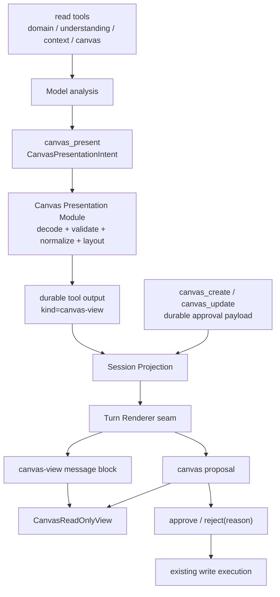

# Generative UI / A2UI 技术实现调研：对话内 Canvas View、Widget 与非确定组件

> 初次调研：2026-08-24  
> 本次修订：2026-08-25  
> 调研对象：Understanding Canvas v2.0.0 的 U1 Inline Widget、U5 draft-preview、PRD M8-5，以及“询问某领域知识结构时由 AI 在对话中返回 Canvas View”的独立展示需求  
> 交付性质：完整技术实现调研、研究逻辑与架构建议，不包含业务代码修改  
> 事实来源：本仓库现行代码与架构规范，以及各方案的官方文档、协议和官方源码  
> 说明：目录名沿用 `a2ui`，但本文严格区分广义 Generative UI、Tool UI、Data UI、声明式 A2UI 与沙箱 App UI；目录名不代表已经决定采用 A2UI 协议。

## 1. 问题定义与调研逻辑

### 1.1 用户真正需要的两个 Canvas 场景

需求讨论中出现了两个外观相似、语义不同的场景，必须先拆开，否则工具、审批和持久化都会混在一起。

**场景 A：独立的只读分析视图。**

用户问：

> 我现在在 XX 领域的知识结构如何？

Agent 读取 Domain、Understanding、Context 或既有 Canvas，完成分析后，在回答中插入一个 Canvas View。这个 View 的职责是帮助用户看见结构、空白、孤点和可能关系；它不创建或修改持久化 Canvas，不需要审批，也不进入“本对话已落地产出”。

**场景 B：写操作的审批前草稿。**

Agent 调用 `canvas_create` 或 `canvas_update`，用户必须在写入之前看见候选结构，再执行应用、修改意见后重提或拒绝。这个 View 是写工具 approval block 的呈现，批准后会改变持久化数据。

两者都复用 `CanvasReadOnlyView`，但它们的事实来源不同：

| 维度                    | 场景 A：Canvas View          | 场景 B：Canvas Draft                                            |
| ----------------------- | ---------------------------- | --------------------------------------------------------------- |
| 用户目的                | 看见 AI 对当前知识结构的分析 | 审核将要落库的结构变更                                          |
| 建议工具                | `canvas_present`             | `canvas_create` / `canvas_update`                               |
| UI 数据来源             | 完成后的结构化 tool output   | durable approval payload                                        |
| 是否写入                | 否                           | 批准后写入                                                      |
| 是否审批                | 否                           | 是                                                              |
| 是否进入 artifact panel | 否                           | 执行完成后是                                                    |
| 推荐 view discriminator | `canvas-view`                | 现有 `proposal.kind = canvas`，无需再复制 wire-level widgetType |

### 1.2 要回答的技术问题

本调研需要回答：

1. 在对话消息中插入富 UI，社区已经形成了什么主流模式；
2. “模型决定显示哪个已知组件”和“模型组合未知布局”是否是同一个问题；
3. Tool UI、Data UI、A2UI、AG-UI、MCP Apps 分别解决什么；
4. 对固定高层 Canvas renderer，应该从工具参数、工具结果还是独立 data part 渲染；
5. `widgetType`、tool name 与 message part type 分别应承担什么责任；
6. 非确定组件如何在不执行模型代码的前提下实现；
7. 真正未知、由第三方交付的 UI 如何跨信任边界运行；
8. 流式、历史重开、schema 演进、错误降级和重型 Canvas mount 如何处理；
9. Reflecta 当前已有哪条链路可以复用，最小新增 seam 在哪里；
10. 什么条件下才值得从单一 Canvas View 演进到通用 registry、声明式 UI catalog 或 MCP Apps Host。

### 1.3 调研假设

调研不是先选框架，而是把可能方案作为假设逐一验证：

| 假设 | 方案                                            | 需要验证的问题                                                                 |
| ---- | ----------------------------------------------- | ------------------------------------------------------------------------------ |
| H1   | Tool call / result 映射预注册 React renderer    | 是否是已知业务 Widget 的成熟主流；能否复用当前 tool projection                 |
| H2   | 后端直接插入 typed data part                    | 是否比专门展示 tool 更直接；谁决定 UI 出现                                     |
| H3   | 模型输出声明式组件树                            | 非确定布局是否必须采用 A2UI；catalog、校验、action 和版本成本是什么            |
| H4   | 远程工具返回完整 HTML App                       | 是否适合第一方 Canvas；沙箱与 capability bridge 的真实成本是什么               |
| H5   | 模型生成 React / HTML / JavaScript 并在宿主执行 | 是否能满足安全、恢复、设计一致性和可测试性                                     |
| H6   | 引入现成聊天 Generative UI runtime              | 是否能局部接入，还是会与现有 Session Projection、审批和 Effect-native 架构重叠 |

### 1.4 证据选择方法

本调研只用以下证据形成技术结论：

1. 项目需求文档、现行架构规范和当前代码；
2. 框架或协议的官方文档；
3. 官方仓库中的协议、类型定义和实现源码；
4. 官方明确标注的成熟度、稳定性与适用边界。

不以产品宣传截图、二手教程或未公开的内部工具名作为 wire contract。文档提到的 Anthropic `show_widget` 只能作为体验线索；在没有稳定公开协议时不能作为实现基线。

### 1.5 评价标准

每种方案按同一组标准评价：

- **语义匹配**：谁决定 UI 出现，是否对应一个工具、一个后端事件或一个远程 App；
- **可序列化与恢复**：刷新、重启、分支重放后能否还原相同视图；
- **类型与校验**：能否在 trust seam 前阻止非法 payload；
- **安全**：是否执行模型或第三方代码，能力是否可控；
- **流式生命周期**：partial args、completed output、错误和审批如何表达；
- **本地架构适配**：是否复用 Session Projection、Turn Renderer、Effect Schema 和现有 Canvas renderer；
- **组件所有权**：第一方组件、模型组合的允许列表、第三方应用是否被正确区分；
- **演进成本**：是否为尚未出现的需求提前建设协议、registry 或 runtime；
- **可访问性与设计一致性**：模型是否能绕过宿主的语义、token 和交互规则；
- **局部失败**：单个富块失败是否会破坏整条 assistant message。

## 2. 结论先行

### 2.1 社区形成的是架构共识，不是统一协议

Vercel AI SDK、assistant-ui 和 CopilotKit 对已知业务 Widget 的实现形状高度一致：

```text
模型选择工具
    ↓
工具参数 / 结果成为可序列化 message part
    ↓
客户端以 tool name 或 typed part 选择预注册 renderer
    ↓
renderer 收到稳定 toolCallId、生命周期和结构化数据
```

Vercel AI SDK 将 Generative UI 直接描述为“把 tool call 结果连接到 React component”；其 `UIMessage` 使用 `tool-${toolName}` 的 typed part。assistant-ui 把这种模式称为 Tool UI，并将它与 Data UI、模型从 vocabulary 组合界面的 Generative UI 明确分开。CopilotKit 同样按工具名注册专用 renderer，并提供通用 fallback。

参考：

- [Vercel AI SDK：Generative User Interfaces](https://ai-sdk.dev/docs/ai-sdk-ui/generative-user-interfaces)
- [Vercel AI SDK：UIMessage](https://ai-sdk.dev/docs/reference/ai-sdk-core/ui-message)
- [assistant-ui：Tool UI](https://www.assistant-ui.com/docs/tools/tool-ui)
- [assistant-ui：Generative UI 模式分类](https://www.assistant-ui.com/docs/tools/generative-ui)
- [CopilotKit：Tool Call Rendering](https://docs.copilotkit.ai/agent-spec/generative-ui/tool-rendering)

共识落在这些原则上：结构化数据而不是 ReactNode、稳定 part id、客户端允许列表、运行时校验、显式 lifecycle、历史可重建和局部 fallback。具体 wire format 尚未统一：AI SDK 的 UIMessage、assistant-ui 的 toolkit/data part、AG-UI events、A2UI surfaces 和 MCP Apps resources 互不等价。

### 2.2 独立知识结构视图应采用 `canvas_present` Controlled Tool UI

“分析我的 XX 领域知识结构并在对话中显示 Canvas”不是写操作，也不是读取一张已存在 Canvas。模型需要根据多个实体形成一个临时分析结构，并主动决定在回答中使用 Canvas 表达。因此最清晰的语义锚点是一个只读展示工具：

```text
domain / understanding / context / canvas read tools
        ↓
model forms a structure hypothesis
        ↓
canvas_present(input: CanvasPresentationIntent)
        ↓ decode + validate + deterministic normalize/layout
tool output: { kind: "canvas-view", version: 1, document, ... }
        ↓ durable tool result in assistant message
Turn Renderer
        ↓
CanvasReadOnlyView
```

`canvas_present` 不持久化 Canvas，不需要审批，不伪装成 `canvas_create`，也不应把临时分析计入 artifact panel。如果用户之后决定保存，应由下一次明确的 `canvas_create` approval 完成。

这不是多余的“纯 UI 工具”：它表达了一个真实的模型动作——把分析结果以 Canvas 这种宿主能力呈现。若没有这个工具，模型没有稳定、可验证、可恢复的结构化通道来要求客户端插入 Canvas View。

### 2.3 Canvas Draft 仍应附着在 `canvas_create` / `canvas_update` 审批块上

独立展示需求成立，不意味着所有 Canvas 预览都要走 `canvas_present`。写操作中的草稿已经有唯一事实来源：

- `canvas_update` 的目标文档位于 approval payload；
- `canvas_create` 的初始结构位于 approval payload；
- 用户必须在执行前看见该冻结值；
- approve 必须执行用户刚刚看见的同一值。

所以 Canvas Draft 是 **approval-state Tool UI**。如果先 `canvas_present(A)`、再 `canvas_update(B)`，会产生预览与实际写入漂移。正确做法是由现有 proposal 直接渲染 approval payload。

最终是两条链路，而不是二选一：

```text
只读分析：canvas_present completed output → canvas-view
写入提案：canvas_create/update approval payload → canvas proposal draft
```

### 2.4 `canvas_present` 使用完成后的 output，不用 partial args 直接挂载 X6

模型输入面对的是语义 intent；工具执行阶段负责 schema decode、引用校验、ID 补全、默认值和确定性布局；完成后的 output 才是可渲染、可重放的 `CanvasDocument`。因此：

- `input-streaming` / running：显示普通工具活动或轻量 Canvas shell；
- `output-available` 且 decode 成功：挂载 `CanvasReadOnlyView`；
- `output-error` / 非法 output：回退通用 tool activity；
- 历史重开：从持久化 tool output 重建同一 Canvas View；
- 不把半段 JSON 交给 X6，不在 Renderer 中随机重新布局。

这符合 assistant-ui 对重型 visualization 的 deferred rendering 建议，也符合现有 `image_generate → generatedImageBlock()` 的本地模式。

### 2.5 tool name 是 Tool UI 路由，`kind` 是输出契约，不需要通用 wire-level `widgetType`

对 dedicated tool：

- `toolName = canvas_present` 已经回答“该用哪个 renderer”；
- `output.kind = canvas-view` 用于验证工具是否返回了预期结果；
- Renderer 内部的 `block.kind = canvas-view` 用于 TypeScript 穷尽分发；
- 不需要再复制一个可任意取值的 `widgetType`。

只有当 UI 独立于工具、一个工具产生多个异构 UI part、后端主动插入 Data UI，或第三方协议要求资源类型时，wire-level named data/widget type 才是独立事实。

### 2.6 非确定组件必须分级，不能把“未知”当成一个技术问题

所谓非确定组件有三种完全不同的含义：

1. **组件选择不确定，候选集合确定**：模型在 Canvas、表格、图表、时间线中选择；继续使用多个 named tool 或判别联合，客户端 renderer 固定。
2. **布局组合不确定，组件 vocabulary 确定**：模型输出声明式组件树；使用 A2UI、assistant-ui `present` 或 json-render 类 catalog / allowlist 方案。
3. **组件实现也未知，由第三方交付**：使用 MCP Apps 的 sandboxed iframe、CSP 和 capability bridge。

不存在一个既允许模型生成任意本地组件实现、又无需允许列表或沙箱的安全方案。生产系统所谓“开放式 Generative UI”通常仍然在 catalog 或隔离运行时内开放。

### 2.7 当前不应引入新的 Generative UI runtime

Reflecta 已经拥有 ordered message blocks、toolCallId、tool output、durable approval、Turn Renderer、通用 activity/proposal fallback、`CanvasReadOnlyView` 和 Effect Schema。引入 AI SDK UI、assistant-ui、CopilotKit 或 AG-UI 会重叠聊天 runtime、消息状态、工具 lifecycle 或 transport。

推荐借鉴这些方案的 interface 和状态机，不替换现有 implementation。A2UI 当前官方状态仍是 early-stage public preview：生产版本为 v0.9.1，v1.0 为 release candidate；它值得作为未来动态组合协议候选，但不是当前单一高层 Canvas View 的默认依赖。[A2UI 官方仓库与成熟度说明](https://github.com/a2ui-project/a2ui)

### 2.8 当前最大的前置风险不是注册表，而是 Canvas 生成契约没有闭合

当前工具提示要求 Agent 不写坐标，但 CanvasDocument 的元素要求：

- canvasId；
- x / y；
- width / height；
- zIndex；
- createdAt / updatedAt。

边还要求 canvasId、createdAt、router、connector、attrs 等完整持久化字段。canvas_create 审批前又尚未获得真实 canvasId。工具 schema 目前只验证 elements / edges 是数组，内部元素使用 Type.Unknown；执行时再强制转换为 CanvasDocument。

因此“模型输出 = CanvasDocument = 直接预览 = 直接保存”目前只在 TypeScript 文字层面成立，运行时并不成立。必须先定义一个确定性的规范化边界：

```text
model-facing Canvas Intent
        ↓ decode + validate
        ↓ generate IDs + preserve existing IDs
        ↓ auto-layout / preserve existing layout
        ↓ fill rendering defaults
Normalized CanvasDocument
        ├─ present → freeze in durable tool output → replay as Canvas View
        └─ write → freeze in durable approval payload
                     ├─ preview
                     └─ apply exactly the same normalized document
```

“提案 = 展示 = 应用”应该定义为 **规范化后的文档三者一致**，而不是要求模型生成数据库 / X6 所需的全部机械字段。

### 2.9 “修改”应优先复用 reject-with-feedback，而不是新增第三种审批协议

当前共享决策只有：

- approve；
- reject，可带 reason。

AI SDK 和 assistant-ui 的服务器审批门同样以 allow / deny 为基本语义；复杂的人机输入通常是独立 human-in-the-loop 流程，而不是把 approval 强行扩成任意编辑器。

对 v1 最小且语义完整的定义是：

- 应用：approve，执行已冻结的 normalized document；
- 拒绝：reject，无需继续修改；
- 修改：收集用户修改意见，然后以 reject(reason) 提交；Agent 自动续跑并生成新的 canvas_create / canvas_update 提案。

这样“修改”是 UI 文案与交互路径，不是第三种 durable decision。若未来希望用户直接在 draft 内编辑节点，那是“可编辑提案工作台”，需要独立的草稿状态、变更合并和重新审批语义，不应塞入 v1 Inline Widget。

## 3. 术语、非确定性的层级与方案分层

社区对 Generative UI 的命名并不统一。为了避免选错方案，本文采用以下分层。

| 层级                             | 谁决定 UI 形态                      | 传输内容                                       | 典型实现                                                           | Reflecta 适配度                                          |
| -------------------------------- | ----------------------------------- | ---------------------------------------------- | ------------------------------------------------------------------ | -------------------------------------------------------- |
| Controlled Tool UI               | 应用预先绑定；模型只选择工具        | tool name + args + result + lifecycle          | AI SDK ToolUIPart、assistant-ui Tool UI、CopilotKit Tool Rendering | **最高：`canvas_present` 和 Canvas approval 都属于此层** |
| Backend Data UI                  | 后端 / orchestrator 决定插入已知 UI | named data part + payload                      | AI SDK DataUIPart、assistant-ui Data UI                            | 中：适合非 tool 驱动的系统附加卡片                       |
| Declarative Generative UI        | 模型从可信 catalog 组合 UI 树       | component tree + data model + symbolic actions | A2UI、assistant-ui `present`、json-render                          | 当前低：尚无动态组合布局需求                             |
| Sandboxed App UI                 | 第三方服务提供完整 UI 应用          | UI resource + tool data + bridge messages      | MCP Apps                                                           | 当前低：适合跨信任边界的第三方 UI                        |
| Open-ended generated code        | 模型生成 HTML / JS / React          | executable code 或 HTML                        | artifact / code sandbox 类产品能力                                 | 宿主消息 UI 不采用                                       |
| Server-rendered component stream | 服务端直接流 React component        | RSC stream                                     | AI SDK RSC `streamUI`                                              | 不适配 Electron / Vite，且官方建议迁移到 AI SDK UI       |

“注册表”在这些层级里的含义也不同：

- Tool UI 注册表：tool/widget 的语义类型 → 预置业务组件；
- A2UI catalog：Text / Row / Card 等低层组件词汇 → 原生组件；
- MCP Apps registry：tool metadata → ui:// HTML resource；
- open-ended code：通常没有可信组件边界，风险最高。

当前 Canvas 的两个场景都只需要第一种：独立展示从 completed tool output 渲染，审批草稿从 approval payload 渲染。未来“非确定组件”只有在模型确实需要组合多个通用组件时才进入第三层。

### 3.1 非确定组件的决策树

```text
UI 的第一方高层 renderer 是否已知？
├─ 是
│  ├─ 模型决定是否显示 → Tool UI
│  └─ 后端决定是否显示 → Data UI
└─ 否
   ├─ 可以限定为宿主 catalog 中的组件组合 → Declarative Generative UI / A2UI
   └─ UI implementation 由第三方交付 → MCP Apps sandboxed iframe
```

如果连 catalog 和信任来源都无法确定，唯一合理行为是拒绝渲染或显示文本 fallback，而不是动态加载模型指定的代码。

## 4. 社区方案深度调研

### 4.1 Vercel AI SDK UI

#### 4.1.1 核心消息模型

AI SDK 的 UIMessage 把消息定义为有序 parts。Assistant part 可以包含 text、reasoning、file、source、data 和 tool 等判别联合。ToolUIPart 的 type 从工具名派生，保持 toolCallId，并用显式 state 表达参数流、审批和结果。

官方源码与示例体现的状态包括：

- input-streaming：参数仍在流式生成；
- input-available：参数完整，可执行或正在执行；
- approval-requested：等待用户批准；
- approval-responded：已响应审批，等待执行结果；
- output-available：执行完成；
- output-denied：用户拒绝；
- output-error：执行失败。

参考：

- [AI SDK UIMessage 官方源码](https://github.com/vercel/ai/blob/main/packages/ai/src/ui/ui-messages.ts)
- [AI SDK Tool Approval](https://ai-sdk.dev/docs/ai-sdk-ui/chatbot-tool-usage)

这套状态名与 Reflecta 当前 ProposalState 几乎一一对应。Reflecta 已经存在 input-streaming、approval-requested、approval-responded、output-available、output-denied、output-error，不需要再发明一套 widget lifecycle。

#### 4.1.2 审批模式

AI SDK 允许服务端工具声明 needsApproval。客户端在 approval-requested 状态显示工具参数与确认 UI，通过 approval id 回传 approved boolean；审批响应后可以自动继续模型循环。

值得借鉴的不是 API 名，而是三点：

1. 审批 UI 属于同一个 tool part，不是另一条 UI 消息；
2. toolCallId 标识工具调用，approval id 标识这次决策，两者职责不同；
3. 拒绝也是终态，历史记录必须保留，而不是把卡片删除。

这与 Reflecta 已有 approval block、approvalId、toolCallId、tool.approve / tool.reject 完全同构。

#### 4.1.3 Data Part

AI SDK 还提供 DataUIPart：后端可以把自定义结构化数据作为消息 part 写入；同一个 data part id 的后续写入会在客户端 reconciliation，而 transient part 不进入历史。

参考：[AI SDK Streaming Custom Data](https://ai-sdk.dev/docs/ai-sdk-ui/streaming-data)

Data Part 适合：

- 后端决定附加一张不对应工具调用的状态卡；
- 协作 artifact 的渐进更新；
- 进度、通知或引用元数据；
- 同一 part 需要用稳定 id 更新。

它不应作为 Canvas Draft v1 的首选，因为 Canvas Draft 已经对应一个明确写工具和审批生命周期。再增加 data part 会复制同一事实。

#### 4.1.4 运行时校验

AI SDK 的 validateUIMessages 可以按 metadata schema、data schema 和 tool input / output schema 校验历史消息。官方源码还特别处理终态 tool part：终态历史可能保留不完整或旧输入，不能因为升级 schema 就让整个 replay 崩溃。

参考：

- [validateUIMessages 文档](https://ai-sdk.dev/docs/reference/ai-sdk-core/validate-ui-messages)
- [validate-ui-messages 官方源码](https://github.com/vercel/ai/blob/main/packages/ai/src/ui/validate-ui-messages.ts)

对 Reflecta 的启示：

- live 完整参数在进入 approval 前必须严格校验；
- 历史中的未知 / 旧 widget 必须软失败为通用活动块；
- 不应让一个坏 widget 导致整条 assistant message 无法显示；
- schema version 演进要考虑已持久化 approval payload。

#### 4.1.5 为什么不采用 AI SDK RSC streamUI

AI SDK RSC 让工具直接返回 React Server Components，但官方仍标记为 experimental，并明确建议生产环境迁移到 AI SDK UI；官方列出的限制包括 abort、remount flicker、Suspense 崩溃风险和数据传输放大。

参考：[AI SDK RSC → UI 迁移说明](https://ai-sdk.dev/docs/ai-sdk-rsc/migrating-to-ui)

Reflecta 是 Electron + Vite renderer，不是 Next.js RSC host。更重要的是，React component 不可序列化，无法自然进入现有 durable session projection。采用 RSC 会逆转当前“事实可重建、视图由 Renderer 派生”的架构，因此不适用。

#### 4.1.6 对 Reflecta 可直接借鉴的部分

- ordered typed parts；
- stable toolCallId；
- 显式生命周期；
- approval 与 tool part 同位；
- data part 只在 tool-independent 场景使用；
- schema validation + terminal fallback；
- serializable data 与 React rendering 分离。

不需要采用：

- useChat；
- AI SDK transport；
- provider tool runtime；
- RSC streamUI；
- AI SDK 自己的持久化模型。

### 4.2 assistant-ui

#### 4.2.1 Render-only Tool UI

assistant-ui 支持为“执行发生在外部”的工具只注册 renderer。注册 key 必须与后端 tool name 一致，renderer 收到：

- args；
- argsText；
- result；
- status；
- toolName；
- toolCallId；
- human interrupt / approval callbacks 等上下文。

参考：

- [assistant-ui：Defining Tools](https://www.assistant-ui.com/docs/tools/defining-tools)
- [assistant-ui：Tool UI](https://www.assistant-ui.com/docs/tools/tool-ui)

这与 Reflecta 最接近：Pi 和 Main 负责工具执行，Electron Renderer 只把已投影的 tool / approval block 画成 React UI。

#### 4.2.2 Partial args 与 Deferred Rendering

assistant-ui 明确承认 tool args 会逐字段流入。对普通文本卡，可以边流边画；对图表、iframe、重型 visualization，官方建议 deferred rendering：参数完整前不挂载重型组件，只显示轻量状态，完成后再渲染最终 UI。

CanvasReadOnlyView 内部挂载 X6 图，属于重型组件。推荐行为是：

- partial args 阶段：只画 Canvas Draft 外壳、标题和 skeleton；
- document 完整且通过 decode 后：才挂载 CanvasReadOnlyView；
- 后续仅生命周期变化时复用同一个 toolCallId / React key；
- 不尝试拿半段 JSON 构建 X6 Graph。

这比“每个 token 都重新构图”更稳定，也避免布局抖动。

#### 4.2.3 Tool UI 与 Data UI 的边界

assistant-ui 官方区分：

- Tool UI：模型通过调用工具决定是否显示；参数可流式；
- Data UI：后端或 LangGraph node 主动推送 named data event；通常是终态数据；
- Generative UI：模型通过 present 工具从组件 vocabulary 组合 JSON tree。

Canvas Draft 由模型的 canvas_create / canvas_update 决定，且需要在审批前展示参数，所以属于 Tool UI。若未来 Main 在一次工具完成后额外生成性能报告、迁移摘要或 artifact 卡，而模型没有调用显示工具，才考虑 Data UI。

#### 4.2.4 Approval / Human-in-the-loop

assistant-ui 的 server-side approval gate 把 approval 暴露在同一 tool renderer 上；approved 为 undefined 时显示按钮，true 时显示执行中，false 时显示拒绝原因。官方也提供 human() / resume() 处理真正需要用户输入的数据收集。

参考：[assistant-ui Tool UI：Server-side approval gates](https://www.assistant-ui.com/docs/tools/tool-ui)

对 Reflecta 的启示：

- 应用 / 拒绝是 approval gate；
- “修改意见”如果只是让 Agent 重提，使用 reject reason；
- 真正的直接编辑与多步骤表单，应另建 human-input workflow，不能假装是普通 approval。

#### 4.2.5 Fallback

assistant-ui 为没有专用 renderer 的工具提供 ToolFallback。成熟实现不是要求所有工具都认识，而是：

```text
named renderer
    ↓ 未匹配 / decode 失败
generic tool fallback
```

Reflecta 已有 AgentProposalCard 和 AgentToolActivityView，可直接成为 fallback，不需要新增一套 UnknownWidgetCard。

### 4.3 CopilotKit 与 AG-UI

#### 4.3.1 Controlled Tool Rendering

CopilotKit 把 Tool Rendering 定义为 Generative UI 的 controlled 变体。它支持：

- 按工具名注册专用 renderer；
- “*” 通配 renderer 兜底；
- renderer 获得 parsed args、live status 和 result；
- 参数流式阶段、执行阶段、完成阶段的显式状态。

参考：

- [CopilotKit Tool Call Rendering](https://docs.copilotkit.ai/agent-spec/generative-ui/tool-rendering)
- [CopilotKit useRenderToolCall](https://docs.copilotkit.ai/reference/v2/hooks/useRenderToolCall)

它验证了“专用 renderer + 通用 fallback”的成熟性，也说明不需要额外 widget tool：工具本身就是路由标识。

#### 4.3.2 Human in the Loop

CopilotKit 的 useHumanInTheLoop 采用 InProgress → Executing → Complete：

- InProgress：参数仍在流；
- Executing：参数完整，等待用户 respond；
- Complete：用户已响应并有结果。

参考：[CopilotKit useHumanInTheLoop](https://docs.copilotkit.ai/reference/v2/hooks/useHumanInTheLoop)

这与 Reflecta 的 preview → pending approval → completed / rejected 很接近。区别只是 Reflecta 把批准后工具执行作为独立 executionState 保存，状态更细，不需要向 CopilotKit 收缩。

#### 4.3.3 AG-UI 事件协议

AG-UI 是 agent 与 frontend 之间的通用事件协议。Tool lifecycle 采用：

```text
TOOL_CALL_START(toolCallId, toolCallName)
TOOL_CALL_ARGS(toolCallId, delta)
TOOL_CALL_END(toolCallId)
TOOL_CALL_RESULT(messageId, toolCallId, content)
```

并为事件提供运行时 schema 校验。

参考：

- [AG-UI Events 文档](https://github.com/ag-ui-protocol/ag-ui/blob/main/docs/sdk/js/core/events.mdx)
- [AG-UI TypeScript events 源码](https://github.com/ag-ui-protocol/ag-ui/blob/main/sdks/typescript/packages/core/src/events.ts)

Reflecta 的 Pi Adapter → Main Projection → Session Feed 已经覆盖相同责任，而且比裸事件更强调 durable snapshot 与重开恢复。只为了 widget 引入 AG-UI 会产生第二套 agent-to-frontend transport 和第二个 reducer，违背 Session Projection 现行不变量。

AG-UI 可以作为未来“接入远程 agent backend”的协议候选，但不应成为本地 Canvas Widget 的依赖。

### 4.4 Google A2UI

#### 4.4.1 A2UI 解决的问题

A2UI 让 agent 用声明式 JSON 描述 UI，而客户端用自己的原生组件库渲染。它的核心不是“一个业务 payload 对应一个 React 组件”，而是：

- Surface：一块可独立创建、更新、删除的 UI 区域；
- Component tree：由带 id 的组件节点组成；
- Data Model：结构与动态数据分离；
- Catalog：客户端允许的组件和函数集合；
- Action：UI 事件回传 agent / host；
- JSONL stream：按消息增量创建 surface、更新组件和数据。

官方强调：

- 不执行模型生成代码；
- 模型只能选择 catalog 中可信组件；
- UI 结构与具体 React / Flutter / Lit 等实现解耦；
- 支持跨平台和远程 agent；
- 组件可增量更新。

参考：

- [A2UI 官方仓库与架构说明](https://github.com/a2ui-project/a2ui)
- [A2UI v1.0 Protocol](https://github.com/a2ui-project/a2ui/blob/main/specification/v1_0/docs/a2ui_protocol.md)

成熟度必须单独说明：A2UI 官方仓库当前标注为 **early-stage public preview**；v0.9.1 是当前生产版本，v1.0 是 release candidate，协议和 renderer 仍在演进。因此可以把它视为开放标准方向和重要参考，但不能表述成社区已经统一采用的稳定默认协议。

#### 4.4.2 A2UI 的优势

在以下场景，A2UI 比 Tool UI 更有价值：

1. Agent 要根据任务动态组合表单、表格、卡片、Tabs、Modal 等布局；
2. 同一个 agent UI 要在 Web、Flutter、原生移动端一致表达；
3. 远程 sub-agent 不知道宿主具体组件实现，但双方共享 catalog；
4. UI 会在一个 surface 内多次增量更新；
5. 需要数据绑定、actions、validation、accessibility 作为协议能力；
6. 组件组合本身就是模型输出，而不只是业务数据可视化。

#### 4.4.3 为什么当前两个 Canvas 场景都不应采用 A2UI

独立 Canvas View 和 Canvas Draft 都已经有高层业务 renderer `CanvasReadOnlyView`。若套 A2UI，有两种做法，两种都没有收益。

**做法 A：把整个画布注册成一个 CanvasView / CanvasDraft catalog component。**

那么 A2UI payload 最终仍只是一个高层 component name + document，等价于 `canvas_present` tool result 或现有 Canvas proposal，却多了 surface、catalog、协议版本、增量消息、renderer runtime 和 action bridge。

**做法 B：让模型用 A2UI 的 Row / Card / CanvasNode / Edge 等组件拼出画布。**

这会让模型同时负责 UI composition 与领域文档，破坏 CanvasDocument 作为唯一业务模型；还需要把 X6 的图结构、parent/edge/viewport 语义重新编码成通用组件树。

因此，A2UI 对本需求是过度建模。它应保留为以下未来条件触发的候选：

- Reflecta 允许远程 agent 生成跨平台交互表单；
- 同一消息内的 UI 结构无法预先绑定到某一个业务 widget；
- 至少出现第二个需要动态组合组件树的真实需求；
- 需要标准 catalog 与跨宿主 portability。

#### 4.4.4 可借鉴而不采用协议的部分

- allowlist / catalog，而不是 dynamic import 或 eval；
- 每个渲染单元有稳定 id；
- schema 与版本必须显式；
- 未知 component 必须局部失败；
- data 与 UI structure 分离；
- accessibility 是 renderer contract 的一部分。

这些原则可以体现在 Reflecta 的 typed widget view 中，无需引入 A2UI runtime。

#### 4.4.5 同类声明式实现：assistant-ui `present` 与 json-render

assistant-ui 的 `present` 工具进一步验证了“布局不确定、vocabulary 确定”的实现方式：应用提供组件词汇，模型调用单一 `present` tool 输出 JSON tree；它明确建议已知工具绑定的 Widget 继续使用 Tool UI，而不是强行转成 component tree。

Vercel Labs 的 json-render 采用类似结构：开发者定义 catalog 和 renderer registry，模型只能生成 catalog 允许的 JSON spec，支持 progressive rendering 与多宿主 renderer。它是可参考的实现库，不是跨厂商 wire standard；其价值主要在于验证 catalog、registry、schema 与 symbolic action 的工程形态。

参考：

- [assistant-ui：Generative UI](https://www.assistant-ui.com/docs/tools/generative-ui)
- [assistant-ui：Generative UI Rendering](https://www.assistant-ui.com/docs/api-reference/generative-ui/rendering)
- [Vercel Labs json-render](https://github.com/vercel-labs/json-render)

对 Reflecta 的判断不变：只有当真实回答需要模型自由组合 Card、Text、Table、Chart、Form 等多个通用模块时，这类 renderer 才比 named Tool UI 更有 leverage。

### 4.5 MCP Apps 与 Anthropic show_widget

#### 4.5.1 MCP Apps 的公开稳定模型

MCP Apps 是 MCP 的 UI extension。一个支持 UI 的工具通过 metadata 指向 ui:// resource；Host 获取 HTML resource，在 sandboxed iframe 中渲染，并通过 postMessage / JSON-RPC 在 Host 与 View 之间交换 tool input、tool result、工具调用和上下文更新。

稳定规范包含：

- UI Resource；
- Tool-UI linkage；
- capability negotiation；
- sandboxed iframe；
- deny-by-default CSP；
- 双向 JSON-RPC；
- 不支持 UI 的 host 使用文本 / structured result 降级。

参考：

- [MCP Apps Overview](https://modelcontextprotocol.io/extensions/apps/overview)
- [MCP Apps Stable Specification 2026-01-26](https://github.com/modelcontextprotocol/ext-apps/blob/main/specification/2026-01-26/apps.mdx)
- [MCP Apps Build Guide](https://modelcontextprotocol.io/extensions/apps/build)

#### 4.5.2 适用场景

MCP Apps 适合：

- UI 由第三方 MCP server 交付；
- Host 与 UI 作者跨信任边界；
- UI 需要独立 bundle、资源、网络策略和权限；
- 同一 UI 要在多个 MCP host 可移植；
- widget 自身是一个小应用，需要双向调用工具。

#### 4.5.3 为什么不适合第一方 Canvas View / Draft

CanvasReadOnlyView 与 Chat 同属 Reflecta bundle、同一 React tree 和同一设计系统。把它放进 iframe 会引入：

- 单独构建与资源加载；
- CSS / theme token 桥接；
- X6 bundle 重复；
- postMessage bridge；
- iframe 自动高度与 resize；
- CSP 和 asset policy；
- approval callback 代理；
- 焦点、键盘和可访问性边界；
- 测试 host；
- 失去现有 React context 与直接组件复用。

这些成本只为解决“不信任第三方 UI”的问题，而当前没有这个问题。

因此 v1 应直接渲染第一方 React 组件。未来如果 Reflecta 成为 MCP Apps Host，需要显示外部 server 提供的 widget，再单独实现 sandbox seam；不能让第一方 Canvas View / Draft 先承担那套复杂度。

#### 4.5.4 对 show_widget 的判断

输入文档提到 Anthropic show_widget，但本次检索没有找到可供第三方实现、版本化且稳定的官方 show_widget API / wire contract。公开、可依赖的 Anthropic / MCP 方向现在是 MCP Apps，而不是复制 Claude 产品内部工具名。

因此：

- show_widget 可以作为产品体验参考；
- 不能作为 Reflecta 技术协议基线；
- 不应设计兼容一个未公开的 tool payload；
- 若未来目标是第三方 widget portability，应直接对齐 MCP Apps stable spec。

### 4.6 方案比较矩阵

| 维度              | AI SDK Tool UI         | assistant-ui Tool UI         | CopilotKit / AG-UI           | Google A2UI                                | MCP Apps                       | Reflecta 自有 Controlled Tool UI |
| ----------------- | ---------------------- | ---------------------------- | ---------------------------- | ------------------------------------------ | ------------------------------ | -------------------------------- |
| UI 选择依据       | tool name / typed part | toolkit key / tool name      | named renderer / tool events | catalog component tree                     | tool metadata → ui resource    | toolName → Turn Renderer view    |
| 模型是否组合布局  | 否                     | Tool UI 否；present 模式可以 | Tool rendering 否            | 是                                         | HTML 由 server 作者提供        | 否                               |
| 参数流式          | 支持                   | 支持，含字段状态和 deferred  | 支持                         | JSONL 增量                                 | 可预载并接收 input             | 当前已有 approval preview        |
| 审批              | 一等 tool state        | approval gate / human input  | human-in-loop                | action 可表达，但不是专用 approval runtime | app 自己通过 bridge            | 当前已有 durable approval        |
| 历史重放          | serializable parts     | runtime message parts        | transport / runtime 决定     | surface event replay / state               | host 决定                      | Main Projection 可从 facts 重建  |
| 运行时校验        | tool/data schemas      | toolkit schemas              | event schemas                | JSON Schema + catalog                      | resource / protocol validation | Effect Schema 应承担             |
| 未知类型 fallback | 应用分支处理           | ToolFallback                 | wildcard renderer            | resolution error / fallback                | text fallback                  | 现有 proposal / activity         |
| 信任边界          | 第一方 React           | 第一方 React                 | 第一方 React                 | trusted catalog                            | sandboxed third-party iframe   | 第一方 React                     |
| 跨平台            | 主要 Web/React         | React                        | React + agent transport      | 强                                         | Web iframe host                | 当前 Electron React              |
| 接入当前仓库成本  | 高：替换 runtime       | 高：替换 chat layer          | 高：第二 transport/runtime   | 很高：新协议                               | 很高：新 host + iframe         | **最低**                         |
| 当前 Canvas 适配  | 模式适配，依赖不适配   | 模式最接近，依赖不适配       | 模式可借鉴                   | 过度设计                                   | 信任模型不匹配                 | **推荐**                         |

### 4.7 成熟度与“社区共识”的最终判断

| 模式                          | 当前判断                   | 证据含义                                                                     |
| ----------------------------- | -------------------------- | ---------------------------------------------------------------------------- |
| Tool UI / tool-call rendering | **成熟主流**               | 多个主流 React agent UI 框架均把 tool part 映射到预注册 renderer             |
| Data UI / typed data part     | **成熟补充模式**           | 用于后端决定插入 UI，不替代模型决定的 Tool UI                                |
| Declarative catalog UI        | **新兴且快速发展**         | assistant-ui、json-render 已有可用实现；A2UI 仍为 public preview，协议未统一 |
| MCP Apps                      | **正式扩展、特定边界成熟** | 解决第三方 App 交付与沙箱，不是第一方 Widget 的默认方式；客户端支持仍需协商  |
| 模型代码直接进入宿主 UI       | **没有形成安全生产共识**   | 成熟方案都通过 allowlist、schema 或 sandbox 收紧能力                         |

所以本文所说“主流共识”是架构收敛，不是 A2UI 已经成为所有 Chat UI 的标准格式。

## 5. 成熟方案的共同技术原则

跨上述方案可以提炼出十一个稳定原则。

### 5.1 传输事实与 React 视图分离

消息保存结构化数据、稳定 id 和状态；React component 只在客户端由 registry / renderer 解析。不能持久化 ReactNode，也不能让 Main 直接生成组件 props。

这与 Session Projection 现行规范完全一致。

### 5.2 使用稳定调用 id 做 reconciliation

toolCallId 应贯穿一次 tool-driven UI 的全部状态：

- partial args；
- approval preview；
- durable approval request；
- approved / rejected；
- execution result；
- terminal UI。

同一调用不应在每个状态创建不同 widget id。推荐 widget view id 从 toolCallId 派生，避免 React 重挂载与消息内重复。

approvalId 仅用于提交决策，不能替代 toolCallId 作为显示身份。

### 5.3 专用 renderer 前必须有 schema decode

Renderer 不应该把 unknown payload 直接传给 CanvasReadOnlyView。业务事实形成前必须完成：

1. 外层 tool input decode；
2. Canvas presentation / draft intent decode；
3. 领域完整性校验；
4. normalization；
5. 得到完整 CanvasDocument；
6. present 路径写入 tool output，write 路径写入 approval payload。

Turn Renderer 还要对已持久化 output / payload 做防御性 decode。任何一步失败都应返回“没有专用富视图”，让原 block 落入通用 proposal / activity，而不是抛异常中断整条消息。

### 5.4 专用 renderer 必须有通用 fallback

Fallback 同时覆盖：

- 未注册 tool / widget；
- 历史中的旧 schema；
- partial JSON；
- payload decode 失败；
- renderer 加载失败；
- Canvas 渲染异常。

Reflecta 已有通用 proposal 和 tool activity，不应再造第三套 fallback。

### 5.5 生命周期是数据，不由组件猜测

组件不得通过“消息是否最后一条”等 UI 位置猜状态。Tool result view 使用明确 tool state；proposal 使用 approvalState、executionState、displayState。Turn Renderer 负责映射，React renderer 只消费 typed view。

### 5.6 重型 UI 应 deferred mount

X6 Canvas 只在完整、已校验的 document 可用时挂载。`canvas_present` 在 completed output 前不挂载；approval 在 durable payload 完整前不挂载。这样避免：

- 半结构数据报错；
- 图反复初始化；
- 自动布局多次变化；
- 用户误以为半成品就是最终提案；
- 大量 token delta 触发昂贵 render。

### 5.7 Renderer 不拥有 side effect

CanvasReadOnlyView 继续纯只读；批准 / 拒绝由外层 proposal shell 通过 callback 进入既有命令。独立 Canvas View 没有写 side effect；若未来提供“保存”，它只能发起新的审批写工具。renderer 不能直接调用 IPC、直接保存 Canvas 或修改 Query cache。

### 5.8 恢复优先于实时动画

runtime-only partial preview 可以不持久化，但 completed Canvas View output 与 durable approval request 都必须足以在应用重启后重建同一画面。布局不能只存在于 Renderer 内存。

### 5.9 “看见的”与“执行的”必须来自同一冻结值

present 的规范化结果必须在 tool completed output 前冻结；write 的规范化结果必须在 approval request 前冻结。历史展示、审批预览与批准执行都读取各自冻结值，不能在 Renderer 或 approve 时重新调用随机 layout。

### 5.10 未知类型必须局部失败

一个 widget 失败只能影响自己的 block。消息中的前后文本、其他 tool、reasoning 和 receipt 必须保持有序可见。

### 5.11 允许列表优于动态加载

tool result kind、message block kind 和声明式 catalog component 只能来自 TypeScript 判别联合 / 显式 map / switch / versioned allowlist。禁止：

- 根据模型字符串 dynamic import；
- eval；
- dangerouslySetInnerHTML；
- 模型输出 JSX / React source；
- 模型决定任意 URL iframe。

## 6. Reflecta 当前实现映射

### 6.1 已经具备的 Tool Result → View 基础

#### Main / Shared Projection

当前 shared projection 已包含 toolCallId、toolName、input、output、tool lifecycle、approval lifecycle 和 durable history。`pi-readonly-tools.ts` 的 `toolResult(details)` 同时返回文本 content 与结构化 `details`；`pi-agent-host.ts` 的 `piToolOutput` 会把自定义工具的 `details` 解包为 projected tool output。

这意味着 `canvas_present` 不需要新 transport：工具只要返回结构化 details，现有 Session Projection 就能把结果送到 Renderer 并进入历史。

#### Turn Renderer

`agent-turn-view.ts` 已经承担正确的派生责任：

- 按顺序遍历 message blocks；
- 聚合普通 tool activity；
- 把 approval 转成 proposal；
- `image_generate` 完成后从结构化 output 派生 `image` block；
- 把 Main facts 转成 `@reflecta/ui` 的 view types。

`generatedImageBlock()` 是独立 Canvas View 最接近的本地先例：完成的 tool result 仍是事实，Turn Renderer 根据已知 tool name 和 output kind 派生富媒体块。正确的新 seam 就在这里，而不是 Main、Canvas domain 或 React 组件内部。

#### 已实现的 Canvas approval preview

当前 `ProposalType` 已包括 `canvas_create`、`canvas_update`、`canvas_delete`；`proposalViewFor()` 会从 create 的 `initial` 或 update 的 `document` 构造 Canvas proposal。`AgentProposalCard` 已 lazy-load `CanvasReadOnlyView` 并渲染审批草稿。

因此 Canvas Draft 不是待建设的通用 Widget 基建，它已经作为专用 proposal renderer 存在。新的真实缺口是**非审批的 `canvas_present` completed result view**。

#### Chat UI 与 Canvas renderer

`AgentMessageBlockView` 当前包含 text、image、execution、proposal，没有 standalone `canvas-view`。`chat-message-row.tsx` 保留块顺序并穷尽渲染。

`CanvasReadOnlyView` 以 `CanvasDocument + CanvasShapeData` 渲染 X6 只读图，关闭编辑和写入，只保留查看所需的平移、缩放能力。它可继续作为第一方高层 renderer；无需再造一套 Canvas widget 实现。

### 6.2 当前真实差距

#### 差距 A：没有表达“只展示临时分析结构”的工具

现有 `canvas_read` 读取一张持久化画布，`canvas_create/update/delete` 表达持久化写操作。它们都不能准确表达“根据多个 Understanding 临时形成一个只读分析 Canvas，并把它插入当前回答”。

把这种需求塞进 `canvas_read` 会混淆读取事实和生成分析；塞进 `canvas_create` 会无故引入审批和持久化；仅靠正文 JSON 又失去 typed part、校验、恢复和专用 renderer。因此需要独立只读 `canvas_present`。

#### 差距 B：没有 standalone Canvas message block

`AgentMessageBlockView` 没有 `canvas-view`。即使 Main 已经保存结构化 tool output，Turn Renderer 也只能把它显示成普通工具活动，不能在消息顺序中插入只读图。

#### 差距 C：模型 contract 与 CanvasDocument 不一致

现有 Canvas write tool 的模型参数与持久化 `CanvasDocument` 之间仍有契约张力：模型不应负责坐标、timestamps、完整 X6 defaults 和数据库归属字段，但 renderer 需要完整文档。

`canvas_present` 更不能直接信任模型伪造的完整 `CanvasDocument`。它需要 model-facing intent → normalized document 的明确 Module；这个 Module 同时可以深化 create/update 的输入契约，避免同一套 ID、校验和布局规则散落在多条路径。

#### 差距 D：CanvasDocument 之外还需要 presentation data

理解节点和画布引用节点的完整显示依赖 `CanvasShapeData`：understanding title/body/deleted state 与 referenced canvas title/deleted state。只有 `CanvasDocument` 时，引用节点可能缺少可读内容。

独立分析视图有两种策略：

1. output 冻结紧凑的 `understandingTitles` / display snapshot；
2. Renderer 根据引用 ID 查询当前 `CanvasShapeData`。

对“分析当时看见了什么”而言，完全依赖实时查询会使历史视图随数据变化；完全冻结正文又会放大 session log。推荐冻结必要标题与诊断说明，正文继续按需 hydration，并明确历史 Canvas View 是“分析结果 + 当前实体内容”的组合。如果产品要求严格历史快照，再升级完整 snapshot contract。

#### 差距 E：输入文档把独立展示与审批预览混成一个“展示 tool”

Server 文档一方面单列展示 tool，另一方面把它描述成 create/update 的验收界面。用户新确认的知识结构问答证明两种需求都真实存在。后续应明确：

- `canvas_present`：纯展示、不写入、completed result view；
- `canvas_create/update` proposal：审批前 draft preview；
- 两者共享 normalizer 和 `CanvasReadOnlyView`，不共享 lifecycle 和持久化语义。

#### 差距 F：AI 推断关系与用户显式结构需要视觉和数据语义区分

产品价值把 Canvas 定义为用户显式认可的心智结构。独立 `canvas_present` 可能包含 Agent 推断出的分组或关系；这些只能被解释为“AI 对现有理解的分析视图”，不能伪装成用户已经建立的结构事实。

因此 output 或外壳至少要表达 presentation purpose / caption，UI 要明确“AI 分析 · 未保存”。只有经过 `canvas_create/update` 审批后，关系才成为持久化 Canvas 事实。

## 7. 推荐的目标架构

### 7.1 两条并存的 Canvas UI 链路



两个上游事实通过 Turn Renderer 这个 seam 收敛到同一个高层 renderer。这个 Module 有足够 Depth：调用方只知道 typed block / proposal，内部隐藏 schema decode、shape hydration、lazy mount、fallback 和 X6 细节。

### 7.2 `canvas_present` 的 Interface

#### 模型输入：CanvasPresentationIntent

模型只提供真正需要判断的语义：

- presentation title / purpose / caption；
- draft-local element id；
- element kind；
- understandingId / canvasRefId；
- text、group label 等内容；
- parent local id；
- edge source / target local id；
- edge label；
- 少量明确允许的语义样式；
- 可选的分析说明、证据引用或 confidence metadata。

模型不提供：

- React component name；
- x / y、viewport 和像素布局；
- timestamps；
- 任意 X6 attrs；
- JavaScript callback；
- HTML；
- 任意 URL iframe；
- 持久化 canvasId。

#### 工具输出：CanvasPresentationResult

下面是责任说明，不是本次代码实现：

```ts
type CanvasPresentationResult = {
  kind: "canvas-view";
  version: 1;
  title: string;
  caption?: string;
  document: CanvasDocument;
  understandingTitles?: ReadonlyArray<{ id: string; title: string }>;
};
```

工具执行应完成：

1. Effect Schema decode；
2. local id 唯一性与引用完整性校验；
3. parent cycle、edge endpoint 与 kind 约束；
4. 生成稳定 element / edge ids；
5. 确定性布局；
6. 补齐有限的 rendering defaults；
7. 最终 `CanvasDocument` decode；
8. 返回结构化 details，并提供可读文本 fallback。

`kind` 和 `version` 是输出完整性与演进字段，不是任意 widget registry key。tool name 仍是 UI 路由的第一判据。

### 7.3 为什么选择 dedicated Tool UI，而不是 Data UI

本场景中“是否显示 Canvas”是模型对表达方式的选择。Tool UI 让这个决定显式出现在 agent trace 与消息历史中，参数有 schema，结果能与 toolCallId 关联。

Data UI 更适合：模型没有调用展示工具，而 orchestrator 在回答完成后根据系统规则附加一张卡；例如后台计算的 token 账单、同步状态或固定质量报告。若未来 Reflecta 规定“所有 Domain 诊断完成后系统自动附一张结构图”，那时 Data UI 才可能比 `canvas_present` 更直接。

### 7.4 为什么从 output 渲染而不是从 input 渲染

对 `canvas_present`：

- input 是未完成、未校验的 model intent；
- output 是 normalizer 生成的最终文档；
- X6 是重型 renderer，不适合跟随每段 partial JSON 重建；
- 历史必须保存并重放最终文档，而不是重新运行布局。

所以 completed output 是唯一渲染事实。工具进行中可继续显示现有 activity；若需要更强的产品反馈，只增加轻量 shell，不提前挂 X6。

Canvas approval 恰好相反：用户需要在工具执行前看见完整待执行 payload，因此从 durable approval payload 渲染。两者不能用“所有 widget 都从 args”或“所有 widget 都从 result”一刀切。

### 7.5 建议的 Renderer view types

第一版只需要一个新的具体 block，不需要通用 plugin registry：

```ts
type AgentCanvasViewBlock = {
  kind: "canvas-view";
  id: string; // derived from toolCallId
  title: string;
  caption?: string;
  document: CanvasDocument;
  understandingTitles?: ReadonlyArray<{ id: string; title: string }>;
};
```

现有 approval 继续使用 `AgentProposalView` 中的 Canvas proposal。这样避免把已经成熟的审批 shell 改造成抽象 Widget 系统。

Turn Renderer 的纯 resolver 责任是：

```text
toolName == canvas_present
AND state == completed
AND output.kind == canvas-view
AND output schema valid
    → AgentCanvasViewBlock
otherwise
    → existing generic tool activity
```

Chat UI 只对 `block.kind` 穷尽分发。组件不读取 raw tool block、不发送 IPC、不执行 normalize，也不拥有持久化 side effect。

### 7.6 消息顺序、去重与工具活动

`toolCallId` 是同一次呈现的稳定身份，Canvas block id 应从它派生。实时与历史都必须经同一个 Turn Renderer 得到相同顺序。

现有 generated image 会保留工具活动并额外插入 image block。`canvas_present` 第一版可以复用这一行为：

```text
tool activity（可折叠）
canvas-view
assistant text
```

如果 UX 认为“展示画布”工具活动是重复信息，可以在 Turn Renderer 对该 tool 做单点抑制或在 activity group 中折叠；不要在 React 组件里按 DOM 邻接关系删除块。

### 7.7 Canvas View 的生命周期与失败行为

| Tool state                   | UI                                     | 是否挂载 Canvas |
| ---------------------------- | -------------------------------------- | --------------- |
| input-streaming / running    | 通用 activity 或轻量“正在生成结构视图” | 否              |
| completed + valid output     | Canvas View + “AI 分析 · 未保存”       | 是              |
| completed + unknown version  | 通用 activity + 可读 fallback          | 否              |
| completed + invalid document | 通用 activity + 局部错误               | 否              |
| failed                       | 现有 failed tool activity              | 否              |
| renderer throw               | 当前 block error boundary / fallback   | 失败块局部卸载  |

Canvas View 是 terminal message content；它不需要 approval lifecycle。若用户要保存，产生新的 `canvas_create` proposal 和新的 toolCallId。

### 7.8 Canvas Draft 的既有 lifecycle

Canvas proposal 继续遵守：

| factual state        | UI 行为                                           | 是否挂载 Canvas |
| -------------------- | ------------------------------------------------- | --------------- |
| preview / 参数未完整 | proposal shell / skeleton                         | 否              |
| pending approval     | 完整只读草稿 + 应用 / 修改 / 拒绝                 | 是              |
| running              | 保留草稿、禁用重复决策                            | 是              |
| completed            | 保留草稿与 receipt / 打开画布入口                 | 是              |
| rejected             | 保留被拒绝版本与 reason                           | 是              |
| failed               | 能 decode 则保留草稿与错误，否则 generic fallback | 视 decode 结果  |

“修改”继续使用 reject(reason) + Agent 以新 toolCallId 重提；不原地篡改 durable approval payload。

### 7.9 如果未来出现多个固定 Widget

若第二个真实类型出现，例如 `table_present` 或 `timeline_present`，优先增加各自具名 tool 和判别 view。这样每个 Module 的 Interface 仍然窄：独立 schema、独立 normalizer、独立 fallback。

只有当多种 tool 确实共享相同 lifecycle、注册规则和渲染责任时，再把重复 switch 机械提取为 typed map。不要先建设：

- 全局 mutable registry；
- React mount-time registration；
- dynamic import by model string；
- widget plugin manifest；
- 一个接收任意 unknown props 的万能 `show_widget`。

### 7.10 如果未来需要模型动态组合非确定组件

届时新增的是另一个 Module，不是把 `canvas_present` 泛化成 unknown：

```ts
type GenerativeUISpec = {
  protocol: "reflecta-ui/v1";
  surfaceId: string;
  root: GenerativeUINode;
};

type GenerativeUINode = {
  id: string;
  type: string; // resolved only against a versioned allowlist
  props?: Readonly<Record<string, unknown>>;
  children?: readonly GenerativeUINode[];
};
```

最小安全 interface 必须包含：

1. versioned component catalog；
2. 每个 component props schema；
3. renderer allowlist；
4. unknown component fallback；
5. stable surface / node ids；
6. symbolic actions，而不是函数；
7. action allowlist 与 capability checks；
8. URL / Markdown 等二次 trust seam 的验证；
9. 可序列化 spec persistence；
10. 局部 error isolation；
11. accessibility contract；
12. catalog migration 或旧消息 fallback。

交互动作只能表达宿主已知意图：

```json
{
  "type": "Button",
  "props": {
    "label": "在 Canvas 中打开",
    "action": {
      "type": "open_canvas",
      "canvasId": "cv_123"
    }
  }
}
```

模型不能提供 `onClick` source、module URL 或任意 host command。action resolver 是 capability seam，Catalog renderer 是 component seam；这两个责任不能混成一个万能 registry。

### 7.11 真正未知的第三方组件

如果 UI 作者不在 Reflecta bundle 中，catalog 也不能表达其实现，就不要让它进入宿主 React tree。采用 MCP Apps：工具声明 `ui://` resource，Host 获取 HTML，在 sandboxed iframe 中运行，以 CSP、permissions 和 postMessage / JSON-RPC bridge 控制能力。

第一方 allowlisted renderer 与第三方 sandboxed App 是两个信任模型，应当是两个独立 Adapter；不要用 iframe 包第一方 Canvas，也不要把第三方 HTML 注册成第一方 component。

## 8. 契约规范化的详细要求

### 8.1 present、create 与 update 可以共享语义 schema，不能共享完整 normalization context

`canvas_present`：

- 没有持久化 canvasId；
- 所有对象只属于这次消息内的 presentation；
- local ids 只服务结构引用；
- normalizer 输出完整可渲染文档并直接进入 tool result；
- 不需要 reconcile，也不能产生 save side effect。

canvas_create：

- 没有真实 canvasId；
- 所有 element / edge 都是新对象；
- local ids 只服务草稿内部引用；
- apply 时创建 canvas，再把 normalized element / edge 写入该 canvas。

canvas_update：

- 已有 canvasId；
- 必须读取当前文档；
- 已有 element / edge id 决定 reconcile；
- 未出现在目标文档中的对象会删除；
- 旧布局应保留，除非结构变化需要局部调整；
- 新对象需要生成稳定 id 和布局。

三者可以共享 Canvas intent 中的元素、关系、分组与引用语义，也应该共享校验和默认值 Module；但 normalization context 不同，不能仅做一次浅类型转换。尤其不能让 `canvas_present` 假装持久化 create，也不能让 update 丢失已有 ID 和布局。

### 8.2 布局必须确定性

“Agent 不做布局”意味着布局是应用责任。为了保证重开一致：

- `canvas_present` 的 normalization 运行一次，结果进入 durable tool output；
- create/update 的 normalization 运行一次，结果进入 durable approval；
- 同一输入与 context 应得到同一布局，或直接持久化布局结果；
- approve 不得再次随机布局；
- update 默认保留已有节点位置；
- 只为新增、无位置节点分配位置；
- group 的父子相对坐标要在 normalization 中一次性确定；
- edge router / connector defaults 同样冻结。

如果 auto-layout 当前尚未实现，不能先把 Canvas View 接到 raw payload 上。最安全的临时行为是让 `canvas_present` 失败并显示通用 tool fallback；审批提案则显示 generic proposal，而不是展示一个无法稳定重放或批准后无法保存的图。

### 8.3 ID 策略

需要区分：

- toolCallId：一次展示或提案调用；
- approvalId：一次审批决策；
- draft local element id：模型描述内部引用；
- persisted element / edge id：Canvas 数据实体；
- canvasId：目标画布。

推荐：

- update 的现有 IDs 来自 canvas_read，必须保留；
- new local ids 由 normalizer 映射成应用生成的实体 id；
- mapping 结果进入 durable approval；
- edge source / target 与 parentId 在同一次 mapping 中改写；
- create 的 canvasId 在 apply 时由 service 创建，不让模型生成；
- document 内冗余 canvasId 若继续保留，由应用覆盖，不信任模型值。

对 `canvas_present`，生成的 element / edge id 只需要在这条持久化 tool output 内稳定，不代表数据库实体 id。历史 replay 必须直接使用 output 中已冻结的 id，不重新生成。

### 8.4 校验层次

建议依次执行：

1. **语法 schema**：对象、数组、判别字段、枚举、必填字段；
2. **局部字段**：文本长度、合法颜色 token、有限 connector / router；
3. **引用完整性**：source / target / parent 指向存在的 local id；
4. **结构约束**：parent 必须是 group、无 parent cycle、id 唯一；
5. **领域引用**：understandingId / canvasRefId 存在或符合删除占位策略；
6. **update 约束**：目标 canvas 存在，existing ids 属于该 canvas；
7. **normalize**：ids、layout、defaults；
8. **最终 CanvasDocument schema**；
9. **按场景冻结**：present result freeze 或 approval freeze。

服务端 saveCanvas 仍保留写操作最终防线。Renderer decode 不是业务 normalizer 的替代品：它只防御损坏或旧历史，不能在显示时产生新的布局和 ID。

### 8.5 失败行为

| 失败位置                 | Canvas View                          | Canvas proposal                     | 是否继续消息 |
| ------------------------ | ------------------------------------ | ----------------------------------- | ------------ |
| partial args 尚未完整    | activity / 轻量 shell                | proposal skeleton                   | 是           |
| intent schema 非法       | failed tool activity，不生成 view    | generic failed proposal，不允许批准 | 是           |
| 引用不存在               | 按契约失败或引用占位                 | 按领域规则失败或占位                | 是           |
| layout 失败              | failed tool activity，不挂载 X6      | failed proposal，不允许批准         | 是           |
| shapeData hydration 失败 | 结构仍显示，引用卡占位               | 结构仍显示，引用卡占位              | 是           |
| saveCanvas 最终失败      | 不适用                               | 保留草稿 + execution error          | 是           |
| renderer 自身异常        | 当前 block error boundary → fallback | proposal block 局部 fallback        | 是           |

## 9. 与现行 Session Projection 的一致性

现行规范要求：

- Main 组合 durable facts 与 active attempt；
- Renderer 只接收完整 Projection；
- Turn Renderer 派生 Decision / Candidate / Receipt；
- Renderer 不解释 raw events；
- durable Decision 前必须已有可重建的 Assistant snapshot；
- waiting 不等于 running。

推荐方案遵守这些不变量：

1. 不新增 Renderer event reducer；
2. 不让 widget 订阅 Pi delta；
3. 不把 React props 写入 Main；
4. `canvas_present` 的 completed output 是可重建 Canvas View 的事实；
5. partial approval preview 仍由现有 Projection block 表达；
6. durable approval payload 足以重建 pending Canvas proposal；
7. lifecycle 只由 factual state 映射；
8. approve / reject 仍走 command；
9. `canvas_present` 不产生 artifact receipt，canvas write 完成后才产生；
10. 单个富块失败不改变相邻文本和其他 blocks 的顺序。

normalization 属于事实形成过程：present 路径在 tool completed output 形成前完成，write 路径在 durable approval request 形成前完成；它不属于 Turn Renderer。Turn Renderer 可以 decode / 防御性验证，但不能生成需要被重放或执行的新业务数据。

## 10. 建议的实施阶段

本文不改代码；以下是未来实现顺序。顺序很重要，因为先画 UI 会掩盖数据契约问题。

### Phase 0：定义共享 Canvas Presentation Module

目标：

- 定义模型真正可生成的 CanvasPresentationIntent / CanvasDraftIntent；
- 明确 present / create / update 三种 normalization context；
- 明确 ID 与 auto-layout；
- 用 Effect Schema 验证；
- 明确 shapeData hydration；
- 输出完整 CanvasDocument 或结构化错误，不依赖 React。

完成标准：

- 一份完整工具参数可以在无 React 环境下得到确定的 CanvasDocument；
- present result replay 不需要重新布局；
- 同一 durable approval payload 可在重启后得到相同 document；
- approve 保存的 document 与 preview 使用的 document 是同一冻结值；
- 非法 input 在进入 result / approval 前失败。

### Phase 1：增加只读 `canvas_present` Tool

目标：

- 把 `canvas_present` 定义为无写入、无审批的 custom tool；
- input 使用 Phase 0 intent schema；
- execute 调用共享 normalizer；
- output 固定为 `{ kind: "canvas-view", version: 1, ... }`；
- 返回结构化 details 与可读文本 fallback；
- prompt 明确何时使用：空间关系比纯文本、列表或表格更有解释力时；
- prompt 明确不得声称临时关系已经成为用户的持久化结构。

完成标准：

- tool 单测能从 intent 得到合法 CanvasDocument；
- tool 不调用 saveCanvas；
- tool output 进入现有 projected block；
- failed normalization 产生标准 tool failure，而不是半成品 output。

### Phase 2：Turn Renderer 派生 Canvas View

目标：

- completed `canvas_present` + valid output 映射为具体 `canvas-view` block；
- block id 基于 toolCallId；
- 其他状态继续用普通 activity；
- unknown kind / version / invalid document 安全 fallback；
- 保留相邻 text、tool、reasoning 的原始顺序；
- 不在 Turn Renderer 重新 normalize 或 layout。

完成标准：

- 实时与历史 projection 得到相同 block；
- `image_generate` 和现有 proposal 不受影响；
- 未知旧 output 不导致 assistant message 崩溃。

### Phase 3：Chat UI 渲染和历史恢复

目标：

- `AgentMessageBlockView` 增加具体 `canvas-view`；
- `ChatMessageRow` 穷尽渲染；
- lazy 复用 `CanvasReadOnlyView`；
- 构建 / 查询 `CanvasShapeData`；
- 标明“AI 分析 · 未保存”；
- 局部 error boundary；
- X6 只在 completed + valid document 时挂载；
- 明确 offscreen / collapsed 历史图的 mount 策略，以测量结果为准。

完成标准：

- `canvas_present` 不暴露审批按钮；
- reload / app restart 后恢复同一图；
- Canvas renderer throw 只影响该 block；
- message copy / search / branch replay 不抛错；
- 结构化 fallback 文本在不支持 Canvas View 的路径仍可读。

### Phase 4：回头闭合 Canvas write contract

现有 Canvas proposal UI 已落地，但 model intent、normalization 和持久化 document 的契约仍需与 Phase 0 统一：

- approval 前冻结 normalized document；
- create / update 使用各自 context；
- Apply 执行冻结值；
- Modify = reject(reason) 后重提；
- invalid draft 不允许批准；
- receipt / artifact panel 只聚合成功写入。

独立展示路径不应阻塞于尚未完成的直接编辑能力，但共享 normalizer 不能出现两份实现。

### Phase 5：第二个固定 Widget 出现后再抽 typed map

只有第二个不同 widget 落地时，才把单一 switch 提取成 typed renderer map，并验证：

- 每个 widget 有 schema；
- 每个 widget 有 fallback；
- 每个 widget 明确 tool-driven 还是 data-driven；
- 每个 widget 不拥有 runtime side effect。

在此之前不需要 plugin API、runtime registration 或外部组件加载。

### Phase 6：动态组合需求成立后再评估 A2UI

只有当至少两个真实 surface 证明模型需要组合通用布局，而不是选择已有高层 View 时，才执行 A2UI spike。Spike 必须验证：

- catalog 定义与版本协商；
- model schema token 成本与生成可靠性；
- progressive updates；
- symbolic actions；
- old message fallback；
- React renderer 与设计 token 一致性；
- 与现有 Session Projection 的单一事实来源；
- A2UI v1.0 当时是否已经从 release candidate 进入稳定版。

在此之前不实现自有 A2UI 子集，也不引入 json-render / assistant-ui runtime。

## 11. 测试策略

### 11.1 Contract / normalization

至少覆盖：

- present intent 生成稳定但非持久化语义的 ids；
- present 不要求 canvasId / timestamps / coordinates；
- present 输出能通过 CanvasPresentationResult 与 CanvasDocument schema；
- 同一 completed output replay 不重新执行 layout；
- create intent 生成稳定 ids；
- create 不要求模型提供 canvasId / timestamps；
- update 保留 existing ids；
- update 缺少对象按目标文档语义删除；
- new element 的 parent / edge local ids 正确改写；
- duplicate ids 拒绝；
- edge 指向缺失节点拒绝；
- parent 非 group 拒绝；
- parent cycle 拒绝；
- unknown kind 拒绝；
- invalid router / connector 拒绝；
- missing understanding / canvas ref 按规则处理；
- layout 输出无重叠或满足已选算法不变量；
- 同一 durable payload replay 结果一致；
- normalization 后的 document 能通过 CanvasDocument schema 与 saveCanvas 校验。

### 11.2 Turn Renderer

至少覆盖：

- `canvas_present` running → 普通 activity，无 X6 block；
- `canvas_present` completed + valid v1 output → canvas-view；
- `canvas_present` completed + wrong kind → generic fallback；
- `canvas_present` completed + unknown version → generic fallback；
- `canvas_present` completed + invalid document → generic fallback；
- canvas-view id 从 toolCallId 稳定派生；
- canvas_create + valid initial → canvas-draft；
- canvas_create 无 initial → generic create proposal；
- canvas_update + valid document → canvas-draft；
- canvas_delete → generic delete proposal；
- unknown approval tool → generic，不得默认 understanding_create；
- partial preview → streaming widget shell；
- pending / running / completed / rejected / failed 映射正确；
- 同一 toolCallId 在状态变化中保持同一 block id；
- widget 位于前后文本的正确顺序；
- generated image 等既有特殊 block 不受影响；
- invalid payload → generic fallback。

### 11.3 UI component

至少覆盖：

- Canvas View 显示“AI 分析 · 未保存”，没有审批按钮；
- Canvas View 完整 output 才挂载 CanvasReadOnlyView；
- Canvas View shapeData loading 显示引用占位；
- Canvas View renderer throw 时仅当前 block fallback；
- streaming 不挂载 CanvasReadOnlyView；
- pending 挂载只读 Canvas；
- shapeData loading 显示节点占位；
- Apply / Modify / Reject 仅 pending 可用；
- running 禁止二次提交；
- completed 显示 receipt；
- rejected 显示 reason；
- failed 显示错误但不丢失可渲染草稿；
- Canvas renderer throw 时 error boundary 局部降级；
- keyboard focus 与按钮可访问名称完整；
- message search / copy 不因 widget block 抛错。

### 11.4 Session / approval integration

至少覆盖：

- `canvas_present` completed output 写入历史并在 reload 后恢复；
- branch edit / regenerate 只保留活动 branch 的 Canvas View；
- Canvas View 不进入 artifact panel；
- 从 Canvas View 发起后续保存时产生新的 canvas_create approval，而不是原地写入；
- partial preview → durable pending 不重复 block；
- pending 时 Renderer reload，恢复同一 widget；
- pending 时 Main restart，恢复 widget 并可批准；
- approve 后自动继续 Agent；
- reject 后自动继续 Agent；
- Modify reason 进入续跑上下文并产生新提案；
- approve 执行的 document 与 preview 冻结值一致；
- save 失败进入 failed，不伪造 completed；
- branch edit / regenerate 替换旧 branch widget；
- 历史旧 schema 仍能显示其他文本；
- artifact panel 只聚合 completed canvas，不聚合 pending / rejected。

### 11.5 性能验证

本场景文档定义画布通常 5–50 卡，不需要先做复杂虚拟化，但要测：

- `canvas_present` partial / running 期间 X6 mount 次数应为 0；
- partial stream 期间 X6 mount 次数；
- 50 节点 draft 首次渲染时间；
- 同一状态更新是否重建 graph；
- 多个历史 draft 同屏的内存与滚动；
- collapsed / offscreen widget 是否需要延迟挂载。

只有测量证明有问题后，再考虑 memo、IntersectionObserver 或卸载历史 graph。不要预先引入缓存层。

## 12. 安全、稳定性与演进

### 12.1 安全边界

- payload 一律视为不可信；
- Tool UI 只允许明确 toolName + output kind / version；
- 声明式 UI 只允许 versioned catalog 中的 component 与 symbolic action；
- Canvas props 使用判别 schema；
- URL、Markdown、颜色等字段遵守现有 sanitization / token；
- 不执行 payload 中的函数、HTML 或脚本；
- 不根据模型字符串加载模块；
- 写入仍必须经过审批和服务端校验；
- widget 无权绕过 approval command。

### 12.2 Schema 版本

`canvas_present` 是新建的 durable tool output，推荐从第一版就带一个简单整数 `version: 1`，因为它会长期存在于对话历史。这里不需要迁移框架，只需要：

- 接受 `kind=canvas-view, version=1`；
- 对 unknown version fallback；
- 不让整条 message replay 失败。

现有内部 approval payload 可以继续按 tool contract 识别；第一次发生不兼容变更时再增加它自己的显式版本。不要把 present result version 与 write intent version 强行合成一个全局 Widget 版本。

### 12.3 何时引入 Data UI

满足任一真实需求时考虑：

- Main 在没有模型 tool call 的情况下附加结构化结果卡；
- 同一工具需要产生多个独立展示 part；
- widget 更新与 tool lifecycle 无关；
- artifact 需要以稳定 data id 增量 reconciliation。

届时可借鉴 AI SDK DataUIPart：named type + stable id + schema + replace-by-id。

### 12.4 何时引入 A2UI

需要同时看到以下信号：

- 模型真的需要组合多个通用组件；
- UI 结构不是某个现成领域组件；
- 有跨宿主 / 跨平台传输需求；
- catalog versioning 与 action protocol 的收益超过实现成本；
- 至少有两个实际 surface 场景验证共性。

在此之前，Canvas View / Draft 这种单一高层 renderer 不构成采用 A2UI 的理由。评估时还要确认 A2UI 的稳定版本；当前生产版本为 v0.9.1、v1.0 为 release candidate。

### 12.5 何时引入 MCP Apps

当 Reflecta 需要渲染第三方 MCP server 提供的 UI，且必须跨信任边界隔离时：

- 实现 MCP Apps capability negotiation；
- ui:// resource；
- sandboxed iframe；
- CSP；
- AppBridge；
- text fallback；
- host permission policy。

第一方 Canvas View / Draft 不应成为这个 host 的试验载体。

### 12.6 何时允许模型生成代码

如果未来产品明确提供“代码 Artifact 预览”，模型生成 HTML / JS 可以作为用户可见 artifact 在独立沙箱里运行，但它仍然不是 Chat 宿主的 Widget Module：

- 与宿主进程隔离；
- deny-by-default capabilities；
- 明确网络与持久化策略；
- 不共享宿主 React context；
- 不能冒充第一方 allowlisted component；
- 不支持执行时必须有源码 / 文本 fallback。

这条路线解决的是可运行 artifact，不是当前知识结构 Canvas View。

## 13. 不采用方案清单

| 方案                                     | 当前不采用原因                                                          |
| ---------------------------------------- | ----------------------------------------------------------------------- |
| 万能 `show_widget({ type, props })`      | schema 过宽，模型可请求不存在的类型；当前有明确的 `canvas_present` 语义 |
| 用 `canvas_present` 预览写操作           | 与 create/update approval payload 重复，可能预览 / 应用漂移             |
| 把 `canvas_read` 当临时结构生成器        | 混淆读取持久化事实与生成分析视图                                        |
| 把 widgetType 写入所有 Main tool results | 对 v1 与 toolName 重复，违反 facts / view 边界                          |
| 引入 AI SDK UI                           | 会带入另一套 chat/tool runtime                                          |
| 引入 assistant-ui                        | 会替换现有消息与审批视图层，当前只需其 Tool UI 模式                     |
| 引入 CopilotKit                          | 会带入 agent runtime / React hooks 体系                                 |
| 引入 AG-UI                               | 当前已有更强的本地 Projection / Feed；会形成第二 transport              |
| 引入 Google A2UI                         | 当前不需要模型组合组件树或跨平台 catalog                                |
| 引入 MCP Apps iframe                     | 第一方同 bundle UI 不存在第三方信任隔离需求                             |
| AI SDK RSC streamUI                      | Electron 不适配，官方仍不建议稳定生产使用                               |
| 模型生成 HTML / React                    | 安全、可恢复、设计一致性与测试成本不可接受                              |
| partial CanvasDocument 直接挂 X6         | 半结构输入不可靠，重型组件会反复初始化                                  |
| Renderer 现场随机 auto-layout            | preview / apply / replay 不能保证一致                                   |
| widget 内直接 saveCanvas                 | 绕过 durable approval 与 Session state ownership                        |
| v1 建 runtime plugin registry            | 只有一个新增 result view，没有实际动态扩展需求                          |

## 14. 最终建议

### 14.1 推荐落地路线

采用 Reflecta 自有的 Controlled Tool UI：

1. 新增只读、无审批、无持久化副作用的 `canvas_present`，承载“分析知识结构并在对话中显示 Canvas”的真实需求；
2. `canvas_present` 接收语义 intent，工具执行完成 decode、校验与确定性 layout，输出 versioned `canvas-view` result；
3. completed output 进入现有 Session Projection，Turn Renderer 派生具体 `canvas-view` message block；
4. Chat UI lazy 复用 `CanvasReadOnlyView`，显示“AI 分析 · 未保存”，不进入 artifact panel；
5. create/update 继续使用现有 Canvas proposal approval preview，不经过 `canvas_present`；
6. present / create / update 共享 Canvas normalization Module，但使用不同 context 和 lifecycle；
7. partial 阶段不挂 X6；invalid / unknown output 回退现有 tool activity；
8. Apply / Reject 继续复用既有审批；Modify 继续定义为 reject-with-feedback 后重提；
9. 不引入 AI SDK UI、assistant-ui、CopilotKit、AG-UI、A2UI 或 MCP Apps runtime；
10. 第二个固定 Widget 出现后再考虑 typed renderer map；真实动态布局出现后再评估 A2UI catalog。

### 14.2 实现前必须先确认的六项

开始实现前需要明确：

1. **Canvas Presentation Intent 的模型 schema**：模型到底输出哪些语义字段；
2. **normalization / auto-layout 的唯一归属**：何时生成 ids、坐标和 defaults；
3. **历史展示策略**：冻结哪些 title / caption，哪些 `CanvasShapeData` 按当前实体 hydration；
4. **AI 推断关系的产品语义**：必须标明分析视图未保存，不能与用户显式 Canvas 混淆；
5. **保存入口是否进入第一版**：默认不在 widget 内直接保存；若需要，必须发起新的 `canvas_create` approval；
6. **create 的 canvasId、update 的 stable IDs 与 Modify = reject-with-feedback**，用于共享 normalizer 的 write context。

### 14.3 对现有设计文档的建议修正

建议后续在原设计文档中把以下表述澄清，但本次不直接修改：

- 把“展示 tool”拆成 `canvas_present` 独立只读展示与 canvas write approval preview 两种语义；
- 把“消息 part / 工具结果携带 widgetType”改为：dedicated Tool UI 以 toolName 路由、output kind/version 校验、Turn Renderer 派生具体 block；独立 Data UI 出现后再增加 named data part；
- 把“payload = CanvasDocument，零转换”改为“模型 intent 经一次确定性 normalization 后冻结为 CanvasDocument；present 冻结为 tool output，write 冻结为 approval payload”；
- 明确 CanvasShapeData 的 hydration 责任；
- 明确独立 Canvas View 是 AI 分析且未保存，不进入 artifact panel；
- 明确 Modify 的协议语义；
- 校验失败必须 generic fallback，不能把 raw / partial payload 交给 X6。

## 15. 官方资料索引

### Vercel AI SDK

- [Generative User Interfaces](https://ai-sdk.dev/docs/ai-sdk-ui/generative-user-interfaces)
- [UIMessage](https://ai-sdk.dev/docs/reference/ai-sdk-core/ui-message)
- [UIMessage 官方源码](https://github.com/vercel/ai/blob/main/packages/ai/src/ui/ui-messages.ts)
- [Chatbot Tool Usage / Approval](https://ai-sdk.dev/docs/ai-sdk-ui/chatbot-tool-usage)
- [Streaming Custom Data](https://ai-sdk.dev/docs/ai-sdk-ui/streaming-data)
- [validateUIMessages](https://ai-sdk.dev/docs/reference/ai-sdk-core/validate-ui-messages)
- [validate-ui-messages 官方源码](https://github.com/vercel/ai/blob/main/packages/ai/src/ui/validate-ui-messages.ts)
- [Migrating from RSC to UI](https://ai-sdk.dev/docs/ai-sdk-rsc/migrating-to-ui)

### assistant-ui

- [Tools Overview](https://www.assistant-ui.com/docs/tools)
- [Defining Tools](https://www.assistant-ui.com/docs/tools/defining-tools)
- [Tool UI](https://www.assistant-ui.com/docs/tools/tool-ui)
- [Generative UI](https://www.assistant-ui.com/docs/tools/generative-ui)
- [Generative UI Primitive](https://www.assistant-ui.com/docs/tools/generative-ui-primitive)
- [Generative UI Rendering API](https://www.assistant-ui.com/docs/api-reference/generative-ui/rendering)
- [Toolkits API](https://www.assistant-ui.com/docs/api-reference/tools/toolkits)

### CopilotKit / AG-UI

- [CopilotKit Tool Call Rendering](https://docs.copilotkit.ai/agent-spec/generative-ui/tool-rendering)
- [CopilotKit useRenderToolCall](https://docs.copilotkit.ai/reference/v2/hooks/useRenderToolCall)
- [CopilotKit useHumanInTheLoop](https://docs.copilotkit.ai/reference/v2/hooks/useHumanInTheLoop)
- [AG-UI Events](https://github.com/ag-ui-protocol/ag-ui/blob/main/docs/concepts/events.mdx)
- [AG-UI TypeScript Event Schemas](https://github.com/ag-ui-protocol/ag-ui/blob/main/sdks/typescript/packages/core/src/events.ts)

### A2UI

- [A2UI Official Repository](https://github.com/a2ui-project/a2ui)
- [A2UI v0.9 Protocol](https://a2ui.org/specification/v0.9-a2ui/)
- [A2UI v1.0 Protocol](https://github.com/a2ui-project/a2ui/blob/main/specification/v1_0/docs/a2ui_protocol.md)

### 其他声明式 Generative UI 实现

- [Vercel Labs json-render](https://github.com/vercel-labs/json-render)

### MCP Apps

- [MCP Apps Overview](https://modelcontextprotocol.io/extensions/apps/overview)
- [MCP Apps Stable Specification 2026-01-26](https://github.com/modelcontextprotocol/ext-apps/blob/main/specification/2026-01-26/apps.mdx)
- [Build an MCP App](https://modelcontextprotocol.io/extensions/apps/build)

## 16. 本仓库证据索引

- docs/iterations/v2.0.0/understanding-canvas-ui-ux-design.md：U1、U5；
- docs/iterations/v2.0.0/understanding-canvas-prd.md：M8-5；
- docs/iterations/v2.0.0/understanding-canvas-server-design.md：§3.2、§6.2；
- docs/references/product/value-proposition.md：个人理解、用户显式结构与 AI 协作的产品语义；
- docs/references/technical/biz/agent/session-projection.md：facts / projection / Turn Renderer 边界；
- apps/electron/src/preload/typings/agent.ts：tool / approval projection 与 command；
- apps/electron/src/main/services/agent/pi-readonly-tools.ts：结构化 tool details 的现有输出路径；
- apps/electron/src/main/services/agent/pi-agent-host.ts：自定义 tool output details 解包、partial approval preview 与 durable approval；
- apps/electron/src/main/services/agent/pi-write-tools.ts：canvas create / update 参数与审批后执行；
- apps/electron/src/renderer/src/modules/chat/messages/agent-turn-view.ts：Turn Renderer、generated image result block 与 Canvas proposal 映射；
- packages/ui/src/chat/message/types.ts：AgentMessageBlockView；
- packages/ui/src/chat/message/chat-message-row.tsx：消息 block rendering seam；
- packages/ui/src/canvas/CanvasReadOnlyView.tsx：只读画布三用 renderer；
- packages/ui/src/canvas/shape-context.ts：CanvasShapeData；
- apps/electron/src/ipc/contract/understanding-canvas.ts：Effect Schema CanvasDocument；
- packages/server/src/domains/understanding-canvas/validate.ts：服务端结构 / 引用校验；
- packages/server/src/domains/understanding-canvas/core.ts：saveCanvas reconcile 与 outer canvasId 权威写入。
