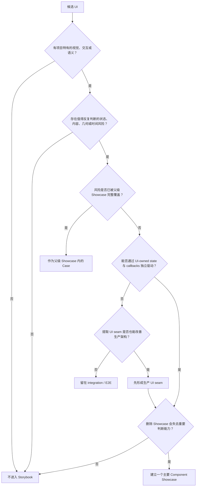
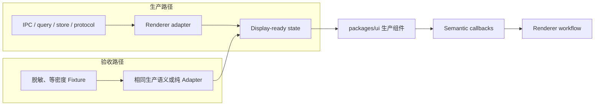
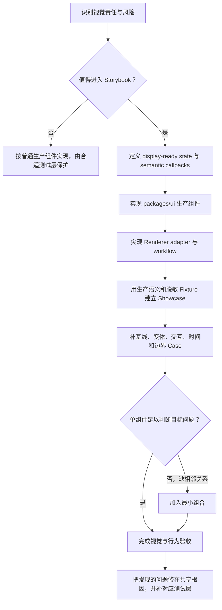
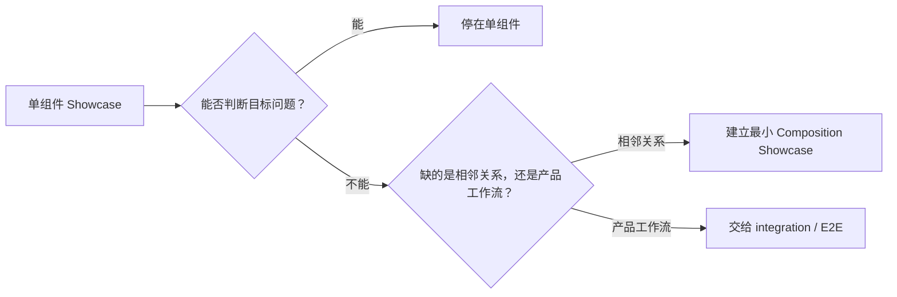

# Storybook 组件验收原则

> 状态：Draft
>
> 日期：2026-07-31
>
> 职责：定义 Reflecta 中哪些组件应进入 Storybook、Storybook 如何参与组件开发，以及组件 Showcase 应如何设计和维护。
>
> 相关文档：
>
> - [Storybook 组件契约验收 Pattern](../../../iterations/v1.3.0/storybook/storybook-component-acceptance-pattern.md)：记录 v1.3.0 中本原则的收敛过程与实际案例；
> - [Storybook 组件验收设计方案](../../../iterations/v1.3.0/storybook/storybook-acceptance-design-plan.md)：记录 v1.3.0 的具体组件清单与实施结果；
> - [Test Case 写作原则](./test-case-principles.md)：定义产品 Feature test case 的范围与写法。

## 组织逻辑

本文采用“质量定位 → 组件准入 → 开发流程 → Showcase 设计 → 组合边界 → 测试分工 → 持续维护”的递进主线。原因是 Storybook 中有哪些组件、组件接口如何设计以及页面中展示哪些 Case，并不是三项互不相关的决定：只有先明确 Storybook 负责验收什么，才能判断哪些 UI 值得进入；组件一旦进入，又会反过来要求生产代码形成可独立驱动的 UI seam；最后才有足够稳定的组件契约去设计 Showcase 和维护规则。

各章节内部按单一维度做横向划分：组件准入区分代码归属、公共接口和验收价值；Showcase Case 按基线、语义变体、生命周期、内容边界和最小语境分类；质量体系按 Storybook、unit/component、integration 和 E2E 分类。本文只保留跨版本有效的判断原则，具体版本中的组件名单和迁移过程继续由 iteration 文档负责。

全文结论可以压缩成一句话：

> Storybook 是项目特有 UI 的组件契约验收工作台：值得进入的组件必须拥有独立且高风险的视觉或交互责任，并能通过生产 UI seam 独立驱动；每个组件用一个主要 Showcase 集中比较重要状态、交互、时间行为和内容边界，单组件无法判断相邻关系时才加入最小组合。

## 核心心智

Storybook 验收的是**组件契约**，不是 React 文件是否能够 render，也不是产品工作流是否能够完成。

这里的组件契约包含四部分：

1. **视觉语义**：层级、强调、选择、危险、禁用和状态如何被用户理解；
2. **内容几何**：组件面对空、长、多、深、窄和溢出时如何保持布局；
3. **交互反馈**：hover、focus、selection、展开、拖拽、编辑和决策如何变化；
4. **时间行为**：loading、streaming、running、completed、failed 和 stopped 如何连续演进。

TypeScript 可以证明 props 合法，unit test 可以证明 callback 参数正确，但它们不能单独证明长标题、时间和摘要在窄容器中仍然保持正确层级，也不能证明 streaming 更新时展开状态和视觉焦点保持稳定。Storybook 负责把这类需要直接观察、比较和操作的契约变成可重复验收的运行样本。

Storybook 面向整个 Reflecta 产品，但验收单元始终是组件。导航可以按 Capture、Agent、Knowledge Wander 等产品区域帮助定位，Fixture 也应使用 Understanding、Context、Domain 等真实产品语义；但 Showcase 不复制产品页面、用户旅程或应用 runtime。产品语义让 Case 真实，组件边界让验收可维护。

### 统一术语

| 术语                 | 本文含义                                                                     |
| -------------------- | ---------------------------------------------------------------------------- |
| Component Showcase   | 一个组件在 Storybook 中的主要验收入口，集中呈现其重要契约                    |
| Case                 | Showcase 中回答一个具体验收问题的组件样本、交互或状态序列                    |
| Composition Showcase | 只为观察多个组件相邻后的层级、密度和节奏而建立的最小组合入口                 |
| Story                | Storybook/CSF 的技术 export；它可以承载 Showcase 或隔离 Case，不决定验收粒度 |
| Fixture              | 为 Case 提供的稳定假数据；复制生产数据的结构和密度，不复制生产事实           |

“一个组件一个主要 Showcase”是信息架构原则，不等于代码中只能存在一个 Story export。若交互测试、视觉快照或故障隔离需要单独 Story，可以增加技术入口，但不能因此把侧栏重新拆成低信息密度的状态清单。

## 1. 判断哪些组件应该进入 Storybook

### 1.1 先分开三个互不等价的决策

讨论“这个组件要不要抽出来”时，必须分别回答以下问题：

| 决策           | 要回答的问题                                          | 不能据此推出                             |
| -------------- | ----------------------------------------------------- | ---------------------------------------- |
| 代码归属       | 视觉与交互规则应由 `packages/ui` 还是 Renderer 拥有？ | 属于 `packages/ui` 不代表必须有 Showcase |
| 公共接口       | 其他模块是否应直接依赖这个稳定 UI seam？              | 被 public export 不代表值得人工验收      |
| Storybook 准入 | 删除这个 Showcase 后，是否会失去重要的 UI 判断能力？  | 实现复杂不代表视觉风险高                 |

普通表单可以合理属于 `packages/ui`，却因为视觉状态少、风险主要在提交工作流而不进入 Storybook。相反，一个实现很小的摘要组件可能承担行数限制、降噪和截断等高风险责任，值得拥有独立 Showcase。

因此，Storybook 不按代码目录、文件大小、复用次数或 public export 自动收录组件。

### 1.2 独立 Showcase 的准入条件

一个组件只有同时满足以下条件，才应拥有独立 Component Showcase：

1. **存在项目特有契约**：拥有 Reflecta 特有的视觉、交互或产品语义，不只是 shadcn 的普通展示；
2. **存在可观察的风险面**：状态、内容、容器或时间变化可能破坏层级、布局、反馈或用户判断；
3. **拥有独立视觉责任**：这些风险不能由父级业务组件的 Showcase 完整覆盖；
4. **可以形成 UI-owned seam**：组件能由 display-ready state 和 semantic callbacks 驱动，不依赖整页 runtime；
5. **维护收益大于成本**：团队以后确实需要反复比较、回归或扩展这些 Case。

这些条件不是打分表。前三项判断有没有独立验收价值，第四项判断是否已经形成可验收组件，第五项执行最终删除测试。缺少任意一项，都不应为了填满 Storybook 导航而建立独立 Showcase。

### 1.3 准入判断流程



这个流程可能产生三种合法结果：

- **独立 Showcase**：组件拥有独立、高风险且可运行的 UI 契约；
- **所属 Showcase 内的 Case**：内部 renderer 有重要状态，但用户不会把它理解为独立组件；
- **不进入 Storybook**：风险主要属于标准组件排列、纯逻辑、应用 wiring 或完整产品工作流。

“没有独立 Showcase”不等于“不需要测试”。它只说明相应风险应由父级 Showcase、unit/component、integration 或 E2E 中更合适的一层负责。

### 1.4 通常不进入 Storybook 的内容

以下内容默认不进入；例外必须指出它新增了哪一种现有 Showcase 无法完成的重要判断：

- shadcn 基础组件 gallery；
- 普通 Form、List、Detail、Tab、Dialog 等标准组件排列；
- 页面、路由、应用外壳和完整产品工作流；
- query、store、IPC、持久化和真实后端行为；
- parser、adapter、selector、formatter 和数据 transform 等纯逻辑；
- 已被所属业务组件完整覆盖的内部 renderer；
- 仅因为代码很多、已经 export、被多处使用或以后可能有用而产生的候选项。

第三方组件经过配置后，如果已经形成 Reflecta 特有的视觉或交互契约，验收对象应是项目拥有的语义组件，而不是第三方 primitive 本身。

## 2. Storybook 如何改变组件开发

### 2.1 Storybook 是生产组件的第二个真实消费者

没有 Storybook 时，UI 容易直接读取 Router、query、store、IPC 返回值和页面上下文。它可以在页面里工作，但组件契约被 runtime 隐藏，无法独立观察和比较。

Storybook 引入第二条消费路径：



两条路径必须汇入同一个生产组件接口。Storybook 不维护第二套组件、第二套状态模型或第二套渲染逻辑。

### 2.2 组件接口因此需要显式表达 UI 契约

进入 Storybook 的组件应遵守以下 interface 规则：

- UI 接收已经准备好展示的 state 或 View Model，不自行理解 IPC、数据库或原始协议；
- UI 发出 `onApprove`、`onSelect`、`onJump`、`onOpen` 等语义事件，不直接执行应用工作流；
- Renderer 负责数据读取、协议转换、持久化、toast、clipboard、导航和跨模块协调；
- streaming 对象必须有稳定的 message、block、tool call 或 entity identity；
- partial、terminal 和 error state 应形成合法且可解释的状态模型，不能依赖偶然的 React 生命周期；
- Story 与生产代码共同消费同一个 interface，禁止 production 反向依赖 `.stories` 或 fixture。

这里的目标不是把所有组件设计成通用 Design System，而是让 Reflecta 特有的 UI 语义能够脱离应用 runtime 被看见和操作。

### 2.3 推荐的开发顺序



这不要求先写一套 Story 再移植到生产，也不要求所有 UI 都采用 Story-first。它要求开发完成前，入选组件已经能通过同一个生产 seam 在 Renderer 和 Storybook 中工作。

### 2.4 Storybook 是 seam 检查器，不是抽象制造机

“组件很难写 Story”是一种架构信号，但不能直接推出“为了 Storybook 拆组件”。

只有当提取 display-ready state 和 semantic callbacks 同时让生产职责更清楚时，才应形成新的 UI seam。如果主要风险来自 Router、DOM observer、IME、真实滚动、IPC 或跨页面工作流，就应留在 Renderer 与 integration/E2E 中。

禁止为了 Storybook：

- 新建没有 production caller 的 public interface；
- 复制 Renderer 页面或 connected component；
- 把 raw protocol、query hook 或 store 搬入 `packages/ui`；
- 新造 Story-only adapter、状态机或业务类型；
- 为了让 Case 好写而给生产组件增加无业务意义的 props。

## 3. 设计 Component Showcase

### 3.1 一个组件只有一个主要验收入口

侧栏负责回答“正在验收哪个组件”，Component Showcase 负责回答“这个组件在重要情况下如何呈现和变化”。

因此，Default、Loading、Error、Long Content 不应机械拆成大量导航项。一个业务组件保留一个主要 Showcase，在页面内部按具体验收问题组织 Section。必要的独立 Story export 可以服务自动化和故障隔离，但不能让用户依赖频繁切换侧栏和短期记忆完成比较。

### 3.2 Case 来自契约维度，不来自 props 穷举

一个 Showcase 从以下五类中选择必要 Case，不要求机械凑齐：

1. **代表性基线**：最常见、足够真实且能表达主要责任的生产内容；
2. **语义变体**：会改变信息结构、视觉语法或用户判断的 props；
3. **生命周期与交互**：组件自己拥有的状态变化和操作反馈；
4. **内容与几何边界**：空、长、多、深、窄、溢出、截断和安全降级；
5. **必要的最小语境**：组件孤立时无法判断的相邻关系。

可以把设计公式记为：

> Component Showcase = 代表性基线 + 有意义的语义变体 + 自有生命周期 + 高风险边界 + 必要的最小语境。

这不是笛卡尔积。`size × variant × state × content × width` 的全排列会制造大量重复，使真正需要判断的差异被噪音淹没。

这里的“最小语境”仍然服务于一个组件，例如为列表行提供真实宽度容器，或放入一个必要的相邻元素来判断 hover 关系。只有当验收问题的主语变成“多个组件放在一起后的层级、密度或节奏”时，才升级为独立的 Composition Showcase。

### 3.3 每个 Case 必须回答一个可说出口的问题

Case 的入口不是“组件有哪些 props”，而是“开发者需要判断什么”。

推荐的 Section 名称：

- `标题、时间与摘要在窄容器中如何收缩`；
- `子节点选中后，父节点 hover 是否仍然清楚`；
- `确认、拒绝与执行终态如何连续变化`；
- `未闭合 Markdown 在 Streaming 中是否稳定呈现`。

不推荐的 Section 名称：

- `Default`；
- `Error`；
- `Edge Case`；
- `Variants`；
- `Test 1`。

如果无法用一句话说明一个 Case 要判断什么，它通常只是 fixture 陈列，应合并或删除。

### 3.4 为验收问题选择正确的观察方式

| 要观察的契约                   | 合适方式                   | 原因                               |
| ------------------------------ | -------------------------- | ---------------------------------- |
| 多个稳定状态的差异             | 同一 Section 同时展示      | 避免依赖记忆和频繁切换             |
| 组件自己拥有的交互             | 直接操作，并提供局部 reset | 验收真实反馈，不以静态截图代替交互 |
| streaming、running 等时间行为  | 自动推进同一个实例         | 暴露节奏、增量更新和 identity 问题 |
| 多组件相邻后的层级与密度       | 最小组合 Case              | 单组件无法回答，但无需复制产品页面 |
| 大量、复杂或需要连续阅读的内容 | 单栏纵向展示               | 保持阅读流，避免视线在多栏之间跳转 |
| 少量、短小、需要直接比较的状态 | 适度并排或网格             | 同屏比较能够提高判断效率           |
| 非关键参数探索                 | Storybook Controls         | 允许探索，但不承担基础验收         |

Controls 不能成为完成主要验收的必经路径。关键状态应直接出现在 Showcase 中。

### 3.5 时间行为必须保持同一个组件实例

streaming、running 和渐进加载不能通过“下一帧”按钮或每帧 remount 来模拟，因为这会掩盖生产中的状态连续性问题。

时间 Case 应满足：

- 自动推进，并允许暂停、重置、循环或完成；
- 同一对象保持稳定的 message id、block id、tool call id 和 React key；
- partial content 通过 rerender 增量更新，不替换成另一个组件实例；
- 手动展开、选中或输入状态在合理情况下保持；
- 生命周期只沿合法方向演进，不被旧 snapshot 降级；
- 动画间隔和最终状态确定，不依赖随机数、网络或当前时间。

若这些条件难以满足，应先检查生产 identity 与状态模型，而不是降低 Story 的真实性。

### 3.6 Fixture 要假数据、真结构、真密度

Fixture 的目标不是复制生产事实，而是复制生产数据的形状、密度和变化方式。

Fixture 应满足：

- 使用生产组件、生产 View Model 和生产支持的语义类型；
- 字段、嵌套、字数、列表规模、长短分布和状态变化接近生产；
- 人名、路径、命令、URL、知识内容和业务事实全部虚构；
- 图片与文件使用稳定本地资源，不依赖随机远程资源；
- 时间、随机数和自动播放可重复；
- 需要 DTO → View Model 时复用纯生产 adapter 或相同生产转换语义；
- 每个交互组拥有局部 reset，Case 之间不会互相污染；
- Fixture 只存在于 Storybook/test 范围，不进入 production bundle 或接口。

真实生产数据只能作为结构参考。即使仓库私有，也不能把用户内容直接复制进 Storybook，避免验收工具成为新的敏感数据副本。

### 3.7 Showcase 页面保持低噪音

推荐的页面骨架是：

```text
组件名称
一句话说明本页验收目标

Section：具体验收问题
必要时的一句说明
组件实例

──────────────── Divider ────────────────

下一个 Section
```

页面规则：

- Section 之间使用标题、必要说明和 Divider；
- 不给 Showcase、Section 和 Case 层层套展示卡片；
- 只有生产组件本身是卡片时，页面中才出现卡片；
- 短标签只用于标识直接比较项，不取代验收问题；
- 默认容器宽度应接近生产使用环境，边界宽度作为明确 Case 另行展示；
- 中文用于导航、Section、Case 标签和操作反馈；正式产品术语、代码、命令和字段保留原文。

Showcase 外壳的视觉权重必须低于被验收组件本身。

## 4. 组合场景只恢复必要的相邻关系

### 4.1 只有单组件无法判断时才建立组合

Composition Showcase 只回答以下问题：

- 相邻组件的信息密度是否失衡；
- 主次层级和视觉节奏是否合理；
- selection、hover、展开和 streaming 是否互相干扰；
- 多种长内容同时出现时，布局是否仍然稳定；
- 组件在接近真实使用宽度下是否仍能表达自己的契约。

如果一个组合 Case 只能证明“这些组件可以 render”，它没有独立验收价值，应删除。

### 4.2 组合是邻接关系，不是产品旅程



组合场景可以使用：

- 真实 `packages/ui` 生产组件；
- 本地、确定的展示状态；
- display-ready View Model；
- 纯生产 adapter；
- semantic callbacks 和页面内的可见反馈。

组合场景不应使用：

- Router、query、store、IPC 或真实后端；
- toast、持久化、真实删除和真实审批流程；
- Renderer 页面、connected screen 或应用外壳副本；
- 为串起 Demo 新造的产品状态机；
- 需要跨页面才能判断成功的用户旅程。

Storybook 可以使用 Understanding、Context、Domain、Agent Tool 等真实产品语言，也可以呈现接近生产的信息密度；但它验收的是组件组合后的呈现，不是用户如何完成一次完整任务。

## 5. Storybook 与其他质量层如何分工

### 5.1 Storybook 不替代自动化测试

| 质量层                    | 主要回答的问题                       | 典型例子                                                |
| ------------------------- | ------------------------------------ | ------------------------------------------------------- |
| Storybook                 | 视觉、交互、时间和内容边界是否可接受 | 长命令是否溢出；审批状态是否连贯；Markdown 是否清楚     |
| UI unit/component test    | 可确定的组件行为是否正确             | callback 参数、键盘选择、reset、稳定 identity、安全降级 |
| 纯逻辑 unit test          | parser、selector、adapter 是否正确   | Markdown codec、DTO → View Model、tree transform        |
| Renderer integration test | UI 与应用 runtime 的连接是否正确     | query/store/IPC 状态映射、错误处理、页面内协调          |
| E2E                       | 真实用户工作流是否贯通               | 创建、保存、审批、持久化、刷新恢复和跨页面协作          |

一个 Story 可以被自动化运行，但“能够打开 Story”不等于契约已经被自动证明。可确定的行为应由 unit/component test 给出断言；需要人判断的视觉层级、密度和节奏由 Showcase 提供稳定观察入口；真实工作流继续由 integration/E2E 负责。

### 5.2 Storybook principles 与 Test Case principles 不重复

[Test Case 写作原则](./test-case-principles.md)首先判断产品是否有意承诺一项用户能力，并用 Feature Scenario 描述用户目标、操作和可观察结果。

Storybook principles 判断项目特有组件是否拥有值得独立验收的 UI 契约，并用 Case 呈现视觉语义、内容几何、交互反馈和时间行为。

同一个行为可以由两层共同保护，但两层的表达不能混淆。例如用户拖拽 Domain：

- Feature Scenario 验收用户能否完成领域排序或层级调整，并看到产品兑现结果；
- Storybook Case 验收拖拽 overlay、可放置反馈、层级缩进、hover 和长名称是否清楚；
- component test 断言 callback 参数和键盘操作；
- E2E 在需要时验证真实持久化和重新进入后的顺序。

不要把 Feature Scenario 写成 CSS 检查，也不要因为 Story 中能点击“确认”，就认为真实审批、IPC 和持久化已经通过验收。

### 5.3 不测试 Story 的字面内容

不要编写以下测试：

- Fixture 文本必须包含某段固定 Markdown；
- Showcase 必须拥有固定数量的 Section；
- Story 文件必须 export 固定数量的对象；
- 导航中必须长期保留某个版本的组件总数；
- 仅断言演示标签或说明文案存在。

测试应保护组件行为、转换逻辑和稳定 identity，不保护 Story 文件的排版实现。Showcase 自身的质量通过本原则的 Review 清单维护。

## 6. Showcase 必须跟随组件契约变化

### 6.1 新增组件

先执行准入判断。低风险标准组合直接实现，由合适测试层保护；不为保持导航完整或“顺便记录一下”而建立 Showcase。

### 6.2 新增语义类型或状态

- 如果它改变视觉结构、交互反馈、时间行为或用户判断，加入现有 Showcase；
- 如果只是内部实现分支，最终呈现相同，使用 unit test 保护；
- 如果属于已有 visual family，只新增代表性 Case，不复制整个状态矩阵；
- 只有产生新的独立视觉责任时，才考虑新的 Component Showcase。

例如新增 Agent Tool 类型时，优先加入现有 Tool Showcase 的类型图谱；只有出现新的 visual family 或生命周期，才增加新的 Section，而不是增加一个侧栏页面。

### 6.3 修复视觉或交互缺陷

先判断缺陷属于哪一层：

- 组件自身契约被破坏：在所属 Showcase 中建立最小、稳定、长期有效的 Case，再修复共享根因；
- 可确定交互行为错误：同时补 component test；
- DTO、adapter 或状态合并错误：补 unit/integration test；
- 只在页面 wiring 或真实 runtime 中出现：进入 integration/E2E，不扩大 Storybook 范围。

Case 名称描述正确契约，例如“窄容器中的标题与摘要截断”，不要记录一次性的 bug 编号或历史症状。

### 6.4 修改或删除组件契约

Showcase 反映当前生产事实，不永久保存历史行为：

- 生产状态被明确删除时，对应 Case 一起删除；
- 视觉责任移入父组件时，独立 Showcase 合并为父级 Case；
- 组件拆分出新的独立责任时，重新执行准入判断；
- Interface 变化时，Fixture 与 Renderer adapter 同步更新，不能让 Story 停留在旧模型；
- 不再提供重要判断能力的 Story 和装饰应主动删除。

### 6.5 定期执行删除测试

对每个 Showcase 和 Case 反复问：

1. 删除后是否会失去一种重要的视觉、交互、时间或边界判断？
2. 这项风险是否已经被其他 Showcase 完整覆盖？
3. 它是否已经退化为标准组件排列或实现细节？
4. Fixture 和交互维护成本是否已经高于它能发现的问题？

Story 数量不是资产，也不是覆盖率指标。受保护且能被反复判断的组件契约才是资产。

## 7. Review 清单

Review 新增或修改的 Component Showcase 时，逐项确认：

### 准入与归属

1. 能否说清这个组件独立承担的视觉或交互责任？
2. 它是否存在值得反复判断的状态、内容、几何或时间风险？
3. 这些风险是否已经被父级 Showcase 完整覆盖？
4. 是否把代码归属、public export 和 Storybook 准入错误地当成同一决策？
5. 删除该 Showcase 后，是否真的会失去重要判断能力？

### 生产 Seam

6. Showcase 是否渲染真实生产组件，而不是 Story-only 副本？
7. 组件是否由 display-ready state 与 semantic callbacks 驱动？
8. `packages/ui` 是否没有依赖 Router、query、store、IPC 或原始 App protocol？
9. 是否为 Storybook 新造了 production 不需要的 interface、adapter、状态机或 props？
10. Renderer 和 Storybook 是否仍然只存在一套组件语义和渲染实现？

### Case 设计

11. 每个 Case 是否能用一句话说明要判断的问题？
12. Case 是否来自真实契约风险，而不是 props 的笛卡尔积？
13. 关键稳定状态是否可以同屏比较，而不是依赖频繁切换侧栏？
14. 真实交互是否可以直接操作并局部 reset？
15. streaming/running 是否自动更新同一个实例并保持稳定 identity？
16. 复杂内容是否使用适合阅读的布局，而不是盲目追求网格密度？
17. Controls 是否只是探索工具，而不是完成基本验收的必经路径？
18. Showcase 外壳是否足够克制，没有压过生产组件？

### Fixture 与边界

19. Fixture 是否使用生产类型、生产 View Model 和生产转换语义？
20. 数据是否完全虚构，同时保留了接近生产的结构、长度和密度？
21. Case 是否不依赖网络、随机数、当前时间或不稳定远程资源？
22. 是否覆盖了组件真正高风险的空、长、多、深、窄或降级边界？
23. 默认展示宽度是否接近生产环境，避免由 Story 容器制造错误结论？

### 组合与测试分工

24. Composition Showcase 是否只回答单组件无法回答的相邻关系？
25. 是否复制了页面、产品状态机或完整用户旅程？
26. 可确定行为是否由 unit/component test 提供断言？
27. adapter、runtime wiring 和真实工作流是否留在 integration/E2E？
28. 是否错误地把“Story 可点击”当成真实产品行为已经通过验收？

### 维护

29. 新增状态是否归入已有组件，而不是机械增加导航入口？
30. 修复缺陷时是否建立了长期有效的最小 Case，并修在共享根因？
31. 已删除或改变的生产契约是否同步更新或删除 Case？
32. 是否执行了删除测试，移除重复、低收益和过时内容？

只要准入前五项无法明确回答，先不要新增独立 Showcase。若生产 seam、Fixture 或组合边界存在问题，应先修正职责划分，而不是用 Storybook mock 掩盖。

## 8. Structured Writing 自检

- [x] **纵向主线**：全文按质量定位、组件准入、开发流程、Showcase、组合、测试和维护递进，后一章以前一章为前提。
- [x] **顺序测试**：若先规定 Showcase 形式而未定义质量定位和准入标准，无法解释为何展示这些组件；当前一级顺序不可随意交换。
- [x] **电梯测试**：开头一句话已说明 Storybook 是什么、哪些组件进入、如何验收以及何时使用组合。
- [x] **追问测试**：核心结论均继续回答了判断条件、实施方式和排除边界。
- [x] **一句话概括测试**：全文可概括为“以生产 UI seam 驱动高价值组件，用一个主要 Showcase 验收其完整契约”。
- [x] **横向 MECE**：代码归属、公共接口和 Storybook 准入分开；Case 按五类契约维度划分；质量层按 Storybook、unit/component、integration 和 E2E 划分。
- [x] **层级从属测试**：同层列表均使用统一分类标准，没有把原因、结果和案例并列。
- [x] **论证闭环**：准入、开发流程、Case 机制和组合边界均同时给出规则、原因与实例。
- [x] **过渡测试**：准入结论自然引出生产 seam，生产 seam 引出 Showcase，单组件边界再引出组合与测试分工。
- [x] **层级深度测试**：正文标题控制在三级，必要细节使用表格和列表承载。
- [x] **标题可预测性**：仅阅读一级标题即可预判从定义、设计到维护的完整内容。
