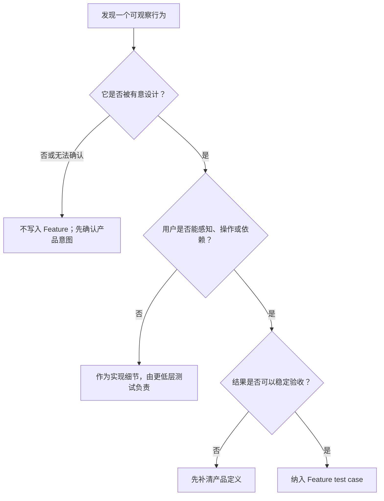
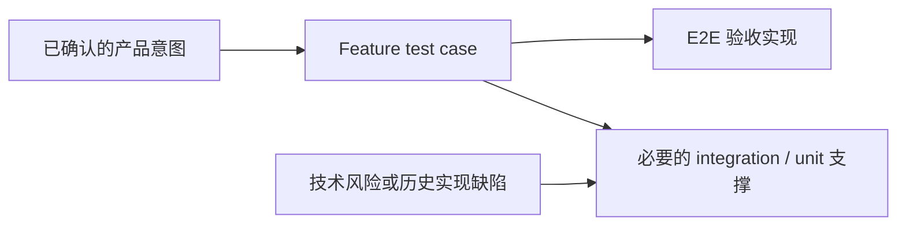

# Test Case 写作原则

这份文档用于积累项目里已经明确提出并确认的 test case 写作原则，不自动扩展或替换产品原意。

## 组织逻辑

本文按照“定义 Feature → 确定覆盖范围 → 编写 test case → 选择自动化实现 → 跟随产品维护”的顺序组织。先判断一个行为是否属于产品有意提供的功能，再决定应该覆盖哪些成功和错误路径；只有产品承诺明确后，才讨论 Gherkin 表达和自动化分层。这样可以避免从现有代码、控件或测试实现反推产品功能。

## 核心心智

Feature test case 是产品功能的可执行说明。

> 当前产品中所有 intentionally designed features 都应该被 test case 覆盖，包括它们的 happy path 和 intentionally designed expected error behavior。

这里的关键边界不是“业务逻辑还是 UI”，而是“产品是否有意设计并承诺这个行为”：

- 展开和收起、调整面板尺寸、拖动排序等 UI 行为，如果是有意提供给用户的能力，就是 Feature。
- 修改实体、保存内容、切换对象和重新进入后保持状态，都是用户能够依赖的产品行为。
- 按钮可点击、DOM 层级、CSS class、内部事件和状态更新方式，本身不是 Feature。
- 代码里偶然存在但未被确认为产品契约的行为，不因为可以被观察或自动化就成为 Feature。

测试数量不是目标。唯一标准是 Feature 文件能否如实、完整地反映当前产品有意提供的功能。

## 1. 判断什么是产品 Feature

一项行为同时满足以下三个条件，才应视为 intentionally designed feature：

1. **有明确产品意图**：它来自已接受的产品文档、iteration 决策、交互设计，或由产品负责人明确确认为产品能力。
2. **用户可以感知或依赖**：用户能够操作它、看到它的结果，或依靠它维持自己的工作状态。
3. **结果可以验收**：不同测试者按照相同的前置条件和步骤，能够一致判断产品是否兑现了承诺。

判断流程如下：



### UI 行为也可以是 Feature

不能用“这是 UI”作为删除 test case 的理由。以下行为只要经过有意设计，就属于产品 Feature：

- 用户展开或收起信息，以控制当前阅读范围；
- 用户调整面板尺寸，以改变自己的工作空间；
- 用户拖动 Domain，以调整长期领域的顺序或层级；
- 用户修改 Understanding，并在重新打开后继续看到修改结果。

它们都有明确的用户目的和可观察结果。

### 控件本身不是 Feature

控件只是完成 Feature 的入口，不能把控件状态冒充产品功能。

反例：

```gherkin
场景: 保存按钮可以点击
  假如页面存在保存按钮
  那么保存按钮应该可以点击
```

这个场景没有表达用户要完成的事情，也没有验证点击后产品承诺的结果。

正例：

```gherkin
场景: 用户修改 Understanding
  假如用户正在查看一条已有 Understanding
  当用户修改标题并保存
  那么页面应该显示修改后的标题
  而且用户重新打开这条 Understanding 后仍应看到修改后的标题
```

按钮是否可点击只是完成用户目标的必要条件，不是 test case 的目标。

## 2. 覆盖 Feature 的产品承诺

每项产品 Feature 的场景只分为两类：happy path 和 expected error behavior。

`@recovery`、`@isolation`、`@context` 等词可以作为辅助 tag，帮助描述场景特征，但不与这两类并列，也不构成独立的覆盖要求。

### Happy path

Happy path 证明用户能够完成产品有意支持的目标。

同一项 Feature 可以有多个 happy path，但只有当用户入口、关键前置状态或产品结果确实不同时，才拆成多个 Scenario。不要为了穷举控件、参数或事件组合而制造场景。

例如“修改实体”可以包含修改内容、调整所属 Domain 和重新进入后看到已保存结果。如果它们属于一个连续的用户目标，可以放在同一个 Scenario；如果入口或验收结果彼此独立，再拆开。

### Expected error behavior

Expected error behavior 是产品**有意设计过处理方式**的失败路径，不是任意技术故障。

典型场景包括：

- 用户提交无效输入后看到明确说明，原有数据没有被破坏；
- 用户请求不存在的对象后收到可理解的结果；
- Agent 回复失败后，输入区恢复可用并允许用户重试；
- 模型下载失败后，用户看到失败状态并可以重新下载。

只有“系统可能报错”还不够。Feature 必须说明产品准备如何帮助用户理解错误并继续操作。

### Recovery 不单独分类

Recovery 描述用户在中断或失败后回到可继续使用状态，不需要成为第三种场景类型：

- 正常中断后的恢复属于 happy path，例如重启应用后继续查看已保存的对话。
- 错误发生后的恢复属于 expected error behavior，例如请求失败后允许重试。

### 全部覆盖不等于组合穷举

覆盖所有 intentionally designed features，是按**产品承诺**穷尽，不是按输入参数、浏览器事件或内部状态排列组合。

一项 Feature 可以从以下维度检查是否遗漏：

| 覆盖项                  | 必须回答的问题                           |
| ----------------------- | ---------------------------------------- |
| Happy path              | 用户能否完成这项功能并得到正确结果？     |
| Expected error behavior | 每一种有意设计的失败处理是否兑现？       |
| 持久状态                | 如果产品承诺保存，重新进入后是否仍正确？ |
| 跨对象状态              | 如果产品承诺隔离，切换对象后是否仍正确？ |

后两项只有在产品明确承诺时才需要，并分别归入对应功能的 happy path 或 expected error behavior。

## 3. 先定义 Test Case，再实现测试

Test case 应该先于 E2E、unit、integration 等自动化实现方式被定义。

正确顺序是：



不要从已有 E2E、unit、integration 或代码路径倒推 test case，也不要为了给现有自动化测试找理由而创建 Feature。

E2E 负责证明用户从真实入口能够完成 Feature 场景。Unit 和 integration test 可以更细地覆盖状态组合、边界条件与历史技术回归，但这些技术测试不应反向污染 Feature 的产品语言。

## 4. 只用 Feature 文件维护 Test Case

新增或维护 test case 时，只产生 Gherkin / Cucumber Feature 文件，不再创建一份并行的 `test-case.md`。

同一个产品模块可以维护多个 Feature 文件。优先按用户能力或场景族拆分，例如：

- `manage-understandings.feature`
- `organize-domains.feature`
- `start-conversation.feature`
- `handle-agent-errors.feature`

不要按组件、服务、Agent runtime 状态机或自动化测试层级命名。

每个 test case 只表达：

```text
稳定 ID
用户目标
前置产品状态
用户操作
用户可观察结果
```

Gherkin 对应关系：

```text
Feature  = 一组相关的产品能力或用户场景
Scenario = 一个可以独立验收的产品承诺
Tag      = 稳定 ID 或辅助覆盖维度
Given    = 用户操作前的产品状态
When     = 用户为了完成目标而采取的操作
Then     = 产品向用户兑现的可观察结果
```

Scenario 可以用 tag 作为稳定 ID，例如 `@AG-START-002`。Scenario 标题应该表达用户目标或结果，不要写成“测试某组件”“检查按钮”或“回归某 bug”。

## 5. 用用户场景表达正确结果

Test case 的设计入口是用户在产品中要完成的事情，不是代码模块或测试层级。

### 有组织地描述用户场景

Test case 不是零散检查点组成的 bullet list。先按产品能力或用户场景族组织 Feature，再用 Scenario 表达一个可以独立验收的产品承诺。

这些维度可以帮助检查覆盖，但不应反过来成为 Feature 的主结构：

```text
用户正常完成任务
用户遇到产品已设计的错误
用户中断后继续使用
用户在多个对象之间切换
用户带数据或上下文操作
用户查看和处理结果状态
```

### 只写用户能执行和观察的内容

Test case 不对技术细节负责。不要写入：

- DOM 层级、CSS class、React state、事件类型；
- 像素位置、内部测量值、渲染帧数；
- 流式 delta、缓存更新和数据库事务的内部过程；
- 某个函数是否被调用、某个组件是否挂载；
- 控件单独“存在”“可点击”或“被禁用”，却没有对应用户目标；
- 当前实现偶然表现出来、尚未被确认的交互。

视觉样式也不能自动算作 Feature。颜色、间距和 hover 效果通常由视觉验收、截图测试或组件测试负责；如果视觉状态承载明确产品语义，例如危险操作、不可用状态或当前选中对象，则 Feature 应验证用户能够理解的状态，而不是指定 CSS 值。

### 期望结果写正确结果

Test case 应该验证产品得到正确结果，而不是验证“没有出现某个错误结果”。

例如，打开 Agent 模块的 test case 应该描述用户看到的 Agent 页面状态；不要写成“打开 Agent 模块时不应该出现数据分析看板”。

### 不写 bug 症状回放

Test case 不记录历史 bug 的具体症状。如果页面曾经因为某个 bug 变成空白，不要写“打开页面不会空白”，而要回到长期有效的产品行为：用户打开页面后应该看到什么、可以执行什么、如何判断成功。

处理 bug 时：

- 如果 bug 破坏了已有 Feature，就加强该 Feature 对应的自动化测试；
- 如果 bug 暴露出遗漏的 intentionally designed behavior，就补充 Feature；
- 如果 bug 只涉及内部实现，不新增 Feature test case。

### Test case 必须可执行

Test case 交给不同的人执行时，应该得到一致的理解和通过或失败判断。

不要写只有作者知道含义的表达，例如“复杂回复按发生顺序显示”或“显示在它发生的位置”。应该明确测试者可直接观察的状态、顺序、文字或操作结果。

### 不控制 AI 的具体输出

AI 的自然语言输出不可控，test case 不应假设 AI 一定生成某段固定文字或某个固定语义答案。

涉及 AI 回复时，应验证用户可见的产品状态，例如出现回复、回复完成、失败状态、停止状态、输入框恢复可用、对话状态保持一致。

只有内容来自 seed、fixture 或预置对话状态时，才可以把具体文字写进 test case。

### 测试数据必须可获得

Test case 里的具体数据必须在测试环境中真实存在。

具体名称必须来自 seed、数据库预置数据或 fixture。如果具体值不重要，就使用大写代指，并在执行前从 seed 或 fixture 绑定，例如 `B_USER_MESSAGE`、`CANDIDATE_TITLE`、`ATTACHMENT_FILE`。

不要在 test case 里引入项目没有的产品概念。

## 6. Feature 必须跟随产品变化

Feature 文件反映当前产品事实，不永久保存历史行为。

### 新增功能

在实现前：

1. 确认产品意图和验收结果；
2. 补充 happy path；
3. 列出所有已经设计的 expected error behavior；
4. 再决定 E2E、integration 和 unit 的分工。

### 修改功能

先修改 Feature，使其表达新的产品承诺，再调整自动化实现。不要同时保留互相矛盾的新旧场景。

### 删除功能

功能被明确移除后，对应 Scenario 和由它派生的 E2E 应一起删除。不能因为代码曾经存在，就继续把旧行为当作当前产品契约。

### 修复 bug

先判断 bug 违反了哪项产品承诺：

- 已有 Feature 足以表达正确行为：修复实现并加强对应自动化；
- 产品承诺存在但 Feature 遗漏：补充 Feature；
- 没有明确产品意图：先做产品决策，不能从 bug 症状直接创造 Feature。

## 7. Review 清单

Review 每个 Feature Scenario 时逐项确认：

1. 能否指出它对应的明确产品意图？
2. 场景目标是否是用户要完成的事情，而不是控件或代码状态？
3. 结果是否由用户感知、操作或依赖？
4. Given 是否只描述必要的产品前置状态？
5. When 是否描述用户操作，而不是内部事件？
6. Then 是否描述正确结果，而不是“没有出现历史 bug”？
7. 具体测试数据是否来自 seed、fixture 或已绑定变量？
8. AI 输出是否只验证可控的产品状态？
9. Happy path 是否覆盖了这项功能的主要承诺？
10. 所有 intentionally designed expected error behaviors 是否已经覆盖？
11. 是否存在仅为参数组合、DOM、样式或内部状态新增的 Scenario？
12. 产品已经移除的功能是否同步删除了 Scenario？

只要第 1—3 项有一项无法回答，这个 Scenario 就不应直接进入 Feature 文件，应先回到产品定义。
