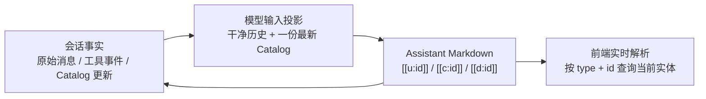
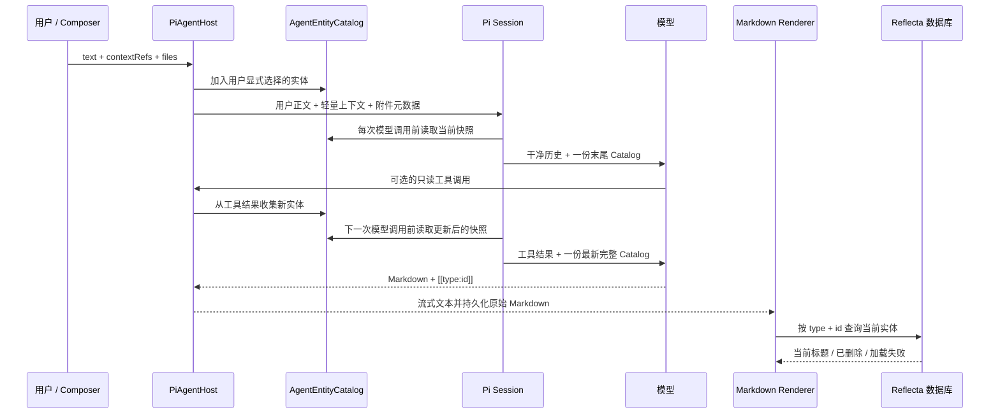
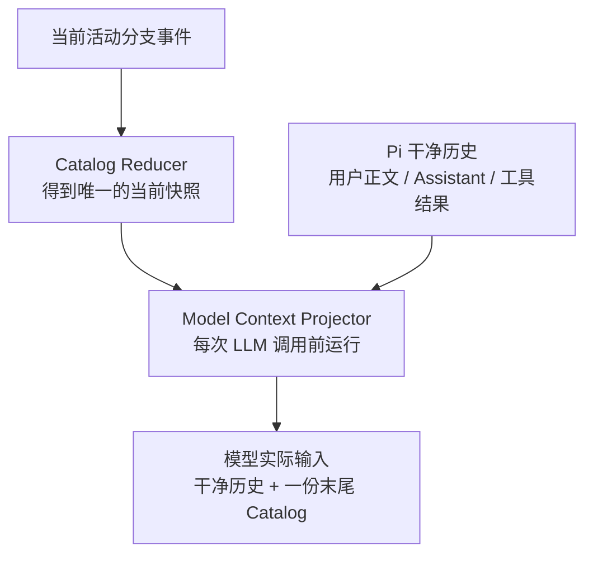

# Agent Citation 与 Entity Catalog 架构

本文说明 Reflecta Agent 的实体引用（Citation）如何工作，以及 Entity Catalog 与模型输入之间的边界。

这里的 Citation 专指 Agent 在回答中生成的稳定实体引用，例如 `[[u:understanding_id]]`。它不是知识正文里的 Wiki Link，也不是供应商自带的网页 Citation。

本文描述 v1.2.2 起的现行架构，并保留旧实现的问题说明。现行架构解决 Catalog 在对话历史中重复注入造成的 Prompt 膨胀，同时保留完整 Catalog 位于模型输入末尾的注意力位置。对话压缩（Compaction）、相关实体筛选和知识内容压缩不在本文范围内。

## 心智模型

Citation 不是一段实体快照，而是指向 Reflecta 实体的稳定指针。Entity Catalog 也不是知识正文，而是模型在当前对话中已经见过、因而允许引用的“实体地址簿”。

整个系统分为三层：



三层的归属规则是：

- 会话事件保存“发生过什么”，是 Catalog 的可重建事实来源；
- 模型输入投影决定“这一次模型实际看见什么”，它不是新的持久化事实；
- 前端按稳定 ID 读取当前实体，是 Citation 显示名称和可点击状态的真实来源。

核心结论：**Catalog 应该以一份完整、最新的快照出现在每次模型调用的最末尾，但不应该被复制进每一轮持久化消息。**

## Citation 协议

### 稳定格式

Agent 输出使用直接 ID 协议：

| 实体类型      | 格式         | 示例               |
| ------------- | ------------ | ------------------ |
| Understanding | `[[u:<id>]]` | `[[u:abc_123]]`    |
| Context       | `[[c:<id>]]` | `[[c:context_42]]` |
| Domain        | `[[d:<id>]]` | `[[d:career]]`     |

ID 只允许 `[A-Za-z0-9_-]+`。类型前缀和 ID 一起构成引用身份，标题不进入协议。

标题不进入 Citation 有三个原因：

1. 标题允许改名，ID 才是稳定身份；
2. 同名实体和跨类型同名实体不会发生歧义；
3. 模型只需要复制 runtime 提供的 token，不需要自己拼接标题、类型和 ID。

用户在编辑器中 `@` 某个实体时，前端传递的是结构化 `contextRefs`。Understanding 正文里的 Understanding 引用使用同一套 `[[u:<id>]]` 语法与渲染逻辑；Context 内容不支持实体引用。知识正文引用和 Assistant Citation 的区别只在于允许的实体范围、内容来源和持久化位置。

### Catalog 记录

当前 runtime 给模型的记录采用逐行 JSON：

```text
<reflecta_entities>
{"type":"understanding","id":"abc_123","citation":"[[u:abc_123]]","title":"示例标题"}
</reflecta_entities>
```

字段语义：

| 字段       | 作用                                             |
| ---------- | ------------------------------------------------ |
| `type`     | 实体类型的唯一来源                               |
| `id`       | 工具调用使用的真实参数                           |
| `citation` | 最终回答需要原样复制的显示协议                   |
| `title`    | 帮助模型识别实体的提示；不是身份，也不是知识正文 |

System Prompt 明确要求：最终回答只能复制 Catalog 中已有的 `citation`，工具调用只能传 `id`，不能自行构造或把 Citation token 当作工具参数。

这个直接 ID 协议已经经过真实模型压力测试。DeepSeek `deepseek-v4-flash` 的 20 个 direct 会话、220 轮测试中，目标覆盖率、type + ID 绑定和长对话末轮召回均为 100%；唯一失败是一次正确 Citation 的重复输出。具体数据见 [Citation 真实模型 A/B 报告](../../../../iterations/v1.1.22/evals/citation-reliability-report.md)。因此架构演进首先保留现有协议，不把“输入投影变化”和“Citation 格式变化”绑在一起。

### Citation 表达什么

Citation 表达的是“这段回答指向哪个 Reflecta 实体”，不是不可变的证据快照：

- 实体改名后，旧消息会显示新标题；
- 实体删除后，旧消息显示“引用不可用”；
- 实体正文后来被修改，Citation 仍指向修改后的同一个实体；
- 系统当前没有保存 claim 到原文片段的逐句证据映射。

因此它是活的实体链接，不是学术引用或审计级内容快照。需要不可变出处时，应另行设计版本化实体或证据快照，不能把该语义塞进现有 Citation token。

## 当前端到端流程



### Catalog 从哪里来

`AgentEntityCatalog` 以 `type:id` 为 key 去重。实体来自两条路径：

1. 用户显式 `@` 的 `contextRefs`，origin 记录为 `user_context`；
2. Agent 工具返回的数据，origin 记录为 `tool_result`。

工具收集器识别 Understanding、Context、Domain 的对象、ID 字段、ID 数组和 `retrieve_knowledge` 的候选结构。已存在实体再次出现时不会重复加入；如果后来取得了新的非空标题，则更新 Catalog 中的标题。

Catalog 的变化以 `entity.catalog.updated` 事件保存。它的职责是记录这个对话分支已经暴露过哪些实体，而不是复制实体正文。

用户显式选择的实体另有一段“轻量上下文”说明，最多包含 8 个 ref。它表达本轮用户明确指向了什么，属于这条用户消息本身；全局 Entity Catalog 则表达整个当前分支可引用的实体集合。两者不能合并成一个概念。

### 用户 Prompt 与模型输入如何构造

`buildPiPromptText` 只拼接属于当前用户消息本身的内容：

```text
用户正文
+ 本轮显式选择的轻量上下文
+ 附件元数据
```

完整 Catalog 不进入 `session.prompt(...)`。Pi 的 `context` extension hook 在每次 LLM 调用前清理模型可见副本中的旧 runtime block，再把当前完整 Catalog 作为最后一个独立 text block。第 `n` 轮请求实际包含：

```text
System + Tools
+ User 1 + Assistant 1
+ User 2 + Assistant 2
+ ...
+ User n
+ Catalog n
```

Reflecta 的 `user.message` 事件和 Pi 用户消息都只保存用户正文、context refs 与附件。Catalog 是模型输入投影，不是新的持久化事实。

只读工具和经审批的写工具都只更新同一个 `AgentEntityCatalog`。下一次 LLM 调用前，统一的 `context` hook 会读取更新后的完整 snapshot；工具结果文本不再附带增量 Citation 协议。

### Assistant 输出如何保存

Assistant 文本按 Markdown 原样流式输出，并最终保存在 `assistant.turn` 中。后端当前不重写 Citation，也不保存独立的 message-level citation manifest。

这意味着当前约束主要由 System Prompt 和模型评测保证，而不是后端白名单强制保证。模型如果生成一个语法正确但不在当时 Catalog 中的 ID，前端仍会尝试查询；查不到时显示“引用不可用”。因此 Catalog 是生成契约，不是安全边界。

### 前端如何显示

前端先跳过 fenced code 和 inline code，再把合法直接 Citation 转成内部链接：

```text
[[u:abc_123]]
    ↓
#reflecta-entity/understanding/abc_123
```

`EntityCitationAnchor` 随后用 `type + id` 实时读取实体：

- 读取成功：显示数据库中的当前标题；
- 实体删除或不存在：显示“引用不可用”；
- 查询失败：显示“引用加载失败”；
- Understanding 和 Context 可以打开 Inspector；Domain 当前只显示，不进入 Inspector。

前端渲染不依赖 Prompt 中的 Catalog title，也不依赖 `_entityCatalog` 参数。这个边界是正确的：模型看到的标题只帮助生成，UI 显示由当前业务数据决定。

## 旧架构为什么被替换

### Catalog 在历史中重复膨胀

v1.2.1 及以前会把完整 Catalog 拼进每一轮 Pi 用户消息。如果第 `i` 轮 Catalog 的长度是 `|Cᵢ|`，旧历史承担的 Catalog 总量是：

```text
|C₁| + |C₂| + ... + |Cₙ|
```

Catalog 大小稳定时，它随轮数线性重复；Catalog 随工具发现持续增长时，累计量接近二次增长。结果不仅是价格问题：

- 每一份旧 Catalog 都占模型 context window；
- 每一份旧 Catalog 都会参与模型注意力计算；
- 同一实体改名后，历史里可能同时出现旧标题和新标题；
- 多份地址簿形成重复噪声，反而比“一份末尾 Catalog”更容易分散注意力；
- 当时附件元数据位于 Catalog 之后，Catalog 实际并非绝对末尾。

### Catalog 重建没有严格跟随当前分支

编辑旧消息或 fork 后，模型输入应只依赖 root 到当前 leaf 的活动分支。旧实现中的 `eventsFromManager` 使用 `SessionManager.getEntries()` 读取全部 session entries，可能把已放弃分支里的 `entity.catalog.updated` 也归入 Catalog。

Citation 的分支语义应该是：

```text
当前 Catalog = reduce(active branch 上的 Catalog 事件) + 当前运行中新发现的实体
```

使用全部 entries 不是缓存问题，而是状态边界错误。现行实现以 `getBranch()` 重建 Catalog；定位编辑点和 fork 目标时才读取完整 session tree。

## 现行架构：持久状态与模型输入投影分离

现行架构不减少 Catalog 的覆盖范围，也不把它换成“最近相关实体”。它只改变 Catalog 进入模型输入的方式。



请求形态是：

```text
System + Tools
+ User 1 + Assistant 1
+ User 2 + Assistant 2
+ ...
+ User n
+ Catalog n
```

Catalog 成本从 `Σ|Cᵢ|` 变成当前一份 `|Cₙ|`。

### Model Context Projector 的边界

Pi 的 `context` extension hook 会在每次 LLM 调用前收到一份可安全修改的 message deep copy。Model Context Projector 应使用这个原生边界，而不是维护第二套会话或自建模型调用循环。

Projector 对调用者提供一个窄接口，内部承担这些复杂性：

1. 从模型可见副本中移除 runtime 生成的旧 Catalog block；
2. 保留原始用户正文、显式选择、附件元数据、Assistant 和工具结果；
3. 把当前活动分支的完整 Catalog 序列化一次；
4. 将它作为独立文本 block 放在最后一个模型可见消息的末尾；
5. 返回新 messages，不修改 SessionManager 的持久记录。

Projector 必须满足幂等性：对同一份输入执行一次或多次，结果都只有零份或一份 runtime Catalog。

新用户消息不再通过 `buildPiPromptText` 持久化完整 `entityCatalog`。`buildPiPromptText` 只负责属于本轮消息本身的用户正文、显式选择和附件元数据。

### 为什么仍然注入完整 Catalog

这里不采用“每轮只放相关实体”或 top-k：

- 相关性选择本身会给 Agent 增加先验，引导它只关注最近或检索器认为相关的实体；
- 一个早期见过、当前没有再次出现的实体仍可能在后续推理中变得重要；
- Citation Catalog 只保存地址和标题，不是把所有实体正文重复放入上下文；
- 完整快照位于最末尾，保留了当前协议经过验证的 recency 位置。

因此本架构选择“全局可见、单份快照、末尾注入”，而不是“相关实体子集”。如果单份 Catalog 本身最终过大，优先压缩序列化表示；是否改变覆盖范围应作为独立产品与模型质量决策。

### 工具循环如何看到最新 Catalog

`context` hook 在每一次 LLM 调用前触发，包括一次运行中模型调用工具后的下一次调用。工具输出先更新同一个 `AgentEntityCatalog`，Projector 随后读取最新 snapshot，因此：

```text
工具返回实体
→ Catalog collector 更新状态
→ entity.catalog.updated 持久化
→ 下一次 LLM 调用前投影完整最新 Catalog
```

这条统一路径同时覆盖只读工具和经审批的写工具。旧的“只在只读工具文本结果后追加增量 Citation block”路径已经删除，避免同一次调用出现重复 Catalog。

### 旧会话如何兼容

旧 Pi 历史已经持久化了 `<reflecta_entities>`。不应为了迁移而重写 session 文件；Projector 只在模型可见副本中清理它们。

旧 block 只有在同时满足以下条件时才可视为 runtime 生成内容：

- 有完整的 `<reflecta_entities>...</reflecta_entities>` 边界；
- 内部每一行都能解析为已知 `type / id / citation / title` schema；
- `citation` 与 `type + id` 能严格互相推导。

不满足 schema 的同名用户文本必须原样保留。新的 runtime block 应带明确版本标记，后续清理不再依赖猜测。

### 序列化格式的边界

当前 JSON 记录重复了字段名，也同时携带可推导的 `id` 和 `citation`，确实有进一步缩短空间。但直接 ID 协议已经有可靠性基线，因此现行架构保留该 JSON 格式。

未来如果改成紧凑格式，例如每行只保留类型、ID 和标题，必须把它视为 Citation Prompt 协议变更，并重新跑同一套真实模型评测。输入投影去重与序列化压缩是两个独立变量，不能在一次变更里同时发生。

## 分支、编辑与 fork 的语义

Citation Catalog 属于对话分支，不属于整个 session 文件的并集。

编辑旧用户消息后：

1. 编辑点之前的事件仍属于新分支；
2. 被替换消息及其后续旧分支产生的 Catalog 实体不自动进入新分支；
3. 新分支重新通过用户选择或工具结果见到的实体才重新进入 Catalog；
4. Projector 只投影当前活动分支的 snapshot。

前端显示历史 Citation 时仍按消息所在分支的 Markdown 和实体当前状态解析；它不依赖当前输入 Catalog。这样编辑和 fork 改变未来模型可见状态，但不会重写已经生成的 Assistant 文本。

## 架构不变量

### Citation 不变量

- Citation 身份始终是 `type + stable id`，标题不参与身份；
- 工具参数只接受真实 ID，不接受 Citation token；
- Assistant Markdown 原样保存，前端只解析合法语法；
- UI 显示名称来自当前实体，不来自模型生成标题；
- Catalog 只证明实体已暴露给当前分支，不证明模型已经读取了完整正文。

### Catalog 不变量

- 一个活动分支对同一个 `type:id` 最多有一条当前记录；
- Catalog 从活动分支事件可重建，不能依赖前端临时状态；
- 每次 LLM 调用只看到零份或一份 runtime Catalog；
- 非空 Catalog 必须位于模型输入的最后；
- 工具中新发现的实体必须在下一次 LLM 调用前可见；
- 新的持久化用户 Prompt 不包含全量 Catalog 快照。

## 可观测性

现有 `AgentUsage` 已经记录 `input`、`output` 和成本，`AgentContextUsage` 记录 context tokens、window 和占比。Catalog 投影还应提供只包含数量、不包含用户数据的本地指标：

| 指标                         | 用途                             |
| ---------------------------- | -------------------------------- |
| `catalogEntityCount`         | 当前快照实体数量                 |
| `catalogChars` / tokens      | 单份 Catalog 自身大小            |
| `legacyCatalogBlocksRemoved` | 旧会话清理是否生效               |
| `projectedCatalogBlocks`     | 必须始终为 0 或 1                |
| `contextUsage.percent`       | 真实 context window 是否继续增长 |

日志不能写入 Catalog 内容、ID 或标题。判断架构是否有效时，要同时看 Citation 可靠性、Catalog token 和总 context token。

## 失败行为

- Projector 未加载或序列化失败时，应在模型调用前显式失败，不能静默发送一个没有 Catalog 的请求；
- Projector 发现多个 runtime Catalog 时，应去重并记录诊断；
- 旧 block 不能通过严格 schema 验证时，应保留原文，避免误删用户内容；
- Citation 指向不存在或已删除实体时，前端降级为“引用不可用”，不能猜测替代实体。

## 不采用的方案

| 方案                                   | 原因                                               |
| -------------------------------------- | -------------------------------------------------- |
| 每轮继续持久化完整 Catalog             | context 与注意力持续膨胀                           |
| 每轮只注入相关或最近实体               | 引入选择偏差，改变 Agent 的全局实体可见性          |
| 把 Catalog 移到固定 System Prompt      | Catalog 随工具调用和活动分支变化，不是静态系统指令 |
| 同时更换投影方式和 Citation 序列化协议 | 无法判断可靠性变化来自哪一个变量                   |

## 主要代码位置

- `apps/electron/src/main/services/agent/agent-system-prompt.md`：Citation 生成契约；
- `apps/electron/src/main/services/agent/agent-citations.ts`：Catalog Prompt 序列化；
- `apps/electron/src/main/services/agent/agent-entity-catalog.ts`：实体收集、去重与更新；
- `apps/electron/src/main/services/agent/pi-prompt.ts`：当前用户 Prompt 拼接；
- `apps/electron/src/main/services/agent/pi-entity-catalog-context.ts`：非持久化 Catalog 投影；
- `apps/electron/src/main/services/agent/pi-agent-host.ts`：会话、工具循环与 Catalog 生命周期；
- `apps/electron/src/main/services/agent/pi-session-log.ts`：Pi session 与 Reflecta 事件映射；
- `apps/electron/src/preload/typings/agent-context.ts`：用户显式选择的轻量上下文；
- `apps/electron/src/renderer/src/modules/chat/context/context-reference.ts`：Citation 语法解析；
- `apps/electron/src/renderer/src/modules/chat/context/wiki-link.tsx`：实体实时查询和渲染。

相关架构见 [Agent 后端架构](./server.md)、[Chat 前端状态架构](./frontend.md) 和 [知识检索与 RAG 如何工作](../../rag.md)。

## 外部依据

- [Pi Extensions](https://github.com/earendil-works/pi/blob/main/packages/coding-agent/docs/extensions.md)：每次 LLM 调用前的 `context` hook；
- [Citation 直接 ID 协议试验方案](../../../../iterations/v1.1.22/agent-direct-entity-citation-trial-plan.md)：当前协议的设计背景与评测口径。
