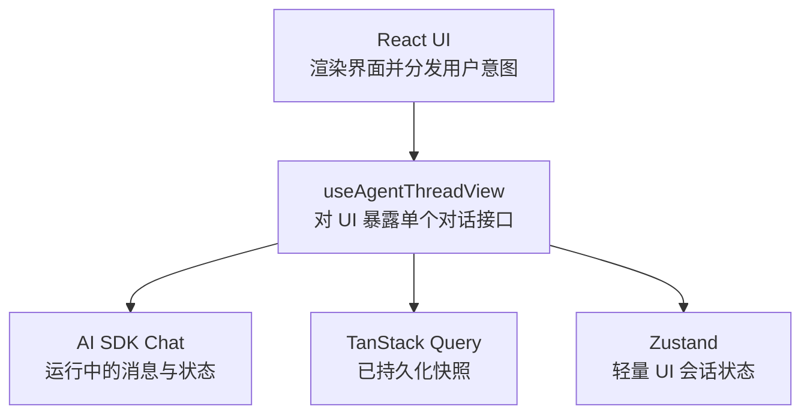
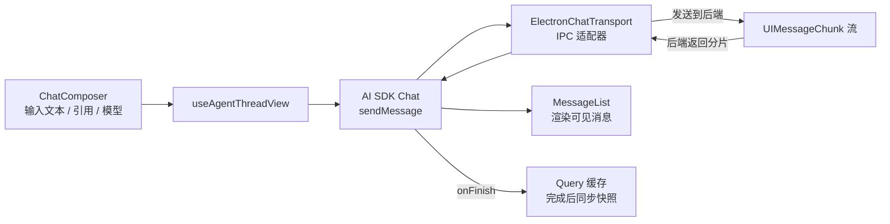
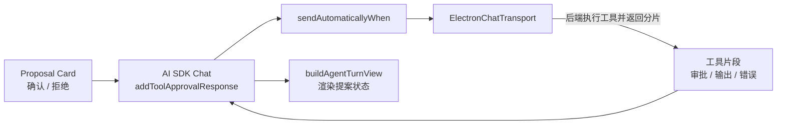
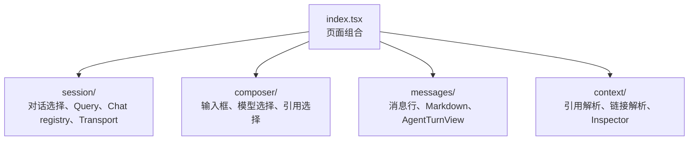

# Chat 前端状态架构

这份文档只描述 `modules/chat` 的前端架构。后端 Agent 运行时只作为 IPC 与 `UIMessageChunk` 流的对端出现，后端细节见 `apps/electron/src/main/services/agent/ARCHITECTURE.md`。

## 心智模型

前端只有三个状态归属。排查问题时先判断是哪一个归属出了问题。

- **AI SDK Chat**：拥有运行中的可见消息、运行状态、停止、重试、重新生成、工具审批续跑。
- **TanStack Query**：拥有已持久化的对话列表、消息列表、模型配置。
- **Zustand**：只拥有 UI 会话状态，例如当前对话、检查面板、输入框聚焦、折叠的工具卡、侧栏运行标记。

前端不再维护一套自己的 Agent 状态机。

## 发送消息路径

这张图只描述前端发出一条消息时经过的前端实体。

关键边界：`ElectronChatTransport` 只把 Electron IPC 适配成 AI SDK 的 `ChatTransport`，不拼装助手消息，也不拥有运行状态。

## 工具审批路径

确认/拒绝是 AI SDK 的工具状态，不是一条假的用户消息。

## 文件边界

放置规则：

- 消息数组运行中归 AI SDK，完成后归 TanStack Query。
- 对话标题 / 预览归 TanStack Query；真实持久化在后端。
- 当前对话和检查面板归 Zustand。
- 提案状态来自 AI SDK 工具片段。
- 消息片段到 UI 区块的转换只放在 `buildAgentTurnView`。
- `messages/` 只渲染视图模型，不调用 IPC，不改 Query 缓存。

## 排查入口

| 现象                   | 先看哪里                                                    |
| ---------------------- | ----------------------------------------------------------- |
| 侧栏标题 / 预览没更新  | `query-cache.ts`、后端消息持久化                            |
| 流式回答卡住或状态不对 | `useChat`、`chat-registry.ts`、`electron-chat-transport.ts` |
| 切换对话导致运行异常   | `chat-registry.ts`；切换对话不应停止 `Chat`                 |
| 确认/拒绝变成用户回复  | `addToolApprovalResponse`、`sendAutomaticallyWhen`          |
| 提案 / 工具卡显示错    | `buildAgentTurnView`                                        |
