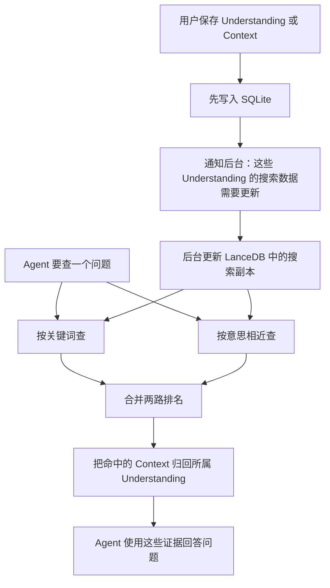
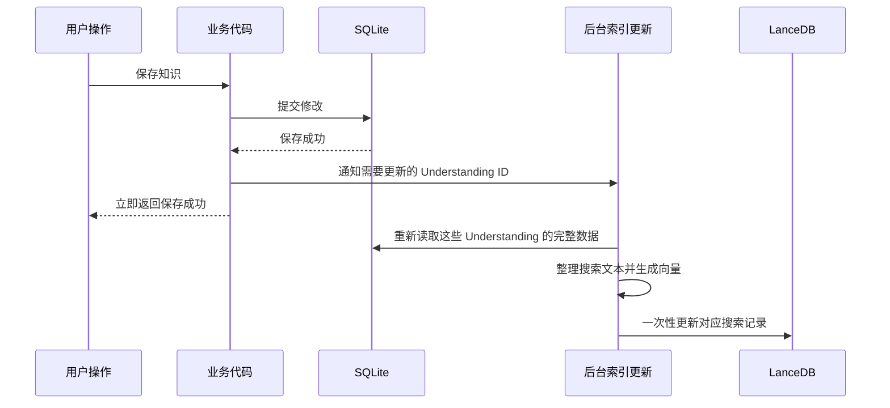

# 知识检索与 RAG 如何工作

本文从两个实际动作出发，解释 Reflecta 的知识检索：

1. 用户保存或修改一条知识后，搜索数据如何更新；
2. Agent 收到一个问题后，如何找到相关的 Understanding 和 Context。

索引更新的排队、失败恢复等细节见 [搜索索引如何保持最新](./retrieval-index-sync.md)。

## 先看完整过程



最重要的两条规则是：

- SQLite 保存真实知识；LanceDB 只保存一份为了搜索而整理的数据副本。
- 保存知识不等待搜索数据更新，所以保存很快，但搜索结果可能短暂落后几秒。

## 系统里保存了哪两份数据

### SQLite：真实知识

Understanding、Context、Domain 和它们之间的关系都以 SQLite 为准。编辑、删除和恢复操作先写 SQLite。

如果 SQLite 与搜索索引不一致，系统相信 SQLite，并重新生成搜索索引。搜索索引不能反过来修改真实知识。

### LanceDB：为了搜索而整理的副本

LanceDB 中的数据不是简单复制数据库表。系统会把一个 Understanding 整理成几条适合搜索的记录：

- Understanding 自己一条；
- 它下面每个未删除的 Context 各一条。

例如：

```text
Understanding：复盘为什么需要记录假设
├── 搜索记录 1：Understanding 的标题、正文、Domain
├── 搜索记录 2：Context A 的标题、内容、媒介、父 Understanding
└── 搜索记录 3：Context B 的标题、内容、媒介、父 Understanding
```

这样做有两个好处：

1. 问题直接对应 Understanding 时，可以命中 Understanding 自己；
2. 问题只出现在某条具体经历里时，可以先命中 Context，再找到它所属的 Understanding。

每条搜索记录都保留父 Understanding 的 ID，所以最终可以把多条命中重新合并成一个 Understanding 候选。

## 一条搜索记录里有什么

同一条记录会准备两份文本：

| 文本           | 给谁使用        | 主要内容                                                                   |
| -------------- | --------------- | -------------------------------------------------------------------------- |
| 关键词搜索文本 | ICU 分词和 BM25 | 标题、Domain 名称、正文；Context 还包括媒介和 Context 内容                 |
| 语义搜索文本   | Embedding 模型  | 在完整内容外标明它是 Understanding 还是 Context，以及父 Understanding 是谁 |

之所以分成两份，是因为关键词搜索和语义搜索需要的信息不同：

- 关键词搜索希望文本自然、直接，方便匹配用户输入的词；
- 语义搜索需要更多结构提示，避免模型混淆 Understanding 和 Context 的角色。

记录里还包括：

- 自己的稳定 ID；
- 所属 Understanding 的 ID；
- Domain、媒介、标题和时间；
- 一段内容指纹，用来判断 SQLite 内容是否已经同步；
- 语义搜索所需的向量。

代码中的 `RetrievalDocument` 指的就是这里所说的“一条搜索记录”。

## 保存后发生了什么



更新单位是整个 Understanding，而不是刚刚变化的单个字段。例如修改一条 Context 时，会重新整理它所属 Understanding 的全部搜索记录。这是因为这些记录会共同使用父标题、Domain 等信息。

以下修改会触发更新：

- Understanding 的新增、修改、删除和恢复；
- Context 的新增、修改、删除和恢复；
- Context 移动到另一个 Understanding；
- Understanding 关联的 Domain 发生变化；
- 已关联 Domain 的名称被修改或 Domain 被删除。

Domain 只是调整顺序或父级时不会更新搜索数据，因为当前搜索记录不包含完整的 Domain 层级路径。

## Agent 发起检索后发生了什么

Agent 使用 `retrieve_knowledge` 工具提交问题。系统同时运行关键词搜索和语义搜索，然后合并结果。

### 第一步：多取一些搜索记录

最终需要返回的是 Understanding，但一个 Understanding 可能有多条 Context 同时命中。如果只取与最终数量相同的搜索记录，合并后可能只剩很少几个 Understanding。

因此系统会先多取一些记录：

```text
需要的搜索记录数 = max(最终 Understanding 数量 × 3, 最终数量 + 5)
```

关键词和语义两路还会各自多取候选，再交给后面的排名合并。

### 第二步：按关键词查

关键词搜索也叫 Lexical Search。当前使用 LanceDB 的 ICU 分词和 BM25 排名。

过程可以简单理解为：

1. ICU 把中文、英文或中英混合的问题拆成可搜索的词；
2. 文档命中其中任意词就可以进入候选；
3. BM25 根据命中了哪些词、词有多稀有、出现次数和文档长度进行排序。

例如模型搜索：

```text
复盘 假设 决策
```

这不是要求文档包含完整字符串“复盘 假设 决策”，而是三个搜索词。命中多个词、命中更少见的词，通常会排得更高。

这里直接使用原始问题，不额外做中文分词、同义词扩展或 `text.includes()` 二次判断。

### 第三步：按意思相近查

语义搜索也叫 Dense Search。Embedding 模型会把问题和每条搜索记录转换成一串数字；意思越接近，两串数字在向量空间中的距离通常越近。

问题在转换前会加一段固定说明，告诉模型这是在 Reflecta 中查找个人知识。已有的产品词汇提示也只用于这一路：

- 问题包含“经验 / 经历 / 上下文”时，补充 `Context`；
- 问题包含“理解 / 认知”时，补充 `Understanding`。

关键词搜索不会使用这层补充。

如果用户没有启用 Embedding 模型，这一路不返回结果，系统仍可以只靠关键词搜索工作。

### 第四步：合并两路排名

BM25 分数和向量距离不是同一种数值，不能直接相加。因此系统使用 RRF（Reciprocal Rank Fusion）只比较名次：

```text
某条记录的最终分数 = 它在关键词列表中的名次分 + 它在语义列表中的名次分

每一路的名次分 = 1 / (60 + 名次)
```

一条记录如果同时被关键词搜索和语义搜索找到，会获得两份名次分；只被一路找到则只有一份。

RRF 的作用是把两张排序表稳定地合成一张，而不是重新判断内容是否相关。

### 第五步：把 Context 归回 Understanding

合并排名后，系统根据父 Understanding ID 整理结果：

- Understanding 自己命中时，记录直接命中证据；
- Context 命中时，把 Context 的媒介、标题、摘要和命中原因放进 `matchedContexts`；
- 同一 Understanding 下的多条命中合并成一个候选；
- 已在 SQLite 中删除的 Understanding 不会返回；
- 候选中附带稳定 ID，Agent 可以继续读取完整 Understanding 及其 Context。

### 第六步：补充明确关联的知识

如果结果还有空位，系统可以再补充一层明确关系：

- 从已经找到的 Understanding 沿显式连接找相邻 Understanding；
- 从用户提供的 Domain 定位直接关联的 Understanding。

这只是查一层已经存在的关系，不会再次让模型规划搜索，也不会改变前面关键词和语义搜索的排名。

当前 Context 类型的 anchor 不参与这一步。

## 检索结果如何用于生成

`retrieve_knowledge` 返回的是知识候选和证据，不是最终答案，主要包括：

- 相关 Understanding；
- 实际命中的 Context；
- 是关键词命中、语义命中还是关系补充；
- 每条命中的名次和分数；
- 用稳定 ID 继续读取完整知识的方法；
- 本次检索的过程记录，例如两路各命中多少条。

Agent 收到这些结果后，可以直接使用摘要回答，也可以继续读取完整 Understanding。最终文字由 Agent 的模型生成，搜索模块本身不负责生成答案。

这就是项目里的 RAG：先从用户自己的知识库取回相关证据，再让模型基于这些证据继续回答。

## 保存后立刻搜索会怎样

Electron 保存成功后，后台才开始更新搜索副本。因此在更新完成前，搜索可能暂时看到旧内容。

系统没有在每次搜索前等待后台更新，因为这会让所有搜索被一次保存拖慢。它也不会临时扫描 SQLite 拼接结果，因为那会形成第二套搜索逻辑。

当 LanceDB 的更新提交后，新内容就可以被查到，不需要等待后续的索引整理工作。应用下次启动时还会核对 SQLite 与搜索副本，修复上次退出前没有完成的更新。

CLI 的行为略有不同：写命令退出前会等待已排队的搜索更新完成，使下一条独立 CLI 搜索能看到刚才的修改。

## 阅读代码时会遇到的名称

这些是代码名字，不是理解流程的前置知识：

| 代码名称                 | 在本文中的意思                                       |
| ------------------------ | ---------------------------------------------------- |
| `RetrievalDocument`      | LanceDB 中的一条搜索记录                             |
| `projection`             | 把 SQLite 知识整理成搜索记录的过程                   |
| `Lexical Search`         | 按词匹配的 ICU/BM25 搜索                             |
| `Dense Search`           | 用 Embedding 向量按意思相近搜索                      |
| `RRF`                    | 只根据名次合并两路结果的方法                         |
| `UnderstandingCandidate` | 合并 Context 命中后准备返回给 Agent 的 Understanding |
| `RetrievalTrace`         | 记录本次检索各阶段数量的信息                         |

## 主要代码位置

- `packages/server/src/domains/retrieval/projection.ts`：整理搜索记录。
- `packages/server/src/domains/retrieval/lancedb-index.ts`：关键词搜索、语义搜索和 RRF。
- `packages/server/src/domains/retrieval/candidate-builder.ts`：把搜索记录归回 Understanding。
- `packages/server/src/domains/search/core.ts`：组织完整检索流程和关系补充。
- `apps/electron/src/main/services/agent/pi-readonly-tools.ts`：Agent 使用的 `retrieve_knowledge` 工具。
