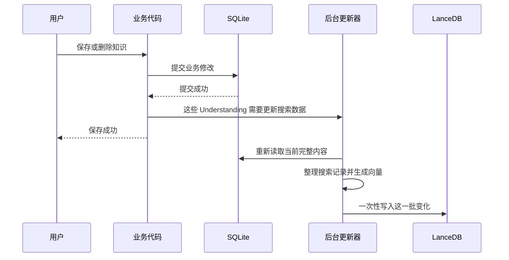
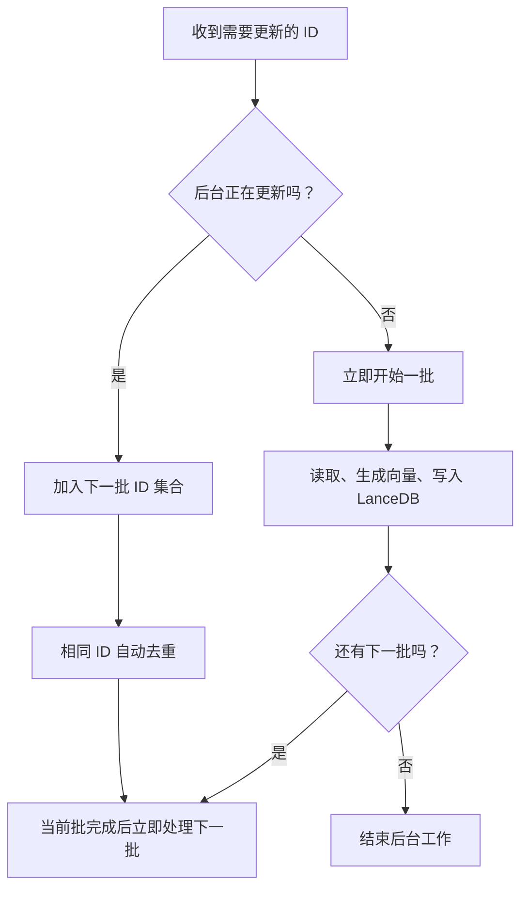
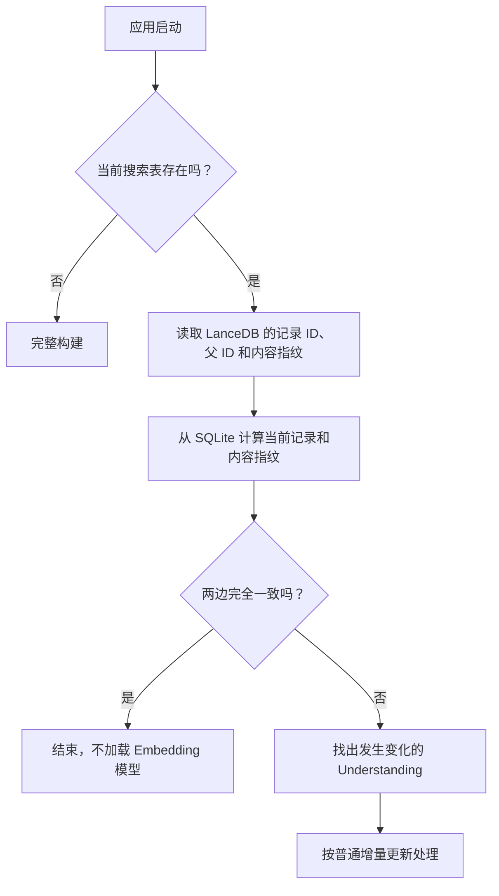

# 搜索索引如何保持最新

本文解释一个具体问题：用户修改 SQLite 中的知识后，LanceDB 中用于搜索的数据如何在后台跟上，并在程序异常退出后自动恢复。

搜索记录的内容以及一次检索如何工作，见 [知识检索与 RAG 如何工作](./rag.md)。

## 为什么需要同步

项目里有两份用途不同的数据：

| 存储    | 保存什么                                         | 是否可以重建                   |
| ------- | ------------------------------------------------ | ------------------------------ |
| SQLite  | 用户真实的 Understanding、Context、Domain 和关系 | 不可以，它是事实来源           |
| LanceDB | 为关键词和语义搜索整理的数据副本                 | 可以，随时能从 SQLite 重新生成 |

如果每次保存都同步生成向量并更新 LanceDB，保存操作会被模型加载和索引写入拖慢。因此系统选择：

```text
先保存真实数据 → 立即告诉用户保存成功 → 后台更新搜索数据
```

代价是保存后会有一个很短的时间窗口，搜索仍然看到旧内容。系统接受这个窗口，并在启动时自动修复没有完成的更新。

## 一次保存的完整过程



这里的顺序不能反：

1. 必须先成功写入 SQLite；
2. SQLite 成功后才能通知后台；
3. 通知后台时不等待真正更新；
4. 后台失败不能撤销已经成功的 SQLite 保存。

## 为什么按 Understanding 更新

后台收到的不是“Context 的 content 字段变了”，而是“某几个 Understanding 的搜索数据需要重新整理”。

原因是一个 Understanding 的搜索数据会同时使用：

- 自己的标题和正文；
- 直接关联的 Domain 名称；
- 下面所有未删除 Context 的标题、媒介和内容。

只局部修改一条旧搜索记录，很容易漏掉父标题、Domain 或 Context 移动带来的变化。重新整理受影响 Understanding 的完整记录更简单，也更可靠。

## 哪些操作需要更新哪些 Understanding

| 用户操作                             | 需要重新整理的 Understanding                   |
| ------------------------------------ | ---------------------------------------------- |
| 新增、修改、删除、恢复 Understanding | 当前 Understanding                             |
| 新增、修改、删除、恢复 Context       | Context 所属 Understanding                     |
| Context 移到另一个 Understanding     | 原来的和新的 Understanding                     |
| 修改 Understanding 关联的 Domain     | 当前 Understanding                             |
| Domain 改名                          | 直接关联这个 Domain 的所有 Understanding       |
| Domain 删除                          | 删除前直接关联这个 Domain 的所有 Understanding |
| 新建 Domain                          | 不需要更新                                     |
| Domain 排序或只调整父级              | 不需要更新                                     |

最后两项不更新，是因为当前搜索记录只保存直接 Domain 名称，不保存完整的 Domain 层级路径。

## 后台如何处理连续修改

后台只维护一份“下一批需要更新的 Understanding ID”集合。



具体规则：

- 后台空闲时，收到通知就立即开始，不固定等待几秒，也不定时轮询。
- 一批正在运行时，新修改进入下一批，不打断当前批。
- 同一个 Understanding 在同一批只处理一次。
- 任何时刻只有一批在修改 LanceDB，避免两次更新互相覆盖。
- 当前批完成后马上处理下一批。

这会自然合并短时间内连续发生的修改，但不会为了凑批次故意延迟第一次更新。

## 一批数据具体怎么写入 LanceDB

### 第一步：读取当前内容

后台按这一批 Understanding ID 重新查询 SQLite，只读取未删除的 Understanding 和 Context，并读取直接关联的 Domain。

如果某个 Understanding 已经被删除，它不会产生新的搜索记录，但它的 ID 仍留在本批中，用来删除 LanceDB 里的旧记录。

### 第二步：准备好全部搜索记录

后台为每个 Understanding 重新生成：

- 一条 Understanding 搜索记录；
- 每个有效 Context 各一条搜索记录；
- 每条记录的内容指纹；
- 每条记录的 Embedding 向量。

必须先把这一批所有向量生成成功，才开始写 LanceDB。这样模型失败时不会先删掉旧数据。

### 第三步：一次提交新增、修改和删除

后台比较“SQLite 当前应该有的记录”和“LanceDB 里这一批原来有的记录”：

| 情况              | 处理方式       |
| ----------------- | -------------- |
| 两边有相同记录 ID | 用当前内容更新 |
| 只有 SQLite 有    | 新增           |
| 只有 LanceDB 有   | 删除           |

LanceDB 把这三个动作放在一次 `mergeInsert` 提交中。读者可以把它理解为“用 SQLite 当前结果替换这一批 Understanding 的搜索记录”，而不是先删再逐条添加。

如果这一批 Understanding 都已删除，没有任何新记录，就直接按父 Understanding ID 删除旧记录。

一次提交很重要：正在搜索的请求看到的是提交前或提交后的版本，不会看到“旧记录已经删除、新记录还没加完”的中间状态。

## 第一次使用或配置变化时怎么办

以下情况不能只更新一部分，需要重新生成整份搜索数据：

- 当前版本的搜索表不存在；
- 用户更换了 Embedding 模型；
- 用户在设置页手动选择重新构建；
- 后台收到增量更新时发现索引尚未准备好。

完整构建顺序是：


先完成全部向量，再替换搜索表。如果向量生成失败，当前可用的旧表不会提前被清空。

当前搜索表版本是 v4。表名还包含 Embedding 模型 ID，因此模型变化会使用另一张表，不会误读旧模型生成的向量。

## 程序异常退出后如何恢复

后台排队的 ID 只放在内存里。程序突然退出时，不会把队列保存到文件或另一张任务表。

下次启动时，系统直接核对“SQLite 现在应该有什么”和“LanceDB 现在有什么”：



内容指纹是对一条搜索记录稳定计算的 SHA-256。正文、标题、Domain 或 Context 变化后，指纹会变化。

核对时会发现三类差异：

- SQLite 新增了一条记录；
- 相同记录 ID 的内容指纹变了；
- LanceDB 还有一条 SQLite 已经没有的记录。

系统把这些差异换算成需要重新整理的 Understanding，再走同一个后台更新过程。完全一致时不会生成向量，也不会加载本地模型。

这种做法不需要 `.dirty` 文件、时间戳判断或定时扫描任务。SQLite 与 LanceDB 自身就足够推导差异。

## 为什么更新后不重建关键词索引

LanceDB 更新数据后，新内容可能暂时位于“尚未整理进关键词索引的数据片段”中。普通搜索会同时查询：

```text
已经整理好的关键词索引 + 尚未整理的新数据片段
```

所以 `mergeInsert` 提交后，新内容已经可以搜索，不需要每次保存后重建 FTS，也不需要搜索时临时补查 SQLite。

代码没有启用只查询已整理索引的 `fastSearch()`，因为那会忽略最新数据片段。

## `optimize()` 到底做什么

多次更新会产生许多较小的数据片段。累计 20 批成功更新后，后台调用一次 LanceDB 的 `table.optimize()`，把小片段整理合并，并把新数据正式并入关键词索引。

它只是在整理存储结构、改善后续查询性能，不决定数据是否已经同步成功：

- 不重新生成向量；
- 不完整重建关键词索引；
- 不阻塞用户保存；
- 搜索不等待它；
- 失败时只记录 warning；
- 已经提交的新内容仍然可以搜索；
- 失败后保留计数，下一批成功更新后会再次尝试。

这个 20 次计数只放在内存中，程序重启后归零。归零只会推迟数据片段整理，不会丢数据或影响搜索正确性。

## 更新失败时怎么办

读取数据、生成向量或写入 LanceDB 失败时，后台会立刻把同一批完整重试一次。

```text
第一次失败 → 立即重试 → 第二次仍失败 → 记录错误状态
```

第二次仍失败时：

- SQLite 中的保存继续有效；
- LanceDB 保持失败前的可用版本；
- 设置页可以看到错误；
- 用户可以手动重新构建；
- 即使没有手动处理，下次启动核对也会重新发现这批差异。

`optimize()` 失败不属于这里的数据更新失败，因为数据在 optimize 前已经写入成功。

## Electron 和 CLI 有什么不同

### Electron

- 数据库初始化后立即在后台核对搜索数据，不阻塞窗口打开。
- 普通保存只通知后台，不等待更新。
- 设置页可以查看 `未准备 / 正在更新 / 可用 / 错误` 四种状态。
- 手动重新构建会等待操作完成，并显示进度。
- 本地 Embedding 模型只在真正需要生成向量时启动到独立子进程中。
- 所有向量任务处理完后，子进程立即退出，释放模型内存。

### CLI

- CLI 启动服务时先完成一次搜索数据核对。
- 写命令结束前会等待本命令排队的更新完成。
- 如果更新失败，CLI 给出 warning，但不会把已经成功的 SQLite 写入报告成失败。

这样 Electron 优先保存速度，CLI 则保证下一条独立命令可以搜索到上一条命令刚写的数据。

## 搜索会等待正在进行的更新吗

不会。一次搜索始终直接查询 LanceDB：

```text
SQLite 已保存、LanceDB 尚未提交更新 → 可能看到旧结果
LanceDB 已提交更新                  → 看到新结果
```

搜索不会：

- 查看后台还排了多少任务；
- 等待后台清空；
- 临时扫描 SQLite 补结果；
- 在读取过程中重建关键词索引；
- 因为 `optimize()` 正在运行而暂停。

这是明确选择的最终一致性方式。它让保存、搜索和后台整理互不阻塞，也避免维护两套搜索规则。

## 对外显示的四种状态

| 状态        | 用户可以怎样理解                                   |
| ----------- | -------------------------------------------------- |
| `not_ready` | 当前模型和版本对应的搜索表还不存在                 |
| `indexing`  | 正在核对、更新或完整构建                           |
| `ready`     | 搜索表可以使用；可能还有不影响正确性的后台整理工作 |
| `error`     | 数据更新连续两次失败，需要重试、重启核对或手动构建 |

系统没有 `dirty` 状态。“内存里还有工作”直接表现为 `indexing`；进程退出后的差异由下次启动核对发现。

## 必须保持的规则

1. SQLite 成功后才能通知后台。
2. 普通保存不能等待向量或索引写入。
3. 同一时间只能有一批数据写入 LanceDB。
4. 一批全部向量准备成功后才能开始写入。
5. 增量更新只能一次性合并或按父 ID 删除，不能重建 FTS。
6. `optimize()` 失败不能把已成功更新的数据标成失败。
7. 搜索不能承担更新和修复工作。
8. 启动恢复必须从 SQLite 与 LanceDB 的实际内容推导，不能依赖 dirty 文件。

## 阅读代码时会遇到的名称

以下名称只用于定位代码，不应成为理解同步过程的前提：

| 代码名称                    | 在本文中的意思                                        |
| --------------------------- | ----------------------------------------------------- |
| `RetrievalIndexUpdateSink`  | 业务代码用来通知“这些 Understanding 需要更新”的小接口 |
| `RetrievalIndexCoordinator` | 本文所说的后台更新器                                  |
| `pendingIds`                | 下一批需要更新的 Understanding ID 集合                |
| `single-flight`             | 任何时刻只运行一批索引更新                            |
| `projection`                | 把 SQLite 知识整理成搜索记录                          |
| `manifest`                  | LanceDB 中记录 ID、父 ID 和内容指纹组成的核对清单     |
| `reconcile`                 | 应用启动时核对 SQLite 和 LanceDB                      |
| `mergeInsert`               | 一次提交一批新增、更新和删除                          |
| `operationCount`            | 用来决定何时执行下一次 `optimize()` 的更新批次数      |

## 主要代码位置

- `packages/server/src/domains/{understanding,context,domain}/core.ts`：保存成功后通知需要更新的 Understanding。
- `packages/server/src/domains/retrieval/coordinator.ts`：后台排队、逐批运行、重试和状态。
- `packages/server/src/domains/retrieval/sync.ts`：读取 SQLite、启动核对、增量更新和完整构建。
- `packages/server/src/domains/retrieval/lancedb-index.ts`：一次性写入、删除和 `optimize()`。
- `apps/electron/src/main/retrievalEmbeddingRunner.ts`：按需启动并释放本地 Embedding 模型。
- `apps/cli/src/services.ts`：CLI 退出前等待本次更新完成。
