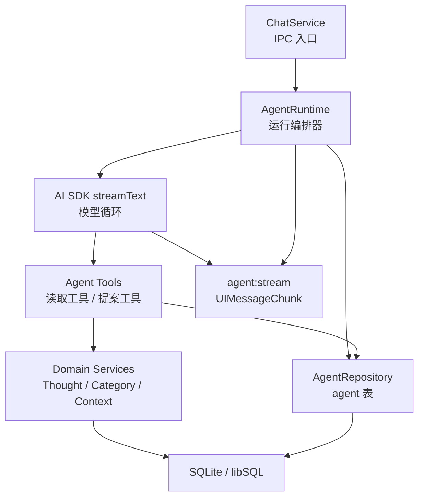
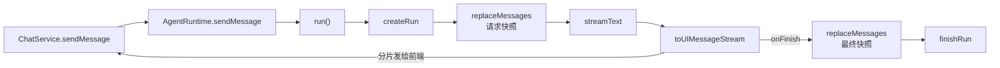
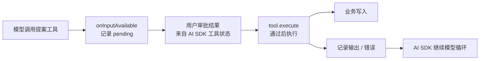
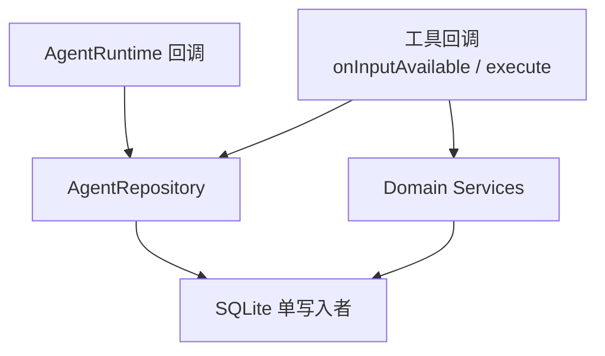
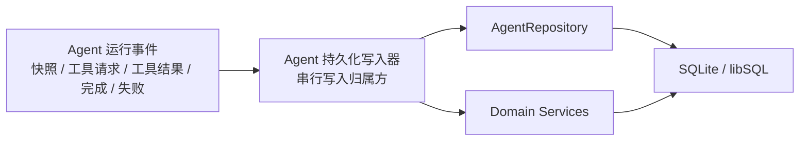

# Agent 后端架构

这份文档只描述 `main/services/agent` 的后端架构。前端只作为 IPC 调用方与 `UIMessageChunk` 消费方出现，前端状态架构见 `apps/electron/src/renderer/src/modules/chat/docs/state-architecture.md`。

## 心智模型

Agent 后端的核心是一条可中断、可调用工具、可持久化的运行。它不是前端聊天状态，也不是 UI 组件。

归属规则：

- **AgentRuntime**：拥有一次运行的生命周期，包括创建运行、选择模型、构造上下文、调用 AI SDK、发出流、结束 / 取消 / 失败运行。
- **AI SDK `streamText`**：拥有模型循环，包括助手文本、推理内容、工具调用、工具审批状态和输出分片。
- **Agent Tools**：把产品能力暴露给模型。读取工具只读；提案工具必须等待用户审批后再写。
- **Domain Services**：拥有 Thought / Category / Context 的真实业务写入。
- **AgentRepository**：拥有 agent 自己的表，包括对话、消息、运行、工具调用记录。
- **DB 写入层**：必须拥有写入顺序。SQLite 是单写入者，写入串行化是架构要求，不是错误处理细节。

## 发送运行路径

不变量：

- 后端收到的是前端给出的当前消息快照。
- 模型执行前，后端先保存请求快照。
- AI SDK 完成后，后端保存最终快照。
- 后端输出标准 `UIMessageChunk`，不向前端暴露内部实现状态。

## 工具提案路径

不变量：

- 确认 / 拒绝是 AI SDK 工具状态，不是用户消息。
- 一个依赖用户判断的提案必须先得到用户反馈，再继续依赖该结果的工作。
- 待审批、已确认、已拒绝、输出、错误都必须能被流或持久化状态表达。

## 持久化边界

当前系统性风险：写入分散在运行回调、工具回调、repository 和 domain service 中。

这不是单个边界情况：

- AI SDK 回调可能在流仍活跃时触发 DB 写。
- 工具执行可能同时写业务表和 agent 表。
- `onFinish` 可能在前一个工具持久化尚未完成时写最终消息。
- SQLite / libSQL 在写入重叠时会返回 `SQLITE_BUSY`。

目标归属：

规则：Agent 运行的持久化应该只有一个写入归属方。`busy_timeout` 和 WAL 可以降低锁冲突概率，但不能替代写入归属。

## 文件职责

- `runtime.ts`：运行生命周期与 AI SDK 编排。
- `tools.ts`：AI SDK 工具定义、审批元数据、工具执行。
- `repository.ts`：agent 表持久化。
- `context.ts`：为模型输入构造选中的上下文块。
- `model.ts`：provider / model 解析。
- `agent-system-prompt.md`：模型行为契约。
- `error.ts`：面向用户的错误格式化。

## 人工评审清单

- 是否新增了第二个运行状态归属方？如果是，停止。
- 是否从新的回调路径写 DB？如果是，必须经过统一持久化归属方。
- 一个工具写入是否同时写业务状态和 agent 状态？如果是，必须定义顺序和失败行为。
- 前端是否能观察待审批、已确认、已拒绝、输出、错误？
- 停止 / 取消后，运行和消息是否仍保持一致？
- 重试 / 重新生成是否发送干净的 AI SDK 消息快照？
- 模型输入是否只依赖后端可重建的状态，而不是前端临时状态？
