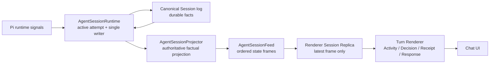
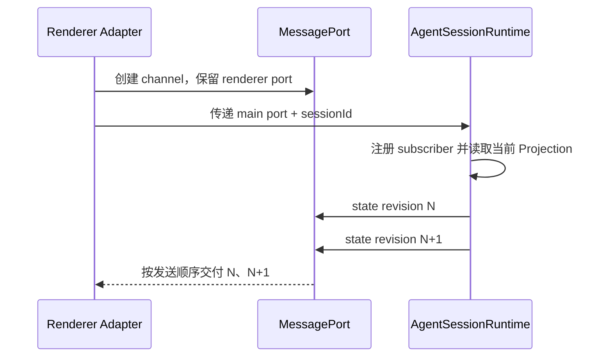
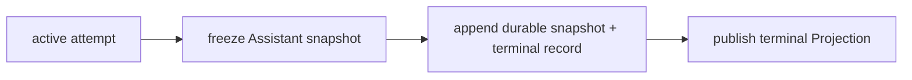

# Agent Session Projection 与实时 Feed 架构

本文按“事实来源 → 权威投影 → 有序交付 → UI 派生 → 生命周期与失败”的递进逻辑组织，因为 Agent 对话的正确性取决于事实如何逐层变成用户看到的界面。每一层再按状态所有权、跨进程传输、前端呈现和恢复测试四个维度检查，确保同一事实不会出现第二个归属方。分支与失败章节单独使用时序结构，因为这些场景的正确性取决于先后关系。

## 结论与范围

Agent Session 的 durable records 与 runtime-only changes 可以采用不同的保存策略，但它们只能在 Electron Main 内组合成一份权威的 `AgentSessionProjection`。Renderer 通过一条有序 Feed 接收完整、替换式 Projection，不读取 Session records，不归约 live changes，也不合并 snapshot 与 event。

这条规则解决的不只是重复回复，还统一约束以下场景：

- 首次打开和运行中重开对话；
- 窗口失焦、重新聚焦和 Renderer 重载；
- 编辑历史消息、重新生成和 branch replacement；
- Decision、工具执行、完成、失败、停止和上下文压缩；
- 标题生成、Markdown 导出等非 UI 会话读取。

本文不改变 Pi 模型循环、Citation 协议、知识检索或持久化文件格式。Entity Catalog 如何进入模型输入见 [Agent Citation 与 Entity Catalog 架构](./citation.md)；知识检索见 [知识检索与 RAG 如何工作](./rag.md)。

## 事实、投影与视图是三种不同状态

整个会话只有一条从事实到界面的路径：



三种状态的边界如下：

| 状态               | 表达的问题                      | 权威归属               | 是否持久化                                   |
| ------------------ | ------------------------------- | ---------------------- | -------------------------------------------- |
| Session facts      | 发生过什么                      | Canonical Session log  | durable records 持久化，token delta 不持久化 |
| Session Projection | 当前活动 branch 现在是什么状态  | Electron Main          | 运行期间驻留内存，可由 facts 重建            |
| Turn View          | 用户应该怎样理解一个 Agent Turn | Renderer Turn Renderer | 不持久化                                     |

Projection 不是新的事实来源。应用重启后，它从活动 branch 的 durable records 重建；运行中的 token、工具和审批变化则由 Main 内的 active attempt 更新。Renderer 只观察 Projection，不参与二者组合。

## 领域语言

### Agent Session

一个可持久化、可分支的 Agent 对话。共享协议、Main 和 Renderer 中统一使用 `sessionId`；`thread` 只保留为侧栏和路由中的 UI 用语。

### Agent Turn

一个由用户意义定义的工作周期，从用户请求开始，到 Agent 返回 Response、需要用户 Decision、失败或停止。Turn 从用户消息开始，并拥有下一条用户消息之前的有序 message parts；发起消息 ID 是稳定的 `turnId`。

### Agent Attempt

一次具体运行，对应 `runId`。重新生成或编辑会产生新的 Attempt，但不应把 `runId` 当成 Turn 身份。当前 Projection 只展示活动 branch 上的 Attempt，不把废弃 branch 的运行历史混入当前 Turn。

### Ordered Message Parts

Main 输出协议能够证明的事实，例如用户正文、Assistant text、Process Explanation、tool lifecycle、approval request/result 和 context compaction。Main 不输出颜色、卡片布局、展示文案或 React props。

Turn Renderer 根据 ordered message parts 派生 Activity、Decision、Candidate、Receipt 和 Response。它可以改变呈现分组，但不能补造协议没有证明的结果。

## 状态所有权

### Canonical Session log 拥有 durable facts

Session log 保存活动 branch 可重建所需的语义记录，包括用户消息、完成的 Assistant snapshot、审批、工具执行结果、Catalog 更新和运行终态。逐 token text/reasoning delta 只服务实时 Projection，不进入 durable log。

`assistant.turn` 是旧日志中的 Assistant message snapshot，不等同于领域里的完整 Agent Turn。Log Adapter 继续兼容这个名称，但共享 Projection 和 Renderer 不应继承该歧义。

### AgentSessionRuntime 是唯一写者

每个 Session 在 Main 中只有一个运行状态归属方。它顺序处理：

1. Pi runtime change；
2. durable append；
3. active attempt 更新；
4. Projection 发布。

同一个 lifecycle 不能同时由 `AgentRunAccumulator` 和 Renderer reducer 各自解释。完成、失败和停止时，durable Assistant snapshot 必须从最后一份 active attempt Projection 冻结出来，使实时状态与重开状态结构一致。

### AgentSessionProjector 只生成事实投影

Projector 是纯转换：

```text
active branch durable records + active attempt
→ AgentSessionProjection
```

Projection 至少包含：

- 有序 message projections；
- 当前 `runId` 与 Session status；
- Entity Catalog snapshot；
- context compaction history、active state 和 error；
- usage、context usage、model 与 stop reason 等协议事实。

`createdAt` 只用于显示和日志诊断，不能承担排序、去重或 branch 因果语义。

## Feed Interface

Renderer 只依赖一个窄 Interface：

```ts
export interface AgentSessionFeed {
  watch(
    sessionId: string,
    receive: (frame: AgentSessionFeedFrame) => void,
    signal: AbortSignal,
  ): void;
}

export type AgentSessionFeedFrame =
  | {
      kind: "state";
      revision: number;
      session: AgentSessionProjection;
    }
  | {
      kind: "error";
      error: AgentSessionFeedError;
    };
```

Interface 必须满足：

1. 第一份 `state` 是线性化快照；快照之前的变化已包含其中。
2. 同一 watch 内，后续 revision 严格递增并通过同一 FIFO channel 到达。
3. 每份 `state` 都是完整、权威、替换式状态；调用者不解释增量。
4. 重复或旧 revision 最多被 Adapter 丢弃，绝不能再次归约为业务变化。
5. `AbortSignal` 生效后，不再向该订阅交付 frame。
6. `run.failed` 属于 Session Projection；读取失败和 transport 关闭属于 Feed error。

revision 是 Main 进程内的交付顺序，不进入 Session log。应用重启或 Renderer 重连直接取得新快照，不需要持久 cursor、delta replay 或补发协议。

## Electron Adapter

Electron IPC 是跨进程 Seam，因此存在两个 Adapter：

- Production Adapter 使用 Electron 原生 `MessageChannel` / `MessagePort`；
- In-memory Adapter 直接发布 frame，用于 Interface 测试。

建立 watch 的顺序是：



注册 subscriber、读取当前内存 Projection 和发送首帧必须位于同一个 Main 线性化点。若初始化需要读取磁盘，Runtime 先完成该 Session 的唯一初始化 Promise，再同步完成“注册 + 首帧”；运行启动前也必须先初始化同一 Projection。

命令继续使用现有 invoke IPC。Feed 只负责读取状态，不自建双向 RPC，也不引入新的流库。

## Renderer Replica 与 Turn Renderer

Renderer 为每个正在观察的 Session 保存最后一份权威 frame，并通过 `useSyncExternalStore` 接入 React。Replica 只执行三件事：

1. 建立或关闭 watch；
2. 按 revision 接受最新完整 Projection；
3. 暴露 loading、ready 和 unavailable 状态。

Replica 不保存 event IDs、live event arrays、pending event queues 或 domain reducer。窗口 focus 不触发 Session refetch；组件重建时重新 watch 并获得完整快照。

TanStack Query 继续管理有限的 request/response 数据，例如 Session summaries、模型配置和实体显示。它不管理持续变化的活动 Session。Zustand 只保存真正的 UI 状态，例如选中 Session、Inspector、输入框 focus 和临时高亮，不镜像 `running`、`cancelled` 或 message ID。

Turn Renderer 仍位于 Renderer。它接收 Projection 中的 ordered messages/parts，构造用户可读的 Agent Turn。消息渲染模块不调用 IPC、不修改 Query cache，也不解释传输时序。

## 生命周期语义

### 首次打开与运行中重开

- idle Session 从活动 branch records 重建 Projection；
- active Session 直接读取 Main 中的 active Projection；
- 首帧已经包含 watch 线性化点之前的全部 live change；
- 后续 change 只通过更高 revision 出现一次。

因此不存在“snapshot 已含文本、Renderer 又 replay delta”的状态。

### 编辑与重新生成

编辑历史消息会改变活动 branch。Runtime 必须从 `SessionManager.getBranch()` 重建完整 Projection，再以一份新 revision 整体替换旧状态。废弃 branch 的 messages、Catalog 和 compactions 同时消失，不使用 latest run ID 或 timestamp 过滤。

重新生成保留用户消息的稳定 `turnId`，但创建新的 `runId`。当前 branch 只显示新 Attempt。

### 完成、失败与停止

成功、失败和停止采用同一提交顺序：



停止不能只保存 `run.cancelled` 而丢失用户已经看见的 partial Response。持久化失败时不得发布一个伪造的 durable terminal state；Feed 应保留最后可证明状态并报告失败。

### Context compaction

运行内 compaction 属于当前 Assistant message parts；独立 compaction 属于 Session-level history。开始和结束状态可以仅存在于 active Projection，成功结果仍以 durable semantic record 保存。Renderer 不从相邻时间戳猜测 compaction 应插入哪个 Turn。

## 性能与背压

正确性先于 wire 优化。初始实现按 UI frame 合并高频 text/reasoning changes，并发送最新完整 Projection；中间 token 不要求逐个可见。

只有在测量到长 Session 的 structured-clone 成本成为瓶颈后，Electron Adapter 才可以在私有 wire protocol 中改为“完整 active message/Turn 替换”。Renderer-facing Interface 仍返回完整 Projection，不能把 delta reconciliation 重新泄漏给 UI。

Feed 不是 exactly-once side-effect 队列。知识写入后的 entity cache invalidation 应由知识写入所属模块负责，不能依赖某一 Renderer 恰好观察到一次 tool event。

## 失败与恢复

| 场景                       | 行为                                            |
| -------------------------- | ----------------------------------------------- |
| Session 不存在或日志不可读 | Feed 返回 unavailable error，不构造空 Session   |
| MessagePort 关闭           | 当前 watch 结束；UI 可重新 watch 获取新快照     |
| Projection 构建失败        | 记录诊断并返回 feed error，不把旧状态冒充新状态 |
| Main 进程退出              | 不保存 revision；下次启动从 durable facts 重建  |
| Renderer 失焦              | watch 保持，状态不 refetch、不重放              |
| Renderer reload            | 旧 watch 关闭，新 watch 从完整快照开始          |

## 架构不变量

1. Renderer 永远不接收 `AgentEvent`、Pi entry 或 Session record。
2. Main 是 durable facts 与 active attempt 的唯一组合者。
3. 一个 Session 最多有一个 active Attempt 和一个权威 Projection。
4. 同一 watch 的首帧与后续变化来自同一条 FIFO channel。
5. Projection 更新是替换，不是让调用者解释的事件。
6. branch replacement 同时替换 messages、Catalog、compactions 和 runtime status。
7. live Assistant state 与最终 durable Assistant snapshot 来自同一个 projector。
8. `createdAt` 不参与排序、去重、分支选择或覆盖判断。
9. Turn Renderer 只负责用户意义和视觉分组，不拥有运行状态。
10. Session summaries 等有限查询与活动 Session Feed 使用不同的状态机制。

## 不采用的方案

| 方案                                               | 不采用原因                                               |
| -------------------------------------------------- | -------------------------------------------------------- |
| 为 raw events 增加 cursor 并继续在 Renderer reduce | 修复传输顺序但保留第二套 backend 状态机                  |
| 用 timestamp 判断 snapshot 覆盖了哪些 delta        | 时间只描述显示时刻，不能证明因果覆盖关系                 |
| 把 event reducer 收进 Zustand 或 TanStack Query    | 只移动复杂度，没有改变状态所有权                         |
| Main 输出 Activity/Decision/Receipt 卡片 DTO       | 把产品呈现策略固化到后端，削弱 Turn Renderer 边界        |
| 持久化每个 token delta                             | 放大日志、写入和恢复成本；完整 Assistant snapshot 已足够 |
| 设计持久 cursor、断点续传与 replay log             | 本地 Electron 重连可直接读取完整快照，没有对应需求       |

## Interface 验收测试

测试跨 `AgentSessionFeed` Interface，而不是只测试某个 merge helper：

- watch 首帧发送前发生新 delta，最终不丢失也不重复；
- streaming 时切换 Session、失焦、重新聚焦和重建组件；
- 相同或旧 revision 不产生第二次业务归约；
- 编辑历史后完整替换旧 branch，包括 Catalog 与 compactions；
- Decision → approved/rejected → Receipt；
- completion、failure、stop 后重开与最后一帧 live Projection 等价；
- port 关闭、日志损坏和 Session 不存在返回正确 Feed error；
- Production MessagePort Adapter 与 In-memory Adapter 遵守同一组契约测试。

## 主要代码边界

目标代码按职责放置：

- `main/services/agent/agent-session-runtime.ts`：单写者、active attempt 与发布；
- `main/services/agent/agent-session-projector.ts`：从 records/change 生成 Projection；
- `main/services/agent/pi-agent-host.ts`：Pi Adapter 与命令编排；
- `main/services/agent/pi-session-log.ts`：legacy log 兼容与 durable records；
- `preload/agent-session-feed.ts`：MessagePort Adapter；
- `renderer/modules/chat/session/agent-session-replica.ts`：最后一帧状态与 React subscription；
- `renderer/modules/chat/messages/agent-turn-view.ts`：Turn Renderer；
- `preload/typings/agent.ts`：共享事实、Projection 和 Feed protocol types。

命名目录可以随现有工程约定微调，但职责不能重新混合。

## Review 检查清单

- 是否新增了第二个 Session Projection 或 active run 状态归属方？
- Renderer 是否重新读取或归约 Agent events？
- snapshot 和后续更新是否经过同一个 ordered channel？
- branch edit 是否整体替换所有 branch-scoped state？
- stop/failure 是否保存用户已经观察到的 partial Assistant state？
- 是否把 UI display state、卡片布局或文案放进 Main？
- 是否为尚不存在的远程重放需求增加 cursor、ack 或 replay storage？
- 测试是否控制了真实订阅边界，而不是只验证纯 merge 函数？
