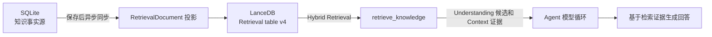
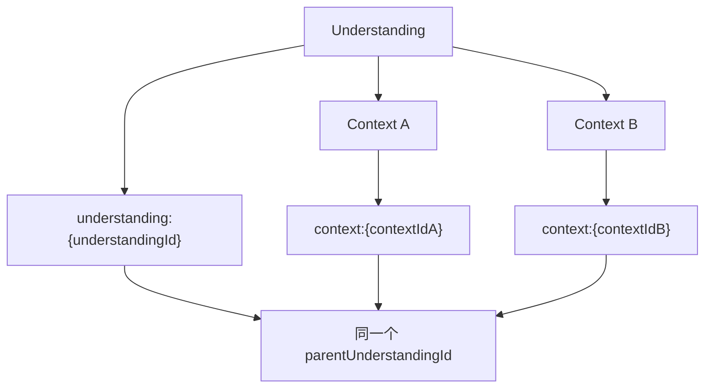
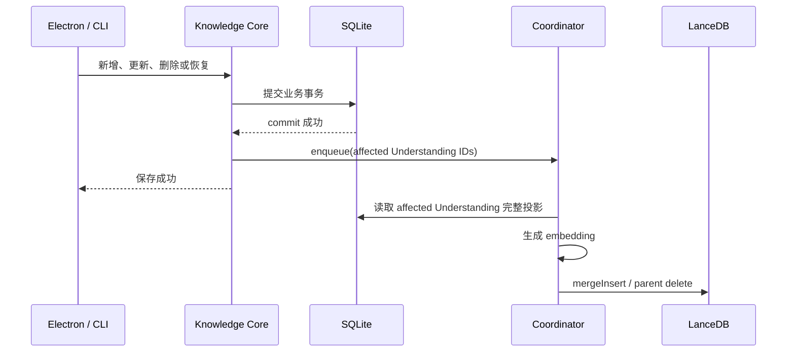
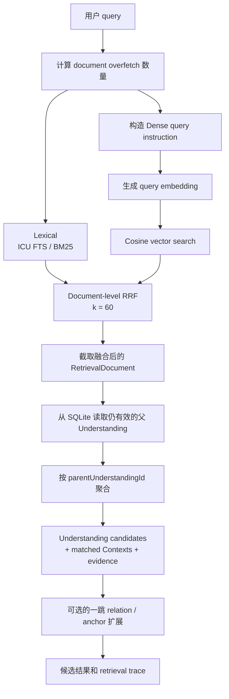

# RAG 检索架构

本文描述 Reflecta 当前的知识检索增强生成（RAG）实现：知识数据如何进入检索索引、一次 `retrieve_knowledge` 如何完成 Hybrid Retrieval，以及检索结果如何回到 Agent 的生成循环。

索引的异步队列、恢复和失败语义见 [Retrieval Index 同步机制](./retrieval-index-sync.md)。

## 心智模型

Reflecta 的 RAG 不是“把整篇笔记切块后只做向量搜索”，而是以产品领域对象为边界建立可重建的检索投影：



各层职责：

- **SQLite**：Understanding、Context、Domain 和显式关联的唯一事实源。
- **RetrievalDocument**：面向检索的确定性投影，不是新的业务事实。
- **LanceDB**：可删除、可重建的派生索引，同时承载 Lexical 和 Dense 检索。
- **`retrieve_knowledge`**：只负责召回、融合、聚合和证据组织，不生成最终回答。
- **Agent**：决定何时调用工具，并使用返回的知识证据继续生成。

## 索引文档模型

### 投影粒度

每个未删除的 Understanding 会投影为：

1. 一条 Understanding document；
2. 它的每个未删除 Context 各一条 Context document。

两类 document 都以 `parentUnderstandingId` 指回所属 Understanding。这样既能直接召回 Understanding 本身，也能通过某条具体 Context 命中它的父 Understanding。



### 两套检索文本

每条 `RetrievalDocument` 同时包含两种文本：

| 字段                   | 用途            | 内容组织                                                                                    |
| ---------------------- | --------------- | ------------------------------------------------------------------------------------------- |
| `textForLexicalSearch` | ICU FTS / BM25  | 标题、直接 Domain 名称、正文；Context 还包含 medium、Context 标题和内容                     |
| `textForEmbedding`     | Dense embedding | 带 `Understanding`、`Parent Understanding`、`Domain`、`Context medium` 等结构标签的完整文本 |

Lexical 文本强调用户可能直接输入的词；Embedding 文本保留实体角色和父子关系，帮助语义模型区分 Understanding 与 Context。

其余关键字段包括：

- `id`：`understanding:{id}` 或 `context:{id}`，作为增量 merge key；
- `entityType`、`entityId`：还原命中的领域对象；
- `parentUnderstandingId`：聚合和按 Understanding 同步的边界；
- Domain、medium、title、时间等 metadata；
- `contentHash`：稳定投影的 SHA-256，用于启动对账；
- `vector`：写入 LanceDB 时生成的 embedding。

投影输入中的 Domain 和 Context 会先稳定排序，再计算 `contentHash`。相同业务数据必须产生相同 document 和 hash。

## 更新路径

知识写入和索引写入刻意不处于同一个同步事务中：



更新以 **affected Understanding** 为单位，而不是以发生变化的单行作为单位。原因是一个 RetrievalDocument 会包含父 Understanding、直接 Domain 名称和 Context 内容；任一组成部分变化，都应重新生成该 Understanding 的完整 document 集合。

普通 Electron 保存不等待 embedding 或 LanceDB，因此存在一个很短的最终一致性窗口。CLI 写命令在退出前会 `flush()`，使下一条独立 CLI 搜索可以看到刚才的修改。

完整的触发矩阵、single-flight 队列和崩溃恢复规则见 [Retrieval Index 同步机制](./retrieval-index-sync.md)。

## Retrieve 主流程

`retrieveKnowledge({ query, anchors, limit })` 的主路径如下：



### 1. Document overfetch

最终返回单位是 Understanding，但检索单位是 RetrievalDocument。为避免多个 Context document 折叠到同一个 Understanding 后候选不足，Search Core 先取：

```text
max(limit × 3, limit + 5)
```

个融合 document。LanceDB 内部的 Lexical 和 Dense 两路又分别取：

```text
max(documentLimit × 5, 20)
```

个候选交给 RRF。

### 2. Lexical retrieval

Lexical 使用 LanceDB `0.31.0` 的 ICU FTS：

- query 原样传给 `MatchQuery`；
- 字段为 `textForLexicalSearch`；
- 多个 token 使用 `Operator.Or`；
- 排序由 BM25 完成；
- 不做应用层分词、同义词扩展、`text.includes(term)` 二次过滤或 SQLite fallback。

ICU 负责中文、英文及中英混合文本的 tokenization。OR 负责扩大召回，BM25 再根据词频、词的稀有度和文档长度决定排名。

### 3. Dense retrieval

Dense 路径会为原始 query 添加 Qwen retrieval instruction：

```text
Instruct: Given a Reflecta user query, retrieve relevant personal knowledge documents.
Query: {query}
```

既有的产品词汇提示只作用于 Dense query：query 出现“经验 / 经历 / 上下文”时补充 `Context`，出现“理解 / 认知”时补充 `Understanding`。Lexical query 不使用这层扩展。

query embedding 与 Lexical search 并行执行。向量检索使用 cosine distance。当 embedding provider 被禁用时，provider 返回零向量，Dense 路径不产生候选，系统退化为 Lexical-only。

### 4. RRF 融合

Lexical 的 BM25 score 与 Dense 的 cosine distance 不在同一量纲，不能直接相加。系统只使用两路排名，通过 Reciprocal Rank Fusion 融合：

```text
RRF(document) = Σ 1 / (60 + rank_channel(document))
```

实现中的 rank 从 1 开始。一个 document 同时出现在 Lexical 和 Dense 列表时会获得两项分数，因此通常优先于只被一路召回的 document。

RRF 在 **RetrievalDocument 层** 完成。融合结果会记录命中渠道 `lexical`、`dense` 或两者，供后续 evidence 和 trace 使用。

### 5. 聚合为 Understanding candidates

Search Core 用融合结果里的 `parentUnderstandingId` 回查 SQLite，只保留当前仍未删除的 Understanding，然后按父 Understanding 聚合：

- 第一次命中的 document 决定候选的基础 snippet；
- 候选 score 取其 document hit 的最高 RRF score；
- 候选排序取其 document 的最佳 rank；
- Understanding document 命中形成直接 evidence；
- Context document 命中进入 `matchedContexts`，同时保留 medium、title、snippet 和命中原因；
- 每个候选提供 `understanding_get` 建议，允许 Agent 按稳定 ID 读取完整 Understanding 及 Context。

### 6. 显式关系扩展

Hybrid Retrieval 完成后，Search Core 可以利用输入 anchors 和已有候选做一跳扩展：

- Understanding anchor 和已召回 Understanding 可沿显式 Understanding connection 找相邻节点；
- Domain anchor 可找直接关联的 Understanding；
- 已经召回的 ID 会去重；
- 关系候选只填充最终 `limit` 的剩余位置，不改变 Hybrid Retrieval 排名。

这一步是确定性的图关系补充，不是再次调用模型规划搜索，也不是 Agentic RAG 子循环。

`KnowledgeAnchor` 类型中的 Context anchor 当前不参与这一步关系扩展；现有实现只消费 Understanding 和 Domain anchors。

## 返回值与生成边界

`retrieve_knowledge` 返回：

- `candidates`：按 Understanding 聚合的候选；
- `matchedContexts`：真正命中的 Context 证据；
- `evidence`：命中渠道、document ID、rank、score 和原因；
- `suggestedRead`：进一步读取完整 Understanding 的稳定工具调用参数；
- `trace`：embedding model、projection version、两路命中数、RRF、聚合、关系扩展和最终数量。

工具本身不拼接 prompt，也不生成回答。Agent 收到工具结果后，决定是否继续读取完整实体，并在自己的模型循环中完成最终生成。这是 Reflecta 中“Retrieval-Augmented Generation”的生成边界。

## 一致性与降级语义

- SQLite 始终是真实数据；LanceDB 是可重建投影。
- Retrieve 不读取 coordinator 状态，不等待 pending update，也不执行 read-time repair。
- 保存后到 `mergeInsert` 提交前，Retrieve 可能短暂看到旧索引。
- `mergeInsert` 提交后，LanceDB 默认查询会同时扫描尚未进入 FTS index 的 fragment，因此无需等待 `optimize()`。
- 启动时 manifest 对账会修复进程退出前尚未完成的更新。
- 索引不存在时检索返回空列表；恢复职责属于后台 reconcile 或显式 rebuild，而不是 Retrieve。
- embedding 被禁用时只执行有效的 Lexical 召回，不伪造 Dense 命中。

## 不变量

修改 RAG 实现时必须保持：

1. RetrievalDocument 是派生数据，不成为第二事实源。
2. Lexical 与 Dense 对同一批 document 并行召回，融合发生在 document 层。
3. Lexical 使用原始 query；不得在 BM25 后追加字符串包含过滤。
4. RRF 只融合排名，不混合 BM25 score 与 vector distance。
5. Context 命中必须折叠回父 Understanding，并保留 Context evidence。
6. Retrieve 不承担同步、重建或故障修复职责。
7. 普通保存成功不依赖索引成功。
8. Agent 的生成循环与 Retrieval service 保持分离。

## 主要实现位置

- `packages/server/src/domains/retrieval/projection.ts`：RetrievalDocument 投影。
- `packages/server/src/domains/retrieval/lancedb-index.ts`：ICU FTS、Dense search 和 RRF。
- `packages/server/src/domains/retrieval/candidate-builder.ts`：document hit 到 Understanding candidate 的聚合。
- `packages/server/src/domains/search/core.ts`：Retrieve 编排、SQLite 有效性过滤和关系扩展。
- `apps/electron/src/main/services/agent/pi-readonly-tools.ts`：`retrieve_knowledge` Agent 工具边界。
- `packages/server/src/domains/retrieval/quality-benchmark.ts`：检索质量基准。
