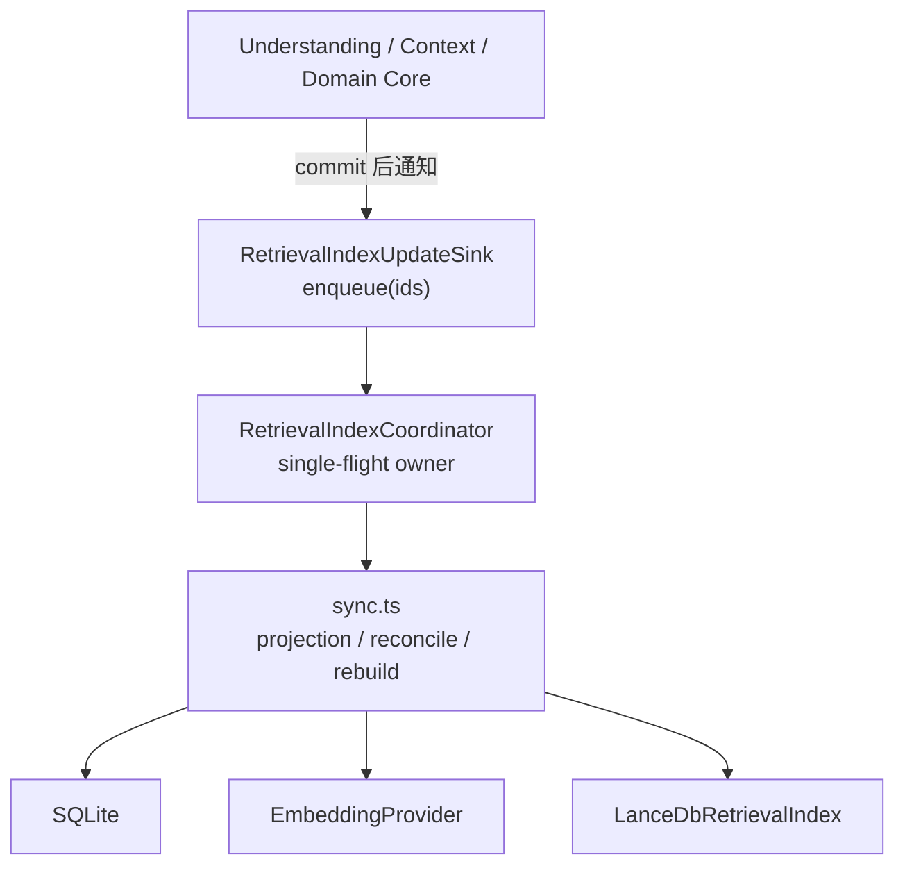
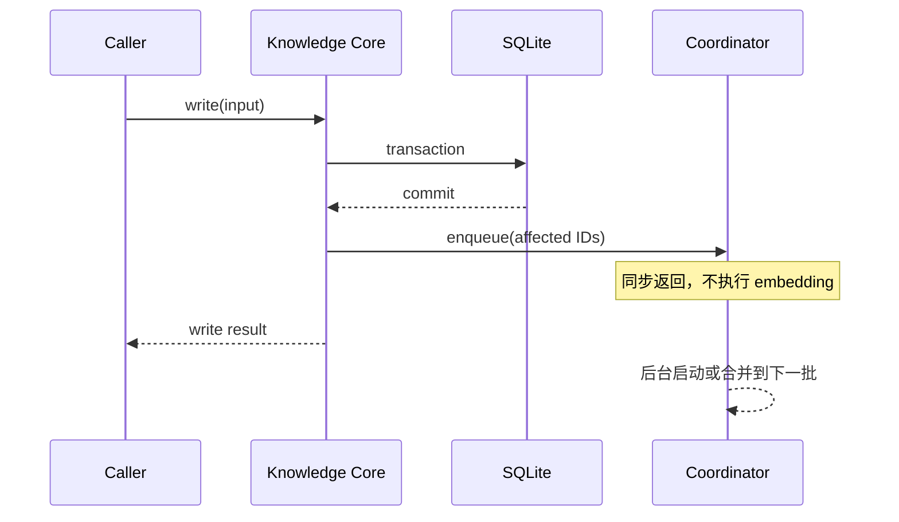
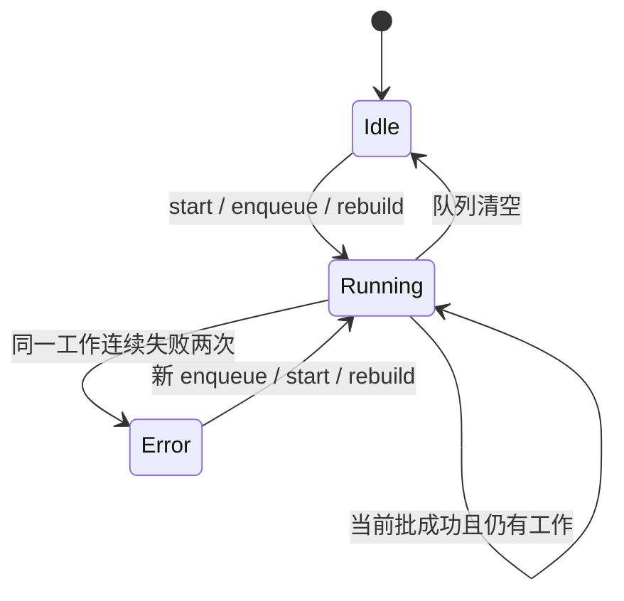
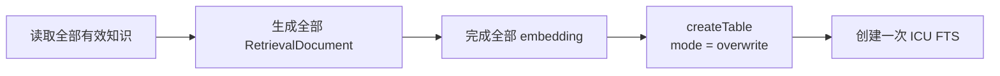
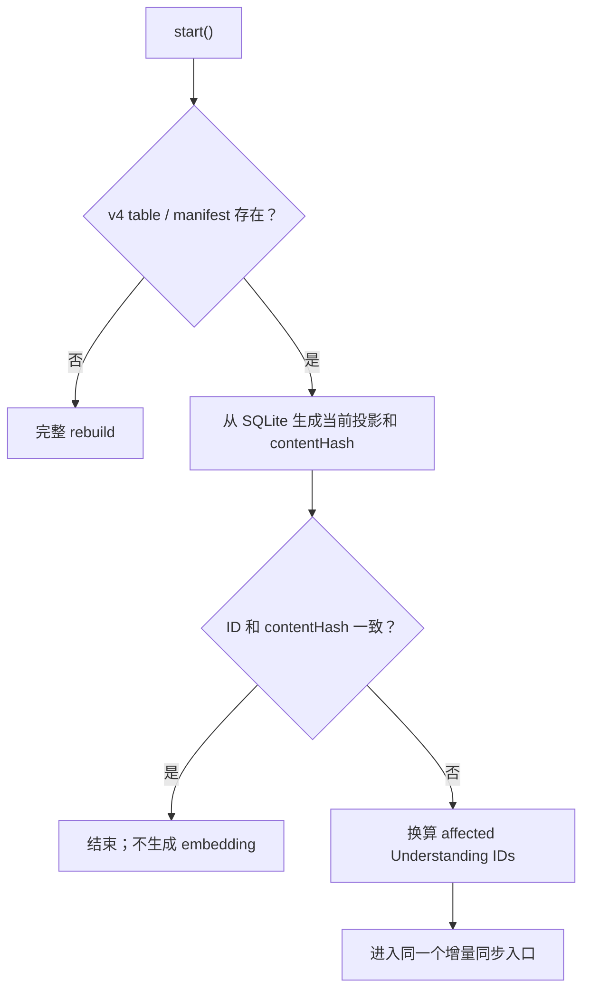
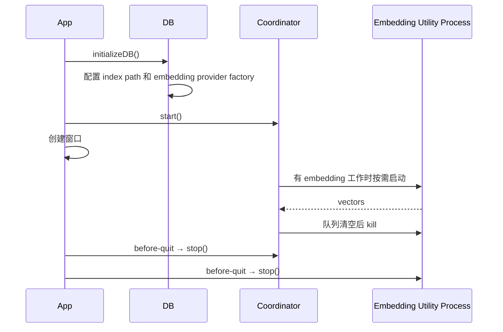

# Retrieval Index 同步机制

本文描述 SQLite 知识数据与 LanceDB Retrieval Index 之间的同步协议，包括更新通知、single-flight 调度、增量提交、启动恢复、索引维护及 Electron/CLI 生命周期。

RetrievalDocument 内容和 Hybrid Retrieve 算法见 [RAG 检索架构](./rag.md)。

## 设计目标

同步机制只解决一个问题：把 SQLite 的当前知识状态最终投影到 LanceDB，同时不把 embedding 和索引写入延迟放进用户保存路径。

核心约束：

1. SQLite 是唯一事实源，LanceDB 可随时完整重建。
2. 业务事务先提交，索引更新后异步执行。
3. 普通保存不等待 embedding、LanceDB 或 `optimize()`。
4. 同一进程内的索引写入 single-flight，不并发修改 LanceDB table。
5. 不持久化任务队列；崩溃恢复通过 SQLite projection 与 LanceDB manifest 对账完成。
6. Retrieve 接受短暂最终一致性，不参与同步。
7. FTS 的物理维护不等于数据同步成功。

## 组件与职责



职责边界：

- **Knowledge Core**：在业务写入成功后计算并通知 affected Understanding IDs；不 import LanceDB 或 coordinator 实现。
- **`RetrievalIndexUpdateSink`**：知识 Core 唯一依赖的窄接口，只暴露同步返回的 `enqueue(ids)`。
- **Coordinator**：拥有队列、single-flight、一次重试、公开状态、rebuild 排序和 optimize cadence。
- **`sync.ts`**：从 SQLite 构造投影，实现增量同步、manifest reconcile 和完整 rebuild。
- **`LanceDbRetrievalIndex`**：拥有 table schema、embedding 后的 row、`mergeInsert`、delete、FTS 创建和 `optimize()`。
- **Embedding runner**：Electron 中按需启动 Utility Process，队列清空后释放模型内存。

## 同步单位：affected Understanding

最小同步单位是 Understanding 的完整 document 集合：一条 Understanding document 加上其全部有效 Context documents。

它不是单条变更记录，因为以下字段会跨实体进入同一个投影：

- Understanding title 和 body；
- Understanding 直接关联的 Domain 名称；
- Context medium、title 和 content；
- 所有 document 共用的父 Understanding metadata。

### 触发矩阵

| 业务操作                                         | 入队 ID                                  |
| ------------------------------------------------ | ---------------------------------------- |
| 新增、更新、软删除、恢复、永久删除 Understanding | 当前 Understanding                       |
| 新增、更新、软删除、恢复、永久删除 Context       | Context 所属 Understanding               |
| Context 移动                                     | 原 Understanding 和新 Understanding      |
| 修改 Understanding 的 Domain 关联                | 当前 Understanding                       |
| Domain 改名                                      | 直接关联该 Domain 的 Understanding       |
| Domain 删除                                      | 删除前直接关联该 Domain 的 Understanding |
| Domain 创建                                      | 不入队                                   |
| Domain 排序或只修改父级                          | 不入队                                   |

Domain 层级路径没有进入当前 RetrievalDocument，所以只改父级和排序不会改变投影。

## 保存路径



规则：

- 只有 SQLite commit 成功后才 enqueue。
- `enqueue()` 返回 `void`，调用方不得 `await`。
- `enqueue()` 不得向业务写路径抛错；即使调度失败，SQLite 写入仍然成功。
- Core 只注入 `RetrievalIndexUpdateSink`，不依赖 Electron、全局 dirty 函数或检索模块的内部状态。

## Coordinator 调度模型

Coordinator 内部维护：

- `pendingIds: Set<string>`：下一批待处理 Understanding；
- `running?: Promise<void>`：唯一后台 run loop；
- `reconcileRequested`：启动对账请求；
- `rebuildRequested`：显式完整重建请求；
- `modificationOperations`：距离下一次 optimize 的成功增量操作计数；
- `lastError` 和当前 `progress`。

### 工作优先级

每轮按固定顺序取一种工作：

```text
rebuild > reconcile > pending incremental IDs
```

- rebuild 开始时会清除当时已有的 reconcile 请求和 pending IDs，因为完整重建已经覆盖它们。
- rebuild 运行期间到达的新写入会进入新的 `pendingIds`，在 rebuild 之后继续处理。
- reconcile 运行期间到达的新写入同样进入下一批，避免对账快照覆盖较新的保存。

### Single-flight 与批次合并



具体语义：

- 空闲时 `enqueue()` 立即 kick，不设置 debounce、max-wait 或轮询。
- 当前批执行时到达的 ID 只进入下一批，绝不并发写 LanceDB。
- `Set` 保证同一个 Understanding 在一批内只处理一次。
- 当前批完成后立即处理下一批，因此连续保存会自然合并，但没有人为等待窗口。
- `flush()` 一直等待当前批和后续批全部结束；它只供 CLI、手动操作和测试使用。
- `stop()` 停止接收工作并清空未开始的请求；进程退出后的遗漏由下次启动 reconcile 修复。

### 重试与错误

一次 reconcile、incremental sync 或 rebuild 失败后立即原样重试一次：

```text
第一次失败 → 立即重试 → 再次失败 → lastError
```

连续两次失败后：

- SQLite 不回滚；
- 当前 coordinator 状态变为 `error`；
- 已经可查询的旧 table 仍保持原样；
- 失败批次不通过 dirty marker 持久化；下次启动 reconcile 或手动 rebuild 会从事实源重新推导差异。

`optimize()` 使用不同的错误语义，见“FTS 增量维护”。

## 增量同步

### 1. 构造当前投影

Coordinator 把一批去重后的 Understanding IDs 交给 `syncRetrievalIndexByUnderstandingIds()`：

1. 检查当前 v4 table 是否存在；不存在则转为完整 rebuild。
2. 从 SQLite 读取未删除的 affected Understandings。
3. 读取它们的直接 Domain refs 和未删除 Contexts。
4. 为每个 Understanding 重新生成完整 RetrievalDocument 集合。
5. 对所有 document 生成 embedding。
6. embedding 全部成功后才开始 LanceDB 写入。

被删除的 Understanding 不会产生 source documents，但它的 ID 仍保留在本批 parent 范围中，用于清除旧索引行。

### 2. 原子 merge 语义

增量 source 与 target 的定义：

```text
source = SQLite 当前生成的 affected Understanding 全部 documents
target = LanceDB 中 parentUnderstandingId 属于本批的 rows
```

非空 source 使用一次 `mergeInsert("id")`：

| source / target 状态      | 动作                                                       |
| ------------------------- | ---------------------------------------------------------- |
| 相同 document ID 同时存在 | `whenMatchedUpdateAll()`                                   |
| 只存在于 source           | `whenNotMatchedInsertAll()`                                |
| 只存在于本批 target 范围  | `whenNotMatchedBySourceDelete({ where: parentPredicate })` |

如果 source 为空，则使用一次 `parentUnderstandingId` predicate delete。这覆盖 Understanding 永久删除、软删除或其最后一批索引行需要移除的情况。

与旧式 `delete → add` 相比，`mergeInsert` 只产生一次版本化提交；Retrieve 观察到提交前或提交后的 table 版本，不依赖应用层补偿中间态。

## 完整重建

完整 rebuild 用于：

- v4 table 不存在；
- embedding model 改变后 table name 改变；
- 设置页显式重新构建；
- retrieval config 变化触发后台 reconcile/rebuild；
- 增量入口发现当前索引尚未 ready。

执行顺序：



先完成全部 embedding，再 overwrite table，避免 embedding 失败破坏当前可用表。FTS 只在建表时创建，配置为：

```text
baseTokenizer = icu
withPosition = false
```

增量更新不调用 `createIndex()`，完整 rebuild 后也不额外调用 `optimize()`。

## 启动恢复：manifest reconcile

Coordinator `start()` 不阻塞 Electron 窗口创建，它只设置 reconcile 请求并启动后台 run loop。

对账流程：



LanceDB manifest 只读取：

```text
{ id, parentUnderstandingId, contentHash }
```

比较规则：

- SQLite 中新增 document：其 parent Understanding 受影响；
- 相同 ID 但 hash 不同：其 parent Understanding 受影响；
- LanceDB 中存在、SQLite 中消失的 document：索引记录的 parent Understanding 受影响；
- ID 和 hash 完全一致：直接完成，不加载 embedding 模型。

manifest 是状态对账视图，不是 dirty 状态。系统不保存 pending task、时间戳 marker 或第二份同步数据库。

## FTS 增量维护

### `mergeInsert` 后为什么立即可搜索

新写入或更新后的 row 可能暂时位于尚未进入 FTS index 的 fragment。LanceDB 默认查询会合并：

```text
已有 FTS index 结果 + unindexed fragment scan 结果
```

因此数据正确性在 `mergeInsert` 提交时成立，不需要同步重建 FTS，也不需要 Retrieve 等待维护。代码不得启用会忽略最新 fragment 的 `fastSearch()`。

### optimize cadence

每个成功的增量数据批次贡献一次 `operationCount`。累计 20 次后，Coordinator 在同一个后台 run loop 中调用：

```text
table.optimize()
```

`optimize()` 负责 compact fragments、清理旧版本并增量更新索引。它是物理性能维护，不是逻辑同步提交：

- 不重新生成 embedding；
- 不完整重建 FTS；
- 不阻塞业务保存；
- Retrieve 不等待它；
- 计数只保存在内存，重启归零不影响正确性；
- 失败只记录 warning，并保留计数，使后续成功更新再次尝试；
- optimize 失败不设置 `lastError`，因为已经 merge 的数据仍然可查询。

完整 rebuild 返回 `operationCount = 0`；它刚创建了新表和 FTS，不需要立即 optimize。

## Electron 与 CLI 生命周期

### Electron



- Electron service 把同一个 coordinator 注入 Understanding、Context、Domain BFF。
- 保存 IPC 只完成 SQLite 写入和 enqueue。
- `getRetrievalIndexStatus()` 直接读取 coordinator 状态。
- 手动 `rebuildRetrievalIndex()` 等待 rebuild 完成后返回状态。
- 修改 retrieval config 后应用新配置，并在后台触发完整 rebuild。

本地 llama.cpp 模型不在 Electron 主进程常驻。第一个 embedding 请求启动 Utility Process；同一模型的连续请求复用该进程；队列清空后立即退出，释放模型与 native runtime 内存。

### CLI

CLI 创建同一种 coordinator 和 sink：

1. service 初始化时 `start()` 并完成启动 reconcile；
2. 写命令提交后通过 sink enqueue；
3. CLI 命令执行完成、进程退出前调用 `flushRetrievalIndexUpdates()`；
4. 同步失败输出 warning，但命令仍保留已经成功的 SQLite 写入结果。

只有真正发生写入时 CLI 才执行退出前 flush。

## 状态语义

公开状态为：

```text
not_ready | indexing | ready | error
```

| 状态        | 含义                                                        |
| ----------- | ----------------------------------------------------------- |
| `not_ready` | 当前 model/version 对应的 LanceDB table 不存在              |
| `indexing`  | run loop 正在运行，或仍有 rebuild/reconcile/pending 工作    |
| `ready`     | table 存在且当前没有同步错误；允许存在未 optimize fragments |
| `error`     | 数据同步、reconcile 或 rebuild 连续两次失败                 |

`progress` 只表示当前 `preparing`、`embedding` 或 `writing` 阶段。系统不存在 `dirty` 状态；pending work 由 coordinator 内存直接表达，崩溃后的差异由 manifest 重新推导。

## Retrieve 的同步边界

Retrieve 永远直接查询 LanceDB，不做：

- coordinator 状态检查；
- pending ID 检查；
- `flush()` 或等待；
- SQLite lexical fallback；
- dirty marker 读取；
- read-time merge、过滤或索引修复；
- `createIndex()`、rebuild 或 `optimize()`。

其一致性语义是：

```text
SQLite commit
    ├─ mergeInsert 尚未提交：Retrieve 可能看到旧索引
    └─ mergeInsert 已提交：Retrieve 看到新版本，包括未 optimize fragment
```

这是有意选择的最终一致性边界，不提供 Electron 保存后的 read-your-write 保证。CLI 通过退出前 flush 提供命令级的可见性。

## 不变量与禁止项

修改同步实现时必须保持：

1. 业务事务提交先于 enqueue。
2. 保存路径不等待索引工作。
3. 同一时刻只有一个 LanceDB 数据写任务。
4. 一批同步先完成全部 embedding，再写 table。
5. 增量更新只使用 `mergeInsert` 或 parent delete，不重建 FTS。
6. `optimize()` 失败不能否定已经成功的数据提交。
7. Retrieve 不承担同步补偿。
8. 启动恢复只依赖事实源和 manifest，不依赖持久化 dirty 状态。
9. projection version、embedding model 和 tokenizer 共同决定 table identity；不兼容索引使用新表重建。

禁止重新引入：

- `.dirty`、`.dirty-understandings` 或任何 marker 文件；
- 定时轮询 scheduler；
- 保存时同步 embedding；
- 增量后的 `createIndex(..., { replace: true })`；
- Retrieve 中的 SQLite fallback 或 `flush()`；
- 为旧 table、旧 tokenizer 或旧同步 API 保留兼容分支。

## 主要实现位置

- `packages/server/src/domains/shared/types.ts`：`RetrievalIndexUpdateSink`。
- `packages/server/src/domains/{understanding,context,domain}/core.ts`：commit 后的 affected ID 通知。
- `packages/server/src/domains/retrieval/coordinator.ts`：single-flight、重试、状态和 optimize cadence。
- `packages/server/src/domains/retrieval/sync.ts`：projection 读取、incremental sync、reconcile 和 rebuild。
- `packages/server/src/domains/retrieval/lancedb-index.ts`：manifest、merge/delete、FTS 和 optimize。
- `apps/electron/src/main/retrievalIndexCoordinator.ts`：Electron coordinator 单例。
- `apps/electron/src/main/retrievalEmbeddingRunner.ts`：按需启动和释放本地 embedding Utility Process。
- `apps/cli/src/services.ts`：CLI coordinator、sink 和退出前 flush。
