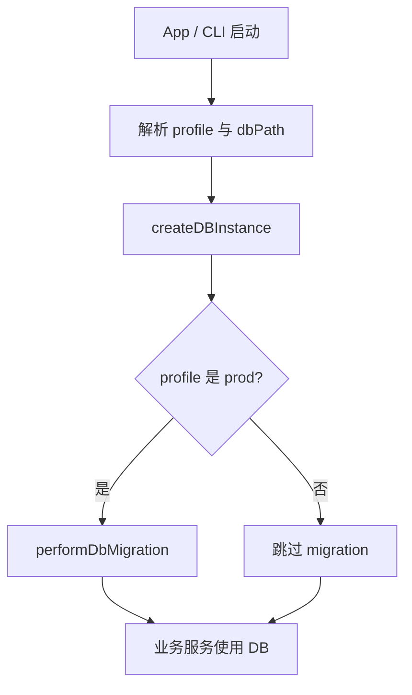

# 数据迁移技术方案

Reflecta 使用两套策略处理数据库结构变化：

- **prod**：通过版本化 SQL migration 自动升级用户数据库。
- **dev**：通过 Drizzle schema push 重建开发库，方便频繁改 schema。

这两套流程共享同一份业务 schema，但运行时行为不同。

## 数据目录

| Profile | 用途                   | 默认目录                                                           |
| ------- | ---------------------- | ------------------------------------------------------------------ |
| `dev`   | 开发、seed、随时重建   | `~/Library/Application Support/reflecta-dev`                       |
| `prod`  | 用户真实数据、打包应用 | Electron `userData` / CLI `~/Library/Application Support/reflecta` |

环境变量优先级：

1. `REFLECTA_DB_PATH`：显式指定 DB 文件。
2. `REFLECTA_PROFILE`：选择 `dev` 或 `prod`。
3. 默认 profile：Electron 开发态为 `dev`，打包态为 `prod`；CLI 默认为 `prod`。

## Runtime 初始化

数据库入口是 `createDBInstance(dbPath, { runMigrations })`。



prod 启动时会读取 `packages/server/src/db/migration/sql/*.sql`，按文件名顺序执行尚未记录在 `_migrations` 表里的 SQL。

dev 启动时不执行 migration。dev schema 由显式命令维护。

## Prod 迁移流程

prod migration 是用户数据安全路径：

1. 每次正式 schema 变更都新增一个 SQL 文件。
2. SQL 文件提交到 `packages/server/src/db/migration/sql`。
3. App 发布后，用户第一次启动新版 app 时自动执行未应用 migration。
4. 执行成功后写入 `_migrations`，避免重复执行。

prod 不依赖用户手动运行命令，也不要求用户安装开发工具。

## Dev 迁移流程

dev 追求改 schema 快，不保留开发数据。

常规流程：

```bash
bun run db:reset:dev
bun run db:push:dev
bun run db:seed:dev
bun run dev:gui
```

命令含义：

- `db:reset:dev`：删除 dev DB。
- `db:push:dev`：用 `packages/server/src/db/schema.ts` 同步 dev DB。
- `db:seed:dev`：写入测试数据并补齐 FTS 表。
- `dev:gui`：使用 dev profile 启动 Electron。

`db:push:dev` 只用于开发库，不作为 prod 升级机制。

## FTS 表

Drizzle schema 只描述普通业务表。SQLite FTS5 虚拟表由 SQL 负责创建：

- prod：通过 `001_seed.sql` 创建。
- dev：`db:push:dev` / `db:seed:dev` 会补齐 `fts_thoughts` 和 `fts_contexts`。

业务写入时由 service 层维护 FTS 数据。

## 发布检查

改动 schema 时，至少确认：

```bash
bun run db:reset:dev
bun run db:push:dev
bun run db:seed:dev
bun run typecheck
bun run lint
bun run fmt:check
```

如果 schema 变更要进入 prod，还必须新增 SQL migration。只改 `schema.ts` 不会升级用户数据库。
