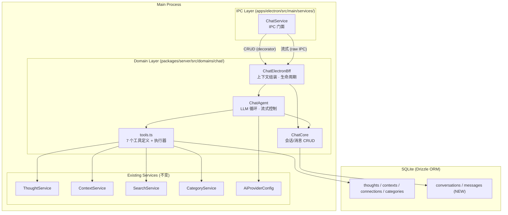
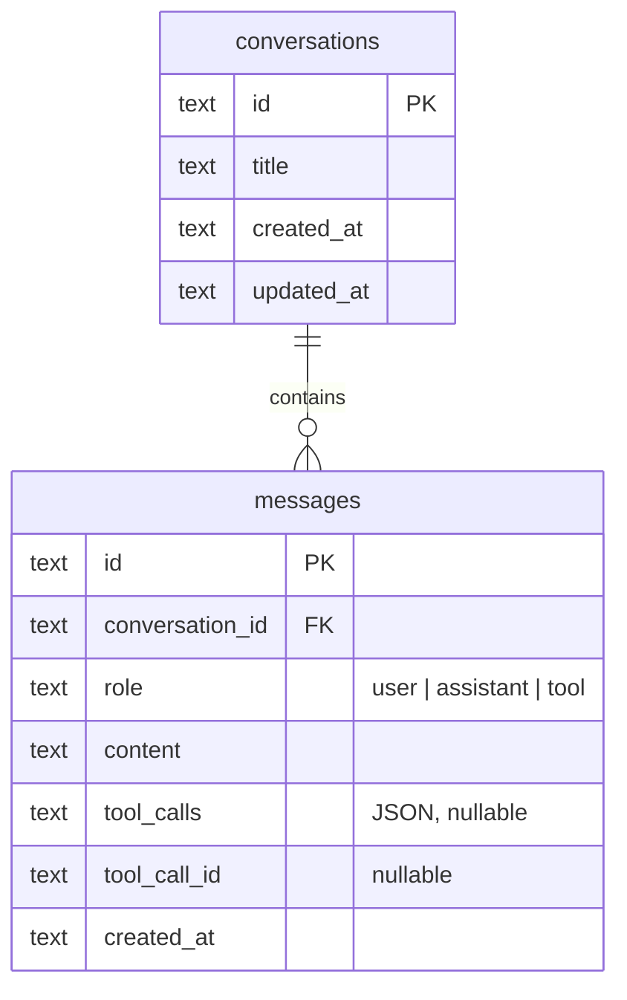
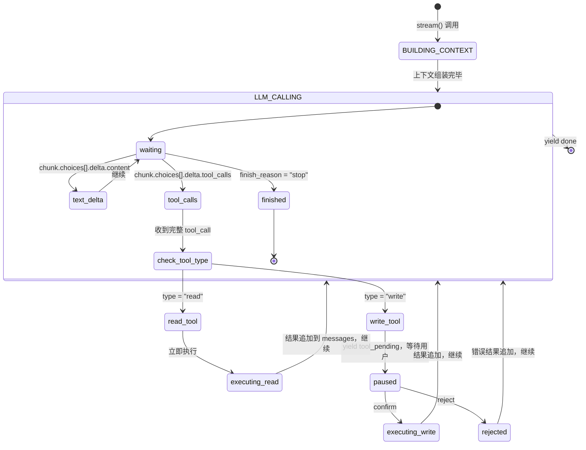
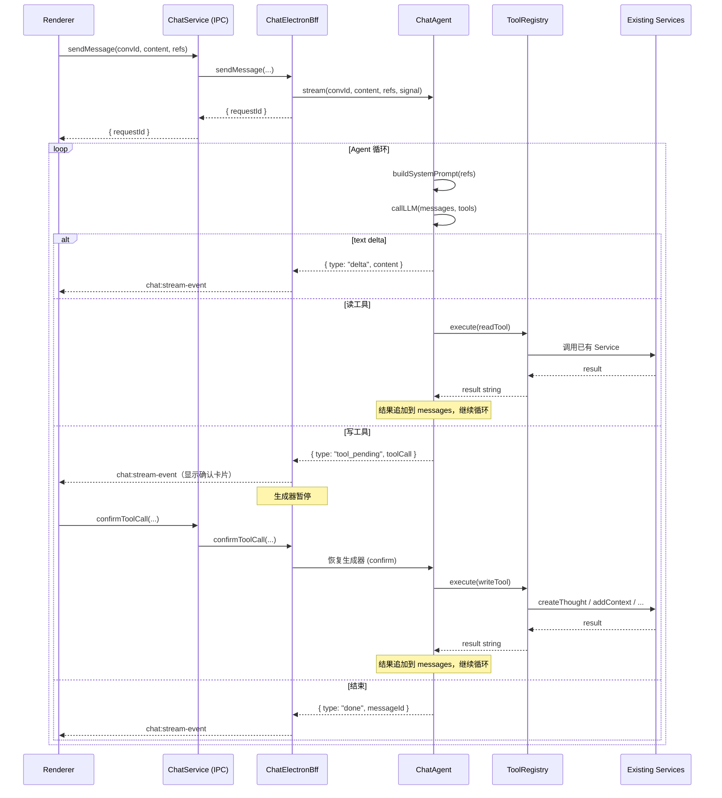
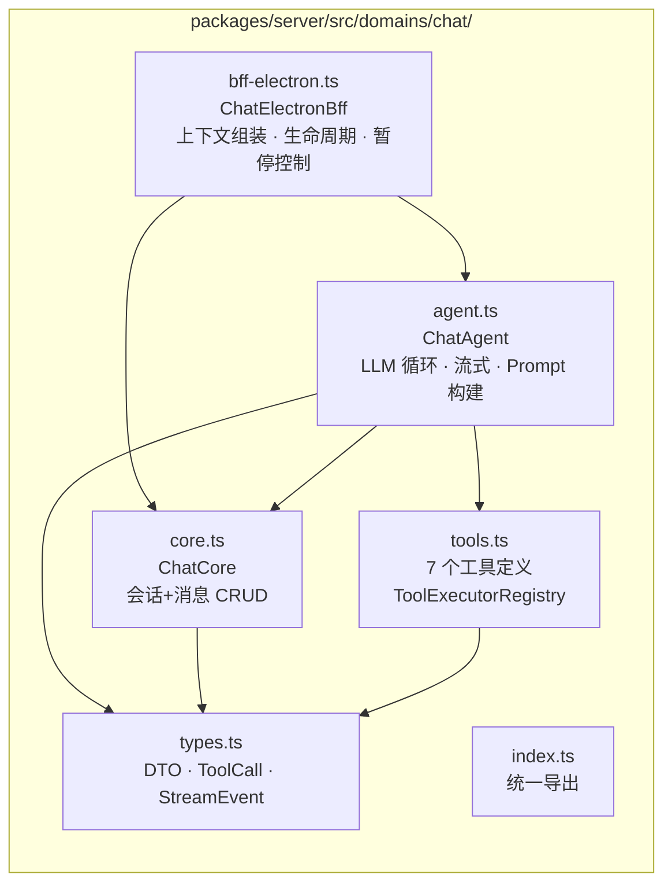
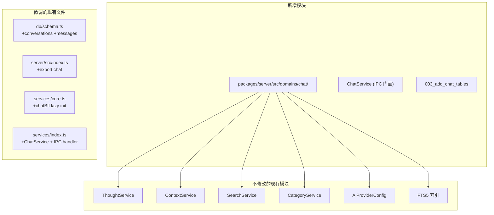

# Agent 对话 — 后端架构

> 创建时间：2025-07-17
> 状态：架构设计
> 前置文档：`drafts/agent-chat-discovery.md`（需求）、`drafts/agent-chat-architecture.md`（总架构）

---

## 一、分层架构

**两层 IPC 通道：**

- **CRUD：** `electron-ipc-decorator`（`@IpcMethod()` 装饰器，invoke/return）
- **流式：** 原始 IPC（`webContents.send` → `ipcRenderer.on`），因为 decorator 不支持 push

---

## 二、新增数据模型

- `tool_calls` 用 JSON 字段存 OpenAI function calling 的完整调用信息，不另建关联表（数据量小）
- `tool_call_id` 仅 role=`"tool"` 时使用，关联回 assistant 消息中的具体 tool_call

---

## 三、Agent 状态机

---

## 四、工具执行协议

**读/写工具差异：**

|      | 读工具                                      | 写工具                                                                 |
| ---- | ------------------------------------------- | ---------------------------------------------------------------------- |
| 数量 | 3（search / get_detail / get_neighborhood） | 4（create_insight / update_thought / add_context / create_connection） |
| 执行 | Agent 自主执行                              | 用户确认后执行                                                         |
| 流式 | 不中断                                      | 暂停 → 确认/拒绝 → 恢复                                                |
| 渲染 | 无 UI                                       | ToolCallCard 确认卡片                                                  |

---

## 五、领域层文件职责

| 文件              | 职责                                                           | 依赖外部                                                 |
| ----------------- | -------------------------------------------------------------- | -------------------------------------------------------- |
| `types.ts`        | DTO、StreamEvent 联合类型、AgentContextInput                   | 无                                                       |
| `core.ts`         | `ChatCore` — 会话 & 消息 CRUD，纯 DB 操作                      | `ReflectaDb`                                             |
| `tools.ts`        | 7 个工具的 function schema + `ToolExecutorRegistry`            | Thought/Context/Search/Category Service                  |
| `agent.ts`        | `ChatAgent` — System Prompt 构建 + LLM 调用循环 + 流式事件生成 | `ReflectaDb`、`AiProviderConfig`、`ToolExecutorRegistry` |
| `bff-electron.ts` | `ChatElectronBff` — 上下文组装、Agent 生命周期、暂停-恢复控制  | `ChatCore`、`ChatAgent`                                  |
| `index.ts`        | 统一导出                                                       | 上述所有                                                 |

---

## 六、与现有代码的关系

**原则：** 所有新增能力放在新文件。对现有文件的修改仅限于注册/导出——不碰现有业务逻辑。

---

## 七、关键架构决策

| 决策           | 选择                    | 理由                                                     |
| -------------- | ----------------------- | -------------------------------------------------------- |
| Agent 运行位置 | Main Process            | 唯一访问 DB 的进程；API Key 安全；写工具需调现有 Service |
| 流式通道       | 原始 IPC push           | `electron-ipc-decorator` 只支持 req/res，不支持 push     |
| 写工具确认     | 生成器暂停-恢复         | 工具结果影响后续输出，不能预生成后替换                   |
| 知识检索       | FTS5（已有）            | ~50 条 thought，无需引入向量库                           |
| 工具存储       | JSON 字段               | 数据量小，避免 JOIN                                      |
| System Prompt  | 每次动态构建            | 上下文随 @ 的 thought 变化                               |
| 配置           | 复用 `AiProviderConfig` | 已有 API Key / Base URL / Model 配置                     |
